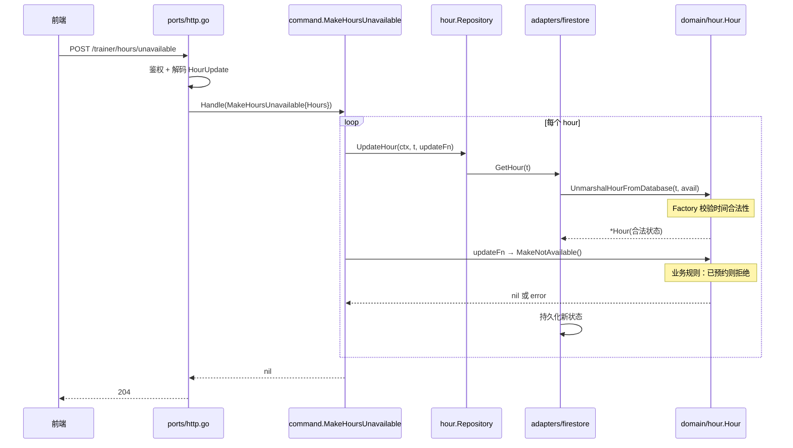

# 002 DDD Lite 入门：让业务规则回到它该在的地方

> 对应 wild-workouts README 第 6 篇。
> 知识点：**充血领域模型 + 工厂 + 值对象**。

## 一、理论抽象

### 1.1 DDD Lite 的三个核心动作

| 动作 | 目的 | Go 落地手法 |
| --- | --- | --- |
| **充血模型** | 把业务规则收敛到实体方法 | 字段私有 + 行为方法 |
| **工厂** | 保证「创建即合法」 | `NewXxx` 构造器 + `Factory` 配置类 |
| **值对象** | 用类型系统消灭非法值 | 私有字段的 struct 代替 `type X string` |

### 1.2 关键技巧：用 struct 而非 `type X string` 做枚举

`type Availability string` 是字符串别名，任何字符串都能赋值。改成「私有字段的 struct」后，外部只能通过预定义变量获取合法值。

### 1.3 双构造器模式

| 构造器 | 用途 | 校验范围 |
| --- | --- | --- |
| `NewAvailableHour` / `NewNotAvailableHour` | 业务侧创建 | 走 `validateTime` 全套校验 |
| `UnmarshalHourFromDatabase` | 从数据库还原 | 校验时间格式，但允许任意 availability |

数据库里可能存着历史数据（如过去的档期），用 `NewAvailableHour` 会因为「不能创建过去的时间」而报错，所以需要单独的还原构造器。

### 1.4 带字段的错误类型

定义 `TooDistantDateError struct { MaxWeeks, ProvidedDate }` 而不是 `errors.New("invalid date")`，调试时能直接拿到「传了哪个日期、合法值是多少」。

---

## 二、时序图

以「教练把某个小时标记为不可用」为例：



两个关键点：
1. 从数据库还原走 `UnmarshalHourFromDatabase`，仍经过 Factory 校验
2. 状态变更走 `Hour.MakeNotAvailable()`，业务规则封装在方法内

---

## 三、代码实现

### 1. 充血模型 + 双构造器

[domain/hour/hour.go](file:///d:/Blog/backup/tmp/ddd/wild-workouts-go-ddd-example/internal/trainer/domain/hour/hour.go)

字段私有，外部只能读不能写：

```go
type Hour struct {
    hour         time.Time      // 小写：包外不可直接访问
    availability Availability
}
```

业务构造器走 `validateTime`：

```go
func (f Factory) NewAvailableHour(hour time.Time) (*Hour, error) {
    if err := f.validateTime(hour); err != nil {
        return nil, err
    }
    return &Hour{hour: hour, availability: Available}, nil
}
```

还原构造器允许任意 availability：

```go
// UnmarshalHourFromDatabase unmarshals Hour from the database.
// It should be used only for unmarshalling from the database!
// You can't use UnmarshalHourFromDatabase as constructor - It may put domain into the invalid state!
func UnmarshalHourFromDatabase(...) (*Hour, error) { ... }
```

### 2. 工厂配置类

[domain/hour/hour.go L17-L96](file:///d:/Blog/backup/tmp/ddd/wild-workouts-go-ddd-example/internal/trainer/domain/hour/hour.go#L17-L96)

```go
type FactoryConfig struct {
    MaxWeeksInTheFutureToSet int   // 最多预约未来几周
    MinUtcHour               int   // UTC 最早几点
    MaxUtcHour               int   // UTC 最晚几点
}
```

`Validate()` 用 `multierr.Append` 累积多条错误，一次性返回所有配置问题。Factory 把配置私有化（`fc FactoryConfig` 小写），保证运行期不被篡改。

### 3. 值对象 + 业务方法

[availability.go](file:///d:/Blog/backup/tmp/ddd/wild-workouts-go-ddd-example/internal/trainer/domain/hour/availability.go)

私有字段 struct 做枚举：

```go
type Availability struct {
    a string
}

var (
    Available         = Availability{"available"}
    NotAvailable      = Availability{"not_available"}
    TrainingScheduled = Availability{"training_scheduled"}
)
```

字符串还原走白名单匹配：

```go
func NewAvailabilityFromString(s string) (Availability, error) {
    switch s {
    case "available": return Available, nil
    case "not_available": return NotAvailable, nil
    case "training_scheduled": return TrainingScheduled, nil
    }
    return Availability{}, errors.New("invalid availability")
}
```

每个状态转移都自带前置条件：

| 方法 | 前置条件 | 失败错误 |
| --- | --- | --- |
| `MakeNotAvailable` | 未被预约 | `ErrTrainingScheduled` |
| `MakeAvailable` | 未被预约 | `ErrTrainingScheduled` |
| `ScheduleTraining` | 当前可用 | `ErrHourNotAvailable` |
| `CancelTraining` | 已被预约 | `ErrNoTrainingScheduled` |

### 4. 带字段的错误类型

[hour.go L147-L184](file:///d:/Blog/backup/tmp/ddd/wild-workouts-go-ddd-example/internal/trainer/domain/hour/hour.go#L147-L184)

```go
type TooDistantDateError struct {
    MaxWeeksInTheFutureToSet int
    ProvidedDate             time.Time
}
```

### 5. Handler 退化成「编排 + 错误转换」

[app/command/schedule_training.go L39-L50](file:///d:/Blog/backup/tmp/ddd/wild-workouts-go-ddd-example/internal/trainer/app/command/schedule_training.go#L39-L50)

```go
func (h scheduleTrainingHandler) Handle(ctx context.Context, cmd ScheduleTraining) error {
    if err := h.hourRepo.UpdateHour(ctx, cmd.Hour, func(h *hour.Hour) (*hour.Hour, error) {
        if err := h.ScheduleTraining(); err != nil {  // 调用领域方法
            return nil, err
        }
        return h, nil
    }); err != nil {
        return errors.NewSlugError(err.Error(), "unable-to-update-availability")
    }
    return nil
}
```

Handler 没有任何业务 if 检查——规则被 `ScheduleTraining()` 和 Factory 收走。

### 6. 领域单元测试：纯内存、无 mock

[hour_test.go](file:///d:/Blog/backup/tmp/ddd/wild-workouts-go-ddd-example/internal/trainer/domain/hour/hour_test.go) 不需要任何 mock，毫秒级跑完。可直接断言 `TooDistantDateError` 结构体相等——因为错误带字段，断言能精确到「传了哪个日期」。
