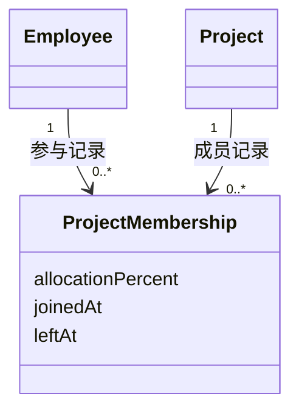
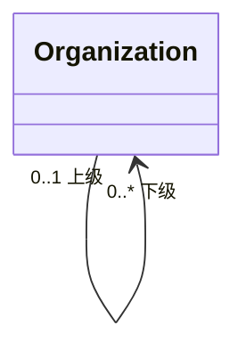
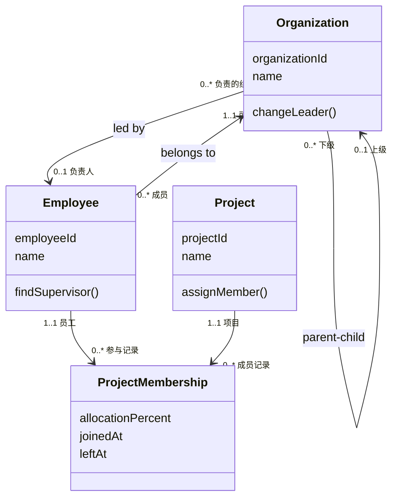

领域建模可以分为两个阶段：

1. 通过头脑风暴收集和理解领域知识；
2. 把头脑风暴产生的材料整理成领域模型。

头脑风暴的结果只是领域建模的输入，不是最终的领域模型。事件、命令和领域名词仍然需要经过合并、拆分、抽象和验证，才能形成稳定的领域知识。

## 1. 从头脑风暴中应该获得什么输入

头脑风暴可以采用事件风暴的方法进行。它的核心不是便利贴或画图工具，而是让业务人员和技术人员共同还原业务过程，通过讨论发现遗漏、消除分歧，并逐渐形成统一语言。

整个过程遵循两个原则：

- **结果导向**：先识别已经发生的业务结果，再反推产生结果的操作；
- **先发散、后收敛**：先允许参与者独立表达，再共同讨论、合并和修正。

头脑风暴最终应该为领域建模提供以下六类输入。

### 1.1 领域事件

领域事件是业务过程中已经发生，并且业务人员关心的事实，例如：

```text
合同已签订
员工已分配到项目
工时已登记
```

领域事件通常使用完成时命名，中文可以使用“已”表示事情已经发生。

识别领域事件时，先由参与者分别写出自己认为重要的事件，再按业务发生顺序排列，最后共同讨论：

- 是否存在同义事件；
- 一个事件是否包含了多个结果，需要拆分；
- 正常流程中是否有遗漏；
- 各参与者对事件含义的理解是否一致。

技术事件和查询功能不属于领域事件。例如“HTTP 请求已发送”和“查询客户列表”都不是业务状态发生变化的结果。

### 1.2 命令

命令是引发领域事件的业务操作，可以从事件反向识别：

```text
签订合同       → 合同已签订
为项目分配员工 → 员工已分配到项目
登记工时       → 工时已登记
```

命令描述“希望系统做什么”，领域事件描述“系统完成后发生了什么”。

通过命令可以检查事件是否合理：如果一个事件找不到对应的业务操作，就需要继续确认它是由其他事件触发、由系统自动产生，还是根本不属于领域事件。

### 1.3 命令的执行者

识别命令时，需要同时确认谁执行了命令。执行者可以是人，也可以是外部系统或内部任务。

执行者应该记录为业务角色，而不是具体的人，例如：

```text
销售人员
项目经理
人事人员
外部系统
```

同一个命令可能有多个执行者。例如“更换客户经理”既可能由客户经理本人执行，也可能由其上级执行。

此时不必立即判断执行者最终是实体、岗位还是权限角色，先把业务使用的名称记录下来，留到建模阶段分析。

### 1.4 命令需要的查询数据

执行一个命令之前，用户或者系统通常需要先获得一些数据。例如：

```text
命令：签订合同
查询：客户、合同内容

命令：为项目分配员工
查询：项目、员工、员工当前投入情况
```

有些命令不需要查询数据，有些命令需要多个查询结果。

还要注意，系统中存在不依附于命令的纯查询功能。事件风暴以状态变化为主，这类查询不一定能被自然识别出来，因此需要在头脑风暴结束后单独补充。

### 1.5 领域名词

从领域事件、命令、执行者和查询数据中提取名词性概念，例如：

```text
租户、企业、组织、员工、岗位、客户、合同、项目、工时记录
```

可以把围绕同一个名词的事件、命令、执行者和查询数据放在一起，形成一个领域名词分组。

当一个命令同时涉及两个领域名词时，可以复制一份，分别放入两个分组。例如“为项目分配员工”既放到“项目”分组，也放到“员工”分组。

需要注意：**领域名词只是领域对象的候选材料，不等于已经识别出的实体。**

一个领域名词最终可能是：

- 实体；
- 值对象；
- 对象的属性；
- 对象承担的角色；
- 对象之间的关系；
- 一个业务操作；
- 与其他名词相同或需要重新命名的概念。

这些判断属于领域建模阶段，不要在头脑风暴中急于完成。

### 1.6 业务规则

在讨论事件和命令的过程中，还会发现大量业务规则，例如：

- 只有销售人员才能担任客户经理；
- 一个组织最多只能有一个负责人；
- 一个员工必须属于一个组织；
- 员工在同一时刻的预计投入比例总和不能超过 100%；
- 一个员工在同一个项目上的参与时间段不能重叠。

业务规则通常出现在“必须”“只能”“不能”“至少”“最多”等表达中。发现规则时应立即记录，但不必在头脑风暴阶段确定它最终属于哪个领域对象。

### 1.7 头脑风暴的输出汇总

头脑风暴结束时，应至少获得下面这些建模输入：

| 输入 | 需要回答的问题 | 示例 |
| --- | --- | --- |
| 领域事件 | 业务上已经发生了什么 | 合同已签订 |
| 命令 | 什么操作导致事件发生 | 签订合同 |
| 执行者 | 谁执行命令 | 销售人员 |
| 查询数据 | 执行命令前需要知道什么 | 客户、合同内容 |
| 领域名词 | 业务围绕哪些概念展开 | 客户、合同、员工 |
| 业务规则 | 什么条件必须满足 | 只有销售人员才能签订合同 |

事件风暴的结果可以保存为便利贴照片、电子图或表格。如果团队已经使用用户故事、用例或需求文档长期保存需求，事件风暴可以只作为沟通过程的快照；如果没有其他需求载体，则应把事件风暴结果电子化并持续维护。

## 2. 如何对输入进行领域建模

领域建模的目标有两个：

1. 把领域知识可视化，让业务人员和技术人员对业务形成一致理解；
2. 形成能够指导程序设计、数据库设计和编码命名的领域模型。

领域建模不是把头脑风暴中的所有名词直接画成类，而是不断对这些材料进行分类、关联、抽象和验证。

### 2.1 初步识别领域对象

建模可以从事件风暴产生的领域名词开始。第一步可以暂时假设每个名词都是一个实体，把它们画到类图中，然后在后续分析中修正。

识别时重点判断：

- 这个名词是不是系统真正需要管理的业务对象；
- 它是否具有独立身份；
- 它是否有自己的生命周期；
- 它是独立对象，还是另一个对象的属性；
- 它是对象本身，还是对象在某种关系中的角色；
- 它是否只是一个业务操作。

DDD 中的领域对象主要包括实体和值对象：

- **实体**通过身份区分，即使部分属性变化，仍然是同一个对象；
- **值对象**由属性值定义，不强调独立身份。

领域建模初期不必列出全部字段。如果对象名称已经能够表达含义，可以暂时只写名称；只有名称不足以帮助理解时，才补充少量关键属性。

### 2.2 识别对象之间的关联

领域对象不是孤立存在的，需要识别它们之间的业务关系。常见关系包括一对一、一对多、多对多和自关联。

#### 使用四个问题确定多重性

假设存在对象 A 和 B，可以依次询问：

1. 一个 A 最多可以对应多少个 B？
2. 一个 A 最少可以对应多少个 B？
3. 一个 B 最多可以对应多少个 A？
4. 一个 B 最少可以对应多少个 A？

由此得到更加准确的多重性：

| 表示 | 含义 |
| --- | --- |
| `1..1` | 有且仅有一个 |
| `0..1` | 可以没有，最多一个 |
| `1..*` | 至少一个，可以有多个 |
| `0..*` | 可以没有，也可以有多个 |

例如：

- 一个组织可以有零个或多个员工；
- 一个员工必须属于一个组织。

那么组织与员工之间是一对多关系，并且两端的多重性分别是 `1..1` 和 `0..*`。

#### 2.2 一对一关系不一定需要合并

两个对象一对一关联，并不代表它们一定应该合并。判断依据是两者的业务关注点是否相同。

例如租户和企业可能一一对应，但它们关注的问题不同：

- 租户关注 SaaS 客户协议、资源分配、收费和数据隔离；
- 企业关注组织结构和人员管理。

因此它们仍然可以是两个独立的领域对象。

#### 2.3 多对多关系可以转成关联实体

员工和项目之间可能是多对多关系：一个项目有多名员工，一个员工也可以参与多个项目。

当关系本身拥有属性时，这些属性既不属于员工，也不属于项目，例如：

- 预计投入百分比；
- 加入项目时间；
- 退出项目时间。

此时可以把多对多关系提升为一个关联实体，例如“项目成员关系”：



原来的多对多关系由此转化为两个一对多关系。

#### 2.4 使用自关联表示层级

组织具有上下级关系时，可以让组织与自身建立关联：



自关联必须标明两端角色，否则无法看出哪一端表示上级、哪一端表示下级。

#### 2.5 使用角色区分不同关系

同一类对象之间可能存在多种业务关系，需要通过角色名区分。例如员工与项目之间可以同时存在：

- 员工作为项目经理的一对多关系；
- 员工作为项目成员的多对多关系。

管理员、人事人员、销售人员也未必是独立实体，它们可能只是员工承担的岗位或角色。

### 3. 对领域对象进行抽象

头脑风暴得到的名词经常只是业务表象，需要进一步寻找它们背后的共同概念。

例如企业、开发中心、开发组和直属部门都具有上下级、成员和负责人，可以抽象为“组织”，再使用“组织类别”区分不同类型：

```text
组织
├── 组织类别：企业
├── 组织类别：开发中心
├── 组织类别：开发组
└── 组织类别：直属部门
```

抽象以后，组织层级发生变化时，不需要为每种组织类型重新建立大量关联，员工也只需要关联组织。

抽象的目的不是消除所有重复，而是找到更加稳定的业务概念。判断一个抽象是否合理，可以询问：

- 业务人员是否认可这个共同概念；
- 原来的对象是否遵循相同的业务关系；
- 增加新的类别时，模型是否无需大幅修改；
- 抽象后是否仍然能够表达各对象的重要差异。

### 4. 识别领域对象的操作

领域模型不仅描述对象及其属性，还要描述对象能够执行的业务操作。

可以用事件风暴中的命令逐个走查：

```text
命令 → 作用的领域对象 → 需要执行的操作 → 产生的结果
```

部分领域名词经过分析后，会发现它们并不是对象，而是操作。例如“客户经理上级”“项目经理上级”不是新的实体，而是“获取员工上级”这一操作的不同使用场景。

该操作可能包含以下规则：

1. 如果员工不是所属组织的负责人，则该组织负责人是员工上级；
2. 如果员工是所属组织的负责人，则上级组织的负责人是员工上级。

在 UML 中，操作可以写在类的操作栏中，使用“操作名 + 参数”的形式表达。

### 5. 使用约束补充类图

对象、属性和关联并不能表达全部领域知识。无法直接通过结构表达的规则，可以在 UML 中使用 `{}` 表示约束，例如：

```text
{只有企业类别的组织才能成为租户对应的企业}
{只有销售人员才能担任客户经理}
```

约束不是普通说明，而是系统必须实现的业务规则。因此图中的约束还要同步写入业务规则表，不能只保留在图中。

### 6. 把领域对象划分为模块

当所有对象都放在一张类图中时，关系会形成“蜘蛛网”，造成认知负担。可以把相关对象组织成高内聚、低耦合的模块，例如：

```text
租户管理
组织管理
项目管理
工时管理
```

UML 可以使用包表示模块。理解模型时分成两个层面：

- 宏观层面使用包图，只看模块以及模块之间的依赖；
- 微观层面进入模块内部，查看实体、属性、操作和关联。

需要区分**模块依赖和对象关联**：

- **关联**表示领域对象之间存在业务联系；
- **依赖**表示一个模块需要使用另一个模块提供的对象或能力。

例如项目管理依赖组织管理中的员工，工时管理依赖员工和项目，但不意味着所有对象都要放在同一个模块。

### 7. 完善业务规则和词汇表

领域建模会发现头脑风暴阶段没有暴露出来的新规则。所有规则都应该汇总到业务规则表中，而不是散落在便利贴、类图注释和口头讨论中。

推荐格式：

| 编号 | 模块 | 业务规则 | 关联对象或操作 |
| --- | --- | --- | --- |
| R001 | 组织管理 | 一个组织最多只能有一个负责人 | 组织、员工 |
| R002 | 项目管理 | 员工的预计投入比例总和不能超过 100% | 项目成员关系 |
| R003 | 项目管理 | 员工在同一项目的参与时间段不能重叠 | 项目成员关系 |

同时，把事件风暴和领域模型中的重要词汇汇总为词汇表：

| 中文名称 | 英文名称 | 定义 | 禁用或易混淆名称 |
| --- | --- | --- | --- |
| 组织 | Organization | 企业内部能够形成上下级关系的组织单元 | 部门 |
| 项目成员关系 | Project Membership | 员工在某段时间内参与项目的关系 | 项目员工 |

词汇表有两个作用：

1. 让业务人员和技术人员使用相同的名称；
2. 为类名、字段名、接口名等程序命名提供依据。

### 8. 领域模型应该包含哪些知识

建模完成后，领域知识至少应该包含：

| 知识 | 主要内容 |
| --- | --- |
| 领域对象 | 实体、值对象及少量关键属性 |
| 关联关系 | 一对一、一对多、多对多、自关联 |
| 多重性 | 关系两端允许的最小和最大数量 |
| 角色 | 对象在某段关系中承担的身份 |
| 关联实体 | 关系自身拥有的属性和历史 |
| 操作 | 领域对象承担的业务行为 |
| 约束和规则 | 系统必须实现的业务限制 |
| 模块 | 对象的分组以及模块之间的依赖 |
| 统一语言 | 标准业务词汇、英文名和定义 |

### 9. 领域建模的实用技巧

#### 9.1 如何用 UML 类图表达领域知识

UML 类图不是数据库 ER 图。它表达的是业务人员能够理解的领域对象、对象承担的行为，以及对象之间的业务关系。

一个类通常分为三栏：

```text
┌──────────────────────┐
│ 类名：领域对象        │
├──────────────────────┤
│ 关键属性              │
├──────────────────────┤
│ 业务操作()            │
└──────────────────────┘
```

画领域模型时，每一栏遵循以下原则：

| 内容 | 表达什么 | 注意事项 |
| --- | --- | --- |
| 类名 | 领域对象 | 使用词汇表中的标准名，采用单数名词 |
| 属性 | 理解对象所必需的特征 | 只画关键属性，不展开全部数据库字段 |
| 操作 | 对象承担的业务行为 | 使用业务动词，不画保存、查询、日志等技术方法 |

类图中的连线表示对象之间的关联。每条关联应尽量表达三项知识：

1. **关联语义**：两个对象为什么存在关系；
2. **两端角色**：对象在关系中分别承担什么角色；
3. **多重性**：关系两端允许的最小和最大数量。

例如，下面的类图表达了组织、员工、项目和项目成员关系：



从这张图中可以直接读出：

- 员工必须属于一个组织，一个组织可以有多个员工；
- 一个组织最多有一个负责人，一个员工可以负责多个组织；
- 组织可以有多个下级组织，但最多只有一个上级组织；
- 员工和项目的多对多关系被转换为 `ProjectMembership` 关联实体；
- 预计投入比例和参与时间属于“参与关系”，不属于员工或项目本身；
- `findSupervisor()`、`assignMember()` 表达领域对象承担的业务操作。

无法只靠对象和连线准确表达的规则，可以在图旁使用 UML 约束，例如：

```text
{一个员工在同一时刻的预计投入比例总和不能超过 100%}
{同一员工在同一项目上的参与时间段不能重叠}
```

约束仍然要同步进入业务规则表。类图负责帮助读者快速理解结构，规则表负责完整、准确地保存约束。

当类图过于复杂时，不要继续把所有对象堆在一张图中。先使用包图展示模块及其依赖，再为每个模块分别绘制类图：

```text
宏观：包图展示模块和依赖
微观：类图展示模块内的对象、属性、操作和关联
```

最后使用事件风暴中的命令走查类图：命令作用的对象能否找到，对象是否具有相应操作，操作涉及的关联和约束是否已经表达。无法解释真实命令的类图，需要继续调整。

#### 9.2 其他建模技巧

可以把前面的过程总结为以下技巧：

1. 从领域事件出发，以业务结果而不是页面和接口为起点；
2. 头脑风暴先发散后收敛，不要过早压制冲突和重复；
3. 把领域名词当作候选材料，不要直接映射为实体和数据库表；
4. 用关系两端的最小值、最大值四个问题确定多重性；
5. 一对一是否合并，要看业务关注点是否相同；
6. 多对多关系拥有属性或历史时，把它提升为关联实体；
7. 自关联和重复关联必须写明角色；
8. 抽象业务共性，而不是只因为字段相似就抽象；
9. 使用命令走查对象的操作，检查模型能否解释真实业务；
10. 图中的约束必须同步进入业务规则表；
11. 模型过于复杂时先划分模块，分别观察宏观依赖和模块内部结构；
12. 持续维护词汇表，让文档和代码使用同一套名称；
13. 使用 UML 类图表达对象、关键属性、业务操作、关联、角色和多重性，再用规则表补充图无法完整表达的约束。

### 10. 领域知识应该以什么形式保存

领域知识不应该只保存为一张类图。图适合表达结构，但不适合完整表达规则和词义。推荐使用下面四类产物：

| 产物 | 推荐形式 | 保存内容 |
| --- | --- | --- |
| 头脑风暴记录 | 事件风暴图或表格 | 事件、命令、执行者、查询、领域名词 |
| 领域模型 | UML 类图 | 对象、关键属性、操作、关联、角色、多重性、约束 |
| 模块模型 | UML 包图 | 模块划分和模块依赖 |
| 配套知识 | 业务规则表、领域词汇表 | 无法只靠图准确表达的规则和统一语言 |

如果希望使用 Markdown 统一维护，可以采用一个最小结构：

```text
domain-model/
├── brainstorming.md   # 头脑风暴结果，可选长期维护
├── model.md            # 类图、包图及必要说明
├── rules.md            # 业务规则表
└── glossary.md         # 领域词汇表
```

其中：

- 图可以使用 Mermaid、PlantUML 或其他 UML 工具维护；
- 表格适合使用 Markdown 或电子表格；
- 图中的对象名称必须与词汇表一致；
- 图中的约束必须能在业务规则表中找到；
- 业务规则发生变化时，应同时检查类图和词汇表是否受到影响。

最终应形成一组彼此一致的领域知识：

```text
头脑风暴材料
    ↓ 提炼
领域模型图 + 模块图
    ↓ 补充
业务规则表 + 领域词汇表
```

领域模型的价值不在于图画得多复杂，而在于它能否准确表达业务，并让业务人员和技术人员对同一个概念、关系和规则达成一致。
