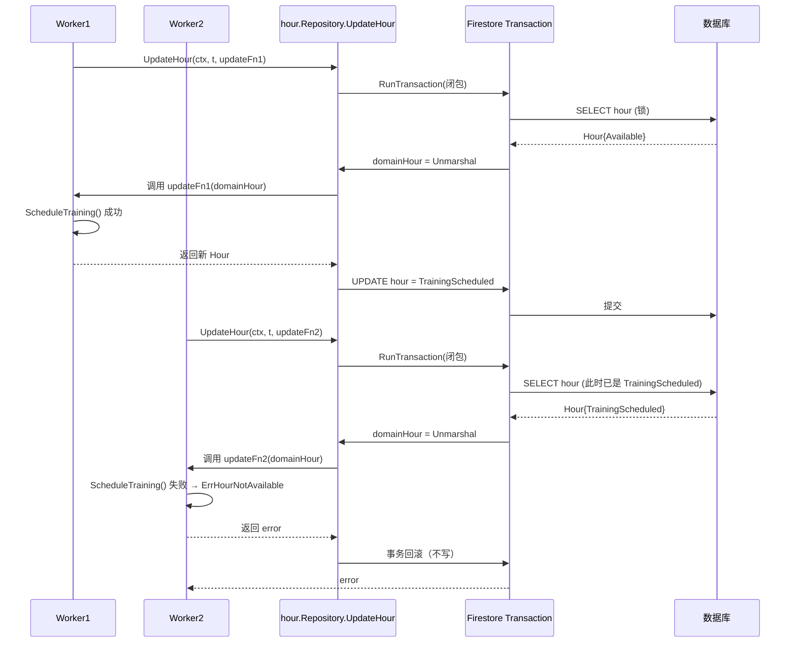

# 003 Repository 模式：用回调式更新把事务收进仓储

> 对应 wild-workouts README 第 7 篇。
> 知识点：**Repository 接口 + 回调式 Update + 同接口多实现**。

## 一、理论抽象

### 1.1 Repository 模式的两个核心约定

| 约定 | 作用 |
| --- | --- |
| **接口定义在 domain 包** | 依赖倒置：domain 不依赖具体存储，存储实现依赖 domain |
| **`UpdateHour(ctx, time, updateFn)` 回调式** | 把「读-改-写」包进事务，业务方只提供 `updateFn` |

### 1.2 回调式 vs Save 风格

```go
// 方案 A：常见 Save 风格
type Repository interface {
    Get(ctx, t) (*Hour, error)
    Save(ctx, h *Hour) error
}

// 方案 B：wild-workouts 的回调式
type Repository interface {
    GetHour(ctx, t) (*Hour, error)
    UpdateHour(ctx, t, updateFn func(*Hour) (*Hour, error)) error
}
```

方案 A 的问题：
1. **事务泄漏**：调用方必须自己保证「Get → 改 → Save」原子性
2. **重复 Get**：调用方忘记先 Get，直接构造 `Hour` 去 Save，可能覆盖别人修改
3. **乐观锁失控**：并发版本号检查逻辑散落

方案 B 把「读出来 → 交给业务方改 → 写回去」整段塞进 Repository 内部事务，调用方拿不到「裸 Save」的口子。

### 1.3 「找不到文档」当作空日期处理

仓储的隐含约定：未持久化的时间也「存在」（默认 NotAvailable），业务方不区分「数据库没有」和「数据库里是 NotAvailable」。

### 1.4 接口最小化原则

wild-workouts 的 `hour.Repository` 只有 `GetHour` + `UpdateHour` 两个方法，没有 `Save` / `Delete` / `Find`。读写职责按 Repository 拆——查询走 `datesRepository.GetDates`（只读）。

---

## 二、时序图

以「并发预约同一小时」为例：



两个 Worker 调同一 `updateFn` 签名，Repository 保证它们看到事务内的快照。

---

## 三、代码实现

### 1. 接口定义

[domain/hour/repository.go](file:///d:/Blog/backup/tmp/ddd/wild-workouts-go-ddd-example/internal/trainer/domain/hour/repository.go) 全文 15 行：

```go
type Repository interface {
    GetHour(ctx context.Context, hourTime time.Time) (*Hour, error)
    UpdateHour(
        ctx context.Context,
        hourTime time.Time,
        updateFn func(h *Hour) (*Hour, error),
    ) error
}
```

定义在 `domain/hour` 包内——domain 不 import 任何数据库驱动，adapters 反过来 import domain。

### 2. Firestore 事务实现

[adapters/hour_firestore_repository.go](file:///d:/Blog/backup/tmp/ddd/wild-workouts-go-ddd-example/internal/trainer/adapters/hour_firestore_repository.go)

构造器做防御性校验：

```go
func NewFirestoreHourRepository(firestoreClient *firestore.Client, hourFactory hour.Factory) *FirestoreHourRepository {
    if firestoreClient == nil {
        panic("missing firestoreClient")
    }
    if hourFactory.IsZero() {
        panic("missing hourFactory")
    }
    return &FirestoreHourRepository{firestoreClient, hourFactory}
}
```

`UpdateHour` 的事务闭包：

```go
func (f FirestoreHourRepository) UpdateHour(ctx, hourTime, updateFn) error {
    err := f.firestoreClient.RunTransaction(ctx, func(ctx, transaction) error {
        dateDocRef := f.documentRef(hourTime)
        firebaseDate, err := f.getDateDTO(func() (...) { return transaction.Get(dateDocRef) }, hourTime)
        if err != nil { return err }

        hourFromDB, err := f.domainHourFromDateDTO(firebaseDate, hourTime)
        if err != nil { return err }

        updatedHour, err := updateFn(hourFromDB)   // 业务逻辑回调进来
        if err != nil { return errors.Wrap(err, "unable to update hour") }

        updateHourInDataDTO(updatedHour, &firebaseDate)
        return transaction.Set(dateDocRef, firebaseDate)   // 同一事务内写回
    })
    return errors.Wrap(err, "firestore transaction failed")
}
```

四步：事务内读 → 还原成领域对象 → 调业务回调 → 事务内写回。

「找不到文档」当空日期：

```go
if status.Code(err) == codes.NotFound {
    return NewEmptyDateDTO(dateTime), nil
}
```

### 3. 内存实现：为测试而生

[adapters/hour_memory_repository.go](file:///d:/Blog/backup/tmp/ddd/wild-workouts-go-ddd-example/internal/trainer/adapters/hour_memory_repository.go)

存值不存指针：

```go
// we don't store hours as pointers, but as values
// thanks to that, we are sure that nobody can modify Hour without using UpdateHour
return &currentHour, nil
```

返回 `&currentHour`（拷贝的地址），调用方改字段不影响 map 里的值。

`UpdateHour` 用写锁串行化：

```go
func (m *MemoryHourRepository) UpdateHour(_, hourTime, updateFn) error {
    m.lock.Lock()
    defer m.lock.Unlock()
    currentHour, err := m.getOrCreateHour(hourTime)
    updatedHour, err := updateFn(currentHour)
    m.hours[hourTime] = *updatedHour
    return nil
}
```

内存版的「事务」就是一把写锁。

### 4. 同一套测试跑三个实现

[adapters/hour_repository_test.go L62-L77](file:///d:/Blog/backup/tmp/ddd/wild-workouts-go-ddd-example/internal/trainer/adapters/hour_repository_test.go#L62-L77)

```go
func createRepositories(t *testing.T) []Repository {
    return []Repository{
        {Name: "Firebase", Repository: newFirebaseRepository(t, context.Background())},
        {Name: "MySQL", Repository: newMySQLRepository(t)},
        {Name: "memory", Repository: adapters.NewMemoryHourRepository(testHourFactory)},
    }
}
```

一个循环把同一组测试用例套到三个实现上。并发测试（20 个 goroutine 同时预约同一小时，断言「只有一个成功」）同时验证 Firestore 事务、MySQL 事务、内存锁。

某个实现有缺陷可单独 skip：

```go
if _, ok := repository.(*adapters.FirestoreHourRepository); ok {
    t.Skip("because of emulator bug, it's not working in Firebase")
}
```

### 5. 回滚测试

[hour_repository_test.go L209-L233](file:///d:/Blog/backup/tmp/ddd/wild-workouts-go-ddd-example/internal/trainer/adapters/hour_repository_test.go#L209-L233)

```go
err = repository.UpdateHour(ctx, hourTime, func(h *hour.Hour) (*hour.Hour, error) {
    require.NoError(t, h.MakeNotAvailable())          // 改成 NotAvailable
    return h, errors.New("something went wrong")      // 故意失败
})
require.Error(t, err)

persistedHour, err := repository.GetHour(ctx, hourTime)
assert.True(t, persistedHour.IsAvailable(), "availability change was persisted, not rolled back")
```

验证 `updateFn` 返回 error 时 Repository 内部事务必须回滚。

### 6. Handler 退化成一行

[schedule_training.go L39-L50](file:///d:/Blog/backup/tmp/ddd/wild-workouts-go-ddd-example/internal/trainer/app/command/schedule_training.go#L39-L50)

```go
func (h scheduleTrainingHandler) Handle(ctx context.Context, cmd ScheduleTraining) error {
    if err := h.hourRepo.UpdateHour(ctx, cmd.Hour, func(h *hour.Hour) (*hour.Hour, error) {
        if err := h.ScheduleTraining(); err != nil {
            return nil, err
        }
        return h, nil
    }); err != nil {
        return errors.NewSlugError(err.Error(), "unable-to-update-availability")
    }
    return nil
}
```

Handler 没有事务、没有 SQL、没有锁、没有 Get/Save 配对。
