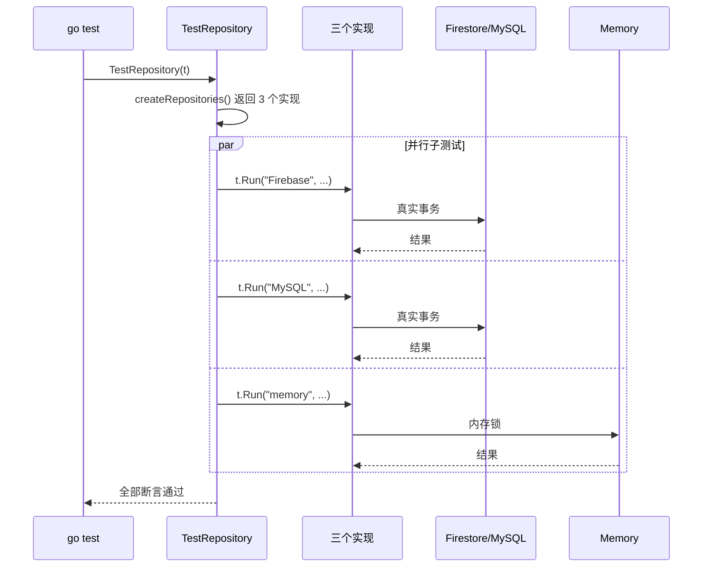
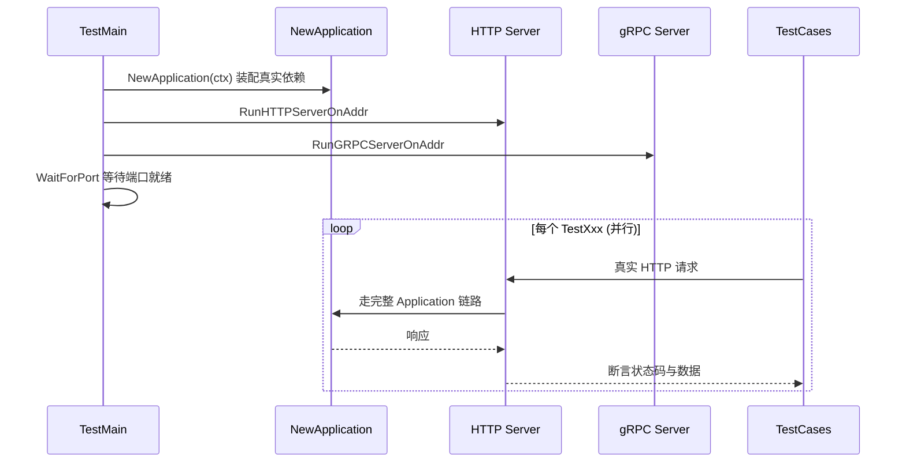

# 004 数据库集成测试原则：用真库、跑并行、数据隔离

> 对应 wild-workouts README 第 8 篇。
> 知识点：**真实数据库测试 + 并行执行 + 数据隔离 + 同测试套多实现**。

## 一、理论抽象

### 1.1 高质量集成测试的 4 条原则

| 原则 | 含义 |
| --- | --- |
| **① 用真实数据库实现** | 测 Firestore 就连 Firestore 模拟器，测 MySQL 就连 MySQL |
| **② 测试必须并行** | `t.Parallel()` 全员开启 |
| **③ 数据隔离，不依赖顺序** | 每个测试用不同日期/随机时间，互不干扰 |
| **④ 同测试套跑多个实现** | 一组断言循环跑在 Firestore/MySQL/Memory 上 |

### 1.2 三层测试金字塔

| 测试类型 | 位置 | 依赖 | 速度 |
| --- | --- | --- | --- |
| **领域单元测试** | `domain/hour/hour_test.go` | 无（纯内存） | 毫秒级 |
| **仓储集成测试** | `adapters/hour_repository_test.go` | 真实数据库 | 秒级 |
| **组件/E2E 测试** | `service/component_test.go`、`common/tests/` | 真实服务 + HTTP/gRPC | 秒级 |

---

## 二、时序图

### 2.1 仓储集成测试的并行执行



### 2.2 组件测试：启动真实服务



组件测试不 mock 任何东西——启动真实 Application、真实 HTTP/gRPC 服务器，用 OpenAPI 生成的客户端发请求。

---

## 三、代码实现

### 1. 原则①：用真实数据库

[hour_repository_test.go L62-L77](file:///d:/Blog/backup/tmp/ddd/wild-workouts-go-ddd-example/internal/trainer/adapters/hour_repository_test.go#L62-L77)

```go
func createRepositories(t *testing.T) []Repository {
    return []Repository{
        {Name: "Firebase", Repository: newFirebaseRepository(t, context.Background())},
        {Name: "MySQL", Repository: newMySQLRepository(t)},
        {Name: "memory", Repository: adapters.NewMemoryHourRepository(testHourFactory)},
    }
}
```

`newFirebaseRepository` 直接 `firestore.NewClient` 连真实模拟器；`newMySQLRepository` 连真实 MySQL。没有任何 mock。

### 2. 原则②：全员并行

[hour_repository_test.go L20-L55](file:///d:/Blog/backup/tmp/ddd/wild-workouts-go-ddd-example/internal/trainer/adapters/hour_repository_test.go#L20-L55)

每一层 `t.Run` 都调用 `t.Parallel()`：

```go
func TestRepository(t *testing.T) {
    t.Parallel()                          // 顶层并行
    repositories := createRepositories(t)
    for i := range repositories {
        r := repositories[i]              // 必须拷贝循环变量
        t.Run(r.Name, func(t *testing.T) {
            t.Parallel()                  // 每个实现并行
            t.Run("testUpdateHour", func(t *testing.T) {
                t.Parallel()              // 每个用例并行
                testUpdateHour(t, r.Repository)
            })
        })
    }
}
```

循环里用 goroutine 时必须把迭代变量拷贝到循环体内，否则所有 goroutine 会共享最后一个值。

### 3. 原则③：数据隔离

[hour_repository_test.go L322-L341](file:///d:/Blog/backup/tmp/ddd/wild-workouts-go-ddd-example/internal/trainer/adapters/hour_repository_test.go#L322-L341)

随机时间 + 全局去重：

```go
var usedHours = sync.Map{}

func newValidHourTime() time.Time {
    for {
        minTime := time.Now().AddDate(0, 0, 1)
        minTimestamp := minTime.Unix()
        maxTimestamp := minTime.AddDate(0, 0, testHourFactory.Config().MaxWeeksInTheFutureToSet*7).Unix()
        t := time.Unix(rand.Int63n(maxTimestamp-minTimestamp)+minTimestamp, 0).Truncate(time.Hour).Local()
        _, alreadyUsed := usedHours.LoadOrStore(t.Unix(), true)
        if !alreadyUsed {
            return t
        }
    }
}
```

`sync.Map` 保证每个测试拿到的时间戳都唯一。

组件测试用固定相对日期。[hours.go](file:///d:/Blog/backup/tmp/ddd/wild-workouts-go-ddd-example/internal/common/tests/hours.go) 的 `RelativeDate`：

```go
func RelativeDate(days int, hour int) time.Time { ... }
```

每个测试用不同的 `days, hour` 组合，天然不冲突。

### 4. 原则④：同测试套跑多实现——并发测试

[testUpdateHour_parallel L132-L207](file:///d:/Blog/backup/tmp/ddd/wild-workouts-go-ddd-example/internal/trainer/adapters/hour_repository_test.go#L132-L207)

```go
workersCount := 20
for worker := 0; worker < workersCount; worker++ {
    go func() {
        err := repository.UpdateHour(ctx, hourTime, func(h *hour.Hour) (*hour.Hour, error) {
            if h.HasTrainingScheduled() { return h, nil }
            if err := h.ScheduleTraining(); err != nil { return nil, err }
            schedulingTraining = true
            return h, nil
        })
        if schedulingTraining && err == nil {
            trainingsScheduled <- workerNum
        }
    }()
}

assert.Len(t, workersScheduledTraining, 1, "only one worker should schedule training")
```

一条测试同时验证三个实现的并发正确性。新写一个 Redis 实现，只要塞进 `createRepositories`，这套测试立刻验证它的并发安全。

### 5. 回滚测试

[hour_repository_test.go L209-L233](file:///d:/Blog/backup/tmp/ddd/wild-workouts-go-ddd-example/internal/trainer/adapters/hour_repository_test.go#L209-L233)

```go
func testUpdateHour_rollback(t *testing.T, repository hour.Repository) {
    err := repository.UpdateHour(ctx, hourTime, func(h *hour.Hour) (*hour.Hour, error) {
        require.NoError(t, h.MakeAvailable())
        return h, nil
    })

    err = repository.UpdateHour(ctx, hourTime, func(h *hour.Hour) (*hour.Hour, error) {
        require.NoError(t, h.MakeNotAvailable())
        return h, errors.New("something went wrong")
    })
    require.Error(t, err)

    persistedHour, err := repository.GetHour(ctx, hourTime)
    assert.True(t, persistedHour.IsAvailable(), "availability change was persisted, not rolled back")
}
```

验证第 3 章回调式 `UpdateHour` 的回滚语义。

### 6. 组件测试：启动真实服务

[component_test.go L73-L108](file:///d:/Blog/backup/tmp/ddd/wild-workouts-go-ddd-example/internal/trainer/service/component_test.go#L73-L108)

```go
func startService() bool {
    app := NewApplication(context.Background())
    go server.RunHTTPServerOnAddr(trainerHTTPAddr, ...)
    go server.RunGRPCServerOnAddr(trainerGrpcAddr, ...)
    ok := tests.WaitForPort(trainerHTTPAddr)
    return ok
}

func TestMain(m *testing.M) {
    if !startService() {
        os.Exit(1)
    }
    os.Exit(m.Run())
}
```

`TestMain` 是 Go 测试的特殊入口，在所有测试前执行一次。测试用例用 OpenAPI 生成的真实 HTTP 客户端发请求。

### 7. 测试客户端封装

[clients.go](file:///d:/Blog/backup/tmp/ddd/wild-workouts-go-ddd-example/internal/common/tests/clients.go)

- `authorizationBearer` 统一注入 JWT
- `NewTrainerHTTPClient` 自动 `WaitForPort` 等服务就绪
- `MakeHourAvailable` / `MakeHourUnavailable` 把请求和状态码断言封进一行

### 8. E2E 测试

[common/tests/e2e_test.go](file:///d:/Blog/backup/tmp/ddd/wild-workouts-go-ddd-example/internal/common/tests/e2e_test.go) 的 `TestCreateTraining` 是跨三服务的端到端测试：

```
trainer 设档期可用 → users 加余额 → trainings 建训练 → 验证余额扣减
```

[L29-L46](file:///d:/Blog/backup/tmp/ddd/wild-workouts-go-ddd-example/internal/common/tests/e2e_test.go#L29-L46) 先清理「可能存在的同名训练和档期」——E2E 测试可重入的关键：跑多少次结果都一样。
