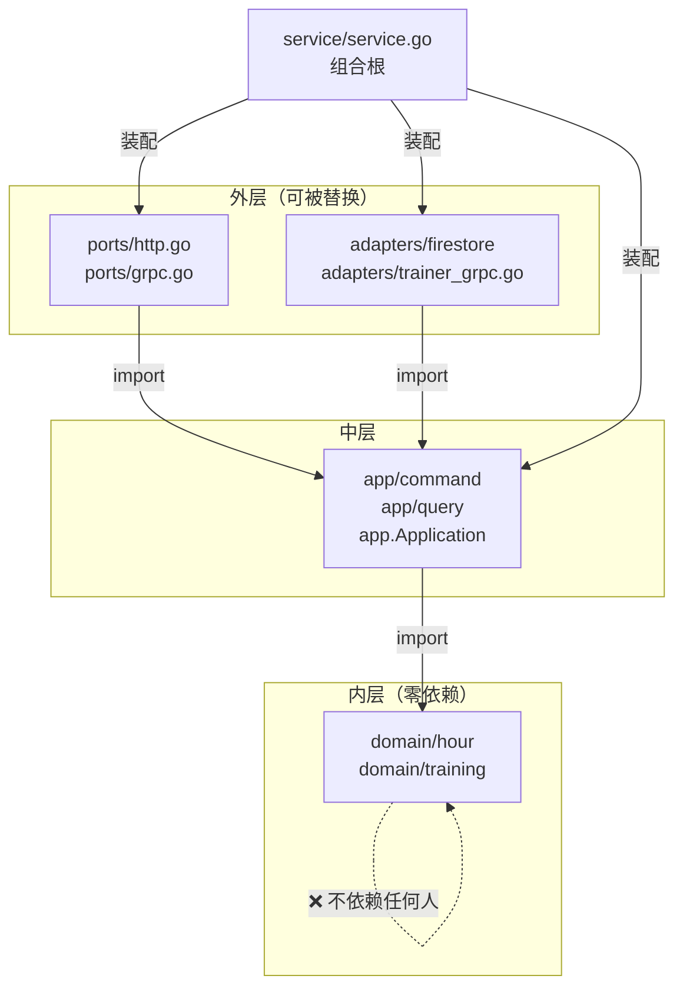
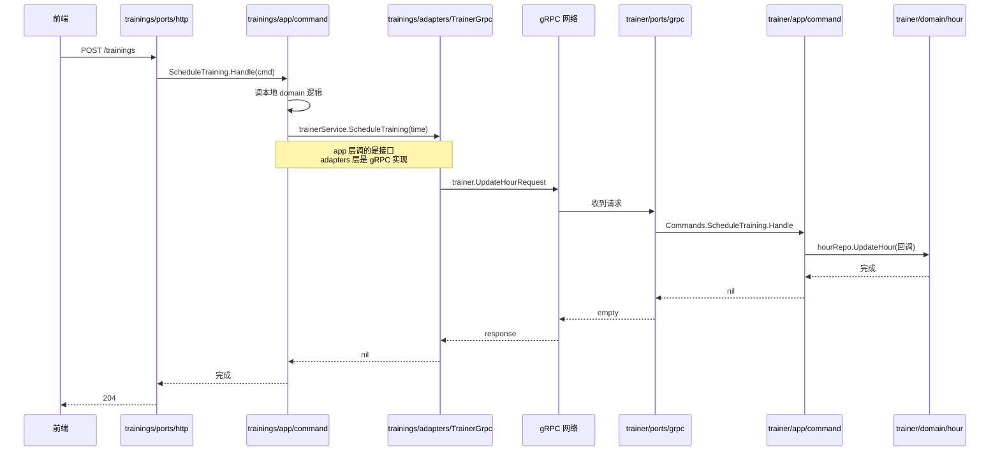

# 005 Clean Architecture 重构：让依赖永远指向 domain

> 对应 wild-workouts README 第 9 篇。
> 知识点：**依赖倒置 + 五段式目录 + 跨服务接口的「定义在 app，实现在 adapters」**。

## 一、理论抽象

### 1.1 Clean Architecture 核心规则

> **依赖方向必须永远指向内层。domain 在最内层，不依赖任何外部包。**

```
┌─────────────────────────────────────┐
│  ports (HTTP/gRPC 入口适配器)      │  ← 外层：协议、框架
│  ┌───────────────────────────────┐  │
│  │  app (command/query 用例)    │  │  ← 中层：用例编排
│  │  ┌─────────────────────────┐ │  │
│  │  │  domain (Hour/Training) │ │  │  ← 内层：业务规则，零依赖
│  │  └─────────────────────────┘ │  │
│  └───────────────────────────────┘  │
│  adapters (仓储/gRPC客户端 实现)   │  ← 外层：基础设施
└─────────────────────────────────────┘
        service (组合根：装配一切)
```

`domain` 包的 import 列表里不能有任何外层包。`app` 可以 import `domain`，`ports`/`adapters` 可以 import `app` 和 `domain`，反过来不行。

### 1.2 依赖倒置

- `domain` 定义接口（我需要「能存取 Hour」的东西）
- `adapters` 实现接口（FirestoreHourRepository）
- `domain` 不 import `adapters`，是 `adapters` import `domain`

### 1.3 跨服务接口：定义在 app，实现在 adapters

```go
// app 层只定义接口
package command
type TrainerService interface { ... }
```

- app 知道「我需要能调 trainer 的 ScheduleTraining」
- app 不知道、也不关心这个能力是 gRPC、HTTP 还是 mock 提供
- 改通信方式时，app 完全不用动

### 1.4 构造器拆分

| 函数             | 职责                                  | 参数                                                 |
| ---------------- | ------------------------------------- | ---------------------------------------------------- |
| `NewApplication` | 生产装配：创建 gRPC 客户端 + 资源清理 | 无                                                   |
| `newApplication` | 纯装配：把依赖注入 handlers           | `command.TrainerService`、`command.UserService` 接口 |

「依赖的创建」和「依赖的使用」分离。组件测试不创建 gRPC 客户端，直接传 mock 进 `newApplication`。

---

## 二、时序图

### 2.1 依赖方向（编译期）



`domain` 没有箭头指出去——它是编译期的「黑洞」。

### 2.2 跨服务调用时序（trainings → trainer）



trainings 的 `app/command` 调的是自己定义的 `TrainerService` 接口，不知道背后是 gRPC 还是 mock。

---

## 三、代码实现

### 1. 入口适配器：协议无关地调用 app

[ports/grpc.go](file:///d:/Blog/backup/tmp/ddd/wild-workouts-go-ddd-example/internal/trainer/ports/grpc.go)

```go
func (g GrpcServer) ScheduleTraining(ctx context.Context, request *trainer.UpdateHourRequest) (*empty.Empty, error) {
    trainingTime := protoTimestampToTime(request.Time)           // 协议→领域类型
    if err := g.app.Commands.ScheduleTraining.Handle(ctx, command.ScheduleTraining{Hour: trainingTime}); err != nil {
        return nil, status.Error(codes.Internal, err.Error())
    }
    return &empty.Empty{}, nil
}
```

gRPC 入口和 HTTP 入口做的事完全一样：把协议特定的请求翻译成 app 的 Command/Query，调完再翻译回去。`GrpcServer` 只持有 `app.Application`，不知道 domain、不知道 adapters。

### 2. app 层定义跨服务接口

[trainings/app/command/services.go](file:///d:/Blog/backup/tmp/ddd/wild-workouts-go-ddd-example/internal/trainings/app/command/services.go)

```go
type UserService interface {
    UpdateTrainingBalance(ctx context.Context, userID string, amountChange int) error
}

type TrainerService interface {
    ScheduleTraining(ctx context.Context, trainingTime time.Time) error
    CancelTraining(ctx context.Context, trainingTime time.Time) error
    MoveTraining(ctx context.Context, newTime time.Time, originalTrainingTime time.Time) error
}
```

接口定义在 app 层。

### 3. adapters 层实现接口

[trainings/adapters/trainer_grpc.go](file:///d:/Blog/backup/tmp/ddd/wild-workouts-go-ddd-example/internal/trainings/adapters/trainer_grpc.go)

```go
type TrainerGrpc struct {
    client trainer.TrainerServiceClient
}

func (s TrainerGrpc) ScheduleTraining(ctx context.Context, trainingTime time.Time) error {
    _, err := s.client.ScheduleTraining(ctx, &trainer.UpdateHourRequest{
        Time: timestamppb.New(trainingTime),
    })
    return err
}
```

`MoveTraining` 把「先 schedule 新时间，再 cancel 旧时间」组合成一次调用——这种跨多次 gRPC 的业务编排放在 adapters，因为它依赖通信细节。app 层只看到 `MoveTraining` 一个原子方法。

### 4. 组合根：把依赖按依赖方向粘起来

[trainings/service/service.go](file:///d:/Blog/backup/tmp/ddd/wild-workouts-go-ddd-example/internal/trainings/service/service.go)

```go
func NewApplication(ctx context.Context) (app.Application, func()) {
    trainerClient, closeTrainerClient, err := grpcClient.NewTrainerClient()
    usersClient, closeUsersClient, err := grpcClient.NewUsersClient()
    trainerGrpc := adapters.NewTrainerGrpc(trainerClient)
    usersGrpc := adapters.NewUsersGrpc(usersClient)

    return newApplication(ctx, trainerGrpc, usersGrpc), func() { /* close */ }
}
```

`newApplication` 的参数类型是 `command.TrainerService`、`command.UserService`（app 层接口），但传入的是 `adapters.TrainerGrpc`（adapters 层实现）——**函数签名要接口，调用方传实现**。

### 5. 测试可替换性

[service.go L37-L39](file:///d:/Blog/backup/tmp/ddd/wild-workouts-go-ddd-example/internal/trainings/service/service.go#L37-L39)

```go
func NewComponentTestApplication(ctx context.Context) app.Application {
    return newApplication(ctx, TrainerServiceMock{}, UserServiceMock{})
}
```

组件测试用 `TrainerServiceMock` / `UserServiceMock`（[service/mocks.go](file:///d:/Blog/backup/tmp/ddd/wild-workouts-go-ddd-example/internal/trainings/service/mocks.go)）替换真实的 gRPC 客户端。app 只依赖接口，换 mock 不用改任何 app 代码。

### 6. 五段式目录与依赖方向对应表

| 目录                                             | Clean Architecture 层      | 依赖谁                        | 被谁依赖                 |
| ------------------------------------------------ | -------------------------- | ----------------------------- | ------------------------ |
| `domain/training/`                               | Entities（最内）           | 只依赖标准库 + common/errors  | app                      |
| `app/command/`、`app/query/`                     | Use Cases                  | domain + 自定义接口           | ports、adapters、service |
| `ports/http.go`                                  | Interface Adapters（入口） | app                           | service                  |
| `adapters/trainer_grpc.go`、`adapters/firestore` | Interface Adapters（出口） | app 接口 + gRPC/Firestore SDK | service                  |
| `service/service.go`                             | Main（组合根）             | 装配上述所有                  | main.go                  |

验证方法：在 `domain/training/` 目录里 `grep "import"`，应该看不到任何 `internal/trainings/app` 或 `internal/trainings/adapters` 的引用。
