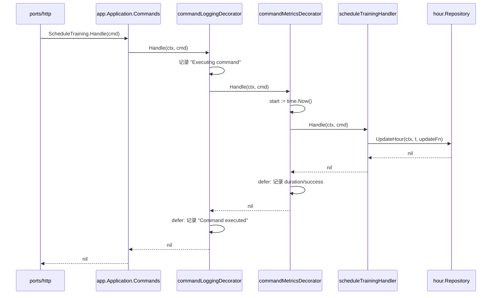
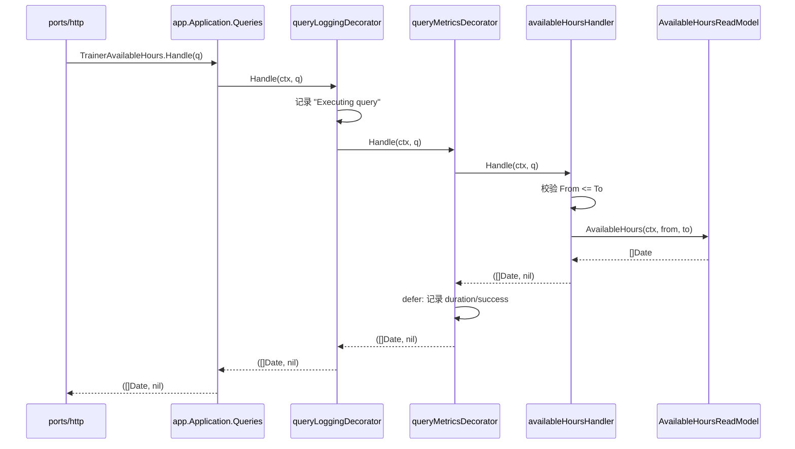

# 006 CQRS 基础：把读和写彻底分开

> 对应 wild-workouts README 第 10 篇。
> 知识点：**Command/Query 双 Handler + 泛型装饰器 + ReadModel 读模型**。

## 一、理论抽象

### 1.1 CQRS 的核心动作

把「改状态的命令」和「返回数据的查询」拆成两套对象。

| 维度   | Command（命令） | Query（查询）             |
| ------ | --------------- | ------------------------- |
| 职责   | 改变系统状态    | 返回数据，不改状态        |
| 返回值 | 只有 `error`    | `(R, error)`              |
| 事务   | 需要            | 不需要                    |
| 缓存   | 不能缓存        | 可以缓存                  |
| 数据源 | 写库（规范化）  | 读库/读模型（可反规范化） |

### 1.2 wild-workouts 的落地方式

- `app.Application` 有两个字段：`Commands` 和 `Queries`
- 每个 Command/Query 都是独立的 Handler 类型
- 横切关注点（日志、metrics）用**泛型装饰器**统一注入

这是「轻量级 CQRS」——读写逻辑分离，但共享同一份数据存储。

### 1.3 装饰器模式：用泛型消灭横切关注点

```go
// 装饰器把 handler 包成洋葱：logging(metrics(真实handler))
return decorator.ApplyCommandDecorators[ScheduleTraining](
    scheduleTrainingHandler{hourRepo: hourRepo},
    logger,
    metricsClient,
)
```

业务 Handler 只写业务逻辑，日志/metrics 由装饰器统一加。

### 1.4 ReadModel：Query 的专属数据访问

Query Handler 不复用 `hour.Repository`，而是定义自己的读模型接口——为查询量身定制，直接返回 `[]Date` 投影，不需要还原成领域对象。

---

## 二、时序图

### 2.1 Command 路径（写）



### 2.2 Query 路径（读）



两条路径结构完全对称，但 Command 不返回数据、Query 不改状态。装饰器链是 `logging → metrics → 真实handler`，错误会沿洋葱反向冒泡，`defer` 保证日志/metrics 一定记录。

---

## 三、代码实现

### 1. Application 结构：Commands + Queries

[app/app.go](file:///d:/Blog/backup/tmp/ddd/wild-workouts-go-ddd-example/internal/trainer/app/app.go)

```go
type Application struct {
    Commands Commands
    Queries  Queries
}

type Commands struct {
    CancelTraining   command.CancelTrainingHandler
    ScheduleTraining command.ScheduleTrainingHandler
    MakeHoursAvailable   command.MakeHoursAvailableHandler
    MakeHoursUnavailable command.MakeHoursUnavailableHandler
}

type Queries struct {
    HourAvailability      query.HourAvailabilityHandler
    TrainerAvailableHours query.AvailableHoursHandler
}
```

类型系统在帮你区分读写——写操作返回 error，读操作返回 `(R, error)`。

### 2. 泛型 Handler 接口

[decorator/command.go](file:///d:/Blog/backup/tmp/ddd/wild-workouts-go-ddd-example/internal/common/decorator/command.go) 与 [decorator/query.go](file:///d:/Blog/backup/tmp/ddd/wild-workouts-go-ddd-example/internal/common/decorator/query.go)

```go
// Command：改状态，只返回 error
type CommandHandler[C any] interface {
    Handle(ctx context.Context, cmd C) error
}

// Query：读数据，返回 (R, error)
type QueryHandler[Q any, R any] interface {
    Handle(ctx context.Context, q Q) (R, error)
}
```

Command 不需要结果类型参数，Query 需要两个参数（请求 + 结果）。用泛型后所有 Command Handler 共享一套装饰器。

### 3. 装饰器工厂：洋葱式包装

[decorator/command.go L11-L19](file:///d:/Blog/backup/tmp/ddd/wild-workouts-go-ddd-example/internal/common/decorator/command.go#L11-L19)

```go
func ApplyCommandDecorators[H any](handler CommandHandler[H], logger *logrus.Entry, metricsClient MetricsClient) CommandHandler[H] {
    return commandLoggingDecorator[H]{
        base: commandMetricsDecorator[H]{
            base:   handler,
            client: metricsClient,
        },
        logger: logger,
    }
}
```

包装顺序是 `logging(metrics(handler))`。返回类型仍是 `CommandHandler[H]`——装饰后的对象和原对象类型一致，调用方无感知。

### 4. 日志装饰器：defer 统一收尾

[decorator/logging.go](file:///d:/Blog/backup/tmp/ddd/wild-workouts-go-ddd-example/internal/common/decorator/logging.go)

```go
func (d commandLoggingDecorator[C]) Handle(ctx context.Context, cmd C) (err error) {
    logger := d.logger.WithFields(logrus.Fields{
        "command":      generateActionName(cmd),
        "command_body": fmt.Sprintf("%+v", cmd),
    })
    logger.Debug("Executing command")
    defer func() {
        if err == nil {
            logger.Info("Command executed successfully")
        } else {
            logger.WithError(err).Error("Failed to execute command")
        }
    }()
    return d.base.Handle(ctx, cmd)
}
```

命名返回值 `err error`——只有命名返回值才能在 `defer` 里访问。`generateActionName` 用反射拿到 Command 结构体名，自动生成 metrics key。

### 5. metrics 装饰器：统一埋点

[decorator/metrics.go L19-L37](file:///d:/Blog/backup/tmp/ddd/wild-workouts-go-ddd-example/internal/common/decorator/metrics.go#L19-L37)

```go
func (d commandMetricsDecorator[C]) Handle(ctx context.Context, cmd C) (err error) {
    start := time.Now()
    actionName := strings.ToLower(generateActionName(cmd))
    defer func() {
        end := time.Since(start)
        d.client.Inc(fmt.Sprintf("commands.%s.duration", actionName), int(end.Seconds()))
        if err == nil {
            d.client.Inc(fmt.Sprintf("commands.%s.success", actionName), 1)
        } else {
            d.client.Inc(fmt.Sprintf("commands.%s.failure", actionName), 1)
        }
    }()
    return d.base.Handle(ctx, cmd)
}
```

每个 Command 自动产生三个指标：`duration`、`success`、`failure`。`MetricsClient` 是接口，生产接 Prometheus，测试用 `metrics.NoOp{}`。

### 6. ReadModel：Query 的专属数据访问

[query/available_hours.go L19-L21](file:///d:/Blog/backup/tmp/ddd/wild-workouts-go-ddd-example/internal/trainer/app/query/available_hours.go#L19-L21)

```go
type AvailableHoursReadModel interface {
    AvailableHours(ctx context.Context, from time.Time, to time.Time) ([]Date, error)
}
```

[L39-L45](file:///d:/Blog/backup/tmp/ddd/wild-workouts-go-ddd-example/internal/trainer/app/query/available_hours.go#L39-L45) 的 Handle 方法：

```go
func (h availableHoursHandler) Handle(ctx context.Context, query AvailableHours) (d []Date, err error) {
    if query.From.After(query.To) {
        return nil, errors.NewIncorrectInputError("date-from-after-date-to", "Date from after date to")
    }
    return h.readModel.AvailableHours(ctx, query.From, query.To)
}
```

只做输入校验 + 委托给读模型。对比 Command Handler，Query Handler 轻得多——「读」天然不需要事务和不变式守卫。

### 7. 装配：所有 Handler 统一过装饰器

[service/application.go L41-L52](file:///d:/Blog/backup/tmp/ddd/wild-workouts-go-ddd-example/internal/trainer/service/application.go#L41-L52)

```go
return app.Application{
    Commands: app.Commands{
        CancelTraining:       command.NewCancelTrainingHandler(hourRepository, logger, metricsClient),
        ScheduleTraining:     command.NewScheduleTrainingHandler(hourRepository, logger, metricsClient),
    },
    Queries: app.Queries{
        HourAvailability:      query.NewHourAvailabilityHandler(hourRepository, logger, metricsClient),
        TrainerAvailableHours: query.NewAvailableHoursHandler(datesRepository, logger, metricsClient),
    },
}
```

每个 `NewXxxHandler` 内部都调 `ApplyCommandDecorators` / `ApplyQueryDecorators`。组合根保证：没有 Handler 能逃过装饰器。
