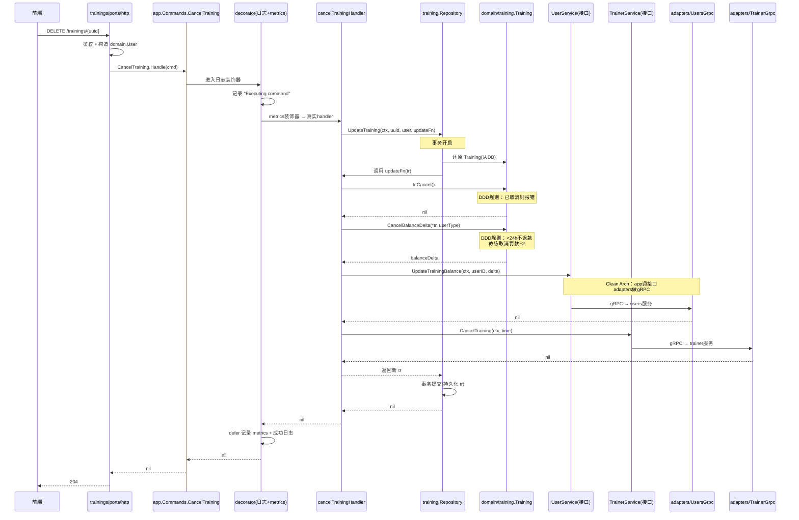

# 007 三剑合璧：DDD + CQRS + Clean Architecture 的完整协作

> 对应 wild-workouts README 第 11 篇。
> 知识点：用一个完整业务场景（「取消训练」）把前 5 章的零件拼成整机，看三者如何分工协作。

## 一、理论抽象

### 1.1 三者的分工边界

| 模式 | 负责 | 不负责 |
| --- | --- | --- |
| **DDD（充血模型）** | 业务不变式、状态转移规则、余额计算 | 事务、跨服务通信、协议 |
| **CQRS** | 读写分离、横切关注点（日志/metrics） | 业务规则本身、依赖方向 |
| **Clean Architecture** | 依赖方向、跨服务接口定义位置 | 业务规则、读写分离 |

三者**正交**：DDD 管「业务在哪」，CQRS 管「读写怎么分」，Clean Architecture 管「依赖怎么指」。

### 1.2 分工口诀

一次业务请求穿越各层时，每层只做一件事：

```
ports      → 协议翻译（HTTP/gRPC ↔ Command/Query）
decorator  → 横切关注点（日志、metrics）
command    → 用例编排（调用 domain + 跨服务）
domain     → 业务规则（状态转移、余额计算）
repository → 事务边界（读-改-写原子化）
adapters   → 跨服务通信（gRPC 客户端实现）
```

---

## 二、时序图

「取消训练」同时涉及本地领域规则、跨服务调用（users 退余额、trainer 释放档期），用这一条链路能看清三者的全部协作点。



| 时序节点 | 由哪个模式保证 | 具体代码 |
| --- | --- | --- |
| `tr.Cancel()` 拒绝重复取消 | DDD（充血模型守不变式） | [cancel.go L14-L21](file:///d:/Blog/backup/tmp/ddd/wild-workouts-go-ddd-example/internal/trainings/domain/training/cancel.go#L14-L21) |
| `CancelBalanceDelta` 计算罚款 | DDD（领域服务函数） | [cancel_balance.go L6-L22](file:///d:/Blog/backup/tmp/ddd/wild-workouts-go-ddd-example/internal/trainings/domain/training/cancel_balance.go#L6-L22) |
| `UpdateTraining` 包事务 | Repository 模式（回调式） | [repository.go L21-L26](file:///d:/Blog/backup/tmp/ddd/wild-workouts-go-ddd-example/internal/trainings/domain/training/repository.go#L21-L26) |
| 日志/metrics 自动记录 | CQRS（泛型装饰器） | [decorator/logging.go](file:///d:/Blog/backup/tmp/ddd/wild-workouts-go-ddd-example/internal/common/decorator/logging.go) |
| `UserService`/`TrainerService` 接口 | Clean Architecture（依赖倒置） | [services.go](file:///d:/Blog/backup/tmp/ddd/wild-workouts-go-ddd-example/internal/trainings/app/command/services.go) |
| gRPC 实现可被 mock 替换 | Clean Architecture（组合根） | [service.go L37-L41](file:///d:/Blog/backup/tmp/ddd/wild-workouts-go-ddd-example/internal/trainings/service/service.go#L37-L41) |

---

## 三、代码实现

### 1. 入口适配器：协议翻译——[trainings/ports/http.go L87-L102](file:///d:/Blog/backup/tmp/ddd/wild-workouts-go-ddd-example/internal/trainings/ports/http.go#L87-L102)

```go
func (h HttpServer) CancelTraining(w http.ResponseWriter, r *http.Request, trainingUUID openapi_types.UUID) {
    user, err := newDomainUserFromAuthUser(r.Context())   // HTTP鉴权 → domain.User
    if err != nil { /* ... */ }

    err = h.app.Commands.CancelTraining.Handle(r.Context(), command.CancelTraining{
        TrainingUUID: trainingUUID.String(),
        User:         user,
    })
    if err != nil { /* ... */ }
}
```

`newDomainUserFromAuthUser` 把 HTTP 鉴权的 `auth.User` 转成 `training.User`（带 `UserType` 枚举），HTTP 层的 role 字符串在这里收口为类型安全的领域值对象。Port 只做翻译，不写业务 if/else。

### 2. Command Handler：用例编排——[app/command/cancel_training.go L50-L77](file:///d:/Blog/backup/tmp/ddd/wild-workouts-go-ddd-example/internal/trainings/app/command/cancel_training.go#L50-L77)

```go
func (h cancelTrainingHandler) Handle(ctx context.Context, cmd CancelTraining) (err error) {
    return h.repo.UpdateTraining(
        ctx, cmd.TrainingUUID, cmd.User,
        func(ctx context.Context, tr *training.Training) (*training.Training, error) {
            if err := tr.Cancel(); err != nil {                       // ① DDD：领域规则
                return nil, err
            }
            if balanceDelta := training.CancelBalanceDelta(*tr, cmd.User.Type()); balanceDelta != 0 {
                err := h.userService.UpdateTrainingBalance(ctx, tr.UserUUID(), balanceDelta)  // ② Clean Arch：跨服务
                if err != nil { return nil, errors.Wrap(err, "unable to change trainings balance") }
            }
            if err := h.trainerService.CancelTraining(ctx, tr.Time()); err != nil {           // ② Clean Arch：跨服务
                return nil, errors.Wrap(err, "unable to cancel training")
            }
            return tr, nil
        },
    )
}
```

Handler 全文没有一个 if 检查业务规则——规则被 `tr.Cancel()` 和 `CancelBalanceDelta` 收走。Handler 只做「编排顺序 + 错误包装」。

| 动作 | 模式 | 代码位置 |
| --- | --- | --- |
| ① `tr.Cancel()` | DDD | 业务规则在领域模型里，Handler 只调用 |
| ② `userService.UpdateTrainingBalance` | Clean Arch | 调接口，不知道背后是 gRPC 还是 mock |
| `h.repo.UpdateTraining(..., updateFn)` | Repository | 事务边界在仓储内，Handler 不写 BeginTx |

### 3. 领域规则①：状态转移——[domain/training/cancel.go](file:///d:/Blog/backup/tmp/ddd/wild-workouts-go-ddd-example/internal/trainings/domain/training/cancel.go)

```go
func (t *Training) Cancel() error {
    if t.IsCanceled() {
        return ErrTrainingAlreadyCanceled        // 守不变式：不能重复取消
    }
    t.canceled = true
    return nil
}
```

`CanBeCanceledForFree`（[L8-L10](file:///d:/Blog/backup/tmp/ddd/wild-workouts-go-ddd-example/internal/trainings/domain/training/cancel.go#L8-L10)）判断距训练是否超过 24 小时，同时被 `CancelBalanceDelta`（计算退款）和 Query 层（前端显示「是否可免费取消」按钮）共用。

### 4. 领域规则②：余额计算——[domain/training/cancel_balance.go](file:///d:/Blog/backup/tmp/ddd/wild-workouts-go-ddd-example/internal/trainings/domain/training/cancel_balance.go)

```go
func CancelBalanceDelta(tr Training, cancelingUserType UserType) int {
    if tr.CanBeCanceledForFree() {
        return 1                                  // 24h前取消：退1次
    }
    switch cancelingUserType {
    case Trainer:
        return 2                                  // 教练24h内取消：退1+罚1
    case Attendee:
        return 0                                  // 学员24h内取消：不退
    default:
        panic(fmt.Sprintf("not supported user type %s", cancelingUserType))
    }
}
```

这是「领域服务函数」（纯函数），因为余额 delta 取决于「谁取消」（`cancelingUserType`），是调用方上下文，不属于 Training 自身状态。

### 5. Repository：事务边界——[domain/training/repository.go L21-L26](file:///d:/Blog/backup/tmp/ddd/wild-workouts-go-ddd-example/internal/trainings/domain/training/repository.go#L21-L26)

```go
UpdateTraining(
    ctx context.Context,
    trainingUUID string,
    user User,
    updateFn func(ctx context.Context, tr *Training) (*Training, error),
) error
```

比 trainer 的 `hour.Repository.UpdateHour` 多了 `user` 参数——权限检查（教练只能取消自己的训练）需要在仓储层按 user 过滤。回调式 Repository 的接口可以按业务需求加参数，「事务内读改写」的语义不变。

### 6. 跨服务接口：定义在 app，实现在 adapters——[app/command/services.go](file:///d:/Blog/backup/tmp/ddd/wild-workouts-go-ddd-example/internal/trainings/app/command/services.go)

```go
type UserService interface {
    UpdateTrainingBalance(ctx context.Context, userID string, amountChange int) error
}
type TrainerService interface {
    CancelTraining(ctx context.Context, trainingTime time.Time) error
    // ...
}
```

Handler 持有接口字段，不依赖 gRPC 客户端。组件测试用 mock 替换（[service.go L37-L39](file:///d:/Blog/backup/tmp/ddd/wild-workouts-go-ddd-example/internal/trainings/service/service.go#L37-L39) 的 `NewComponentTestApplication`）。

### 7. 装饰器：横切关注点自动注入——[app/command/cancel_training.go L43-L48](file:///d:/Blog/backup/tmp/ddd/wild-workouts-go-ddd-example/internal/trainings/app/command/cancel_training.go#L43-L48)

```go
return decorator.ApplyCommandDecorators[CancelTraining](
    cancelTrainingHandler{repo: repo, userService: userService, trainerService: trainerService},
    logger,
    metricsClient,
)
```

取消训练的日志（开始/成功/失败）、metrics（duration/success/failure）全部由装饰器自动加上。Handler 主体里没有任何 `logger.Info` 调用。构造器（[L33-L41](file:///d:/Blog/backup/tmp/ddd/wild-workouts-go-ddd-example/internal/trainings/app/command/cancel_training.go#L33-L41)）做 nil 检查并 panic——依赖注入在启动期暴露问题。

---

> 下一章 [008 微服务测试架构](./008_微服务测试架构.md) 讲解组件测试 + 契约测试如何覆盖跨服务业务规则。
