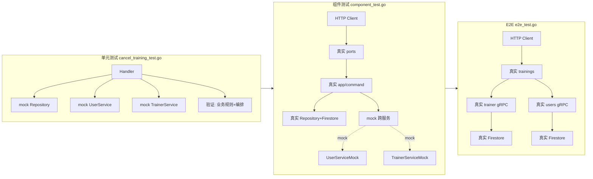
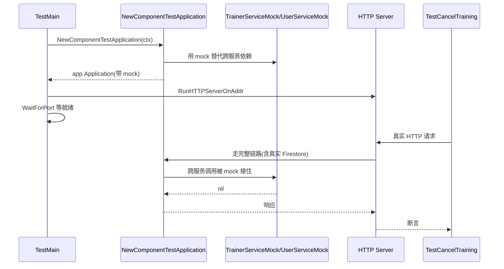

# 008 微服务测试架构：不写 E2E 也能睡得着

> 对应 wild-workouts README 第 12 篇。
> 知识点：**单元测试 + 组件测试 + E2E 的三层分工**。

## 一、理论抽象

### 1.1 微服务的测试「钻石」结构

```
        E2E (极少)           ← 只验证跨服务协作的最关键链路
       ┌──────────┐
       │ Component │          ← 单服务完整链路，外部依赖 mock
       │  (主体)   │
       └──────────┘
     ┌──────────────┐
     │  Unit (基础)  │        ← 业务规则，全 mock，毫秒级
     └──────────────┘
```

| 层            | 测什么                           | mock 什么                      | 速度 |
| ------------- | -------------------------------- | ------------------------------ | ---- |
| **Unit**      | 领域规则、Handler 编排           | 全部依赖（Repository、跨服务） | 毫秒 |
| **Component** | 单服务从 HTTP 到数据库的完整链路 | 只 mock 跨服务调用             | 秒   |
| **E2E**       | 跨服务真实联动                   | 不 mock                        | 分钟 |

### 1.2 核心原则

- 每个服务的组件测试覆盖自身完整链路
- 跨服务接口（gRPC proto）有编译期契约保证
- E2E 只补上「契约联动」这一块拼图，不重复验证业务规则

---

## 二、时序图

### 2.1 同一个「取消训练」在三层测试里的覆盖



三层测试从内到外，mock 逐渐减少，真实度逐渐增加。每层只验证自己该验证的，不重复：

| 验证点                          | Unit | Component | E2E |
| ------------------------------- | ---- | --------- | --- |
| `tr.Cancel()` 拒绝重复取消      | ✅   | —         | —   |
| `CancelBalanceDelta` 4 种场景   | ✅   | —         | —   |
| Handler 调用 UserService 的参数 | ✅   | —         | —   |
| HTTP → ports → app 链路         | —    | ✅        | ✅  |
| app → Firestore 持久化          | —    | ✅        | ✅  |
| trainings → trainer gRPC 契约   | —    | —         | ✅  |
| 跨服务余额扣减联动              | —    | —         | ✅  |

### 2.2 组件测试的启动时序



Firestore 是真实的，跨服务是 mock 的——验证单服务内部逻辑 + 数据持久化，跨服务通信被隔离。

---

## 三、代码实现

### 1. 单元测试：全 mock，测业务规则——[app/command/cancel_training_test.go](file:///d:/Blog/backup/tmp/ddd/wild-workouts-go-ddd-example/internal/trainings/app/command/cancel_training_test.go)

[L17-L107](file:///d:/Blog/backup/tmp/ddd/wild-workouts-go-ddd-example/internal/trainings/app/command/cancel_training_test.go#L17-L107) 用表驱动测试覆盖 4 个场景：

| 场景          | 用户类型 | 距训练时间 | 预期余额变化  |
| ------------- | -------- | ---------- | ------------- |
| 学员提前取消  | Attendee | 48h        | +1（退1次）   |
| 教练提前取消  | Trainer  | 48h        | +1（退1次）   |
| 教练24h内取消 | Trainer  | 12h        | +2（退1+罚1） |
| 学员24h内取消 | Attendee | 12h        | 0（不退）     |

mock 不只返回 nil，还**记录调用参数**——[L177-L192](file:///d:/Blog/backup/tmp/ddd/wild-workouts-go-ddd-example/internal/trainings/app/command/cancel_training_test.go#L177-L192)：

```go
type trainerServiceMock struct {
    trainingsCancelled []time.Time           // 记录所有取消调用的时间
}
func (t *trainerServiceMock) CancelTraining(ctx context.Context, trainingTime time.Time) error {
    t.trainingsCancelled = append(t.trainingsCancelled, trainingTime)  // 录制
    return nil
}
```

断言「调用了几次、传了什么参数」——[L95-L104](file:///d:/Blog/backup/tmp/ddd/wild-workouts-go-ddd-example/internal/trainings/app/command/cancel_training_test.go#L95-L104)：

```go
require.Len(t, deps.userService.balanceUpdates, 1)
require.Equal(t, tc.ExpectedBalanceChange, deps.userService.balanceUpdates[0].amountChange)
require.Len(t, deps.trainerService.trainingsCancelled, 1)
require.Equal(t, tr.Time(), deps.trainerService.trainingsCancelled[0])
```

Repository mock 复刻「回调式 Update」语义——[L152-L171](file:///d:/Blog/backup/tmp/ddd/wild-workouts-go-ddd-example/internal/trainings/app/command/cancel_training_test.go#L152-L171)：

```go
func (r *repositoryMock) UpdateTraining(ctx, trainingUUID, user, updateFn) error {
    tr, ok := r.Trainings[trainingUUID]
    if !ok { return errors.Errorf("training '%s' not found", trainingUUID) }
    updatedTraining, err := updateFn(ctx, &tr)   // 和真实 Repository 一样调 updateFn
    if err != nil { return err }
    r.Trainings[trainingUUID] = *updatedTraining  // 写回
    return nil
}
```

它「不 mock 方法、mock 依赖」——Repository 接口被真实实现（内存版），数据源换成 map，Handler 的「回调式 Update」逻辑也被覆盖。

### 2. 组件测试：单服务完整链路——[trainings/service/component_test.go](file:///d:/Blog/backup/tmp/ddd/wild-workouts-go-ddd-example/internal/trainings/service/component_test.go)

[L58-L72](file:///d:/Blog/backup/tmp/ddd/wild-workouts-go-ddd-example/internal/trainings/service/component_test.go#L58-L72) 的 `startService`：

```go
func startService() bool {
    app := NewComponentTestApplication(context.Background())   // ← 用 mock 版装配
    go server.RunHTTPServerOnAddr(trainingsHTTPAddr, func(router chi.Router) http.Handler {
        return ports.HandlerFromMux(ports.NewHttpServer(app), router)
    })
    ok := tests.WaitForPort(trainingsHTTPAddr)
    return ok
}
```

对比 trainer 服务的组件测试（[trainer/service/component_test.go L73-L99](file:///d:/Blog/backup/tmp/ddd/wild-workouts-go-ddd-example/internal/trainer/service/component_test.go#L73-L99)）用 `NewApplication`（真实依赖）。trainer 不调任何外部服务，所以直接用真实装配；trainings 要调 trainer 和 users，必须 mock 跨服务。

### 3. 组件测试的 mock：极简实现——[trainings/service/mocks.go](file:///d:/Blog/backup/tmp/ddd/wild-workouts-go-ddd-example/internal/trainings/service/mocks.go)

```go
type TrainerServiceMock struct{}
func (t TrainerServiceMock) CancelTraining(ctx context.Context, trainingTime time.Time) error { return nil }

type UserServiceMock struct{}
func (u UserServiceMock) UpdateTrainingBalance(ctx context.Context, userID string, amountChange int) error { return nil }
```

这套 mock **只返回 nil，不记录调用**——因为组件测试验证「单服务链路能跑通」，跨服务调用的参数正确性由单元测试负责。每层只验证自己该验证的。

### 4. E2E：只测跨服务集成——[common/tests/e2e_test.go](file:///d:/Blog/backup/tmp/ddd/wild-workouts-go-ddd-example/internal/common/tests/e2e_test.go)

整个项目只有 `TestCreateTraining` 一条 E2E（[L13-L68](file:///d:/Blog/backup/tmp/ddd/wild-workouts-go-ddd-example/internal/common/tests/e2e_test.go#L13-L68)），验证最关键的跨服务链路：

```
trainer 设档期可用 → users 加余额 → trainings 建训练 → 验证余额扣减
```

[L52-L68](file:///d:/Blog/backup/tmp/ddd/wild-workouts-go-ddd-example/internal/common/tests/e2e_test.go#L52-L68) 验证「建训练后余额扣减」——这条规则横跨 trainings + users，只有 E2E 能覆盖。但**不验证「取消训练后余额退回」**，因为取消的余额规则已被单元测试覆盖，trainings 的链路已被组件测试覆盖，gRPC 契约已被这条 E2E 间接验证。

### 5. 数据隔离：组件测试用固定日期——[component_test.go L24](file:///d:/Blog/backup/tmp/ddd/wild-workouts-go-ddd-example/internal/trainings/service/component_test.go#L24)

```go
hour := tests.RelativeDate(10, 12)   // TestCreateTraining 用 (10, 12)
hour := tests.RelativeDate(10, 13)   // TestCancelTraining 用 (10, 13)
```

两个测试用不同的小时（12 vs 13），共享同一个 Firestore 但数据不冲突。[hours.go](file:///d:/Blog/backup/tmp/ddd/wild-workouts-go-ddd-example/internal/common/tests/hours.go) 的 `RelativeDate` 用业务语义上的不同时间天然隔离并行测试。E2E 测试用 `RelativeDate(12, 12)`，又是另一个时间。

---

> 下一章 [009 Repository Secure by Design](./009_Repository_Secure_by_Design.md) 讲解私有字段 + 工厂 + 不可变 Repository 接口的安全设计。
