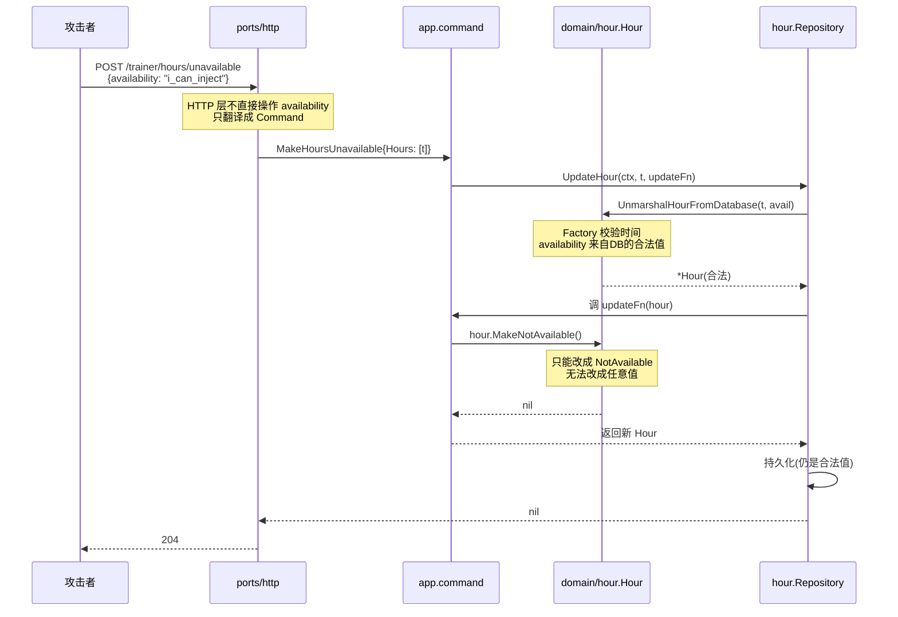
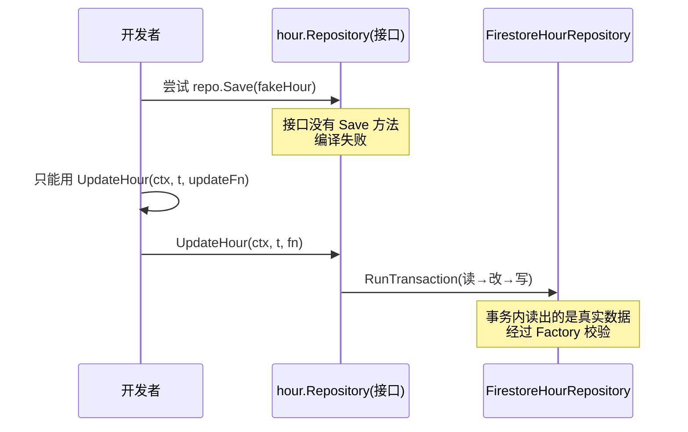

# 009 Repository Secure by Design：让非法状态无法表达

> 对应 wild-workouts README 第 13 篇。
> 知识点：**通过类型设计本身保证安全，让漏洞在编译期就不可发生**。

## 一、理论抽象

### 1.1 Secure by Design 的 5 个层级

从 wild-workouts 代码里提炼出 5 层「防呆设计」，从内到外：

| 层级                    | 手段                         | 防住什么             | 代码位置                                                                                                                                              |
| ----------------------- | ---------------------------- | -------------------- | ----------------------------------------------------------------------------------------------------------------------------------------------------- |
| ① 值对象私有字段        | struct 代替 `type X string`  | 魔法字符串注入       | [availability.go](file:///d:/Blog/backup/tmp/ddd/wild-workouts-go-ddd-example/internal/trainer/domain/hour/availability.go)                           |
| ② 实体字段私有          | 小写字段 + 行为方法          | 外部绕过规则篡改状态 | [hour.go L11-L15](file:///d:/Blog/backup/tmp/ddd/wild-workouts-go-ddd-example/internal/trainer/domain/hour/hour.go#L11-L15)                           |
| ③ 工厂强制校验          | `NewXxx` 构造时 Validate     | 构造出非法对象       | [hour.go L98-L107](file:///d:/Blog/backup/tmp/ddd/wild-workouts-go-ddd-example/internal/trainer/domain/hour/hour.go#L98-L107)                         |
| ④ Repository 接口最小化 | 只有回调式 Update，无裸 Save | 跳过事务直接写库     | [repository.go](file:///d:/Blog/backup/tmp/ddd/wild-workouts-go-ddd-example/internal/trainer/domain/hour/repository.go)                               |
| ⑤ 构造器 nil 检查       | `panic` 暴露装配错误         | 运行期 nil 解引用    | [schedule_training.go L29-L31](file:///d:/Blog/backup/tmp/ddd/wild-workouts-go-ddd-example/internal/trainer/app/command/schedule_training.go#L29-L31) |

每一层都让一类漏洞「在编译期不可发生」，而不是「在运行期被检测」。

### 1.2 Repository 是安全的最后一道闸

前 4 层都在 domain 层，第 5 层是「领域与存储之间」的闸门。如果 Repository 提供了「裸 Save」方法，调用方就能绕过 Factory 构造任意 `Hour` 存进去。wild-workouts 的 `UpdateHour(ctx, t, updateFn)` 回调式设计，让「写出非法状态」在接口层面就不可能——updateFn 拿到的 `*Hour` 是 Repository 从数据库还原的、经过 Factory 校验的对象，调用方只能调它的方法。

---

## 二、时序图

### 2.1 攻击场景：尝试注入非法 availability



攻击者的 `availability: "i_can_inject"` 在 Port 层就被丢弃了——HTTP 请求体里根本没有 availability 字段，只有 `Hours: []time.Time`。攻击面被接口签名直接收窄。

### 2.2 攻击场景：尝试跳过事务直接写库



---

## 三、代码实现

### 1. 第①层：值对象私有字段——[availability.go L22-L24](file:///d:/Blog/backup/tmp/ddd/wild-workouts-go-ddd-example/internal/trainer/domain/hour/availability.go#L22-L24)

```go
type Availability struct {
    a string   // 小写：包外不可访问
}
```

外部包无法写 `Availability{a: "evil"}`（小写字段不可访问），也无法写 `Availability("evil")`（不是字符串别名）。合法值只能从 [L5-L9](file:///d:/Blog/backup/tmp/ddd/wild-workouts-go-ddd-example/internal/trainer/domain/hour/availability.go#L5-L9) 的三个预定义变量获取：

```go
var (
    Available         = Availability{"available"}
    NotAvailable      = Availability{"not_available"}
    TrainingScheduled = Availability{"training_scheduled"}
)
```

从数据库读字符串时，[L26-L33](file:///d:/Blog/backup/tmp/ddd/wild-workouts-go-ddd-example/internal/trainer/domain/hour/availability.go#L26-L33) 的 `NewAvailabilityFromString` 遍历白名单匹配——不匹配就报错。

### 2. 第②层：实体字段私有——[hour.go L11-L15](file:///d:/Blog/backup/tmp/ddd/wild-workouts-go-ddd-example/internal/trainer/domain/hour/hour.go#L11-L15)

```go
type Hour struct {
    hour         time.Time      // 小写
    availability Availability   // 小写
}
```

外部包无法 `h.availability = NotAvailable`（字段不可访问），也无法 `Hour{hour: t, availability: Available}`（小写字段不能在包外初始化）。改状态的唯一通道是行为方法（[availability.go L63-L97](file:///d:/Blog/backup/tmp/ddd/wild-workouts-go-ddd-example/internal/trainer/domain/hour/availability.go#L63-L97)），每个方法都带前置条件检查。

### 3. 第③层：工厂强制校验——[hour.go L98-L107](file:///d:/Blog/backup/tmp/ddd/wild-workouts-go-ddd-example/internal/trainer/domain/hour/hour.go#L98-L107)

```go
func (f Factory) NewAvailableHour(hour time.Time) (*Hour, error) {
    if err := f.validateTime(hour); err != nil {
        return nil, err
    }
    return &Hour{hour: hour, availability: Available}, nil
}
```

`validateTime`（[L186-L217](file:///d:/Blog/backup/tmp/ddd/wild-workouts-go-ddd-example/internal/trainer/domain/hour/hour.go#L186-L217)）检查 5 条规则：整点、未过期、不超未来、UTC 时段上下界。构造时不过检，就得不到 `*Hour`。

`UnmarshalHourFromDatabase`（[L124-L137](file:///d:/Blog/backup/tmp/ddd/wild-workouts-go-ddd-example/internal/trainer/domain/hour/hour.go#L124-L137)）也走 `validateTime`，但允许任意 `availability`（数据库存什么就还原什么）。注释明确警告「不能用这个当构造器」——但 `availability` 本身仍是合法枚举值（`NewAvailabilityFromString` 把过关），保证了还原的安全底线。

### 4. 第④层：Repository 接口最小化——[repository.go](file:///d:/Blog/backup/tmp/ddd/wild-workouts-go-ddd-example/internal/trainer/domain/hour/repository.go)

```go
type Repository interface {
    GetHour(ctx context.Context, hourTime time.Time) (*Hour, error)
    UpdateHour(ctx, hourTime, updateFn func(h *Hour) (*Hour, error)) error
}
```

只有两个方法，没有 `Save`/`Delete`/`Create`：

| 如果有这个方法                      | 会有什么漏洞                           |
| ----------------------------------- | -------------------------------------- |
| `Save(ctx, *Hour)`                  | 调用方 new 一个非法 Hour 存进去        |
| `Create(ctx, *Hour)`                | 同上                                   |
| `Delete(ctx, t)`                    | 业务上 Hour 不应被删除（档期永远存在） |
| `UpdateAvailability(ctx, t, avail)` | 绕过状态机直接改状态                   |

`UpdateHour` 的回调签名（[L10-L14](file:///d:/Blog/backup/tmp/ddd/wild-workouts-go-ddd-example/internal/trainer/domain/hour/repository.go#L10-L14)）强制「先读出来再改」——`updateFn` 收到的是 Repository 从数据库还原的合法 `*Hour`，调用方只能调它的方法。

### 5. 第⑤层：构造器 nil 检查——[schedule_training.go L29-L31](file:///d:/Blog/backup/tmp/ddd/wild-workouts-go-ddd-example/internal/trainer/app/command/schedule_training.go#L29-L31)

```go
func NewScheduleTrainingHandler(hourRepo hour.Repository, ...) ScheduleTrainingHandler {
    if hourRepo == nil {
        panic("nil hourRepo")
    }
    // ...
}
```

依赖注入在启动期就验证。`panic` 在构造器里是合理的——装配错误是程序 bug，不是可恢复的运行时错误。[cancel_training.go L33-L41](file:///d:/Blog/backup/tmp/ddd/wild-workouts-go-ddd-example/internal/trainings/app/command/cancel_training.go#L33-L41) 检查了三个依赖，任何一个漏注入服务启动就崩。

### 6. 内存仓储的「值语义」防护——[hour_memory_repository.go L43-L46](file:///d:/Blog/backup/tmp/ddd/wild-workouts-go-ddd-example/internal/trainer/adapters/hour_memory_repository.go#L43-L46)

```go
// we don't store hours as pointers, but as values
// thanks to that, we are sure that nobody can modify Hour without using UpdateHour
return &currentHour, nil
```

内存仓储存的是 `hour.Hour`（值），`GetHour` 返回的是 `&currentHour`（拷贝的地址）。调用方拿到指针改了字段，也不会影响 map 里的值——只有走 `UpdateHour` 才能真正改库。

---

> 下一章 [010 Vertical Slice Architecture](./010_Vertical_Slice_Architecture.md) 进入第二部分，讲解 go-food-delivery 的垂直切片架构。
