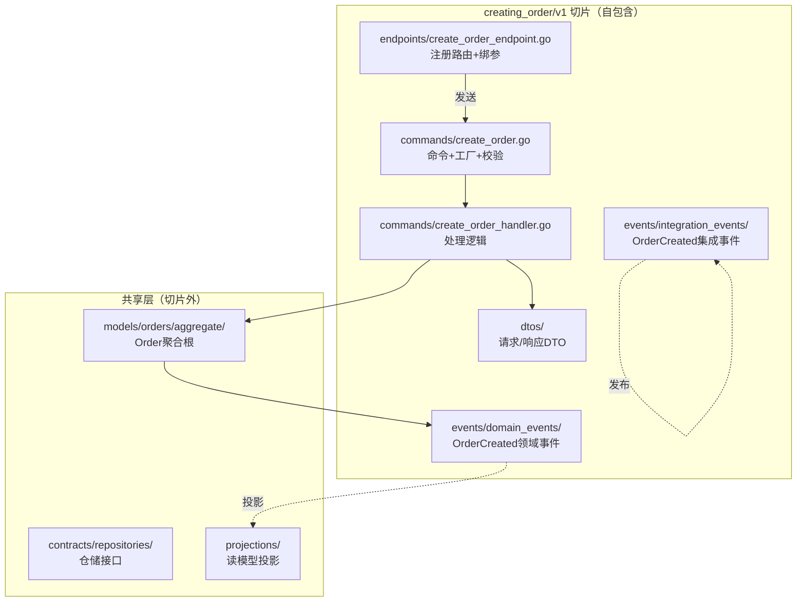
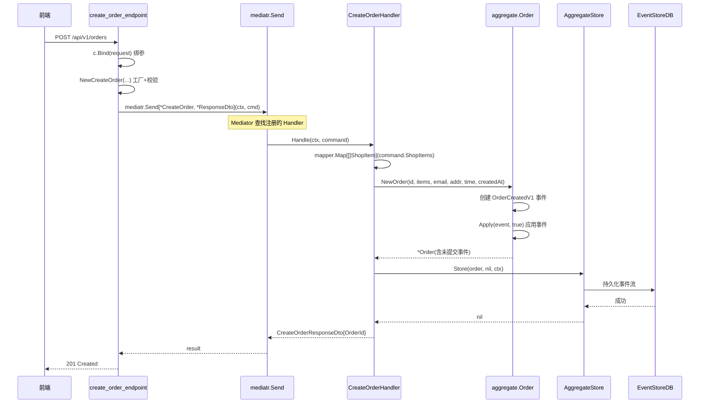

# 010 Vertical Slice Architecture：按功能切，不按技术切

> 本章进入第二部分「生产级微服务」，基于 go-food-delivery-microservices。
> 知识点：**Vertical Slice Architecture（VSA）—— 每个功能自包含，切片内高聚合、切片间低耦合**。

## 一、理论抽象

### 1.1 从「分层」到「分片」

wild-workouts 用**分层架构**：按技术层切分目录（`ports/`、`app/`、`domain/`、`adapters/`），改一个功能要跳 4 个目录。

go-food-delivery 用**垂直切片架构**：按功能切分目录（`creating_order/`、`getting_order_by_id/`、`getting_orders/`），改一个功能只待在一个目录里。

```
分层架构（wild-workouts）            垂直切片架构（go-food-delivery）
┌─────────────────────┐             ┌──────────┬──────────┬──────────┐
│ ports/ (HTTP+gRPC)  │             │ creating │ getting   │ getting   │
├─────────────────────┤             │ _order   │ _by_id    │ _orders   │
│ app/command/        │             │ ┌────────┤┌────────┐├──────────┤
│ app/query/          │             │ │endpoint││endpoint││endpoint  │
├─────────────────────┤             │ │command ││query   ││query     │
│ domain/hour/        │  ───────►   │ │handler ││handler ││handler   │
├─────────────────────┤             │ │dto     ││dto     ││dto       │
│ adapters/           │             │ │events  ││        ││          │
└─────────────────────┘             │ └────────┘└────────┘└──────────┘
   改一个功能跳4层                   └──────────┴──────────┴──────────┘
                                     改一个功能待在1个切片里
```

### 1.2 VSA 的两条核心原则

| 原则                 | 含义                                                         | 反面                                |
| -------------------- | ------------------------------------------------------------ | ----------------------------------- |
| **切片内最大化聚合** | 一个功能的 endpoint/command/handler/dto/events 放同目录      | 散落在多个技术层目录                |
| **切片间最小化耦合** | 切片之间不共享 command/handler，只共享 domain model 和 infra | 所有 handler 继承同一个 BaseService |

### 1.3 VSA 与 CQRS 是天作之合

每个切片就是一个用例，结合 CQRS 后每个切片内部就是一个 Command 或 Query 的完整实现：

```
features/
├── creating_order/v1/commands/        ← Command 切片
├── submitting_order/v1/commands/       ← Command 切片
├── getting_order_by_id/v1/queries/     ← Query 切片
└── getting_orders/v1/queries/          ← Query 切片
```

### 1.4 版本化切片

每个切片下都有 `v1/` 目录。API 需要破坏性变更时，新建 `creating_order/v2/`，v1 继续工作。两个版本的 endpoint/dto/handler 互不干扰，共享同一个 domain model。

---

## 二、时序图

### 2.1 creating_order 切片的内部结构



切片内部的 5 个文件只服务于「创建订单」这一个用例，不被其他切片引用。

### 2.2 一次「创建订单」请求的流转



endpoint 不直接调 handler，而是通过 Mediator 间接路由（第 12 章详解）。

---

## 三、代码实现

### 1. 切片目录结构

以 `creating_order/v1` 为例：

```
features/creating_order/v1/
├── commands/
│   ├── create_order.go            ← 命令结构 + 工厂 + 校验
│   └── create_order_handler.go   ← 处理逻辑
├── dtos/
│   ├── create_order_request_dto.go
│   └── create_order_response_dto.go
├── endpoints/
│   └── create_order_endpoint.go   ← HTTP 路由 + 绑参
└── events/
    ├── domain_events/
    │   └── order_created.go       ← 领域事件
    └── integration_events/
        └── order_created.go       ← 集成事件（跨服务）
```

一个目录包含改这个功能需要碰的所有文件。

### 2. 切片入口：路由自注册——[create_order_endpoint.go L28-L30](file:///d:/Blog/backup/tmp/ddd/go-food-delivery-microservices/internal/services/orderservice/internal/orders/features/creating_order/v1/endpoints/create_order_endpoint.go#L28-L30)

```go
func (ep *createOrderEndpoint) MapEndpoint() {
    ep.OrdersGroup.POST("", ep.handler())
}
```

每个 endpoint 实现 `route.Endpoint` 接口，自己负责注册路由。装配时 [orders_module_configurator.go L62-L67](file:///d:/Blog/backup/tmp/ddd/go-food-delivery-microservices/internal/services/orderservice/internal/orders/configurations/orders_module_configurator.go#L62-L67) 用 fx 的 tag 收集所有 endpoint 并批量调用：

```go
c.ResolveFuncWithParamTag(func(endpoints []route.Endpoint) {
    for _, endpoint := range endpoints {
        endpoint.MapEndpoint()
    }
}, `group:"order-routes"`)
```

新增切片只需新建目录 + 注册到 mediatr，不用改任何现有代码。

### 3. 切片命令：工厂 + 校验——[create_order.go L23-L53](file:///d:/Blog/backup/tmp/ddd/go-food-delivery-microservices/internal/services/orderservice/internal/orders/features/creating_order/v1/commands/create_order.go#L23-L53)

```go
func NewCreateOrder(shopItems, accountEmail, deliveryAddress, deliveryTime) (*CreateOrder, error) {
    command := &CreateOrder{
        OrderId:         uuid.NewV4(),        // 工厂内生成ID
        ShopItems:       shopItems,
        CreatedAt:       time.Now(),
    }
    err := command.Validate()                 // 构造即校验
    if err != nil { return nil, err }
    return command, nil
}

func (c CreateOrder) Validate() error {
    return validation.ValidateStruct(&c,
        validation.Field(&c.OrderId, validation.Required),
        validation.Field(&c.ShopItems, validation.Required),
    )
}
```

和 wild-workouts 的 `hour.NewAvailableHour` 套路一致：工厂生成 ID + 构造即校验。go-food-delivery 用 `go-ozzo/ozzo-validation` 做声明式校验。

### 4. 切片处理器：薄编排——[create_order_handler.go L32-L75](file:///d:/Blog/backup/tmp/ddd/go-food-delivery-microservices/internal/services/orderservice/internal/orders/features/creating_order/v1/commands/create_order_handler.go#L32-L75)

```go
func (c *CreateOrderHandler) Handle(ctx, command) (*dtos.CreateOrderResponseDto, error) {
    shopItems, err := mapper.Map[[]*value_objects.ShopItem](command.ShopItems)  // DTO→值对象
    order, err := aggregate.NewOrder(...)                                      // 调领域工厂
    _, err = c.aggregateStore.Store(order, nil, ctx)                            // 持久化
    response := &dtos.CreateOrderResponseDto{OrderId: order.Id()}
    return response, nil
}
```

Handler 只做 4 件事：映射 DTO → 调领域工厂 → 持久化 → 返回响应。业务规则在 `aggregate.NewOrder` 里，Handler 不写 if。

### 5. 切片事件：领域事件 + 集成事件分离——[order_created.go](file:///d:/Blog/backup/tmp/ddd/go-food-delivery-microservices/internal/services/orderservice/internal/orders/features/creating_order/v1/events/domain_events/order_created.go)

```go
type OrderCreatedV1 struct {
    *domain.DomainEvent
    OrderId         uuid.UUID
    ShopItems       []*dtosV1.ShopItemDto
    AccountEmail    string
    // ...
}

func NewOrderCreatedEventV1(aggregateId, shopItems, ...) (*OrderCreatedV1, error) {
    if shopItems == nil || len(shopItems) == 0 {
        return nil, domainExceptions.NewOrderShopItemsRequiredError("shopItems is required")
    }
    eventData := &OrderCreatedV1{...}
    eventData.DomainEvent = domain.NewDomainEvent(typeMapper.GetTypeName(eventData))
    return eventData, nil
}
```

events 目录下分了 `domain_events/`（聚合内部状态变更，重建聚合用）和 `integration_events/`（跨服务发布，RabbitMQ 消息）。同一个「OrderCreated」概念按用途拆成两个事件类型。

### 6. 切片装配：Mediator 注册——[mediator_configurations.go L19-L47](file:///d:/Blog/backup/tmp/ddd/go-food-delivery-microservices/internal/services/orderservice/internal/orders/configurations/mediatr/mediator_configurations.go#L19-L47)

```go
func ConfigOrdersMediator(logger, mongoOrderReadRepository, orderAggregateStore, tracer) error {
    err := mediatr.RegisterRequestHandler[*createOrderCommandV1.CreateOrder, *createOrderDtosV1.CreateOrderResponseDto](
        createOrderCommandV1.NewCreateOrderHandler(logger, orderAggregateStore, tracer),
    )
    err = mediatr.RegisterRequestHandler[*getOrderByIdQueryV1.GetOrderById, *getOrderByIdDtosV1.GetOrderByIdResponseDto](
        getOrderByIdQueryV1.NewGetOrderByIdHandler(logger, mongoOrderReadRepository, tracer),
    )
}
```

每个切片的 handler 在这里注册到 Mediator。endpoint 调 `mediatr.Send` 时，Mediator 按请求类型找到对应 handler。切片之间不直接引用，只通过 Mediator 间接连接。

### 7. 共享层：什么放在切片外

| 共享内容          | 位置                            | 为什么共享                      |
| ----------------- | ------------------------------- | ------------------------------- |
| 聚合根 `Order`    | `models/orders/aggregate/`      | 多个 Command 切片都改同一个聚合 |
| 值对象 `ShopItem` | `models/orders/value_objects/`  | 聚合和 DTO 都用                 |
| 仓储接口          | `contracts/repositories/`       | 多个 Query 切片共用             |
| 读模型投影        | `projections/`                  | 事件驱动，不归属单个切片        |
| 领域异常          | `exceptions/domain_exceptions/` | 多个切片抛同类错误              |

判断标准：**被多个切片引用的放外面，只被一个切片用的放里面**。

---

> 下一章 [011 依赖注入 uber-fx](./011_依赖注入_uber_fx.md) 讲解 go-food-delivery 如何用 uber-go/fx 做依赖注入。
