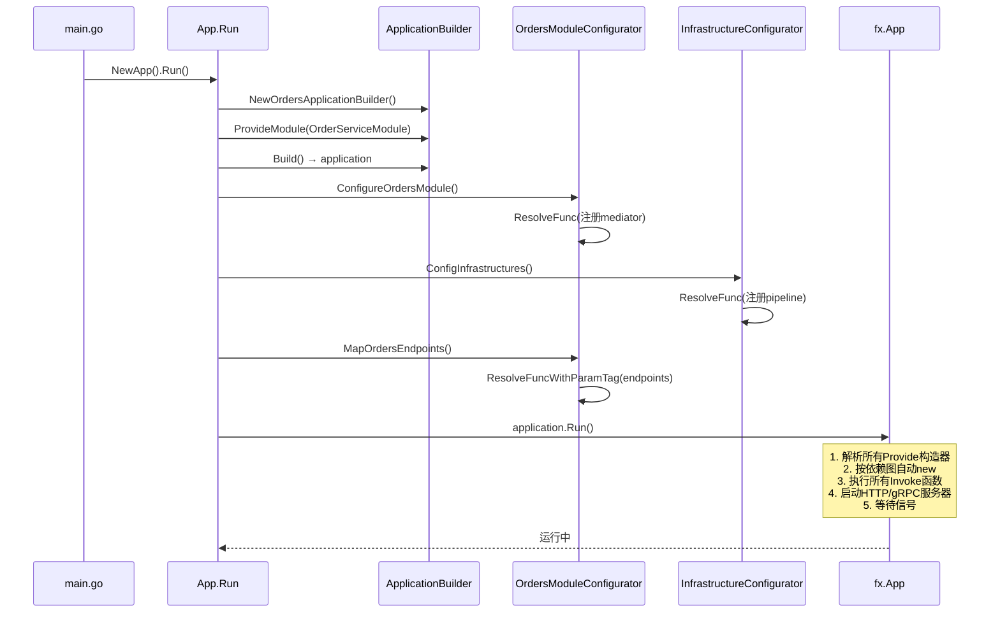

# 011 依赖注入 uber-fx：让容器替你接线

> 知识点：**uber-go/fx 的 Provide/Invoke 模型 + ResolveFunc 封装 + 模块化装配**。

## 一、理论抽象

### 1.1 uber-go/fx 的核心模型

| 原语         | 作用                                            | 类比             |
| ------------ | ----------------------------------------------- | ---------------- |
| `fx.Provide` | 注册构造器「我能生产 X」                        | 告诉容器怎么 new |
| `fx.Invoke`  | 执行一段需要依赖的函数「给我 X 和 Y，我要做 Z」 | 启动时跑一次     |
| `fx.Module`  | 把一组 Provide/Invoke 打包成模块                | 命名空间         |

关键机制：**fx 根据函数签名自动解析依赖**。构造器签名是 `func(A, B) C`，fx 先找到 A 和 B，调用函数得到 C，存入容器。调用 `Invoke(func(A, B))` 时，fx 自动注入 A 和 B。如果任何依赖找不到构造器，fx 启动时报错退出。

### 1.2 go-food-delivery 的 fx 封装层

go-food-delivery 包了一层 `Application` 接口，业务代码不直接依赖 fx API：

| 封装方法                           | 对应 fx                                         | 用途                   |
| ---------------------------------- | ----------------------------------------------- | ---------------------- |
| `ResolveFunc(fn)`                  | `fx.Invoke(fn)`                                 | 注册启动时要执行的函数 |
| `ResolveFuncWithParamTag(fn, tag)` | `fx.Invoke(fx.Annotate(fn, fx.ParamTags(tag)))` | 按标签注入一组依赖     |
| `RegisterHook(fn)`                 | `fx.Invoke(fn)`                                 | 注册生命周期 hook      |

---

## 二、时序图



`ResolveFunc` 只是「登记」，真正执行发生在 `fxApp.Run()`。所有 Configurator 调 `ResolveFunc` 时只是把函数 append 到 `invokes` 列表；到 `Run()` 时 fx 才按依赖图解析并执行。

---

## 三、代码实现

### 1. 应用入口：Builder + Module——[orderservice/internal/shared/app/app.go](file:///d:/Blog/backup/tmp/ddd/go-food-delivery-microservices/internal/services/orderservice/internal/shared/app/app.go)

```go
func (a *App) Run() {
    appBuilder := NewOrdersApplicationBuilder()          // 1. 创建构建器
    appBuilder.ProvideModule(orders.OrderServiceModule) // 2. 注册模块
    app := appBuilder.Build()                            // 3. 构建application

    app.ConfigureOrders()                                // 4. 配置模块
    app.MapOrdersEndpoints()                             // 5. 映射路由

    app.Logger().Info("Starting orders_service application")
    app.Run()                                            // 6. 启动fx
}
```

6 步分离：构建器收集依赖 → 构建应用 → 配置业务模块 → 映射路由 → 启动。

### 2. fx 应用构建——[fxapp/app_fx.go L16-L55](file:///d:/Blog/backup/tmp/ddd/go-food-delivery-microservices/internal/pkg/fxapp/app_fx.go#L16-L55)

```go
func CreateFxApp(app *application) *fx.App {
    var opts []fx.Option
    opts = append(opts, fx.Provide(app.provides...))     // 注册所有构造器
    opts = append(opts, fx.Decorate(app.decorates...))   // 装饰器
    opts = append(opts, fx.Invoke(app.invokes...))        // 注册所有invoke
    app.options = append(app.options, opts...)

    AppModule := fx.Module("fxapp", app.options...)       // 打包成模块

    fxApp := fx.New(
        fx.StartTimeout(30*time.Second),
        config.ModuleFunc(app.environment),
        logModule,
        fxlog.FxLogger,
        fx.ErrorHook(NewFxErrorHandler(app.logger)),
        AppModule,
    )
    return fxApp
}
```

[L21-L25](file:///d:/Blog/backup/tmp/ddd/go-food-delivery-microservices/internal/pkg/fxapp/app_fx.go#L21-L25) 把三个列表（provides/invokes/options）转成 fx 的 Option。基础设施和业务模块平级传入，fx 统一管理。

### 3. ResolveFunc：Invoke 的封装——[fxapp/application.go L39-L45](file:///d:/Blog/backup/tmp/ddd/go-food-delivery-microservices/internal/pkg/fxapp/application.go#L39-L45)

```go
func (a *application) ResolveFunc(function interface{}) {
    a.invokes = append(a.invokes, function)
}

func (a *application) ResolveFuncWithParamTag(function interface{}, paramTagName string) {
    a.invokes = append(a.invokes, fx.Annotate(function, fx.ParamTags(paramTagName)))
}
```

`ResolveFuncWithParamTag` 用 `fx.ParamTags` 给参数打标签——fx 的「value group」机制。看 [orders_module_configurator.go L62-L67](file:///d:/Blog/backup/tmp/ddd/go-food-delivery-microservices/internal/services/orderservice/internal/orders/configurations/orders_module_configurator.go#L62-L67)：

```go
c.ResolveFuncWithParamTag(func(endpoints []route.Endpoint) {
    for _, endpoint := range endpoints {
        endpoint.MapEndpoint()
    }
}, `group:"order-routes"`)
```

所有用 `fx.Provide` + `fx.ResultTags(`group:"order-routes"`)` 注册的 endpoint，会被 fx 收集成一个 `[]route.Endpoint` 切片注入。新增 endpoint 只要在构造器打上同样的 tag，不用改任何装配代码。

### 4. 模块配置器：装配 Mediator——[orders_module_configurator.go L35-L57](file:///d:/Blog/backup/tmp/ddd/go-food-delivery-microservices/internal/services/orderservice/internal/orders/configurations/orders_module_configurator.go#L35-L57)

```go
func (c *OrdersModuleConfigurator) ConfigureOrdersModule() {
    c.ResolveFunc(
        func(logger logger.Logger,
            server echocontracts.EchoHttpServer,
            orderRepository repositories.OrderMongoRepository,
            orderAggregateStore store.AggregateStore[*aggregate.Order],
            tracer tracing.AppTracer,
        ) error {
            err := mappings.ConfigureOrdersMappings()
            err = mediatr.ConfigOrdersMediator(logger, orderRepository, orderAggregateStore, tracer)
            return err
        },
    )
}
```

函数声明需要 5 个依赖，fx 自动从容器注入。`OrdersModuleConfigurator` 嵌入了 `contracts.Application`（[L24](file:///d:/Blog/backup/tmp/ddd/go-food-delivery-microservices/internal/services/orderservice/internal/orders/configurations/orders_module_configurator.go#L24)），每个业务模块自己管理装配，互不干扰。

### 5. 基础设施配置器：注册横切管道——[infrastructure_configurator.go L27-L44](file:///d:/Blog/backup/tmp/ddd/go-food-delivery-microservices/internal/services/orderservice/internal/shared/configurations/orders/infrastructure/infrastructure_configurator.go#L27-L44)

```go
func (ic *InfrastructureConfigurator) ConfigInfrastructures() {
    ic.ResolveFunc(
        func(l logger.Logger, tracer tracing.AppTracer, metrics metrics.AppMetrics) error {
            err := mediatr.RegisterRequestPipelineBehaviors(
                loggingpipelines.NewMediatorLoggingPipeline(l),
                tracingpipelines.NewMediatorTracingPipeline(tracer, ...),
                metricspipelines.NewMediatorMetricsPipeline(metrics, ...),
            )
            return err
        },
    )
}
```

注册了 Mediator 的三个管道行为（pipeline behaviors）：日志、tracing、metrics。这是 wild-workouts 装饰器的升级版——装饰器在构造时包，pipeline 在发送时穿（第 12 章详解）。

### 6. 生命周期管理——[fxapp/application.go L51-L84](file:///d:/Blog/backup/tmp/ddd/go-food-delivery-microservices/internal/pkg/fxapp/application.go#L51-L84)

```go
func (a *application) Run() {
    fxApp := CreateFxApp(a)
    a.fxapp = fxApp
    fxApp.Run()               // 启动 + 阻塞等待信号
}

func (a *application) Start(ctx context.Context) error {
    fxApp := CreateFxApp(a)
    a.fxapp = fxApp
    return fxApp.Start(ctx)   // 只启动不阻塞
}

func (a *application) Stop(ctx context.Context) error {
    return a.fxapp.Stop(ctx)  // 优雅关闭
}
```

`Run()` 是生产用法，`Start()/Stop()` 是测试用法。fx 自动管理 `OnStart`/`OnStop` hook，关闭时按依赖逆序释放资源。

---

> 下一章 [012 CQRS + Mediator 模式](./012_CQRS_Mediator模式.md) 讲解 Go-MediatR 的 Mediator 模式。
