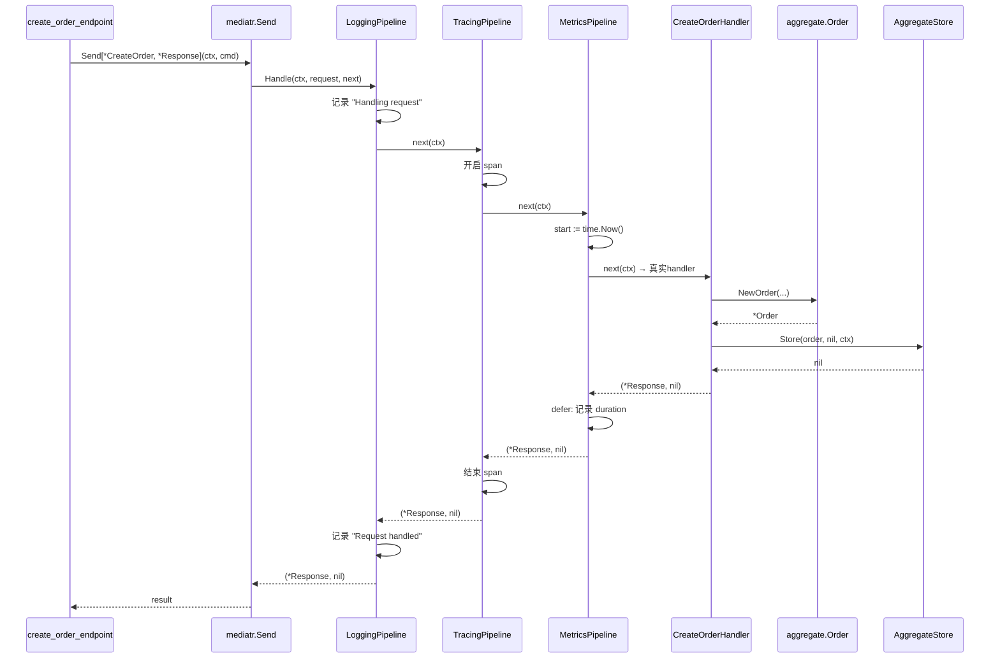

# 012 CQRS + Mediator 模式：发送者不该认识接收者

> 知识点：**Go-MediatR 的 Mediator 模式 + Pipeline Behaviors**。

## 一、理论抽象

### 1.1 从「直接调用」到「间接发送」

wild-workouts 的调用方持有 handler 引用：

```go
// wild-workouts: 调用方知道具体 handler
app.Commands.CancelTraining.Handle(ctx, cmd)
```

go-food-delivery 用 Mediator 模式，调用方不持有 handler：

```go
// go-food-delivery: 调用方只认识 Mediator
mediatr.Send[*CreateOrder, *CreateOrderResponseDto](ctx, command)
```

| 维度       | 直接调用（wild-workouts） | Mediator（go-food-delivery） |
| ---------- | ------------------------- | ---------------------------- |
| 调用方依赖 | 持有具体 handler          | 只依赖 mediatr 包            |
| 路由方式   | 编译期确定（字段名）      | 运行期查表（请求类型）       |
| 加 handler | 改 Application 结构体     | 只改注册，不改调用方         |
| 横切关注点 | 构造时装饰（包洋葱）      | 发送时穿过（管道）           |

### 1.2 Mediator 的路由机制

- **发送者**（endpoint）只知道「我要发一个 CreateOrder 命令」
- **Mediator**（Go-MediatR）维护一张「请求类型 → handler」的路由表
- **接收者**（handler）注册到 Mediator，不知道谁会发请求

endpoint 和 handler 互不认识，加新切片时 endpoint 不用 import handler 包——这是 VSA「切片间最小化耦合」的技术保障。

### 1.3 Pipeline Behaviors：发送时的中间件

类似 HTTP 中间件，在 handler 执行前后插入逻辑：

```
请求 → [logging] → [tracing] → [metrics] → handler → [metrics] → [tracing] → [logging] → 响应
```

| 机制     | 装饰器（wild-workouts）           | Pipeline（go-food-delivery）              |
| -------- | --------------------------------- | ----------------------------------------- |
| 注入时机 | 构造时包（每个 handler 单独包）   | 发送时穿（所有请求共用一条管道）          |
| 粒度     | 可为不同 handler 包不同装饰器     | 所有请求穿同一条管道                      |
| 注册     | 构造器里 `ApplyCommandDecorators` | 启动时 `RegisterRequestPipelineBehaviors` |

---

## 二、时序图



三层 pipeline 自动穿过，handler 主体零侵入。对比 wild-workouts 每个 handler 构造时要调 `ApplyCommandDecorators`，go-food-delivery 的 handler 构造器只传业务依赖，横切关注点完全交给 Pipeline。

---

## 三、代码实现

### 1. 发送端：mediatr.Send——[create_order_endpoint.go L75-L78](file:///d:/Blog/backup/tmp/ddd/go-food-delivery-microservices/internal/services/orderservice/internal/orders/features/creating_order/v1/endpoints/create_order_endpoint.go#L75-L78)

```go
result, err := mediatr.Send[*createOrderCommandV1.CreateOrder, *dtos.CreateOrderResponseDto](
    ctx,
    command,
)
```

泛型参数 `[请求类型, 响应类型]` 告诉 Mediator 「我要发一个 CreateOrder，期望返回 CreateOrderResponseDto」。Mediator 内部按 `*CreateOrder` 类型查路由表，找到 `CreateOrderHandler` 调用。endpoint 不 import handler 包。

### 2. 接收端：注册 handler——[mediator_configurations.go L26-L31](file:///d:/Blog/backup/tmp/ddd/go-food-delivery-microservices/internal/services/orderservice/internal/orders/configurations/mediatr/mediator_configurations.go#L26-L31)

```go
err := mediatr.RegisterRequestHandler[*createOrderCommandV1.CreateOrder, *createOrderDtosV1.CreateOrderResponseDto](
    createOrderCommandV1.NewCreateOrderHandler(logger, orderAggregateStore, tracer),
)
```

`RegisterRequestHandler[请求, 响应](handler)` 把 handler 存入路由表。handler 的构造器参数全是业务依赖（logger、aggregateStore、tracer）——没有 `ApplyCommandDecorators`，横切关注点由 Pipeline 统一处理。

[L33-L45](file:///d:/Blog/backup/tmp/ddd/go-food-delivery-microservices/internal/services/orderservice/internal/orders/configurations/mediatr/mediator_configurations.go#L33-L45) 注册了 3 个 handler：1 个 Command（CreateOrder）+ 2 个 Query（GetOrderById、GetOrders）。Command 和 Query 用同一个 Mediator，只是返回类型不同。

### 3. Pipeline 注册：一次注册，全局生效——[infrastructure_configurator.go L30-L40](file:///d:/Blog/backup/tmp/ddd/go-food-delivery-microservices/internal/services/orderservice/internal/shared/configurations/orders/infrastructure/infrastructure_configurator.go#L30-L40)

```go
err := mediatr.RegisterRequestPipelineBehaviors(
    loggingpipelines.NewMediatorLoggingPipeline(l),
    tracingpipelines.NewMediatorTracingPipeline(tracer, ...),
    metricspipelines.NewMediatorMetricsPipeline(metrics, ...),
)
```

三个 Pipeline 一次性注册：日志、tracing、metrics。之后所有 `mediatr.Send` 都会穿过这条管道。

### 4. Pipeline 实现：中间件模式——[logging_pipeline.go L22-L57](file:///d:/Blog/backup/tmp/ddd/go-food-delivery-microservices/internal/pkg/logger/pipelines/logging_pipeline.go#L22-L57)

```go
func (r *requestLoggerPipeline) Handle(
    ctx context.Context,
    request interface{},
    next mediatr.RequestHandlerFunc,
) (interface{}, error) {
    startTime := time.Now()
    defer func() {
        elapsed := time.Since(startTime)
        r.logger.Infof("Request took %s", elapsed)           // 后置：记录耗时
    }()

    requestName := typeMapper.GetNonePointerTypeName(request)
    r.logger.Infow(fmt.Sprintf("Handling request: '%s'", requestName), ...)  // 前置：记录请求

    response, err := next(ctx)                               // 穿到下一层（最终到 handler）
    if err != nil {
        r.logger.Infof("Request failed with error: %v", err)
        return nil, err
    }

    r.logger.Infow(fmt.Sprintf("Request handled successfully: '%s'", ...), ...)  // 后置：记录响应
    return response, nil
}
```

`next mediatr.RequestHandlerFunc` 是管道链的下一个环节。调 `next(ctx)` 就穿到下一层 pipeline 或最终 handler。和 HTTP 中间件的 `next.ServeHTTP` 完全同构。

对比 wild-workouts 的 [decorator/logging.go](file:///d:/Blog/backup/tmp/ddd/wild-workouts-go-ddd-example/internal/common/decorator/logging.go)：装饰器用「嵌套 struct + 调 `d.base.Handle`」实现洋葱，pipeline 用「闭包 + 调 `next(ctx)`」实现中间件。前者是构造期组合，后者是运行期链式。

### 5. 前置概念：聚合根是什么

读写分离涉及 `AggregateStore` 和 `aggregate.Order`，需要先理解聚合根。

以 [order.go L24-39](file:///d:/Blog/backup/tmp/ddd/go-food-delivery-microservices/internal/services/orderservice/internal/orders/models/orders/aggregate/order.go#L24-L39) 为例：

```go
// 聚合根 Order
type Order struct {
    *models.EventSourcedAggregateRoot          // 继承:事件溯源能力
    shopItems       []*value_objects.ShopItem   // 内部值对象(私有)
    accountEmail    string                       // 私有字段
    deliveryAddress string
    paid            bool
    // ...全是私有字段
}

// 值对象——聚合内部组成部分，不独立存在
// shop_item.go
type ShopItem struct {
    title       string   // 全私有
    quantity    uint64
    price       float64
}
```

聚合根的三个关键点：

| 关键点     | 说明                                                          | 代码体现                                                                                                                                                                                                    |
| ---------- | ------------------------------------------------------------- | ----------------------------------------------------------------------------------------------------------------------------------------------------------------------------------------------------------- |
| 唯一入口   | 外部只能持有 `*Order`，不能直接拿 `*ShopItem` 去改            | `shopItems` 字段小写，包外不可访问                                                                                                                                                                          |
| 一致性边界 | 聚合内所有字段必须满足业务不变量                              | `NewOrder` 构造时校验 `shopItems` 非空                                                                                                                                                                      |
| 持久化单位 | `AggregateStore.Store(order)` 存整个聚合，不单独存 `ShopItem` | [create_order_handler.go L60](file:///d:/Blog/backup/tmp/ddd/go-food-delivery-microservices/internal/services/orderservice/internal/orders/features/creating_order/v1/commands/create_order_handler.go#L60) |

外部代码改状态的唯一通道是聚合根的行为方法：

```go
// ✅ 走聚合根方法
order.UpdateShoppingCard(items)   // order.go L98

// ❌ 无法绕过聚合根(字段私有)
// order.shopItems[0].price = 0.01   // 编译错误
```

### 6. 写端：Command Handler 怎么写——[create_order_handler.go](file:///d:/Blog/backup/tmp/ddd/go-food-delivery-microservices/internal/services/orderservice/internal/orders/features/creating_order/v1/commands/create_order_handler.go)

写端的完整流程在 [L32-75](file:///d:/Blog/backup/tmp/ddd/go-food-delivery-microservices/internal/services/orderservice/internal/orders/features/creating_order/v1/commands/create_order_handler.go#L32-L75)，三步走：

**第一步：Command DTO → 值对象**（[L36-43](file:///d:/Blog/backup/tmp/ddd/go-food-delivery-microservices/internal/services/orderservice/internal/orders/features/creating_order/v1/commands/create_order_handler.go#L36-L43)）

```go
// Command 里的 ShopItems 是 DTO，映射为领域值对象
shopItems, err := mapper.Map[[]*value_objects.ShopItem](command.ShopItems)
```

**第二步：构造聚合根**（[L45-58](file:///d:/Blog/backup/tmp/ddd/go-food-delivery-microservices/internal/services/orderservice/internal/orders/features/creating_order/v1/commands/create_order_handler.go#L45-L58)）

```go
// 通过工厂函数构造聚合根（内部触发 OrderCreatedV1 领域事件）
order, err := aggregate.NewOrder(
    command.OrderId,
    shopItems,
    command.AccountEmail,
    command.DeliveryAddress,
    command.DeliveryTime,
    command.CreatedAt,
)
```

`NewOrder` 内部调 `order.Apply(event, true)`——聚合根在构造时就产生领域事件，事件被记录在聚合根的 `EventSourcedAggregateRoot` 里。

**第三步：持久化聚合根**（[L60-66](file:///d:/Blog/backup/tmp/ddd/go-food-delivery-microservices/internal/services/orderservice/internal/orders/features/creating_order/v1/commands/create_order_handler.go#L60-L66)）

```go
// 存的是整个聚合根，写入 EventStoreDB 事件流
_, err = c.aggregateStore.Store(order, nil, ctx)
```

`AggregateStore` 把聚合根里积累的领域事件追加到 EventStoreDB 的事件流。这里不碰 MongoDB——写端只写事件库。

**返回**（[L68](file:///d:/Blog/backup/tmp/ddd/go-food-delivery-microservices/internal/services/orderservice/internal/orders/features/creating_order/v1/commands/create_order_handler.go#L68)）：

```go
response := &dtos.CreateOrderResponseDto{OrderId: order.Id()}
```

只返回订单 ID，不返回完整领域对象——领域对象不暴露到 HTTP 层。

### 7. 读端：Query Handler 怎么写——[get_order_by_id_handler.go](file:///d:/Blog/backup/tmp/ddd/go-food-delivery-microservices/internal/services/orderservice/internal/orders/features/getting_order_by_id/v1/queries/get_order_by_id_handler.go)

读端完全不碰 EventStoreDB，直接查 MongoDB 读模型投影。完整流程在 [L34-77](file:///d:/Blog/backup/tmp/ddd/go-food-delivery-microservices/internal/services/orderservice/internal/orders/features/getting_order_by_id/v1/queries/get_order_by_id_handler.go#L34-L77)：

**第一步：按读模型 ID 查 MongoDB**（[L39-48](file:///d:/Blog/backup/tmp/ddd/go-food-delivery-microservices/internal/services/orderservice/internal/orders/features/getting_order_by_id/v1/queries/get_order_by_id_handler.go#L39-L48)）

```go
// 直接查 MongoDB 读模型，不经过 EventStoreDB
order, err := q.orderMongoRepository.GetOrderById(ctx, query.Id)
```

`OrderMongoRepository` 是独立于 `AggregateStore` 的另一个 Repository，连的是 MongoDB 不是 EventStoreDB。读模型是事件流的**投影**——由后台 Projection Worker 消费事件流后写入 MongoDB。

**第二步：回退查询**（[L50-62](file:///d:/Blog/backup/tmp/ddd/go-food-delivery-microservices/internal/services/orderservice/internal/orders/features/getting_order_by_id/v1/queries/get_order_by_id_handler.go#L50-L62)）

```go
if order == nil {
    // 读模型投影可能有延迟(事件还没消费完)，换另一个索引查
    order, err = q.orderMongoRepository.GetOrderByOrderId(ctx, query.Id)
}
```

事件溯源的读模型是最终一致的——事件写入 EventStoreDB 后，Projection Worker 异步消费写入 MongoDB。如果查的时候投影还没跟上，用另一个索引字段兜底。

**第三步：映射为读 DTO**（[L64-70](file:///d:/Blog/backup/tmp/ddd/go-food-delivery-microservices/internal/services/orderservice/internal/orders/features/getting_order_by_id/v1/queries/get_order_by_id_handler.go#L64-L70)）

```go
// 读模型 → 读 DTO（加 json tag 用于序列化）
orderDto, err := mapper.Map[*dtosV1.OrderReadDto](order)
```

**返回**（[L77](file:///d:/Blog/backup/tmp/ddd/go-food-delivery-microservices/internal/services/orderservice/internal/orders/features/getting_order_by_id/v1/queries/get_order_by_id_handler.go#L77)）：

```go
return &dtos.GetOrderByIdResponseDto{Order: orderDto}, nil
```

返回完整订单数据（读 DTO），不是只返回 ID——读端要给前端展示用。

### 8. 读写分离对照

| 维度       | Command Handler（写端）                                                                                                                                                                             | Query Handler（读端）                                                                                                                                                                                         |
| ---------- | --------------------------------------------------------------------------------------------------------------------------------------------------------------------------------------------------- | ------------------------------------------------------------------------------------------------------------------------------------------------------------------------------------------------------------- |
| 代码位置   | [create_order_handler.go](file:///d:/Blog/backup/tmp/ddd/go-food-delivery-microservices/internal/services/orderservice/internal/orders/features/creating_order/v1/commands/create_order_handler.go) | [get_order_by_id_handler.go](file:///d:/Blog/backup/tmp/ddd/go-food-delivery-microservices/internal/services/orderservice/internal/orders/features/getting_order_by_id/v1/queries/get_order_by_id_handler.go) |
| 构造器依赖 | `AggregateStore[*Order]`（事件库）                                                                                                                                                                  | `OrderMongoRepository`（读模型库）                                                                                                                                                                            |
| 数据源     | EventStoreDB（事件流）                                                                                                                                                                              | MongoDB（读模型投影）                                                                                                                                                                                         |
| 操作       | `aggregateStore.Store(order)` 写事件流                                                                                                                                                              | `orderMongoRepository.GetOrderById` 读投影                                                                                                                                                                    |
| 涉及聚合根 | ✅ 构造 `aggregate.Order` 并持久化                                                                                                                                                                  | ❌ 不碰聚合根，直接查读模型 DTO                                                                                                                                                                               |
| 一致性     | 强一致（事件流写入即生效）                                                                                                                                                                          | 最终一致（投影有延迟，有回退查询兜底）                                                                                                                                                                        |
| 返回       | `CreateOrderResponseDto{OrderId}` 只返 ID                                                                                                                                                           | `GetOrderByIdResponseDto{Order}` 返完整数据                                                                                                                                                                   |

核心分离点：**写端操作聚合根 + 事件流，读端操作读模型 DTO + MongoDB**。两条路径代码完全独立，连的数据库都不同。

### 9. Mediator 的泛型签名：请求-响应对

```go
mediatr.RegisterRequestHandler[*CreateOrder, *CreateOrderResponseDto](handler)
mediatr.Send[*CreateOrder, *CreateOrderResponseDto](ctx, cmd)
```

注册和发送的泛型参数必须完全匹配——类型系统保证「发 CreateOrder 一定拿到 CreateOrderResponseDto」，编译期就防住「发错类型」。

---

> 下一章 [013 Event Driven Architecture](./013_Event_Driven_Architecture.md) 讲解 RabbitMQ 事件驱动架构。
