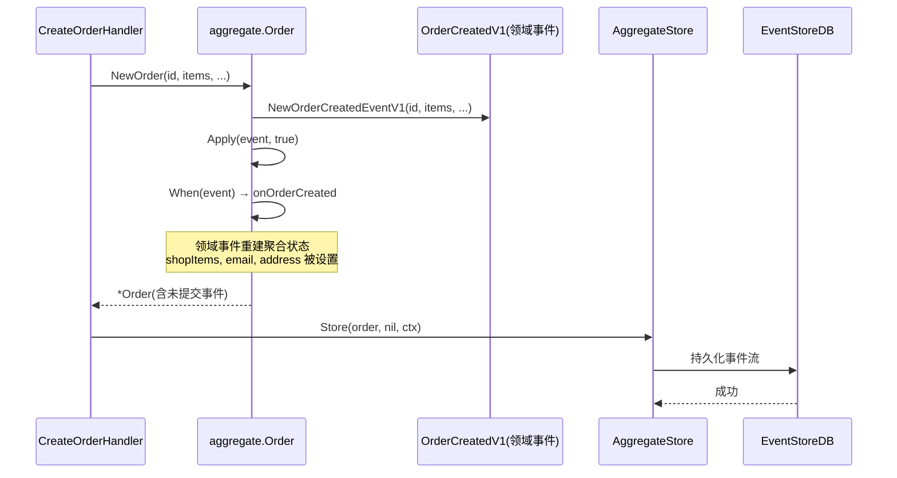
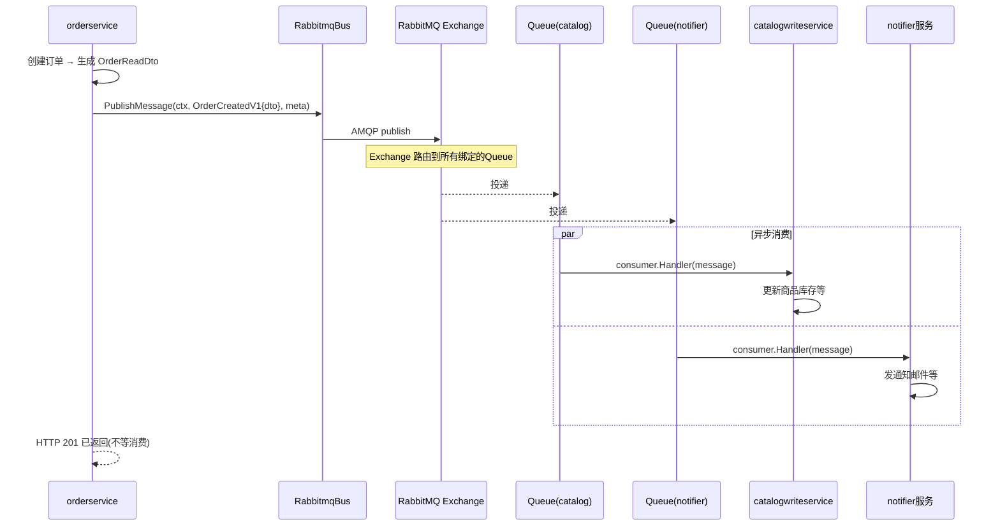

# 013 Event Driven Architecture：领域事件与集成事件

> 知识点：**领域事件 vs 集成事件 + RabbitMQ Event Bus + 异步通信**。

## 一、理论抽象

### 1.1 两类事件的本质区别

go-food-delivery 的每个切片 events 目录下有两个子目录：

| 事件类型     | 目录                         | 继承                 | 用途                           |
| ------------ | ---------------------------- | -------------------- | ------------------------------ |
| **领域事件** | `events/domain_events/`      | `domain.DomainEvent` | 聚合内部状态变更，用于重建聚合 |
| **集成事件** | `events/integration_events/` | `types.Message`      | 跨服务发布，RabbitMQ 消息体    |

| 维度   | 领域事件（domain_events）                  | 集成事件（integration_events）     |
| ------ | ------------------------------------------ | ---------------------------------- |
| 载体   | 继承 `*domain.DomainEvent`                 | 继承 `*types.Message`              |
| 内容   | 聚合状态字段（ShopItems、AccountEmail...） | 嵌套 `*OrderReadDto`（读模型投影） |
| 消费者 | 聚合自己的 `When` 方法                     | 其他服务的 consumer handler        |
| 传输   | 进程内（Apply 调用）                       | RabbitMQ 网络传输                  |
| 用途   | 事件溯源（重建聚合状态）                   | 跨服务通知                         |

同一个业务概念（Order Created），按用途拆成两个事件类型——领域事件管聚合状态重建，集成事件管跨服务通知，互不污染。

### 1.2 领域事件的生命周期：从产生到持久化

理解时序图前，必须先搞清楚"领域事件"在聚合根内部是怎么流转的。这涉及事件溯源的两个核心操作：`Apply`（新事件）和 `fold`（历史事件）。

#### 1.2.1 聚合根的内部结构

[event_sourced_aggregate.go L83-89](file:///d:/Blog/backup/tmp/ddd/go-food-delivery-microservices/internal/pkg/es/models/event_sourced_aggregate.go#L83-L89)：

```go
type EventSourcedAggregateRoot struct {
    *domain.Entity
    originalVersion   int64                  // 从数据库加载时的版本号
    currentVersion    int64                  // 当前版本号(每 Apply 一次 +1)
    uncommittedEvents []domain.IDomainEvent  // 未提交事件列表(待持久化)
    when              WhenFunc               // 状态重建函数(由聚合根实现)
}
```

三个版本字段的关系：

| 字段                | 含义                         | 何时变化                                                             |
| ------------------- | ---------------------------- | -------------------------------------------------------------------- |
| `originalVersion`   | 从 EventStoreDB 加载时的版本 | `fold` 时 +1（加载历史事件）                                         |
| `currentVersion`    | 当前版本（含未提交变更）     | `Apply` 和 `fold` 都 +1                                              |
| `uncommittedEvents` | 还没写入 EventStoreDB 的事件 | `Apply(isNew=true)` 时追加；`MarkUncommittedEventAsCommitted` 时清空 |

**如果 `currentVersion > originalVersion`，说明聚合根有未提交的变更**——这就是时序图里"含未提交事件"的含义。

#### 1.2.2 Apply：产生新事件 + 重建状态

[event_sourced_aggregate.go L187-204](file:///d:/Blog/backup/tmp/ddd/go-food-delivery-microservices/internal/pkg/es/models/event_sourced_aggregate.go#L187-L204)：

```go
func (a *EventSourcedAggregateRoot) Apply(event domain.IDomainEvent, isNew bool) error {
    if isNew {
        err := a.AddDomainEvents(event)   // ① 加入未提交事件列表
        if err != nil { return err }
    }
    err := a.when(event)                 // ② 调 When 重建状态
    if err != nil { return err }
    a.currentVersion++                   // ③ 版本号 +1
    return nil
}
```

`Apply` 做两件事：

1. **如果 `isNew=true`**：把事件追加到 `uncommittedEvents`（待持久化）
2. **无论 isNew**：调 `when(event)` 重建聚合状态，`currentVersion++`

关键：**状态重建和事件记录是分离的**——`when` 负责改字段，`uncommittedEvents` 负责记事件，两者独立。

#### 1.2.3 When：事件 → 状态

[order.go L112-137](file:///d:/Blog/backup/tmp/ddd/go-food-delivery-microservices/internal/services/orderservice/internal/orders/models/orders/aggregate/order.go#L112-L137)：

```go
func (o *Order) When(event domain.IDomainEvent) error {
    switch evt := event.(type) {
    case *createOrderDomainEventsV1.OrderCreatedV1:
        return o.onOrderCreated(evt)     // 设置聚合字段
    default:
        return errors.InvalidEventTypeError
    }
}

func (o *Order) onOrderCreated(evt *createOrderDomainEventsV1.OrderCreatedV1) error {
    o.accountEmail = evt.AccountEmail      // 从事件数据重建状态
    o.shopItems = items
    o.deliveryAddress = evt.DeliveryAddress
    o.SetId(evt.GetAggregateId())
    return nil
}
```

`When` 是一个**类型 switch**——根据事件类型路由到对应的处理方法，每个方法从事件数据里提取字段，设置到聚合根上。

#### 1.2.4 fold：从历史事件还原状态

[event_sourced_aggregate.go L206-221](file:///d:/Blog/backup/tmp/ddd/go-food-delivery-microservices/internal/pkg/es/models/event_sourced_aggregate.go#L206-L221)：

```go
func (a *EventSourcedAggregateRoot) fold(event domain.IDomainEvent, metadata metadata.Metadata) error {
    err := a.when(event)     // ① 调 When 重建状态(和 Apply 共用)
    if err != nil { return err }
    a.originalVersion++      // ② 原始版本 +1(不加入 uncommittedEvents)
    a.currentVersion++
    return nil
}
```

`fold` 和 `Apply` 的区别：

| 维度                   | `Apply(event, isNew=true)` | `fold(event, metadata)` |
| ---------------------- | -------------------------- | ----------------------- |
| 用于                   | 产生**新**事件             | 加载**历史**事件        |
| 加入 uncommittedEvents | ✅ 是                      | ❌ 否（已经在库里了）   |
| originalVersion        | 不变                       | +1                      |
| currentVersion         | +1                         | +1                      |
| 调 When                | ✅                         | ✅                      |

两者都调 `when` 重建状态——**状态重建逻辑只有一份**，无论新事件还是历史事件，走的是同一个 `When` 方法。

#### 1.2.5 完整生命周期

```
【新建场景】
  NewOrder() 内部:
    1. 创建 OrderCreatedV1 事件
    2. Apply(event, isNew=true)
       → AddDomainEvents: 事件加入 uncommittedEvents
       → when(event): onOrderCreated 设置 shopItems/email/address
       → currentVersion: 0 → 1
    3. 返回 *Order(currentVersion=1, uncommittedEvents=[event])

  Handler 调 aggregateStore.Store(order):
    4. 读取 order.UncommittedEvents() → 拿到 [event]
    5. 追加到 EventStoreDB 事件流
    6. 成功后调 MarkUncommittedEventAsCommitted()
       → uncommittedEvents = nil

【加载场景】
  aggregateStore.Load():
    1. 从 EventStoreDB 读取事件流 [event1, event2, ...]
    2. 创建空 Order
    3. LoadFromHistory(events, metadata)
       → 对每个事件调 fold(event)
         → when(event): 重建状态
         → originalVersion++, currentVersion++
    4. 返回 *Order(originalVersion=N, currentVersion=N, uncommittedEvents=[])
```

**"含未提交事件"**指的就是新建场景第 3 步——聚合根内存里有 `uncommittedEvents`，版本号已更新，但事件还没写入 EventStoreDB。Handler 拿到这个对象后调 `Store` 持久化，事件才真正落盘。

### 1.3 Event Bus 模式

go-food-delivery 自实现了一个 Event Bus（基于 RabbitMQ），屏蔽 AMQP 细节：

```
生产者 → bus.PublishMessage(ctx, message, meta) → RabbitMQ Exchange
                                                        ↓
消费者 ← bus.ConnectConsumerHandler(type, handler) ← Queue ← Exchange
```

业务代码只调 `PublishMessage` 和 `ConnectConsumerHandler`，不碰 AMQP 连接、channel、exchange 声明。和 wild-workouts 的 Repository 屏蔽数据库细节是同一个思路。

---

## 二、时序图

### 2.1 领域事件：聚合内部流转



领域事件不离开进程——用于 `Apply(event)` 时重建聚合状态。事件持久化到 EventStoreDB 后，未来可以从事件流还原聚合（第 14 章事件溯源）。

### 2.2 集成事件：跨服务异步通知



orderservice 发布事件后立即返回 HTTP 201，不等消费方处理——消费方慢或挂了不影响生产方。

---

## 三、代码实现

### 1. 领域事件：重建聚合状态——[domain_events/order_created.go](file:///d:/Blog/backup/tmp/ddd/go-food-delivery-microservices/internal/services/orderservice/internal/orders/features/creating_order/v1/events/domain_events/order_created.go)

```go
type OrderCreatedV1 struct {
    *domain.DomainEvent
    OrderId         uuid.UUID
    ShopItems       []*dtosV1.ShopItemDto
    AccountEmail    string
    DeliveryAddress string
    CreatedAt       time.Time
    DeliveredTime   time.Time
}

func NewOrderCreatedEventV1(aggregateId, shopItems, ...) (*OrderCreatedV1, error) {
    if shopItems == nil || len(shopItems) == 0 {
        return nil, domainExceptions.NewOrderShopItemsRequiredError(...)
    }
    eventData := &OrderCreatedV1{...}
    eventData.DomainEvent = domain.NewDomainEvent(typeMapper.GetTypeName(eventData))
    return eventData, nil
}
```

`typeMapper.GetTypeName(eventData)` 用反射拿结构体名作为事件类型标识，消费方按这个名字路由。

领域事件在 [aggregate/order.go L112-L137](file:///d:/Blog/backup/tmp/ddd/go-food-delivery-microservices/internal/services/orderservice/internal/orders/models/orders/aggregate/order.go#L112-L137) 的 `When` 方法里被消费：

```go
func (o *Order) When(event domain.IDomainEvent) error {
    switch evt := event.(type) {
    case *createOrderDomainEventsV1.OrderCreatedV1:
        return o.onOrderCreated(evt)     // 设置聚合字段
    default:
        return errors.InvalidEventTypeError
    }
}

func (o *Order) onOrderCreated(evt *createOrderDomainEventsV1.OrderCreatedV1) error {
    o.accountEmail = evt.AccountEmail      // 事件重建状态
    o.shopItems = items
    o.deliveryAddress = evt.DeliveryAddress
}
```

`When` 是事件溯源的核心——聚合状态完全由事件驱动重建。

### 2. 集成事件：跨服务消息体——[integration_events/order_created.go](file:///d:/Blog/backup/tmp/ddd/go-food-delivery-microservices/internal/services/orderservice/internal/orders/features/creating_order/v1/events/integration_events/order_created.go)

```go
type OrderCreatedV1 struct {
    *types.Message              // 继承消息基类（带 MessageId）
    *dtosV1.OrderReadDto        // 嵌套读模型 DTO
}

func NewOrderCreatedV1(orderReadDto *dtosV1.OrderReadDto) *OrderCreatedV1 {
    return &OrderCreatedV1{
        OrderReadDto: orderReadDto,
        Message:      types.NewMessage(uuid.NewV4().String()),   // 自动生成消息ID
    }
}
```

集成事件不包含聚合状态字段，而是嵌套 `OrderReadDto`——为消费方准备的「已投影读模型」。`types.Message` 提供 `MessageId` 用于幂等。

### 3. RabbitMQ 配置：注册生产者——[rabbitmq_configurations.go](file:///d:/Blog/backup/tmp/ddd/go-food-delivery-microservices/internal/services/orderservice/internal/orders/configurations/rabbitmq/rabbitmq_configurations.go)

```go
func ConfigOrdersRabbitMQ(builder rabbitmqConfigurations.RabbitMQConfigurationBuilder) {
    builder.AddProducer(
        createOrderIntegrationEventsV1.OrderCreatedV1{},
        func(builder producerConfigurations.RabbitMQProducerConfigurationBuilder) {
            // 可配置 exchange、routingKey 等
        })
}
```

`AddProducer(消息类型, 配置函数)` 把 `OrderCreatedV1` 注册为可生产消息类型。加一个新集成事件，只需 `builder.AddProducer(NewEvent{})`——只加不改。

### 4. Event Bus 实现：屏蔽 AMQP——[rabbitmq-bus.go](file:///d:/Blog/backup/tmp/ddd/go-food-delivery-microservices/internal/pkg/rabbitmq/bus/rabbitmq-bus.go)

核心数据结构（[L33-L43](file:///d:/Blog/backup/tmp/ddd/go-food-delivery-microservices/internal/pkg/rabbitmq/bus/rabbitmq-bus.go#L33-L43)）：

```go
type rabbitmqBus struct {
    messageTypeConsumers    map[reflect.Type][]consumer2.Consumer   // 消息类型 → 消费者列表
    producer                producer.Producer
    rabbitmqConfiguration   *configurations.RabbitMQConfiguration
}
```

`messageTypeConsumers` 按消息类型分组——一个消息类型可以有多个消费者（发布订阅）。

发布消息（[L303-L312](file:///d:/Blog/backup/tmp/ddd/go-food-delivery-microservices/internal/pkg/rabbitmq/bus/rabbitmq-bus.go#L303-L312)）：

```go
func (r *rabbitmqBus) PublishMessage(ctx context.Context, message types.IMessage, meta metadata.Metadata) error {
    if r.producer == nil {
        r.logger.Fatal("can't find a producer for publishing messages")
    }
    return r.producer.PublishMessage(ctx, message, meta)
}
```

业务调 `bus.PublishMessage`，bus 转发给 producer，producer 负责序列化和 AMQP publish。业务不碰 AMQP channel、exchange 声明。

连接消费者（[L191-L230](file:///d:/Blog/backup/tmp/ddd/go-food-delivery-microservices/internal/pkg/rabbitmq/bus/rabbitmq-bus.go#L191-L230)）：

```go
func (r *rabbitmqBus) ConnectConsumerHandler(messageType types.IMessage, consumerHandler consumer2.ConsumerHandler) error {
    typeName := utils.GetMessageBaseReflectType(messageType)
    consumersForType := r.messageTypeConsumers[typeName]
    if consumersForType != nil {
        for _, c := range consumersForType {
            c.ConnectHandler(consumerHandler)     // 已有消费者，加 handler
        }
    }
}
```

同一个消息类型可注册多个 handler——实现「一个事件多个消费方」的发布订阅。

### 5. 异步通信的幂等挑战

集成事件用 `types.NewMessage(uuid.NewV4().String())` 生成唯一 MessageId。消费方应基于 MessageId 做幂等——收到重复消息时跳过。但 go-food-delivery README 明确说 Inbox Pattern 还是「🚧 in progress」，当前代码还没有完整的幂等保证（第 15 章详解）。

---

> 下一章 [014 Event Sourcing 事件溯源](./014_Event_Sourcing_事件溯源.md) 讲解 Order 聚合如何用事件流代替状态存储。
