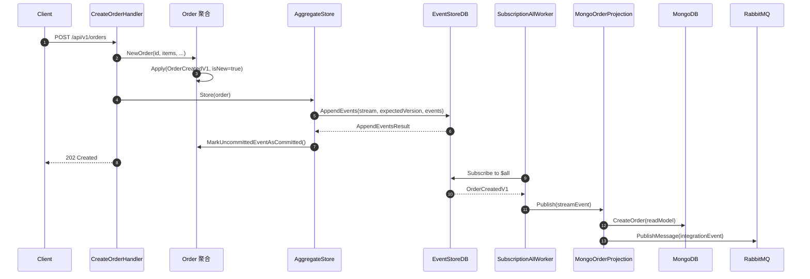

# 014 - Event Sourcing 事件溯源

> 对应 `go-food-delivery-microservices` 的 Orders Service 写库实现，使用 EventStoreDB。

## 一、理论抽象

Event Sourcing 把聚合的状态变更历史作为**事件流**持久化，而不是直接存当前状态。

### 核心结构

一个事件溯源聚合由三部分构成：

1. **状态字段**：聚合当前的内存状态（私有字段，外部不可变）。
2. **未提交事件列表**（uncommittedEvents）：本次操作产生的待写入事件。
3. **版本号**：维护两个版本号用于乐观并发控制。

### 核心操作

| 操作                       | 作用                   | 是否进入未提交列表 | 是否推进版本号                       |
| -------------------------- | ---------------------- | ------------------ | ------------------------------------ |
| `Apply(event, isNew=true)` | 业务方法产生新事件     | 是                 | currentVersion++                     |
| `fold(event)`              | 从存储加载事件重建状态 | 否                 | originalVersion++ / currentVersion++ |

### 状态转移的两种触发路径

- **写路径**：业务方法构造事件 → `Apply(event, true)` → 状态 mutate + 事件进未提交列表 → `Store` 时把未提交事件追加到事件存储。
- **读路径**：`Load` 从存储分页读取事件流 → `LoadFromHistory` → 对每个事件调 `fold` → 重建聚合状态。

### 事件流命名

每个聚合对应一个独立的事件流，stream 名由聚合类型 + 聚合 ID 组成，如 `order-<uuid>`。同一聚合的所有事件按版本号顺序追加。

### 乐观并发控制

保存时把加载时拿到的 `originalVersion` 作为 `expectedVersion` 传给存储。若期间被其他事务改过，存储拒绝写入。

### 投影（CQRS 读模型同步）

事件存储只存事件，无法直接查询当前状态。通过订阅事件流（如 ESDB 的 `$all`），把事件转换成读模型写入 MongoDB / ElasticSearch，并可将集成事件转发到消息总线。

---

## 二、时序图



---

## 三、代码实现

### 1. 聚合基类

[internal/pkg/es/models/event_sourced_aggregate.go](file:///d:/Blog/backup/tmp/ddd/go-food-delivery-microservices/internal/pkg/es/models/event_sourced_aggregate.go)

```go
type EventSourcedAggregateRoot struct {
    *domain.Entity
    originalVersion   int64                  // 加载时的版本号（乐观锁基准）
    currentVersion    int64                  // 内存中当前版本号
    uncommittedEvents []domain.IDomainEvent  // 暂存的待写入事件
    when              WhenFunc                // 事件路由函数
}
```

`when` 是聚合内事件路由函数，由具体聚合实现，把不同事件路由到对应 `onXxx` 方法。

`Apply` 产生新事件时调用：

```go
func (a *EventSourcedAggregateRoot) Apply(event domain.IDomainEvent, isNew bool) error {
    if isNew {
        err := a.AddDomainEvents(event) // 加入 uncommittedEvents
        if err != nil { return err }
    }
    err := a.when(event) // 调用聚合的状态转移函数
    if err != nil { return err }
    a.currentVersion++
    return nil
}
```

`LoadFromHistory` 从存储加载事件重建状态时调 `fold`，推进 originalVersion 与 currentVersion，但不进未提交列表。

### 2. Order 聚合

[internal/services/orderservice/internal/orders/models/orders/aggregate/order.go](file:///d:/Blog/backup/tmp/ddd/go-food-delivery-microservices/internal/services/orderservice/internal/orders/models/orders/aggregate/order.go)

```go
func NewOrder(id uuid.UUID, shopItems []*value_objects.ShopItem, ...) (*Order, error) {
    order := &Order{}
    order.NewEmptyAggregate() // 初始化基类
    order.SetId(id)

    // 参数校验略
    event, err := createOrderDomainEventsV1.NewOrderCreatedEventV1(id, itemsDto, ...)
    if err != nil { return nil, err }

    err = order.Apply(event, true) // 产生事件 + mutate 状态
    if err != nil { return nil, err }

    return order, nil
}
```

事件路由表：

```go
func (o *Order) When(event domain.IDomainEvent) error {
    switch evt := event.(type) {
    case *createOrderDomainEventsV1.OrderCreatedV1:
        return o.onOrderCreated(evt)
    default:
        return errors.InvalidEventTypeError
    }
}

func (o *Order) onOrderCreated(evt *createOrderDomainEventsV1.OrderCreatedV1) error {
    items, _ := mapper.Map[[]*value_objects.ShopItem](evt.ShopItems)
    o.accountEmail = evt.AccountEmail
    o.shopItems = items
    o.deliveryAddress = evt.DeliveryAddress
    o.deliveredTime = evt.DeliveredTime
    o.createdAt = evt.CreatedAt
    o.SetId(evt.GetAggregateId())
    return nil
}
```

### 3. AggregateStore 接口

[internal/pkg/es/contracts/store/aggregate_store.go](file:///d:/Blog/backup/tmp/ddd/go-food-delivery-microservices/internal/pkg/es/contracts/store/aggregate_store.go)

```go
type AggregateStore[T models.IHaveEventSourcedAggregate] interface {
    Store(aggregate T, metadata metadata.Metadata, ctx context.Context) (*appendResult.AppendEventsResult, error)
    Load(ctx context.Context, aggregateId uuid.UUID) (T, error)
    Exists(ctx context.Context, aggregateId uuid.UUID) (bool, error)
    // ... 其他重载
}
```

泛型参数 `T` 是具体聚合指针类型（如 `*Order`），handler 直接依赖 `AggregateStore[*aggregate.Order]`。

### 4. EventStoreDB 实现

[internal/pkg/eventstroredb/aggregate_store.go](file:///d:/Blog/backup/tmp/ddd/go-food-delivery-microservices/internal/pkg/eventstroredb/aggregate_store.go)

`Store` 用 `originalVersion` 作为 `expectedVersion`：

```go
func (a *esdbAggregateStore[T]) Store(aggregate T, metadata metadata.Metadata, ctx context.Context) (*appendResult.AppendEventsResult, error) {
    expectedVersion := expectedStreamVersion.FromInt64(aggregate.OriginalVersion())
    return a.StoreWithVersion(aggregate, metadata, expectedVersion, ctx)
}
```

`StoreWithVersion` 把 uncommittedEvents 序列化为 StreamEvent → 调 `EventStore.AppendEvents` 写入 ESDB → 调 `MarkUncommittedEventAsCommitted()` 清空。

`LoadWithReadPosition` 用反射创建 `T` 的空实例 → 调 `NewEmptyAggregate()` 初始化 → 分页读事件（每页 500 条）→ 调 `LoadFromHistory` 回放：

```go
func (a *esdbAggregateStore[T]) getStreamEvents(streamId streamName.StreamName, position readPosition.StreamReadPosition, ctx context.Context) ([]*models.StreamEvent, error) {
    pageSize := 500
    var streamEvents []*models.StreamEvent
    for true {
        events, err := a.eventStore.ReadEvents(streamId, position, uint64(pageSize), ctx)
        if err != nil { return nil, err }
        streamEvents = append(streamEvents, events...)
        if len(events) < pageSize { break }
        position = readPosition.FromInt64(int64(len(events)) + position.Value())
    }
    return streamEvents, nil
}
```

### 5. Stream 命名约定

[internal/pkg/es/models/stream_name/stream_name.go](file:///d:/Blog/backup/tmp/ddd/go-food-delivery-microservices/internal/pkg/es/models/stream_name/stream_name.go)

```go
func For[T models.IHaveEventSourcedAggregate](aggregate T) StreamName {
    var aggregateName string
    if t := reflect.TypeOf(aggregate); t.Kind() == reflect.Ptr {
        aggregateName = reflect.TypeOf(aggregate).Elem().Name()
    } else {
        aggregateName = reflect.TypeOf(aggregate).Name()
    }
    return StreamName(fmt.Sprintf("%s-%s", strings.ToLower(aggregateName), aggregate.Id().String()))
}
```

格式：`{聚合类型小写}-{聚合ID}`，例如 `order-3fa85f64-5717-4562-b3fc-2c963f66afa6`。

### 6. 命令处理器

[internal/services/orderservice/internal/orders/features/creating_order/v1/commands/create_order_handler.go](file:///d:/Blog/backup/tmp/ddd/go-food-delivery-microservices/internal/services/orderservice/internal/orders/features/creating_order/v1/commands/create_order_handler.go)

```go
func (c *CreateOrderHandler) Handle(ctx context.Context, command *CreateOrder) (*dtos.CreateOrderResponseDto, error) {
    shopItems, _ := mapper.Map[[]*value_objects.ShopItem](command.ShopItems)

    order, err := aggregate.NewOrder(command.OrderId, shopItems, ...)
    if err != nil { return nil, err }

    _, err = c.aggregateStore.Store(order, nil, ctx)
    if err != nil { return nil, err }

    return &dtos.CreateOrderResponseDto{OrderId: order.Id()}, nil
}
```

handler 只做三件事：构造聚合 → Store → 返回 OrderId。

### 7. 投影

[internal/services/orderservice/internal/orders/projections/mongo_order_projection.go](file:///d:/Blog/backup/tmp/ddd/go-food-delivery-microservices/internal/services/orderservice/internal/orders/projections/mongo_order_projection.go)

```go
func (m mongoOrderProjection) ProcessEvent(ctx context.Context, streamEvent *models.StreamEvent) error {
    switch evt := streamEvent.Event.(type) {
    case *createOrderDomainEventsV1.OrderCreatedV1:
        return m.onOrderCreated(ctx, evt)
    }
    return nil
}

func (m *mongoOrderProjection) onOrderCreated(ctx context.Context, evt *createOrderDomainEventsV1.OrderCreatedV1) error {
    // ... mapper 转 ShopItemReadModel ...
    orderRead := read_models.NewOrderReadModel(evt.OrderId, items, ...)
    _, err := m.mongoOrderRepository.CreateOrder(ctx, orderRead)
    // ...
    orderCreatedEvent := createOrderIntegrationEventsV1.NewOrderCreatedV1(orderReadDto)
    err = m.rabbitmqProducer.PublishMessage(ctx, orderCreatedEvent, nil)
    return nil
}
```

投影同时做两件事：① 写 MongoDB 读模型；② 发布集成事件到 RabbitMQ。第 013 章里的集成事件 `OrderCreatedV1` 就是在这里 publish 的。

### 8. 订阅 worker

[internal/pkg/eventstroredb/subscription_all_worker.go](file:///d:/Blog/backup/tmp/ddd/go-food-delivery-microservices/internal/pkg/eventstroredb/subscription_all_worker.go)

`esdbSubscriptionAllWorker` 订阅 ESDB 的 `$all` 流，通过 `subscriptionCheckpointRepository` 记录消费位点，重启后从断点续消费。

在 [eventoredb_fx.go](file:///d:/Blog/backup/tmp/ddd/go-food-delivery-microservices/internal/pkg/eventstroredb/eventoredb_fx.go) 的 `registerHooks` 里通过 `fx.Hook{OnStart: ...}` 启动：

```go
lc.Append(fx.Hook{
    OnStart: func(ctx context.Context) error {
        go func() {
            option := &EventStoreDBSubscriptionToAllOptions{
                FilterOptions: &esdb.SubscriptionFilter{
                    Type:     esdb.StreamFilterType,
                    Prefixes: cfg.Subscription.Prefix,
                },
                SubscriptionId: cfg.Subscription.SubscriptionId,
            }
            worker.SubscribeAll(lifetimeCtx, option)
        }()
        return nil
    },
    // ...
})
```

`OnStart` 传入的 `ctx` 只有 15s 超时，长期订阅必须用独立的 `lifetimeCtx`。

### 9. fx 装配

[internal/services/orderservice/internal/orders/orders_fx.go](file:///d:/Blog/backup/tmp/ddd/go-food-delivery-microservices/internal/services/orderservice/internal/orders/orders_fx.go)

```go
var Module = fx.Module(
    "ordersfx",
    fx.Provide(fx.Annotate(repositories.NewMongoOrderReadRepository)),
    fx.Provide(repositories.NewElasticOrderReadRepository),

    // 注册泛型 AggregateStore[*Order]
    fx.Provide(eventstroredb.NewEventStoreAggregateStore[*aggregate.Order]),

    // ...routes, projections...
)
```
