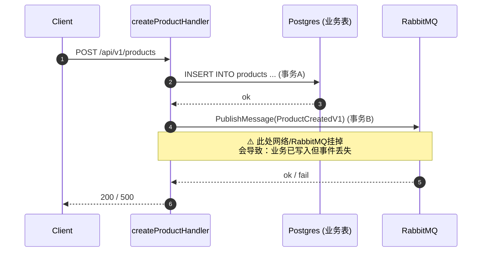
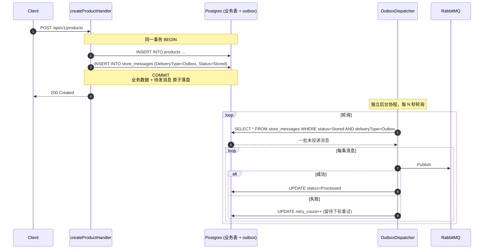
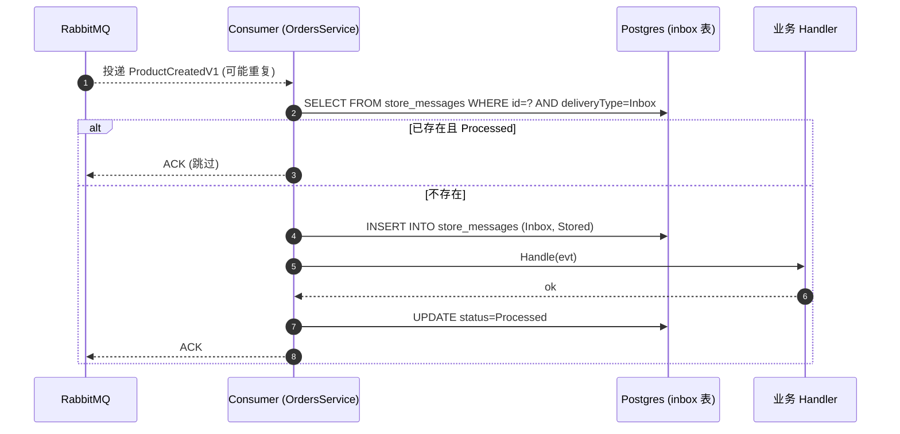

# 015 Outbox Pattern 发件箱模式

> 对应 `go-food-delivery-microservices` 中的 **Outbox / Inbox Pattern** 基础设施。
> ⚠️ Outbox/Inbox 在本项目中是**未完工的脚手架**（README 的 🚧 标记）。本章讲解已落地的数据模型与接口设计，以及未实现的部分。

## 一、理论抽象

### 1.1 服务切换与选型背景

⚠️ **上下文切换**：013-014 章讲的是 **orderservice**（用 EventStoreDB 事件溯源）。
本章双写问题举例切换到 **catalogwriteservice**——它用 **Postgres + GORM** 存业务数据，不使用事件溯源。

**为什么 catalogwriteservice 不采用事件溯源？**

事件溯源有不可替代的收益（全量审计、状态回放、天然 outbox），但代价也高。不同业务复杂度对应不同选型：

| 维度        | Orders Service（事件溯源）                                                                               | Catalog Write Service（Postgres CRUD）                                                 |
| ----------- | -------------------------------------------------------------------------------------------------------- | -------------------------------------------------------------------------------------- |
| 业务复杂度  | 高：订单状态机 Created → Paid → Shipped → Cancelled，Cancel/Refund/Reschedule 多种路径，每种路径都要审计 | 低：商品基本就是 Create/Update/Delete，状态极少（上架/下架），不需要追踪每次改价的历史 |
| 聚合不变量  | 多：shopItems 不能为空、已支付不能取消、DeliveryTime 不能早于 CreatedAt                                  | 几乎没有：name 非空、price > 0，没有复杂跨字段约束                                     |
| 写 QPS 特征 | 低（下单是低频操作）                                                                                     | 高（商品信息更新、上下架频繁）                                                         |
| 读特征      | 读服务通过投影解耦，orderservice 本身不处理前端复杂查询                                                  | catalogreadservice 要支持全文搜索、按分类筛选、价格区间过滤，读模型高度非规范化        |
| 审计要求    | 强（金融类数据，要追踪"谁什么时候改了订单什么字段"）                                                     | 弱（商品改价不需要审计，运营后台操作有独立日志即可）                                   |

**核心权衡：事件溯源适合"写少改多状态、要强审计"的业务；Postgres CRUD 适合"写多状态简单、读模型高度反规范化"的业务。**

商品服务属于后者，用事件溯源反而笨重——每次改商品名/价格都要 Apply + Store 一条事件，对运营后台来说没有收益，还增加了维护成本。

---

### 1.2 双写问题（Dual Write Problem）

[create_product_handler.go](file:///d:/Blog/backup/tmp/ddd/go-food-delivery-microservices/internal/services/catalogwriteservice/internal/products/features/creatingproduct/v1/create_product_handler.go) 里两个独立操作没有共享事务：

```go
// 1. 写业务库（Postgres）
result, err := gormdbcontext.AddModel[*datamodel.ProductDataModel, *models.Product](ctx, c.CatalogsDBContext, product)
// 2. 发消息到 RabbitMQ
err = c.RabbitmqProducer.PublishMessage(ctx, productCreated, nil)
```

| 时刻 | 业务库 | RabbitMQ           | 结果                             |
| ---- | ------ | ------------------ | -------------------------------- |
| T1   | 写成功 | —                  | —                                |
| T2   | —      | 写失败             | 业务库有数据，下游永远收不到通知 |
| T3   | —      | 写成功但业务库回滚 | 下游收到事件但业务没生效         |

### 1.3 Outbox 模式核心思想

> 不要直接发消息给 Broker。先把消息写到业务库的一张表（outbox 表）里，和业务数据放在同一事务，再由独立 dispatcher 异步轮询投递到 RabbitMQ。

- 业务写 + outbox 写是**原子**的（一个事务），要么都成功要么都回滚
- dispatcher 失败可重试（at-least-once），幂等由消费端保证

### 1.4 Inbox 模式核心思想

消费端处理消息前，先在 `inbox 表`里查重，处理完后再标记。配合 Outbox 实现端到端的 **exactly-once 业务语义**。

| 语义          | 实现难度                | 业务可见行为     |
| ------------- | ----------------------- | ---------------- |
| At-most-once  | 最简单（发完即忘）      | 可能丢消息       |
| At-least-once | Outbox + 重试           | 可能重复         |
| Exactly-once  | Outbox + Inbox + 幂等键 | 业务上等价于一次 |

### 1.5 Outbox 与 Event Sourcing 的关系

| 维度     | Event Sourcing（Orders Service）      | Outbox（Catalog Write Service）   |
| -------- | ------------------------------------- | --------------------------------- |
| 写库     | EventStoreDB（事件流本身就是 outbox） | Postgres + 独立 store_messages 表 |
| 触发点   | 聚合 Apply 事件                       | 业务表写入后显式 Add              |
| 投递组件 | SubscriptionAllWorker + Projection    | Dispatcher（未实现）              |
| 适用场景 | 强审计、复杂聚合                      | 简单 CRUD + 跨服务通知            |

EventStoreDB 的写路径天然就是 outbox——事件流就是消息源，`mongoOrderProjection` 通过订阅 `$all` 把事件转发到 RabbitMQ。所以 Orders Service 不需要额外的 outbox 表。Outbox 模式主要用于 **Postgres + CRUD 的服务**。

---

## 二、时序图

### 2.1 问题版本（当前实际行为）



### 2.2 Outbox 目标版本（设计意图）



### 2.3 Inbox 在消费端的位置



---

## 三、代码实现

### 1. 数据模型 `StoreMessage`——[store_message.go](file:///d:/Blog/backup/tmp/ddd/go-food-delivery-microservices/internal/pkg/core/messaging/persistmessage/store_message.go)

```go
type MessageDeliveryType int

const (
    Outbox   MessageDeliveryType = 1
    Inbox    MessageDeliveryType = 2
    Internal MessageDeliveryType = 4
)

type MessageStatus int

const (
    Stored    MessageStatus = 1
    Processed MessageStatus = 2
)

type StoreMessage struct {
    ID            uuid.UUID `gorm:"primaryKey"`
    DataType      string            // 消息类型全名（用于反序列化）
    Data          string            // 序列化后的消息体
    CreatedAt     time.Time `gorm:"default:current_timestamp"`
    RetryCount    int               // 失败重试计数
    MessageStatus MessageStatus     // Stored / Processed
    DeliveryType  MessageDeliveryType // Outbox / Inbox / Internal
}

func (sm *StoreMessage) TableName() string {
    return "store_messages"
}
```

一张表两种用途：`DeliveryType` 区分是 outbox（待发）还是 inbox（已收）。状态机 `Stored → Processed`，dispatcher 轮询 `Stored` 状态。

### 2. 服务接口 `MessagePersistenceService`——[message_persistence_service.go](file:///d:/Blog/backup/tmp/ddd/go-food-delivery-microservices/internal/pkg/core/messaging/persistmessage/message_persistence_service.go)

```go
type MessagePersistenceService interface {
    Add(ctx context.Context, storeMessage *StoreMessage) error
    Update(ctx context.Context, storeMessage *StoreMessage) error
    ChangeState(ctx context.Context, messageID uuid.UUID, status MessageStatus) error
    GetAllActive(ctx context.Context) ([]*StoreMessage, error)
    GetByFilter(ctx context.Context, predicate func(*StoreMessage) bool) ([]*StoreMessage, error)
    GetById(ctx context.Context, id uuid.UUID) (*StoreMessage, error)
    Remove(ctx context.Context, storeMessage *StoreMessage) (bool, error)
    CleanupMessages(ctx context.Context) error

    // —— Outbox / Inbox 高层 API（尚未实现）——
    Process(messageID string, ctx context.Context) error
    ProcessAll(ctx context.Context) error
    AddPublishMessage(messageEnvelope types.MessageEnvelope, ctx context.Context) error
    AddReceivedMessage(messageEnvelope types.MessageEnvelope, ctx context.Context) error
}
```

接口分两层：底层 CRUD 已实现，高层语义 API（`AddPublishMessage` / `AddReceivedMessage` / `ProcessAll`）未实现。

### 3. Postgres 实现的已落库部分——[postgres_message_service.go](file:///d:/Blog/backup/tmp/ddd/go-food-delivery-microservices/internal/pkg/postgresmessaging/messagepersistence/postgres_message_service.go)

`Add` 在事务里插入消息：

```go
func (m *postgresMessagePersistenceService) Add(ctx context.Context, storeMessage *persistmessage.StoreMessage) error {
    dbContext := m.messagingDBContext.WithTxIfExists(ctx)  // 从 context 取事务句柄
    result := dbContext.DB().Create(storeMessage)
    return result.Error
}
```

关键在 `WithTxIfExists(ctx)` ——从 context 里取出可能存在的事务句柄。只要业务 handler 在调用 `Add` 前把事务塞进 ctx，outbox 写入就和业务写共用同一个事务。这是 Outbox 模式成立的物理基础。

`AddMessageCore` 公共入表逻辑已实现序列化和按消息 ID 入表：

```go
func (m *postgresMessagePersistenceService) AddMessageCore(
    ctx context.Context, messageEnvelope types.MessageEnvelope, deliveryType persistmessage.MessageDeliveryType,
) error {
    data, err := m.messageSerializer.SerializeEnvelop(messageEnvelope)
    // ...
    storeMessage := persistmessage.NewStoreMessage(uuidId, messageEnvelope.Message.GetMessageFullTypeName(), string(data.Data), deliveryType)
    return m.Add(ctx, storeMessage)
}
```

### 4. 尚未实现的部分（README 的 🚧 标记）

```go
func (m *postgresMessagePersistenceService) Process(messageID string, ctx context.Context) error {
    panic("implement me")
}
func (m *postgresMessagePersistenceService) ProcessAll(ctx context.Context) error {
    panic("implement me")
}
func (m *postgresMessagePersistenceService) AddPublishMessage(messageEnvelope types.MessageEnvelope, ctx context.Context) error {
    panic("implement me")
}
func (m *postgresMessagePersistenceService) AddReceivedMessage(messageEnvelope types.MessageEnvelope, ctx context.Context) error {
    panic("implement me")
}
```

接口设计完毕、数据模型建表、CRUD 实现，但 Outbox/Inbox 业务编排未接通。`AddPublishMessage` / `AddReceivedMessage` 本应只是对 `AddMessageCore` 的薄封装：

```go
func (m *postgresMessagePersistenceService) AddPublishMessage(envelope types.MessageEnvelope, ctx context.Context) error {
    return m.AddMessageCore(ctx, envelope, persistmessage.Outbox)
}
```

### 5. fx 装配与建表——[postgres_messaging_fx.go](file:///d:/Blog/backup/tmp/ddd/go-food-delivery-microservices/internal/pkg/postgresmessaging/postgres_messaging_fx.go)

```go
var Module = fx.Module(
    "postgresmessagingfx",
    fx.Provide(
        messagepersistence.NewPostgresMessagePersistenceDBContext,
        messagepersistence.NewPostgresMessageService,
    ),
    fx.Invoke(migrateMessaging),
)

func migrateMessaging(db *gorm.DB) error {
    return db.Migrator().AutoMigrate(&persistmessage.StoreMessage{})
}
```

`AutoMigrate` 自动建出 `store_messages` 表。只在 **catalogwriteservice** 启用（[infrastructure_fx.go#L30](file:///d:/Blog/backup/tmp/ddd/go-food-delivery-microservices/internal/services/catalogwriteservice/internal/shared/configurations/catalogs/infrastructure/infrastructure_fx.go#L30)），Orders Service 用 EventStoreDB 不需要这张表。

### 6. 当前 handler 没用 Outbox 的证据

[create_product_handler.go#L75](file:///d:/Blog/backup/tmp/ddd/go-food-delivery-microservices/internal/services/catalogwriteservice/internal/products/features/creatingproduct/v1/create_product_handler.go#L75)：

```go
err = c.RabbitmqProducer.PublishMessage(ctx, productCreated, nil)
```

handler 直接调 `RabbitmqProducer.PublishMessage`，没有调 `MessagePersistenceService.AddPublishMessage`。Outbox 的「接收端」（业务侧把消息写入表）和「投递端」（dispatcher 轮询表发 RabbitMQ）都没接上。

---

> 这是系列的最后一章。001-015 构成了一个完整的 Go 微服务设计学习路径：002-009 讲单体应用内的 DDD/CQRS/Clean Arch/测试/安全设计，010-012 讲架构组织与基础设施，013-015 讲跨服务通信。
