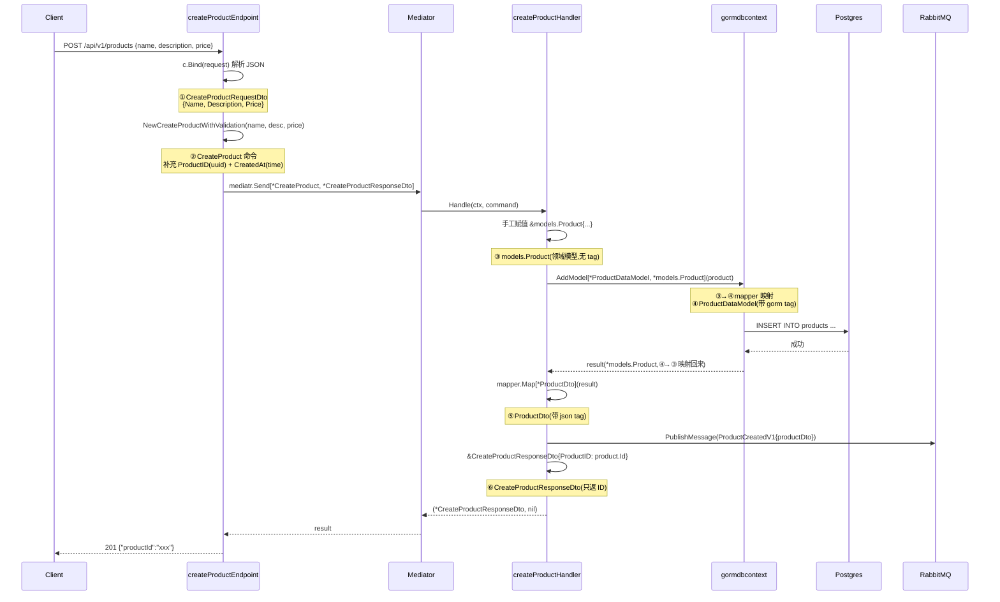

# 016 DTO 类型流转与边界

> 知识点：**Handler → Domain 需要 DTO，Domain → Repository 是否需要 DTO**。
> 结合 go-food-delivery 的 `create_product_handler.go` 完整追踪 6 种类型的定义位置和转换链路。

---

## 一、理论抽象

### 1.1 DTO 出现在"语言不通的边界"

DTO（Data Transfer Object）的本质是**翻译层**——两侧"语言不通"时才需要：

| 边界 | 两侧语言 | 需要 DTO? |
|---|---|---|
| HTTP → App | JSON ↔ Go struct | ✅ 必须（带 json tag） |
| App → Domain | Go struct ↔ Go 领域对象 | 视复杂度，简单可省 |
| Domain → Repository | 领域对象 ↔ ORM 实体 | ORM 要 tag 就需要（带 gorm tag） |
| Repository → DB | ORM 实体 ↔ SQL 行 | 由 adapter 内部处理 |

### 1.2 两个项目的对比

| 维度 | wild-workouts（充血模型） | go-food-delivery（贫血模型 + GORM） |
|---|---|---|
| 领域模型 | 充血（`Hour` 私有字段 + 行为方法） | 贫血（`Product` 全 public，无方法） |
| 持久化层 | Firestore，手写 marshal | GORM，靠 tag 映射 |
| 有无持久化 DTO | 无，adapter 内部处理 | 有，`ProductDataModel` 独立类型 |
| Repository 接口 | domain 层定义，返回领域实体 | 用泛型 `AddModel[DM, M]`，两个类型 |

**判断标准**：如果 ORM/存储需要自己的元数据（tag、表名、软删除字段），就**需要**一个持久化 DTO 隔离；如果存储是无 schema 的（Firestore、内存 map），领域对象直接存，**不需要**。

---

## 二、类型流转图

### 2.1 create_product_handler.go 的完整转换链路

```
HTTP 请求 {"name":"苹果", "price":9.9}
    │
    │  c.Bind()  ← endpoint L44
    ▼
① CreateProductRequestDto  {Name, Description, Price}          ← 3 字段
    │
    │  NewCreateProductWithValidation()  ← endpoint L53
    │  补充 ProductID(uuid) + CreatedAt(时间) + 校验
    ▼
② CreateProduct 命令  {ProductID, Name, Description, Price, CreatedAt}  ← 5 字段
    │
    │  mediatr.Send() 路由到 handler
    ▼
[handler 内]
    │
    │  手工赋值  ← handler L44
    ▼
③ models.Product  {Id, Name, Description, Price, CreatedAt, UpdatedAt}  ← 6 字段(无 tag)
    │
    │  gormdbcontext.AddModel[*ProductDataModel, *Product]()
    │  内部用 mapper 把 ③→④,写库后 ④→③ 映射回来
    ▼
④ ProductDataModel  {Id, ..., gorm.DeletedAt}  ← 加了 GORM tag + 软删除
    │
    │  写入 Postgres,读回 result(仍是 *Product)
    ▼
③ models.Product(result)  ← 回到领域类型
    │
    ├──→ ⑤ mapper.Map[*ProductDto](result)  ← handler L63
    │        │
    │        ▼
    │    ProductDto  {带 json tag}  → 包装成集成事件 → RabbitMQ
    │
    └──→ ⑥ CreateProductResponseDto{ProductID: product.Id}  ← handler L91
             │
             ▼
         HTTP 响应 {"productId":"xxx-xxx-xxx"}
```

### 2.2 Mermaid 时序图



---

## 三、6 种类型的定义与转换

### 类型总表

| # | 类型 | 定义文件 | 从什么 → 到什么 | 转换发生在哪 |
|---|---|---|---|---|
| ① | `CreateProductRequestDto` | [create_product_request_dto.go](file:///d:/Blog/backup/tmp/ddd/go-food-delivery-microservices/internal/services/catalogwriteservice/internal/products/features/creatingproduct/v1/dtos/create_product_request_dto.go) | HTTP JSON body → Go struct（带 `json` tag） | [endpoint L43-44](file:///d:/Blog/backup/tmp/ddd/go-food-delivery-microservices/internal/services/catalogwriteservice/internal/products/features/creatingproduct/v1/create_product_endpoint.go#L43-L44) `c.Bind(request)` |
| ② | `CreateProduct`（命令） | [create_product.go L16-23](file:///d:/Blog/backup/tmp/ddd/go-food-delivery-microservices/internal/services/catalogwriteservice/internal/products/features/creatingproduct/v1/create_product.go#L16-L23) | RequestDTO → 命令（补充 `ProductID`、`CreatedAt`、校验） | [endpoint L53-57](file:///d:/Blog/backup/tmp/ddd/go-food-delivery-microservices/internal/services/catalogwriteservice/internal/products/features/creatingproduct/v1/create_product_endpoint.go#L53-L57) `NewCreateProductWithValidation` |
| ③ | `models.Product`（领域） | [product.go](file:///d:/Blog/backup/tmp/ddd/go-food-delivery-microservices/internal/services/catalogwriteservice/internal/products/models/product.go) | 命令字段 → 领域模型（无 tag，纯字段） | [handler L44-50](file:///d:/Blog/backup/tmp/ddd/go-food-delivery-microservices/internal/services/catalogwriteservice/internal/products/features/creatingproduct/v1/create_product_handler.go#L44-L50) 手工赋值 |
| ④ | `ProductDataModel`（持久化） | [product_data_model.go](file:///d:/Blog/backup/tmp/ddd/go-food-delivery-microservices/internal/services/catalogwriteservice/internal/products/data/datamodels/product_data_model.go) | 领域模型 → ORM 模型（加 `gorm` tag、`DeletedAt`） | [handler L54](file:///d:/Blog/backup/tmp/ddd/go-food-delivery-microservices/internal/services/catalogwriteservice/internal/products/features/creatingproduct/v1/create_product_handler.go#L54) `gormdbcontext.AddModel` |
| ⑤ | `ProductDto`（读模型） | [product_dto.go](file:///d:/Blog/backup/tmp/ddd/go-food-delivery-microservices/internal/services/catalogwriteservice/internal/products/dtos/v1/product_dto.go) | 领域模型 → 读 DTO（加 `json` tag，用于序列化） | [handler L63](file:///d:/Blog/backup/tmp/ddd/go-food-delivery-microservices/internal/services/catalogwriteservice/internal/products/features/creatingproduct/v1/create_product_handler.go#L63) `mapper.Map` |
| ⑥ | `CreateProductResponseDto`（响应） | [create_product_response_dto.go](file:///d:/Blog/backup/tmp/ddd/go-food-delivery-microservices/internal/services/catalogwriteservice/internal/products/features/creatingproduct/v1/dtos/create_product_response_dto.go) | 领域模型 → 响应 DTO（只取 `ProductID`） | [handler L91-93](file:///d:/Blog/backup/tmp/ddd/go-food-delivery-microservices/internal/services/catalogwriteservice/internal/products/features/creatingproduct/v1/create_product_handler.go#L91-L93) 手工构造 |

### 每个类型的定义代码

#### ① 边界 DTO —— 有 json tag，管 HTTP 序列化

[create_product_request_dto.go](file:///d:/Blog/backup/tmp/ddd/go-food-delivery-microservices/internal/services/catalogwriteservice/internal/products/features/creatingproduct/v1/dtos/create_product_request_dto.go)：

```go
type CreateProductRequestDto struct {
    Name        string  `json:"name"`
    Description string  `json:"description"`
    Price       float64 `json:"price"`
}
```

只接收 3 个字段——`ProductID` 和 `CreatedAt` 由服务端生成，不允许客户端传入。

#### ② 命令 DTO —— 补充领域需要的字段 + 校验

[create_product.go L16-23](file:///d:/Blog/backup/tmp/ddd/go-food-delivery-microservices/internal/services/catalogwriteservice/internal/products/features/creatingproduct/v1/create_product.go#L16-L23)：

```go
type CreateProduct struct {
    cqrs.Command                                  // 标记是 Command
    ProductID   uuid.UUID                         // 服务端生成
    Name        string
    Description string
    Price       float64
    CreatedAt   time.Time                          // 服务端生成
}
```

`NewCreateProductWithValidation` 在构造时补充 `ProductID(uuid.NewV4())` 和 `CreatedAt(time.Now())`，并调用 `Validate()` 校验字段。

#### ③ 领域模型 —— 无 tag，纯领域对象

[product.go](file:///d:/Blog/backup/tmp/ddd/go-food-delivery-microservices/internal/services/catalogwriteservice/internal/products/models/product.go)：

```go
type Product struct {
    Id          uuid.UUID
    Name        string
    Description string
    Price       float64
    CreatedAt   time.Time
    UpdatedAt   time.Time
}
```

无 `json` tag、无 `gorm` tag——不绑死任何技术细节。但这是贫血模型（无行为方法），对比 wild-workouts 的 `hour.Hour`（私有字段 + 行为方法）。

#### ④ 持久化 DTO —— 有 gorm tag，管数据库映射

[product_data_model.go](file:///d:/Blog/backup/tmp/ddd/go-food-delivery-microservices/internal/services/catalogwriteservice/internal/products/data/datamodels/product_data_model.go)：

```go
type ProductDataModel struct {
    Id          uuid.UUID `gorm:"primaryKey"`      // GORM tag
    Name        string
    Description string
    Price       float64
    CreatedAt   time.Time `gorm:"default:current_timestamp"`
    UpdatedAt   time.Time
    gorm.DeletedAt                                    // 软删除
}

func (p *ProductDataModel) TableName() string {
    return "products"
}
```

多了 `gorm` tag（主键、默认值）和 `gorm.DeletedAt`（软删除）。这些是 ORM 需要的元数据，不应该污染领域模型 ③。

#### ⑤ 读模型 DTO —— 有 json tag，管输出序列化

[product_dto.go](file:///d:/Blog/backup/tmp/ddd/go-food-delivery-microservices/internal/services/catalogwriteservice/internal/products/dtos/v1/product_dto.go)：

```go
type ProductDto struct {
    Id          uuid.UUID `json:"id"`
    Name        string    `json:"name"`
    Description string    `json:"description"`
    Price       float64   `json:"price"`
    CreatedAt   time.Time `json:"createdAt"`
    UpdatedAt   time.Time `json:"updatedAt"`
}
```

用于集成事件发布——`ProductCreatedV1` 包装 `ProductDto` 发送到 RabbitMQ，消费方拿到的是带 `json` tag 的可序列化结构。

#### ⑥ 响应 DTO —— 只返回必要字段

[create_product_response_dto.go](file:///d:/Blog/backup/tmp/ddd/go-food-delivery-microservices/internal/services/catalogwriteservice/internal/products/features/creatingproduct/v1/dtos/create_product_response_dto.go)：

```go
type CreateProductResponseDto struct {
    ProductID uuid.UUID `json:"productId"`
}
```

只返回 `ProductID`，不暴露 `CreatedAt`、`UpdatedAt` 等内部字段——**最小暴露原则**。

---

## 四、回答两个问题

### 问题一：Handler → Domain 需要 DTO 么？

**需要**。Handler 不能直接拿 HTTP 的 JSON 往 domain 里塞，必须有 DTO 做翻译：

| DTO | 职责 |
|---|---|
| ① `CreateProductRequestDto` | 隔离 HTTP 协议细节（json tag、字段名映射）不污染领域模型 |
| ② `CreateProduct` 命令 | 补充服务端字段（ID、时间戳）+ 校验，作为 CQRS 的 Command 类型 |

如果 domain 直接带 `json:"name"` tag，等于让 HTTP 协议渗进了领域层。

### 问题二：Domain → Repository 需要 DTO 么？

**视项目而定**：

**wild-workouts（充血模型）→ 不需要**

```go
// domain/hour/repository.go —— 接口直接用领域类型
type Repository interface {
    GetHour(ctx, t) (*Hour, error)                          // 返回领域实体
    UpdateHour(ctx, t, func(*Hour)(*Hour, error)) error    // 操作领域实体
}
```

Repository 接口在 domain 层定义，参数和返回值都是 `*hour.Hour`。适配器（Firestore）内部自己 marshal/unmarshal，**这个翻译是适配器的私事**，domain 不感知存储格式。

**go-food-delivery（贫血模型 + GORM）→ 需要**

```go
// 领域模型（贫血，无 GORM tag）
type Product struct { ... }

// 持久化 DTO（带 GORM tag、软删除）
type ProductDataModel struct { ... }

// 调用时显式指定两个类型
gormdbcontext.AddModel[*datamodel.ProductDataModel, *models.Product](ctx, db, product)
```

`ProductDataModel` 就是 domain → repository 的 DTO。它存在的理由是：**GORM 需要 tag 来映射数据库**，而领域模型不该背这些 ORM 细节。

---

## 五、总结

每个类型**解决一个边界问题**：

| 类型 | 解决什么边界问题 |
|---|---|
| ① RequestDTO | HTTP JSON ↔ Go struct（带 json tag） |
| ② Command | 补充服务端字段（ID、时间）+ 校验 |
| ③ Product（领域） | 纯领域对象，不带任何技术 tag |
| ④ DataModel | GORM ↔ SQL（带 gorm tag、软删除） |
| ⑤ ProductDto | 输出序列化（带 json tag，字段名驼峰） |
| ⑥ ResponseDTO | 只返回必要字段（不暴露全部） |

如果合并类型（比如让 ③ 直接带 json+gorm tag），领域模型就被技术细节污染了。分开的代价是 6 个类型 + 转换代码，收益是每层职责单一、可独立演进。
