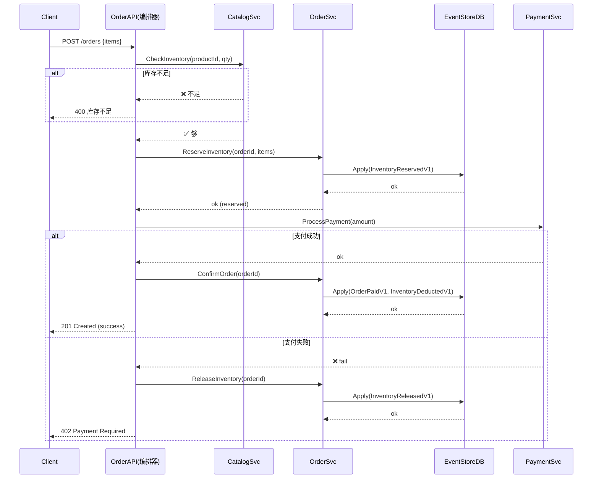
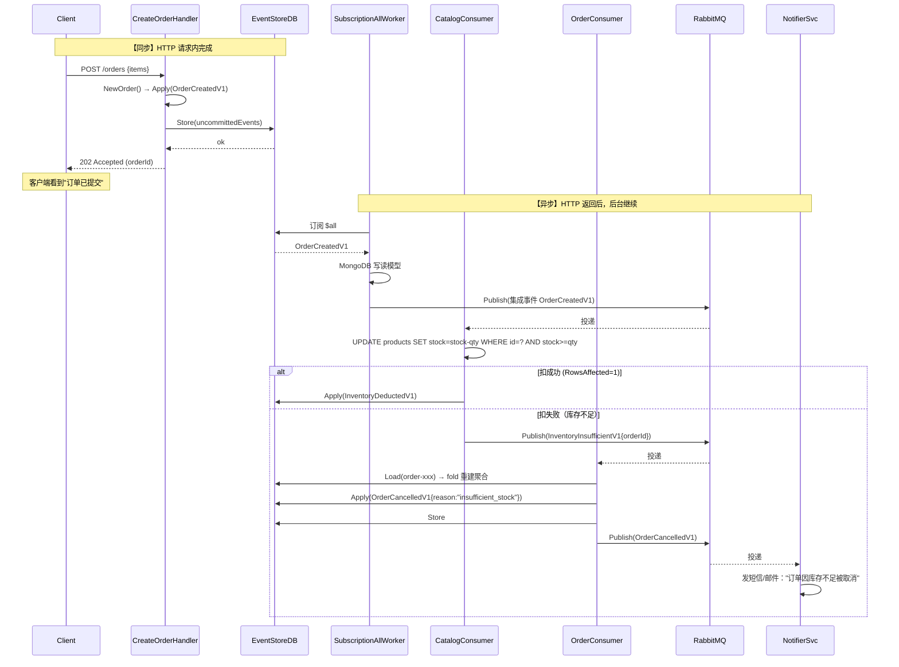

# 017 库存一致性：同步校验与异步补偿

> 知识点：**跨服务订单-库存一致性的两条路线（同步 Saga vs 异步补偿）**，以及事件流如何支撑补偿动作。
> 场景：订单服务（EventStoreDB）+ 商品服务（Postgres + GORM）跨服务协作。

---

## 一、理论抽象

### 1.1 核心矛盾

订单服务（orderservice）和商品服务（catalogwriteservice）是两个独立服务，各自存自己的数据：

| 服务 | 存什么 | 存哪 |
|---|---|---|
| orderservice | 订单聚合状态（shopItems、paid、delivered） | EventStoreDB（事件流） |
| catalogwriteservice | 商品库存（stock 字段） | Postgres（products 表） |

订单创建时，orderservice 内部**不可能直接知道**商品库存是否足够——因为库存数据在另一个数据库、另一个进程、另一台机器。

### 1.2 两条解决路线

| 路线 | 适用场景 | 一致性 | 下单延迟 | 实现复杂度 |
|---|---|---|---|---|
| **同步校验 + 创建**（Saga 编排） | 即时电商、库存紧俏 | 强一致（下单即知道结果） | 慢（等 catalog + 等 payment） | 高（需要补偿事务） |
| **异步补偿**（先建后查） | 外卖/预售、库存宽松 | 最终一致（事后可能被取消） | 快（立即返回 202） | 中（投影 + 补偿事件） |

### 1.3 事件流在两条路线中的角色

| 路线 | 事件流角色 |
|---|---|
| 同步 Saga | 只是存储介质—— Saga 每步成功后 Apply 对应事件，失败时 Apply 补偿事件（如 InventoryReleased） |
| 异步补偿 | 是整个机制的骨架—— OrderCreated 事件驱动扣库存，InventoryInsufficient 补偿事件驱动订单撤销，最终一致性由事件链保证 |

---

## 二、时序图

### 2.1 路线一：同步校验（下单时立即扣库存）



### 2.2 路线二：异步补偿（先建后查，事件流默认路线）



---

## 三、代码实现

### 1. 路线一：同步编排（Saga 模式）

**步骤 ①：Catalog 同步校验接口**

```go
// catalogwriteservice/internal/products/features/check_inventory/handler.go
type CheckInventoryHandler struct {
    db *gorm.DB
}

type CheckInventoryReq struct {
    ProductID uuid.UUID `json:"productId"`
    Quantity  int       `json:"quantity"`
}
type CheckInventoryResp struct {
    Enough bool `json:"enough"`
}

func (h *CheckInventoryHandler) Handle(ctx, req *CheckInventoryReq) (*CheckInventoryResp, error) {
    var product struct{ Stock int }
    h.db.Select("stock").Where("id = ?", req.ProductID).First(&product)
    return &CheckInventoryResp{Enough: product.Stock >= req.Quantity}, nil
}
```

**步骤 ②：订单聚合的 Reserve / Release / Confirm 行为方法**

```go
// aggregate/order.go
func (o *Order) ReserveInventory(items []*value_objects.ShopItem) error {
    if o.Status != Created {
        return errors.New("cannot reserve: not in created status")
    }
    evt := NewInventoryReservedEventV1(o.Id(), items, time.Now())
    return o.Apply(evt, true)   // 产生新事件 + When 改状态
}

func (o *Order) onInventoryReserved(evt *InventoryReservedV1) error {
    o.Status = InventoryReserved
    o.reservedAt = evt.OccurredAt
    return nil
}

func (o *Order) ReleaseInventory() error {
    if o.Status != InventoryReserved {
        return errors.New("nothing to release")
    }
    evt := NewInventoryReleasedEventV1(o.Id())
    return o.Apply(evt, true)
}

func (o *Order) ConfirmPaid(transactionId string) error {
    if o.Status != InventoryReserved {
        return errors.New("must reserve before confirm")
    }
    evt := NewOrderPaidEventV1(o.Id(), transactionId, time.Now())
    return o.Apply(evt, true)
}
```

**步骤 ③：API 编排层（一个调 3 个服务的 HTTP Handler）**

```go
// orderservice/api/order_api.go
func (api *orderAPI) CreateOrder(ctx, req) (*CreateResp, error) {
    orderId := uuid.NewV4()

    // Step 1: 同步调 catalog 查库存
    enough, _ := api.catalogClient.CheckInventory(ctx, req.Items[0].ProductID, req.Items[0].Qty)
    if !enough { return nil, errors.New("out of stock") }

    // Step 2: 调订单服务 Reserve
    _, err := api.aggregateStore.LoadOrCreate(ctx, orderId, func(o *aggregate.Order) error {
        return o.ReserveInventory(items)
    })
    // ... 存 Store
    if err != nil { return nil, err }

    // Step 3: 调支付
    ok, err := api.paymentClient.Process(ctx, orderId, req.Amount)
    if !ok {
        // 支付失败 → Release 补偿
        order, _ := api.aggregateStore.Load(ctx, orderId)
        order.ReleaseInventory()
        api.aggregateStore.Store(order)
        return nil, errors.New("payment failed, inventory released")
    }

    // 成功 → Confirm
    order, _ := api.aggregateStore.Load(ctx, orderId)
    order.ConfirmPaid(txId)
    api.aggregateStore.Store(order)
    return &CreateResp{OrderId: orderId}, nil
}
```

编排层是整个 Saga 的"大脑"——顺序调服务，失败按相反顺序调补偿动作（Release）。

---

### 2. 路线二：异步补偿（事件流骨架）

**步骤 ①：Catalog 消费端 — 原子扣库存 + 不足发补偿**

```go
// catalogwriteservice/consumers/order_created_consumer.go
type OrderCreatedConsumer struct {
    db  *gorm.DB
    bus contracts.EventBus
}

func (c *OrderCreatedConsumer) Handle(ctx context.Context, msg types.IMessage) error {
    evt, ok := msg.(*integrationevents.OrderCreatedV1)
    if !ok { return nil }

    // 遍历订单所有商品，原子扣
    for _, item := range evt.OrderReadDto.ShopItems {
        result := c.db.Exec(`
            UPDATE products 
            SET stock = stock - ? 
            WHERE id = ? AND stock >= ?`,
            item.Quantity, item.ProductID, item.Quantity,
        )
        if result.RowsAffected == 0 {
            // 任一件商品扣失败，发"库存不足"事件
            return c.bus.PublishMessage(ctx, &InventoryInsufficientV1{
                OrderID:   evt.OrderReadDto.Id,
                ProductID: item.ProductID,
                Shortage:  item.Quantity,
            }, nil)
        }
    }

    // 全部扣成功，发"扣减成功"事件
    return c.bus.PublishMessage(ctx, &InventoryDeductedV1{
        OrderID:   evt.OrderReadDto.Id,
        DeductedAt: time.Now(),
    }, nil)
}
```

**关键 SQL：`WHERE stock >= qty`** — 把"够不够"和"扣减"合并成一条原子语句，避免并发竞态（不需要显式锁）。`RowsAffected == 0` 就是"不够"的信号。

**步骤 ②：Order 服务消费端 — 收到不足就撤销订单**

```go
// orderservice/internal/orders/consumers/inventory_insufficient_consumer.go
type InventoryInsufficientConsumer struct {
    aggregateStore store.AggregateStore[*aggregate.Order]
}

func (c *InventoryInsufficientConsumer) Handle(ctx, msg types.IMessage) error {
    insufficient, _ := msg.(*InventoryInsufficientV1)

    // ① 从事件流加载当前聚合（Load → LoadFromHistory → fold 重建状态）
    order, err := c.aggregateStore.Load(ctx, insufficient.OrderID)
    if err != nil { return err }

    // ② 调业务方法：Cancel 产生 OrderCancelled 事件
    err = order.Cancel(CancelReasonInsufficientStock, fmt.Sprintf(
        "product %s shortage %d",
        insufficient.ProductID, insufficient.Shortage,
    ))
    if err != nil { return err }

    // ③ 存事件（追加 OrderCancelledV1 到 order-xxx stream）
    _, err = c.aggregateStore.Store(order, nil, ctx)
    if err != nil { return err }

    // ④ （可选）发集成事件通知 notifier
    return c.bus.PublishMessage(ctx, &OrderCancelledV1{
        OrderId: insufficient.OrderID,
        Reason:  "insufficient_stock",
    }, nil)
}
```

**步骤 ③：Order 聚合根的 Cancel 行为方法 + 事件路由**

```go
// aggregate/order.go
func (o *Order) Cancel(reason CancelReason, detail string) error {
    if o.Status == Cancelled || o.Status == Shipped {
        return errors.New("cannot cancel: already cancelled or shipped")
    }
    event, err := NewOrderCancelledEventV1(o.Id(), reason, detail, time.Now())
    if err != nil { return err }
    return o.Apply(event, true)
}

func (o *Order) When(event domain.IDomainEvent) error {
    switch evt := event.(type) {
    case *OrderCreatedV1:
        return o.onOrderCreated(evt)
    case *OrderCancelledV1:          // 新增路由
        return o.onOrderCancelled(evt)
    }
}

func (o *Order) onOrderCancelled(evt *OrderCancelledV1) error {
    o.Status = Cancelled
    o.cancelReason = evt.Reason
    o.cancelDetail = evt.Detail
    o.cancelledAt = evt.OccurredAt
    return nil
}
```

**步骤 ④：客户端轮询状态**

HTTP 返回 202 Accepted 时订单可能还在处理。客户端需要后续查询：

```go
// Query Handler（orderservice/queries/get_order_by_id_handler.go）
func (h *GetOrderByIdHandler) Handle(ctx, query) (*GetOrderByIdResp, error) {
    order, err := h.mongoRepo.GetOrderById(ctx, query.Id)
    // 投影写入 MongoDB 的 OrderReadModel 含 status 字段
    if order.Status == Cancelled {
        return &GetOrderByIdResp{
            Status: "cancelled",
            CancelReason: order.CancelReason,  // "insufficient_stock"
            CancelDetail: order.CancelDetail,
        }, nil
    }
    return &GetOrderByIdResp{Status: order.Status}, nil
}
```

前端显示：
- `processing` → 处理中（转圈）
- `paid / processing` → 成功
- `cancelled` → 红色提示 "抱歉，您的订单因库存不足被取消"

---

## 四、事件流 vs 传统 UPDATE 的补偿差异

| 维度 | 传统 UPDATE 覆盖写 | 事件流 Append |
|---|---|---|
| 撤销操作 | `UPDATE orders SET status='cancelled' WHERE id=?`（原值丢失） | `Append OrderCancelledV1`（历史全保留） |
| 查"下单时间 vs 撤销时间" | 只能看 created_at 和 cancelled_at 两个字段 | 直接看两条事件的时间戳 |
| 查"为什么被取消" | 需要单独列 `cancel_reason`、`cancel_detail` | `OrderCancelledV1` 事件自带字段 |
| 补偿链路审计 | 查日志 + git 追踪代码 | 事件流本身就是不可变的审计日志 |
| 其他服务需要"被取消"通知 | 写触发器 + 发 MQ（或业务代码散着调） | 投影里自然 Publish 集成事件 |

**事件流不是解决"怎么发现库存不够"**——发现还是靠 Catalog 服务 `WHERE stock >= qty` 跑 SQL 判断。事件流解决的是**"发现不够后怎么干净地撤销 + 留痕 + 通知其他服务"**。

---

## 五、实战选型

| 库存类型 | 推荐路线 | 典型业务 |
|---|---|---|
| 紧俏（秒杀、限量） | **同步校验 + 预占** + 超时释放 | 演唱会门票、iPhone 首发、限量联名款 |
| 常规（淘宝/外卖） | **异步补偿** + 前端概率提示 | 普通电商、外卖、打车 |
| 预订（酒店/机票） | **同步预占** + 30 分钟超时释放 | 酒店预订、机票占位、租车 |

go-food-delivery 当前代码中**两条路线都未实现**——Catalog 服务的 `OrderCreated` consumer 没有任何库存扣减 SQL（当前直接发 RabbitMQ 直通）。两条路线和 Outbox 一样属于 WIP，属于应该补的业务编排代码。
