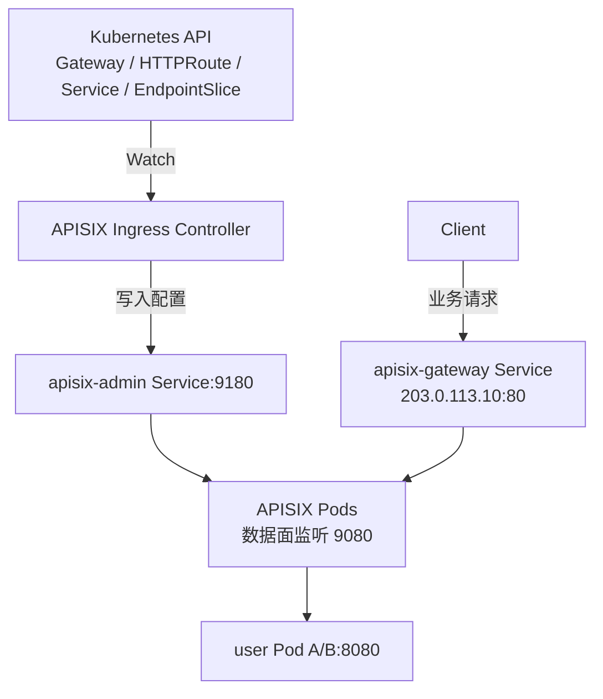

## 1. APISIX 的定位

APISIX 接入 Kubernetes Gateway API 后，系统分为三部分：

| 组件 | 运行形态 | 职责 |
| --- | --- | --- |
| Gateway API | Kubernetes CRD | 声明入口、路由和后端 |
| APISIX Ingress Controller | Deployment | 读取声明，生成并写入 APISIX 配置 |
| APISIX | Deployment/Pod | 匹配路由、执行插件并代理请求 |

```text
Gateway API 声明
        ↓
APISIX Ingress Controller
        ↓
APISIX Route / Upstream / Plugin
        ↓
APISIX Pod 处理请求
```

APISIX 可以脱离 Kubernetes 独立运行，不会直接读取 `HTTPRoute`。Ingress Controller 才是 Gateway API 控制面，但它不处理业务请求。

与 Envoy Gateway 不同，APISIX Ingress Controller 通常配置已经部署好的 APISIX，不会为每个 `Gateway` 创建一套代理 Pod 和 Service。

## 2. 示例与部署架构

业务服务如下：

```text
Service: user-service:80
└── EndpointSlice
    ├── user Pod A: 10.0.1.11:8080
    └── user Pod B: 10.0.2.12:8080
```

希望提供：

```text
GET http://api.example.com/users/* -> user-service
```

APISIX 由平台预先部署，并通过两个不同的 Kubernetes Service 暴露：

```text
apisix-admin
└── ClusterIP:9180
    Controller 通过它写入配置

apisix-gateway
└── LoadBalancer 203.0.113.10:80 -> APISIX Pod:9080
    Client 通过它发送业务请求
```



## 3. Gateway API 如何关联 APISIX

### 3.1 GatewayClass 选择 Controller

```yaml
apiVersion: gateway.networking.k8s.io/v1
kind: GatewayClass
metadata:
  name: apisix
spec:
  controllerName: apisix.apache.org/apisix-ingress-controller
```

### 3.2 GatewayProxy 选择 APISIX

`GatewayProxy` 告诉 Controller 应该把配置写入哪套 APISIX：

```yaml
apiVersion: apisix.apache.org/v1alpha1
kind: GatewayProxy
metadata:
  name: apisix-config
spec:
  provider:
    type: ControlPlane
    controlPlane:
      endpoints:
        - http://apisix-admin.ingress-apisix.svc.cluster.local:9180
      auth:
        type: AdminKey
        adminKey:
          valueFrom:
            secretKeyRef:
              name: apisix-admin-key
              key: key
  statusAddress:
    - 203.0.113.10
```

| 字段 | 作用 |
| --- | --- |
| `provider.controlPlane` | Controller 写配置使用的管理端点 |
| `statusAddress` | 填入 `Gateway.status.addresses`，报告业务入口地址 |

`statusAddress` 不会创建 IP、Service 或转发链路。这里的地址必须已经是可访问的 `apisix-gateway` 地址。

### 3.3 Gateway 声明 Listener

```yaml
apiVersion: gateway.networking.k8s.io/v1
kind: Gateway
metadata:
  name: apisix
spec:
  gatewayClassName: apisix
  listeners:
    - name: http
      protocol: HTTP
      port: 80
  infrastructure:
    parametersRef:
      group: apisix.apache.org
      kind: GatewayProxy
      name: apisix-config
```

这表示：使用 APISIX Controller，通过 `apisix-config` 指定的管理端点，为 `http` Listener 生成配置。

它不会创建 APISIX Deployment、`apisix-gateway` Service 或 APISIX 监听端口。多个 Gateway 可以引用同一个 GatewayProxy，共同使用一套 APISIX。

### 3.4 HTTPRoute 绑定 Listener 和后端

```yaml
apiVersion: gateway.networking.k8s.io/v1
kind: HTTPRoute
metadata:
  name: user-api
spec:
  parentRefs:
    - name: apisix
      sectionName: http
  hostnames:
    - api.example.com
  rules:
    - matches:
        - path:
            type: PathPrefix
            value: /users
      backendRefs:
        - name: user-service
          port: 80
```

`parentRefs` 将 Route 绑定到 Gateway 的 `http` Listener，`backendRefs` 指定后端 `user-service:80`。

## 4. APISIX 怎么知道 user-service

```text
HTTPRoute.backendRefs: user-service:80
        ↓
Controller 读取 Service 和 EndpointSlice
        ↓
得到 10.0.1.11:8080、10.0.2.12:8080
        ↓
生成 APISIX Route 和 Upstream
        ↓
通过 apisix-admin:9180 写入 APISIX
```

默认使用 Endpoint 粒度时，APISIX 直接在 Pod IP 之间负载均衡，不再请求 `user-service` 的 ClusterIP。服务扩容后，EndpointSlice 变化会触发 Controller 更新 Upstream。

APISIX 自身也提供 Kubernetes Service Discovery Plugin，由 APISIX 直接监听后端变化；这是另一种服务发现方式，不要与 Controller 的转换链路混淆。

## 5. Gateway 的 80 端口有什么用

Gateway API 中的 `listeners.port: 80` 表示期望 Gateway 在其地址的 80 端口提供 HTTP Listener。

但 APISIX Controller 不管理数据面部署，不能根据该字段打开 socket 或修改 Service。示例中有三个端口：

| 端口 | 示例 | 实际作用 |
| --- | --- | --- |
| `Gateway.listeners.port` | 80 | 声明 Listener，可用于 APISIX Route 的端口匹配 |
| `apisix-gateway Service.port` | 80 | Client 实际访问的端口 |
| `targetPort` / APISIX `node_listen` | 9080 | APISIX 进程实际接受连接的端口 |

默认 `listener_port_match_mode: off`，Controller 不生成端口匹配条件，所以下面的映射可以工作：

```text
Client -> 203.0.113.10:80 -> Service:80 -> APISIX Pod:9080
```

设置为 `auto` 或 `explicit` 后，符合条件的 Route 会包含 `server_port == 80`。如果 APISIX 实际在 9080 接受连接，条件不成立，请求可能返回 `404`。

需要按端口隔离 Route 时，应让 Gateway Listener、Service `port/targetPort` 和 APISIX `node_listen` 使用同一端口。

## 6. 一次请求如何执行

示例地址：

```text
api.example.com              -> 203.0.113.10
apisix-gateway               -> 203.0.113.10:80
APISIX Pod                   -> 10.0.3.21:9080
user-service EndpointSlice   -> 10.0.1.11:8080、10.0.2.12:8080
```

客户端执行：

```bash
curl http://api.example.com/users/42
```

请求过程：

```text
1. DNS
   api.example.com -> 203.0.113.10

2. Client 建立连接
   目标：203.0.113.10:80，即 apisix-gateway 的对外 IP 和端口

3. Kubernetes Service 转发
   apisix-gateway:80 -> APISIX Pod 10.0.3.21:9080

4. APISIX 处理
   匹配 Host=api.example.com、Path=/users/42
   执行认证、限流、改写等插件

5. APISIX 选择 Upstream 并建立连接
   APISIX Pod -> user Pod 10.0.1.11:8080
```

客户端不访问 `GatewayProxy` 或 `apisix-admin`，请求也不经过 Ingress Controller：

```text
配置流：Gateway API -> Controller -> apisix-admin:9180 -> APISIX 配置
请求流：Client -> apisix-gateway:80 -> APISIX Pod:9080 -> user Pod:8080
```

## 7. 配置存储与内部抽象

| 部署模式 | 配置链路 |
| --- | --- |
| 传统模式 | Controller -> Admin API -> etcd -> APISIX 数据面 |
| Standalone API-driven | Controller -> `/apisix/admin/configs` -> APISIX 内存 |

两种模式都不会让业务请求经过 Controller 或 etcd。

| APISIX 抽象 | 本例中的作用 |
| --- | --- |
| Route | 匹配 `api.example.com/users/*` |
| Upstream | 保存 user Pod 端点和负载均衡策略 |
| Plugin | 执行认证、限流、改写和可观测逻辑 |
| Consumer | 表示 API 调用方及其凭证 |
| Service | 复用多个 Route 的公共 APISIX 配置 |

最后一项是 APISIX 内部的 Service，不是 Kubernetes Service。

## 8. 总结

```text
GatewayClass 选择 Controller
        ↓
GatewayProxy 指定 APISIX 管理端点
        ↓
Gateway / HTTPRoute 声明 Listener、匹配条件和后端
        ↓
Controller 生成 APISIX Route 和 Upstream
        ↓
Client 访问预先部署的 apisix-gateway
        ↓
APISIX 执行插件并选择后端 Pod
```

官方文档：[Deployment Architecture](https://apisix.apache.org/docs/ingress-controller/concepts/deployment-architecture/)、[Gateway API Support](https://apisix.apache.org/docs/ingress-controller/concepts/gateway-api/)、[Configuration Examples](https://apisix.apache.org/docs/ingress-controller/reference/apisix-ingress-controller/examples/)、[Kubernetes Discovery](https://apisix.apache.org/docs/apisix/discovery/kubernetes/)。
