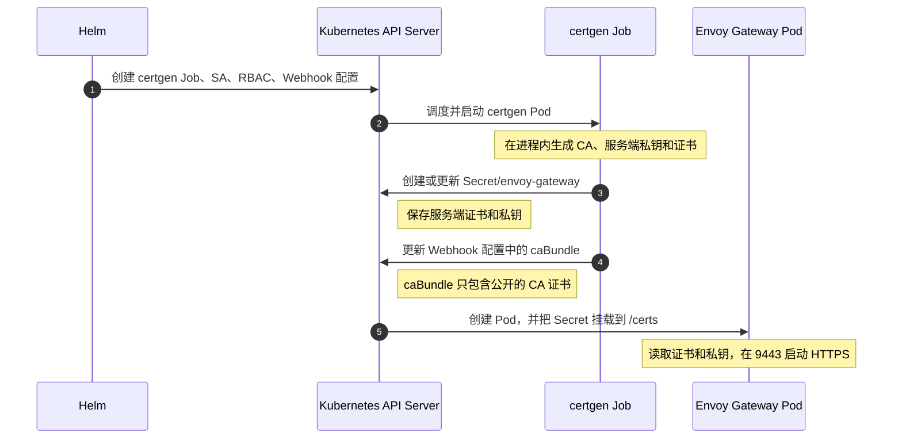
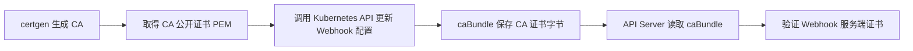
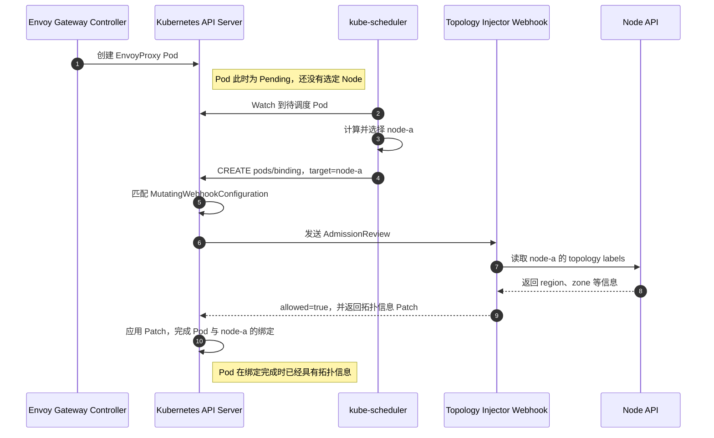
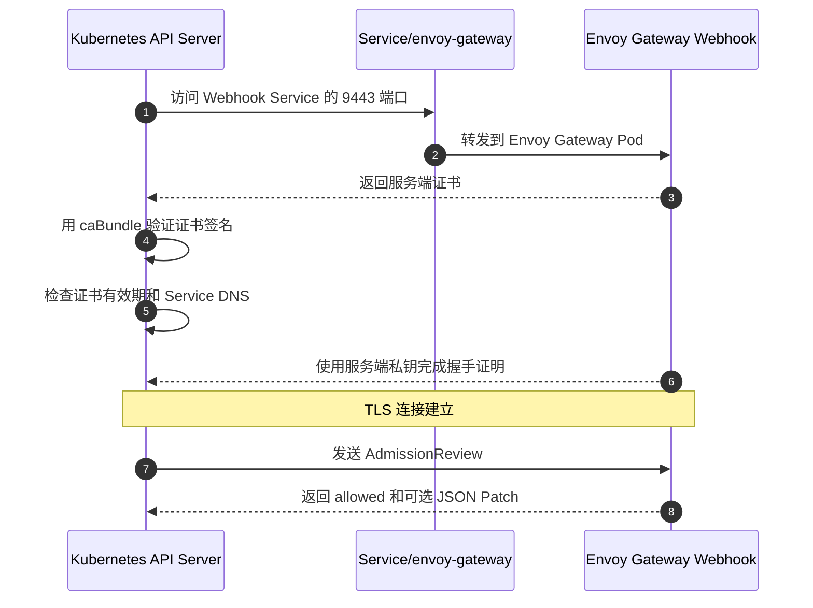
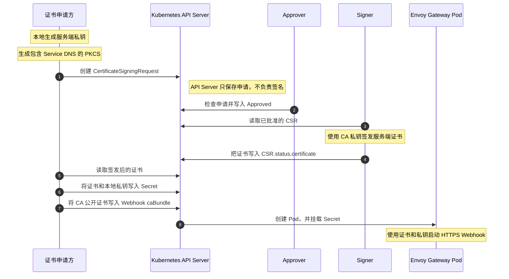

# Envoy Gateway 初始化资源与 Kubernetes 机制

本文讨论的是 **Envoy Gateway Controller 的安装与初始化**，而不是创建 `Gateway` 之后 Envoy 数据面的创建过程。

二者的边界如下：

```text
安装 Envoy Gateway
    ↓
创建并启动 Envoy Gateway Controller（本文）
    ↓
用户创建 GatewayClass、Gateway、HTTPRoute
    ↓
Controller 创建 Envoy Deployment、Service，并下发 xDS（后续流程）
```

为了避免把“Envoy Gateway 做了什么”和“Kubernetes 为什么能够做到”混在一起，本文分成两个部分：

1. 先沿着初始化时间线，观察 Envoy Gateway 创建了什么、完成了什么。
2. 再解释这些动作背后的 Kubernetes 机制。

<!-- more -->

## 1. Envoy Gateway 初始化做了什么

### 1.1 初始化的目标

安装 Envoy Gateway 的直接目标不是马上创建 Envoy 数据面，而是先准备一个能够持续工作的控制面。这个控制面需要具备以下能力：

1. 有自己的 Kubernetes 身份，并具有读取 Gateway API、监听集群资源和创建数据面资源的权限。
2. 能够读取控制器启动配置。
3. 能够安全地向 Kubernetes API Server 提供 Admission Webhook 服务。
4. 能够监听 `GatewayClass`、`Gateway`、`HTTPRoute`、`Service`、`EndpointSlice` 等资源。
5. 在后续出现 `Gateway` 时，创建并管理 Envoy 数据面。

实验环境中使用 Helm 安装：

```bash
helm install eg oci://docker.io/envoyproxy/gateway-helm \
  --version v1.6.1 \
  -n ddd-learn \
  --set config.envoyGateway.provider.kubernetes.deploy.type=GatewayNamespace \
  --set config.envoyGateway.provider.kubernetes.deployMode=Standalone \
  --set config.envoyGateway.provider.kubernetes.rateLimitDeployment.type=GatewayNamespace \
  --set config.envoyGateway.provider.kubernetes.shutdownManager.image.repository=docker.1ms.run/envoyproxy/gateway \
  --set config.envoyGateway.provider.kubernetes.shutdownManager.image.tag=v1.6.1 \
  --set config.envoyGateway.provider.kubernetes.topologyInjector.enabled=true
```

这里开启了 `topologyInjector`，因此安装过程除了创建 Controller，还会注册一个 Pod 调度相关的 Mutating Admission Webhook。

### 1.2 初始化的完整时间线

从 Helm 开始安装到 Controller 可以工作，大致会经历以下过程：

```text
Helm install
    │
    ├─ 1. 创建 certgen 使用的 ServiceAccount、权限和待配置的 Webhook 注册资源
    │
    ├─ 2. 执行 certgen Hook Job
    │      ├─ 生成控制面所需的 CA、证书、私钥和 HMAC 密钥
    │      ├─ 写入 envoy-gateway、envoy 等 Secret
    │      └─ 把 Webhook CA 写入 MutatingWebhookConfiguration.caBundle
    │
    ├─ 3. 创建 Controller 的 ServiceAccount、RBAC、ConfigMap
    │
    ├─ 4. 创建 envoy-gateway Deployment 和 Service
    │
    ├─ 5. Kubernetes 启动 envoy-gateway Pod
    │      ├─ 注入 ServiceAccount 身份
    │      ├─ 挂载 ConfigMap
    │      ├─ 挂载 TLS Secret
    │      └─ 启动 Envoy Gateway Controller
    │
    ├─ 6. Controller 启动各类监听器和调谐器
    │      ├─ 监听 Gateway API 等资源
    │      ├─ 提供健康检查、指标等端口
    │      └─ 在 9443 端口提供 Admission Webhook
    │
    └─ 7. Webhook 调用链进入可用状态
           └─ 符合条件的 Pod/binding 请求会被转发给 Webhook
```

这条时间线中最重要的先后关系是：**先注册 Webhook 并准备证书，再启动 Controller；Controller 和 Service Endpoint 就绪后，API Server 才能通过 HTTPS 成功调用 Webhook。**

### 1.3 初始化创建的资源

在 `ddd-learn` 命名空间中，Helm Chart 创建的资源可以分为四组：

| 分组 | 主要资源 | 作用 |
| --- | --- | --- |
| Controller 运行 | `Deployment/envoy-gateway`、`Service/envoy-gateway` | 运行并暴露 Envoy Gateway Controller |
| Controller 配置 | `ConfigMap/envoy-gateway-config` | 保存 Controller 启动配置 |
| Controller 权限 | `ServiceAccount/envoy-gateway`、Role/ClusterRole 及其 Binding | 让 Controller 能读取和管理 Kubernetes 资源 |
| 安装期安全 | certgen ServiceAccount、RBAC、Job、若干 Secret | 生成并保存控制面通信所需的证书和密钥，并建立 Webhook 信任 |

此外还有一个集群级资源：

```text
MutatingWebhookConfiguration/envoy-gateway-topology-injector
```

Gateway API 和 Envoy Gateway 自身使用的 CRD 也是集群级资源。下面把这些 CRD 展开来看。

#### 1.3.1 先区分 CRD 和 CR

CRD 是“类型定义”，CR 是根据这个类型创建的“具体对象”。例如：

```text
集群级类型定义
CustomResourceDefinition/gateways.gateway.networking.k8s.io
    │
    │ 定义 kind: Gateway 可以填写哪些字段
    ▼
命名空间中的具体对象
Gateway/ddd-learn/example-gateway
```

所以，“CRD 是集群级资源”不代表根据它创建的所有对象都是集群级资源。例如 `Gateway` CRD 在整个集群只安装一次，但可以在多个命名空间中分别创建 `Gateway` 对象。

#### 1.3.2 Gateway API 的 CRD

Envoy Gateway v1.6 使用 Gateway API v1.4.0。与 Envoy Gateway 工作过程直接相关的 Gateway API CRD 如下：

| CRD 完整名称 | Kind | CR 实例作用域 | 作用 |
| --- | --- | --- | --- |
| `gatewayclasses.gateway.networking.k8s.io` | `GatewayClass` | 集群 | 声明由哪个 Gateway Controller 管理 |
| `gateways.gateway.networking.k8s.io` | `Gateway` | 命名空间 | 声明监听地址、端口、协议和 TLS |
| `httproutes.gateway.networking.k8s.io` | `HTTPRoute` | 命名空间 | 声明 HTTP 路由规则 |
| `grpcroutes.gateway.networking.k8s.io` | `GRPCRoute` | 命名空间 | 声明 gRPC 路由规则 |
| `tcproutes.gateway.networking.k8s.io` | `TCPRoute` | 命名空间 | 声明 TCP 四层路由规则 |
| `tlsroutes.gateway.networking.k8s.io` | `TLSRoute` | 命名空间 | 根据 SNI 等 TLS 信息路由，但不终止 TLS |
| `udproutes.gateway.networking.k8s.io` | `UDPRoute` | 命名空间 | 声明 UDP 四层路由规则 |
| `referencegrants.gateway.networking.k8s.io` | `ReferenceGrant` | 命名空间 | 允许其他命名空间中的对象引用本命名空间资源 |
| `backendtlspolicies.gateway.networking.k8s.io` | `BackendTLSPolicy` | 命名空间 | 配置 Gateway 到后端服务的 TLS 校验 |

安装的是 Standard 还是 Experimental Gateway API bundle，会影响是否包含 TCP、TLS、UDP 等实验通道资源。应以集群中的实际结果为准。

#### 1.3.3 Envoy Gateway 扩展的 CRD

标准 Gateway API 只定义通用网关能力。Envoy Gateway 使用 `gateway.envoyproxy.io` API Group 补充 Envoy 特有的部署、流量、安全和扩展配置：

| CRD 完整名称 | Kind | 作用 |
| --- | --- | --- |
| `envoyproxies.gateway.envoyproxy.io` | `EnvoyProxy` | 配置 Envoy 数据面的 Deployment、Service、资源和可观测性 |
| `backends.gateway.envoyproxy.io` | `Backend` | 描述不能直接用 Kubernetes Service 表达的后端 |
| `backendtrafficpolicies.gateway.envoyproxy.io` | `BackendTrafficPolicy` | 配置到后端方向的限流、重试、熔断和负载均衡 |
| `clienttrafficpolicies.gateway.envoyproxy.io` | `ClientTrafficPolicy` | 配置客户端到 Gateway 方向的连接和 TLS 行为 |
| `securitypolicies.gateway.envoyproxy.io` | `SecurityPolicy` | 配置 JWT、OIDC、Basic Auth、外部鉴权等安全能力 |
| `envoyextensionpolicies.gateway.envoyproxy.io` | `EnvoyExtensionPolicy` | 配置 ExtProc、Wasm 等 Envoy 扩展 |
| `envoypatchpolicies.gateway.envoyproxy.io` | `EnvoyPatchPolicy` | 对生成的 Envoy xDS 配置应用底层补丁 |
| `httproutefilters.gateway.envoyproxy.io` | `HTTPRouteFilter` | 定义可由 HTTPRoute 引用的 Envoy 特有过滤器 |

这里特意没有列出 `EnvoyGateway`。下面这种配置虽然也有 `apiVersion` 和 `kind`：

```yaml
apiVersion: gateway.envoyproxy.io/v1alpha1
kind: EnvoyGateway
```

但它是 Envoy Gateway Controller 配置文件的结构，通常保存在 `ConfigMap/envoy-gateway-config` 中，并通过 `--config-path` 读取；它不是提交给 Kubernetes API Server 的 CR，因此不存在 `envoygateways.gateway.envoyproxy.io` 这个 CRD。

#### 1.3.4 CRD 自身的 YAML 是什么样的

下面以 `EnvoyProxy` 为例，展示 CRD 自身的结构。真实 CRD 还包含很长的 OpenAPI Schema、默认值和校验规则，这里只保留理解 CRD 所需的字段：

```yaml
# CRD 使用 Kubernetes 内置的 apiextensions API
apiVersion: apiextensions.k8s.io/v1
kind: CustomResourceDefinition
metadata:
  # CRD 名称固定为：spec.names.plural + "." + spec.group
  name: envoyproxies.gateway.envoyproxy.io
spec:
  # 注册一个新的 API Group
  group: gateway.envoyproxy.io

  # EnvoyProxy 对象存在于命名空间中
  # 注意：CRD 自身仍然是集群级资源
  scope: Namespaced

  names:
    # YAML 中使用 kind: EnvoyProxy
    kind: EnvoyProxy
    listKind: EnvoyProxyList

    # REST API 和 kubectl 使用的复数名称
    plural: envoyproxies
    singular: envoyproxy

    # kubectl get envoyproxy 可以简写成 kubectl get proxy
    shortNames:
      - proxy

  versions:
    - name: v1alpha1
      served: true       # API Server 对外提供这个版本
      storage: true      # etcd 使用这个版本保存对象
      subresources:
        status: {}       # Controller 可以单独更新 status
      schema:
        openAPIV3Schema:
          type: object
          properties:
            spec:
              type: object
              # 真实 CRD 在这里定义 EnvoyProxy 的全部字段和校验规则
            status:
              type: object
              # 真实 CRD 在这里定义 Controller 回写的状态结构
```

完整 CRD 可以直接从集群导出：

```bash
kubectl get crd envoyproxies.gateway.envoyproxy.io -o yaml
```

CRD YAML 是给 API Server 注册类型的，一般由 Helm 安装；开发者日常编写的是这个 CRD 对应的 CR。下面分别展示 8 个扩展 CR 的典型 YAML。

##### 1.3.4.1 `EnvoyProxy`：配置 Envoy 数据面怎样部署

```yaml
apiVersion: gateway.envoyproxy.io/v1alpha1
kind: EnvoyProxy
metadata:
  name: custom-proxy
  namespace: ddd-learn
spec:
  # 指定数据面由 Kubernetes 工作负载承载
  provider:
    type: Kubernetes
    kubernetes:
      # 修改 Controller 将要创建的 Envoy Deployment
      envoyDeployment:
        replicas: 2
        container:
          resources:
            requests:
              cpu: 150m
              memory: 640Mi
            limits:
              cpu: 500m
              memory: 1Gi

      # 修改指向 Envoy Pod 的数据面 Service
      envoyService:
        type: LoadBalancer
```

`EnvoyProxy` 本身不会处理流量。`GatewayClass.parametersRef` 或 `Gateway.infrastructure.parametersRef` 引用它以后，Controller 才按照这里的配置创建 Envoy Deployment 和 Service。

##### 1.3.4.2 `Backend`：描述 Service 之外的后端

```yaml
apiVersion: gateway.envoyproxy.io/v1alpha1
kind: Backend
metadata:
  name: httpbin-external
  namespace: ddd-learn
spec:
  # 直接描述一个集群外的 FQDN 后端
  endpoints:
    - fqdn:
        hostname: httpbin.org
        port: 80
```

`HTTPRoute.backendRefs` 可以通过 `group: gateway.envoyproxy.io`、`kind: Backend` 引用它。Backend API 默认可能未开启，使用前需要检查 `EnvoyGateway.extensionApis` 配置。

##### 1.3.4.3 `BackendTrafficPolicy`：控制 Envoy 到后端的流量

```yaml
apiVersion: gateway.envoyproxy.io/v1alpha1
kind: BackendTrafficPolicy
metadata:
  name: api-rate-limit
  namespace: ddd-learn
spec:
  # Policy Attachment：把策略附加到同命名空间的 HTTPRoute
  targetRefs:
    - group: gateway.networking.k8s.io
      kind: HTTPRoute
      name: api-route

  # 每个 Envoy Proxy 实例独立计算每分钟 50 个请求
  rateLimit:
    local:
      rules:
        - limit:
            requests: 50
            unit: Minute
```

它管理的是“Envoy 收到请求以后，怎样访问后端”，例如限流、重试、超时、熔断、负载均衡和健康检查。

##### 1.3.4.4 `ClientTrafficPolicy`：控制客户端到 Envoy 的连接

```yaml
apiVersion: gateway.envoyproxy.io/v1alpha1
kind: ClientTrafficPolicy
metadata:
  name: client-ip-policy
  namespace: ddd-learn
spec:
  # 将策略附加到 Gateway
  targetRefs:
    - group: gateway.networking.k8s.io
      kind: Gateway
      name: api-gateway

  # 从 X-Forwarded-For 右侧开始信任 2 层代理
  clientIPDetection:
    xForwardedFor:
      numTrustedHops: 2
```

它管理的是“客户端怎样连接 Envoy”，例如客户端 IP 识别、连接参数、HTTP 协议行为和下游 TLS。

##### 1.3.4.5 `SecurityPolicy`：配置入口认证和授权

```yaml
apiVersion: gateway.envoyproxy.io/v1alpha1
kind: SecurityPolicy
metadata:
  name: api-jwt
  namespace: ddd-learn
spec:
  # 只保护 api-route；其他 Route 不受这条策略影响
  targetRefs:
    - group: gateway.networking.k8s.io
      kind: HTTPRoute
      name: api-route

  # 要求请求携带由指定 Issuer 签发的 JWT
  jwt:
    providers:
      - name: account-service
        issuer: https://auth.example.com
        remoteJWKS:
          # Envoy 使用这里的公钥集合验证 JWT 签名
          uri: https://auth.example.com/.well-known/jwks.json
```

同一个 CRD 还可以表达 OIDC、Basic Auth、API Key、外部鉴权、Authorization 和 CORS 等入口安全策略。

##### 1.3.4.6 `EnvoyExtensionPolicy`：把扩展处理器加入过滤链

```yaml
apiVersion: gateway.envoyproxy.io/v1alpha1
kind: EnvoyExtensionPolicy
metadata:
  name: ext-proc-policy
  namespace: ddd-learn
spec:
  # 将扩展附加到 api-route
  targetRefs:
    - group: gateway.networking.k8s.io
      kind: HTTPRoute
      name: api-route

  # 请求由 Envoy 转发给外部 gRPC Processor 处理
  extProc:
    - backendRefs:
        - group: ""
          kind: Service
          name: ext-proc
          port: 9002
      messageTimeout: 5s
```

它描述 Envoy 的扩展点，例如 External Processing、Wasm 和 Lua。扩展处理器本身仍需要以 Service 或其他受支持的 Backend 形式存在。

##### 1.3.4.7 `EnvoyPatchPolicy`：直接修改生成的 xDS

```yaml
apiVersion: gateway.envoyproxy.io/v1alpha1
kind: EnvoyPatchPolicy
metadata:
  name: listener-patch
  namespace: ddd-learn
spec:
  # EnvoyPatchPolicy 使用单个 targetRef 指向目标 Gateway
  targetRef:
    group: gateway.networking.k8s.io
    kind: Gateway
    name: api-gateway

  # 使用 JSON Patch 修改 Controller 已生成的 xDS 资源
  type: JSONPatch
  jsonPatches:
    - type: type.googleapis.com/envoy.config.listener.v3.Listener
      # xDS 资源名称与 Gateway、Listener 有关，必须以实际生成结果为准
      name: ddd-learn/api-gateway/http
      operation:
        op: add
        # 这里只展示 JSON Patch 的结构，不代表通用 Listener 路径
        path: /metadata/filter_metadata/example
        value:
          enabled: true
```

这是底层逃生口，需要理解 Envoy xDS 资源名称和结构。错误 Patch 可能让数据面配置无法下发，不应把它当作普通业务配置使用。

##### 1.3.4.8 `HTTPRouteFilter`：补充 HTTPRoute 没有的过滤能力

```yaml
apiVersion: gateway.envoyproxy.io/v1alpha1
kind: HTTPRouteFilter
metadata:
  name: maintenance-response
  namespace: ddd-learn
spec:
  # 由 Envoy 直接响应，不再把请求转发给后端
  directResponse:
    statusCode: 503
    contentType: text/plain
    body:
      type: Inline
      inline: "Service is under maintenance"
```

`HTTPRoute` 通过 `ExtensionRef` 使用它：

```yaml
apiVersion: gateway.networking.k8s.io/v1
kind: HTTPRoute
metadata:
  name: maintenance-route
  namespace: ddd-learn
spec:
  parentRefs:
    - name: api-gateway
  rules:
    - filters:
        - type: ExtensionRef
          extensionRef:
            group: gateway.envoyproxy.io
            kind: HTTPRouteFilter
            name: maintenance-response
```

除了直接响应，`HTTPRouteFilter` 还可以提供正则路径改写、动态 Host 改写和凭据注入等 Envoy Gateway 扩展能力。

总结一下，8 个扩展 CRD 可以分成四类：

| 类别 | CRD |
| --- | --- |
| 数据面部署 | `EnvoyProxy` |
| 后端与流量 | `Backend`、`BackendTrafficPolicy`、`ClientTrafficPolicy` |
| 安全与扩展 | `SecurityPolicy`、`EnvoyExtensionPolicy` |
| 底层补充能力 | `EnvoyPatchPolicy`、`HTTPRouteFilter` |

这些资源之间的关系可以概括为：

```text
Gateway API CR
GatewayClass + Gateway + HTTPRoute/GRPCRoute/...
                         │
                         ├─ 描述“入口和路由是什么”
                         │
Envoy Gateway 扩展 CR    │
EnvoyProxy + *Policy ----┤ 描述“Envoy 具体怎样部署和处理流量”
                         │
                         ▼
             Envoy Gateway Controller
                         │
                         ▼
             Envoy Deployment / Service / xDS
```

可以通过下面的命令核对集群中的 CRD 和其他初始化资源：

```bash
kubectl api-resources --api-group=gateway.networking.k8s.io
kubectl api-resources --api-group=gateway.envoyproxy.io
kubectl get crd | grep -E 'gateway.networking.k8s.io|gateway.envoyproxy.io'

kubectl get deploy,po,svc,sa,cm,secret,job -n ddd-learn
kubectl get role,rolebinding -n ddd-learn
kubectl get clusterrole,clusterrolebinding | grep envoy-gateway
kubectl get mutatingwebhookconfiguration | grep envoy-gateway
```

### 1.4 Controller 如何取得配置和权限

#### 1.4.1 启动配置

`ConfigMap/envoy-gateway-config` 保存的是 **Envoy Gateway Controller 自身的配置**，例如：

- 使用 Kubernetes Provider。
- Controller 和数据面资源部署在哪个命名空间。
- 采用 `Standalone` 等部署模式。
- 是否开启 topology injector。

Deployment 通过参数指定配置文件位置，并把 ConfigMap 挂载到容器中：

```text
ConfigMap/envoy-gateway-config
        │
        │ volume / volumeMount
        ▼
Envoy Gateway Pod 中的配置文件
        │
        │ --config-path
        ▼
Envoy Gateway Controller 进程
```

这份配置决定 Controller 怎么工作，不是 Envoy Proxy 最终执行的 Listener、Route、Cluster 配置。

#### 1.4.2 Kubernetes 身份和权限

Pod 使用 `ServiceAccount/envoy-gateway` 运行。Kubernetes 为 Pod 提供对应的身份凭据，API Server 再根据 Role、ClusterRole 及其 Binding 判断它能否执行某项操作。

这些权限通常包括：

- 读取和监听 `GatewayClass`、`Gateway`、`HTTPRoute` 等 Gateway API 资源。
- 读取 `Service`、`EndpointSlice`、`Secret` 等依赖资源。
- 创建或更新 Envoy 数据面所需的 Deployment、Service、ConfigMap 等资源。
- 更新资源的 `status`。

因此，ServiceAccount 解决的是“你是谁”，RBAC 解决的是“你能做什么”。

### 1.5 Webhook TLS 是怎样创建出来的

先给出结论：**Envoy Gateway 默认安装时，由 certgen Job 自己创建 CA、签发 Webhook 证书并写入 Kubernetes。它没有创建 Kubernetes `CertificateSigningRequest` 资源。**

#### 1.5.1 谁负责什么

| 参与者 | 职责 | 不负责什么 |
| --- | --- | --- |
| Helm | 创建 certgen Job、权限、Controller 和 Webhook 配置 | 不生成和签发证书 |
| Kubernetes API Server | 保存 Job、Secret 和 Webhook 配置，执行权限检查 | 不替 certgen 生成或签发证书 |
| certgen Job | 生成 CA、服务端私钥和证书；写入 Secret；写入 `caBundle` | 不长期运行，也不提供 Webhook 服务 |
| `Secret/envoy-gateway` | 保存 Controller 要使用的证书和私钥 | 不负责签发证书 |
| `MutatingWebhookConfiguration` | 告诉 API Server 去哪里调用 Webhook，以及用哪个 CA 验证它 | 不保存服务端私钥 |
| Envoy Gateway Pod | 挂载 Secret，在 9443 端口提供 HTTPS Webhook | 不负责决定 API Server 是否信任证书 |

#### 1.5.2 创建过程

整个创建过程可以按下面六步理解：

1. Helm 向 API Server 提交 certgen Job、ServiceAccount、RBAC 和 Webhook 配置。
2. Kubernetes 启动 certgen Pod，并通过 ServiceAccount 赋予它创建 Secret、修改 Webhook 配置的权限。
3. certgen 在自己的进程中生成 CA、Webhook 服务端私钥和服务端证书。证书的 SAN 必须包含 Webhook Service 的 DNS 名称。
4. certgen 调用 Kubernetes API，把服务端证书和私钥写入 `Secret/envoy-gateway`。
5. certgen 再把 CA 的公开证书写入 `MutatingWebhookConfiguration.clientConfig.caBundle`。
6. Kubernetes 启动 Envoy Gateway Pod，把 Secret 挂载到 `/certs`；Controller 读取证书和私钥，在 9443 端口启动 HTTPS Webhook。



certgen 还会为控制面其他通信以及限流、OIDC 等功能准备相关 Secret。上图只画了 Webhook TLS 所需的部分。

#### 1.5.3 创建完成后，证书分别放在哪里

```text
Secret/envoy-gateway
├─ Webhook 服务端证书：由 Envoy Gateway Pod 在 TLS 握手时出示
└─ Webhook 服务端私钥：由 Envoy Gateway Pod 用来证明自己持有证书

MutatingWebhookConfiguration.clientConfig.caBundle
└─ CA 公开证书：由 API Server 用来验证服务端证书
```

私钥只能交给服务端，不能写入 `caBundle`。`caBundle` 可以公开，因为它只用于验证签名，不能用来伪造服务端证书。

#### 1.5.4 `MutatingWebhookConfiguration` 如何保存 CA 证书

`MutatingWebhookConfiguration` 不是 CRD，而是 Kubernetes 在 `admissionregistration.k8s.io/v1` API Group 中内置的集群级资源。它用于注册 Mutating Admission Webhook。

先看一个只保留关键字段的配置。资源名称、Webhook 名称和请求路径可能随版本变化，应以实际集群输出为准：

```yaml
apiVersion: admissionregistration.k8s.io/v1
kind: MutatingWebhookConfiguration
metadata:
  name: envoy-gateway-topology-injector.ddd-learn
webhooks:
  - name: topology-injector.gateway.envoyproxy.io
    clientConfig:
      service:
        name: envoy-gateway
        namespace: ddd-learn
        port: 9443
        path: /inject

      # CA 公开证书经过 Base64 编码后的结果
      caBundle: LS0tLS1CRUdJTiBDRVJUSUZJQ0FURS0tLS0t...

    admissionReviewVersions:
      - v1
    failurePolicy: Ignore
    sideEffects: None
    rules:
      - operations:
          - CREATE
        apiGroups:
          - ""
        apiVersions:
          - v1
        resources:
          - pods/binding
```

`clientConfig` 中最重要的是两部分：

```text
clientConfig.service
└─ 告诉 API Server：到哪个 Service、端口和路径调用 Webhook

clientConfig.caBundle
└─ 告诉 API Server：应该使用哪个 CA 验证 Webhook 服务端证书
```

`caBundle` 的字段类型是字节数组。Kubernetes 把字节数组输出为 YAML 或 JSON 时，会使用 Base64 编码，所以看到的是以 `LS0t...` 开头的一长串文本。它不是证书指纹，也不是加密后的私钥。

把这段 Base64 解码后，得到的是 PEM 格式的 CA 公开证书：

```text
-----BEGIN CERTIFICATE-----
MIIC...
-----END CERTIFICATE-----
```

保存过程如下：



这里没有 Secret 引用关系。certgen 做的是一次“复制”：

```text
CA 公开证书内容
    ├─ 写入 MutatingWebhookConfiguration.clientConfig.caBundle
    │      └─ 给 API Server 验证证书
    │
    └─ 服务端证书由该 CA 签发
           └─ 和私钥一起放入 Secret，挂载给 Webhook Pod
```

可以查看实际配置：

```bash
kubectl get mutatingwebhookconfiguration \
  | grep envoy-gateway-topology-injector

kubectl get mutatingwebhookconfiguration \
  envoy-gateway-topology-injector.ddd-learn \
  -o yaml
```

也可以只取出 `caBundle`，解码并检查 CA 证书：

```bash
kubectl get mutatingwebhookconfiguration \
  envoy-gateway-topology-injector.ddd-learn \
  -o jsonpath='{.webhooks[0].clientConfig.caBundle}' \
  | base64 --decode \
  | openssl x509 -noout -subject -issuer -dates
```

如果一个配置中存在多个 `webhooks[]` 元素，每个元素都有自己的 `clientConfig`，也就可以分别保存不同的 `caBundle`。

到这里，Webhook TLS 的创建就完成了。概括起来只有两条输出：

```text
给 Envoy Gateway Pod：服务端证书 + 服务端私钥
给 Kubernetes API Server：CA 公开证书
```

前者让 Webhook 能证明“我是谁”，后者让 API Server 能判断“我是否相信你”。

### 1.6 Controller 启动后提供哪些入口

`Service/envoy-gateway` 选择 Controller Pod，并把不同用途的端口暴露为稳定的集群内地址。实验中的端口可能包括：

| 端口 | 用途 |
| --- | --- |
| `18000`、`18001`、`18002` | Controller 内部或管理相关接口，具体用途以当前版本的 Service 和启动参数为准 |
| `19001` | 指标或管理接口，具体用途以当前版本配置为准 |
| `9443` | Admission Webhook HTTPS 服务 |

这里的 `Service/envoy-gateway` 服务对象是 **Envoy Gateway Controller Pod**，不是处理外部业务请求的 Envoy Service。

两类 Service 必须分开理解：

```text
Service/envoy-gateway
    └─ 指向 Envoy Gateway Controller Pod
       用于 Webhook、控制面接口等

后续由 Gateway 触发创建的 Envoy Service
    └─ 指向 Envoy Pod
       用于接收外部业务流量
```

### 1.7 topology injector Webhook 何时工作

开启 `topologyInjector` 后，Chart 会注册 `MutatingWebhookConfiguration`。从实验资源可以看到，它关注的是：

```text
apiGroups:   [""]
apiVersions: ["v1"]
resources:   ["pods/binding"]
operations:  ["CREATE"]
```

`pods/binding` 表示 Pod 已经选定目标 Node、即将完成绑定的阶段。此时 Webhook 能同时获得 Pod 和目标 Node 的信息，从而补充与节点、可用区或拓扑相关的数据。

完整调用链如下：

```text
Scheduler 准备创建 Pod binding
    ↓
请求到达 Kubernetes API Server
    ↓
API Server 匹配 MutatingWebhookConfiguration
    ↓  HTTPS
Service/envoy-gateway:9443
    ↓
Envoy Gateway Controller 中的 Webhook Handler
    ↓
返回 AdmissionReview
    ├─ allowed: true/false
    └─ 可选 JSON Patch
    ↓
API Server 应用 Patch，继续完成 Pod 绑定
```

它不是 Controller 主动扫描 Pod 后修改，也不是 Envoy 数据面发起的调用。调用方始终是 API Server。

当前配置如果使用：

```yaml
failurePolicy: Ignore
```

表示 Webhook 暂时不可用时，API Server 可以忽略调用失败并继续请求。这能降低安装和升级时 Webhook 短暂不可用对 Pod 调度的影响，但也意味着本次拓扑注入可能缺失。

### 1.8 初始化完成后的状态

初始化完成时，系统中已经存在的是 **控制面**：

```text
Envoy Gateway Controller
├─ 身份：ServiceAccount
├─ 权限：RBAC
├─ 配置：ConfigMap
├─ 运行载体：Deployment / Pod
├─ 稳定访问地址：Service
├─ 控制面证书和密钥：Secret
├─ Webhook 信任：服务端证书 + caBundle
└─ Admission 注册：MutatingWebhookConfiguration
```

此时不一定已经存在 Envoy 数据面。只有当用户继续创建并关联这些资源后：

```text
GatewayClass
    ↓
Gateway
    ↓
HTTPRoute / GRPCRoute / TLSRoute
```

Controller 才会根据声明创建 Envoy Deployment、Envoy Service 等数据面资源，并把路由配置编译成 xDS 下发给 Envoy Proxy。

`EnvoyGateway` 配置和 `EnvoyProxy` 也不要混淆：

| 对象 | 配置谁 | 典型内容 |
| --- | --- | --- |
| `EnvoyGateway` / `envoy-gateway-config` | Envoy Gateway Controller | Provider、部署模式、Controller 功能开关 |
| `EnvoyProxy` | Envoy 数据面 | Envoy Pod 副本数、资源、Service 类型、数据面部署细节 |

如果当前安装关闭了相关 CRD，或者没有创建 `EnvoyProxy` 实例，那么初始化阶段看不到 `EnvoyProxy` 是正常的。它不等于 `Envoy Service`：前者是描述数据面部署方式的自定义资源，后者是把流量转发到 Envoy Pod 的 Kubernetes Service。

## 2. 这些动作背后的 Kubernetes 机制

第 1 部分回答“Envoy Gateway 初始化做了什么”，下面解释它为什么能够做到。

### 2.1 Helm Hook：在主资源就绪前执行安装任务

普通 Helm 资源会作为一次 Release 的一部分被创建；Hook 则允许某些任务在特定阶段先执行。

certgen Job 通常使用类似以下 Hook：

```yaml
annotations:
  helm.sh/hook: pre-install,pre-upgrade
```

这表示：

- 首次安装前执行证书生成。
- 升级前再次检查或更新证书。
- Job 完成后，主 Deployment 才能安全地挂载证书并启动 Webhook。

certgen 使用独立的 ServiceAccount 和 RBAC，是为了把安装期权限与常驻 Controller 权限分开。Job 只需要修改指定 Secret 和 Webhook 配置，不必长期持有这些权限。

### 2.2 ServiceAccount 与 RBAC：身份和授权分离

一次 Controller 调用 API Server 的判断过程如下：

```text
Envoy Gateway Pod
    ↓ 使用 ServiceAccount 凭据
API Server Authentication
    ↓ 得到用户身份 system:serviceaccount:ddd-learn:envoy-gateway
API Server Authorization
    ↓ 查询 RoleBinding / ClusterRoleBinding
允许或拒绝本次 API 操作
```

相关资源各自负责：

| 资源 | 作用范围 | 作用 |
| --- | --- | --- |
| ServiceAccount | 命名空间 | 给工作负载提供 Kubernetes 身份 |
| Role | 命名空间 | 定义某个命名空间内的权限 |
| ClusterRole | 集群 | 定义集群级资源或跨命名空间权限 |
| RoleBinding | 命名空间 | 把 Role 或 ClusterRole 授给主体，但只在本命名空间生效 |
| ClusterRoleBinding | 集群 | 把 ClusterRole 在整个集群范围授给主体 |

GatewayClass、CRD 等是集群级资源，所以 Controller 不可能只依赖命名空间内的 Role。Deployment、Service、Secret 等通常又是命名空间资源，因此 Chart 往往同时包含命名空间级和集群级 RBAC。

### 2.3 ConfigMap 与 Secret 挂载：把配置交给容器

Kubernetes 可以把 ConfigMap 或 Secret 作为 Volume 挂载到 Pod：

```text
ConfigMap / Secret
    ↓ Volume
Pod spec.volumes
    ↓ VolumeMount
容器文件系统中的目录或文件
```

二者用途不同：

- ConfigMap 保存非敏感配置，例如 Controller 的 YAML 配置。
- Secret 保存证书、私钥等敏感数据。

Secret 的 `data` 字段只是 Base64 编码，并不等于加密。真正的保护依赖 RBAC、etcd 静态加密、审计和最小权限等集群安全配置。

### 2.4 Deployment、Pod 与 Service：运行实例和稳定入口分离

Deployment 管理 Pod 副本和滚动升级；Pod 承载真正的 Controller 进程；Service 通过标签选择 Pod，并提供稳定的 DNS 名称和虚拟 IP。

```text
Deployment
    ↓ 创建并维护
ReplicaSet
    ↓ 创建
Pod（IP 会变化）
    ↑ 标签选择
Service（稳定 DNS/VIP）
```

Admission Webhook 配置引用 Service，而不是某个 Pod IP，就是为了让 Controller Pod 重建或滚动升级后，API Server 仍能通过稳定地址调用它。

### 2.5 Admission Webhook：在 API 请求落库前介入

先说结论：**Topology Injector 使用 Admission，不是因为 Controller 做不到修改 Kubernetes 对象，而是因为它必须在“Scheduler 已经选出 Node”和“Pod 正式绑定到 Node”之间，同步地把这个 Node 的拓扑信息加入绑定请求。**

普通 Controller 的 reconcile 发生在对象保存之后，不能保证拓扑信息在 Pod 完成绑定时就已经存在；Pod 创建阶段又还不知道最终会被调度到哪个 Node。`pods/binding` 的 Mutating Admission 正好位于这两个阶段之间。

#### 2.5.1 Topology Injector 要解决什么问题

Envoy 的 Zone Aware Routing 需要知道 EnvoyProxy Pod 所在的区域，例如 Node 上的这些标签：

```text
topology.kubernetes.io/region
topology.kubernetes.io/zone
```

但一个尚未调度的 Pod 只有调度要求，还没有最终 Node：

```text
创建 EnvoyProxy Pod
    │
    ├─ 此时知道：nodeSelector、affinity、资源需求
    └─ 此时不知道：Scheduler 最终会选择哪个 Node

Scheduler 完成计算
    │
    └─ 此时才知道：Pod 将绑定到 node-a

读取 node-a 的标签
    │
    └─ 得到：region=cn-east-1、zone=cn-east-1a
```

因此，Topology Injector 必须等 Scheduler 选出 Node 后才能读取正确的拓扑信息。

#### 2.5.2 为什么不能在 Pod CREATE 时注入

Pod CREATE Admission 发生在 Scheduler 运行之前：

```text
提交 Pod
    ↓
Pod CREATE Admission
    ↓
Pod 保存为 Pending
    ↓
Scheduler 选择 Node
```

在 Pod CREATE 阶段，通常还没有 `spec.nodeName`，Webhook 不知道这个 Pod 最终位于哪个 Zone。因此，这个时间点可以注入固定配置，却不能注入最终 Node 的拓扑信息。

#### 2.5.3 为什么不让普通 Controller 在调度后修改

普通 Controller 可以 Watch Pod，然后在发现 `spec.nodeName` 后再次 Patch Pod，但会产生时间窗口：

```text
Pod 已经绑定 Node
    ↓
Kubelet 可能马上启动容器
    ↓
Envoy 可能已经启动并连接控制面
    ↓
Topology Controller 才观察到 Pod 并写入拓扑信息
```

这里的问题不是“最终能不能写进去”，而是“能不能保证 Pod 完成绑定时就已经带有拓扑信息”。异步 reconcile 只能保证最终一致，不能保证没有这个时间窗口。

此外，有些 PodSpec 内容在 Pod 创建后不能再随意修改。即使拓扑信息最终放在可修改的 metadata 中，异步修改仍然存在启动竞态。

#### 2.5.4 为什么选择 `pods/binding`

Scheduler 选出 Node 后，不是直接修改 Pod，而是向 API Server 创建 Pod 的 `binding` 子资源：

```text
POST /api/v1/namespaces/{namespace}/pods/{pod-name}/binding
```

请求中的 `Binding` 对象包含目标 Node：

```yaml
apiVersion: v1
kind: Binding
metadata:
  name: envoy-proxy-pod
  namespace: ddd-learn
target:
  apiVersion: v1
  kind: Node
  name: node-a
```

此时同时满足两个条件：

1. `target.name` 已经明确告诉 Webhook 选中了哪个 Node。
2. API Server 还没有完成这次绑定，仍有机会修改 Binding 请求。

所以 `pods/binding CREATE` 是注入 Node 拓扑信息最合适的时间点。

下面用一个最小示例说明“注入”到底做了什么。

假设 Scheduler 为 Envoy Proxy Pod 选中了 `node-a`，这个 Node 使用标准 Label 标记自己位于可用区 `cn-east-1a`：

```yaml
apiVersion: v1
kind: Node
metadata:
  name: node-a
  labels:
    topology.kubernetes.io/zone: cn-east-1a
```

Scheduler 随后向 API Server 发送下面的 Binding 请求：

```yaml
apiVersion: v1
kind: Binding
metadata:
  name: envoy-proxy-pod
  namespace: ddd-learn
target:
  apiVersion: v1
  kind: Node
  name: node-a
```

Topology Injector 从 `target.name` 得知目标是 `node-a`，读取该 Node 的
`topology.kubernetes.io/zone` Label，然后向 API Server 返回 JSON Patch。为了便于理解，下面展示的是 Patch 的等价形式：

```json
[
  {
    "op": "add",
    "path": "/metadata/annotations",
    "value": {
      "topology.kubernetes.io/zone": "cn-east-1a"
    }
  }
]
```

Patch 修改的是这次 Binding 请求。API Server 完成绑定时，会将 Binding 携带的 Annotation 合并到 Pod，因此最终的 Pod 大约是：

```yaml
apiVersion: v1
kind: Pod
metadata:
  name: envoy-proxy-pod
  namespace: ddd-learn
  annotations:
    topology.kubernetes.io/zone: cn-east-1a
spec:
  nodeName: node-a
```

Envoy Gateway 创建 Envoy Proxy Pod 时，还预先配置了 Downward API 环境变量：

```yaml
env:
  - name: ENVOY_SERVICE_ZONE
    valueFrom:
      fieldRef:
        fieldPath: metadata.annotations['topology.kubernetes.io/zone']
```

因此，Envoy 容器启动后看到的是：

```text
ENVOY_SERVICE_ZONE=cn-east-1a
```

整个数据传递过程可以缩写为：

```text
Node Label
topology.kubernetes.io/zone=cn-east-1a
        ↓ Topology Injector 读取
Binding Annotation
topology.kubernetes.io/zone=cn-east-1a
        ↓ API Server 完成绑定
Pod Annotation
topology.kubernetes.io/zone=cn-east-1a
        ↓ Downward API
Envoy 环境变量
ENVOY_SERVICE_ZONE=cn-east-1a
```

这里要区分两件事：`node-a` 是 Scheduler 的调度结果，写入 `spec.nodeName`；`cn-east-1a` 是 Topology Injector 额外复制的拓扑信息，写入 Pod Annotation。它不会把 Node 的所有 Label 都复制给 Pod。

#### 2.5.5 为什么是 Mutating Admission

Admission 有两类常见 Webhook：

| 类型 | 能做什么 | 是否适合 Topology Injector |
| --- | --- | --- |
| Validating Webhook | 接受或拒绝请求，主要用于校验 | 不适合，它不能完成拓扑注入 |
| Mutating Webhook | 在请求保存前返回 Patch 修改对象 | 适合，它可以修改 Binding 请求 |

Topology Injector 不只是判断这次绑定是否合法，而是需要把拓扑信息加入请求，所以必须使用 Mutating Webhook。

使用动态 Admission Webhook 还有一个原因：它不需要修改或重新编译 kube-apiserver。Envoy Gateway 只要创建 `MutatingWebhookConfiguration`，就能告诉 API Server：遇到符合规则的请求时，请回调 Envoy Gateway 提供的 HTTPS 服务。

#### 2.5.6 谁发起 Webhook 调用

这条链路中有两个容易混淆的请求：

```text
请求 1：kube-scheduler → API Server
        创建 pods/binding

请求 2：API Server → Envoy Gateway Webhook
        发送 AdmissionReview
```

因此：

- kube-scheduler 是原始 Binding 请求的发起者。
- API Server 是 Webhook HTTPS 请求的发起者。
- Envoy Gateway Controller 是 Webhook 服务端。
- Envoy Proxy 数据面没有发起这次调用。

#### 2.5.7 完整执行时序



这正是 Admission 的价值：Webhook 的响应是原始 API 请求处理过程的一部分，API Server 会等待它返回以后再继续绑定。

#### 2.5.8 `AdmissionReview` 中传递什么

API Server 不会把一个任意 HTTP 请求发给 Webhook，而是发送 Kubernetes 定义的 `AdmissionReview`：

```yaml
apiVersion: admission.k8s.io/v1
kind: AdmissionReview
request:
  uid: 6adf...
  operation: CREATE
  resource:
    group: ""
    version: v1
    resource: pods
  subResource: binding
  namespace: ddd-learn
  name: envoy-proxy-pod
  object:
    apiVersion: v1
    kind: Binding
    target:
      apiVersion: v1
      kind: Node
      name: node-a
```

Webhook 的响应必须带回相同的 `uid`，并说明是否允许以及是否需要修改：

```yaml
apiVersion: admission.k8s.io/v1
kind: AdmissionReview
response:
  uid: 6adf...
  allowed: true
  patchType: JSONPatch
  # Base64 编码的 JSON Patch；具体注入字段以当前版本实现为准
  patch: W3sib3AiOiJhZGQiLCJwYXRoIjoiLi4uIn1d
```

API Server 负责解码和应用 Patch。Webhook 不会绕过 API Server 直接完成 Pod 绑定。

#### 2.5.9 Admission 在 API Server 中的位置

Kubernetes 对一个写请求的简化处理顺序如下：

```text
请求进入 API Server
    ↓
认证 Authentication
    ↓
授权 Authorization
    ↓
Mutating Admission
    ↓
对象校验与 Validating Admission
    ↓
写入 etcd
```

Mutating Webhook 通过 `MutatingWebhookConfiguration` 声明：

- 匹配哪些 API Group、Version 和 Resource。
- 匹配哪些操作，如 `CREATE`、`UPDATE`。
- 是否使用 `namespaceSelector` 或 `objectSelector` 缩小范围。
- Webhook 不可用时是 `Ignore` 还是 `Fail`。
- API Server 应该调用哪个 Service、端口和路径。
- 用哪个 CA 验证 Webhook 服务端证书。

#### 2.5.10 Webhook 不可用时怎么办

Topology Injector 的配置使用：

```yaml
failurePolicy: Ignore
```

它表达的是可用性与完整性之间的取舍：

- Webhook 正常：API Server 等待注入完成，再继续绑定。
- Webhook 超时或连接失败：API Server 忽略本次调用错误，继续完成绑定。
- 结果：Pod 可以正常调度，但这一次可能没有获得拓扑信息。

如果使用 `failurePolicy: Fail`，拓扑信息更有保证，但 Webhook 故障可能阻塞 Pod 调度。Envoy Gateway 选择 `Ignore`，是为了避免一个辅助拓扑能力变成整个集群 Pod 调度的单点故障。

#### 2.5.11 小结：为什么必须使用 Admission

整个选择逻辑可以归纳为：

```text
Pod CREATE：还不知道 Node，太早
        ↓
pods/binding Admission：已经知道 Node，绑定尚未完成，时间正好
        ↓
普通 Controller reconcile：Pod 已经绑定并可能启动，太晚
```

因此，Topology Injector 使用 Admission 的根本原因是：**它需要在一个 Kubernetes 请求提交的中间位置，同步读取调度结果并修改请求，而不是在对象保存后异步追赶最终状态。**

### 2.6 Webhook TLS 为什么能够建立信任

上一节说明了证书怎样被创建。这一节只回答一个问题：**API Server 第一次访问 Envoy Gateway Webhook，为什么敢相信对方是真的？**

答案是：certgen 同时把“身份证明”交给 Webhook，把“验证依据”交给 API Server。

#### 2.6.1 三份材料分别做什么

| 材料 | 持有者 | 用途 |
| --- | --- | --- |
| 服务端私钥 | Envoy Gateway Pod | 在 TLS 握手中证明自己持有对应私钥 |
| 服务端证书 | Envoy Gateway Pod | 声明服务端身份、公钥、DNS 名称、有效期和签发者 |
| CA 公开证书 | API Server，通过 `caBundle` 获得 | 验证服务端证书是不是由受信任 CA 签发 |

服务端证书中的 DNS 名称还必须包含 API Server 实际访问的 Service DNS，例如：

```text
envoy-gateway.ddd-learn.svc
envoy-gateway.ddd-learn.svc.cluster.local
```

#### 2.6.2 API Server 调用 Webhook 的时序



TLS 建立失败通常只有几类原因：

1. `caBundle` 不是签发服务端证书的那个 CA。
2. 服务端证书已经过期或尚未生效。
3. 证书中的 DNS 名称与 Webhook Service 不匹配。
4. Envoy Gateway Pod 挂载的私钥与服务端证书不配套。
5. Service 没有可用 Endpoint，API Server 根本连接不到 Webhook Pod。

因此，这条信任链可以归纳为：

```text
certgen 签发
    ↓
Webhook 持有“服务端证书 + 私钥”
    ↓
API Server 持有“CA 公开证书”
    ↓
API Server 验证证书、DNS 和私钥证明
    ↓
建立可信 HTTPS 连接
```

### 2.7 这件事与 Kubernetes CSR 有什么关系

先说结论：**Envoy Gateway 默认 certgen 流程不使用 Kubernetes CSR API。CSR 是另一种可替换的证书签发流程，不是上述流程缺失的一步。**

#### 2.7.1 先区分两个容易混淆的概念

“CSR”在讨论中可能指两件事：

1. **PKCS#10 证书签名请求**：一个包含公钥、域名等信息的文件或数据。
2. **Kubernetes `CertificateSigningRequest` 资源**：保存在 API Server 中的一个 Kubernetes 对象，用于协调申请、审批和签发。

证书签发在密码学上可以使用 PKCS#10 请求，但不代表一定创建了 Kubernetes CSR 资源。certgen 直接掌握 CA，可以在自己的进程内完成签发，所以不会出现下面这个对象：

```text
certificates.k8s.io/v1 / CertificateSigningRequest
```

也就是说，执行 `kubectl get csr` 看不到 Envoy Gateway 的证书申请，是正常现象。

#### 2.7.2 如果改用 Kubernetes CSR，谁负责什么

只有采用 CSR 模式时，才会出现下面这些角色：

| 角色 | 负责什么 |
| --- | --- |
| 申请方 | 生成服务端私钥和 PKCS#10 请求，创建 CSR，最后取回证书 |
| Kubernetes API Server | 保存 CSR 对象并执行 RBAC 检查；它本身不等于 CA |
| Approver | 检查这份申请是否允许签发，把 CSR 标记为 `Approved` 或 `Denied` |
| Signer | 持有 CA 私钥，对已批准的 CSR 签名，把证书写回 `status.certificate` |
| Secret 管理方 | 把签发后的证书与申请方保留的私钥写入 Secret |
| Webhook 配置管理方 | 把 Signer 对应的 CA 公开证书写入 `caBundle` |
| Envoy Gateway Pod | 挂载 Secret，使用证书和私钥提供 HTTPS |

在自动化系统中，“申请方”“Secret 管理方”和“Webhook 配置管理方”可能都是同一个证书控制器，例如 cert-manager；但它们在逻辑上仍是不同职责。

#### 2.7.3 CSR 模式的完整时序

下面假设不再让 certgen 直接签发，而是交给集群中的 Approver 和自定义 Signer：



逐步看这条链路：

1. 申请方先生成私钥。**私钥始终留在申请方，不会放入 CSR。**
2. 申请方用私钥对应的公钥生成 PKCS#10 请求，再创建 Kubernetes CSR 对象。
3. API Server 只负责保存对象、鉴权和提供 API，不会因为 CSR 创建成功就自动签发。
4. Approver 负责回答“能不能签”，Signer 负责回答“由谁签、怎么签”。这是两个不同动作。
5. Signer 把签发结果写入 CSR 的 `status.certificate`。
6. 申请方取回证书，并和第 1 步保留的私钥一起写入 Secret。
7. 证书管理方还要把 CA 公开证书写入 Webhook 的 `caBundle`，否则 API Server 不知道应该信任谁。
8. Envoy Gateway Pod 挂载 Secret，之后的 TLS 调用过程与上一节相同。

Kubernetes 内置 Signer 有固定用途，通常不会为任意 Webhook Service DNS 签发服务端证书。因此实际使用 CSR 时，还需要部署支持该用途的自定义 Signer，或者使用 cert-manager 等证书控制器完成类似工作。

#### 2.7.4 两种流程对照

| 问题 | Envoy Gateway 默认 certgen | Kubernetes CSR 模式 |
| --- | --- | --- |
| 谁生成私钥 | certgen | 申请方 |
| 谁审批 | 不需要独立审批 | Approver |
| 谁签发证书 | certgen 自己持有的 CA | `signerName` 对应的 Signer |
| 是否创建 CSR 资源 | 否 | 是 |
| 谁写 Secret | certgen | 申请方或证书控制器 |
| 谁写 `caBundle` | certgen | 申请方或证书控制器 |
| Envoy Gateway Pod 如何使用 | 挂载 Secret | 挂载 Secret |

所以两条流程的终点完全相同：

```text
Envoy Gateway Pod 得到服务端证书和私钥
API Server 得到 CA 公开证书
```

区别只在前半段：**默认模式由 certgen 一次完成生成和签发；CSR 模式把申请、审批、签发拆给不同角色，通过 Kubernetes API 协作。**

可以通过下面的命令判断当前安装使用哪条路径：

```bash
kubectl get csr
kubectl get job -n ddd-learn
kubectl get secret envoy-gateway -n ddd-learn -o yaml
kubectl get mutatingwebhookconfiguration envoy-gateway-topology-injector -o yaml
```

如果没有对应 CSR，而 certgen Job 直接创建了 Secret 并更新 `caBundle`，使用的就是默认 certgen 路径。

### 2.8 Webhook 证书与 Gateway HTTPS 证书不是一回事

Envoy Gateway 体系中至少要区分两类 TLS 证书：

| 证书 | 使用方 | 保护的连接 | 是否属于本文初始化 |
| --- | --- | --- | --- |
| Admission Webhook 服务端证书 | Envoy Gateway Controller | API Server → Controller Webhook | 是 |
| Gateway Listener 业务证书 | Envoy Proxy | 外部客户端 → Gateway | 否 |

业务 HTTPS 证书通常由用户预先创建，或者由 cert-manager 等证书控制器申请并持续续期，最终保存为 Kubernetes TLS Secret：

```text
Certificate / 外部申请流程
    ↓
CA 或 ACME 服务签发
    ↓
Secret（tls.crt + tls.key）
    ↓ certificateRefs
Gateway.spec.listeners[].tls
    ↓
Envoy Gateway Controller 读取并下发配置
    ↓
Envoy Proxy 使用证书终止客户端 TLS
```

Gateway 中的引用示意：

```yaml
apiVersion: gateway.networking.k8s.io/v1
kind: Gateway
metadata:
  name: example-gateway
  namespace: ddd-learn
spec:
  gatewayClassName: eg
  listeners:
    - name: https
      protocol: HTTPS
      port: 443
      hostname: api.example.com
      tls:
        mode: Terminate
        certificateRefs:
          - kind: Secret
            name: api-example-com-tls
```

这个 Secret 的生成属于业务 Gateway 配置阶段，不是安装 Envoy Gateway Controller 时 certgen 生成的 `Secret/envoy-gateway`。不能把内部 Webhook 证书直接当作业务域名证书使用。

## 3. 把初始化过程串起来

最终可以用下面这张图同时理解“Envoy Gateway 做了什么”和“Kubernetes 提供了什么机制”：

```text
Helm
├─ Hook Job/certgen
│  ├─ Kubernetes Job：一次性执行证书准备
│  ├─ ServiceAccount + RBAC：获得受限的安装权限
│  ├─ Secret：保存 Webhook 证书和私钥
│  └─ caBundle：建立 API Server 的信任
│
├─ ConfigMap
│  └─ Volume 挂载：向 Controller 提供启动配置
│
├─ Deployment/envoy-gateway
│  └─ Pod：运行 Envoy Gateway Controller
│
├─ ServiceAccount + RBAC
│  └─ 让 Controller 能 watch 和 reconcile Kubernetes 资源
│
├─ Service/envoy-gateway
│  └─ 为 Controller 和 Webhook 提供稳定地址
│
└─ MutatingWebhookConfiguration
   └─ 让 API Server 在 pods/binding CREATE 时调用 topology injector

初始化完成
    ↓
Controller 等待 Gateway API 资源
    ↓
用户创建 GatewayClass / Gateway / Route
    ↓
Controller 才开始创建和配置 Envoy 数据面
```

因此，Envoy Gateway 初始化的本质是：**借助 Kubernetes 的身份、授权、配置挂载、工作负载、服务发现、Admission 和 TLS 信任机制，建立一个可以持续观察声明并管理 Envoy 数据面的控制面。**
