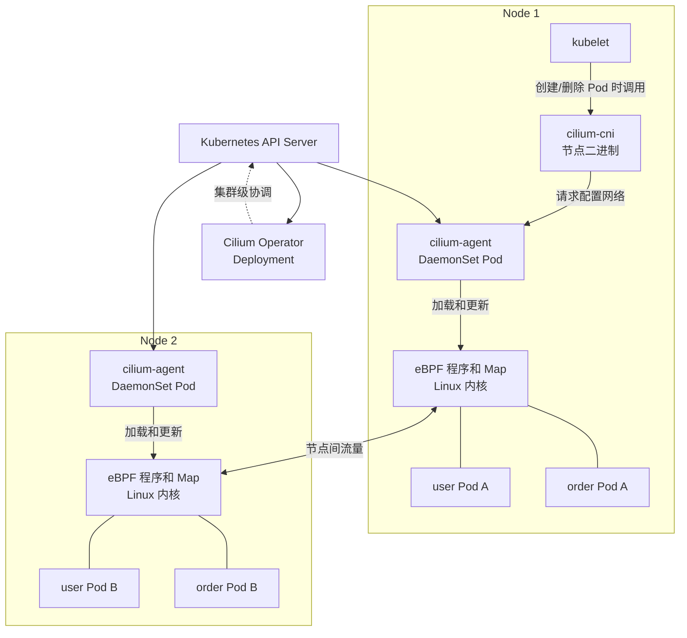
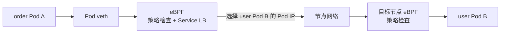
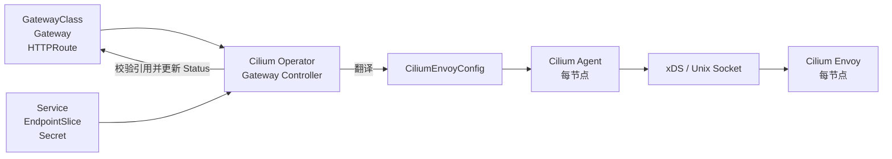
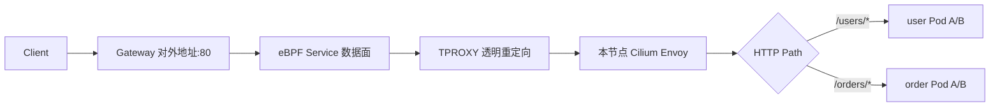

理解 Cilium Gateway API 的前提，是先把 Cilium 本身拆开。Cilium 首先是一套 Kubernetes 网络系统，Gateway API 只是建立在这套网络系统之上的 L7 入口能力。

本文继续使用两个业务服务：

```text
user-service  -> user Pod A、user Pod B
order-service -> order Pod A、order Pod B
```

最终希望实现：

```text
GET /users/*  -> user-service
GET /orders/* -> order-service
```

## 1. Cilium 作为 CNI 时有哪些组件

一套基础 Cilium 不是一个进程，而是节点程序、控制器和内核数据面的组合。



### 1.1 `cilium-cni`：为 Pod 接入网络

`cilium-cni` 是安装在每个节点上的 CNI 插件二进制。kubelet 创建或删除 Pod 网络时调用它，它再与本节点的 `cilium-agent` 协作完成接口、IP 和数据面的配置。

它不是一个持续接收业务流量的 Pod，也不负责 HTTP 路由。

### 1.2 `cilium-agent`：每个节点的网络控制进程

`cilium-agent` 以 DaemonSet 运行，因此通常每个节点有一个。它监听 Pod、Node、Service、EndpointSlice 和策略等资源的变化，然后把本节点所需的状态写入 eBPF 程序和 Map。

它负责的是“让本节点内核如何转发和检查流量”，包括：

- Pod 网络接入；
- Service 负载均衡；
- 网络身份和 NetworkPolicy；
- eBPF 程序及 Map 的维护；
- 与本节点 Envoy 同步 L7 配置和策略元数据。

### 1.3 `cilium-operator`：处理集群级工作

`cilium-operator` 以 Deployment 运行。它处理只应在集群维度执行一次的协调任务，例如部分 IPAM、资源回收和集群级控制器逻辑。

它不在普通数据包的转发路径上。Operator 暂时不可用时，已经下发的数据面通常仍能继续工作，但新资源或变更无法继续被协调。

### 1.4 eBPF 数据面：真正执行 L3/L4 转发

eBPF 程序和 Map 位于 Linux 内核中，不是 Pod，也不是 Kubernetes Service。Agent 把规则写入内核，数据包到达网卡、Pod veth 或 socket 等挂载点时，由内核直接执行这些规则。

例如 `order Pod A` 请求 `user-service`：



这条基础 L3/L4 链路不需要经过 Envoy。`user-service` 提供稳定的虚拟地址，Cilium 的 eBPF Service LB 根据后端状态选择具体 Pod。

### 1.5 Hubble：读取数据面的可观测事件

Hubble Server 嵌入在每个 `cilium-agent` 中，用于读取本节点的网络流事件。可选的 Hubble Relay 聚合各节点数据，Hubble UI 再提供集群视图。

Hubble 不参与转发；关闭它不会改变请求路径。

### 1.6 Cilium Envoy：按需处理 L7

Cilium 还包含定制的 Envoy，用于 HTTP 等 L7 功能。当前新安装默认以 `cilium-envoy` DaemonSet 独立运行，即每个节点一个 Envoy；也可以采用由 `cilium-agent` Pod 启动 Envoy 进程的嵌入模式。

没有 L7 策略、Ingress 或 Gateway API 时，普通 Pod 和 Service 流量不需要经过 Envoy。

| 组件 | 运行形态 | 处理业务数据包 | 核心职责 |
| --- | --- | --- | --- |
| `cilium-cni` | 节点二进制 | 否 | Pod 创建/删除时接入或拆除网络 |
| `cilium-agent` | 每节点一个 Pod | 不直接代理 | 管理本节点 eBPF、身份、策略和 Envoy 配置 |
| `cilium-operator` | Deployment | 否 | 集群级协调和控制器逻辑 |
| eBPF 数据面 | Linux 内核程序和 Map | 是 | L3/L4 转发、Service LB、策略执行 |
| `cilium-envoy` | 每节点一个进程，通常为 DaemonSet Pod | 仅相关 L7 流量 | HTTP/TLS/gRPC 等 L7 代理 |
| Hubble | Agent 内置 Server，可选 Relay/UI | 否 | 网络可观测性 |

## 2. 启用 Gateway API 后增加了什么

启用 `gatewayAPI.enabled=true` 并不会再安装一个独立的“Cilium Gateway Controller Deployment”。Gateway 控制逻辑由已经存在的 `cilium-operator` 和 `cilium-agent` 承担，L7 数据面复用每节点的 Cilium Envoy。

需要具备或启用的是：

| 能力 | 启用后的作用 |
| --- | --- |
| Gateway API CRD | 让 API Server 能保存 `GatewayClass`、`Gateway`、`HTTPRoute` 等声明 |
| `cilium-operator` 中的 Gateway Controller | 校验 Gateway API 资源，更新状态并生成 Cilium 的 Envoy 配置 |
| `cilium-agent` 的 Envoy 配置控制 | 读取生成的配置并同步到本节点 Envoy |
| Cilium Envoy | 接收入口流量，执行 Listener、TLS 和 L7 路由 |
| eBPF TPROXY 转发 | 把命中 Gateway 入口的流量透明重定向给本节点 Envoy |

因此，启用前后的关键变化是：

```text
只使用 CNI：        eBPF 负责 Pod 网络、Service LB 和 L3/L4 策略
启用 Gateway API：  eBPF 仍负责网络入口和转发，Envoy 增加 L7 路由
```

这里没有“一个 Gateway 对应一组 Envoy Pod”的关系。多个 `Gateway` 生成不同的 Listener 和 Route 配置，但这些配置由各节点共享的 Cilium Envoy 进程承载。

## 3. 用 Gateway API 声明入口

下面创建一个 `Gateway`，再把两个路径交给不同 Service：

```yaml
apiVersion: gateway.networking.k8s.io/v1
kind: Gateway
metadata:
  name: app-gateway
spec:
  gatewayClassName: cilium
  listeners:
    - name: http
      protocol: HTTP
      port: 80
      allowedRoutes:
        namespaces:
          from: Same
---
apiVersion: gateway.networking.k8s.io/v1
kind: HTTPRoute
metadata:
  name: app-route
spec:
  parentRefs:
    - name: app-gateway
  rules:
    - matches:
        - path:
            type: PathPrefix
            value: /users
      backendRefs:
        - name: user-service
          port: 8080
    - matches:
        - path:
            type: PathPrefix
            value: /orders
      backendRefs:
        - name: order-service
          port: 8080
```

这些 YAML 只是期望状态。API Server 不会因为保存了它们就自动出现一个代理进程，Cilium 必须把它们翻译为 Envoy 能执行的配置。

## 4. Cilium 如何把 Gateway API 变成 Envoy 配置

配置下发链路如下：



这条链路可以分成五步：

1. Operator 只处理 `gatewayClassName: cilium` 对应的 Gateway。
2. Operator 校验 Listener、Route、Service、跨 Namespace 引用和 TLS Secret 等关系，并更新资源的 `Accepted`、`Programmed` 等状态。
3. Operator 把有效配置翻译为 `CiliumEnvoyConfig`：Gateway Listener 变成 Envoy Listener，HTTPRoute 变成路由规则，后端 Service 及其端点变成上游配置。
4. 每个 `cilium-agent` 读取 `CiliumEnvoyConfig`，通过本地 Unix Domain Socket 上的 xDS 接口更新本节点 Envoy。
5. Envoy 获得可以直接执行的 Listener、Route、Cluster 和 Endpoint 配置。

对应关系如下：

| Kubernetes 声明 | Envoy 中的执行对象 |
| --- | --- |
| `Gateway.spec.listeners` | 监听地址、端口、协议及 TLS 配置 |
| `HTTPRoute.matches` | Host、Path、Header 等匹配规则 |
| `HTTPRoute.backendRefs` | 上游 Cluster |
| `Service`、`EndpointSlice` | 后端端点集合 |
| `Secret` | TLS 证书材料 |

### 4.1 Gateway 对应什么运行实例

默认的 Service 暴露模式下，Cilium Gateway Controller 会为每个 `Gateway` 创建相应的 Kubernetes Service，用它承载入口地址和端口；默认是 `LoadBalancer` 类型，也可以使用 NodePort。Host Network 模式则直接在选定节点上暴露 Listener，不再使用 LoadBalancer Service 模式。

需要区分 Service 和 Envoy：

```text
一个 Gateway
├── 一份 Listener/Route 配置
├── Service 暴露资源（默认模式）
└── 不创建专属 Envoy Deployment

多个 Gateway
└── 共同使用每个节点上的 Cilium Envoy，只是 Listener/Route 配置不同
```

Gateway Service 在这里主要定义“从哪里进入”。流量命中它的端口后，由 Cilium eBPF 截获并送到本节点 Envoy，而不是依赖一个普通 Service selector 去寻找某组专属 Gateway Pod。

## 5. 一次 `/users/42` 请求如何执行

配置流和请求流是两条不同的链路。上一节完成配置后，请求不会再经过 Operator 或 API Server。



以 `GET /users/42` 为例：

1. 客户端访问 `app-gateway` 的对外地址和 80 端口。
2. 流量进入某个 Cilium 节点并命中 Gateway Service 对应的入口。
3. 节点内核中的 eBPF 识别这是需要 L7 处理的 Gateway 流量，通过 Linux TPROXY 将其透明送给本节点 Envoy。
4. Envoy 解析 HTTP，请求路径 `/users/42` 命中 `/users` 规则。
5. Envoy 根据已经下发的后端端点选择一个 `user-service` Pod，建立上游连接。
6. 请求经 Cilium eBPF 数据面和 NetworkPolicy 检查后到达该 Pod。
7. Hubble 可以观测这段流量，但不参与转发。

所以各层的职责非常明确：

```text
Service / Host Network：提供入口地址和端口
eBPF：识别入口、透明重定向、L3/L4 转发和策略检查
Envoy：解析 HTTP/TLS/gRPC，选择 L7 路由和后端
Operator / Agent：生成并下发配置，不转发请求
```

## 6. Gateway 流量如何执行网络策略

Cilium 的特殊之处是 Gateway 数据面与 CNI 策略数据面属于同一个系统。外部流量通常先具有 `world` 身份；进入每节点 Envoy 后，代理发出的上游流量使用特殊的 `ingress` 身份。

```text
外部客户端 --[world -> ingress]--> Cilium Envoy
Cilium Envoy --[ingress -> user identity]--> user Pod
```

因此启用了默认拒绝策略时，需要分别考虑入口到 Envoy、Envoy 到后端两个策略边界。只允许 `world -> user Pod` 并不能准确表达这条代理链路。

## 7. 配置变化时发生什么

| 变化 | 处理过程 |
| --- | --- |
| 修改 `HTTPRoute` | Operator 重新生成配置，Agent 更新各节点 Envoy 路由 |
| `user-service` 扩容 | EndpointSlice 更新，最终同步为 Envoy 可选的后端端点 |
| 删除 `Gateway` | Controller 回收对应的配置和暴露资源 |
| Operator 暂时不可用 | 已下发的数据面继续转发，新配置无法完成协调 |
| 某节点 Envoy 不可用 | 该节点需要 L7 代理的流量受影响，其他节点实例仍可工作 |

## 8. 总结

Cilium 实现 Gateway API 不是在 CNI 旁边另装一套独立网关，而是在原有组件上增加职责：

```text
Gateway API 负责声明
        ↓
Cilium Operator 负责校验和翻译
        ↓
Cilium Agent 负责向每节点 Envoy 下发配置
        ↓
eBPF 负责把入口流量透明送入 Envoy
        ↓
Envoy 执行 L7 路由，eBPF 继续完成后端转发和策略检查
```

它适合已经选择 Cilium CNI，并希望入口网关复用同一套 Service LB、NetworkPolicy、身份和可观测能力的集群。它的核心优势是网络与入口数据面的整合，而不是 Consumer、API Key、开发者门户等完整 API Management 能力。

## 参考资料

- [Cilium Component Overview](https://docs.cilium.io/en/stable/overview/component-overview/)
- [Cilium Gateway API Support](https://docs.cilium.io/en/stable/network/servicemesh/gateway-api/gateway-api/)
- [Cilium Envoy](https://docs.cilium.io/en/stable/security/network/proxy/envoy/)
- [Cilium Helm Reference](https://docs.cilium.io/en/stable/helm-values/)
