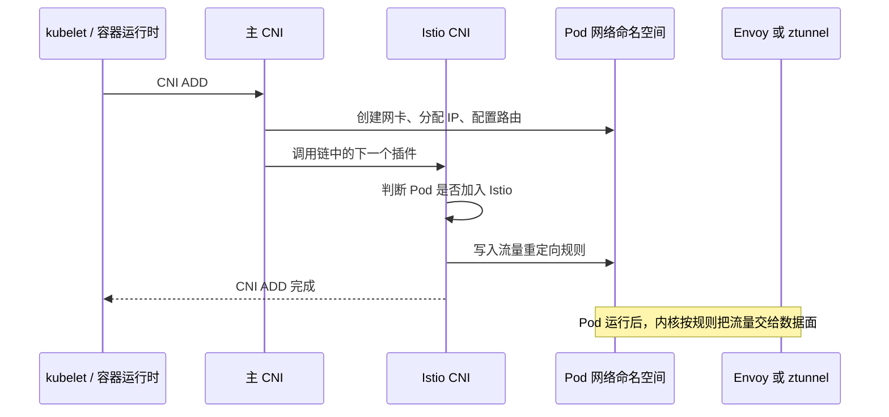
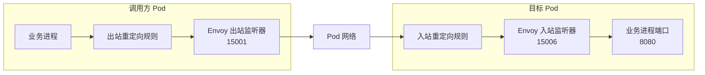
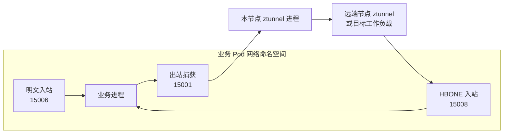
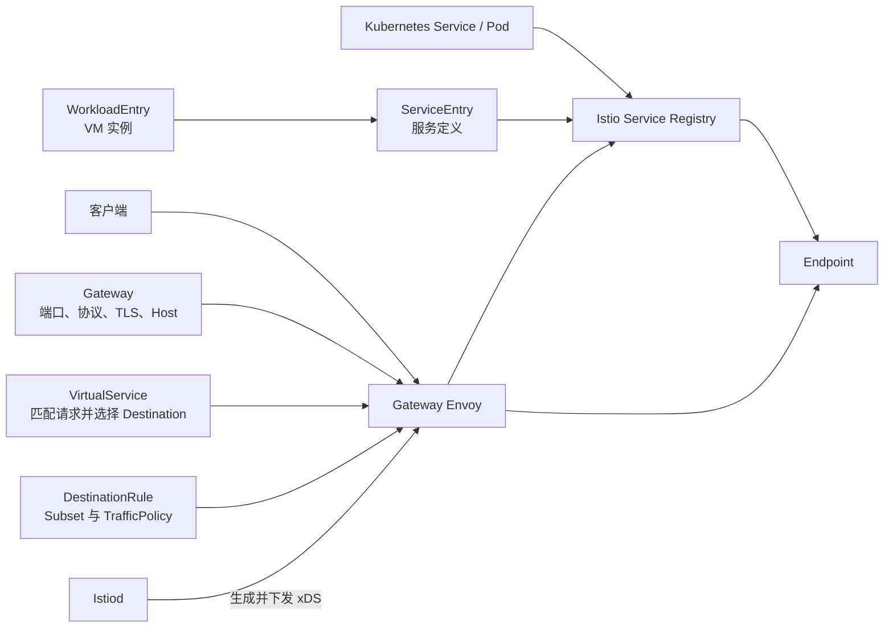

Istio 的流量管理并不是直接操作 IP 地址，而是先用一组抽象描述“有哪些服务和实例”，再描述“请求应该去哪里、到达目标后应该怎样通信”。

根据 Istio 官方的[流量管理概念](https://istio.io/latest/zh/docs/concepts/traffic-management/)及其关联的 API 和架构文档，可以把这些抽象分成三层：

```text
运行时模型：Service → Subset → Endpoint / Workload
配置模型：ServiceEntry、VirtualService、DestinationRule、Gateway、Sidecar
执行模型：Istiod → Envoy / ztunnel → 实际流量
```

本文先建立 Service、Workload、Endpoint、Subset 和 Destination 这些基础概念，再介绍五个核心流量管理资源，最后沿着一次请求把它们串起来。

<!-- more -->

## 1. 总览：Istio 在描述什么

假设 `reviews` 服务有三个实例：

```text
reviews.default.svc.cluster.local
├── reviews-v1-pod-1：10.0.1.11:9080
├── reviews-v1-pod-2：10.0.1.12:9080
└── reviews-v2-pod-1：10.0.2.21:9080
```

我们希望实现以下规则：

1. 普通用户访问 `reviews` 时进入 v1。
2. 用户 `jason` 的请求进入 v2。
3. 访问 v1 时采用最少请求负载均衡。
4. 访问 v2 时采用轮询负载均衡。

这个需求包含两个不同的问题：

```text
问题 1：这次请求应该选择 v1 还是 v2？
回答：VirtualService

问题 2：选择 v1 或 v2 后，应该怎样从多个实例中选择一个？
回答：DestinationRule
```

在理解这两个资源之前，需要先理解 Istio 的运行时模型。

## 2. Istio 的基础运行时抽象

### 2.1 Service：一个可以被访问的逻辑服务

Service 是绑定到服务注册中心中唯一名称的一组应用行为，例如：

```text
reviews.default.svc.cluster.local
```

一个 Service 后面可以有多个实际工作负载实例。客户端只访问 Service 名称，不需要知道后面有哪些 Pod、VM 或具体 IP。

Istio 中的 Service 不完全等于 Kubernetes Service。Istio 的服务注册中心可以同时包含：

1. Kubernetes Service 自动发现的服务。
2. Consul 等其他平台服务注册中心中的服务。
3. 通过 `ServiceEntry` 手动添加的服务。

因此，更准确的关系是：

```text
Kubernetes Service ─┐
Consul Service ─────┼─→ Istio Service Registry ─→ Istio Service
ServiceEntry ───────┘
```

### 2.2 Workload：真正运行应用程序的实例

Workload 是真正运行应用程序的计算实例，例如：

1. Kubernetes Pod。
2. 虚拟机中的应用进程。
3. 裸机中的应用进程。

Service 是逻辑服务，Workload 是实现这个服务的真实实例。

```text
Service：reviews
    ↓ 由以下 Workload 提供能力
Workload：reviews-v1-pod-1
Workload：reviews-v1-pod-2
Workload：reviews-v2-pod-1
```

### 2.3 Endpoint：Workload 的网络地址

Endpoint 是 Workload 对外提供服务的网络地址，通常可以理解为：

```text
Endpoint = IP + Port
```

例如：

```text
10.0.1.11:9080
10.0.1.12:9080
10.0.2.21:9080
```

Service、Workload 和 Endpoint 的关系是：

```text
Service：客户端访问的逻辑名称
    ↓
Workload：实际运行应用程序的实例
    ↓
Endpoint：代理最终连接的网络地址
```

Pod 和 Endpoint 不能完全画等号。一个 Pod 是运行实体，而 Endpoint 是代理访问这个运行实体时使用的地址和端口。

### 2.4 Subset：Service 内部的一组实例

Subset 是一个 Service 内部具有相同 Label 的 Endpoint 集合，通常用来表示不同版本：

```yaml
subsets:
  - name: v1
    labels:
      version: v1

  - name: v2
    labels:
      version: v2
```

这会形成下面的逻辑分组：

```text
reviews Service
├── subset v1
│   ├── Pod(version=v1)
│   └── Pod(version=v1)
└── subset v2
    └── Pod(version=v2)
```

Subset 在 `DestinationRule` 中定义，在 `VirtualService` 中引用。它不是一个独立的 Kubernetes CRD。

### 2.5 Host、Source 与 Destination

#### 2.5.1 Host

Host 是客户端尝试访问服务时使用的地址，例如：

```text
reviews.default.svc.cluster.local
api.example.com
```

`VirtualService.spec.hosts` 表示路由规则针对哪些客户端访问地址。

#### 2.5.2 Source

Source 是发起调用的下游客户端。路由规则不仅可以匹配目标 Host，也可以根据来源工作负载、命名空间等上下文选择不同规则。

#### 2.5.3 Destination

Destination 是路由规则匹配后选出的目标：

```yaml
destination:
  host: reviews.default.svc.cluster.local
  subset: v2
  port:
    number: 9080
```

可以把它概括为：

```text
Destination = Service Host + Subset + Port
```

这里的 `Destination` 是 `VirtualService` 中的嵌套结构，不是独立 CRD。它的 `host` 必须能够在 Istio 服务注册中心中找到，否则 Envoy 无法解析出实际 Endpoint。

## 3. 五个核心流量管理资源

Istio 官方流量管理概念页明确列出了五个主要资源：

```text
VirtualService
DestinationRule
Gateway
ServiceEntry
Sidecar
```

### 3.1 VirtualService：请求应该去哪里

`VirtualService` 描述请求的匹配和路由规则，回答的是：

> 什么样的请求，应该被发送到哪个 Destination？

例如：

```yaml
apiVersion: networking.istio.io/v1
kind: VirtualService
metadata:
  name: reviews
spec:
  hosts:
    - reviews.default.svc.cluster.local
  http:
    # jason 用户进入 v2
    - match:
        - headers:
            end-user:
              exact: jason
      route:
        - destination:
            host: reviews.default.svc.cluster.local
            subset: v2

    # 其他请求默认进入 v1
    - route:
        - destination:
            host: reviews.default.svc.cluster.local
            subset: v1
```

执行过程是：

```text
请求 Host=reviews
        ↓
按照声明顺序检查 http 路由规则
        ↓
end-user=jason？
├── 是 → reviews/v2
└── 否 → reviews/v1
```

VirtualService 中常见的内部抽象包括：

| 抽象 | 作用 |
| --- | --- |
| `hosts` | 声明规则针对哪些客户端访问地址 |
| `http`、`tcp`、`tls` | 按协议声明路由规则 |
| `match` | 匹配 URI、Header、端口、来源或 SNI |
| `destination` | 指定目标 Service、Subset 和端口 |
| `weight` | 按百分比分配流量 |
| `timeout`、`retries` | 设置超时和重试 |
| `fault` | 注入延迟或错误 |
| `mirror` | 将请求复制到另一个目标 |

路由规则按照从上到下的顺序检查，第一条匹配规则生效。因此通常要把更具体的规则放在前面，并在最后提供一条默认规则。

详细字段可以查看官方的 [VirtualService API](https://istio.io/latest/zh/docs/reference/config/networking/virtual-service/)。

### 3.2 DestinationRule：到达目标后应该怎样通信

`DestinationRule` 在 VirtualService 选定目标以后生效，回答的是：

> 已经决定访问这个 Service 或 Subset 后，Envoy 应该怎样与它通信？

```yaml
apiVersion: networking.istio.io/v1
kind: DestinationRule
metadata:
  name: reviews
spec:
  host: reviews.default.svc.cluster.local

  # 整个 reviews 服务的默认策略
  trafficPolicy:
    loadBalancer:
      simple: LEAST_REQUEST

  subsets:
    - name: v1
      labels:
        version: v1

    - name: v2
      labels:
        version: v2
      trafficPolicy:
        loadBalancer:
          simple: ROUND_ROBIN
```

DestinationRule 包含两个最重要的内部抽象。

#### 3.2.1 Subset

Subset 使用 Label 将一个 Service 的 Endpoint 分组：

```text
subset v1 → version=v1 的 Endpoint
subset v2 → version=v2 的 Endpoint
```

只有 VirtualService 将流量显式路由到某个 Subset 时，该 Subset 的专属策略才会生效。

#### 3.2.2 TrafficPolicy

TrafficPolicy 描述访问目标时使用的连接策略，主要包括：

1. 负载均衡算法。
2. 连接池大小。
3. 异常实例检测和驱逐。
4. 熔断设置。
5. 客户端 TLS 设置。
6. 地域负载均衡和故障转移。
7. 端口级策略。

因此，VirtualService 与 DestinationRule 的区别可以概括为：

```text
VirtualService：选择哪个目标
DestinationRule：怎样访问这个目标
```

详细字段可以查看官方的 [DestinationRule API](https://istio.io/latest/zh/docs/reference/config/networking/destination-rule/)。

### 3.3 Gateway：哪些边界流量可以进入或离开网格

`Gateway` 描述网格边缘代理监听的端口、协议、Host 和 TLS 配置，主要负责 L4 到 L6：

```yaml
apiVersion: networking.istio.io/v1
kind: Gateway
metadata:
  name: bookinfo-gateway
spec:
  # 将这份配置应用到带有该 Label 的 Gateway Proxy
  selector:
    istio: ingressgateway
  servers:
    - port:
        number: 443
        name: https
        protocol: HTTPS
      hosts:
        - bookinfo.example.com
      tls:
        mode: SIMPLE
        credentialName: bookinfo-cert
```

它回答的是：

> 哪个 Gateway Proxy，在什么端口，以什么协议接收哪些 Host 的流量？

但是 Gateway 不决定 `/reviews` 应该被转发到哪个业务服务。应用层路由仍由 VirtualService 提供：

```yaml
apiVersion: networking.istio.io/v1
kind: VirtualService
metadata:
  name: bookinfo
spec:
  hosts:
    - bookinfo.example.com
  gateways:
    - bookinfo-gateway
  http:
    - match:
        - uri:
            prefix: /reviews
      route:
        - destination:
            host: reviews.default.svc.cluster.local
```

二者的分工是：

```text
Gateway
负责端口、协议、TLS、SNI 和 Host
        ↓ 绑定
VirtualService
负责 URI、Header、权重和目标服务
```

需要特别区分：

```text
Gateway 资源：描述网关代理应该如何监听
Gateway Proxy：真正接收和转发流量的 Envoy 实例
```

创建 Gateway 资源本身并不等于创建了一套 Gateway Proxy Deployment。官方 API 将 Gateway 定义为作用于网格边缘负载均衡器的配置，详细内容参见 [Gateway API](https://istio.io/latest/zh/docs/reference/config/networking/gateway/)。

### 3.4 ServiceEntry：让 Istio 认识一个服务

`ServiceEntry` 向 Istio 服务注册中心添加平台无法自动发现的服务，回答的是：

> 这个服务叫什么、暴露什么端口、位于哪里，以及如何得到它的 Endpoint？

例如，将外部 HTTPS API 注册到 Istio：

```yaml
apiVersion: networking.istio.io/v1
kind: ServiceEntry
metadata:
  name: external-api
spec:
  hosts:
    - api.example.com
  location: MESH_EXTERNAL
  ports:
    - number: 443
      name: https
      protocol: HTTPS
  resolution: DNS
```

ServiceEntry 主要包含：

| 字段 | 作用 |
| --- | --- |
| `hosts` | 服务名称 |
| `addresses` | 服务的虚拟 IP 或 CIDR |
| `ports` | 服务端口和协议 |
| `location` | 服务在网格内部还是外部 |
| `resolution` | 使用 DNS、静态地址还是原始目标地址解析 Endpoint |
| `endpoints` | 直接声明静态 Endpoint |
| `workloadSelector` | 按 Label 选择 Pod 或 WorkloadEntry |

注册以后，VirtualService 和 DestinationRule 就能像引用普通 Kubernetes Service 一样引用它：

```text
ServiceEntry
    ↓ 添加服务和 Endpoint
Istio Service Registry
    ↓
VirtualService / DestinationRule 可以引用该 Host
```

ServiceEntry 不是入口网关。“Entry”表示向服务注册中心增加一条服务记录，而不是表示流量入口。更多内容参见 [ServiceEntry API](https://istio.io/latest/zh/docs/reference/config/networking/service-entry/)。

### 3.5 Sidecar：配置哪些入站流量和出站服务

这里的 `Sidecar` 是 Istio CRD，不是 Pod 中的 Envoy Sidecar 容器：

```text
Envoy Sidecar：运行在数据平面的代理进程，真正处理流量
Sidecar CRD：告诉 istiod 应该为哪些 Envoy 生成什么范围的配置
```

Sidecar CRD 回答三个问题：

1. `workloadSelector`：这份配置应用到哪些工作负载的 Envoy？
2. `ingress`：这些 Envoy 接受哪些入站端口，处理后交给应用的哪个地址？
3. `egress`：这些 Envoy 需要获得哪些出站服务的配置？

#### 3.5.1 完整示例

假设 `default` Namespace 中有下面两个服务：

```text
user-service:80
└── user Pod：10.0.1.11:8080，Label 为 app=user

order-service:80
└── order Pod：10.0.3.13:8080
```

只给 `user Pod` 使用下面的 Sidecar 配置：

```yaml
apiVersion: networking.istio.io/v1
kind: Sidecar
metadata:
  name: user-sidecar-config
  namespace: default
spec:
  # 选择这份 Sidecar CRD 应用到哪些 Pod 的 Envoy。
  # 它选择的是代理配置的使用者，不是在选择流量来源。
  workloadSelector:
    labels:
      app: user

  ingress:
    - port:
        # 这是 Pod 中应用实际接收流量的端口，而不是 Service.port。
        number: 8080
        name: http-user
        protocol: HTTP
      # 使用 iptables 透明捕获入站流量。
      captureMode: IPTABLES
      # Envoy 处理完请求后，将流量转给本 Pod 的应用端口。
      defaultEndpoint: 127.0.0.1:8080

  egress:
    - hosts:
        # 导入当前 Namespace 中所有服务的出站配置。
        - "./*"
        # Sidecar 还需要连接 istiod 等系统服务。
        - "istio-system/*"

  # 未被服务注册信息和出站配置匹配的目标如何处理。
  # ALLOW_ANY 是默认值：作为未知 TCP 流量直接转发。
  outboundTrafficPolicy:
    mode: ALLOW_ANY
```

`workloadSelector` 先决定这份 CRD 是否应用于 `user Pod`。如果省略它，该 Sidecar CRD 应用于同一 Namespace 中的所有工作负载；如果工作负载没有匹配到带 Selector 的配置，则可能使用 Namespace 默认配置或 Mesh 根 Namespace 的默认配置。

#### 3.5.2 入站流量如何被识别

先区分两个问题：

1. **谁使用这份入站配置**：由 `workloadSelector.labels` 匹配 Pod Label 决定。
2. **某个连接是不是入站流量、原来要访问哪个端口**：由 Pod 网络命名空间中的流量捕获规则和连接的原始目标决定。

Sidecar 注入时，`istio-init` 或 Istio CNI 会为 Pod 设置流量捕获规则。进入 Pod 网络命名空间的连接会经过 iptables 的入站链，本地应用发起的连接会经过出站链，因此捕获层能够区分方向：

```text
进入 Pod 的连接
    ↓ iptables PREROUTING：入站
Envoy 15006（virtualInbound）

应用发起的连接
    ↓ iptables OUTPUT：出站
Envoy 15001（virtualOutbound）
```

以 Gateway 向 `user Pod` 发送请求为例：

```text
原始连接目标：10.0.1.11:8080
        ↓ 到达 user Pod 网络命名空间
iptables 将连接重定向到 Envoy 的 15006
        ↓ 原始目标仍可恢复为 10.0.1.11:8080
virtualInbound 根据原始目标端口匹配 ingress.port.number=8080
        ↓ 根据端口声明和协议探测按 HTTP 处理
校验 mTLS、执行入站 AuthorizationPolicy 和遥测
        ↓ defaultEndpoint
user 应用：127.0.0.1:8080
```

所以 Envoy 不是通过“请求来自 Gateway”来判断这是入站请求，也不是查看 HTTP Host 才知道应用端口。识别顺序是：

```text
网络方向
    ↓
原始目标 IP:Port
    ↓
Listener / Filter Chain
    ↓
协议和安全策略
    ↓
应用 Endpoint
```

`ingress` 中几个字段的含义是：

| 字段 | 回答的问题 |
| --- | --- |
| `port.number` | 原始目标为哪个应用端口时匹配该入站 Listener？ |
| `port.protocol` | Envoy 按 HTTP、TCP、TLS 等哪种协议生成处理链？ |
| `bind` | Listener 绑定在哪个地址？省略时由 istiod 根据工作负载和服务推导 |
| `captureMode` | 流量由 iptables 捕获，还是由应用显式连接 Envoy？ |
| `defaultEndpoint` | Envoy 处理完成后把连接交给本地应用的哪个地址？ |

如果不写 `Sidecar.ingress`，不代表没有入站配置。istiod 会根据 Pod、Service、Service 端口和 `targetPort` 自动生成入站 Listener。大多数普通 Kubernetes 工作负载都依赖这种自动生成方式，只有需要修改监听端口、绑定地址或应用转发地址时才显式配置 `ingress`。

还要区分 `Sidecar.ingress` 与安全资源的职责：`ingress` 决定监听和转发结构；`PeerAuthentication` 决定入站是否接受明文或 Istio mTLS；`AuthorizationPolicy` 决定通过身份和请求属性后是否允许访问。

#### 3.5.3 出站配置如何生成

假设 `user` 应用请求：

```text
http://order-service.default.svc.cluster.local/orders/42
```

生成 Envoy 出站配置时，istiod 会组合多类输入：

```text
Service / ServiceEntry
    → 有哪些逻辑服务、Service IP、端口和协议

EndpointSlice / WorkloadEntry
    → 每个服务有哪些真实 Endpoint

VirtualService
    → Host、Path 等请求应该路由到哪个 Destination

DestinationRule
    → Subset、负载均衡、连接池和 TLS 策略

Sidecar.egress.hosts
    → 上述哪些服务及相关配置需要下发给当前 Envoy
```

istiod 将筛选后的结果转换成 Envoy 配置：

```text
LDS：出站 Listener，例如 15001 和 HTTP 80
RDS：order-service 的 Host、Path 和 Route
CDS：outbound|80||order-service.default.svc.cluster.local
EDS：10.0.3.13:8080 等真实 Endpoint
```

如果没有显式设置 `Sidecar.egress`，Istio 默认会为 Sidecar 配置可访问网格内所有工作负载所需的信息。显式设置 `egress.hosts` 的主要目的，是限制当前 Envoy 导入的服务和相关 VirtualService、DestinationRule、ServiceEntry 配置，减少 istiod 的计算量、xDS 下发量和 Envoy 内存占用。

`hosts` 的格式是 `namespace/dnsName`：

| 配置 | 含义 |
| --- | --- |
| `./*` | 当前 Sidecar 所在 Namespace 的全部服务 |
| `istio-system/*` | `istio-system` 中的全部服务 |
| `payments/payment-service.payments.svc.cluster.local` | `payments` Namespace 中的指定服务 |
| `*/*` | 当前工作负载可见的全部 Mesh 服务 |
| `~/*` | 不导入任何出站服务配置，适合完全没有出站调用的工作负载 |

`egress.port` 可以省略，此时 istiod 根据导入服务的端口生成 Listener。也可以显式限定一个端口：

```yaml
egress:
  - port:
      number: 80
      name: http-out
      protocol: HTTP
    hosts:
      # 只在这个出站 Listener 中导入当前 Namespace 的服务。
      - "./*"
```

#### 3.5.4 一次出站请求如何匹配配置

当 `user` 应用请求 `order-service:80` 时，完整过程是：

```text
1. DNS 将 order-service 解析为 Service ClusterIP，例如 10.96.30.20。

2. 应用连接 10.96.30.20:80。

3. iptables OUTPUT 将连接重定向到 Envoy 15001，
   Envoy 可以取得原始目标 10.96.30.20:80。

4. virtualOutbound 根据原始目标端口选择出站 Listener。

5. 对 HTTP 请求，Route 再根据 Host、Path 等信息进行匹配，
   选中 Cluster：
   outbound|80||order-service.default.svc.cluster.local。

6. Envoy 从该 Cluster 的 EDS Endpoint 中选择 10.0.3.13:8080。

7. DestinationRule 或 Auto mTLS 决定到目标 Sidecar 使用明文还是 mTLS，
   然后 Envoy 建立真正的上游连接。
```

这里也要区分 Sidecar CRD 与其他出站资源：

```text
Sidecar.egress：决定当前 Envoy 知道哪些服务和配置
VirtualService：决定请求路由到哪个目标
DestinationRule：决定怎样连接这个目标
Service / EndpointSlice：提供服务地址和真实 Endpoint
```

限制 `Sidecar.egress.hosts` 主要是配置裁剪，不等于可靠的网络访问控制。默认 `ALLOW_ANY` 会让未匹配目标进入 Passthrough；`REGISTRY_ONLY` 可以让未注册目标失败，但官方也明确说明它不是出站防火墙。真正限制出站访问还需要结合 Egress Gateway、施加在出口边界上的 AuthorizationPolicy 或 Kubernetes NetworkPolicy。

可以查看 Sidecar Envoy 最终获得的配置，验证上述转换结果：

```bash
istioctl proxy-config listeners <user-pod>
istioctl proxy-config routes <user-pod>
istioctl proxy-config clusters <user-pod>
istioctl proxy-config endpoints <user-pod>
```

因此，Sidecar CRD 的完整作用不是简单的“限制配置大小”，而是：先选择一组工作负载，再描述它们的入站代理边界，并限定 istiod 为其生成哪些出站服务配置。更多内容参见 [Sidecar API](https://istio.io/latest/zh/docs/reference/config/networking/sidecar/) 和 [调试 Envoy 配置](https://istio.io/latest/zh/docs/ops/diagnostic-tools/proxy-cmd/)。

## 4. 非 Kubernetes 工作负载相关资源

ServiceEntry 的官方文档继续引出了 `WorkloadEntry` 和 `WorkloadGroup`。它们不是日常 Kubernetes 流量路由必须使用的资源，而是将 VM、裸机等非 Kubernetes 工作负载加入网格时的重要抽象。

### 4.1 WorkloadEntry：描述一个非 Kubernetes 工作负载

`WorkloadEntry` 描述一个 VM 或裸机工作负载实例：

```yaml
apiVersion: networking.istio.io/v1
kind: WorkloadEntry
metadata:
  name: details-vm-1
spec:
  address: 10.0.2.20
  serviceAccount: details
  labels:
    app: details
    version: v1
  network: network-1
  locality: cn-east-1/zone-a
```

它可以保存：

1. 工作负载地址和端口。
2. 用于服务选择和版本分组的 Label。
3. 工作负载使用的 ServiceAccount。
4. 所属网络和地域。
5. 负载均衡权重。

可以把它理解为 Istio 对“一个非 Kubernetes Pod”的描述。不过 WorkloadEntry 只描述实例，不定义服务名称和服务端口，因此必须由 ServiceEntry 选择：

```yaml
apiVersion: networking.istio.io/v1
kind: ServiceEntry
metadata:
  name: details
spec:
  hosts:
    - details.bookinfo.com
  location: MESH_INTERNAL
  ports:
    - number: 80
      name: http
      protocol: HTTP
      targetPort: 8080
  resolution: STATIC
  workloadSelector:
    labels:
      app: details
```

二者关系是：

```text
WorkloadEntry：描述一个 VM 实例
ServiceEntry：把符合 Label 的 VM 实例组织成一个 Service
```

详细内容参见 [WorkloadEntry API](https://istio.io/latest/zh/docs/reference/config/networking/workload-entry/)。

### 4.2 WorkloadGroup：一组 VM 工作负载的模板

`WorkloadGroup` 是一组非 Kubernetes 工作负载的启动模板，其关系类似于 Kubernetes 的 Deployment 和 Pod：

```text
Kubernetes：Deployment → Pod
Istio VM：  WorkloadGroup → WorkloadEntry
```

例如：

```yaml
apiVersion: networking.istio.io/v1
kind: WorkloadGroup
metadata:
  name: reviews
  namespace: bookinfo
spec:
  metadata:
    labels:
      app: reviews
      version: v1
  template:
    ports:
      http: 8080
    serviceAccount: reviews
  probe:
    httpGet:
      path: /health
      port: 8080
```

WorkloadGroup 主要保存：

1. WorkloadEntry 的公共模板。
2. 公共 Label 和 Annotation。
3. ServiceAccount 和服务端口。
4. Envoy 代理启动所需的信息。
5. 工作负载健康检查。

WorkloadGroup 不负责把这些实例注册为什么 Service，也不定义服务 Host。服务注册仍由 ServiceEntry 完成。[WorkloadGroup API](https://istio.io/latest/zh/docs/reference/config/networking/workload-group/)

### 4.3 WorkloadSelector：使用 Label 关联资源

`WorkloadSelector` 不是独立 CRD，而是多个资源共享的嵌套结构，用于选择特定工作负载：

```yaml
workloadSelector:
  labels:
    app: reviews
```

它在不同资源中的含义略有差异：

| 所在资源 | 作用 |
| --- | --- |
| `ServiceEntry` | 选择哪些 Pod 或 WorkloadEntry 作为服务 Endpoint |
| `Sidecar` | 选择 Sidecar 配置应用到哪些工作负载 |
| `DestinationRule` | 选择哪些客户端工作负载应用该目标策略 |

因此，看到 WorkloadSelector 时要先问：它正在选择服务端实例、客户端代理，还是配置的作用对象？

## 5. 控制面和数据面如何使用这些抽象

在理解控制面如何下发配置之前，还要补上一个更底层的问题：业务流量为什么会进入 Envoy 或 ztunnel？应用没有把代理地址写进代码，Service 也没有把代理配置为 Endpoint，真正把流量送进数据面的，是节点上的流量重定向规则。

### 5.1 `istio-cni-node` 是什么

安装 Istio CNI 后，每个 Kubernetes 节点上都会运行一个 `istio-cni-node` Pod：

```yaml
apiVersion: apps/v1
kind: DaemonSet
metadata:
  name: istio-cni-node
  namespace: istio-system
spec:
  selector:
    matchLabels:
      k8s-app: istio-cni-node
  template:
    metadata:
      labels:
        k8s-app: istio-cni-node
    spec:
      # 实际安装清单还包含 hostPath、权限和容器参数，此处只展示结构。
      containers:
        - name: install-cni
          image: docker.io/istio/install-cni:<version>
```

它是一个 DaemonSet，所以每个需要运行网格工作负载的节点上都有一个实例。它有两个主要职责：

1. 把 Istio CNI 插件和配置安装到节点的 CNI 目录中，使它成为主 CNI 后面的链式插件。
2. 在 Pod 加入网格时，进入 Pod 的网络命名空间，建立把流量送往 Sidecar 或 ztunnel 的重定向规则。

`istio-cni-node` 不是数据面代理，不会亲自转发每一个业务请求。它更像“布线工”：Pod 创建时完成布线，请求运行时由内核规则把数据包送给 Envoy 或 ztunnel。

Istio CNI 也不是 Calico、Cilium 等主 CNI 的替代品。两者的分工是：

| 组件 | 职责 |
| --- | --- |
| 主 CNI | 创建 Pod 网卡、分配 IP、连接容器网络 |
| Istio CNI | 在已有网络的基础上，增加 Istio 流量重定向 |
| Sidecar Envoy / ztunnel | 真正接收、处理并转发业务流量 |

### 5.2 Pod 创建时如何建立重定向



关键点是先由主 CNI 把 Pod 网络建好，再由 Istio CNI 增加规则。这样不需要在每个业务 Pod 中运行拥有高权限的 `istio-init` 初始化容器。

在 Sidecar 模式中，Istio CNI 是可选的；未启用时通常由 `istio-init` 在 Pod 启动前配置重定向。在 Ambient 模式中，Istio CNI 是必需组件，因为业务 Pod 内没有 Sidecar 或 `istio-init`，节点必须负责把流量导向 ztunnel。[Istio CNI](https://istio.io/latest/zh/docs/setup/additional-setup/cni/)

### 5.3 Sidecar 模式如何重定向

Sidecar Envoy 和业务容器共享同一个 Pod 网络命名空间，因此可以通过本命名空间内的规则接管流量。



以 `user-service → order-service:8080` 为例：

1. `user-service` 仍然连接 `order-service:8080`，应用不感知代理。
2. 调用方 Pod 中的出站规则把连接重定向到 Envoy 的 `15001`。
3. Envoy 读取连接的原始目标地址，再使用 Istiod 下发的 Cluster、Endpoint 和策略选择上游。
4. 数据包到达目标 Pod 后，入站规则把它重定向到目标 Envoy 的 `15006`。
5. 目标 Envoy 完成 mTLS、授权和遥测处理，再转发到业务进程的 `8080`。

规则还必须排除 Envoy 自己发出的流量，或使用数据包标记避免同一数据包再次被捕获，否则会形成“Envoy 发出流量 → 又被重定向回 Envoy”的循环。需要绕过网格的端口和 IP 段，也可以通过 Pod 注解配置 include/exclude 范围。

### 5.4 Ambient 模式如何重定向

Ambient 模式没有 Pod 内 Sidecar。`istio-cni-node` 会为加入 Ambient 的 Pod 建立重定向，并与同一节点的 ztunnel 协作。



这里容易误解的一点是：图中的监听端口位于业务 Pod 的网络命名空间中，但监听和处理它们的仍然是节点上的 ztunnel 进程，并不是业务 Pod 里又启动了一个 ztunnel。

建立过程如下：

1. Istio CNI 发现 Pod 所在命名空间或 Pod 标签要求加入 Ambient。
2. 节点代理进入该 Pod 的网络命名空间并建立重定向规则。
3. 节点代理通过 Unix Domain Socket 把 Pod 网络命名空间的文件描述符交给本节点 ztunnel。
4. ztunnel 在这个网络命名空间中创建逻辑监听器：`15001` 接收出站、`15006` 接收明文入站、`15008` 接收 HBONE 入站。
5. 请求运行时，规则把流量导向这些监听器；ztunnel 根据原始目标、工作负载身份和服务信息建立 HBONE 或普通连接。

同一节点仍然只有一个 ztunnel 进程，它可以在多个业务 Pod 的网络命名空间中持有监听 Socket。Istio 用数据包标记和路由规则区分“尚未捕获”和“已经由 ztunnel 处理”的流量，避免重复重定向。[Ambient 流量重定向](https://istio.io/latest/zh/docs/ambient/architecture/traffic-redirection/)

### 5.5 两种模式的区别

| 项目 | Sidecar 模式 | Ambient 模式 |
| --- | --- | --- |
| 数据面进程 | 每个 Pod 一个 Envoy | 每个节点一个 ztunnel，七层流量可再经过 Waypoint |
| 规则把流量导向 | 本 Pod 内的 Envoy | 节点 ztunnel 在 Pod 网络命名空间中的监听 Socket |
| 常见监听端口 | 出站 `15001`、入站 `15006` | 出站 `15001`、明文入站 `15006`、HBONE 入站 `15008` |
| Istio CNI | 可选，可替代 `istio-init` | 必需 |
| 七层处理 | Sidecar Envoy | Waypoint Envoy，而不是 ztunnel |

因此，`istio-cni-node` 解决的是“如何让流量先进入数据面”，VirtualService、DestinationRule、AuthorizationPolicy 等解决的是“进入数据面后如何处理”。

### 5.6 如何确认 CNI 是否正常工作

```bash
# 每个节点是否都有 istio-cni-node
kubectl get daemonset,pod -n istio-system -l k8s-app=istio-cni-node -o wide

# 查看节点代理日志
kubectl logs -n istio-system daemonset/istio-cni-node -c install-cni

# 确认 Pod 是否注入 Sidecar，或是否带有 Ambient 标签
kubectl get pod <pod-name> -n <namespace> -o yaml

# Sidecar 模式下确认 Envoy 是否拥有入站、出站监听器
istioctl proxy-config listeners <pod-name>.<namespace>
```

如果 Pod 已加入网格但请求完全没有进入代理，应先检查 CNI 安装、节点上的 `istio-cni-node`、Pod 标签/注解以及重定向规则，而不是先检查 VirtualService。官方也提供了专门的 [Istio CNI 排障说明](https://istio.io/latest/docs/ops/diagnostic-tools/cni/)。

### 5.7 控制面与数据面的分工

Istio 在运行时分为控制面和数据面：

```text
控制面：Istiod
数据面：Sidecar / Gateway / Waypoint 中的 Envoy，以及 Ambient 的 ztunnel
```

Istiod 负责：

1. 从 Kubernetes、ServiceEntry 等来源发现 Service 和 Endpoint。
2. 读取 VirtualService、DestinationRule、Gateway 和 Sidecar 等配置。
3. 检查这些资源之间的引用关系。
4. 将高级配置转换成数据面能够理解的配置。
5. 将配置动态下发给相关 Envoy 和 ztunnel。

数据面负责：

1. 接收真正的网络流量。
2. Envoy 按照七层路由规则匹配请求，ztunnel 按四层目标和身份转发连接。
3. 根据自身职责选择 Service、Subset、Endpoint 或目标工作负载。
4. 执行相应的负载均衡、安全策略和遥测处理。
5. 将请求转发给最终 Workload。

Sidecar、Gateway 和 Waypoint 的数据面代理是 Envoy；Ambient 四层数据面则是 ztunnel。Istiod 负责服务发现和配置分发，不位于业务请求路径中。[Istio 架构](https://istio.io/latest/zh/docs/ops/deployment/architecture/)

## 6. 一次请求如何经过这些抽象

假设用户访问：

```text
https://bookinfo.example.com/reviews
```

配置关系如下：



实际处理步骤如下。

### 6.1 Gateway 接受连接

Gateway Envoy 根据 Gateway 配置判断：

```text
443 端口是否监听？
协议是否为 HTTPS？
证书是什么？
Host bookinfo.example.com 是否允许？
```

### 6.2 VirtualService 匹配请求

VirtualService 检查：

```text
Host = bookinfo.example.com
URI 以 /reviews 开头
Header 中是否存在特定用户
```

然后得到一个 Destination：

```text
host   = reviews.default.svc.cluster.local
subset = v2
port   = 9080
```

### 6.3 DestinationRule 解析 Subset 和策略

DestinationRule 将 `subset=v2` 解释成：

```text
选择 version=v2 的 Endpoint
```

同时得到访问策略：

```text
负载均衡 = ROUND_ROBIN
TLS       = ISTIO_MUTUAL
连接池    = 指定上限
异常检测  = 连续失败后临时驱逐
```

### 6.4 服务注册中心提供 Endpoint

Istio 根据 Destination 的 Host 查找服务：

```text
reviews.default.svc.cluster.local
    ↓
找到 version=v2 的候选 Endpoint
    ↓
10.0.2.21:9080
10.0.2.22:9080
```

这些 Endpoint 可以来自 Kubernetes，也可以来自 ServiceEntry 和 WorkloadEntry。

### 6.5 Envoy 转发请求

Envoy 使用 DestinationRule 指定的负载均衡和连接策略，从候选 Endpoint 中选择一个并完成请求转发。

整个过程可以缩写为：

```text
Gateway：是否接收这条边界流量
    ↓
VirtualService：请求应该去哪个 Service/Subset
    ↓
DestinationRule：怎样访问这个 Service/Subset
    ↓
Service Registry：这个 Service/Subset 有哪些 Endpoint
    ↓
Envoy：选择 Endpoint 并转发
```

## 7. 容易混淆的概念

### 7.1 VirtualService 的 hosts 与 Destination 的 host

```text
VirtualService.spec.hosts
表示客户端访问什么地址时应用这组规则

route.destination.host
表示匹配以后真正把流量发送到哪个注册服务
```

VirtualService 的 hosts 可以用于描述虚拟访问地址，但 Destination 的 host 必须能够在服务注册中心中解析。

### 7.2 Gateway 与 Gateway Proxy

```text
Gateway：配置对象
Gateway Proxy：真正运行并接收流量的 Envoy
```

Gateway 使用 Selector 将配置应用到特定 Gateway Proxy，但它本身不是代理进程。

### 7.3 Sidecar 资源与 Envoy Sidecar

```text
Sidecar CRD：配置作用范围
Envoy Sidecar：数据平面代理进程
```

### 7.4 ServiceEntry 与入口流量

ServiceEntry 的 Entry 指的是“服务注册表中的条目”，不是 Ingress Entry。入口流量由 Gateway 和 VirtualService 管理。

### 7.5 Subset 与 Endpoint

Subset 不是一个新的服务，也不产生新的 Endpoint。它只是根据 Label 从 Service 已有 Endpoint 中划分出一个逻辑集合。

## 8. 总结

Istio 流量管理的核心不是记住大量 YAML 字段，而是理解下面这条链路：

```text
Service：客户端认识的逻辑服务
Workload：真正运行应用程序的实例
Endpoint：代理最终连接的地址
Subset：Service 内按照 Label 划分的实例组
Destination：一次路由最终选定的 Host、Subset 和 Port

ServiceEntry：告诉 Istio 有什么额外服务
WorkloadEntry：描述服务包含的非 Kubernetes 实例
WorkloadGroup：提供一组 VM 实例的启动模板
VirtualService：决定请求去哪里
DestinationRule：决定怎样访问目标
Gateway：决定哪些边界流量可以进出
Sidecar：决定一个代理需要加载多大范围的配置

Istiod：把这些抽象转换成 Envoy 配置
Envoy：执行配置并转发真实流量
```

最终可以使用六个问题检查自己是否理解了一份 Istio 流量配置：

1. 请求访问的 Host 是什么？
2. 这个 Host 对应哪个 Service？
3. VirtualService 会把请求路由到哪个 Destination？
4. DestinationRule 如何定义 Subset 和访问策略？
5. 服务注册中心会为该目标提供哪些 Endpoint？
6. 这份配置最终会被 Istiod 下发到哪个 Envoy？

只要能够回答这六个问题，就能够把分散的 Istio CRD 还原成一条完整的流量处理链路。
