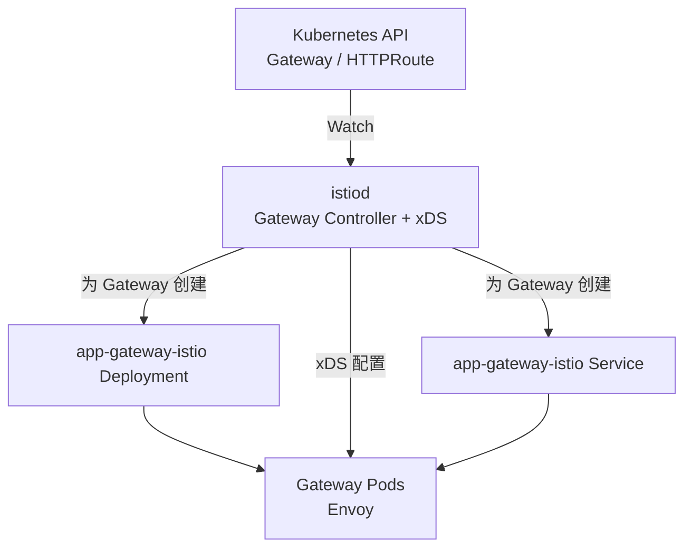
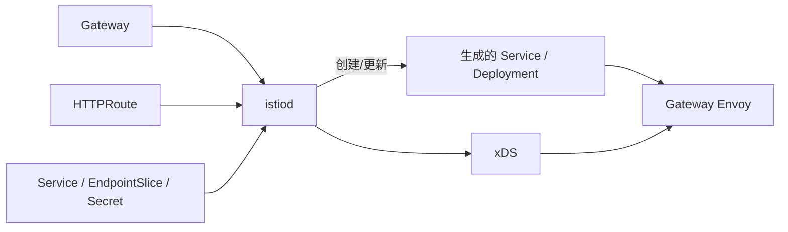
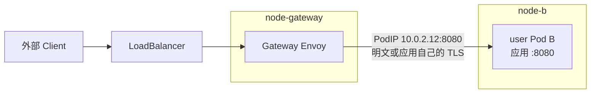
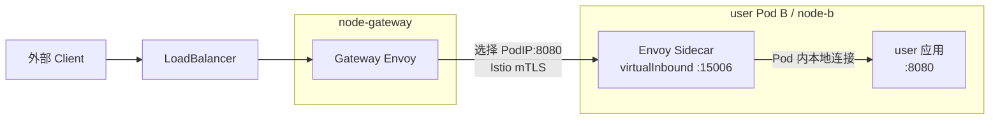
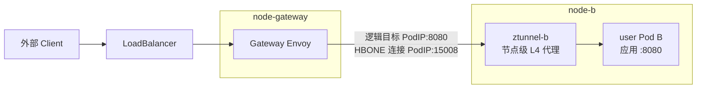
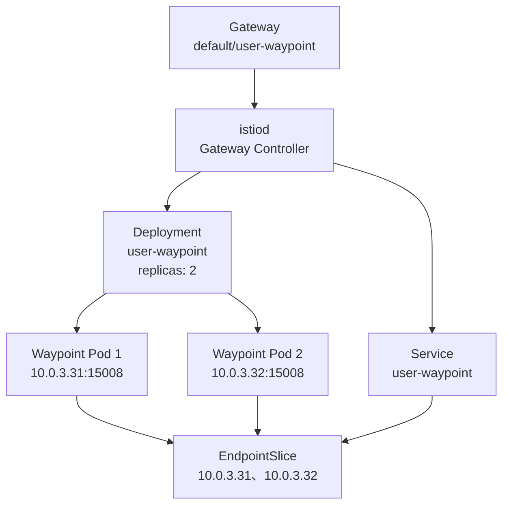
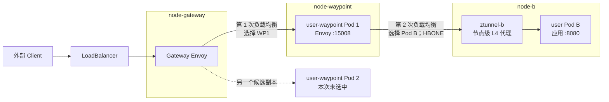

Istio 不只是入口网关。它首先是一套 Service Mesh，通过代理实现服务身份、mTLS、流量治理、授权和可观测性；Gateway API 是它处理南北流量的一种入口配置方式。

本文继续使用两个后端：

```text
user-service:80
├── user Pod A: 10.0.1.11:8080
└── user Pod B: 10.0.2.12:8080

order-service:80
└── order Pod A: 10.0.3.13:8080
```

目标是：

```text
GET api.example.com/users/*  -> user-service
GET api.example.com/orders/* -> order-service
```

## 1. Istio 安装后有哪些组件

Istio 分为控制面和数据面。控制面生成配置，数据面才处理业务请求。

### 1.1 istiod：控制面

`istiod` 以 Deployment 运行，主要负责：

- 读取 Gateway、Route、Service、EndpointSlice 和 Istio 策略；
- 将声明转换成 Envoy 的 Listener、Route、Cluster 和 Endpoint；
- 通过 xDS 向各类代理下发配置；
- 作为 CA，为工作负载签发用于 mTLS 的证书。

`istiod` 不转发业务请求。它暂时不可用时，已经获得配置的代理通常可以继续工作，但无法及时获得新配置和证书。

### 1.2 数据面组件

| 组件 | 运行形态 | 处理什么流量 |
| --- | --- | --- |
| Ingress/Egress Gateway | 独立 Deployment 中的 Envoy | Mesh 边界的南北流量 |
| Envoy Sidecar | 每个业务 Pod 内一个容器 | 该 Pod 的入站和出站流量 |
| ztunnel | 每节点 DaemonSet | Ambient 模式的 L4、身份、mTLS 和隧道 |
| Waypoint | 独立代理 Deployment | Ambient 模式按 Service、Namespace 等边界处理 L7 |
| Istio CNI | 每节点 DaemonSet | 配置流量捕获，不代理业务请求 |

Gateway Envoy、Sidecar 和 Waypoint 都基于代理处理流量，但部署位置和作用域不同。ztunnel 是面向节点的 L4 代理，不负责解析普通 HTTP 路由。

### 1.3 两种 Mesh 数据面模式

Sidecar 模式：

```text
每个业务 Pod
├── 应用容器
└── Envoy Sidecar
```

Ambient 模式：

```text
每个节点一个 ztunnel
└── 需要 L7 能力时，再部署共享的 Waypoint
```

无论业务工作负载使用哪种模式，入口 Gateway 都是独立的代理，不是业务 Pod 中的 Sidecar，也不是 ztunnel。

## 2. Istio 如何实现 Kubernetes Gateway API

安装 Gateway API CRD 和 Istio 控制面后，`istiod` 内部的 Gateway Controller 会监听 `GatewayClass`、`Gateway` 和各种 Route。这里没有另一个名为 “Istio Gateway Controller” 的 Deployment。

默认使用自动部署模式：



默认情况下，一个 `Gateway` 对应一套专属的 Service 和 Deployment：

```text
Gateway: app-gateway
├── Deployment: app-gateway-istio
│   └── Gateway Pod A/B（Envoy）
└── Service: app-gateway-istio
    └── 对外地址和 Listener 端口
```

再创建一个 `partner-gateway`，默认会再得到一套 `partner-gateway-istio` Deployment 和 Service。它们共享 `istiod` 控制面，但不共享 Gateway Envoy Pod。

如果采用手工部署模式，也可以让 Gateway 指向预先创建的 Service 和 Deployment；这时端口同步、扩缩容和生命周期由平台自行管理。

## 3. 声明 Gateway 和路由

`gatewayClassName: istio` 选择 Istio 提供的 GatewayClass，其 Controller 名称默认为 `istio.io/gateway-controller`。

```yaml
apiVersion: gateway.networking.k8s.io/v1
kind: Gateway
metadata:
  name: app-gateway
spec:
  gatewayClassName: istio
  listeners:
    - name: http
      hostname: api.example.com
      protocol: HTTP
      port: 80
      allowedRoutes:
        namespaces:
          from: Same
---
apiVersion: gateway.networking.k8s.io/v1
kind: HTTPRoute
metadata:
  name: app-route
spec:
  parentRefs:
    - name: app-gateway
      sectionName: http
  hostnames:
    - api.example.com
  rules:
    - matches:
        - path:
            type: PathPrefix
            value: /users
      backendRefs:
        - name: user-service
          port: 80
    - matches:
        - path:
            type: PathPrefix
            value: /orders
      backendRefs:
        - name: order-service
          port: 80
```

资源之间的关系是：

| 声明 | 作用 |
| --- | --- |
| `GatewayClass: istio` | 选择 istiod 中的 Gateway Controller |
| `Gateway` | 申请一套 Gateway 数据面，并声明地址、Listener、端口和 TLS |
| `HTTPRoute.parentRefs` | 将路由绑定到指定 Gateway Listener |
| `HTTPRoute.backendRefs` | 指定后端 Kubernetes Service |
| Service/EndpointSlice | 提供后端端口和 Pod IP |

## 4. Gateway 的端口如何变成真实监听

在自动部署模式中，`Gateway.listeners.port: 80` 不只是路由元数据。istiod 会根据它创建或更新 Gateway Deployment 和 Service：

```text
Gateway.listeners.port: 80
        ↓ istiod reconcile
app-gateway-istio Service:80
        ↓ selector
app-gateway-istio Gateway Pods
        ↓ xDS
Envoy Listener: HTTP :80
```

如果给 Gateway 增加 443 Listener，Istio 会相应更新自动生成的 Service 和 Deployment。这个行为与 APISIX Ingress Controller 不同：APISIX Controller 配置预先部署的数据面，不能根据 Gateway 自动打开端口。

假设生成的入口资源为：

```text
Service: app-gateway-istio
type: LoadBalancer
external IP: 203.0.113.20
port: 80
selector: gateway.networking.k8s.io/gateway-name=app-gateway
```

客户端请求的目标就是 `203.0.113.20:80`。生产环境通常让 `api.example.com` 解析到这个 LoadBalancer 地址。

## 5. 配置如何下发



istiod 完成以下工作：

1. 校验 Gateway、Listener、Route 和跨 Namespace 引用。
2. 为自动部署的 Gateway 创建 Service、Deployment 和 ServiceAccount。
3. 将 Listener 转换为 Envoy Listener，将 HTTPRoute 转换为 Route。
4. 根据 Service 和 EndpointSlice 生成 Envoy Cluster 与 Endpoint。
5. 将 TLS Secret、路由和端点通过 xDS 下发给 Gateway Envoy。
6. 更新 Gateway 和 HTTPRoute 的 `Accepted`、`Programmed` 等状态。

这些配置由 Envoy 缓存在本地。请求到来时不会访问 istiod、API Server 或 etcd。

## 6. 一次请求如何执行

假设：

```text
api.example.com                    -> 203.0.113.20
app-gateway-istio Service          -> 203.0.113.20:80
Gateway Pod                        -> 10.0.10.21:80
user-service EndpointSlice         -> 10.0.1.11:8080、10.0.2.12:8080
```

客户端执行：

```bash
curl http://api.example.com/users/42
```

请求过程如下：

```text
1. DNS
   api.example.com -> 203.0.113.20

2. Client 建立连接
   目标：203.0.113.20:80

3. LoadBalancer 和 Kubernetes Service 选择 Gateway Pod
   app-gateway-istio:80 -> Gateway Pod 10.0.10.21:80

4. Gateway Envoy 匹配 Listener 和 Route
   Host=api.example.com
   Path=/users/42

5. Gateway Envoy 执行入口策略
   TLS、JWT、AuthorizationPolicy、超时等

6. Gateway Envoy 选择直接上游
   默认选择业务 Pod：10.0.1.11:8080
   ingress-to-waypoint 模式下则先选择 Waypoint

7. Gateway Envoy 建立上游连接
   10.0.10.21 -> 10.0.1.11:8080
```

Gateway Envoy 使用 istiod 下发的 Endpoint 信息选择上游；它不是每次请求都先访问 `user-service` ClusterIP。默认情况下，这个上游是某个业务 Pod；如果显式启用了 ingress-to-waypoint，这个上游会先变成 Waypoint。下一节分别说明每种情况。

## 7. 进入业务 Pod 前还经过什么

这取决于 `user-service` 是否加入 Mesh、使用哪种数据面模式，以及入口流量是否被配置为经过 Waypoint。

先建立一个贯穿本节的例子：

```text
node-gateway
└── Gateway Pod：10.0.10.21

node-a
├── ztunnel-a
└── user Pod A：10.0.1.11:8080

node-b
├── ztunnel-b
└── user Pod B：10.0.2.12:8080

user-service ClusterIP：10.96.20.10:80
user-service EndpointSlice：
├── 10.0.1.11:8080
└── 10.0.2.12:8080
```

### 7.1 Gateway Envoy 保存的不是 EndpointSlice

Kubernetes API 中保存的是 `EndpointSlice`，istiod 监听它并转换成 Envoy 的 Cluster 和 Endpoint 配置：

```text
EndpointSlice
user-service -> 10.0.1.11:8080、10.0.2.12:8080
        ↓ istiod 转换
Cluster Discovery Service（CDS）
outbound|80||user-service.default.svc.cluster.local
        ↓
Endpoint Discovery Service（EDS）
├── 10.0.1.11:8080  HEALTHY
└── 10.0.2.12:8080  HEALTHY
        ↓ xDS
Gateway Envoy 的本地内存
```

因此，准确的说法是：

> Gateway Envoy 不保存 Kubernetes EndpointSlice 对象，而是保存 istiod 根据 Service、EndpointSlice 和 Istio 策略生成的 Envoy Cluster、Endpoint 及其元数据。

Gateway Envoy 通常掌握与选择上游有关的信息：

1. Cluster 对应的服务和端口。
2. 每个候选 Endpoint 的 IP 和端口。
3. Endpoint 是否健康及其负载均衡权重。
4. Endpoint 的 Region、Zone、SubZone 等 Locality 信息。
5. 应该使用明文、Istio mTLS 还是 HBONE 等上游传输方式。
6. DestinationRule 或其他配置生成的负载均衡策略。

可以使用下面的命令查看 Gateway Envoy 当前实际获得的 Endpoint：

```bash
istioctl proxy-config endpoint \
  <gateway-pod-name>.<gateway-namespace> \
  --cluster "outbound|80||user-service.default.svc.cluster.local"
```

输出大约是：

```text
ENDPOINT           STATUS    CLUSTER
10.0.1.11:8080     HEALTHY   outbound|80||user-service.default.svc.cluster.local
10.0.2.12:8080     HEALTHY   outbound|80||user-service.default.svc.cluster.local
```

假设没有额外的权重和地域限制，并且采用 `ROUND_ROBIN`，前一个新请求选择了 Pod A，那么下一个需要选择上游的请求可能选择：

```text
10.0.2.12:8080，也就是 user Pod B
```

实际选择还会受到连接池复用、Endpoint 健康状态、权重、Locality 和负载均衡算法影响，因此不能把 `ROUND_ROBIN` 简化成“每个 HTTP 请求必然严格轮换”。

还要注意：**选择 Pod 与选择 Node 是两件事。** Gateway Envoy 通常先选择 Pod Endpoint `10.0.2.12:8080`，然后由 Kubernetes 网络和 CNI 根据 Pod IP 将报文送到 `node-b`。它一般不需要先把 EndpointSlice 中的 `nodeName` 转换成“目标节点地址”。

### 7.2 后端未加入 Mesh

假设 Gateway Envoy 通过负载均衡选择了：

```text
user Pod B：10.0.2.12:8080
```

完整路径是：

```text
Gateway Envoy 10.0.10.21
        ↓ 目标地址 10.0.2.12:8080
Kubernetes/CNI 根据 Pod IP 将报文路由到 node-b
        ↓
user Pod B 应用容器 10.0.2.12:8080
```

对应的网络拓扑是：



这一模式下：

```text
谁选择业务 Pod：Gateway Envoy
谁选择目标 Node：Kubernetes/CNI 的 Pod 网络路由
业务 Pod 前的 Istio 代理：没有
```

因为 Gateway Envoy 直接连接 Pod IP，而不是 Service ClusterIP，所以这里通常不会再由 kube-proxy 对 `user-service` 做一次负载均衡。Istio Gateway 可以把请求转发给未注入 Sidecar、也未加入 Ambient 的普通 Kubernetes 服务。

### 7.3 Sidecar 模式

假设 istiod 为 Gateway Envoy 生成了下面的上游配置：

```text
Endpoint：10.0.2.12:8080
TLS 模式：Istio mTLS
TLS 校验：校验目标工作负载的 ServiceAccount 身份
```

Gateway Envoy 仍然通过 user-service 的 Cluster 选择 Pod B，但到达 Pod 后，入站流量会被 Pod 网络命名空间中的 Istio 流量捕获规则转交给 Sidecar：

```text
Gateway Envoy 10.0.10.21
        ↓ 选择 10.0.2.12:8080，并建立 Istio mTLS
Kubernetes/CNI 将报文路由到 node-b
        ↓
user Pod B 的入站流量捕获规则
        ↓ 重定向到 Envoy Virtual Inbound Listener，通常为 15006
user Pod B 的 Envoy Sidecar
        ↓ 终止 mTLS、执行入站 AuthorizationPolicy
user 应用容器 10.0.2.12:8080
```

对应的网络拓扑是：



这一模式下：

```text
谁选择业务 Pod：Gateway Envoy
谁选择目标 Node：Kubernetes/CNI 的 Pod 网络路由
谁处理目标端的 Mesh 策略：目标 Pod 的 Envoy Sidecar
```

入口 Gateway 是第一个 Envoy，目标 Pod 的 Sidecar 是第二个 Envoy。这里不存在“源业务 Pod 的 Sidecar”，因为请求来源是独立的 Gateway Pod。

### 7.4 Ambient 模式：只有 ztunnel

假设 `user-service` 已加入 Ambient，但没有配置 Waypoint。Gateway Envoy 仍然从 user-service 的候选 Endpoint 中选择了 Pod B。

#### 7.4.1 Gateway Envoy 为什么不需要先找到目标 ztunnel

“Gateway Envoy 选择目标节点 ztunnel”是一种便于理解但不够准确的说法。更准确的过程是：

1. Gateway Envoy 逻辑上选择业务 Endpoint `10.0.2.12:8080`。
2. istiod 下发的 Endpoint 配置表明该工作负载支持 HBONE。
3. Gateway Envoy 使用 HBONE 时，物理连接目标变成 `10.0.2.12:15008`，HTTP CONNECT 内仍携带原始目标 `10.0.2.12:8080`。
4. Kubernetes/CNI 根据 `10.0.2.12` 这个 Pod IP 把报文送到 `node-b`。
5. Ambient 的 Pod 内流量重定向规则把发往 `10.0.2.12:15008` 的流量交给 node-b 上的 ztunnel。

因此 Gateway Envoy 不需要知道下面这个地址：

```text
ztunnel-b Pod IP 是多少
```

它需要知道的是：

```text
业务 Endpoint = 10.0.2.12:8080
传输方式       = HBONE
HBONE 接收端口 = 15008
```

完整路径是：

```text
Gateway Envoy
        ↓ 逻辑目标：10.0.2.12:8080
        ↓ 物理 HBONE 连接：10.0.2.12:15008
Kubernetes/CNI 根据 10.0.2.12 路由到 node-b
        ↓ Pod 内 Ambient 重定向规则
node-b 上的 ztunnel-b
        ↓ 解开 HBONE、校验身份、执行 L4 AuthorizationPolicy
user Pod B 应用容器 10.0.2.12:8080
```

对应的网络拓扑是：



HBONE 使用 HTTP/2、HTTP CONNECT 和 mTLS 组成安全隧道。按照 Istio 约定，理解 HBONE 的代理在 TCP `15008` 上接收流量。

如果来源代理没有使用 HBONE，它也可以把明文流量发送到 `10.0.2.12:8080`。目标 Pod 的 Ambient 入站重定向仍会将其交给 ztunnel 的明文处理路径，但此时请求没有可验证的对等工作负载身份，可能被要求身份的策略拒绝。

这一模式下：

```text
谁选择业务 Pod：Gateway Envoy
谁选择目标 Node：Kubernetes/CNI 的 Pod 网络路由
谁接管目标 Pod 入站流量：目标节点 ztunnel
是否处理 HTTP L7 策略：否，ztunnel 只处理 L4
```

### 7.5 Ambient 模式：入口流量经过 Waypoint

Waypoint 负责 L7 策略，但入口 Gateway 流量默认不会因为 Service 配置了 `istio.io/use-waypoint` 就自动经过 Waypoint。

#### 7.5.1 `user-waypoint` 是什么

`istio.io/use-waypoint: user-waypoint` 中的 `user-waypoint` 不是一个可以随便填写的标记，它必须引用一个真实存在的 Kubernetes `Gateway` 资源，其 `metadata.name` 为 `user-waypoint`：

创建 Gateway 时，名称可以由用户自己定义，只要符合 Kubernetes 资源命名规则；但在 `istio.io/use-waypoint` 中引用时，值必须与该 Gateway 的名称完全一致。

```yaml
apiVersion: gateway.networking.k8s.io/v1
kind: Gateway
metadata:
  name: user-waypoint
  namespace: default
  labels:
    # 默认值就是 service，表示处理发往 Service 的流量。
    istio.io/waypoint-for: service
spec:
  # 该 GatewayClass 让 Istio 把它部署成 Waypoint，而不是入口网关。
  gatewayClassName: istio-waypoint
  listeners:
    - name: mesh
      port: 15008
      protocol: HBONE
```

也可以使用命令创建相同的资源：

```bash
istioctl waypoint apply --name user-waypoint -n default --for service
```

默认情况下，Istio 在标签所在资源的 Namespace 中查找这个名字。因此，下面的标签实际引用的是：

```text
Gateway/default/user-waypoint
```

如果名字写错，或者 Gateway 尚未获得可用地址，流量不会凭空找到一个 Waypoint。跨 Namespace 使用时还必须增加 `istio.io/use-waypoint-namespace`，并通过 Gateway 的 `allowedRoutes` 允许相应 Namespace 使用它。

#### 7.5.2 Waypoint 是 Deployment，不是 DaemonSet

istiod 中的 Gateway Controller 看到 `gatewayClassName: istio-waypoint` 后，会自动管理同 Namespace 中的资源：



两类组件不要混淆：

| 组件 | Kubernetes 形态 | 为什么 |
| --- | --- | --- |
| ztunnel | DaemonSet | 每个节点都需要一个节点级 L4 代理 |
| Waypoint | Deployment + Service | 面向一组目标服务提供 L7 能力，可以独立扩缩容，不要求每个节点一个 |

Waypoint 的某个 Pod 不需要与业务 Pod 位于同一个节点。它也不需要与其他副本互相发现或选举；每个副本都从 istiod 获得相同职责范围内的配置，可以独立处理请求。

如果希望示例中的 Waypoint 固定为两个副本，可以通过 Gateway 的 `infrastructure.parametersRef` 定制自动生成的 Deployment：

```yaml
apiVersion: v1
kind: ConfigMap
metadata:
  name: user-waypoint-options
  namespace: default
data:
  # 这段内容会覆盖到 Istio 自动生成的 Deployment 上。
  deployment: |
    spec:
      replicas: 2
---
apiVersion: gateway.networking.k8s.io/v1
kind: Gateway
metadata:
  name: user-waypoint
  namespace: default
  labels:
    istio.io/waypoint-for: service
spec:
  gatewayClassName: istio-waypoint
  infrastructure:
    parametersRef:
      group: ""
      kind: ConfigMap
      name: user-waypoint-options
  listeners:
    - name: mesh
      port: 15008
      protocol: HBONE
```

生产环境也可以让 HPA 以自动生成的 `user-waypoint` Deployment 为目标进行扩缩容。

#### 7.5.3 谁知道 Waypoint 有两个副本

Waypoint 自己不负责统计副本数。Kubernetes Deployment 创建两个 Pod，Service 通过 Label 选择这些 Pod，EndpointSlice 记录两个健康的 Pod Endpoint；istiod 监听这些资源，再把 Waypoint 地址和健康 Endpoint 转换成数据面可使用的配置。

```text
Deployment.spec.replicas = 2
        ↓
Waypoint Pod 1、Pod 2
        ↓ Service Selector
Waypoint EndpointSlice
├── 10.0.3.31:15008
└── 10.0.3.32:15008
        ↓ istiod 监听并转换
xDS 配置
        ↓
入口 Gateway Envoy 或源 ztunnel
```

因此“Waypoint 有两个副本”与“业务 Service 有两个 Pod”使用的是同一种 Kubernetes 服务发现基础：Service、Pod 和 EndpointSlice。区别只是 istiod 会把这些信息转换成适合 Gateway Envoy、Waypoint 和 ztunnel 使用的配置。

对于本节的入口请求，Gateway Envoy 获得 `user-waypoint` 的上游信息，并在健康的 Waypoint Endpoint 中选择一个。假设选择结果是 `10.0.3.31:15008`，请求只进入 Pod 1；Pod 1 不会再把同一请求交给 Pod 2。

可以用下面的命令核对 Gateway 与自动生成资源的关系：

```bash
kubectl get gateway user-waypoint -n default
kubectl get deployment,service,endpointslice -n default \
  -l gateway.networking.k8s.io/gateway-name=user-waypoint
```

#### 7.5.4 Waypoint 是否在 Namespace 内公用

可以公用，但是否公用由标签决定，并不是创建后自动接管整个 Namespace。

| 标签位置 | 使用范围 |
| --- | --- |
| Namespace | Namespace 中没有更具体覆盖配置的目标，共用这个 Waypoint |
| Service | 只有发往这个 Service 的流量使用它，并可覆盖 Namespace 的选择 |
| Pod | 只有直接发往该工作负载的流量使用它，需要 Waypoint 支持 `workload` 或 `all` |

Namespace 级共享可以这样配置：

```yaml
apiVersion: v1
kind: Namespace
metadata:
  name: default
  labels:
    istio.io/dataplane-mode: ambient
    # Namespace 内的目标默认共用 Gateway/default/user-waypoint。
    istio.io/use-waypoint: user-waypoint
```

这里的“公用”是按照**目标服务**理解的：对于网格内的东西流量，无论源工作负载位于哪个 Namespace，只要目标继承了该 Waypoint，流量就会经过目标的 Waypoint。入口 Gateway 流量是单独控制的，还必须设置 `istio.io/ingress-use-waypoint: "true"` 并打开控制面开关。一个 Namespace 也可以创建多个 Waypoint，再在不同 Service 上分别指定；例如 `user-service` 使用 `user-waypoint`，`order-service` 使用 `order-waypoint`。

默认的 `istio.io/waypoint-for: service` 只处理原始目标是 Service 的请求。直接访问 Pod IP 时，必须使用 `workload` 或 `all` 类型的 Waypoint，并把标签配置在 Pod 或其 Namespace 上。

#### 7.5.5 让 user-service 使用 Waypoint

假设创建了一个 `user-waypoint`，并进行下面的配置：

```yaml
apiVersion: v1
kind: Service
metadata:
  name: user-service
  namespace: default
  labels:
    # Ambient 网格内的东西流量使用该 Waypoint
    istio.io/use-waypoint: user-waypoint
    # 入口 Gateway 发来的流量也使用该 Waypoint
    istio.io/ingress-use-waypoint: "true"
```

同时需要确保 istiod 启用了 `ENABLE_INGRESS_WAYPOINT_ROUTING`。该开关默认值是 `false`；如果没有打开，即使加了 `istio.io/ingress-use-waypoint: "true"`，入口流量也不会按这里描述的路径经过 Waypoint。

假设 Waypoint 有两个副本：

```text
user-waypoint Pod 1：10.0.3.31:15008
user-waypoint Pod 2：10.0.3.32:15008
```

此时负载均衡分成两次。

#### 7.5.6 第一次选择：Gateway Envoy 选择 Waypoint

istiod 不再让这条入口路由直接把 user-service 的业务 Pod 作为第一跳，而是把 user-service 对应的 Waypoint 作为上游：

```text
Gateway Envoy 的第一跳候选
├── 10.0.3.31:15008
└── 10.0.3.32:15008
```

假设 Gateway Envoy 选择：

```text
user-waypoint Pod 1：10.0.3.31:15008
```

Gateway Envoy 在这里选择的是 Waypoint 副本，不是 user Pod A 或 Pod B。

#### 7.5.7 第二次选择：Waypoint 选择业务 Pod

Waypoint 收到请求后执行服务级 L7 路由、授权和遥测，然后对 user-service 做负载均衡：

```text
Waypoint 中 user-service 的候选 Endpoint
├── user Pod A：10.0.1.11:8080
└── user Pod B：10.0.2.12:8080
```

假设 Waypoint 选择了 Pod B，它再通过 HBONE 把流量发送到 Pod B 所在节点的 ztunnel：

```text
Gateway Envoy 10.0.10.21
        ↓ 第一次负载均衡：选择 Waypoint Pod 10.0.3.31:15008
user-waypoint
        ↓ 执行 L7 路由、AuthorizationPolicy、Telemetry
        ↓ 第二次负载均衡：选择 user Pod B 10.0.2.12:8080
        ↓ 物理 HBONE 连接：10.0.2.12:15008
Kubernetes/CNI 根据 Pod IP 路由到 node-b
        ↓ Pod 内 Ambient 重定向规则
node-b 上的 ztunnel-b
        ↓ 解开 HBONE、执行 L4 策略
user Pod B 应用容器 10.0.2.12:8080
```

对应的网络拓扑是：



这一模式下：

```text
谁选择 Waypoint 副本：Gateway Envoy
谁选择业务 Pod：Waypoint
谁选择 Pod 所在 Node：Kubernetes/CNI 的 Pod 网络路由
谁处理 L7：入口 Gateway 和 Waypoint，形成双层 L7 代理
谁处理目标端 L4 和 HBONE：目标节点 ztunnel
```

因此，原来简写的：

```text
Gateway Envoy -> user Waypoint -> 目标节点 ztunnel -> user Pod
```

背后实际包含“Gateway 选择 Waypoint”和“Waypoint 选择业务 Endpoint”两次负载均衡。入口 Gateway 和 Waypoint 都可能执行 L7 处理，需要同时考虑两处授权规则、延迟、指标和重试，不能把 Waypoint 当成一个没有行为的透明中转点。

### 7.6 四种模式对比

| 后端模式 | Gateway Envoy 的直接上游 | 谁选择业务 Pod | Pod 前最后一个 Istio 代理 |
| --- | --- | --- | --- |
| 未加入 Mesh | 业务 Pod Endpoint | Gateway Envoy | 没有 |
| Sidecar | 业务 Pod Endpoint | Gateway Envoy | 目标 Pod 的 Envoy Sidecar |
| Ambient，仅 ztunnel | 业务 Pod Endpoint；使用 HBONE 时连接 `PodIP:15008` | Gateway Envoy | 目标节点 ztunnel |
| Ambient，经过 Waypoint | Waypoint Endpoint | Waypoint | 目标节点 ztunnel |

无论哪种模式，Gateway Envoy 都不是先选择 Node 再选择 Pod。通常是代理先选择业务 Pod 或 Waypoint Endpoint，Kubernetes/CNI 再根据目标 Pod IP 完成节点级网络转发。

## 8. Kubernetes Gateway 与 Istio Gateway 不要混淆

两种 API 都有名为 `Gateway` 的资源，但行为不同：

| 对比 | Kubernetes Gateway API | Istio Gateway API |
| --- | --- | --- |
| apiVersion | `gateway.networking.k8s.io/v1` | `networking.istio.io/v1` |
| 路由资源 | HTTPRoute、GRPCRoute 等 | VirtualService |
| 默认部署行为 | 一个 Gateway 自动创建一套 Deployment/Service | 配置已经部署的 Gateway 工作负载 |
| 可移植性 | Kubernetes 标准，支持多种实现 | Istio 专用 |

本文前面讲的“一个 Gateway 自动创建一套数据面”只适用于 Istio 对 Kubernetes Gateway API 的默认实现。

## 9. Istio 适合解决什么问题

| 需求 | 主要组件 |
| --- | --- |
| 集群入口 HTTP/TLS 路由 | Gateway Envoy |
| 服务间 mTLS 和工作负载身份 | Sidecar 或 ztunnel |
| 重试、流量切分、故障注入 | Sidecar、Gateway 或 Waypoint |
| L4 授权 | ztunnel 或 Envoy |
| HTTP 级授权、JWT | Gateway、Sidecar 或 Waypoint |
| 流量指标、访问日志和 Trace | 数据面代理 |

如果只需要南北向反向代理，Istio 的整套 Mesh 能力可能偏重；需要统一处理入口、服务身份、mTLS、东西流量治理和授权时，Istio 才体现完整价值。

## 10. 总结

```text
GatewayClass: istio
        ↓
istiod 为每个 Gateway 创建 Deployment 和 Service
        ↓
istiod 将 Gateway、HTTPRoute 和后端端点转换为 xDS
        ↓
Client 请求 Gateway Service 的外部 IP:Listener 端口
        ↓
Gateway Envoy 执行入口路由并选择直接上游
        ↓ 默认：业务 Pod；开启 ingress-to-waypoint：Waypoint
        ↓
Sidecar 或 Ambient 数据面继续执行 Mesh 策略
```

Istio Gateway API 的核心不是“给所有服务增加一个入口 Sidecar”，而是创建独立的边界 Envoy，并由 istiod 同时管理其 Kubernetes 生命周期和代理配置。

## 参考资料

- [Istio Architecture](https://istio.io/latest/docs/ops/deployment/architecture/)
- [Istio Kubernetes Gateway API](https://istio.io/latest/docs/tasks/traffic-management/ingress/gateway-api/)
- [Istio Gateway Installation](https://istio.io/latest/docs/setup/additional-setup/gateway/)
- [Istio Ambient Data Plane](https://istio.io/latest/docs/ambient/architecture/data-plane/)
- [Istio Ztunnel Traffic Redirection](https://istio.io/latest/docs/ambient/architecture/traffic-redirection/)
- [Istio HBONE](https://istio.io/latest/docs/ambient/architecture/hbone/)
- [Istio Waypoint](https://istio.io/latest/docs/ambient/usage/waypoint/)
