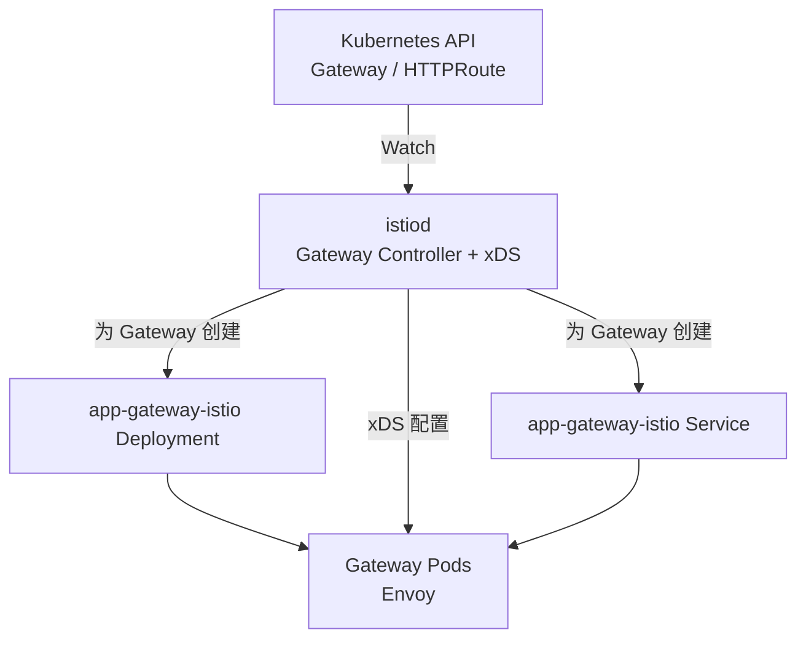
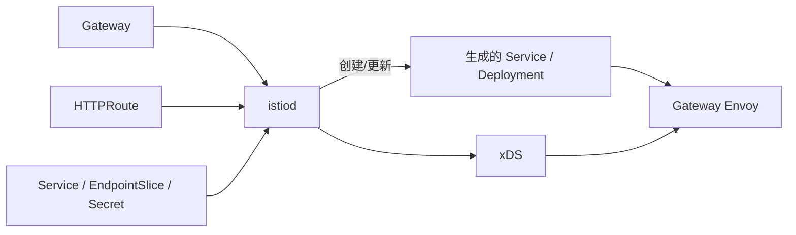

Istio 不只是入口网关。它首先是一套 Service Mesh，通过代理实现服务身份、mTLS、流量治理、授权和可观测性；Gateway API 是它处理南北流量的一种入口配置方式。

本文继续使用两个后端：

```text
user-service:80
├── user Pod A: 10.0.1.11:8080
└── user Pod B: 10.0.2.12:8080

order-service:80
└── order Pod A: 10.0.3.13:8080
```

目标是：

```text
GET api.example.com/users/*  -> user-service
GET api.example.com/orders/* -> order-service
```

## 1. Istio 安装后有哪些组件

Istio 分为控制面和数据面。控制面生成配置，数据面才处理业务请求。

### 1.1 istiod：控制面

`istiod` 以 Deployment 运行，主要负责：

- 读取 Gateway、Route、Service、EndpointSlice 和 Istio 策略；
- 将声明转换成 Envoy 的 Listener、Route、Cluster 和 Endpoint；
- 通过 xDS 向各类代理下发配置；
- 作为 CA，为工作负载签发用于 mTLS 的证书。

`istiod` 不转发业务请求。它暂时不可用时，已经获得配置的代理通常可以继续工作，但无法及时获得新配置和证书。

### 1.2 数据面组件

| 组件 | 运行形态 | 处理什么流量 |
| --- | --- | --- |
| Ingress/Egress Gateway | 独立 Deployment 中的 Envoy | Mesh 边界的南北流量 |
| Envoy Sidecar | 每个业务 Pod 内一个容器 | 该 Pod 的入站和出站流量 |
| ztunnel | 每节点 DaemonSet | Ambient 模式的 L4、身份、mTLS 和隧道 |
| Waypoint | 独立代理 Deployment | Ambient 模式按 Service、Namespace 等边界处理 L7 |
| Istio CNI | 每节点 DaemonSet | 配置流量捕获，不代理业务请求 |

Gateway Envoy、Sidecar 和 Waypoint 都基于代理处理流量，但部署位置和作用域不同。ztunnel 是面向节点的 L4 代理，不负责解析普通 HTTP 路由。

### 1.3 两种 Mesh 数据面模式

Sidecar 模式：

```text
每个业务 Pod
├── 应用容器
└── Envoy Sidecar
```

Ambient 模式：

```text
每个节点一个 ztunnel
└── 需要 L7 能力时，再部署共享的 Waypoint
```

无论业务工作负载使用哪种模式，入口 Gateway 都是独立的代理，不是业务 Pod 中的 Sidecar，也不是 ztunnel。

## 2. Istio 如何实现 Kubernetes Gateway API

安装 Gateway API CRD 和 Istio 控制面后，`istiod` 内部的 Gateway Controller 会监听 `GatewayClass`、`Gateway` 和各种 Route。这里没有另一个名为 “Istio Gateway Controller” 的 Deployment。

默认使用自动部署模式：



默认情况下，一个 `Gateway` 对应一套专属的 Service 和 Deployment：

```text
Gateway: app-gateway
├── Deployment: app-gateway-istio
│   └── Gateway Pod A/B（Envoy）
└── Service: app-gateway-istio
    └── 对外地址和 Listener 端口
```

再创建一个 `partner-gateway`，默认会再得到一套 `partner-gateway-istio` Deployment 和 Service。它们共享 `istiod` 控制面，但不共享 Gateway Envoy Pod。

如果采用手工部署模式，也可以让 Gateway 指向预先创建的 Service 和 Deployment；这时端口同步、扩缩容和生命周期由平台自行管理。

## 3. 声明 Gateway 和路由

`gatewayClassName: istio` 选择 Istio 提供的 GatewayClass，其 Controller 名称默认为 `istio.io/gateway-controller`。

```yaml
apiVersion: gateway.networking.k8s.io/v1
kind: Gateway
metadata:
  name: app-gateway
spec:
  gatewayClassName: istio
  listeners:
    - name: http
      hostname: api.example.com
      protocol: HTTP
      port: 80
      allowedRoutes:
        namespaces:
          from: Same
---
apiVersion: gateway.networking.k8s.io/v1
kind: HTTPRoute
metadata:
  name: app-route
spec:
  parentRefs:
    - name: app-gateway
      sectionName: http
  hostnames:
    - api.example.com
  rules:
    - matches:
        - path:
            type: PathPrefix
            value: /users
      backendRefs:
        - name: user-service
          port: 80
    - matches:
        - path:
            type: PathPrefix
            value: /orders
      backendRefs:
        - name: order-service
          port: 80
```

资源之间的关系是：

| 声明 | 作用 |
| --- | --- |
| `GatewayClass: istio` | 选择 istiod 中的 Gateway Controller |
| `Gateway` | 申请一套 Gateway 数据面，并声明地址、Listener、端口和 TLS |
| `HTTPRoute.parentRefs` | 将路由绑定到指定 Gateway Listener |
| `HTTPRoute.backendRefs` | 指定后端 Kubernetes Service |
| Service/EndpointSlice | 提供后端端口和 Pod IP |

## 4. Gateway 的端口如何变成真实监听

在自动部署模式中，`Gateway.listeners.port: 80` 不只是路由元数据。istiod 会根据它创建或更新 Gateway Deployment 和 Service：

```text
Gateway.listeners.port: 80
        ↓ istiod reconcile
app-gateway-istio Service:80
        ↓ selector
app-gateway-istio Gateway Pods
        ↓ xDS
Envoy Listener: HTTP :80
```

如果给 Gateway 增加 443 Listener，Istio 会相应更新自动生成的 Service 和 Deployment。这个行为与 APISIX Ingress Controller 不同：APISIX Controller 配置预先部署的数据面，不能根据 Gateway 自动打开端口。

假设生成的入口资源为：

```text
Service: app-gateway-istio
type: LoadBalancer
external IP: 203.0.113.20
port: 80
selector: gateway.networking.k8s.io/gateway-name=app-gateway
```

客户端请求的目标就是 `203.0.113.20:80`。生产环境通常让 `api.example.com` 解析到这个 LoadBalancer 地址。

## 5. 配置如何下发



istiod 完成以下工作：

1. 校验 Gateway、Listener、Route 和跨 Namespace 引用。
2. 为自动部署的 Gateway 创建 Service、Deployment 和 ServiceAccount。
3. 将 Listener 转换为 Envoy Listener，将 HTTPRoute 转换为 Route。
4. 根据 Service 和 EndpointSlice 生成 Envoy Cluster 与 Endpoint。
5. 将 TLS Secret、路由和端点通过 xDS 下发给 Gateway Envoy。
6. 更新 Gateway 和 HTTPRoute 的 `Accepted`、`Programmed` 等状态。

这些配置由 Envoy 缓存在本地。请求到来时不会访问 istiod、API Server 或 etcd。

## 6. 一次请求如何执行

假设：

```text
api.example.com                    -> 203.0.113.20
app-gateway-istio Service          -> 203.0.113.20:80
Gateway Pod                        -> 10.0.10.21:80
user-service EndpointSlice         -> 10.0.1.11:8080、10.0.2.12:8080
```

客户端执行：

```bash
curl http://api.example.com/users/42
```

请求过程如下：

```text
1. DNS
   api.example.com -> 203.0.113.20

2. Client 建立连接
   目标：203.0.113.20:80

3. LoadBalancer 和 Kubernetes Service 选择 Gateway Pod
   app-gateway-istio:80 -> Gateway Pod 10.0.10.21:80

4. Gateway Envoy 匹配 Listener 和 Route
   Host=api.example.com
   Path=/users/42

5. Gateway Envoy 执行入口策略
   TLS、JWT、AuthorizationPolicy、超时等

6. Gateway Envoy 从 user-service 的端点中选择 Pod
   选择 10.0.1.11:8080

7. Gateway Envoy 建立上游连接
   10.0.10.21 -> 10.0.1.11:8080
```

Gateway Envoy 使用 istiod 下发的 Endpoint 信息选择 Pod；它不是每次请求都先访问 `user-service` ClusterIP。

## 7. 进入业务 Pod 前还经过什么

这取决于 `user-service` 是否加入 Mesh，以及使用哪种数据面模式。

### 7.1 后端未加入 Mesh

```text
Gateway Envoy -> user Pod 应用容器
```

Istio Gateway 可以把请求转发给未注入 Sidecar、也未加入 Ambient 的普通 Kubernetes 服务。

### 7.2 Sidecar 模式

```text
Gateway Envoy
  -> user Pod IP:8080
  -> 入站流量被重定向到 user Pod 的 Envoy Sidecar
  -> AuthorizationPolicy / mTLS
  -> user 应用容器:8080
```

入口 Gateway 是第一个 Envoy，目标 Pod 的 Sidecar 是第二个 Envoy。这里不会再经过“源业务 Pod 的 Sidecar”。

### 7.3 Ambient 模式

默认路径由目标节点的 ztunnel 承担 L4 身份、mTLS 和授权：

```text
Gateway Envoy -> 目标节点 ztunnel -> user Pod
```

Waypoint 负责 L7 策略，但入口 Gateway 流量默认不会自动经过目标 Waypoint。需要显式启用当前的 ingress-to-waypoint 能力并给目标资源配置 `istio.io/ingress-use-waypoint=true`，路径才会增加 Waypoint：

```text
Gateway Envoy -> user Waypoint -> 目标节点 ztunnel -> user Pod
```

因此不能把 Ambient 请求路径固定写成“Ingress Gateway 必然经过 Waypoint”。

## 8. Kubernetes Gateway 与 Istio Gateway 不要混淆

两种 API 都有名为 `Gateway` 的资源，但行为不同：

| 对比 | Kubernetes Gateway API | Istio Gateway API |
| --- | --- | --- |
| apiVersion | `gateway.networking.k8s.io/v1` | `networking.istio.io/v1` |
| 路由资源 | HTTPRoute、GRPCRoute 等 | VirtualService |
| 默认部署行为 | 一个 Gateway 自动创建一套 Deployment/Service | 配置已经部署的 Gateway 工作负载 |
| 可移植性 | Kubernetes 标准，支持多种实现 | Istio 专用 |

本文前面讲的“一个 Gateway 自动创建一套数据面”只适用于 Istio 对 Kubernetes Gateway API 的默认实现。

## 9. Istio 适合解决什么问题

| 需求 | 主要组件 |
| --- | --- |
| 集群入口 HTTP/TLS 路由 | Gateway Envoy |
| 服务间 mTLS 和工作负载身份 | Sidecar 或 ztunnel |
| 重试、流量切分、故障注入 | Sidecar、Gateway 或 Waypoint |
| L4 授权 | ztunnel 或 Envoy |
| HTTP 级授权、JWT | Gateway、Sidecar 或 Waypoint |
| 流量指标、访问日志和 Trace | 数据面代理 |

如果只需要南北向反向代理，Istio 的整套 Mesh 能力可能偏重；需要统一处理入口、服务身份、mTLS、东西流量治理和授权时，Istio 才体现完整价值。

## 10. 总结

```text
GatewayClass: istio
        ↓
istiod 为每个 Gateway 创建 Deployment 和 Service
        ↓
istiod 将 Gateway、HTTPRoute 和后端端点转换为 xDS
        ↓
Client 请求 Gateway Service 的外部 IP:Listener 端口
        ↓
Gateway Envoy 执行入口路由并选择后端 Pod
        ↓
Sidecar 或 Ambient 数据面继续执行 Mesh 策略
```

Istio Gateway API 的核心不是“给所有服务增加一个入口 Sidecar”，而是创建独立的边界 Envoy，并由 istiod 同时管理其 Kubernetes 生命周期和代理配置。

## 参考资料

- [Istio Architecture](https://istio.io/latest/docs/ops/deployment/architecture/)
- [Istio Kubernetes Gateway API](https://istio.io/latest/docs/tasks/traffic-management/ingress/gateway-api/)
- [Istio Gateway Installation](https://istio.io/latest/docs/setup/additional-setup/gateway/)
- [Istio Ambient Data Plane](https://istio.io/latest/docs/ambient/architecture/data-plane/)
- [Istio Waypoint](https://istio.io/latest/docs/ambient/usage/waypoint/)
