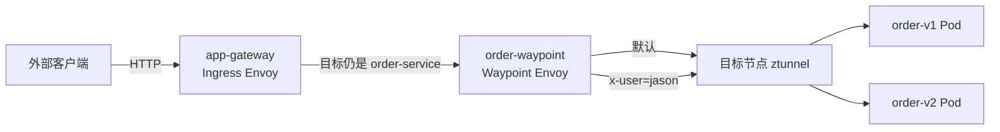
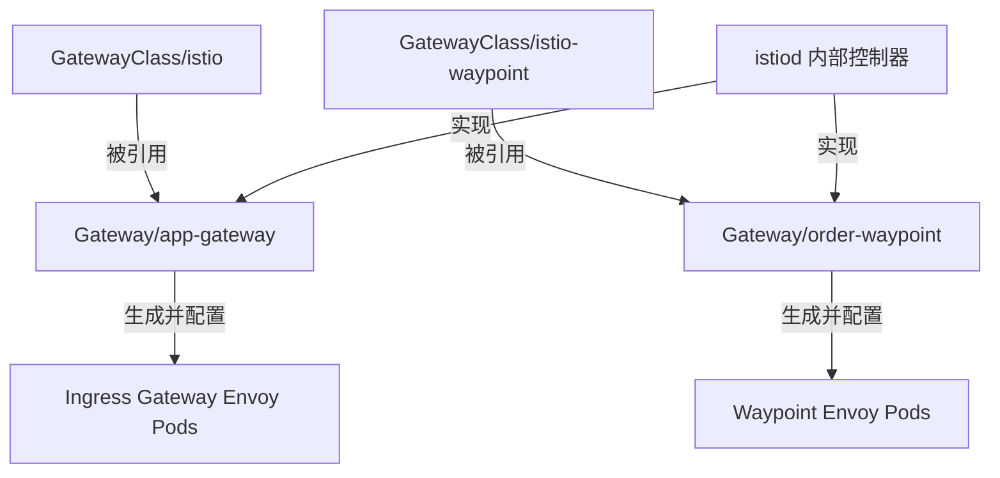
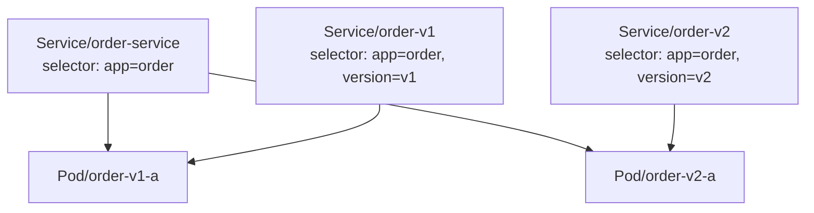
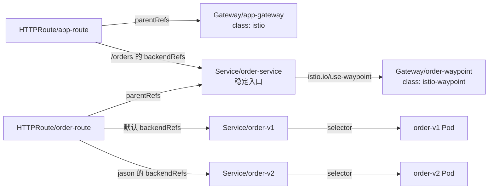
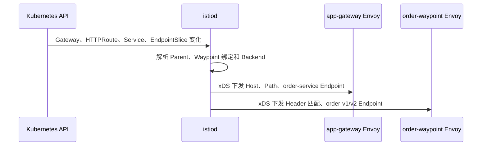
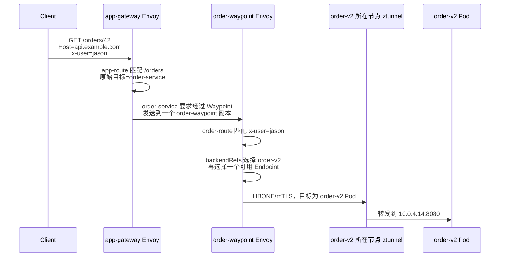

本文只建立 Istio 的共同基础，并用一个完整示例说明 **Ambient 模式经过 Waypoint** 时，资源如何定义、资源之间如何关联，以及请求如何转发。

Sidecar 的请求处理过程在 [012_istio_sidecar.md](./012_istio_sidecar.md) 中说明，Ambient 的数据面原理在 [013_istio_ambient.md](./013_istio_ambient.md) 中说明，本文不再重复比较不同模式。

示例中有两个应用：

```text
user-service:80
├── user-v1-a：10.0.1.11:8080
└── user-v1-b：10.0.2.12:8080

order 工作负载
├── order-v1-a：10.0.3.13:8080（app=order, version=v1）
└── order-v2-a：10.0.4.14:8080（app=order, version=v2）
```

要实现两层路由：

```text
入口路由：
GET api.example.com/users/*  → user-service
GET api.example.com/orders/* → order-service

order-service 的用户路由：
x-user=jason → order v2
其他请求     → order v1
```

最终的关键关系是：

```text
入口 HTTPRoute.parentRefs → Gateway/app-gateway
入口 HTTPRoute.backendRefs → Service/order-service

业务 HTTPRoute.parentRefs → Service/order-service
Service/order-service 的 istio.io/use-waypoint → Gateway/order-waypoint
业务 HTTPRoute.backendRefs → Service/order-v1 或 Service/order-v2
```

## 1. Istio 中谁负责什么

Istio 分为控制面和数据面。控制面生成配置，数据面处理真实请求。

### 1.1 istiod：控制面

`istiod` 以 Deployment 运行，主要负责：

- 监听 Gateway、HTTPRoute、Service、EndpointSlice 和 Istio 策略；
- 根据 Gateway 创建或管理相应的数据面工作负载；
- 将声明转换成 Envoy 的 Listener、Route、Cluster 和 Endpoint；
- 通过 xDS 将配置下发给 Gateway Envoy 和 Waypoint Envoy；
- 作为 CA，为网格工作负载签发 mTLS 证书。

`istiod` 不转发业务请求。

### 1.2 本例中的数据面

| 组件 | 部署形式 | 本例中的职责 |
| --- | --- | --- |
| Ingress Gateway | 独立的 Envoy Deployment | 接收 `api.example.com` 的南北流量，按路径选择 `user-service` 或 `order-service` |
| ztunnel | 每个节点一个 DaemonSet Pod | 捕获 Ambient 工作负载流量，处理身份、mTLS、HBONE 和 L4 转发 |
| Waypoint | 独立的 Envoy Deployment | 为 `order-service` 执行基于 HTTP Header 的 L7 路由 |
| Istio CNI | 每个节点一个 DaemonSet Pod | 配置流量捕获规则，本身不转发业务请求 |

本例的主要数据路径是：



## 2. `istio` 与 `istio-waypoint` 两种 GatewayClass

安装 Istio 的 Gateway API 支持后，通常可以看到两个用途不同的 GatewayClass：

```text
GatewayClass/istio
└── 创建普通 Ingress/Egress Gateway

GatewayClass/istio-waypoint
└── 创建 Ambient Waypoint
```

它们不是两个独立安装的网关产品，也不表示集群中一定有两个 Gateway Pod。`GatewayClass` 只是告诉控制器“这个 Gateway 要按哪一种方式实现”。实际创建多少套代理，取决于创建了多少个 `Gateway` 资源。



两种 Gateway 的区别如下：

| `gatewayClassName` | Gateway 面向谁 | 主要协议和职责 |
| --- | --- | --- |
| `istio` | 集群外部客户端 | 暴露 HTTP/HTTPS/TCP Listener，处理南北流量 |
| `istio-waypoint` | Ambient 网格内的 Service、Namespace 或 ServiceAccount | 接收 HBONE 流量，执行目标侧 L7 路由和策略 |

`istio-waypoint` 不是 `istio` Gateway 的副本，也不是它的下级 Gateway。二者都是 Gateway API 中的 `Gateway`，只是类和作用域不同。

## 3. 示例的完整资源

下面按照依赖关系定义资源。

### 3.1 将 Namespace 加入 Ambient

```yaml
apiVersion: v1
kind: Namespace
metadata:
  name: default
  labels:
    istio.io/dataplane-mode: ambient
```

加入 Ambient 后，业务 Pod 不注入 Sidecar。节点上的 ztunnel 会接管属于该 Namespace 的工作负载流量。

### 3.2 定义业务工作负载

以下 Deployment 省略了与流量关系无关的探针和资源限制。关键是 `app` 与 `version` 标签。

```yaml
apiVersion: apps/v1
kind: Deployment
metadata:
  name: user-v1
  namespace: default
spec:
  replicas: 2
  selector:
    matchLabels:
      app: user
      version: v1
  template:
    metadata:
      labels:
        app: user
        version: v1
    spec:
      containers:
        - name: user
          image: example/user:v1
          ports:
            - containerPort: 8080
---
apiVersion: apps/v1
kind: Deployment
metadata:
  name: order-v1
  namespace: default
spec:
  replicas: 1
  selector:
    matchLabels:
      app: order
      version: v1
  template:
    metadata:
      labels:
        app: order
        version: v1
    spec:
      containers:
        - name: order
          image: example/order:v1
          ports:
            - containerPort: 8080
---
apiVersion: apps/v1
kind: Deployment
metadata:
  name: order-v2
  namespace: default
spec:
  replicas: 1
  selector:
    matchLabels:
      app: order
      version: v2
  template:
    metadata:
      labels:
        app: order
        version: v2
    spec:
      containers:
        - name: order
          image: example/order:v2
          ports:
            - containerPort: 8080
```

### 3.3 定义 Service

`user-service` 是 user 应用的稳定入口。order 需要三个平级的 Service：

- `order-service` 是客户端访问的稳定入口，Selector 会选择全部 order Pod；
- `order-v1` 只选择 v1 Pod；
- `order-v2` 只选择 v2 Pod。

```yaml
apiVersion: v1
kind: Service
metadata:
  name: user-service
  namespace: default
spec:
  selector:
    app: user
  ports:
    - name: http
      port: 80
      targetPort: 8080
---
apiVersion: v1
kind: Service
metadata:
  name: order-service
  namespace: default
  labels:
    # Ambient 内部请求发往 order-service 时，先经过这个 Waypoint。
    istio.io/use-waypoint: order-waypoint
    # 允许入口 Gateway 发往 order-service 的流量也经过 Waypoint。
    istio.io/ingress-use-waypoint: "true"
spec:
  selector:
    app: order
  ports:
    - name: http
      port: 80
      targetPort: 8080
---
apiVersion: v1
kind: Service
metadata:
  name: order-v1
  namespace: default
spec:
  selector:
    app: order
    version: v1
  ports:
    - name: http
      port: 80
      targetPort: 8080
---
apiVersion: v1
kind: Service
metadata:
  name: order-v2
  namespace: default
spec:
  selector:
    app: order
    version: v2
  ports:
    - name: http
      port: 80
      targetPort: 8080
```

三个 order Service 不是包含关系。它们只是用不同的 Selector 观察同一批 Pod：



对应的 EndpointSlice 大致是：

```text
order-service → 10.0.3.13:8080, 10.0.4.14:8080
order-v1      → 10.0.3.13:8080
order-v2      → 10.0.4.14:8080
```

### 3.4 定义入口 Gateway

入口 Gateway 使用 `gatewayClassName: istio`：

```yaml
apiVersion: gateway.networking.k8s.io/v1
kind: Gateway
metadata:
  name: app-gateway
  namespace: default
spec:
  gatewayClassName: istio
  listeners:
    - name: http
      hostname: api.example.com
      protocol: HTTP
      port: 80
      allowedRoutes:
        namespaces:
          from: Same
```

`istiod` 看到这个资源后，会为它创建或管理 Ingress Gateway 的 Deployment 和 Service，并给 Gateway Envoy 下发 Listener 配置。

### 3.5 定义入口 HTTPRoute

入口路由直接挂载到 `Gateway/app-gateway` 的 `http` Listener：

```yaml
apiVersion: gateway.networking.k8s.io/v1
kind: HTTPRoute
metadata:
  name: app-route
  namespace: default
spec:
  parentRefs:
    - group: gateway.networking.k8s.io
      kind: Gateway
      name: app-gateway
      sectionName: http
  hostnames:
    - api.example.com
  rules:
    - matches:
        - path:
            type: PathPrefix
            value: /users
      backendRefs:
        - name: user-service
          port: 80
    - matches:
        - path:
            type: PathPrefix
            value: /orders
      backendRefs:
        - name: order-service
          port: 80
```

这条路由只负责第一层选择：`/orders` 的原始目标是 `order-service`。它不在入口 Gateway 上判断 `x-user`，用户分流由目标 Service 的 Waypoint 完成。

### 3.6 定义 order Waypoint

Waypoint 仍然使用 Gateway API 的 `Gateway`，但类是 `istio-waypoint`：

```yaml
apiVersion: gateway.networking.k8s.io/v1
kind: Gateway
metadata:
  name: order-waypoint
  namespace: default
  labels:
    # 只为绑定到它的 Service 处理流量。
    istio.io/waypoint-for: service
spec:
  gatewayClassName: istio-waypoint
  listeners:
    - name: mesh
      protocol: HBONE
      port: 15008
```

这等价于使用 `istioctl waypoint apply` 创建相应的 Waypoint 声明。`istiod` 会根据它管理 Waypoint Envoy 的 Deployment 和 Service。

`order-waypoint` 是 Gateway 资源的名字，不是某一个 Pod 的名字。Waypoint 有几个副本由其生成的 Deployment 决定，例如扩为两个副本：

```bash
kubectl scale deployment order-waypoint --replicas=2 -n default
```

实际生成的 Deployment 名称可能受 Istio 版本和部署方式影响，应先执行 `kubectl get deployment -n default` 确认。两个副本共享相同配置，由 Waypoint 对应的 Service 选择；上游只选择一个可用副本，不需要知道副本名字。

### 3.7 定义 order 的用户路由

第二条 HTTPRoute 挂载到 `Service/order-service`，由它绑定的 Waypoint 执行：

```yaml
apiVersion: gateway.networking.k8s.io/v1
kind: HTTPRoute
metadata:
  name: order-route
  namespace: default
spec:
  parentRefs:
    - group: ""
      kind: Service
      name: order-service
  rules:
    # x-user=jason 的请求进入 v2。
    - matches:
        - headers:
            - name: x-user
              type: Exact
              value: jason
      backendRefs:
        - name: order-v2
          port: 80
    # 没有 matches，是其余请求的默认规则。
    - backendRefs:
        - name: order-v1
          port: 80
```

这里没有使用 `DestinationRule.subsets`。Gateway API 的 `backendRefs` 直接引用 Kubernetes Service，因此用 `order-v1` 和 `order-v2` 两个 Service 表达两个版本。

## 4. 资源之间到底是什么关系

### 4.1 两条 HTTPRoute 的 Parent 不同

`parentRefs` 表示“这条路由附加到谁，对谁收到的请求生效”。

```text
HTTPRoute/app-route
└── parentRefs → Gateway/app-gateway
    表示规则作用于入口 Gateway 的 Listener

HTTPRoute/order-route
└── parentRefs → Service/order-service
    表示规则作用于以 order-service 为原始目标的网格请求
```

因此 `order-route` 不是直接挂在 `Gateway/order-waypoint` 上。它先挂在目标 Service 上，再由 Service 选择执行规则的 Waypoint。

### 4.2 Service 如何选择 Waypoint

这个标签建立目标 Service 与 Waypoint 的关系：

```yaml
metadata:
  name: order-service
  labels:
    istio.io/use-waypoint: order-waypoint
```

它表示：原始目标为 `order-service` 的 Ambient 网格请求，需要先发送到同一 Namespace 中的 `Gateway/order-waypoint`。

`order-waypoint` 可以任意命名，只要满足 Kubernetes 资源命名规则，并且标签值与 Gateway 名字一致。名字本身没有 `order` 的特殊语义。

### 4.3 backendRefs 如何选择最终版本

`backendRefs` 表示规则匹配后选择哪个最终后端：

```text
x-user=jason → backendRefs: Service/order-v2
其他请求     → backendRefs: Service/order-v1
```

把三种引用放在一起就是：



注意箭头表达的是配置引用，不是所有箭头都表示网络流量。

### 4.4 为什么 order-v1 和 order-v2 不需要绑定 Waypoint

本例的请求原始目标是 `order-service`：

```text
order-service → order-waypoint → order-v1 或 order-v2
```

请求已经因为 `order-service` 的标签进入 Waypoint。Waypoint 在执行 HTTPRoute 后选择 `order-v1` 或 `order-v2`，所以这两个版本 Service 不必为了同一次处理再次绑定该 Waypoint，否则可能形成重复处理。

但是，如果客户端绕过稳定入口，直接请求 `order-v2.default.svc.cluster.local`，原始目标就变成了 `order-v2`。由于 `order-v2` 没有绑定 Waypoint，这个直接请求不会应用 `order-route`。因此应通过权限控制或调用约定，要求调用方只访问 `order-service`。

## 5. 配置如何变成数据面配置

资源创建以后，控制面大致执行以下过程：



可以把两台代理保存的信息简化理解为：

```text
app-gateway Envoy：
- api.example.com:80 的 Listener
- /users → user-service
- /orders → order-service
- order-service 需要经过 order-waypoint
- order-waypoint 的可达地址

order-waypoint Envoy：
- 这条请求的原始目标是 order-service
- order-service 附加的 order-route
- x-user=jason → order-v2
- 默认 → order-v1
- order-v1、order-v2 的可用 Endpoint
```

Envoy 不直接监听 Kubernetes API，也不是在每次请求时查询 EndpointSlice。`istiod` 监听这些资源，将计算结果通过 xDS 推送给 Envoy。

## 6. 外部请求如何经过 Waypoint

要让 Ingress Gateway 发往 `order-service` 的流量也经过 Waypoint，本例在 Service 上增加了：

```yaml
istio.io/ingress-use-waypoint: "true"
```

同时需要确保控制面启用了入口使用 Waypoint 的相应能力，例如 `ENABLE_INGRESS_WAYPOINT_ROUTING`。如果未开启，即使 Service 绑定了 Waypoint，入口 Gateway 的流量也可能直接选择业务 Endpoint；这项开关应以当前使用的 Istio 版本为准。

### 6.1 `x-user=jason` 访问 v2

```bash
curl -H "Host: api.example.com" \
     -H "x-user: jason" \
     http://<GATEWAY-IP>/orders/42
```

请求流程如下：



这里发生两次不同的选择：

1. Gateway Envoy 根据 `order-service` 的 Waypoint 绑定，从 Waypoint Service 的 Endpoint 中选择一个 `order-waypoint` 副本。
2. Waypoint 根据 Header 命中 `order-v2`，再从 `order-v2` 的 Endpoint 中选择一个业务 Pod。

### 6.2 其他用户访问 v1

```bash
curl -H "Host: api.example.com" \
     http://<GATEWAY-IP>/orders/42
```

请求没有 `x-user: jason`，第一条规则不匹配，于是执行没有 `matches` 的默认规则：

```text
Client
→ app-gateway
→ order-service
→ order-waypoint
→ order-route 默认 backendRefs: order-v1
→ 目标节点 ztunnel
→ order-v1 Pod
```

### 6.3 user-service 内部调用 order-service

如果 `user-service` 的 Pod 在 Ambient 网格内直接调用：

```text
http://order-service.default.svc.cluster.local/orders/42
```

路径不再经过入口 Gateway，但仍会经过目标 Service 的 Waypoint：

```text
user Pod
→ user Pod 所在节点的 ztunnel
→ order-waypoint
→ 根据 x-user 选择 order-v1 或 order-v2
→ order Pod 所在节点的 ztunnel
→ order Pod
```

所以 `Source` 只是当前请求的调用方；真正决定本例路由规则作用位置的是 `parentRefs: Service/order-service`，而不是调用方身份。

## 7. 如何检查资源是否生效

先检查 Gateway 与 HTTPRoute 的状态：

```bash
kubectl get gateway -n default
kubectl describe gateway app-gateway -n default
kubectl describe gateway order-waypoint -n default
kubectl get httproute -n default
kubectl describe httproute app-route -n default
kubectl describe httproute order-route -n default
```

重点观察：

- Gateway 是否为 `Accepted=True`、`Programmed=True`；
- `app-route` 是否被 `app-gateway` 接受；
- `order-route` 是否被 `order-service` 接受；
- Backend 是否存在以及引用是否解析成功。

再检查 Service、EndpointSlice 和生成的数据面工作负载：

```bash
kubectl get service -n default
kubectl get endpointslice -n default
kubectl get deployment,pod -n default
kubectl get service order-service -n default --show-labels
```

如果 `jason` 没有进入 v2，按下面的顺序定位：

1. `order-route.status.parents` 是否显示已被接受；
2. `order-service` 是否同时具有 `use-waypoint` 与入口 Waypoint 标签；
3. `order-v1`、`order-v2` 的 EndpointSlice 是否分别选择正确版本；
4. Waypoint 是否已创建并 Ready；
5. 控制面是否启用了入口流量经过 Waypoint 的能力；
6. 请求 Header 是否确实为 `x-user: jason`。

## 8. Kubernetes Gateway 与 Istio Gateway 不要混淆

Istio 中有两套同名概念：

```text
gateway.networking.k8s.io/v1 的 Gateway
└── Kubernetes Gateway API 标准资源

networking.istio.io/v1 的 Gateway
└── Istio 自己较早提供的 API，通常与 VirtualService 配合
```

本文使用的 `GatewayClass`、`Gateway` 和 `HTTPRoute` 都属于 Kubernetes Gateway API。判断时应先看 `apiVersion`，不要只看 `kind: Gateway`。

## 9. 总结

这个示例可以压缩成两段配置关系和一条数据路径：

```text
南北入口：
HTTPRoute/app-route
→ Gateway/app-gateway（gatewayClassName: istio）
→ Service/order-service

目标侧 L7 路由：
HTTPRoute/order-route
→ parentRefs: Service/order-service
→ istio.io/use-waypoint: order-waypoint
→ Gateway/order-waypoint（gatewayClassName: istio-waypoint）
→ backendRefs: order-v1 或 order-v2

真实流量：
Client → Ingress Gateway → Waypoint → 目标节点 ztunnel → order Pod
```

`parentRefs` 决定路由附加到谁，`istio.io/use-waypoint` 决定谁执行目标 Service 的 L7 处理，`backendRefs` 决定匹配后转发到哪个 Service。理解这三种关系以后，入口 Gateway、稳定 Service、Waypoint 和版本 Service 就不会混在一起。

## 参考资料

- [Istio：Gateway API](https://istio.io/latest/docs/tasks/traffic-management/ingress/gateway-api/)
- [Istio：Ambient 模式](https://istio.io/latest/docs/ambient/)
- [Istio：Waypoint](https://istio.io/latest/docs/ambient/usage/waypoint/)
- [Istio：Configure waypoint traffic](https://istio.io/latest/docs/ambient/usage/waypoint/)
- [Kubernetes Gateway API](https://gateway-api.sigs.k8s.io/)
