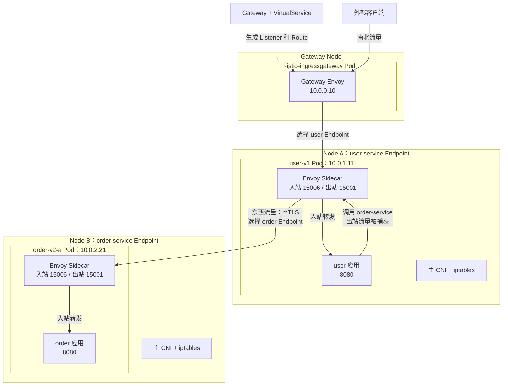
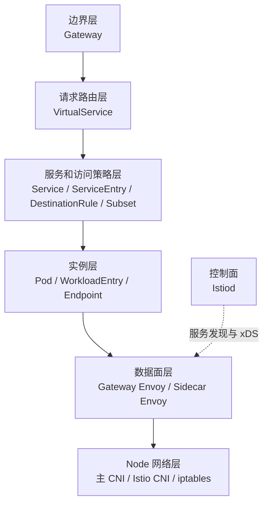
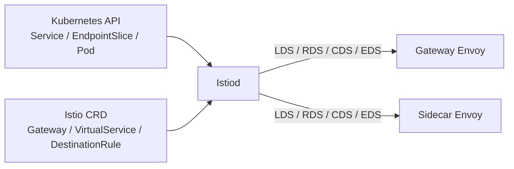
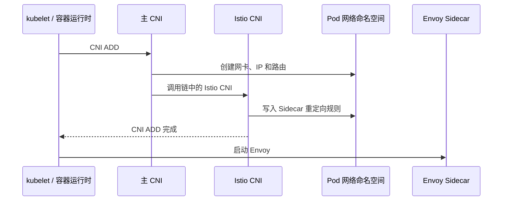
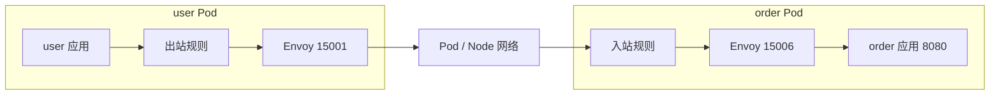
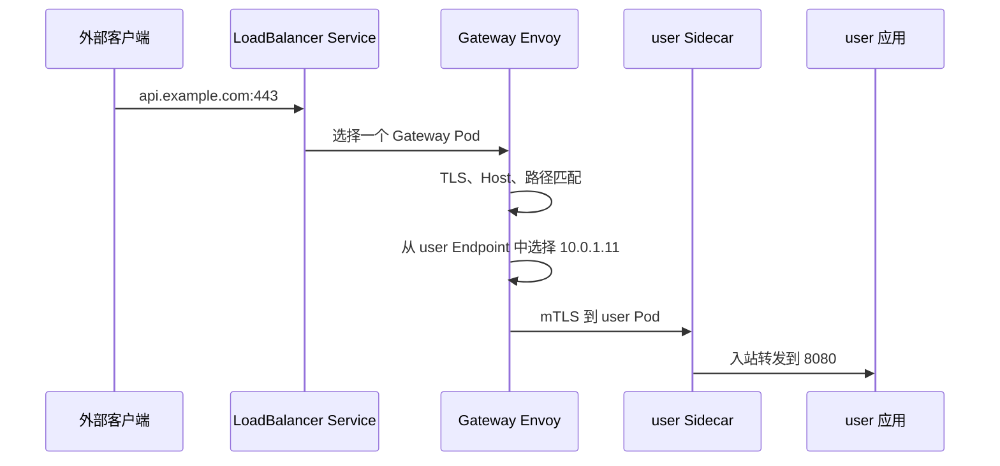
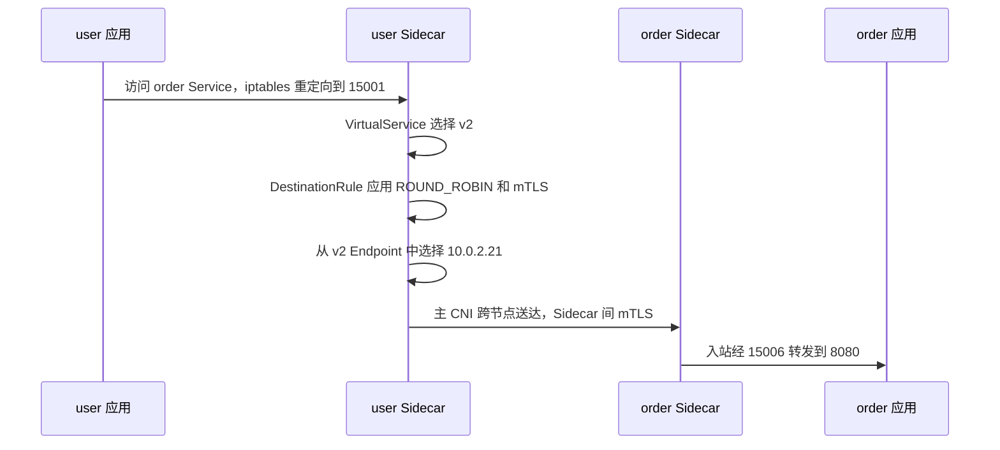

Sidecar 模式的核心特点是：每个加入网格的业务 Pod 中都运行一个 Envoy。应用的入站和出站连接先被重定向到 Envoy，再由 Envoy 执行路由、负载均衡、mTLS、授权和遥测。

本文先画完整网络拓扑，再把 Service、Endpoint、VirtualService、DestinationRule、Gateway 等抽象放回对应层次，最后沿一次请求解释流量在哪里被捕获、选择和转发。

<!-- more -->

## 1. Sidecar 模式的整体架构

### 1.1 示例

本文统一使用下面的实例：

| 对象 | 地址或位置 | 说明 |
| --- | --- | --- |
| `istio-ingressgateway` Pod | `10.0.0.10`，Gateway Node | 接收外部请求的 Envoy |
| `user-service` | `10.96.1.10:80` | Kubernetes Service |
| `user-v1` Pod | `10.0.1.11:8080`，Node A | 应用和 Envoy Sidecar |
| `order-service` | `10.96.2.10:80` | Kubernetes Service |
| `order-v1-a` Pod | `10.0.2.20:8080`，Node B | 默认请求进入的 v1 实例 |
| `order-v2-a` Pod | `10.0.2.21:8080`，Node B | 应用和 Envoy Sidecar |
| `order-v2-b` Pod | `10.0.3.22:8080`，Node C | 应用和 Envoy Sidecar |

业务过程是：

```text
外部客户端 → user-service → order-service
```

### 1.2 南北和东西流量拓扑



南北流量路径：

```text
外部客户端
→ LoadBalancer / NodePort
→ Ingress Gateway Envoy
→ user-v1 Sidecar Envoy
→ user 应用
```

东西流量路径：

```text
user 应用
→ user-v1 Sidecar Envoy
→ order-v2-a Sidecar Envoy
→ order 应用
```

从图中可以看出：iptables 只把连接送入 Envoy，不理解 HTTP 路由；Service、Subset 和 Endpoint 的选择发生在 Envoy；跨节点送达由主 CNI 和 Node 网络完成。

## 2. 从架构图定位抽象

### 2.1 分层关系



这是概念归属关系，不是请求的实际先后顺序。

### 2.2 抽象作用于哪一层

| 抽象 | 所在层 | 作用 | 执行者 |
| --- | --- | --- | --- |
| `Gateway` | 边界层 | 声明监听端口、协议、Host 和 TLS | Gateway Envoy |
| `VirtualService` | 请求路由层 | 根据 Host、路径、Header 等选择目标 | Gateway Envoy 或 Sidecar Envoy |
| `Service` | 服务层 | 提供稳定服务名和后端集合 | Kubernetes、Istiod、Envoy |
| `ServiceEntry` | 服务层 | 把外部或非 Kubernetes 服务加入注册中心 | Istiod 转换，Envoy 使用 |
| `DestinationRule` | 服务访问策略层 | 定义 Subset、负载均衡、连接池、TLS 和熔断 | 发起请求一侧的 Envoy |
| `Pod` / `WorkloadEntry` | 实例层 | 运行真正的应用 | Kubernetes 或 Istio 注册中心 |
| `Endpoint` | 实例层 | Envoy 最终连接的 IP 和端口 | Istiod 发现并下发，Envoy 选择 |
| `Sidecar` 资源 | 配置作用域层 | 限制某些 Sidecar Envoy 的入站和出站配置范围 | Istiod |
| Envoy Sidecar | 数据面层 | 代理本 Pod 的入站和出站流量 | Envoy |
| `istio-cni-node` / `istio-init` | Node/Pod 网络层 | 建立到 Envoy 的流量重定向 | CNI 插件或初始化容器 |

## 3. 基础运行时抽象

### 3.1 Service、Workload 和 Endpoint

三者描述的是不同层次：

```text
Service：客户端访问的逻辑名称
    ↓ 包含
Workload：真正运行应用的实例，例如 Pod 或 VM
    ↓ 通过网络表示
Endpoint：代理最终连接的 IP + Port
```

例如：

```text
order-service.default.svc.cluster.local
├── order-v2-a Workload → 10.0.2.21:8080
└── order-v2-b Workload → 10.0.3.22:8080
```

Pod 和 Endpoint 不能画等号。Pod 是运行实体，Endpoint 是访问这个实体时使用的网络地址。

### 3.2 Subset

Subset 使用 Label 从一个 Service 的 Endpoint 中划分逻辑集合：

```yaml
apiVersion: networking.istio.io/v1
kind: DestinationRule
metadata:
  name: order
spec:
  host: order-service.default.svc.cluster.local
  subsets:
    - name: v1
      labels:
        version: v1
    - name: v2
      labels:
        version: v2
```

它不会创建新的 Service 或 Endpoint，只是得到：

```text
order-service
├── subset v1 → version=v1 的 Endpoint
└── subset v2 → version=v2 的 Endpoint
```

### 3.3 Host 与 Destination

`VirtualService.spec.hosts` 表示什么访问地址会进入这组路由规则，例如：

```text
order-service.default.svc.cluster.local
api.example.com
```

路由匹配后选择一个 Destination：

```yaml
destination:
  host: order-service.default.svc.cluster.local
  subset: v2
  port:
    number: 8080
```

可以概括为：

```text
Destination = Service Host + Subset + Port
```

`Destination` 是 `VirtualService` 中的嵌套结构，不是独立 CRD。它的 Host 必须能在 Istio 服务注册中心中解析出 Endpoint。

### 3.4 Source

Source 和 Destination 是一次流量关系中平级的两端，不是父子关系：

```text
Source（调用方） → Destination（目标方）
```

例如：

```text
Source
├── workload  = user-v1
├── namespace = default
├── labels    = app=user, version=v1
└── identity  = cluster.local/ns/default/sa/user-service

Destination
├── host      = order-service.default.svc.cluster.local
├── subset    = v2
└── port      = 8080
```

Source 用来表达“这条规则对谁发出的请求生效”。在不同场景中，它可能表现为来源 Label、Namespace、ServiceAccount、Principal 或来源 IP。

经过 Gateway 时应按连接分段：

```text
外部客户端 → Ingress Gateway：Source 是外部客户端
Ingress Gateway → user-service：Source 是 Gateway 工作负载
```

## 4. 五个经典流量管理资源

### 4.1 VirtualService：请求去哪里

`VirtualService` 负责匹配请求并选择 Destination：

```yaml
apiVersion: networking.istio.io/v1
kind: VirtualService
metadata:
  name: order
spec:
  hosts:
    - order-service.default.svc.cluster.local
  http:
    - match:
        - headers:
            x-user:
              exact: jason
      route:
        - destination:
            host: order-service.default.svc.cluster.local
            subset: v2
    - route:
        - destination:
            host: order-service.default.svc.cluster.local
            subset: v1
```

它回答：

```text
什么请求 → 哪个 Service / Subset / Port
```

### 4.2 DestinationRule：怎样访问目标

`DestinationRule` 在目标已经确定后定义访问策略：

```yaml
apiVersion: networking.istio.io/v1
kind: DestinationRule
metadata:
  name: order
spec:
  host: order-service.default.svc.cluster.local
  trafficPolicy:
    loadBalancer:
      simple: ROUND_ROBIN
    tls:
      mode: ISTIO_MUTUAL
  subsets:
    - name: v1
      labels:
        version: v1
    - name: v2
      labels:
        version: v2
```

常见能力包括负载均衡、连接池、异常检测、熔断、客户端 TLS、地域故障转移和端口级策略。

```text
VirtualService：选择哪个目标
DestinationRule：怎样访问这个目标
```

### 4.3 Gateway：哪些边界流量可以进入

这里使用的是 Istio `networking.istio.io/Gateway`：

```yaml
apiVersion: networking.istio.io/v1
kind: Gateway
metadata:
  name: api-gateway
spec:
  selector:
    istio: ingressgateway
  servers:
    - port:
        number: 443
        name: https
        protocol: HTTPS
      hosts:
        - api.example.com
      tls:
        mode: SIMPLE
        credentialName: api-cert
```

Gateway 声明端口、协议、TLS、SNI 和 Host；VirtualService 再声明 URI、Header 和目标服务。Gateway 是配置对象，真正接收流量的是 Gateway Envoy。

### 4.4 ServiceEntry：让 Istio 认识额外服务

`ServiceEntry` 把 Kubernetes 无法自动发现的外部服务、VM 服务或其他注册中心服务加入 Istio：

```yaml
apiVersion: networking.istio.io/v1
kind: ServiceEntry
metadata:
  name: external-api
spec:
  hosts:
    - api.external.example
  location: MESH_EXTERNAL
  ports:
    - number: 443
      name: https
      protocol: HTTPS
  resolution: DNS
```

ServiceEntry 的 Entry 是“服务注册表条目”，不是 Ingress 入口。

### 4.5 Sidecar 资源：限制代理的配置范围

`Sidecar` CRD 和 Envoy Sidecar 进程不是同一个概念：

```text
Sidecar CRD：声明某些代理需要哪些入站、出站配置
Envoy Sidecar：真正处理流量的进程
```

```yaml
apiVersion: networking.istio.io/v1
kind: Sidecar
metadata:
  name: user-sidecar-scope
spec:
  workloadSelector:
    labels:
      app: user
  ingress:
    - port:
        number: 8080
        protocol: HTTP
        name: http
      defaultEndpoint: 127.0.0.1:8080
  egress:
    - hosts:
        - "./*"
        - "istio-system/*"
```

`ingress` 告诉 Istiod 怎样生成本 Pod 的入站监听配置；`egress.hosts` 限制该代理需要加载哪些服务的出站配置。它不是网络防火墙，真正的访问控制应使用 `AuthorizationPolicy`。

## 5. Istiod 如何把抽象交给 Envoy



Istiod 负责：

1. 监听 Service、EndpointSlice、Pod 和 Istio CRD。
2. 把高级抽象转换成 Listener、Route、Cluster 和 Endpoint 等 xDS 配置。
3. 根据每个代理的位置和 Sidecar 作用域生成不同配置。
4. 动态下发给 Gateway Envoy 和 Sidecar Envoy。

Envoy 不会在每次请求时直接查询 Kubernetes EndpointSlice。它使用 Istiod 已经转换并下发的 Endpoint 配置完成客户端负载均衡。

## 6. 流量为什么会进入 Sidecar

### 6.1 `istio-init` 与 Istio CNI

应用代码仍然连接正常的 Service 地址。Sidecar 模式依靠 Pod 网络命名空间中的 iptables/netfilter 规则透明捕获连接。

建立规则有两种方式：

| 方式 | 发生时间 | 特点 |
| --- | --- | --- |
| `istio-init` 初始化容器 | Pod 启动前 | 在每个 Pod 内配置规则，需要相应网络权限 |
| `istio-cni-node` | CNI ADD 阶段 | 节点 CNI 插件配置规则，业务 Pod 不需要高权限初始化容器 |

Istio CNI 不替代 Calico、Cilium 等主 CNI。主 CNI 创建网卡、分配 IP；Istio CNI 只增加流量重定向。

### 6.2 Pod 创建过程



### 6.3 入站和出站重定向



规则会排除 Envoy 自己发出的流量，或使用数据包标记避免代理流量再次被捕获形成循环。需要绕过网格的端口和 IP 段也可以通过注解配置。

## 7. 一次完整请求如何转发

假设外部用户请求：

```text
GET https://api.example.com/users/1/orders
X-User: jason
```

### 7.1 南北入口



这里有两次不同的选择：

1. LoadBalancer Service 通过云负载均衡、kube-proxy、IPVS 或 eBPF 把连接送到 Gateway Pod。
2. Gateway Envoy 根据 xDS 从 `user-service` Endpoint 中选择业务 Pod。

### 7.2 东西调用



完整链路可以压缩成：

```text
应用连接 Service VIP
→ iptables 捕获到调用方 Sidecar
→ VirtualService 选择 Destination
→ DestinationRule 确定 Subset 和连接策略
→ Envoy 从 xDS Endpoint 中负载均衡
→ 主 CNI 根据 Pod IP 跨节点送达
→ 目标 Sidecar 入站处理
→ 目标应用端口
```

Envoy 选择的是目标 Pod Endpoint，不是目标 Node。选定 Pod IP 后，底层路由自然确定目标 Node。

## 8. 非 Kubernetes 工作负载

VM 可以通过 `WorkloadEntry` 加入 Service，通过 `WorkloadGroup` 复用注册模板：

```yaml
apiVersion: networking.istio.io/v1
kind: WorkloadEntry
metadata:
  name: order-vm-1
spec:
  address: 192.168.10.21
  labels:
    app: order
    version: v2
  serviceAccount: order-service
```

```text
ServiceEntry：定义服务
WorkloadEntry：定义一个 VM 实例
WorkloadGroup：定义一组 VM 的公共模板
```

在服务注册中心中，Pod 和 VM 最终都表现为可被代理选择的 Workload/Endpoint。

## 9. 容易混淆的概念

1. `Gateway` 是配置，Gateway Envoy 才是代理进程。
2. `Sidecar` CRD 是配置作用域，Envoy Sidecar 是数据面进程。
3. Subset 是 Endpoint 的 Label 分组，不是新的 Service。
4. Source 与 Destination 平级，不是 Destination 的组成部分。
5. `VirtualService.spec.hosts` 是路由规则的访问地址，`route.destination.host` 是匹配后的目标服务。
6. Istio CNI 只建立重定向，不亲自代理请求。
7. Envoy 选择 Endpoint，主 CNI 和 Node 网络负责把数据包送达该 Pod IP。

## 10. 总结

Sidecar 模式可以用下面三层理解：

```text
抽象层：Gateway、VirtualService、DestinationRule、Service、Subset、Endpoint
执行层：Gateway Envoy 和每个业务 Pod 的 Sidecar Envoy
网络层：iptables 捕获连接，主 CNI 根据 Pod IP 完成跨节点送达
```

阅读一份配置时依次回答：

1. 请求的 Source 和 Host 是什么？
2. VirtualService 选择哪个 Destination？
3. DestinationRule 定义了什么 Subset 和访问策略？
4. Istiod 为目标下发了哪些 Endpoint？
5. 规则由 Gateway Envoy 还是哪个 Sidecar Envoy 执行？
6. 入站或出站连接怎样被重定向到 Envoy？

## 11. 参考资料

1. [Istio 架构](https://istio.io/latest/zh/docs/ops/deployment/architecture/)
2. [Istio 流量管理](https://istio.io/latest/zh/docs/concepts/traffic-management/)
3. [Istio CNI](https://istio.io/latest/zh/docs/setup/additional-setup/cni/)
4. [VirtualService API](https://istio.io/latest/zh/docs/reference/config/networking/virtual-service/)
5. [DestinationRule API](https://istio.io/latest/zh/docs/reference/config/networking/destination-rule/)
