Ambient 模式不在每个业务 Pod 中注入 Envoy，而是把数据面拆成两层：每个 Node 上的 ztunnel 提供四层安全覆盖层，需要 HTTP 路由和七层策略时，再让流量经过目标服务的 Waypoint Envoy。

```text
四层能力：ztunnel，默认提供
七层能力：Waypoint，按需部署和绑定
```

本文先画完整网络拓扑，再分别解释 ztunnel、Waypoint、Gateway API 和 Istio CNI，最后比较有无 Waypoint 时的真实转发链路。

<!-- more -->

## 1. Ambient 模式的整体架构

### 1.1 Ambient 与 Gateway 的关系

Ambient 是服务间数据面的部署模式，Ingress/Egress Gateway 是网格边界代理。二者不是互斥关系：

```text
Gateway：处理进入或离开网格的南北流量
Ambient：处理网格内部的东西流量，并承接 Gateway 转入的流量
```

集群可以同时使用 Ingress Gateway、ztunnel 和 Waypoint。

### 1.2 示例

| 对象 | 地址或位置 | 说明 |
| --- | --- | --- |
| `istio-ingressgateway` Pod | `10.0.0.10`，Gateway Node | 接收外部请求的 Envoy |
| `user-service` | `10.96.1.10:80` | Kubernetes Service |
| `user-v1` Pod | `10.0.1.11:8080`，Node A | 没有 Sidecar |
| `order-service` | `10.96.2.10:80` | Kubernetes Service |
| `order-v1-a` Pod | `10.0.2.20:8080`，Node B | 默认请求进入的 v1 实例 |
| `order-v2-a` Pod | `10.0.2.21:8080`，Node B | 没有 Sidecar |
| `order-v2-b` Pod | `10.0.3.22:8080`，Node C | 没有 Sidecar |
| `user-waypoint` | Deployment + Service | 为 user 执行七层策略 |
| `order-waypoint` | Deployment + Service | 为 order 执行七层策略 |

业务过程是：

```text
外部客户端 → user-service → order-service
```

### 1.3 南北和东西流量拓扑

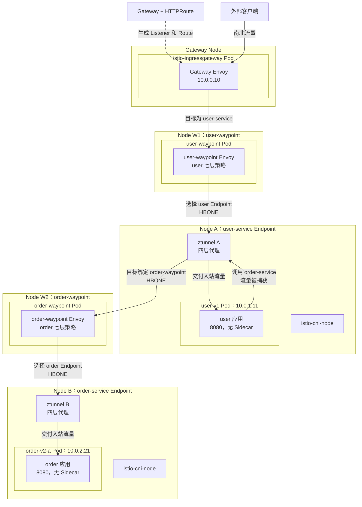

南北路径：

```text
外部客户端
→ Ingress Gateway Envoy
→ user-waypoint
→ Node A 的 ztunnel
→ user-v1 Pod
```

东西路径：

```text
user-v1 Pod
→ Node A 的 ztunnel
→ order-waypoint
→ Node B 的 ztunnel
→ order-v2-a Pod
```

图中为了把两段流量画清楚，分别使用了 `user-waypoint` 和 `order-waypoint`，这不表示每个 Service 必须创建一个 Waypoint。两个 Service 完全可以绑定同一个共享 Waypoint。图中也只画了每个 Waypoint 被选中的一个 Pod；Waypoint 是 Deployment，不是 DaemonSet，不要求每个节点都运行一个。

## 2. 从架构图定位抽象

### 2.1 分层关系

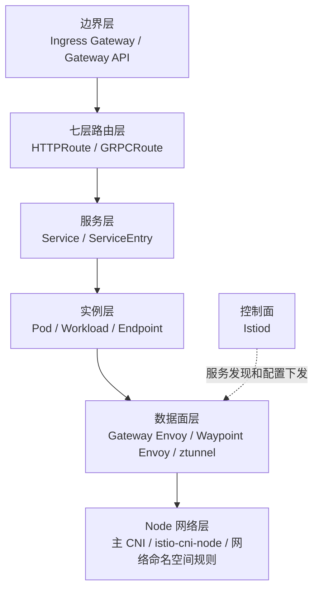

### 2.2 抽象作用于哪一层

| 抽象或组件 | 所在层 | 作用 |
| --- | --- | --- |
| Ingress Gateway Envoy | 边界层 | 接收南北入口流量，执行入口 TLS 和七层路由 |
| Kubernetes Gateway API `Gateway` | 边界或 Waypoint 层 | 声明入口 Gateway 或 Waypoint 数据面 |
| `HTTPRoute` / `GRPCRoute` | 七层路由层 | 为 Gateway 或 Waypoint 声明请求路由 |
| `Service` | 服务层 | 提供稳定服务名和 Workload 集合 |
| `ServiceEntry` | 服务层 | 把平台外服务加入 Istio 注册中心 |
| `Pod` / `WorkloadEntry` | 实例层 | 真正运行应用的工作负载 |
| `Endpoint` / `EndpointSlice` | 实例层 | 工作负载的 IP、端口和健康状态 |
| ztunnel | 四层数据面 | 工作负载识别、mTLS/HBONE、四层授权和转发 |
| Waypoint Envoy | 七层数据面 | HTTP 路由、七层授权、重试和七层遥测 |
| `istio-cni-node` | Node 网络层 | 把业务 Pod 的流量重定向到 ztunnel |
| Istiod | 控制面 | 服务发现、身份、配置转换和下发，不转发业务请求 |

## 3. Ambient 的核心组件

### 3.1 ztunnel：每个 Node 一个四层代理

ztunnel 以 DaemonSet 运行，每个加入 Ambient 的节点通常有一个实例。它负责：

1. 识别源、目标 Workload 和 Service。
2. 为工作负载获取并使用身份和证书。
3. 建立 HBONE/mTLS 连接。
4. 执行基于身份、Namespace、ServiceAccount、IP 和端口的四层授权。
5. 在不需要 Waypoint 时选择目标 Endpoint。
6. 把到达本节点的流量交付给目标 Pod。

ztunnel 不解析 HTTP 方法、路径和 Header，因此不能独自执行七层路由和 JWT Claim 等策略。

### 3.2 Waypoint：面向目标服务的七层代理

Waypoint 是 Envoy，但它不是每个业务 Pod 一个，也不是每个 Node 一个。它通常由 Kubernetes Gateway API `Gateway` 声明：

```yaml
apiVersion: gateway.networking.k8s.io/v1
kind: Gateway
metadata:
  name: order-waypoint
  namespace: default
  labels:
    istio.io/waypoint-for: service
spec:
  gatewayClassName: istio-waypoint
  listeners:
    - name: mesh
      port: 15008
      protocol: HBONE
```

也可以使用：

```bash
istioctl waypoint apply --name order-waypoint -n default --for service
```

`order-waypoint` 是用户定义的 Kubernetes 资源名，不是固定名称。`istio.io/use-waypoint` 引用它时，名称必须完全一致。

### 3.3 谁创建和发现 Waypoint 副本

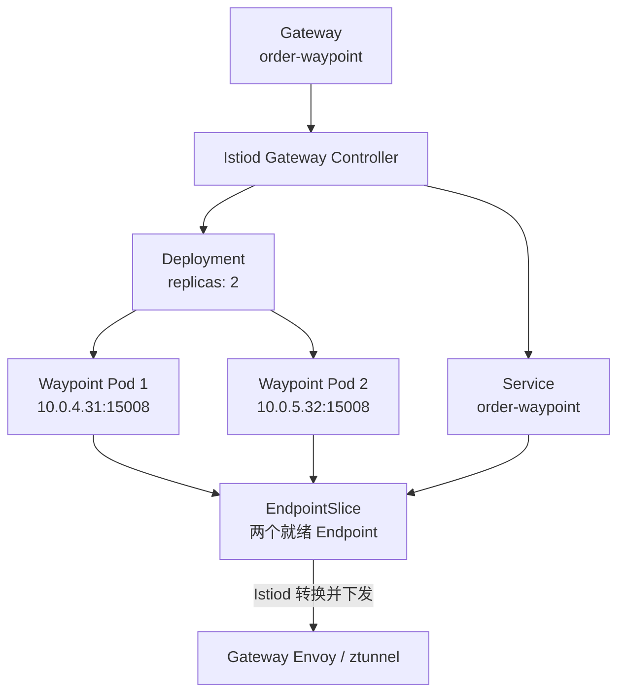

Waypoint 自己不管理副本：

1. Deployment 决定期望副本数。
2. Service 选择 Waypoint Pod。
3. EndpointSlice 记录就绪 Pod IP。
4. Istiod 监听这些资源并转换成数据面配置。
5. Gateway Envoy 或源 ztunnel 选择一个就绪 Waypoint Endpoint。

单个 Waypoint Pod 不需要发现其他副本，也不会把同一请求转交给另一个副本。

### 3.4 Waypoint 的作用范围

Waypoint 和 Service 不是一对一关系。一个 Waypoint 可以服务一个 Service，也可以被同一 Namespace 中的多个 Service 共用。

这里有两个含义不同的标签：

| 标签 | 配置位置 | 作用 |
| --- | --- | --- |
| `istio.io/waypoint-for` | Waypoint `Gateway` | 声明 Waypoint 能处理 `service`、`workload` 或 `all` 类型的目标流量 |
| `istio.io/use-waypoint` | Namespace、Service 或 Pod | 声明这个目标应该使用哪个具体 Waypoint |

`waypoint-for: service` 并不是说“这个 Waypoint 只能服务一个 Service”，而是说它处理原始目标为 Kubernetes Service 的流量。

#### 3.4.1 三个 Service 共用一个 Waypoint

假设一个应用由三个 Kubernetes Service 组成：

```text
user-service
order-service
payment-service
```

可以只创建一个共享 Waypoint：

```yaml
apiVersion: gateway.networking.k8s.io/v1
kind: Gateway
metadata:
  name: app-waypoint
  namespace: default
  labels:
    # 处理发往 Service 的流量，不是限制只能绑定一个 Service。
    istio.io/waypoint-for: service
spec:
  gatewayClassName: istio-waypoint
  listeners:
    - name: mesh
      port: 15008
      protocol: HBONE
```

在 Namespace 上选择它：

```yaml
apiVersion: v1
kind: Namespace
metadata:
  name: default
  labels:
    istio.io/dataplane-mode: ambient
    # Namespace 中没有单独覆盖的目标共用这个 Waypoint。
    istio.io/use-waypoint: app-waypoint
```

关系如下：

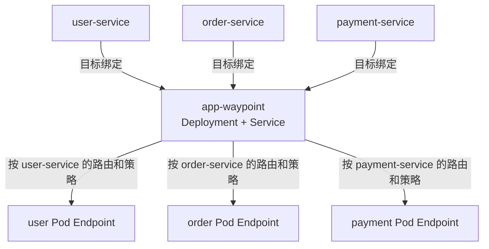

共享 Waypoint 会获得这三个目标 Service 所需的路由、授权和 Endpoint 信息。收到请求后，它先识别目标 Service，再执行该 Service 对应的七层策略并选择业务 Endpoint。

例如 `user-service` 调用 `order-service` 时，Waypoint 是由目标 `order-service` 的绑定决定的：

```text
user Pod
→ 源 ztunnel
→ app-waypoint
→ 目标节点 ztunnel
→ order Pod
```

不会因为 `user-service` 也绑定了同一个 Waypoint，就让同一请求连续经过两次 `app-waypoint`。

#### 3.4.2 单个 Service 覆盖 Namespace 默认值

如果 `payment-service` 需要独立扩缩容或更强的故障隔离，可以为它创建 `payment-waypoint`，然后只覆盖这个 Service：

```yaml
apiVersion: v1
kind: Service
metadata:
  name: payment-service
  namespace: default
  labels:
    # 覆盖 Namespace 上的 app-waypoint。
    istio.io/use-waypoint: payment-waypoint
```

最终关系是：

```text
user-service    ─┐
                 ├→ app-waypoint
order-service   ─┘

payment-service ─→ payment-waypoint
```

更具体的 Service 标签会覆盖 Namespace 的默认选择。

#### 3.4.3 应该共享还是拆分

| 方案 | 优点 | 代价 | 适用场景 |
| --- | --- | --- | --- |
| Namespace 共用一个 | 部署少、资源开销低、配置简单 | 多个服务共享容量和故障域 | 同一团队、流量规模接近的服务 |
| 每个 Service 一个 | 扩缩容、容量和故障隔离最好 | Deployment、Service 和运维对象更多 | 高流量、关键或隔离要求高的服务 |
| 一组 Service 共用 | 在成本和隔离之间折中 | 需要维护分组规则 | 按团队、业务域或流量特征分组 |

共享 Waypoint 不表示三个 Service 共用一套业务策略。HTTPRoute 和 AuthorizationPolicy 仍然可以分别绑定到不同目标 Service；共享的是执行这些策略的 Envoy 代理池和计算资源。

#### 3.4.4 绑定位置决定范围

| 标签位置 | 作用范围 |
| --- | --- |
| Namespace | Namespace 中没有更具体覆盖配置的目标共用该 Waypoint |
| Service | 只有发往该 Service 的流量使用它 |
| Pod/Workload | 直接访问 Workload 时使用，需要 Waypoint 支持 `workload` 或 `all` |

Waypoint 是面向目标方绑定的。无论调用方来自哪个 Namespace，只要目标 Service 绑定了 Waypoint，请求就按目标的 Waypoint 路径处理。跨 Namespace 共用 Waypoint 还需要配置 `istio.io/use-waypoint-namespace`，并允许相应 Namespace 使用该 Gateway；通常先在同一 Namespace 内共享最容易理解和管理。

## 4. Service、Workload 和 Endpoint

Ambient 仍然建立在相同的服务模型上：

```text
Service：客户端使用的逻辑服务名或 VIP
Workload：Pod、VM 等真实运行实例
Endpoint：数据面最终选择的 IP + Port
```

例如：

```text
order-service.default.svc.cluster.local
├── order-v2-a → 10.0.2.21:8080，Node B
└── order-v2-b → 10.0.3.22:8080，Node C
```

Istiod 监听 Kubernetes Service、Pod 和 EndpointSlice，并把服务、Workload、Waypoint 绑定及 Endpoint 信息下发给 ztunnel、Waypoint 和 Gateway Envoy。这些代理不会在每次请求时直接查询 EndpointSlice。

### 4.1 Source 与 Destination

Source 和 Destination 仍然是平级的流量两端：

```text
Source Workload → Destination Service / Workload
```

例如：

```text
Source
├── workload = user-v1
├── namespace = default
└── identity = cluster.local/ns/default/sa/user-service

Destination
├── service = order-service.default.svc.cluster.local
├── endpoint = 10.0.2.21:8080
└── waypoint = order-waypoint
```

这里的 Waypoint 是目标的处理路径，不是 Source 或 Destination 之间的第三个业务服务。

## 5. Ambient 使用的 Gateway API

Ambient Waypoint 的七层流量管理以 Kubernetes Gateway API 为主：

| 资源 | 作用 |
| --- | --- |
| `GatewayClass` | 指明由 Istio 创建入口 Gateway 或 Waypoint |
| `Gateway` | 声明具体 Waypoint 实例和监听器 |
| `HTTPRoute` | 声明 HTTP 匹配、重写、重定向和后端 |
| `GRPCRoute` | 声明 gRPC 路由 |
| `TCPRoute` / `TLSRoute` | 声明相应四层或 TLS 路由，支持情况取决于版本和数据面 |
| `ReferenceGrant` | 允许跨 Namespace 引用后端 |

为了和 Sidecar 篇对齐，仍然实现同一条业务规则：

```text
x-user = jason → order v2
其他请求         → order v1
```

Sidecar 模式使用 `DestinationRule.subsets` 在一个 `order-service` 的 Endpoint 中划分 v1、v2。Gateway API 的 `backendRef` 不能直接引用 DestinationRule Subset，它引用的是 Kubernetes Service。因此 Ambient 示例需要创建三个**平级的** Service，它们通过不同 Selector 选择同一组 order Pod：

```text
order-service 不是 order-v1 和 order-v2 的父级
order-service 也不包含另外两个 Service

它们只是 Selector 范围不同，选择出的 Pod Endpoint 有重叠
```

```yaml
# 客户端访问的稳定入口。
# selector 只有 app=order，因此会同时选择 v1、v2 Pod。
apiVersion: v1
kind: Service
metadata:
  name: order-service
  namespace: default
  labels:
    # 只有这个入口 Service 绑定 order-waypoint。
    istio.io/use-waypoint: order-waypoint
spec:
  selector:
    app: order
  ports:
    - name: http
      port: 80
      targetPort: 8080
---
# 相当于 Sidecar 示例中的 subset v1。
apiVersion: v1
kind: Service
metadata:
  name: order-v1
  namespace: default
spec:
  selector:
    app: order
    version: v1
  ports:
    - name: http
      port: 80
      targetPort: 8080
---
# 相当于 Sidecar 示例中的 subset v2。
apiVersion: v1
kind: Service
metadata:
  name: order-v2
  namespace: default
spec:
  selector:
    app: order
    version: v2
  ports:
    - name: http
      port: 80
      targetPort: 8080
```

假设实际 Pod 的 Label 是：

```yaml
# order-v1-a Pod
labels:
  app: order
  version: v1
---
# order-v2-a Pod
labels:
  app: order
  version: v2
```

三个 Service 的选择结果是：

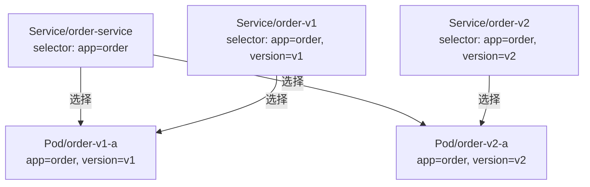

对应的 Endpoint 集合是：

```text
order-service Endpoint
├── order-v1-a：10.0.2.20:8080
└── order-v2-a：10.0.2.21:8080

order-v1 Endpoint
└── order-v1-a：10.0.2.20:8080

order-v2 Endpoint
└── order-v2-a：10.0.2.21:8080
```

因此这里的关系不是“Service 包含 Service”，而是“多个 Service 使用不同 Selector 观察同一批 Pod”。

然后把 `HTTPRoute` 附加到客户端访问的 `order-service`：

```yaml
apiVersion: gateway.networking.k8s.io/v1
kind: HTTPRoute
metadata:
  name: order-route
  namespace: default
spec:
  parentRefs:
    - group: ""
      kind: Service
      name: order-service
  rules:
    # 对齐 Sidecar 示例的第一条规则：x-user=jason 进入 v2。
    - matches:
        - headers:
            - name: x-user
              type: Exact
              value: jason
      backendRefs:
        - name: order-v2
          port: 80
    # 没有 matches，作为其余请求的默认规则，进入 v1。
    - backendRefs:
        - name: order-v1
          port: 80
```

这里最容易混淆的是 `parentRefs` 和 `backendRefs`。它们不是同一种引用：

```text
parentRefs：这条 HTTPRoute 挂在哪个入口上，对谁的请求生效
backendRefs：规则匹配以后，代理最终选择哪个后端
```

本例中：

```yaml
parentRefs:
  - kind: Service
    name: order-service
```

表示：这条 HTTPRoute 附加到 `Service/order-service`。只有原始目标为 `order-service` 的请求才进入这组规则。

这里的 `group: ""` 表示 Kubernetes 核心 API Group，`kind: Service` 明确说明 Parent 是：

```text
Service/default/order-service
```

它不是直接挂载到 `Gateway/default/order-waypoint`。HTTPRoute、目标 Service 和 Waypoint 通过两次引用关联：

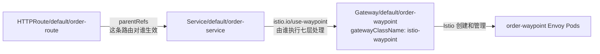

所以完整关系是：

```text
HTTPRoute.parentRefs
    → 挂到 order-service

order-service.metadata.labels[istio.io/use-waypoint]
    → 选择 order-waypoint

Istiod
    → 把 order-service 对应的 HTTPRoute 下发给 order-waypoint Envoy
```

如果写成下面这样，才表示 HTTPRoute 直接挂载到一个 Gateway Listener：

```yaml
parentRefs:
  - group: gateway.networking.k8s.io
    kind: Gateway
    name: app-gateway
    sectionName: http
```

两种 Parent 的含义不同：

| `parentRefs.kind` | 路由作用位置 | 常见场景 |
| --- | --- | --- |
| `Service` | 发往这个 Service 的网格内部流量 | Ambient Waypoint、Gateway API for Mesh |
| `Gateway` | 指定 Gateway 的 Listener | Ingress/Egress 南北流量 |

而：

```yaml
backendRefs:
  - name: order-v2
    port: 80
```

表示：请求已经进入 Waypoint 并匹配 `x-user=jason` 后，Waypoint 把最终 Backend 改成 `Service/order-v2`。

完整过程是：

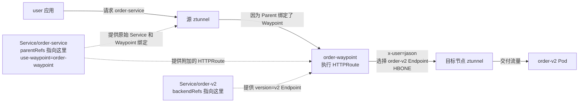

图中实线是业务流量，虚线是 Service、路由和 Endpoint 发现关系。Kubernetes Service 是逻辑选择对象，不是一个真正接收并再次发出数据包的代理进程。

所以 `Service/order-v2` 不需要配置 `istio.io/use-waypoint: order-waypoint`，这一次请求也会经过 Waypoint。原因不是 `order-v2` 自己绑定了 Waypoint，而是：

```text
请求最初访问的是 order-service
→ order-service 绑定了 order-waypoint
→ 请求先进入 Waypoint
→ Waypoint 执行 HTTPRoute 后才选择 order-v2
```

Waypoint 选择 `order-v2` 后，会根据 Istiod 下发的 `order-v2` Endpoint 直接建立到目标工作负载的 HBONE 路径，不需要重新从头执行一次 `use-waypoint` 选择。

但是，如果应用一开始就直接请求：

```text
order-v2.default.svc.cluster.local
```

路径会变成：

```text
应用 → 源 ztunnel → order-v2 Endpoint → 目标 ztunnel → v2 Pod
```

由于原始目标不是 `order-service`，附加在 `order-service` 上的 HTTPRoute 不会生效；`order-v2` 又没有绑定 Waypoint，因此这个直接请求会绕过 `order-waypoint` 的七层处理。

`use-waypoint` 是流量路径选择，不是访问控制。如果不允许业务应用直接访问 `order-v1`、`order-v2`，应再使用 `AuthorizationPolicy` 限制版本 Service 只能接受来自 Waypoint 身份的请求，而不能只依靠“不告诉调用方 Service 名称”。

两种模式的对应关系如下：

| 业务含义 | Sidecar 模式 | Ambient Waypoint |
| --- | --- | --- |
| 客户端访问的稳定入口 | `order-service` | `order-service` |
| v1 实例分组 | `DestinationRule subset: v1` | `Service/order-v1` |
| v2 实例分组 | `DestinationRule subset: v2` | `Service/order-v2` |
| `x-user=jason` 的匹配 | `VirtualService.http.match.headers` | `HTTPRoute.rules.matches.headers` |
| 匹配后的目标 | `destination.host + subset: v2` | `backendRefs: order-v2` |
| 默认目标 | `destination.host + subset: v1` | `backendRefs: order-v1` |

最终业务行为相同：

```text
客户端调用 order-service
    ↓
order-waypoint 执行 HTTPRoute
    ├── x-user=jason → order-v2 Service → version=v2 Pod
    └── 其他请求     → order-v1 Service → version=v1 Pod
```

以 `x-user: jason` 为例，选择过程是：

1. 客户端只知道并访问 `order-service.default.svc.cluster.local`。
2. ztunnel 发现目标 `order-service` 绑定了 `order-waypoint`，先把请求送到 Waypoint，而不是直接从 `order-service` 的所有 Endpoint 中选 Pod。
3. Waypoint 找到附加在 `order-service` 上的 `HTTPRoute`。
4. Header 匹配 `jason` 后，`backendRefs` 把实际后端改为平级的 `Service/order-v2`。
5. Waypoint 从 `order-v2` 的 Endpoint 中选择 `version=v2` Pod。

如果请求没有匹配第一条规则，第二条默认规则会把实际后端改为 `Service/order-v1`。

这也说明 Sidecar 模式的 `VirtualService + DestinationRule subset` 不能原样复制到 Waypoint。需要把同一个业务意图翻译成 Gateway API 的 Route 和可引用 Backend。

### 5.1 与正常升级过程的关系

可以对应，但要先区分滚动升级和灰度升级。

#### 5.1.1 普通 RollingUpdate

最简单的 Kubernetes 滚动升级通常只有一个 Deployment 和一个 Service：

```text
Deployment/order
├── 旧 ReplicaSet → v1 Pod，逐渐减少
└── 新 ReplicaSet → v2 Pod，逐渐增加

Service/order-service
└── selector: app=order
    ├── v1 Pod
    └── v2 Pod
```

Kubernetes 按 `maxSurge`、`maxUnavailable` 逐步替换 Pod。升级期间 Service 可能同时选择 v1、v2，但不会根据 `x-user` 判断用户，也不能保证 `jason` 一定进入 v2。这种方式解决的是“逐步替换实例”，不是“按业务条件分流”。

#### 5.1.2 灰度或蓝绿升级

本文的 `order-v1`、`order-v2` 更接近灰度发布，通常让两个版本独立运行：

```text
Deployment/order-v1                 Deployment/order-v2
selector: app=order,version=v1       selector: app=order,version=v2
        ↓                                    ↓
Service/order-v1                    Service/order-v2
        └──────────── HTTPRoute ─────────────┘
```

一个典型升级过程是：

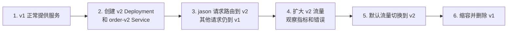

各阶段与资源的关系是：

| 阶段 | `order-v1` | `order-v2` | HTTPRoute 默认目标 |
| --- | --- | --- | --- |
| 升级前 | 有 Endpoint | 不存在 | `order-v1` |
| 灰度开始 | 有 Endpoint | 有少量 Endpoint | `jason → v2`，其他 → v1 |
| 扩大灰度 | 有 Endpoint | 增加 Endpoint | 可使用权重逐步增加 v2 |
| 全量切换 | 暂时保留，便于回滚 | 承担全部流量 | `order-v2` |
| 升级结束 | 缩容或删除 | 正常运行 | `order-v2` |

因此三个 Service 的职责是：

```text
order-service：客户端始终访问的稳定名称，也是 HTTPRoute 的 parent
order-v1：灰度期间可以单独选择的 v1 Backend
order-v2：灰度期间可以单独选择的 v2 Backend
```

`order-service`、`order-v1`、`order-v2` 始终是平级 Service；所谓“稳定入口”和“版本 Backend”描述的是它们在升级流程中的用途，不是 Kubernetes 对象的包含关系。

还要注意：`order-service` 的 `app=order` Selector 会同时选择 v1、v2。如果请求没有经过绑定的 Waypoint，或者 HTTPRoute 没有生效，普通 Kubernetes Service 转发可能直接把请求分配给任一版本。需要精确灰度时，应确认目标确实经过 Waypoint，并检查 HTTPRoute 的 `Accepted`、`ResolvedRefs` 状态。

## 6. 流量为什么会进入 ztunnel

### 6.1 `istio-cni-node` 的职责

Ambient 必须使用 Istio CNI。每个 Node 上的 `istio-cni-node` 负责：

1. 识别哪些 Pod 加入 Ambient。
2. 进入 Pod 网络命名空间并建立重定向规则。
3. 与本节点 ztunnel 协作，让 ztunnel 持有业务 Pod 网络命名空间中的监听 Socket。

它不是数据面代理，不会亲自转发每个请求。

### 6.2 Pod 创建时的准备过程

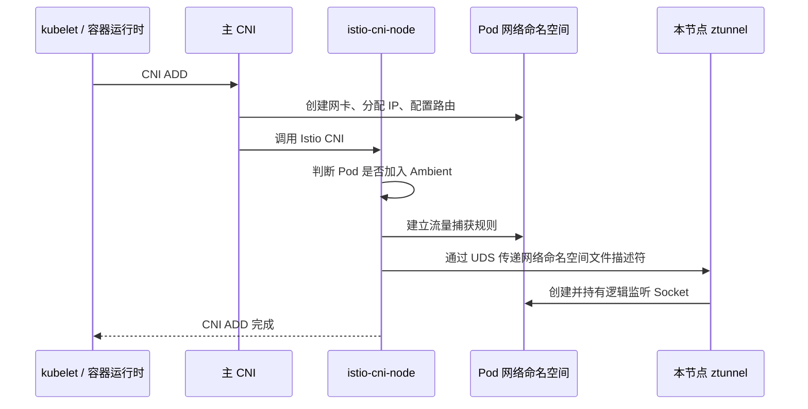

主 CNI 负责 Pod 网络，Istio CNI 只增加到 ztunnel 的流量捕获。

### 6.3 三个端口

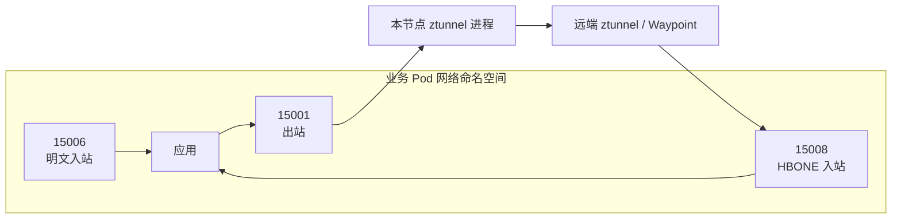

监听 Socket 位于业务 Pod 的网络命名空间中，但真正处理它们的是 Node 上同一个 ztunnel 进程。业务 Pod 内没有隐藏的 ztunnel 容器。

Istio 使用路由和数据包标记区分未捕获与已经由 ztunnel 处理的流量，避免重复重定向。

## 7. 不使用 Waypoint 的东西流量

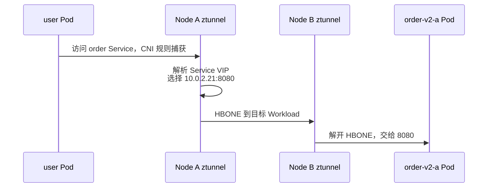

这条路径提供：

1. 工作负载身份。
2. mTLS/HBONE。
3. 四层负载均衡和授权。
4. 四层指标。

它不提供 HTTP 路径路由、Header 匹配、HTTP 重试或 JWT Claim 等七层能力。

ztunnel 选择的是目标 Pod Endpoint `10.0.2.21`，不是 Node B 的 IP：

```text
ztunnel 选择目标 Pod IP
    ↓
主 CNI 根据 Pod IP 路由到 Node B
    ↓
Node B 的 ztunnel 接收 10.0.2.21:15008
    ↓
交付给 order 应用 10.0.2.21:8080
```

## 8. 使用 Waypoint 的流量

### 8.1 东西流量经过 order-waypoint

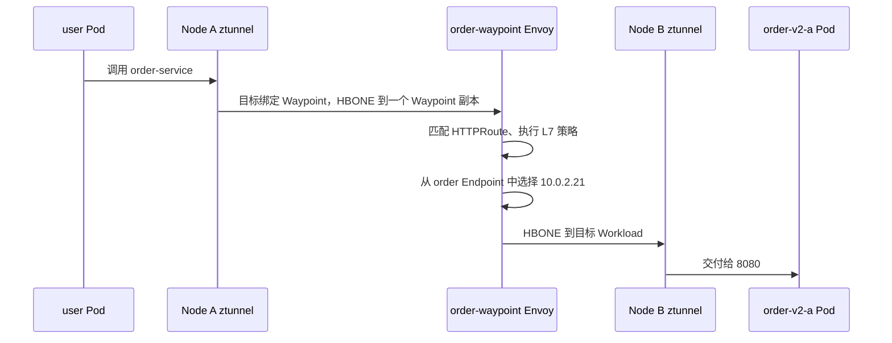

这里有两次负载均衡：

1. 源 ztunnel 从 `order-waypoint` 的就绪 Endpoint 中选择一个 Waypoint Pod。
2. Waypoint Envoy 从 `order-service` 的就绪 Endpoint 中选择业务 Pod。

### 8.2 南北入口经过 user-waypoint

入口 Gateway 默认不会仅因为 Service 配置了 `istio.io/use-waypoint` 就自动经过 Waypoint。若当前版本支持并启用了入口 Waypoint 路由，需要显式配置：

```yaml
apiVersion: v1
kind: Service
metadata:
  name: user-service
  namespace: default
  labels:
    istio.io/use-waypoint: user-waypoint
    istio.io/ingress-use-waypoint: "true"
```

同时确认控制面启用了相应能力，例如 `ENABLE_INGRESS_WAYPOINT_ROUTING`。

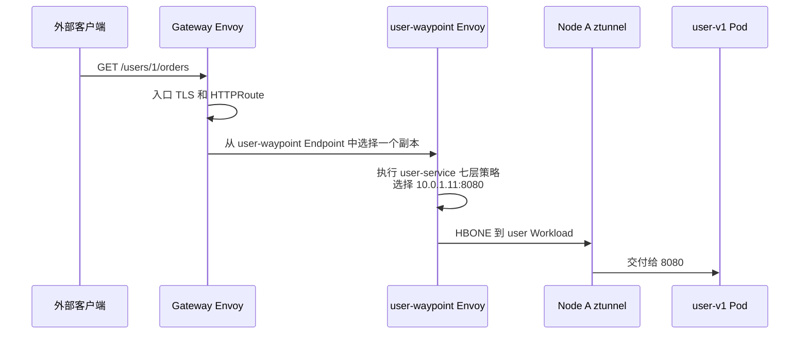

如果没有启用入口 Waypoint 路由，Gateway Envoy 会直接选择 user Endpoint，再把流量送往目标 ztunnel/Workload，路径中没有 user-waypoint。

## 9. 流量在哪一层通过什么方法转发

| 阶段 | 位置 | 方法 | 是否理解 HTTP |
| --- | --- | --- | --- |
| 外部流量进入 Gateway | 云 LB、Service、Node | LoadBalancer/NodePort、kube-proxy 或 eBPF | 否 |
| Gateway 入口路由 | Gateway Envoy | Listener、Route、Cluster、Endpoint | 是 |
| Ambient 捕获 | Pod 网络命名空间 | Istio CNI、路由和监听 Socket | 否 |
| Ambient 四层转发 | ztunnel | Workload 信息、HBONE/mTLS、四层负载均衡 | 否 |
| Ambient 七层转发 | Waypoint Envoy | HTTPRoute、Envoy Cluster 和 Endpoint | 是 |
| 跨节点送达 | Node、主 CNI | Pod IP 路由、隧道或底层网络 | 否 |

完整链路是：

```text
应用连接 Service
→ Istio CNI 规则把连接交给 ztunnel
→ ztunnel 判断目标是否绑定 Waypoint
→ 无 Waypoint：ztunnel 选择业务 Endpoint
→ 有 Waypoint：先选择 Waypoint，Waypoint 再选择业务 Endpoint
→ HBONE/mTLS 建立安全连接
→ 主 CNI 根据目标 Pod IP 跨节点送达
→ 目标 ztunnel 交付给业务端口
```

## 10. 与 Sidecar 模式的区别

| 项目 | Sidecar | Ambient |
| --- | --- | --- |
| 业务 Pod | 应用 + Envoy | 只有应用 |
| 四层数据面 | 每个 Pod 的 Envoy | 每个 Node 的 ztunnel |
| 七层数据面 | 每个 Pod 的 Envoy | 按需部署 Waypoint Envoy |
| 流量捕获 | `istio-init` 或 Istio CNI 配置 iptables | Istio CNI 与网络命名空间重定向 |
| 代理间连接 | Istio mTLS | HBONE 上的 mTLS |
| 七层路由 API | 常用 VirtualService | Waypoint 以 Gateway API Route 为主 |
| 扩缩容 | 随业务 Pod 一起扩缩容 | ztunnel 随 Node；Waypoint 独立扩缩容 |

## 11. 排查方法

```bash
# 哪些 Namespace 加入 Ambient
kubectl get namespace --show-labels

# 每个 Node 是否存在 ztunnel 和 Istio CNI
kubectl get pod -n istio-system -l app=ztunnel -o wide
kubectl get pod -n istio-system -l k8s-app=istio-cni-node -o wide

# Service 是否绑定 Waypoint
kubectl get service user-service order-service -n default --show-labels

# Waypoint Gateway 和自动生成的资源
kubectl get gateway -n default
kubectl get deployment,service,endpointslice -n default \
  -l gateway.networking.k8s.io/gateway-name=order-waypoint

# 查看 ztunnel 日志
kubectl logs -n istio-system daemonset/ztunnel
```

排查顺序：

1. 确认 Namespace 或 Pod 是否加入 Ambient。
2. 确认目标 Service 绑定的是哪个 Waypoint。
3. 确认 Waypoint Gateway 已就绪并存在健康 Endpoint。
4. 确认 `istio-cni-node` 已为 Pod 建立重定向。
5. 再检查 HTTPRoute、授权和目标业务 Endpoint。

## 12. 总结

Ambient 模式可以压缩成四层：

```text
服务模型：Service → Workload → Endpoint
七层模型：Gateway API Route → Waypoint Envoy
四层模型：ztunnel → HBONE/mTLS → 目标 ztunnel
网络模型：Istio CNI 捕获，主 CNI 根据 Pod IP 送达
```

阅读 Ambient 配置时依次回答：

1. 源和目标 Workload 是谁？
2. 目标是 Service 还是直接 Workload？
3. 目标是否绑定 Waypoint？
4. 是 ztunnel 直接选择业务 Endpoint，还是 Waypoint 选择？
5. 入口 Gateway 是否启用了经过 Waypoint？
6. 选定 Pod IP 后，哪个 Node/CNI 路径负责送达？

## 13. 参考资料

1. [Istio Ambient 架构](https://istio.io/latest/zh/docs/ambient/architecture/)
2. [Ambient 流量重定向](https://istio.io/latest/zh/docs/ambient/architecture/traffic-redirection/)
3. [Waypoint](https://istio.io/latest/zh/docs/ambient/usage/waypoint/)
4. [Istio CNI](https://istio.io/latest/zh/docs/setup/additional-setup/cni/)
5. [Kubernetes Gateway API](https://gateway-api.sigs.k8s.io/)
