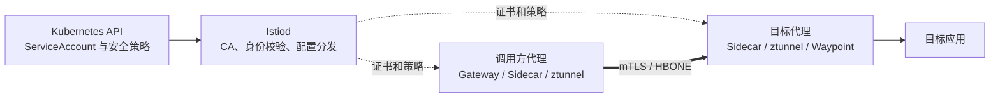
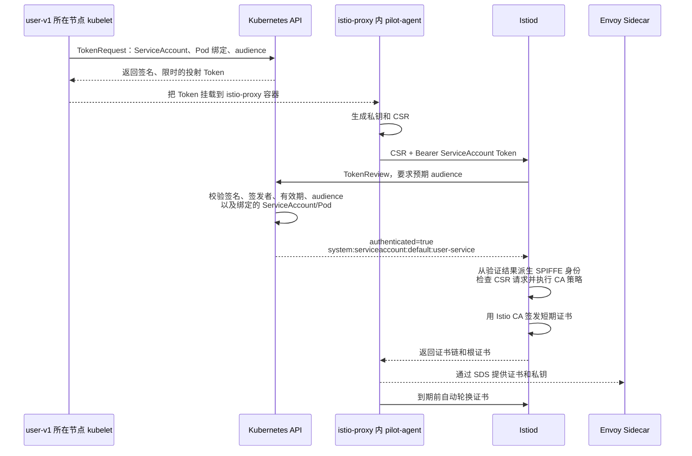
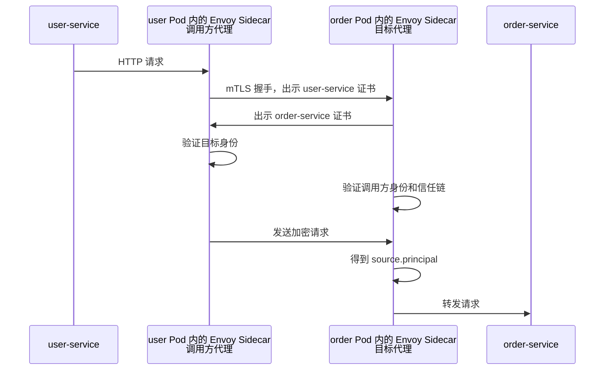
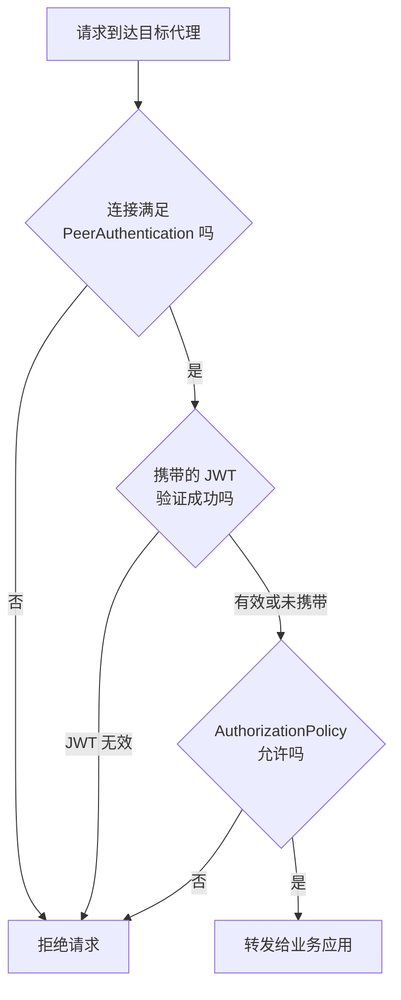

Istio 安全不是一个孤立功能，而是一条连续的处理链：

```text
Kubernetes ServiceAccount
  → Istio 工作负载身份和 X.509 证书
  → mTLS 验证服务身份
  → JWT 验证最终用户身份
  → AuthorizationPolicy 决定是否允许请求
```

本文使用下面的调用关系逐步解释：

```text
外部用户 → Ingress Gateway → user-service → order-service
```

<!-- more -->

## 1. Istio 安全要回答什么问题

1. **通信是否保密**：网络中的第三方能否读取或篡改数据？
2. **调用方是谁**：请求来自哪个工作负载，或者哪个最终用户？
3. **调用方能做什么**：这个身份能否访问指定服务、方法和路径？

| 问题 | Istio 能力 |
| --- | --- |
| 流量加密、工作负载认证 | mTLS、工作负载证书、`PeerAuthentication` |
| 最终用户认证 | JWT、`RequestAuthentication` |
| 访问控制 | `AuthorizationPolicy` |

## 2. 安全架构



Istiod 负责签发工作负载证书，并把认证、授权配置下发给数据面；Envoy、ztunnel 和 Waypoint 是策略执行点，真正检查连接或请求并允许、拒绝流量。[Istio 安全架构](https://istio.io/latest/zh/docs/concepts/security/)

## 3. 工作负载身份从哪里来

在 Kubernetes 中，Istio 默认用 Pod 的 ServiceAccount 表示工作负载身份：

```yaml
apiVersion: v1
kind: Pod
metadata:
  name: user-v1
  namespace: default
spec:
  serviceAccountName: user-service
```

它对应的身份可以表达为：

```text
spiffe://cluster.local/ns/default/sa/user-service
```

`cluster.local` 是信任域，`default` 是命名空间，`user-service` 是 ServiceAccount。这个身份描述的是工作负载，不是 Kubernetes Service，也不是登录系统的最终用户。一个 Service 后面的多个 Pod 通常使用相同 ServiceAccount，因此可以共享同一种服务身份。

## 4. 工作负载证书如何签发

### 4.1 Sidecar 模式

#### 4.1.1 `istio-agent` 在哪个 Pod 中

`istio-agent` 不是一个独立 Pod，也不是另一个 Sidecar 容器。在 Sidecar 模式中，注入后的业务 Pod 通常包含：

```text
Pod/user-v1
├── user 容器
│   └── 业务进程
└── istio-proxy 容器
    └── pilot-agent 进程
        ├── 启动和管理 Envoy
        ├── 生成私钥和 CSR
        ├── 向 Istiod 申请、轮换工作负载证书
        └── 通过 SDS 把证书提供给 Envoy
```

Istio 文档中的 `istio-agent` 通常表示 `pilot-agent` 在工作负载本地承担的代理管理和安全代理能力。`istio-proxy` 是容器名，`pilot-agent` 是容器中的进程，Envoy 是由它启动和管理的数据面进程。

可以通过下面的命令观察：

```bash
kubectl get pod user-v1 -n default \
  -o jsonpath='{.spec.containers[*].name}'

kubectl exec user-v1 -n default -c istio-proxy -- ps
```

第一个命令通常会看到业务容器和 `istio-proxy`，不会看到名为 `istio-agent` 的单独 Pod。

#### 4.1.2 证书申请和身份校验过程



各组件的职责是：

1. kubelet 通过 Kubernetes TokenRequest 机制，为指定 Pod 投射短期 ServiceAccount Token。
2. `istio-proxy` 容器中的 `pilot-agent` 生成私钥和 CSR，私钥通常不离开工作负载。
3. pilot-agent 把 CSR 和 Token 发给 Istiod。它不能只发送一个自己填写的 ServiceAccount 名称。
4. Istiod 调用 Kubernetes TokenReview API 验证 Token，并从验证结果获得 Namespace 和 ServiceAccount 身份。
5. Istiod 根据已经验证的身份签发短期证书，证书身份类似 `spiffe://cluster.local/ns/default/sa/user-service`。
6. Envoy 通过 SDS 动态获得证书，用它建立 mTLS。

这不是 Kubernetes `certificates.k8s.io` CSR 资源的申请流程。Istio 工作负载通常直接调用 Istiod 的证书服务，Kubernetes ServiceAccount Token 用于证明身份。

#### 4.1.3 ServiceAccount 能不能伪造

需要区分“伪造名称”和“获得合法身份凭据”。

仅在请求里写下面的字符串没有用：

```text
serviceAccount = order-service
```

Istiod 不会相信这个字段。申请者必须提供 Kubernetes API Server 能通过 TokenReview 验证的 Token。投射 Token 通常包含或约束：

1. Kubernetes API Server 的签名和签发者。
2. Token 的过期时间。
3. 用途对应的 audience，例如 Istio CA。
4. ServiceAccount 的 Namespace、名称和 UID。
5. Token 所绑定 Pod 的名称和 UID。

所以攻击者不能仅靠修改 CSR、Pod Label 或 HTTP 参数，把自己声明成另一个 ServiceAccount。

但是，下面两种情况仍然可以造成身份冒用：

1. **ServiceAccount Token 被窃取**：持有者可能在 Token 过期前冒用该身份。
2. **攻击者有权在该 Namespace 创建 Pod/Deployment**：在没有额外准入限制时，能够创建工作负载的人通常可以把 `serviceAccountName` 指向该 Namespace 中权限更高的 ServiceAccount，并让 kubelet 为这个新 Pod 投射一个合法 Token。

第二种情况不是绕过 TokenReview，因为得到的 Token 本身就由 Kubernetes 合法签发。Istio 信任 Kubernetes 的认证结果，无法判断“这个用户本来不应该创建使用该 ServiceAccount 的 Pod”。

安全边界因此是：

```text
谁能创建或修改 Pod/Deployment
    ↓
谁可能让 Pod 使用某个 ServiceAccount
    ↓
谁可能获得该 ServiceAccount 对应的 Istio 工作负载身份
```

应采取以下限制：

1. 严格限制 Namespace 中创建和修改 Pod、Deployment、Job 等工作负载的 RBAC 权限。
2. 不把不同信任级别的应用放进同一个可由同一批用户管理的 Namespace。
3. 为每类工作负载使用独立、最小权限的 ServiceAccount，不使用权限过大的 `default` ServiceAccount。
4. 使用 ValidatingAdmissionPolicy、OPA Gatekeeper 或 Kyverno 等准入策略，限制哪些工作负载可以引用哪些 ServiceAccount。
5. 使用短期、绑定 Pod、限定 audience 的投射 Token，并保护节点、容器和调试权限，降低 Token 被读取的风险。

Istio 的工作负载身份建立在 Kubernetes 身份之上：Istiod 负责验证 Token 和签发网格证书，Kubernetes RBAC 与准入策略负责决定谁有资格创建使用该 ServiceAccount 的工作负载。[Istio 身份和证书流程](https://istio.io/latest/zh/docs/concepts/security/)、[Kubernetes ServiceAccount](https://kubernetes.io/zh-cn/docs/concepts/security/service-accounts/)、[TokenReview API](https://kubernetes.io/docs/reference/kubernetes-api/authentication-resources/token-review-v1/)

### 4.2 Ambient 模式

Ambient 模式下，业务 Pod 中没有 Sidecar。节点 ztunnel 代表工作负载建立安全隧道，但不同工作负载仍使用不同身份和证书，而不是整个节点共用一个身份。

## 5. PeerAuthentication：认证连接方

`PeerAuthentication` 控制目标工作负载如何接受 mTLS 连接：

```yaml
apiVersion: security.istio.io/v1
kind: PeerAuthentication
metadata:
  name: order-strict
  namespace: default
spec:
  selector:
    matchLabels:
      app: order-service
  mtls:
    mode: STRICT
```

| 模式 | 含义 |
| --- | --- |
| `STRICT` | 只接受 Istio mTLS |
| `PERMISSIVE` | 同时接受明文和 mTLS，常用于迁移期 |
| `DISABLE` | 不在该范围要求 Istio mTLS |

策略可以定义在网格、命名空间或工作负载范围，越具体的策略优先级越高。Ambient 模式不支持把已捕获的工作负载流量设为 `DISABLE`，因为 ztunnel 之间使用 HBONE 和 mTLS。

## 6. Auto mTLS 与 DestinationRule

这里的“代理”是 **Istio 数据面中替业务应用收发流量的组件**，不是 `user-service` 或 `order-service` 本身。两种数据面模式中的代理不同：

| 模式 | user 调用方一侧的代理 | order 目标一侧的代理 |
| --- | --- | --- |
| Sidecar | user Pod 内注入的 Envoy Sidecar | order Pod 内注入的 Envoy Sidecar |
| Ambient | user Pod 所在节点的 ztunnel | order Pod 所在节点的 ztunnel；需要 L7 能力时，请求先经过 order 的 Waypoint Envoy |

以 Sidecar 模式的 `user-service → order-service` 为例：

```text
user 应用
→ user Pod 内的 Envoy Sidecar（调用方代理）
→ mTLS 网络连接
→ order Pod 内的 Envoy Sidecar（目标代理）
→ order 应用
```

“上游”是 Envoy 术语，表示当前代理准备访问的目标服务。为了避免和业务中的上下游关系混淆，下面直接称为“目标服务”。

两者控制的方向不同：

```text
PeerAuthentication：服务端愿意接受什么连接
DestinationRule.trafficPolicy.tls：调用方一侧的 Istio 代理连接目标服务时，采用哪种 TLS 模式
```

在 Sidecar 模式中，“调用方一侧的 Istio 代理”就是调用方 Pod 内的 Envoy Sidecar。例如 user 调用 order 时，它指 user Pod 内的 Envoy，而目标一侧是 order Pod 内的 Envoy。启用 Auto mTLS 后，如果目标是网格内工作负载且没有显式冲突配置，Istio 会让调用方代理自动使用 mTLS。`PeerAuthentication: STRICT` 则确保目标端拒绝明文。

不要仅为了启用网格内部 mTLS，就给每个服务重复编写 `DestinationRule`。只有需要覆盖自动行为、访问外部 TLS 服务或设置特殊 TLS 参数时才显式配置。[Istio TLS 配置](https://istio.io/latest/zh/docs/ops/configuration/traffic-management/tls-configuration/)

## 7. 一次 mTLS 请求怎样完成认证



目标代理可以从证书中得到：

```text
cluster.local/ns/default/sa/user-service
```

这就是授权策略中 `source.principal` 的来源。Istio 的安全命名还会让客户端确认目标证书身份符合预期，避免连接到持有另一个有效证书的错误工作负载。

## 8. RequestAuthentication：验证最终用户 JWT

mTLS 证明“哪个工作负载发起连接”。若还要识别登录用户或外部调用方，需要验证 JWT：

```yaml
apiVersion: security.istio.io/v1
kind: RequestAuthentication
metadata:
  name: order-jwt
  namespace: default
spec:
  selector:
    matchLabels:
      app: order-service
  jwtRules:
    - issuer: "https://login.example.com"
      jwksUri: "https://login.example.com/.well-known/jwks.json"
      audiences:
        - order-api
```

验证成功后，代理可以得到 `request.auth.principal` 和 `request.auth.claims`。

需要特别注意：`RequestAuthentication` 主要验证“请求中已经携带的 JWT”。默认情况下，没有 JWT 的请求仍可能通过，无效 JWT 则会被拒绝。若要求必须登录才能访问，还要配合 `AuthorizationPolicy` 要求 `requestPrincipals` 存在。

## 9. AuthorizationPolicy：决定能不能访问

下面只允许指定 Gateway 身份访问 `order-service`，同时要求请求已通过 JWT 认证：

```yaml
apiVersion: security.istio.io/v1
kind: AuthorizationPolicy
metadata:
  name: allow-gateway-user
  namespace: default
spec:
  selector:
    matchLabels:
      app: order-service
  action: ALLOW
  rules:
    - from:
        - source:
            principals:
              - "cluster.local/ns/default/sa/app-gateway-istio"
            requestPrincipals:
              - "*"
      to:
        - operation:
            methods: ["GET"]
            paths: ["/orders/*"]
```

一条规则主要由三部分组成：

1. `from`：谁发起请求，例如 mTLS 工作负载身份、命名空间、JWT 用户。
2. `to`：要访问什么，例如端口、HTTP 方法和路径。
3. `when`：满足哪些额外条件，例如 JWT Claim 或请求头。

`source.principal` 来自 mTLS 证书；`request.auth.principal` 来自 JWT。前者回答“哪个服务在调用”，后者回答“这个服务代表哪个用户调用”。

### 9.1 策略求值顺序

```text
CUSTOM → DENY → ALLOW → 默认结果
```

1. 匹配 `CUSTOM` 时，先交给外部授权服务。
2. 匹配任一 `DENY` 时拒绝。
3. 如果作用范围内存在 `ALLOW` 策略，只有匹配至少一条 `ALLOW` 的请求才允许。
4. 如果完全没有适用的 `ALLOW` 策略，则不会因为缺少 `ALLOW` 而默认拒绝。
5. `AUDIT` 用于标记应审计的请求，本身不改变允许或拒绝结果。

因此，添加第一条 `ALLOW` 策略，就为它的作用范围建立了“未匹配即拒绝”的基线。

## 10. 四层与七层策略在哪里执行

| 数据面 | 能执行的策略 | 说明 |
| --- | --- | --- |
| Sidecar Envoy | 四层和七层 | 代理位于每个业务 Pod 中 |
| Gateway Envoy | 四层和七层 | 处理经过网关的流量 |
| Ambient ztunnel | 四层 | 识别源/目标身份、端口和连接 |
| Ambient Waypoint | 七层 | 解析 HTTP 方法、路径、Header、JWT 等 |

只根据源 ServiceAccount 和目标端口限制访问，ztunnel 可以执行；若策略需要匹配 `GET /orders/*` 或 JWT Claim，Ambient 流量必须经过 Waypoint 才能执行七层策略。

## 11. 把认证与授权串成一次请求



以“登录用户通过 Gateway 查询订单”为例：

1. Gateway 验证外部用户 JWT，得到最终用户身份。
2. Gateway 使用自己的工作负载证书与 `order-service` 建立 mTLS。
3. order 侧代理从 mTLS 得到 Gateway 的工作负载身份。
4. order 侧代理从 JWT 得到最终用户身份和 Claim。
5. `AuthorizationPolicy` 同时检查服务身份、用户身份、HTTP 方法和路径。
6. 全部满足后才把请求转发给业务进程。

## 12. 容易混淆的地方

1. **mTLS 不等于授权**：它证明双方身份并加密通信，但不会自动决定某个身份能否访问 `/orders/*`。
2. **ServiceAccount 不等于 Kubernetes Service**：前者是工作负载身份来源，后者是服务发现抽象。
3. **RequestAuthentication 不等于强制登录**：要拒绝缺少 JWT 的请求，还需授权策略。
4. **TLS 终止不等于后续链路明文**：Gateway 可终止外部 TLS，再与网格工作负载建立另一段 Istio mTLS。
5. **`PERMISSIVE` 适合迁移期**：它仍接受明文连接，不应被误认为严格安全状态。
6. **七层条件必须在七层代理处执行**：Ambient 的 ztunnel 无法独自匹配 HTTP 路径或 JWT Claim。

## 13. 总结

```text
身份层：ServiceAccount → 工作负载证书
认证层：mTLS 验证工作负载，JWT 验证最终用户
授权层：AuthorizationPolicy 根据身份和请求属性作出决定
```

排查安全问题也按这个顺序：先确认工作负载身份和证书，再确认认证策略，最后检查授权策略以及策略实际由哪个数据面组件执行。

## 14. 参考资料

1. [Istio 安全概念](https://istio.io/latest/zh/docs/concepts/security/)
2. [认证策略任务](https://istio.io/latest/zh/docs/tasks/security/authentication/authn-policy/)
3. [PeerAuthentication API](https://istio.io/latest/zh/docs/reference/config/security/peer_authentication/)
4. [RequestAuthentication API](https://istio.io/latest/zh/docs/reference/config/security/request_authentication/)
5. [AuthorizationPolicy API](https://istio.io/latest/zh/docs/reference/config/security/authorization-policy/)
