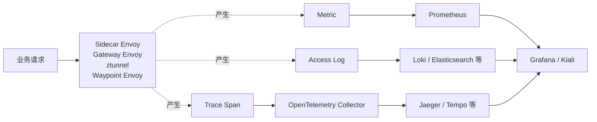
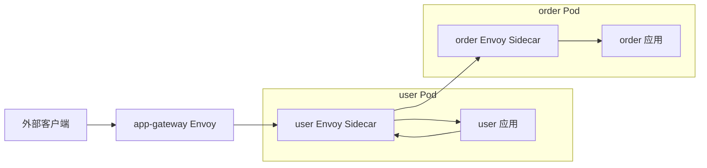
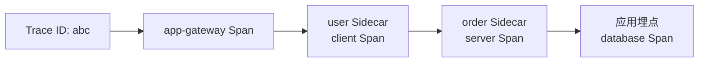
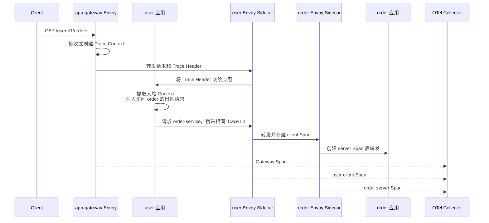
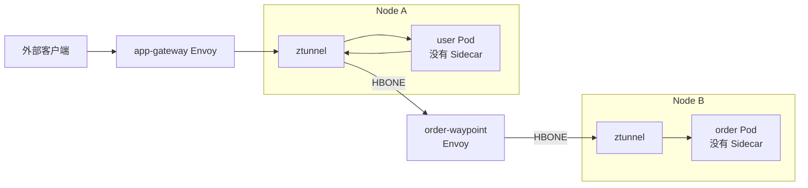
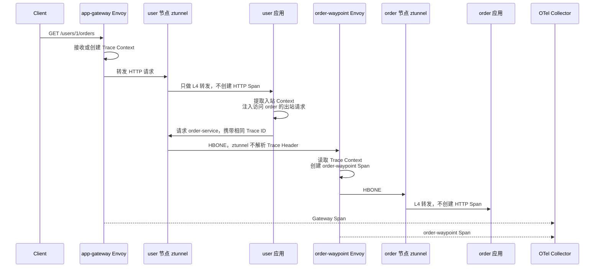

Istio 可观测性不是一个监控界面，而是一条数据链：

```text
数据面代理观察流量
→ 产生 Metric、Access Log、Trace Span
→ Prometheus、日志系统、OpenTelemetry Collector 采集
→ Grafana、Kiali、Jaeger、Tempo 等系统展示
```

Sidecar 和 Ambient 的主要区别不是使用不同的可观测性后端，而是**观察请求的代理不同**：

| 模式 | 观察请求的代理 | 默认能看到什么 |
| --- | --- | --- |
| Sidecar | 每个业务 Pod 内的 Envoy | L4 连接和 L7 HTTP 请求 |
| Ambient，仅 ztunnel | 每个节点的 ztunnel | L4 TCP 连接、字节数、源和目标工作负载身份 |
| Ambient，经过 Waypoint | ztunnel + 目标侧 Waypoint Envoy | ztunnel 的 L4 信息，加上 Waypoint 的 HTTP 指标、访问日志和 Trace |

本文继续使用同一条调用链，并分别解释两种模式：

```text
外部客户端 → app-gateway → user-service → order-service
```

<!-- more -->

## 1. 三类遥测数据分别回答什么

| 数据 | 回答的问题 | 常见用途 |
| --- | --- | --- |
| Metric（指标） | 系统是否异常，影响范围和趋势是什么 | 告警、请求量、成功率、延迟、连接数 |
| Access Log（访问日志） | 某一次请求或连接经过代理时发生了什么 | 核对路由、状态码、Endpoint、身份和耗时 |
| Trace（链路追踪） | 一次请求跨服务时，时间花在哪里 | 还原调用链、定位慢服务和错误节点 |

三类数据的粒度不同：

```text
Metric     → 大量请求的聚合结果
Access Log → 一次代理转发的记录
Trace      → 同一次请求跨越多个服务和组件的 Span 集合
```

通常按照下面的顺序排障：

```text
Metric 发现异常
→ Access Log 确认哪次转发失败
→ Trace 确认时间耗在哪一跳
→ 业务日志解释具体业务原因
```

## 2. 共用的可观测性基础

### 2.1 Istio 负责产生数据，后端负责保存数据



Istio 不替代 Prometheus、日志存储或 Trace Backend。数据面只观察经过自己的流量，因此代理部署在哪里，决定能观察到哪一层信息。

### 2.2 Metric、Access Log 与 Span 都是代理视角

代理能够知道：

- 当前连接的源和目标；
- 自己选择了哪个 Endpoint；
- 请求或连接耗时；
- 在 L7 代理中看到的 HTTP 方法、路径、状态码；
- mTLS 提供的工作负载身份。

代理不知道：

- “库存不足”之类的业务语义；
- 某个数据库 SQL 为什么慢；
- 一个入站请求在业务代码中触发了哪些并行任务。

要获得这些信息，仍然需要应用日志、OpenTelemetry SDK 或其他业务埋点。

### 2.3 Trace Context 必须由应用继续传播

Istio 的 Envoy 可以创建 Trace ID 和 Span，也会把 Trace Header 交给应用。但是当应用根据一个入站请求发起新的出站请求时，只有应用知道两次请求之间的因果关系，所以应用必须复制 Trace Context。

常见请求头包括：

```text
x-request-id
traceparent
tracestate

# 使用 Zipkin B3 时
x-b3-traceid
x-b3-spanid
x-b3-parentspanid
x-b3-sampled
x-b3-flags
```

例如 `user-service` 收到 Gateway 请求后又调用 `order-service`：

```text
app-gateway 将 traceparent 传给 user 应用
→ user 应用从入站请求提取 Trace Context
→ user 应用把 Trace Context 注入访问 order 的出站请求
→ 后续代理产生的 Span 才能归入同一个 Trace
```

如果 user 应用没有传播这些 Header，Sidecar 或 Waypoint 仍可能生成 Span，但 Trace Backend 会把它们识别为不同 Trace。[Istio 分布式追踪概览](https://istio.io/latest/docs/tasks/observability/distributed-tracing/overview/)

## 3. Sidecar 模式的可观测性

Sidecar 模式中，每个业务 Pod 都有一个 Envoy。一个服务调用会经过调用方 Sidecar 和目标 Sidecar，因此同一跳有两个代理观察点。

### 3.1 Sidecar 网络与观察点



对于 `user-service → order-service`：

```text
user Envoy 观察出站请求
order Envoy 观察入站请求
```

这里的 user Envoy、order Envoy 都是相应业务 Pod 中的 `istio-proxy` Sidecar，不是 Kubernetes Service。

### 3.2 Sidecar 如何产生指标

Sidecar Envoy 可以产生完整的 Istio HTTP 服务指标，例如：

```text
istio_requests_total
istio_request_duration_milliseconds
istio_request_bytes
istio_response_bytes
```

同一次 `user → order` 调用通常会产生两种报告视角：

```text
user Sidecar 出站观测
└── reporter="source"

order Sidecar 入站观测
└── reporter="destination"
```

例如目标侧的请求计数：

```text
istio_requests_total{
  reporter="destination",
  source_workload="user-v1",
  destination_workload="order-v1",
  destination_service_name="order-service",
  response_code="503"
} 12
```

它表示 order Sidecar 观察到来自 `user-v1` 的 12 次 `503`。

常用 PromQL：

```promql
# order-service 每秒请求量
sum(rate(istio_requests_total{
  reporter="destination",
  destination_service_name="order-service"
}[5m]))

# order-service 的 5xx 比例
sum(rate(istio_requests_total{
  reporter="destination",
  destination_service_name="order-service",
  response_code=~"5.."
}[5m]))
/
sum(rate(istio_requests_total{
  reporter="destination",
  destination_service_name="order-service"
}[5m]))
```

查询时指定 `reporter` 可以避免把调用方和目标方对同一次请求的观测重复计数。

### 3.3 Sidecar 如何产生访问日志

同一次调用会有两份主要代理日志：

```text
user Sidecar 出站日志
├── 原始目标 order-service
├── 最终选择的 order Pod 地址
├── 响应标志
└── 连接和请求耗时

order Sidecar 入站日志
├── 来源工作负载身份
├── HTTP 方法和路径
├── 返回状态码
└── 请求处理耗时
```

可以使用网格级 Telemetry 开启 Envoy Access Log：

```yaml
apiVersion: telemetry.istio.io/v1
kind: Telemetry
metadata:
  name: mesh-default
  namespace: istio-system
spec:
  accessLogging:
    - providers:
        - name: envoy
```

然后分别查看两个 Pod 中 `istio-proxy` 容器的日志：

```bash
kubectl logs <USER-POD> -n default -c istio-proxy
kubectl logs <ORDER-POD> -n default -c istio-proxy
```

访问日志描述代理看到的网络请求。例如：

```text
GET /orders/42 → 503
upstream=10.0.3.13:8080
response_flag=UF
duration=18ms
```

它能说明连接哪个 Endpoint 时失败，但不能解释 order 应用为什么返回“库存不足”。

### 3.4 Sidecar 如何产生 Trace Span

一次 `user → order` 调用会同时经过 user 的出站 Sidecar 和 order 的入站 Sidecar，因此通常会形成调用方 Span 和目标方 Span：



完整过程是：



业务代码没有埋点时，Trace 主要反映代理之间的网络耗时。要看到 user 方法执行、order 数据库查询等内部阶段，需要应用使用 OpenTelemetry SDK 创建自己的 Span。

### 3.5 Sidecar 的 Telemetry 如何选择工作负载

可以使用 `selector` 将配置应用到 order Pod 内的 Sidecar：

```yaml
apiVersion: telemetry.istio.io/v1
kind: Telemetry
metadata:
  name: order-telemetry
  namespace: default
spec:
  selector:
    matchLabels:
      app: order
  accessLogging:
    - providers:
        - name: envoy
  tracing:
    - providers:
        - name: otel-tracing
      randomSamplingPercentage: 10
```

这里的 `selector` 选择的是带有 `app=order` 的工作负载，对应配置最终下发给这些 Pod 内的 Envoy Sidecar。

### 3.6 Sidecar 的指标抓取

Sidecar 模式中的 `pilot-agent` 支持将应用指标与 Sidecar 指标合并到一个 Prometheus 抓取入口。排查时仍要区分：

```text
应用指标 → 业务代码或 SDK 产生
Istio 指标 → Envoy Sidecar 观察流量产生
```

合并抓取只是采集方式，不表示指标由同一个进程产生。

## 4. Ambient 模式的可观测性

Ambient 必须再分成两层：

```text
安全覆盖层：ztunnel
→ L4 TCP 指标、连接日志、工作负载身份

七层处理层：Waypoint Envoy
→ HTTP 指标、HTTP Access Log、Trace Span
```

### 4.1 Ambient 网络与观察点

示例只为 `order-service` 配置 `order-waypoint`：



观察点变成：

```text
app-gateway Envoy → 观察入口 HTTP 请求
Node A ztunnel     → 观察 user 发起的 L4 连接
order-waypoint     → 观察发往 order-service 的 HTTP 请求
Node B ztunnel     → 观察进入 order Pod 的 L4 连接
```

业务 Pod 内没有 Envoy，所以不能再去 `user Pod -c istio-proxy` 查日志或 Span。

### 4.2 只有 ztunnel 时能看到什么指标

ztunnel 不解析 HTTP 方法、路径和响应码。只有 ztunnel 时，Istio 主要提供 L4 TCP 指标：

```text
istio_tcp_connections_opened_total
istio_tcp_connections_closed_total
istio_tcp_sent_bytes_total
istio_tcp_received_bytes_total
```

这些指标仍然可以携带工作负载身份和服务信息，例如：

```text
istio_tcp_connections_opened_total{
  reporter="source",
  connection_security_policy="mutual_tls",
  source_workload="user-v1",
  source_principal="spiffe://cluster.local/ns/default/sa/user-service",
  destination_service="order-service.default.svc.cluster.local",
  destination_principal="spiffe://cluster.local/ns/default/sa/order-service"
}
```

但是，仅有 ztunnel 时不能回答：

```text
GET /orders/42 返回了 503 吗？
哪个 HTTP Header 命中了 v2 路由？
HTTP 请求的 P95 延迟是多少？
```

因为这些都是七层问题。[Istio ztunnel 可观测性](https://istio.io/latest/docs/ambient/usage/troubleshoot-ztunnel/#observability-of-ambient-mode-traffic)

### 4.3 ztunnel 的访问日志是什么

ztunnel 的日志是一条连接级记录，不是 Envoy HTTP Access Log。它大致包含：

```text
direction="outbound"
src.workload="user-v1"
src.identity="spiffe://cluster.local/ns/default/sa/user-service"
dst.service="order-service.default.svc.cluster.local"
dst.workload="order-v1"
dst.identity="spiffe://cluster.local/ns/default/sa/order-service"
bytes_sent=84
bytes_recv=358
duration="15ms"
```

查看方法：

```bash
kubectl logs -n istio-system <ZTUNNEL-POD>
```

它适合确认：

- 请求是否被 Ambient 捕获；
- 是否使用 HBONE/mTLS；
- 识别出的源、目标工作负载身份是否正确；
- 最终选择了哪个目标 Pod；
- 连接持续时间和收发字节数。

它无法展示 HTTP 路径、状态码或业务 Header。

### 4.4 只有 ztunnel 时有没有 Trace

ztunnel 是 L4 代理，不解析 HTTP Trace Header，也不会像 Envoy HTTP 代理那样为每个 HTTP 请求生成七层 Span。

所以只有 ztunnel 时：

```text
有 L4 TCP Metric
有连接级 ztunnel Log
没有由 ztunnel 生成的 HTTP 请求 Span
```

应用仍然可以使用 OpenTelemetry SDK 自行产生和上报 Span，但那是应用追踪，不是 ztunnel 自动生成的网格 Span。

### 4.5 经过 Waypoint 后增加哪些数据

Waypoint 是 Envoy L7 代理。请求经过 `order-waypoint` 后，可以增加：

```text
HTTP Metric
├── 请求量
├── 状态码
├── 请求时延
└── 源、目标和路由维度

HTTP Access Log
├── Method、Path、Status Code
├── Route 和最终 Endpoint
└── 请求、响应耗时

Trace
└── 每经过一个 Waypoint，产生一个 Waypoint Span
```

Ambient 指标的 `reporter` 与 Sidecar 不同：

```text
ztunnel 指标   → reporter="source"
Waypoint 指标  → reporter="waypoint"
```

从 Sidecar 迁移到 Ambient 时，原先依赖 `reporter="destination"` 的 PromQL 和告警需要调整。官方迁移文档还说明：Sidecar 每一跳通常产生两个 Span，而 Ambient 每经过一个 Waypoint 产生一个 Span。[Istio Ambient 迁移后的可观测性变化](https://istio.io/latest/docs/ambient/migrate/enable-ambient-mode/#post-migration-observability-changes)

### 4.6 Ambient 的 Trace 如何形成

仍然以：

```text
外部客户端 → app-gateway → user-service → order-service
```

为例，并假设只有 `order-service` 使用 `order-waypoint`：



这个 Trace 中不会自动出现 `user Sidecar Span` 或 `order Sidecar Span`，因为 Ambient 业务 Pod 中没有 Sidecar。自动产生的网格 Span 主要来自：

```text
app-gateway Envoy
order-waypoint Envoy
```

如果 user、order 应用使用 OpenTelemetry SDK，还可以出现应用 Span 和数据库 Span。

应用传播 Trace Context 的要求没有消失。user 应用不传播 `traceparent` 时，Gateway Span 和 order-waypoint Span 仍会断成两条 Trace。

### 4.7 Waypoint 的 Telemetry 必须使用 targetRefs

Waypoint 不使用工作负载 `selector` 接收 Telemetry 配置。应使用 `targetRefs` 把配置附加到 Gateway 或它服务的目标 Service。

本例把 Telemetry 附加到 `Service/order-service`：

```yaml
apiVersion: telemetry.istio.io/v1
kind: Telemetry
metadata:
  name: order-telemetry
  namespace: default
spec:
  targetRefs:
    - group: ""
      kind: Service
      name: order-service
  accessLogging:
    - providers:
        - name: envoy
  tracing:
    - providers:
        - name: otel-tracing
      randomSamplingPercentage: 10
```

资源关系是：

```text
Telemetry/order-telemetry.targetRefs
→ Service/order-service
→ istio.io/use-waypoint: order-waypoint
→ 配置由 order-waypoint Envoy 执行
```

如果要直接配置 Waypoint Gateway，也可以使用：

```yaml
targetRefs:
  - group: gateway.networking.k8s.io
    kind: Gateway
    name: order-waypoint
```

一个 `Telemetry` 中只能选择 `selector` 或 `targetRefs` 之一。Waypoint 必须使用 `targetRefs`；`selector` 类型的 Telemetry 会被 Waypoint 忽略。[Istio Telemetry API](https://istio.io/latest/docs/reference/config/telemetry/)

### 4.8 Ambient 的指标如何抓取

Ambient 不支持 Sidecar 的应用指标合并方式。Prometheus 需要分别抓取：

```text
ztunnel Pod
Waypoint Pod
业务应用 Pod
```

所以从 Sidecar 迁移到 Ambient 后，应检查 `PodMonitor`、`ServiceMonitor` 或 Prometheus 抓取配置，不能继续假设“应用指标和 Istio 指标都从业务 Pod 的同一个合并端点获取”。

## 5. 两种模式共用的 Trace Provider 配置

无论 Sidecar 还是 Waypoint，使用 Envoy 产生 Trace 时都要先在 MeshConfig 注册 Provider，再用 Telemetry 启用它。

### 5.1 注册 OpenTelemetry Provider

```yaml
meshConfig:
  extensionProviders:
    - name: otel-tracing
      opentelemetry:
        service: opentelemetry-collector.observability.svc.cluster.local
        port: 4317
```

这一步建立名字与后端地址的关系：

```text
otel-tracing
→ OpenTelemetry Collector Service:4317
```

它只注册 Provider，不代表已经对某个 Sidecar 或 Waypoint 启用追踪。

### 5.2 使用 Telemetry 启用 Provider

```text
Sidecar：Telemetry.selector → 业务 Pod 内 Envoy
Waypoint：Telemetry.targetRefs → Gateway 或目标 Service → Waypoint Envoy
```

`randomSamplingPercentage: 10` 表示在没有上游采样决定时，大约选取 10% 的请求生成并上报 Span。上游已通过 Trace Context 给出采样决定时，代理会尊重该决定。

采样率越高，数据越完整，但代理上报量、Collector 处理量和 Trace 存储成本也越高。生产环境应根据请求量和排障需求设置，而不是默认全部采样。

## 6. 分别排查两种模式

### 6.1 Sidecar 模式没有指标、日志或 Trace

按照数据路径检查：

1. 业务 Pod 是否真的注入了 `istio-proxy`；
2. Service 端口命名和协议识别是否正确；
3. Telemetry 的 `selector` 是否匹配业务 Pod Label；
4. `istio-proxy` 是否收到最新配置；
5. Prometheus 是否抓取 Sidecar 指标；
6. Envoy 是否能连接 OTel Collector；
7. 应用是否传播 Trace Context；
8. 采样率是否过低，导致测试请求没有被采样。

常用命令：

```bash
kubectl get pod <USER-POD> -n default \
  -o jsonpath='{.spec.containers[*].name}'

kubectl logs <USER-POD> -n default -c istio-proxy
istioctl proxy-status
istioctl proxy-config all <USER-POD> -n default
```

### 6.2 Ambient 模式没有指标、日志或 Trace

先区分期望的是 L4 数据还是 L7 数据：

```text
只需要连接、字节、身份
→ 检查 ztunnel

需要 HTTP 状态码、Path、Route 或 Trace
→ 必须检查 Waypoint
```

检查顺序：

1. user、order 工作负载是否显示为 `HBONE`；
2. `order-service` 是否绑定 `order-waypoint`；
3. Waypoint 是否 Ready；
4. 请求是否确实以 `order-service` 为原始目标并经过 Waypoint；
5. Telemetry 是否使用 `targetRefs`，引用的 Service 或 Gateway 是否正确；
6. Prometheus 是否单独抓取 ztunnel 和 Waypoint；
7. Waypoint 是否能连接 OTel Collector；
8. 应用是否传播 Trace Context。

常用命令：

```bash
istioctl ztunnel-config workloads
istioctl ztunnel-config service
kubectl get gateway order-waypoint -n default
kubectl describe telemetry order-telemetry -n default
kubectl logs -n istio-system <ZTUNNEL-POD>
kubectl logs -n default deploy/order-waypoint
istioctl proxy-config all deploy/order-waypoint -n default
```

生成资源的名称可能随 Istio 版本和部署方式变化，执行日志命令前应先用 `kubectl get deployment,pod -n default` 确认实际名称。

## 7. 两种模式的数据差异汇总

| 内容 | Sidecar | Ambient，仅 ztunnel | Ambient，经过 Waypoint |
| --- | --- | --- | --- |
| L4 TCP 指标 | 有 | 有 | 有 |
| HTTP 请求指标 | 有 | 无 | 有，由 Waypoint 产生 |
| HTTP Access Log | 有 | 无 | 有，由 Waypoint 产生 |
| 连接级日志 | Envoy 网络日志 | ztunnel 日志 | ztunnel 日志仍存在 |
| 网格自动 Trace Span | 每一跳通常有调用方和目标方 Span | ztunnel 不产生 HTTP Span | 每经过一个 Waypoint 产生一个 Span |
| 工作负载身份 | Sidecar 指标和日志中可见 | ztunnel 指标和日志中可见 | ztunnel 与 Waypoint 数据中可见 |
| Telemetry 精确选择 | `selector` 选择业务 Pod | ztunnel 提供基础 L4 遥测 | `targetRefs` 选择 Gateway 或目标 Service |
| 应用传播 Trace Context | 必须 | 应用自行追踪时必须 | 必须 |
| 应用与代理指标合并抓取 | 支持 | 不支持 | 不支持 |

## 8. 容易混淆的地方

1. **有 ztunnel 不等于有 HTTP 可观测性**：ztunnel 只理解 L4，不知道 `/orders/42` 和 HTTP 503。
2. **有 Waypoint 不等于所有流量都经过 Waypoint**：先确认目标 Service 的绑定和请求的原始目标。
3. **有代理 Span 不等于 Trace 一定连续**：应用仍要把入站 Trace Context 传播到出站请求。
4. **Sidecar 与 Ambient 的 `reporter` 不相同**：迁移后应修改 PromQL、Dashboard 和告警。
5. **Telemetry 的选择方式不能混用**：Sidecar 常用 `selector`，Waypoint 必须使用 `targetRefs`。
6. **Access Log 不等于业务日志**：代理知道网络转发结果，不知道库存、订单等业务语义。
7. **Kiali 不是存储后端**：它主要读取 Prometheus 和 Trace Backend 等数据并展示拓扑。
8. **采样只影响 Trace**：它不会代替指标聚合，也不是 Access Log 过滤规则。

## 9. 总结

```text
Sidecar：
每个 Pod 内 Envoy 观察入站和出站
→ 产生 L4/L7 指标、HTTP Access Log
→ 每一跳通常产生调用方和目标方 Span

Ambient：
ztunnel 观察 L4 连接、字节和工作负载身份
→ 不产生 HTTP Span
→ 请求经过目标 Waypoint 后，才增加 HTTP 指标、HTTP Access Log 和 Waypoint Span
```

理解 Istio 可观测性的关键不是先记住 Prometheus 或 Jaeger 的配置，而是先沿请求路径确定：**流量实际经过哪些代理，每一个代理理解到第几层，又由哪个 Telemetry 资源选中了它。**

## 10. 参考资料

1. [Istio 可观测性](https://istio.io/latest/docs/concepts/observability/)
2. [Istio 分布式追踪概览](https://istio.io/latest/docs/tasks/observability/distributed-tracing/overview/)
3. [Telemetry API](https://istio.io/latest/docs/reference/config/telemetry/)
4. [使用 Telemetry API 配置追踪](https://istio.io/latest/docs/tasks/observability/distributed-tracing/telemetry-api/)
5. [使用 Telemetry API 配置访问日志](https://istio.io/latest/docs/tasks/observability/logs/telemetry-api/)
6. [Ambient Waypoint](https://istio.io/latest/docs/ambient/usage/waypoint/)
7. [ztunnel 可观测性和排障](https://istio.io/latest/docs/ambient/usage/troubleshoot-ztunnel/)
8. [迁移到 Ambient 后的可观测性变化](https://istio.io/latest/docs/ambient/migrate/enable-ambient-mode/#post-migration-observability-changes)
