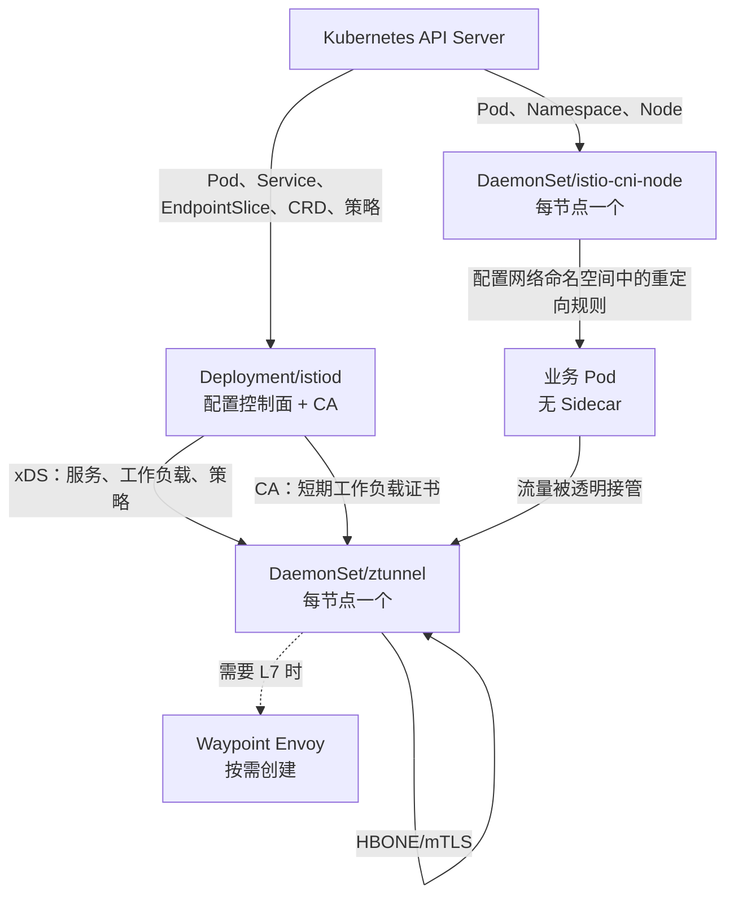
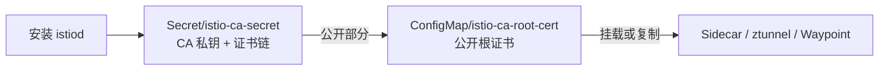
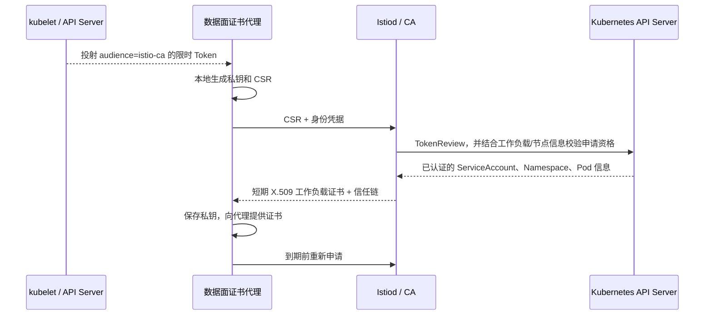
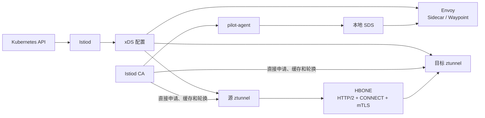
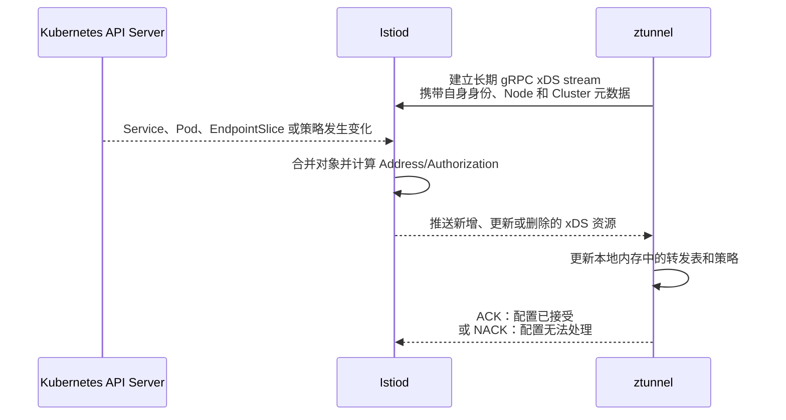
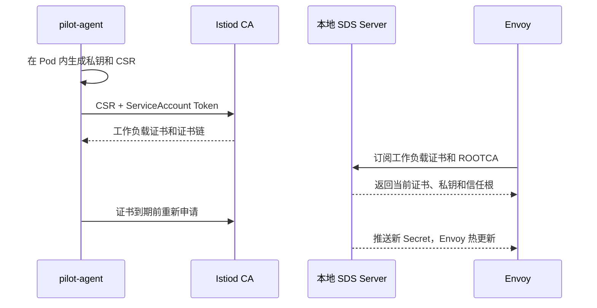
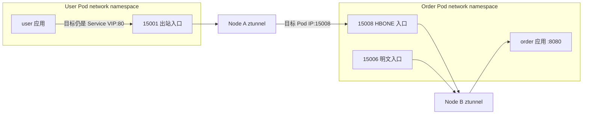
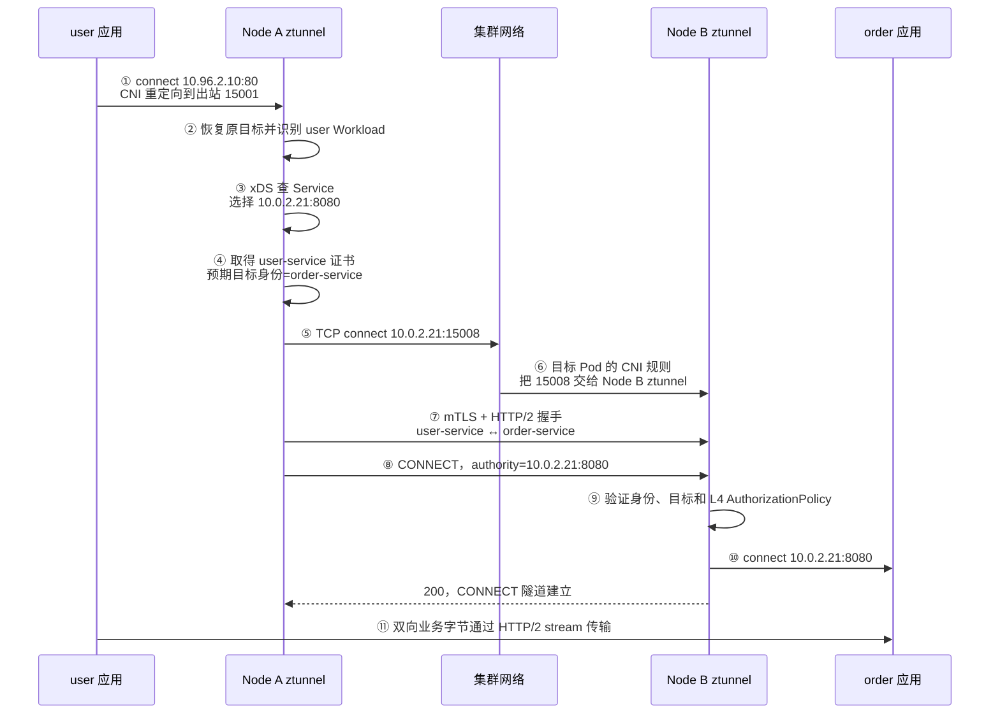

本文分析下面这条命令在 Kubernetes 集群中建立了什么系统：

```shell
istioctl install \
  --set profile=ambient \
  --set values.global.platform=k3s \
  --skip-confirmation
```

实验环境使用 Istio `1.31.0`。本文先从架构、运行流程和使用场景理解安装结果，再逐个查看组件及其关联的 Workload、Service、ConfigMap、Secret、Webhook 和 RBAC。Sidecar 与 Ambient 两种模式具体如何执行认证和授权，放在 [016_istio_security.md](./016_istio_security.md) 中说明。

<!-- more -->

## 1. 安装的是一个什么系统

### 1.1 Ambient profile 的目标场景

Ambient profile 同时安装控制面和 Ambient 数据面的基础组件：

```text
控制面：istiod
节点接入：istio-cni-node
四层数据面：ztunnel
七层数据面：Waypoint（使用时按需创建，本次安装不会预先创建）
```

它既可以承载不注入 Sidecar 的 Ambient 工作负载，也保留 Sidecar 注入能力。因此安装后仍能看到 Sidecar Injector 的 ConfigMap 和 Webhook；这些资源存在不代表 Ambient Pod 中也会注入 Envoy。

安装本身也不会让业务 Namespace 自动加入 Ambient。还需要显式标记：

```shell
kubectl label namespace <namespace> istio.io/dataplane-mode=ambient
```

该标签表达“这个 Namespace 中符合条件的 Pod 应由 Ambient 数据面接管”。它不会修改已经运行的 Pod 内部，也不会给 Pod 增加 Sidecar。

### 1.2 总体架构



三者的职责边界是：

| 组件 | 核心问题 | 不负责什么 |
| --- | --- | --- |
| `istiod` | 集群里有哪些服务和工作负载；代理应该得到什么配置；谁可以获得哪种身份证书 | 不转发业务流量 |
| `istio-cni-node` | 哪些 Pod 应加入网格；如何让这些 Pod 的流量进入 ztunnel | 不做服务发现，不签发证书，不执行授权策略 |
| `ztunnel` | 如何代表具体工作负载建立 L4 安全连接并执行 L4 策略 | 不直接读取 Kubernetes API，不解析 HTTP/JWT |

### 1.3 安装后的三条核心流程

#### 配置流程

```text
用户创建 Pod、Service、Gateway 或 Istio 策略
→ Kubernetes API 保存对象
→ istiod watch 对象并计算数据面配置
→ istiod 通过 xDS 把配置下发给 Sidecar、ztunnel 或 Waypoint
```

#### Ambient 流量接管流程

```text
Pod/Namespace 被标记为 ambient
→ istio-cni-node 识别该 Pod
→ CNI 在 Pod 网络命名空间中设置重定向
→ 应用仍连接原目标地址
→ 流量被透明送入本节点 ztunnel
```

#### 身份流程

```text
Kubernetes ServiceAccount
→ Kubernetes 签发限时、绑定 Pod 的 Token
→ 代理使用 Token 或受信任节点身份向 Istiod 证明申请资格
→ Istiod CA 签发 SPIFFE 工作负载证书
→ 数据面用证书建立 mTLS
```

这三条流程分别解决“代理知道什么”“流量怎么进入代理”和“代理凭什么代表工作负载”。

## 2. 阅读资源前需要知道的 Kubernetes 概念

### 2.1 Deployment 与 DaemonSet

`Deployment` 关注副本数量，适合无状态控制面。当前 `Deployment/istiod` 只有一个副本，但可以横向扩容。

`DaemonSet` 关注节点覆盖，通常保证每个匹配节点运行一个 Pod。CNI 和 ztunnel 必须接触节点网络，因此都使用 DaemonSet：

```text
新增一个 Linux Node
→ DaemonSet 控制器在该节点创建 istio-cni-node Pod
→ 同时创建 ztunnel Pod
```

### 2.2 ServiceAccount、Token 与 RBAC

`ServiceAccount` 是 Kubernetes 中 Pod 的运行身份。它本身不等于权限；权限由下面的绑定关系赋予：

```text
ServiceAccount
→ RoleBinding / ClusterRoleBinding
→ Role / ClusterRole
→ 对某类 Kubernetes 资源允许哪些 verbs
```

`Role` 只在一个 Namespace 内生效，`ClusterRole` 可以描述集群范围资源或跨 Namespace 权限。常见 verb 包括：

| verb | 含义 |
| --- | --- |
| `get` | 读取一个已知对象 |
| `list` | 列出一组对象 |
| `watch` | 持续接收对象变化 |
| `create/update/patch/delete` | 创建、整体更新、局部更新、删除对象 |

### 2.3 ConfigMap、Secret 与投射 Token

`ConfigMap` 保存非敏感配置；`Secret` 用于私钥等敏感数据，但 Secret 的 base64 只是编码，不是加密，仍应通过 RBAC 严格限制读取。

组件 Pod 中的 `projected.serviceAccountToken` 不是永久 Token。API Server 按指定 audience 和有效期签发它，kubelet 再投射进容器。当前 Istio 组件使用：

```yaml
serviceAccountToken:
  audience: istio-ca
  expirationSeconds: 43200
  path: istio-token
```

这表示 Token 面向 Istio CA，12 小时过期，由 kubelet 自动轮换。

### 2.4 Admission Webhook

Admission Webhook 位于“请求已经通过身份认证和 RBAC、对象尚未写入 etcd”之间：

```text
kubectl 提交对象
→ API Server 认证与 RBAC
→ Mutating Webhook 可以修改对象
→ Validating Webhook 可以接受或拒绝对象
→ 写入 etcd
```

Webhook 不是常驻在业务请求链路中的网关；它只参与 Kubernetes API 对象的创建或更新。

## 3. 资源全景：组件与关联资源

不要从 `kubectl get all` 的输出理解 Istio。它只显示一部分 Workload 和 Service，看不到 ConfigMap、Secret、RBAC、CRD 与 Webhook。更合适的方法是先按组件分组，再在组件内逐项查看资源。

以下资源均来自当前 Istio `1.31.0` Ambient profile。表中的 Namespace 默认为 `istio-system`；ClusterRole、ClusterRoleBinding、CRD 和 Webhook 是集群级资源，没有 Namespace。

### 3.1 istiod 关联的资源

#### 3.1.1 运行实例、访问入口和运行身份

| 类型 | 资源名称 | 作用 |
| --- | --- | --- |
| `Deployment` | `istiod` | 运行 Istio 控制面。监听 Kubernetes/Istio 资源，计算 xDS，提供 CA、配置校验、Sidecar 注入和 Gateway controller |
| `Service` | `istiod` | 为 xDS、CA、Webhook 和监控接口提供稳定的集群内 DNS 与端口 |
| `Service` | `istiod-revision-tag-default` | 为逻辑 revision tag `default` 提供稳定入口，并把请求转发到当前 default revision 的 istiod Pod |
| `ServiceAccount` | `istiod` | `Deployment/istiod` 的 Kubernetes 运行身份；其 API 权限来自后面的 RoleBinding 和 ClusterRoleBinding |

#### 3.1.2 ConfigMap

| 类型 | 资源名称 | 作用 | 主要内容或当前状态 |
| --- | --- | --- | --- |
| `ConfigMap` | `istio` | 保存运行时 MeshConfig，是 istiod 生成数据面配置时使用的网格级输入 | `trustDomain=cluster.local`、xDS 地址、默认 Prometheus provider、HBONE metadata |
| `ConfigMap` | `values` | 保存本次安装的原始 values 和合并后 values，便于识别安装参数与重建配置 | `profile=ambient`、`platform=k3s`、CNI/Ambient 启用状态、镜像版本等 |
| `ConfigMap` | `istio-sidecar-injector` | 保存 Sidecar 注入模板，以及 Istio 管理 Gateway/Waypoint 基础设施时使用的模板 | Pod 容器、Volume、投射 Token、Deployment、Service、HPA、PDB 模板 |
| `ConfigMap` | `istio-ca-root-cert` | 发布 Istio CA 的公开根证书，让代理验证 Istiod 和工作负载证书链 | `root-cert.pem`；没有私钥，可分发给数据面 |
| `ConfigMap` | `istio-ca-crl` | 发布证书吊销列表，供证书验证流程使用 | `ca-crl.pem` 当前为空 |
| `ConfigMap` | `istio-ip-autoallocate` | 保存 ServiceEntry 自动 IP 分配相关状态 | 当前没有 data；没有使用自动分配时为空是正常状态 |
| `ConfigMap` | `istio-leader` | 控制面选主的兼容资源 | 当前没有 data；新版本主要使用 Lease 选主 |
| `ConfigMap` | `istio-namespace-controller-election` | Namespace controller 选主的兼容资源 | 当前没有 data；新版本主要使用 Lease 选主 |

这里要区分 `istio` 和 `values`：

```text
ConfigMap/values
→ 记录“安装时输入了什么”

ConfigMap/istio
→ 表示“控制面运行时采用什么 MeshConfig”
```

#### 3.1.3 CA Secret 及其每个键

| 类型 | 资源名称 | 作用 |
| --- | --- | --- |
| `Secret` | `istio-ca-secret` | 保存 Istiod 内置 CA 的证书和签发私钥。拥有读取权限就可能伪造网格工作负载身份，因此属于最高敏感级别资源 |

该 Secret 中每个键的作用如下：

| 数据键 | 当前内容 | 作用 |
| --- | --- | --- |
| `ca-cert.pem` | 自签名 CA 证书 | 与 `ca-key.pem` 配合用于签发工作负载证书 |
| `ca-key.pem` | CA 私钥 | 执行证书签名；不得分发给数据面 |
| `root-cert.pem` | 信任根证书 | 当前与 `ca-cert.pem` 是同一张自签名证书；作为证书链的信任锚 |
| `cert-chain.pem` | 当前为空 | 接入中间 CA 时可保存 CA 到 Root CA 的上级证书链；当前直接使用自签名根，所以没有额外链 |
| `key.pem` | 当前为空 | CA Secret 格式保留的可选/兼容键；当前实际签发私钥是 `ca-key.pem` |

`ConfigMap/istio-ca-root-cert` 与这个 Secret 关联，但安全等级完全不同：

```text
istio-ca-secret/ca-key.pem
→ 可以签名，必须保密

istio-ca-root-cert/root-cert.pem
→ 只能验证，可以分发
```

#### 3.1.4 RBAC

Binding 不定义权限，只负责把 Role 或 ClusterRole 授予 ServiceAccount。每个对象分开列出如下：

| 类型 | 资源名称 | 作用或权限 |
| --- | --- | --- |
| `ClusterRole` | `istiod-clusterrole-istio-system` | 读取 Pod、Service、EndpointSlice、Node、Namespace、Istio CR 和 Gateway API；创建 TokenReview；维护 Webhook；更新资源 status |
| `ClusterRoleBinding` | `istiod-clusterrole-istio-system` | 把同名 ClusterRole 授予 `ServiceAccount/istiod` |
| `ClusterRole` | `istiod-gateway-controller-istio-system` | 跨 Namespace 创建、更新或删除 Gateway/Waypoint 所需的 ServiceAccount、Service、Deployment、HPA 和 PDB |
| `ClusterRoleBinding` | `istiod-gateway-controller-istio-system` | 把 Gateway controller 的 ClusterRole 授予 `ServiceAccount/istiod` |
| `Role` | `istiod` | 在 `istio-system` 内管理 Secret、维护 Lease、删除 ConfigMap，并为兼容场景创建 Istio Gateway |
| `RoleBinding` | `istiod` | 把命名空间内的 `Role/istiod` 授予 `ServiceAccount/istiod` |

#### 3.1.5 Admission Webhook

| 类型 | 资源名称 | 触发条件 | 作用 |
| --- | --- | --- | --- |
| `ValidatingWebhookConfiguration` | `istiod-default-validator` | 创建或更新没有 `istio.io/rev` 标签的 Istio CR | 调用 `istiod:443/validate`，校验默认 revision 的配置语义 |
| `ValidatingWebhookConfiguration` | `istio-validator-istio-system` | 创建或更新 `istio.io/rev=default` 的 Istio CR | 调用 `istiod:443/validate`，校验显式选择 default revision 的配置语义 |
| `MutatingWebhookConfiguration` | `istio-revision-tag-default` | 创建满足 revision、Namespace 或 Pod 注入标签的 Pod | 调用 `istiod:443/inject`，向 PodSpec 注入 Sidecar、Volume 和 Token 等内容 |
| `MutatingWebhookConfiguration` | `istio-sidecar-injector` | 当前 selector 被设置为永不匹配 | 保留旧注入入口，但当前停用，避免与 `default` revision tag 重复注入 |

### 3.2 istio-cni-node 关联的资源

#### 3.2.1 Workload、身份和配置

| 类型 | 资源名称 | 作用 |
| --- | --- | --- |
| `DaemonSet` | `istio-cni-node` | 每个 Linux Node 运行一个 CNI Pod，安装 CNI 插件、识别应接管的 Pod、配置流量重定向并执行 repair |
| `ServiceAccount` | `istio-cni` | CNI Pod 的 Kubernetes 运行身份 |
| `ConfigMap` | `istio-cni-config` | 保存 Ambient 选择器、k3s CNI 目录、DNS capture、排除 Namespace 和 repair 行为等配置 |

CNI 没有 Service，因为 API Server 或业务应用不需要通过稳定 ClusterIP 主动调用它。它由 kubelet/CNI 调用链和节点本地 Socket 触发。

#### 3.2.2 RBAC

| 类型 | 资源名称 | 作用或权限 |
| --- | --- | --- |
| `ClusterRole` | `istio-cni` | `get/list/watch` Pod、Node 和 Namespace，用于判断 Pod 是否加入网格以及位于哪个节点 |
| `ClusterRoleBinding` | `istio-cni` | 把 `ClusterRole/istio-cni` 授予 `ServiceAccount/istio-cni` |
| `ClusterRole` | `istio-cni-ambient` | 读取指定的 `DaemonSet/istio-cni-node`；`patch/update pods/status`，维护 Ambient 接管状态 |
| `ClusterRoleBinding` | `istio-cni-ambient` | 把 `ClusterRole/istio-cni-ambient` 授予 `ServiceAccount/istio-cni` |
| `ClusterRole` | `istio-cni-repair-role` | `get/list/watch` Pod，并 `create/patch` Event，用于发现和记录 CNI 未就绪期间的异常 Pod |
| `ClusterRoleBinding` | `istio-cni-repair-rolebinding` | 把 `ClusterRole/istio-cni-repair-role` 授予 `ServiceAccount/istio-cni` |

CNI 没有读取 Secret 的权限，也不参与 CA 证书签发。

### 3.3 ztunnel 关联的资源

#### 3.3.1 Workload、身份和运行时输入

| 类型 | 资源或配置 | 作用 |
| --- | --- | --- |
| `DaemonSet` | `ztunnel` | 每个 Linux Node 运行一个 L4 Ambient 代理，代表本节点 Workload 建立 HBONE/mTLS 并执行 L4 授权 |
| `ServiceAccount` | `ztunnel` | ztunnel 自身连接 Istiod xDS/CA 时使用的 Kubernetes 身份 |
| 共享 `ConfigMap` | `istio-ca-root-cert` | 挂载到 `/var/run/secrets/istio`，验证 Istiod 和网格证书链 |
| 投射 Token | `istio-token` | audience 为 `istio-ca`，ztunnel 用它向 Istiod 证明自己的 Pod、ServiceAccount 和节点代理身份 |
| HostPath | `/var/run/ztunnel` | CNI 与本节点 ztunnel 交换 Pod network namespace 和监听 Socket 的节点本地目录 |
| xDS 地址 | `istiod.istio-system.svc:15012` | 获取 Workload、Service 和 L4 Authorization 配置 |
| CA 地址 | `istiod.istio-system.svc:15012` | 为本节点 Workload 的 ServiceAccount 身份获取短期证书 |

ztunnel 也没有 ClusterIP Service。跨节点 HBONE 的逻辑目标是目标 Workload IP 的 `15008` 端口，再由目标节点的 CNI 重定向交给 ztunnel；调用方不直接访问一个 `Service/ztunnel`。

#### 3.3.2 RBAC 边界

当前没有 RoleBinding 或 ClusterRoleBinding 把额外 Kubernetes API 权限授予 `ServiceAccount/ztunnel`。因此没有可列出的 ztunnel Role，它不能直接 watch Pod、Service、Node 或读取 Secret：

```text
istiod 读取 Kubernetes API
→ 计算 Workload/Service/Authorization
→ 通过 xDS 下发给 ztunnel
```

Linux `NET_ADMIN`、`SYS_ADMIN`、`NET_RAW` capability 用于节点网络和 Socket 操作，不等于 Kubernetes RBAC 权限。

### 3.4 istio-reader-service-account 关联的资源

这个 ServiceAccount 没有对应的常驻 Pod，是一组独立的只读控制面凭据：

| 类型 | 资源名称 | 作用或权限 |
| --- | --- | --- |
| `ServiceAccount` | `istio-reader-service-account` | 为远程控制面、多集群或其他需要独立只读凭据的场景提供 Kubernetes 身份 |
| `ClusterRole` | `istio-reader-clusterrole-istio-system` | 读取核心 Kubernetes 资源、Istio CRD 和 Gateway API；创建 TokenReview/SubjectAccessReview；包含少量多集群 ServiceExport 管理权限 |
| `ClusterRoleBinding` | `istio-reader-clusterrole-istio-system` | 把同名 ClusterRole 授予 `ServiceAccount/istio-reader-service-account` |

它虽然名为 reader，但权限中仍包含 TokenReview、SubjectAccessReview 和 ServiceExport 的写操作，因此不应把它理解为 Kubernetes 内置 `view` Role 的简单别名。

### 3.5 Istio CRD

CRD 由 Istio base 安装，为 API Server 注册配置类型。它们不是某个正在运行的 Pod，也不主动执行流量逻辑；Istiod watch 对应 CR 后，才会把声明转换为数据面配置。

| CRD | Kind | 作用 |
| --- | --- | --- |
| `authorizationpolicies.security.istio.io` | `AuthorizationPolicy` | 声明访问控制规则 |
| `peerauthentications.security.istio.io` | `PeerAuthentication` | 声明目标工作负载接受的 mTLS 模式 |
| `requestauthentications.security.istio.io` | `RequestAuthentication` | 声明 JWT 验证规则 |
| `destinationrules.networking.istio.io` | `DestinationRule` | 声明目标服务子集、负载均衡、连接池和客户端 TLS 等策略 |
| `virtualservices.networking.istio.io` | `VirtualService` | 声明 Istio API 下的流量匹配与路由 |
| `gateways.networking.istio.io` | `Gateway` | 声明旧版 Istio Gateway API 的监听配置，不是 Kubernetes Gateway API 的同名 Kind |
| `serviceentries.networking.istio.io` | `ServiceEntry` | 把网格外服务或非 Kubernetes 工作负载加入 Istio 服务模型 |
| `sidecars.networking.istio.io` | `Sidecar` | 限制 Sidecar 的监听器、出口和配置可见范围 |
| `proxyconfigs.networking.istio.io` | `ProxyConfig` | 覆盖代理运行参数 |
| `envoyfilters.networking.istio.io` | `EnvoyFilter` | 对 Envoy 生成配置做底层扩展或修改 |
| `workloadentries.networking.istio.io` | `WorkloadEntry` | 描述 VM 等非 Pod 工作负载实例 |
| `workloadgroups.networking.istio.io` | `WorkloadGroup` | 为一组非 Pod 工作负载提供模板 |
| `telemetries.telemetry.istio.io` | `Telemetry` | 配置指标、访问日志和追踪行为 |
| `wasmplugins.extensions.istio.io` | `WasmPlugin` | 向 Envoy 加载 Wasm 扩展 |
| `trafficextensions.extensions.istio.io` | `TrafficExtension` | 声明流量处理扩展及其附加位置 |

### 3.6 Kubernetes 自动提供的资源

下面两个对象会出现在 `istio-system` 的查询结果中，但不属于某个 Istio 组件：

| 类型 | 资源名称 | 作用 |
| --- | --- | --- |
| `ServiceAccount` | `default` | Kubernetes 为 Namespace 提供的默认 Pod 身份；当前 Istio 核心组件都使用自己的专用 ServiceAccount |
| `ConfigMap` | `kube-root-ca.crt` | Kubernetes 自动发布的 API Server 信任根；它与 Istio mTLS 使用的 `istio-ca-root-cert` 是两套不同的 CA |

到这里可以得到完整关联关系：

```text
istiod
├── 运行控制面、Webhook、CA 和 Gateway controller
├── 通过 ConfigMap/Secret 获取网格配置与签发材料
└── 通过 RBAC 读取集群事实并维护控制器资源

istio-cni-node
├── 通过 istio-cni-config 判断接管范围
└── 通过三个 ClusterRole 发现、标记和修复 Pod

ztunnel
├── 通过投射 Token 和根证书连接 Istiod
├── 通过 xDS 和 CA 获得配置及工作负载证书
└── 没有直接读取 Kubernetes API 的额外 RBAC
```

## 4. istiod：配置控制面与 CA

### 4.1 Workload 与核心参数

`Deployment/istiod` 运行 `pilot` 镜像中的 `discovery` 进程。当前关键参数和环境变量如下：

| 配置 | 当前值 | 作用 |
| --- | --- | --- |
| `--domain` | `cluster.local` | Kubernetes 集群域名 |
| `--monitoringAddr` | `:15014` | 暴露监控和调试接口 |
| `REVISION` | `default` | 当前控制面修订版本 |
| `PILOT_CERT_PROVIDER` | `istiod` | 由 Istiod 内置 CA 提供证书 |
| `PILOT_ENABLE_AMBIENT` | `true` | 启用 Ambient 控制面模型 |
| `CA_TRUSTED_NODE_ACCOUNTS` | `istio-system/ztunnel` | 把指定 ServiceAccount 识别为可进行节点代理认证的 ztunnel |
| `CLUSTER_ID` | `Kubernetes` | xDS 中使用的集群标识 |
| `PLATFORM` | `k3s` | 使用 k3s 对应的平台设置 |

Istiod 自己也挂载 audience 为 `istio-ca` 的 Token，并以 `ServiceAccount/istiod` 运行。`CA_TRUSTED_NODE_ACCOUNTS` 不是“允许 ztunnel 申请任意身份”；Istiod 还会把 ztunnel 所在节点与目标工作负载的调度信息对应起来。

### 4.2 Service 与端口

`Service/istiod` 把稳定 DNS 名称 `istiod.istio-system.svc` 指向 istiod Pod：

| Service 端口 | Pod 端口 | 作用 |
| --- | --- | --- |
| `15010` | `15010` | 明文 gRPC xDS，通常只用于特定兼容场景 |
| `15012` | `15012` | TLS xDS、CA 和安全控制面通信；ztunnel 的 `XDS_ADDRESS`、`CA_ADDRESS` 都指向这里 |
| `443` | `15017` | Kubernetes Admission Webhook 调用 `/inject` 和 `/validate` |
| `15014` | `15014` | Prometheus 指标和控制面监控 |

`Service/istiod-revision-tag-default` 选择同一个 `istiod` Deployment，但为 `default` revision tag 提供稳定入口。它让注入配置引用逻辑标签，而不是把具体 revision 写死。

### 4.3 istiod 的权限为什么比较多

`ServiceAccount/istiod` 绑定三个层次的权限：

| 权限对象 | 核心权限 | 为什么需要 |
| --- | --- | --- |
| `ClusterRole/istiod-clusterrole-istio-system` | watch Pod、Service、EndpointSlice、Node、Namespace、Istio CR、Gateway API；更新各种 status；创建 TokenReview；维护 Webhook | 构建服务发现和策略模型、认证证书申请者、反馈控制器状态 |
| `ClusterRole/istiod-gateway-controller-istio-system` | 创建/更新/删除 ServiceAccount、Service、Deployment、HPA、PDB | 用户创建 Gateway 后，自动生成 Ingress Gateway 或 Waypoint 的基础设施 |
| `Role/istiod` | 在 `istio-system` 管理 Secret；维护 Lease；删除 ConfigMap；兼容性地创建 Istio Gateway | 保存 CA、选主和维护命名空间内控制面状态 |

这里有两类权限必须区分：

```text
读取业务资源
→ 为 xDS 计算配置，不会修改业务 Pod

Gateway controller 的写权限
→ 仅当用户创建由 Istio 管理的 Gateway 时，生成对应基础设施
```

`Role/istiod` 对 `istio-system` 中 Secret 拥有完整管理权限，是因为默认 CA 私钥保存在该 Namespace。这也是 `istiod` ServiceAccount 属于高敏感身份的原因。

### 4.4 reader ServiceAccount

`ServiceAccount/istio-reader-service-account` 绑定 `ClusterRole/istio-reader-clusterrole-istio-system`。它主要提供只读发现能力：读取核心资源、Istio CRD 和 Gateway API，并允许创建 `TokenReview`、`SubjectAccessReview`；此外带有少量多集群 ServiceExport 管理权限。

当前单集群中的三个核心 Workload 都不使用这个 ServiceAccount。它是供需要独立只读凭据的控制面访问或多集群场景使用的身份，不应与 `istiod` 的运行身份混为一谈。

## 5. istio-cni-node：把 Pod 流量接入数据面

### 5.1 为什么它必须是节点组件

每个 Pod 都有自己的 network namespace。要透明接管应用流量，必须在 Pod 的网络命名空间中设置规则。`DaemonSet/istio-cni-node` 每节点运行一个 Pod，挂载宿主机的：

```text
/var/lib/rancher/k3s/data/cni
→ k3s 的 CNI 二进制目录

/var/lib/rancher/k3s/agent/etc/cni/net.d
→ k3s 的 CNI 配置目录

/var/run/netns、/proc
→ 定位并进入 Pod 网络命名空间

/var/run/ztunnel
→ CNI 与本节点 ztunnel 协作的 Unix Socket 目录
```

因此它以 root 运行，并拥有 `NET_ADMIN`、`NET_RAW`、`SYS_ADMIN`、`SYS_PTRACE`、`DAC_OVERRIDE`。这些 Linux capability 用来操作网络命名空间和网络规则，不是 Kubernetes API 权限。

### 5.2 `ConfigMap/istio-cni-config`

核心配置可以分为四组：

| 配置 | 当前值 | 作用 |
| --- | --- | --- |
| `AMBIENT_ENABLED` | `true` | 启用 Ambient Pod 接管 |
| `AMBIENT_ENABLEMENT_SELECTOR` | Namespace 或 Pod 带 `istio.io/dataplane-mode=ambient`，并排除 `none` | 决定哪些 Pod 加入 Ambient |
| `AMBIENT_DNS_CAPTURE` | `true` | 接管 Ambient 工作负载 DNS 流量以支持名称解析模型 |
| `CHAINED_CNI_PLUGIN` | `true` | 作为现有 k3s CNI 链中的一个插件，而不是替换主 CNI |
| `EXCLUDE_NAMESPACES` | `kube-system` | 避免接管关键系统 Namespace |
| `REPAIR_ENABLED` | `true` | 启动 CNI repair 控制器 |
| `REPAIR_REPAIR_PODS` | `true` | CNI 暂时不可用导致 Pod 未正确接管时，尝试修复 |
| `REPAIR_DELETE_PODS` / `REPAIR_LABEL_PODS` | `false` | 当前不通过删除或只打标签处理失败 Pod |

`AMBIENT_ENABLEMENT_SELECTOR` 同时支持 Namespace 级默认加入和 Pod 级覆盖：Pod 标记 `istio.io/dataplane-mode=none` 时可以退出接管。

### 5.3 CNI 的三组 ClusterRole

三个 ClusterRole 都绑定到 `ServiceAccount/istio-cni`：

| ClusterRole | 精确权限摘要 | 使用目的 |
| --- | --- | --- |
| `istio-cni` | `get/list/watch` Pod、Node、Namespace | 判断 Pod 是否加入网格、位于哪个节点 |
| `istio-cni-ambient` | `get` 指定的 `DaemonSet/istio-cni-node`；`patch/update pods/status` | 确认自身 DaemonSet 状态，并更新 Ambient 接管相关的 Pod 状态 |
| `istio-cni-repair-role` | `get/list/watch` Pod；`create/patch` Event | 找出 CNI 未就绪期间创建的异常 Pod，并记录修复事件 |

CNI 没有读取 Secret 的权限，也不负责签发工作负载证书。

## 6. ztunnel：共享代理，但不共享业务身份

### 6.1 Workload 与核心配置

`DaemonSet/ztunnel` 每个节点运行一个 Rust 数据面代理。当前关键环境变量如下：

| 配置 | 当前值 | 作用 |
| --- | --- | --- |
| `XDS_ADDRESS` | `istiod.istio-system.svc:15012` | 获取 Workload、Service 和 L4 策略配置 |
| `CA_ADDRESS` | `istiod.istio-system.svc:15012` | 获取短期工作负载证书 |
| `NODE_NAME` | Downward API 的 `spec.nodeName` | 告诉 ztunnel 自己位于哪个节点 |
| `POD_NAME`、`POD_NAMESPACE`、`SERVICE_ACCOUNT` | Downward API | 建立 ztunnel 自身身份上下文 |
| `ISTIO_META_ENABLE_HBONE` | `true` | 启用 HBONE 数据面协议 |
| `INPOD_ENABLED` | `true` | 使用当前 in-pod 流量重定向模型 |

ztunnel 与 CNI 同时挂载宿主机 `/var/run/ztunnel`，通过 Unix Socket 协调 Pod 加入和网络命名空间操作。ztunnel 需要 `NET_ADMIN`、`SYS_ADMIN` 和 `NET_RAW` capability，但不使用 `hostNetwork`。

ztunnel 没有对应的 ClusterIP Service。它是节点级透明数据面，不是让业务通过 Kubernetes Service 主动调用的普通后端；控制面连接由 ztunnel 主动访问 `Service/istiod`，业务流量入口由 CNI 重定向建立。

### 6.2 为什么 ztunnel 没有 ClusterRole

当前 `ServiceAccount/ztunnel` 没有 RoleBinding 或 ClusterRoleBinding。这是一个重要边界：

```text
ztunnel 不直接 list/watch 全集群 Pod、Service 和 Secret
→ istiod 用自己的只读权限读取 Kubernetes API
→ istiod 转换为面向数据面的 xDS 资源
→ ztunnel 只接收完成本节点转发所需的模型
```

ztunnel 知道本节点名，是因为 DaemonSet 用 Downward API 注入 `spec.nodeName`，不是因为它有读取 Node 的 RBAC。它持有自身投射 Token 和 Istio 根证书，用来认证 Istiod 并验证控制面，而不是读取 Kubernetes Secret。

### 6.3 一个 ztunnel 如何代表多个 Pod

Istiod 下发的 Workload 模型至少包含工作负载地址、Namespace、ServiceAccount、Node、网络、所属 Service 和 Waypoint 信息。ztunnel 比较：

```text
Workload.node == 当前 NODE_NAME
```

由此识别本节点工作负载。假设同一节点有：

```text
user Pod    → ServiceAccount/user-service
payment Pod → ServiceAccount/payment-service
```

ztunnel 会分别管理 `user-service` 和 `payment-service` 的证书。共享的是代理进程和节点资源，不是 SPIFFE 身份、证书或授权结果。

## 7. 配置来源与修改边界

第 3 节已经逐项列出 ConfigMap、Secret 和 CRD。实际维护时还要区分“用户输入”“安装生成结果”和“控制器运行状态”：

| 类别 | 代表资源 | 应该如何维护 |
| --- | --- | --- |
| 安装输入 | `istioctl install` 参数、IstioOperator 或 Helm values | 作为安装配置的事实来源，通过安装工具升级和变更 |
| 网格运行配置 | `ConfigMap/istio` 中的 MeshConfig | 优先通过受支持的安装 API 修改，避免手工改动被下次 reconcile 覆盖 |
| 组件生成模板 | `ConfigMap/istio-sidecar-injector` | 由 Istio 安装包和 values 渲染，不应直接维护大段模板内容 |
| CA 签发材料 | `Secret/istio-ca-secret` 或安装前提供的 `Secret/cacerts` | 按 PKI 流程备份、轮换和限制访问，不能当作普通 ConfigMap 编辑 |
| 用户业务声明 | `VirtualService`、`AuthorizationPolicy`、`Telemetry` 等 CR | 由用户通过 Kubernetes API 管理，Istiod watch 后转换成 xDS |
| 控制器状态 | `istio-leader`、`istio-namespace-controller-election`、`istio-ip-autoallocate` | 由控制器维护；为空不一定异常，不应手工填值 |

当前没有提供 `Secret/cacerts`，所以 Istiod 使用 `Secret/istio-ca-secret` 中的自签名 CA 材料。生产环境若要接入企业 PKI，应在安装设计中提供 `cacerts`，而不是直接替换运行中的自动生成 Secret。

## 8. Webhook：为什么安装 Ambient 仍然需要它

### 8.1 Validating Webhook

两个 ValidatingWebhookConfiguration 都把 Istio CR 的 `CREATE/UPDATE` 请求发送到：

```text
Service/istiod:443 → istiod Pod:15017/validate
```

| WebhookConfiguration | 匹配对象 | 作用 |
| --- | --- | --- |
| `istiod-default-validator` | 没有 `istio.io/rev` 标签的对象 | 由默认 revision 校验 |
| `istio-validator-istio-system` | `istio.io/rev=default` 的对象 | 显式交给 default revision 校验 |

它们检查 `security.istio.io`、`networking.istio.io`、`telemetry.istio.io` 和 `extensions.istio.io` 对象的语义。CRD schema 能发现字段类型错误，Webhook 还能发现仅靠 OpenAPI schema 难以表达的无效组合。`failurePolicy: Fail` 表示 istiod 不可达时拒绝对应写入，避免无法验证的配置进入集群。

两个配置通过 object selector 分流，同一个对象不会因为这两个配置而必然校验两次。

### 8.2 Mutating Webhook

Mutating Webhook 只在 `Pod CREATE` 时调用：

```text
Service/istiod:443 → istiod Pod:15017/inject
```

它根据 Namespace 和 Pod 的以下标签决定是否注入 Sidecar：

```text
istio.io/rev=default
istio-injection=enabled
sidecar.istio.io/inject=true|false
```

当前真正生效的是 `MutatingWebhookConfiguration/istio-revision-tag-default` 中的四条匹配规则；`istio-sidecar-injector` 中的规则被 `istio.io/deactivated=never-match` selector 停用，防止 revision tag 与旧入口重复注入。

这个 Webhook 解决的是“创建 Sidecar Pod 时，谁把 `istio-proxy` 容器、投射 Token、卷和探针加入 PodSpec”。Ambient Pod 不靠它接管流量，而由 CNI 根据 Ambient 标签处理。因此：

```text
Sidecar 模式：Mutating Webhook 修改 PodSpec
Ambient 模式：PodSpec 不增加代理，CNI 修改网络路径
```

## 9. CA、工作负载身份与证书签发

### 9.1 安装时如何建立 CA

默认安装没有提供 `cacerts` 时，Istiod 在 `istio-system` 中建立并持久化自己的 CA：



CA 私钥用于签发，根证书用于验证。生产环境如果需要企业根 CA、跨集群共同信任域、离线 Root CA 或独立中间 CA，应在安装设计阶段提供 `cacerts`，而不是事后直接编辑自动生成的 Secret。

### 9.2 ServiceAccount 如何变成 SPIFFE 身份

Istio 默认把 Kubernetes ServiceAccount 映射成 SPIFFE URI：

```text
spiffe://<trust-domain>/ns/<namespace>/sa/<service-account>
```

当前 `ConfigMap/istio` 配置 `trustDomain: cluster.local`。例如：

```text
Namespace = default
ServiceAccount = user-service

→ spiffe://cluster.local/ns/default/sa/user-service
```

这个身份表示工作负载，不是 Kubernetes `Service/user-service`，也不是登录系统中的最终用户。多个 Pod 使用同一个 ServiceAccount 时拥有相同逻辑身份，但私钥和短期证书可以分别生成和轮换。

### 9.3 通用证书申请流程



这里通常不会创建 Kubernetes `certificates.k8s.io/v1 CSR` 对象。CSR 是直接发送给 Istiod CA 服务的，Istiod 通过自己 ClusterRole 中的 `tokenreviews.create` 验证 Kubernetes Token。

Sidecar 模式中，每个 Pod 内的 `pilot-agent` 为自己的 ServiceAccount 申请证书，再通过 SDS 提供给 Envoy。Ambient 模式中，ztunnel 以受信任节点代理身份，为实际位于本节点的工作负载身份申请证书；具体差异和限制在下一篇展开。

### 9.4 为什么不能只在 CSR 里伪造 ServiceAccount

申请者写入 `serviceAccount=admin` 不会自动得到 admin 证书。Istiod 根据经过 API Server 验证的 Token、Pod 绑定信息、节点信息和实际 Workload 模型派生允许的身份。

但这不表示 ServiceAccount 永远不会被冒用。如果攻击者有权创建 Pod，并能让 Pod 引用高权限 ServiceAccount，kubelet 会给它签发合法 Token。因此还必须限制：

1. 谁能创建或修改 Pod、Deployment 和 Job；
2. 哪些工作负载可以引用哪些 ServiceAccount；
3. 谁能进入 Pod 或读取投射 Token；
4. 谁能读取 `istio-ca-secret` 或访问代理管理接口。

## 10. xDS、SDS 与 HBONE 分别是什么

这三个名称分别属于不同阶段：

| 名称 | 所在平面 | 传递什么 | 解决什么问题 |
| --- | --- | --- | --- |
| xDS | 控制面 → 数据面 | Workload、Service、Endpoint、路由和策略等动态配置 | 代理如何知道“集群里有什么、应该怎么转发” |
| SDS | 证书代理 → Envoy | 证书、私钥引用和信任根等动态 Secret | Envoy 如何取得并轮换“证明自己身份的凭据” |
| HBONE | 数据面代理 ↔ 数据面代理 | 被封装的业务 TCP 字节流和连接级元数据 | Ambient 代理如何建立经过身份认证的加密隧道 |



可以把它们记成：

```text
xDS 告诉代理怎么做
SDS 让代理拿到身份证明
HBONE 使用配置和身份证明真正传输业务流量
```

### 10.1 xDS：把声明式资源变成代理可以执行的配置

#### 10.1.1 xDS 中的 `x` 表示一族 Discovery Service

xDS 不是某一种具体资源，而是一组基于 gRPC 的动态发现 API。Envoy 常见的资源包括：

| API | 完整名称 | 告诉 Envoy 什么 |
| --- | --- | --- |
| LDS | Listener Discovery Service | 监听哪些地址和端口，连接进入后经过哪些 Filter |
| RDS | Route Discovery Service | HTTP 请求匹配哪条路由 |
| CDS | Cluster Discovery Service | 有哪些逻辑上游集群 |
| EDS | Endpoint Discovery Service | 上游集群有哪些实际 Endpoint |
| SDS | Secret Discovery Service | TLS 证书、私钥和信任根 |

所以 SDS 本身也是 xDS 家族的一员，只是它处理的是敏感身份材料，后面单独介绍。

Sidecar 和 Waypoint 使用 Envoy，需要 Listener、Route、Cluster 等通用资源。ztunnel 只处理 L4 安全覆盖层，不需要完整的 Envoy 配置，因此复用 xDS 的传输机制，但主要消费 Istio 自定义的两类资源：

```text
Address
├── Workload：Pod IP、Node、ServiceAccount、身份、Waypoint 等
└── Service：Service VIP、端口、Endpoint、Waypoint 等

Authorization
└── ztunnel 可以执行的 L4 授权规则
```

#### 10.1.2 一次配置下发是怎样发生的

假设创建：

```text
Service/order-service = 10.96.2.10:80
Endpoint/order-v1     = 10.0.2.21:8080
ServiceAccount        = order-service
```

配置链路是：



ztunnel 转发请求时不会同步查询 Kubernetes API，也不会为每个请求调用 Istiod。它查询的是已经通过 xDS 保存到本地内存中的模型：

```text
收到目标 10.96.2.10:80
→ 查到它是 Service/order-service
→ 选择 Endpoint 10.0.2.21:8080
→ 查到目标身份是 order-service
→ 查到目标支持 HBONE，并且是否绑定 Waypoint
```

因此短暂失去 xDS 连接时，代理通常仍可使用已有配置转发；但新建 Pod、Endpoint 变化和新策略无法及时生效。xDS 解决配置分发，不承载业务请求。

### 10.2 SDS：证书签发与证书交付不是同一件事

#### 10.2.1 先区分 CA 和 SDS

```text
Istiod CA
→ 验证申请资格并签发证书

SDS
→ 把已经获得的证书和信任材料动态提供给 Envoy
```

SDS 不负责决定一个 Pod 应该拥有什么身份，CA 也不会直接把私钥写进 Envoy 配置。典型 Sidecar 中，`pilot-agent` 把两者连接起来：



这里的 SDS Server 通常由同一个 `istio-proxy` 容器中的 pilot-agent 提供，Envoy 通过本地 Unix Domain Socket 访问它，不需要把私钥跨网络发送给远程控制面。

#### 10.2.2 SDS 中的 Secret 不是 Kubernetes Secret

SDS 使用 Envoy `Secret` 资源表达运行时 TLS 材料。它不表示每个工作负载证书都必须保存成：

```text
Kubernetes Secret/<pod-certificate>
```

默认情况下，工作负载私钥保留在代理所在 Pod 的内存或本地运行时中。证书轮换通过 SDS 推送给 Envoy，不需要修改 PodSpec，也不需要重启 Pod。

Ambient 中的 ztunnel 是专用 Rust 代理，不是“Envoy + pilot-agent”结构。它直接实现证书申请、缓存和轮换，为本节点的不同 ServiceAccount 管理不同证书。因此理解 Ambient 时，更准确的说法是“ztunnel 从 Istiod CA 获取证书”，不能强行把内部过程都称为本地 SDS。Waypoint 仍是 Envoy，继续使用 Envoy 的证书发现机制。

### 10.3 HBONE：为什么 Ambient 需要一层新的隧道

Sidecar Envoy 与业务应用位于同一个 Pod，天然知道自己只代表这个 Pod。ztunnel 却是节点共享代理：

```text
一个 ztunnel
├── 代表 user Pod
├── 代表 payment Pod
└── 代表其他 Ambient Pod
```

如果 ztunnel 之间只建立一条普通的“Node A → Node B TLS”，目标只能知道请求来自 Node A，无法继续区分 `user-service` 和 `payment-service`，工作负载级授权就失效了。

HBONE 要保留的是：

```text
共享节点代理
+ 原始业务 TCP 不需要改造
+ 每条连接仍有明确的源、目标工作负载身份
+ 多条业务连接可以安全复用底层连接
```

HBONE 全称 HTTP-Based Overlay Network Environment。当前实现组合了三个标准协议：

| 协议 | 在 HBONE 中的作用 |
| --- | --- |
| mTLS | 加密底层连接，并用 SPIFFE 证书认证源身份和目标身份 |
| HTTP/2 | 在一条底层连接中并发承载多个 stream |
| HTTP CONNECT | 为一条具体业务 TCP 连接创建双向字节隧道 |

它们的嵌套关系是：

```text
TCP 连接：源 ztunnel → 目标 Workload IP:15008
└── mTLS：user-service ↔ order-service
    └── HTTP/2 connection
        ├── CONNECT stream 1 → 一条业务 TCP 连接
        ├── CONNECT stream 2 → 另一条业务 TCP 连接
        └── CONNECT stream N → 其他业务 TCP 连接
```

HBONE 虽然使用 HTTP/2 和 CONNECT，但它不把应用 TCP 改造成 HTTP，也不会要求应用使用 HTTP。MySQL、Redis、自定义 TCP 协议和 HTTP 请求都只是 CONNECT stream 中不透明的字节。

### 10.4 建立 HBONE 连接前，CNI 做了什么准备

当前使用 in-pod redirection。Pod 创建时，Istio CNI 与 ztunnel 协作，在业务 Pod 的 network namespace 中准备三个逻辑入口：

| 端口 | 方向 | 作用 |
| --- | --- | --- |
| `15001` | Pod 出站 | 把应用发出的连接交给本节点 ztunnel |
| `15006` | Pod 明文入站 | 处理没有通过 HBONE 到达的入站流量 |
| `15008` | Pod HBONE 入站 | 接收以该 Pod 为目标的 HBONE 流量 |

监听 Socket 位于业务 Pod 的 network namespace 中，实际处理 Socket 的进程仍是节点上的 ztunnel。DaemonSet YAML 只声明 `15020` 指标端口，所以不能根据 `containerPort` 列表判断 ztunnel 没有监听 `15001/15006/15008`。



这一步只准备流量入口。真正选择 Endpoint、选择证书并建立隧道，要等应用发起连接后才发生。

### 10.5 不经过 Waypoint 时，HBONE 如何建立连接

假设：

```text
user Pod：10.0.1.11，身份 user-service，位于 Node A
order Service：10.96.2.10:80
order Pod：10.0.2.21:8080，身份 order-service，位于 Node B
```

完整过程如下：



下面逐步解释其中容易混淆的地方。

#### 第 1～3 步：捕获连接并选择目标 Endpoint

user 应用仍然认为自己在连接 `10.96.2.10:80`。CNI 规则把连接送到源 ztunnel，同时保留原始目标。源 ztunnel 根据连接上下文识别来源是 `user Pod`，再用 xDS 模型查询 Service 并选择 `10.0.2.21:8080`。

如果目标没有加入 Ambient，ztunnel 可以按普通 TCP 透传；如果目标绑定了 Waypoint，则先选择 Waypoint，而不是直接选择最终业务 Pod。

#### 第 4 步：确定这条连接使用哪两个身份

源 ztunnel 查到：

```text
源 Workload 身份 = user-service
目标 Workload 身份 = order-service
```

它为 TLS 客户端准备 `user-service` 证书，并把 `order-service` 作为目标必须证明的身份。使用的是业务 Workload 身份，不是两个 ztunnel 自己的 ServiceAccount。

#### 第 5～6 步：为什么连接 `目标 Pod IP:15008`

源 ztunnel 的逻辑目标和实际网络路径是：

```text
逻辑目标：order Pod 的 HBONE 入口 10.0.2.21:15008
实际处理：Node B 上的共享 ztunnel
```

源 ztunnel 不需要先查出“Node B ztunnel 的 Pod IP”。它直接连接目标 Workload IP 的约定端口 `15008`，集群主 CNI 把数据包路由到 Node B，目标 Pod network namespace 中的 Istio CNI 规则再把连接交给 Node B ztunnel。

这个设计还有一个身份用途：当前 HBONE 不依赖 SNI 表示目标，因为 SNI 不能直接用这种方式表达目标 Pod IP 和 Workload。目标 ztunnel 从连接的原始目的地址 `10.0.2.21` 判断“我正在代表 order Pod 接收连接”，于是选择 `order-service` 证书作为服务端证书。

#### 第 7 步：先建立 mTLS，再运行 HTTP/2

mTLS 握手中：

```text
源 ztunnel 出示 user-service 证书
→ 目标 ztunnel 验证证书链，得到来源 SPIFFE 身份

目标 ztunnel 出示 order-service 证书
→ 源 ztunnel 验证证书链，并确认它就是预期的 order-service
```

双方认证成功后，连接上运行 HTTP/2。也就是说，HTTP CONNECT 请求和后续业务字节都已经位于 mTLS 加密层内部。

#### 第 8～10 步：CONNECT 如何变成到应用的连接

源 ztunnel 为这条业务 TCP 连接创建一个 HTTP/2 stream，并发送 CONNECT。`:authority` 携带最终目标 `10.0.2.21:8080`；还可以携带原始来源地址等连接级元数据，而不需要修改应用数据。

目标 ztunnel 终止 CONNECT 后依次检查：

1. mTLS 对端是否具有有效的网格身份；
2. CONNECT 声明的目标是否与当前 Workload 匹配；
3. 目标是否要求经过 Waypoint；
4. L4 `AuthorizationPolicy` 是否允许 `user-service` 访问目标端口。

检查通过后，目标 ztunnel 连接本 Pod network namespace 中的 `10.0.2.21:8080`，再向源端返回 CONNECT `200`。从这时开始，双方只在 stream 与应用 Socket 之间双向复制字节。

#### 第 11 步：一条 HTTP/2 连接如何承载多条业务连接

一条业务 TCP 连接对应一个独立 CONNECT stream，不同 stream 的关闭、流控和数据互不混淆。可以复用同一条底层 HBONE 连接的 key 是：

```text
{源身份, 目标身份, 目标 IP}
```

例如多个 `user-service → order-service@10.0.2.21` 的并发 TCP 连接可以共享同一条 HTTP/2+mTLS 连接，但分别使用不同 CONNECT stream。`payment-service → order-service` 因为源身份不同，必须使用另一条 mTLS 连接。这样既减少握手成本，又不会把不同安全身份混进同一个底层隧道。

上面的例子特意选择跨节点路径，以便完整展示 HBONE。源、目标位于同一节点时，ztunnel 可以把出站请求直接转换为本地入站处理，省去真正的跨节点网络隧道，但仍按照相同的工作负载身份和授权语义处理。

### 10.6 经过 Waypoint 时为什么会有两条 HBONE 隧道

如果 `order-service` 绑定 Waypoint，源 ztunnel 不会直接选择 order Pod，而是先把原始 Service 目标交给 Waypoint：

```text
第 1 条 HBONE：
user-service → order-waypoint
→ Waypoint 看到原始 Service 目标和 HTTP 请求
→ 执行 HTTPRoute、JWT 和 L7 AuthorizationPolicy
→ 选择 order Endpoint 10.0.2.21:8080

第 2 条 HBONE：
order-waypoint → order-service@10.0.2.21
→ 目标 ztunnel 验证 Waypoint 身份
→ 解开 CONNECT 并交给 order 应用
```

两条隧道分别做 mTLS 和 CONNECT，第二条隧道的源身份是 Waypoint，而不是原始 `user-service`。具体的身份变化和策略挂载位置在 [016_istio_security.md](./016_istio_security.md) 中继续说明。

### 10.7 三者发生故障时，表现为什么不同

| 故障 | 直接影响 | 已有连接或配置 |
| --- | --- | --- |
| xDS 与 Istiod 断开 | 收不到新 Endpoint 和策略 | 本地已有配置通常仍能使用，现有业务连接不必立即断开 |
| CA/SDS 证书更新失败 | 新证书无法取得或 Envoy 无法热更新 | 证书未过期前可能继续工作，过期后新 mTLS 握手失败 |
| HBONE 建连失败 | 当前源、目标之间无法建立数据面隧道 | 不代表 xDS 配置或 CA 一定异常，应分别检查 TCP、mTLS、CONNECT 和策略 |

排查时不要把三者混成“控制面连接失败”：

```text
xDS：代理知道目标吗？
证书/SDS：代理有可用身份吗？
HBONE：TCP、mTLS、HTTP/2 CONNECT 哪一步失败？
```

## 11. 安装完成检查

### 11.1 检查核心 Workload

```shell
istioctl version
kubectl get pods -n istio-system -o wide

kubectl -n istio-system rollout status deployment/istiod --timeout=180s
kubectl -n istio-system rollout status daemonset/istio-cni-node --timeout=180s
kubectl -n istio-system rollout status daemonset/ztunnel --timeout=180s
```

预期结果是 `istiod` Deployment Ready，且每个目标 Linux Node 上都有 Ready 的 CNI 和 ztunnel Pod。

### 11.2 检查完整资源，而不只看 `get all`

```shell
kubectl get deployment,daemonset,service -n istio-system
kubectl get serviceaccount,configmap,secret -n istio-system
kubectl get role,rolebinding -n istio-system
kubectl get clusterrole,clusterrolebinding | rg istio
kubectl get validatingwebhookconfiguration,mutatingwebhookconfiguration | rg istio
kubectl get crd | rg 'istio.io|extensions.istio.io'
```

### 11.3 检查业务是否真正进入 Ambient

安装成功只说明基础设施 Ready。给测试 Namespace 加标签并创建工作负载后，还应检查：

```shell
kubectl get namespace <namespace> --show-labels
istioctl ztunnel-config workloads
```

如果 Workload 没有出现在 ztunnel 配置中，应沿下面的边界排查：

```text
Namespace/Pod 标签
→ CNI selector 与 CNI 日志
→ Pod 网络接管状态
→ istiod 是否发现 Workload
→ ztunnel 是否收到 xDS
```

## 12. 总结

Ambient profile 初始化的不是一个单独网关，而是一套控制面和节点数据面：

```text
istiod
→ 读取 Kubernetes/Istio API、计算 xDS、管理 CA、校验配置、生成 Gateway 基础设施

istio-cni-node
→ 根据标签把 Pod 网络接入 Ambient，发现并修复接管异常

ztunnel
→ 不直接读取 Kubernetes API；从 istiod 获得模型，为本节点工作负载建立 HBONE/mTLS
```

理解各资源时，始终问三个问题：谁读取或写入 Kubernetes API、谁改变数据包路径、谁持有并使用工作负载证书。下一篇将在这个初始化基础上，分别追踪 Sidecar 与 Ambient 的认证和授权执行过程。

## 13. 参考资料

1. [Istio Ambient 安装](https://istio.io/latest/docs/ambient/install/)
2. [Istio Ambient 架构](https://istio.io/latest/docs/ambient/architecture/)
3. [Istio Ambient 控制面](https://istio.io/latest/docs/ambient/architecture/control-plane/)
4. [Istio Ambient 数据面](https://istio.io/latest/docs/ambient/architecture/data-plane/)
5. [Istio HBONE](https://istio.io/latest/docs/ambient/architecture/hbone/)
6. [Istio 安全概念](https://istio.io/latest/docs/concepts/security/)
7. [Kubernetes Admission Webhook](https://kubernetes.io/docs/reference/access-authn-authz/extensible-admission-controllers/)
8. [Kubernetes RBAC](https://kubernetes.io/docs/reference/access-authn-authz/rbac/)
