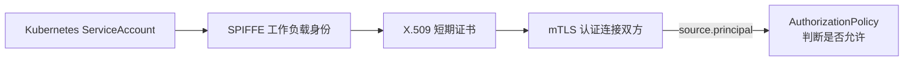
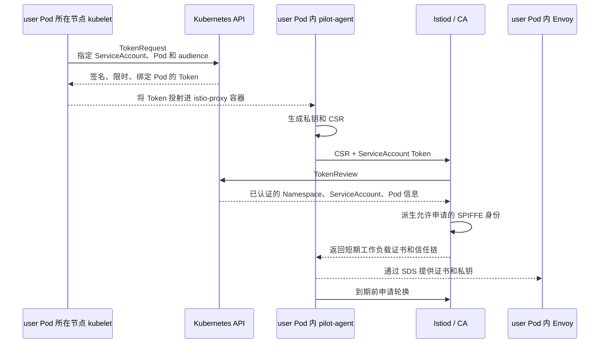
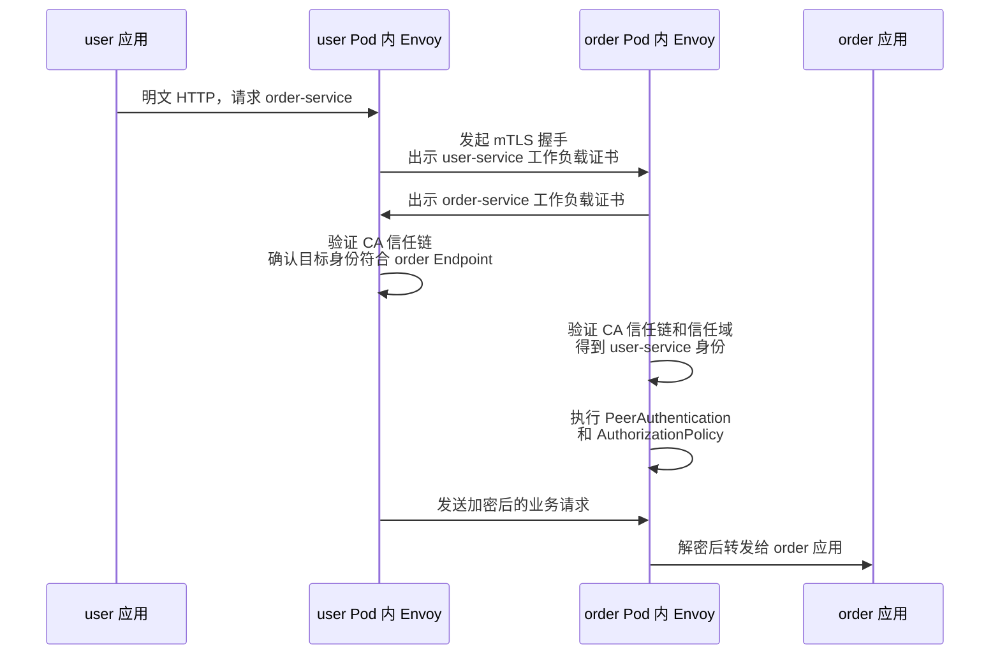
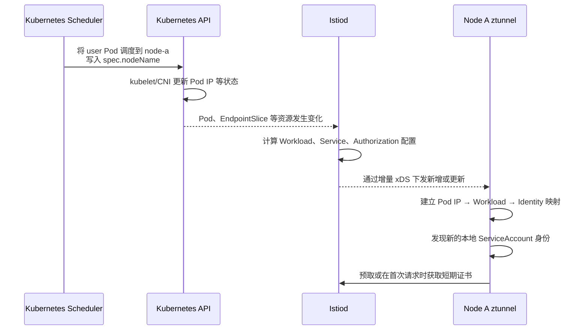
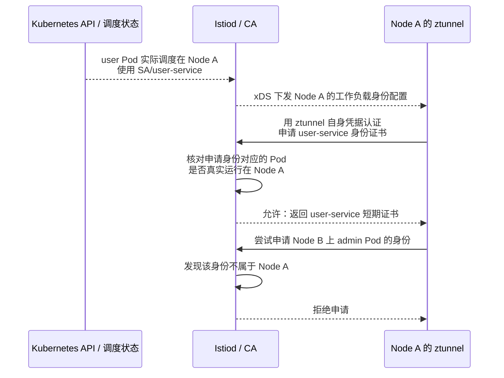
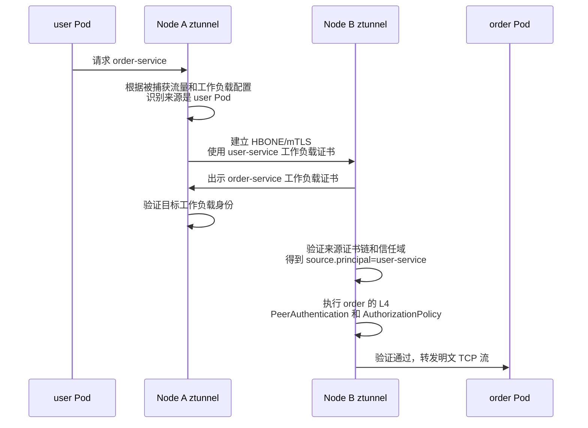
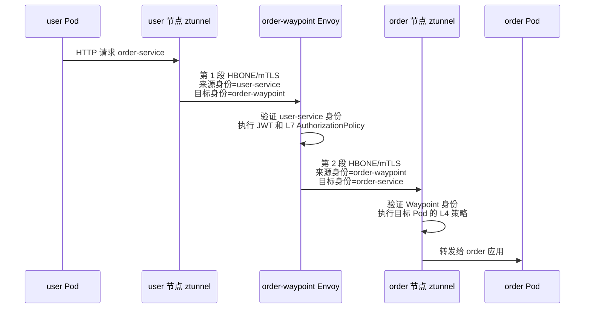

Istio 安全需要依次回答三个问题：

```text
1. 身份：参与通信的是哪个工作负载？
2. 认证：连接对端能否证明这个身份？
3. 授权：已经确认身份以后，是否允许它访问目标？
```

Sidecar 与 Ambient 使用相同的身份基础，但负责保存证书、建立 mTLS 和执行策略的代理不同：

| 模式 | 工作负载身边的代理 | 工作负载 mTLS | L4 授权 | L7/JWT 授权 |
| --- | --- | --- | --- | --- |
| Sidecar | 每个业务 Pod 内的 Envoy Sidecar | 源、目标 Pod 内的 Envoy | Envoy Sidecar | Envoy Sidecar |
| Ambient | 每个节点共享一个 ztunnel，业务 Pod 内无代理 | 源、目标节点的 ztunnel 代表对应工作负载 | 目标节点 ztunnel | 目标侧 Waypoint Envoy |

因此不能笼统地说“user 代理验证 order 代理”。本文使用同一个调用示例，分别讲解两种模式：

```text
user-service → order-service
```

<!-- more -->

## 1. Istio 安全要保护什么

| 问题 | Istio 能力 | 证明的身份 |
| --- | --- | --- |
| 流量是否保密、对端是否可信 | 工作负载证书、mTLS、`PeerAuthentication` | Kubernetes 工作负载身份 |
| HTTP 请求代表哪个登录用户 | JWT、`RequestAuthentication` | 最终用户身份 |
| 已认证的身份能否访问目标 | `AuthorizationPolicy` | 工作负载身份、最终用户身份及请求属性 |

这三层不能互相替代：

- mTLS 能加密连接并认证工作负载，但不表示该工作负载有权访问所有接口；
- JWT 能证明登录用户，但不能证明是哪一个服务把请求转发了过来；
- `AuthorizationPolicy` 使用已经得到的身份和请求属性作出允许或拒绝决定。

## 2. 两种模式共用的身份基础

### 2.1 ServiceAccount 是工作负载身份来源

在 Kubernetes 中，Istio 默认以 Pod 使用的 ServiceAccount 表示工作负载身份：

```yaml
apiVersion: v1
kind: ServiceAccount
metadata:
  name: user-service
  namespace: default
---
apiVersion: v1
kind: Pod
metadata:
  name: user-v1
  namespace: default
spec:
  serviceAccountName: user-service
  containers:
    - name: user
      image: example/user:v1
```

该 Pod 的 Istio 身份可以表示为：

```text
spiffe://cluster.local/ns/default/sa/user-service
```

其中：

```text
cluster.local → Istio 信任域
default       → Namespace
user-service  → ServiceAccount
```

这个身份表示工作负载，不是 Kubernetes `Service/user-service`，也不是登录系统中的用户。多个 Pod 使用同一个 ServiceAccount 时，会拥有相同的 SPIFFE 身份，但各自使用独立的短期证书和私钥。

### 2.2 身份、证书与策略的关系



证书把一个经过 Istio CA 确认的身份绑定到公钥。mTLS 握手时，通信双方验证对方的证书链和身份，随后策略才能可靠使用 `source.principal`。

### 2.3 ServiceAccount 名称为什么不能直接伪造

攻击者仅在 CSR 或请求参数中写入下面的字符串没有用：

```text
serviceAccount = order-service
```

Istiod 不会直接信任申请者填写的身份。它需要根据 Kubernetes 签发的 ServiceAccount Token、TokenReview 结果以及工作负载信息判断申请者有资格获得哪个身份。投射 Token 通常具备签名、有效期、audience、ServiceAccount 和 Pod 绑定信息。

但是，“不能伪造 Token”不等于“绝对不能冒用 ServiceAccount”。如果攻击者有权创建 Pod，并能把 `serviceAccountName` 指向一个高权限 ServiceAccount，kubelet 可能会为这个 Pod 投射一枚合法 Token。此时 TokenReview 会成功，因为身份凭据确实由 Kubernetes 签发。

因此必须同时限制：

1. 谁能创建或修改 Pod、Deployment、Job；
2. 哪些工作负载可以引用哪些 ServiceAccount；
3. ServiceAccount 是否遵循最小权限；
4. 谁能读取 Pod 中的投射 Token、私钥和代理管理接口。

## 3. Sidecar 模式如何验证工作负载

Sidecar 模式的特点是：每个业务 Pod 都有自己的 Envoy。证书保存在本 Pod 的代理侧，mTLS 也由两个业务 Pod 内的 Envoy 建立。

### 3.1 Sidecar 模式中的代理是什么

注入后的 Pod 大致是：

```text
Pod/user-v1
├── user 业务容器
└── istio-proxy 容器
    └── pilot-agent
        └── Envoy Sidecar

Pod/order-v1
├── order 业务容器
└── istio-proxy 容器
    └── pilot-agent
        └── Envoy Sidecar
```

所以在 `user-service → order-service` 这次调用中：

```text
调用方代理 = user Pod 内的 Envoy Sidecar
目标侧代理 = order Pod 内的 Envoy Sidecar
```

这里的“代理”不是 Kubernetes Service，也不是单独部署的 `user-proxy` 或 `order-proxy` Pod。

### 3.2 Sidecar 如何获得自己的工作负载证书

`istio-agent` 不是一个独立 Pod。它通常指 `istio-proxy` 容器中的 `pilot-agent` 所承担的代理管理和证书代理能力。



这个过程不需要创建 Kubernetes `certificates.k8s.io/v1` 的 CSR 资源。Istio 工作负载通常直接调用 Istiod 的证书服务，ServiceAccount Token 用于证明申请者身份。

### 3.3 Sidecar 的 mTLS 如何验证双方

假设两个 Pod 分别使用：

```text
user Pod 证书身份  = spiffe://cluster.local/ns/default/sa/user-service
order Pod 证书身份 = spiffe://cluster.local/ns/default/sa/order-service
```

请求过程如下：



这里有两次身份确认：

1. user Envoy 验证 order Envoy，避免把订单请求发给持有其他有效证书的错误工作负载；
2. order Envoy 验证 user Envoy，并将证书身份转换为策略可使用的 `source.principal`。

### 3.4 Sidecar 中 PeerAuthentication 与 DestinationRule 的方向

```text
PeerAuthentication
→ 目标 Pod 内的 Envoy 接受什么类型的入站连接

DestinationRule.trafficPolicy.tls
→ 调用方 Pod 内的 Envoy 连接目标服务时采用哪种 TLS 模式
```

`DestinationRule` 中的“客户端代理”特指本次调用方 Pod 内的 Envoy。例如 user 调用 order 时，它就是 user Pod 内的 Envoy。

```yaml
apiVersion: security.istio.io/v1
kind: PeerAuthentication
metadata:
  name: order-strict
  namespace: default
spec:
  selector:
    matchLabels:
      app: order
  mtls:
    mode: STRICT
```

| `PeerAuthentication` 模式 | Sidecar 目标侧行为 |
| --- | --- |
| `STRICT` | 只接受 Istio mTLS |
| `PERMISSIVE` | 同时接受 Istio mTLS 和明文，适合迁移期 |
| `DISABLE` | 不要求 Istio mTLS |

启用 Auto mTLS 时，如果目标支持 Istio mTLS 且没有冲突配置，调用方 Envoy 会自动使用 mTLS。通常不需要为了开启网格内部 mTLS，给每个 Service 重复创建 `DestinationRule`。

## 4. Ambient 模式如何验证工作负载

Ambient 模式中业务 Pod 内没有 Envoy Sidecar。每个节点运行一个 ztunnel，它会代表本节点上的多个工作负载处理 L4 流量和 mTLS；需要 HTTP、JWT 等 L7 能力时，再经过目标侧 Waypoint Envoy。

### 4.1 Ambient 中的代理是什么

```text
Node A
├── user Pod（没有 Sidecar）
└── ztunnel Pod
    └── 代表 Node A 上的 Ambient 工作负载处理 L4 流量

Node B
├── order Pod（没有 Sidecar）
└── ztunnel Pod
    └── 代表 Node B 上的 Ambient 工作负载处理 L4 流量

可选的 order-waypoint
└── 独立 Deployment 中的 Envoy
    └── 为绑定它的目标 Service 执行 L7 认证和授权
```

同一个 ztunnel 可以服务节点上的多个 Pod，但这些 Pod不会因此共用 ztunnel 自己的身份。[Istio Ambient 控制面](https://istio.io/latest/docs/ambient/architecture/control-plane/)

### 4.2 一个 ztunnel 如何代表多个工作负载持有证书

假设 Node A 上同时运行：

```text
user Pod    → ServiceAccount/user-service
payment Pod → ServiceAccount/payment-service
```

Node A 的 ztunnel 需要分别持有：

```text
user 身份证书
└── spiffe://cluster.local/ns/default/sa/user-service

payment 身份证书
└── spiffe://cluster.local/ns/default/sa/payment-service

ztunnel 自己的证书
└── 只用于 ztunnel 自己向控制面证明身份
```

ztunnel 通过 xDS 获得工作负载及其身份配置，再从中识别哪些工作负载位于本节点，并向 Istiod 获取这些本地身份需要的短期证书。它会缓存、按需获取并在到期前轮换证书。

最关键的一点是：

> ztunnel 代表 user Pod 建立业务 mTLS 时，使用 user-service 的工作负载证书，而不是 ztunnel 自己的证书。

因此目标侧看到的来源身份仍然可以是 `user-service`，不会变成所有请求都来自 `ztunnel`。[Istio Ambient 数据面身份](https://istio.io/latest/docs/ambient/architecture/data-plane/#identity)

### 4.3 本节点工作负载及其身份配置从哪里来

先看结论：

```text
Kubernetes API 保存事实
→ Istiod 监听这些资源并计算 Ambient 数据面模型
→ ztunnel 通过 xDS 接收 Workload、Service 和授权配置
→ ztunnel 根据 Workload.node 与自己的 NODE_NAME 判断哪些是本地工作负载
→ 为本地工作负载的 ServiceAccount 身份获取证书
```

ztunnel 不直接遍历节点上的容器，也不直接监听整个 Kubernetes API。Kubernetes 资源由 Istiod 统一读取和转换，ztunnel 消费的是 Istiod 生成的、面向 L4 数据面的配置。

#### 4.3.1 Kubernetes API 中已经保存了哪些事实

Pod 被调度以后，Kubernetes API 中的 Pod 对象大致包含：

```yaml
apiVersion: v1
kind: Pod
metadata:
  name: user-v1-7d9c8f
  namespace: default
  labels:
    app: user
spec:
  # 调度器选定节点后写入。
  nodeName: node-a
  # Pod 使用的工作负载身份来源。
  serviceAccountName: user-service
status:
  # CNI 为 Pod 分配地址后写入。
  podIP: 10.0.1.11
```

除此以外，Istiod 还会读取：

- Namespace 是否通过 `istio.io/dataplane-mode=ambient` 加入 Ambient；
- Service 的 VIP、端口和 Selector；
- EndpointSlice 中 Service 与 Pod Endpoint 的关系；
- Service 或 Pod 是否通过 `istio.io/use-waypoint` 绑定 Waypoint；
- `PeerAuthentication`、`AuthorizationPolicy` 等安全策略。

这些资源共同回答：

```text
这个工作负载叫什么？
它的 Pod IP 是什么？
它运行在哪个 Node？
它使用哪个 ServiceAccount？
它是否支持 HBONE？
它属于哪些 Service？
它是否必须经过 Waypoint？
哪些 L4 授权规则对它生效？
```

#### 4.3.2 Istiod 如何把 Kubernetes 资源变成 ztunnel 配置

Istiod 监听 Kubernetes API 的变化，将 Pod、Service、EndpointSlice、Namespace 标签和策略合并成 ztunnel 使用的精简 xDS 资源。

ztunnel 不使用 Envoy Sidecar 那套完整的 Listener、Route、Cluster 和 Endpoint 配置。可以将它主要接收的自定义配置理解成：

```text
Address
├── Workload：描述一个 Pod 或 WorkloadEntry
└── Service：描述一个 Service 或 ServiceEntry

Authorization
└── 描述由 ztunnel 执行的 L4 授权规则
```

一个简化后的 Workload 信息大致如下。它是帮助理解的数据结构，不是可以直接提交给 Kubernetes 的 YAML：

```yaml
workload:
  name: user-v1-7d9c8f
  namespace: default
  address: 10.0.1.11
  node: node-a
  serviceAccount: user-service
  identity: spiffe://cluster.local/ns/default/sa/user-service
  protocol: HBONE
  waypoint: null
```

其中 `identity` 可以根据 Istio 信任域、Namespace 和 ServiceAccount 得到：

```text
spiffe://<trust-domain>/ns/<namespace>/sa/<service-account>
```

Service 配置则让 ztunnel 知道 Service VIP、端口、Endpoint 以及绑定的 Waypoint。源 ztunnel 依靠这些信息把原始目标地址还原成 Service 或具体 Workload，并决定直接转发、建立 HBONE，还是先进入 Waypoint。[Istio ztunnel 架构与 xDS 资源](https://github.com/istio/istio/blob/master/architecture/ambient/ztunnel.md#configuration-protocol)

#### 4.3.3 ztunnel 如何告诉 Istiod“我属于 Node A”

ztunnel 以 DaemonSet 运行，每个节点通常一个 Pod。ztunnel Pod 使用 Kubernetes Downward API 把自己的调度节点写入环境变量：

```yaml
env:
  - name: NODE_NAME
    valueFrom:
      fieldRef:
        fieldPath: spec.nodeName
```

因此 Node A 上的 ztunnel 启动时知道：

```text
自己的 Pod 名称和 Namespace
自己的 ServiceAccount
自己的 NODE_NAME=node-a
自己的网络和集群标识
Istiod 的 xDS/CA 地址
```

ztunnel 使用自己的凭据连接 Istiod。Istiod 知道这个 xDS 客户端是哪一个 ztunnel，ztunnel 也知道自己的本地节点名。收到 Workload 配置后，它可以比较：

```text
Workload.node == NODE_NAME
```

匹配的 Workload 才属于本节点，也只有这些本地工作负载的 ServiceAccount 身份进入证书获取集合。

#### 4.3.4 为什么 xDS 中还需要远端工作负载

“识别本节点身份”不表示 ztunnel 只接收本节点 Workload。源 ztunnel 还必须知道远端目标才能转发。

例如 Istiod 下发以下配置：

| Workload | Node | Pod IP | ServiceAccount | 本节点 ztunnel 是否可为其取证书 |
| --- | --- | --- | --- | --- |
| `user-v1` | `node-a` | `10.0.1.11` | `user-service` | Node A：可以 |
| `payment-v1` | `node-a` | `10.0.1.12` | `payment-service` | Node A：可以 |
| `order-v1` | `node-b` | `10.0.2.21` | `order-service` | Node A：不可以 |

Node A 的 ztunnel 需要知道 `order-v1` 的地址、节点、身份和 HBONE 能力，才能把 user 的请求发送到正确目标并验证目标证书；但它不能因此获得 `order-service` 的私钥和证书。

```text
xDS 可见范围
└── 包含完成路由所需的本地和远端 Workload/Service 信息

证书申请权限
└── 只包含实际运行在本节点的工作负载身份
```

#### 4.3.5 Pod 创建、迁移和删除时如何更新

以新建 user Pod 为例：



Pod 删除或被重新调度时，Istiod 会根据 Kubernetes 变化更新 xDS。ztunnel 随之移除或更新 Workload 映射，不再把已经离开本节点的 Pod 当成本地工作负载。证书是按唯一 ServiceAccount 身份管理的；同一节点的多个 Pod 使用相同 ServiceAccount 时，不需要为每个 Pod 保存一种不同身份。

这一步只解决“ztunnel 应该代表谁”的发现问题。xDS 中的 Workload 身份配置不是证书本身，也不包含其他 Pod 的 ServiceAccount Token 或私钥；证书仍要经过下一节的 CA 授权和签发流程获得。[Istio Ambient 控制面](https://istio.io/latest/docs/ambient/architecture/control-plane/)、[ztunnel 配置排查](https://istio.io/latest/docs/ambient/usage/troubleshoot-ztunnel/#viewing-ztunnel-proxy-state)

### 4.4 Istiod 为什么允许 ztunnel 申请别人的身份

ztunnel 的确是在“为另一个工作负载申请证书”，因此控制面必须限制它可以申请的范围：



官方安全模型要求 CA 确认 ztunnel 有权申请目标身份；对不在该节点运行的工作负载身份应拒绝签发。这样即使某个 ztunnel 被攻破，直接可冒用的身份范围也被限制在同节点工作负载，而不是整个网格。

但这不是说风险为零。ztunnel 会持有本节点工作负载的私钥材料，节点或 ztunnel 被攻破时，本节点工作负载身份都可能受到影响，所以节点安全仍然是 Ambient 的重要信任边界。[Istio 安全模型](https://istio.io/latest/docs/ops/deployment/security-model/#proxy-compromise-ztunnel)

### 4.5 不经过 Waypoint 时如何验证 user 工作负载

只有 ztunnel 的 L4 安全路径是：



虽然图上看起来是“ztunnel 到 ztunnel”，mTLS 使用的逻辑身份是：

```text
来源身份 = user Pod 的 ServiceAccount 身份
目标身份 = order Pod 的 ServiceAccount 身份
```

而不是：

```text
来源身份 = Node A ztunnel 的 ServiceAccount
目标身份 = Node B ztunnel 的 ServiceAccount
```

目标 ztunnel 完成证书链和对端身份验证后，才能可靠得到：

```text
source.principal = cluster.local/ns/default/sa/user-service
```

然后它可以执行只依赖来源身份、Namespace、IP、目标端口等属性的 L4 授权策略。

### 4.6 经过 Waypoint 时身份如何变化

如果 `order-service` 绑定了 `order-waypoint`，请求会建立两段独立的 HBONE/mTLS：



这里必须区分两个观察点：

```text
order-waypoint 看到的来源身份
└── user-service

order Pod 所在节点的目标 ztunnel 看到的来源身份
└── order-waypoint 的 ServiceAccount
```

Waypoint 不会在第二段连接中冒充原始 user 工作负载。它用自己的身份连接目标 ztunnel。因此：

- 需要根据原始 `user-service` 身份做判断的策略，应附加到目标 Service，由 Waypoint 执行；
- 目标 Pod 上由 ztunnel 执行的 L4 策略，可以只允许 `order-waypoint` 身份进入，从而防止客户端绕过 Waypoint。

### 4.7 如何强制请求不能绕过 Waypoint

仅给 Service 添加 `istio.io/use-waypoint` 表示路由意图。若 Waypoint 的 L7 安全策略是强制安全边界，还应在目标工作负载的 ztunnel 上增加 L4 策略，只允许 Waypoint 的身份访问。

假设 Waypoint Gateway 名为 `order-waypoint`，它通常使用同名 ServiceAccount：

```yaml
apiVersion: security.istio.io/v1
kind: AuthorizationPolicy
metadata:
  name: order-require-waypoint
  namespace: default
spec:
  selector:
    matchLabels:
      app: order
  action: ALLOW
  rules:
    - from:
        - source:
            principals:
              - cluster.local/ns/default/sa/order-waypoint
```

这条策略由目标节点 ztunnel 执行。客户端直接连接 order Pod 时，来源身份是客户端自身，不是 `order-waypoint`，因此会被拒绝；正常经过 Waypoint 的第二段连接则可以通过。[Istio：强制流量经过 Waypoint](https://istio.io/latest/docs/ambient/usage/waypoint/#enforce-use-of-waypoints)

### 4.8 Ambient 中 PeerAuthentication 的含义

`PeerAuthentication` 仍由目标 ztunnel 执行：

```yaml
apiVersion: security.istio.io/v1
kind: PeerAuthentication
metadata:
  name: order-strict
  namespace: default
spec:
  selector:
    matchLabels:
      app: order
  mtls:
    mode: STRICT
```

Ambient 工作负载默认可能同时接受 HBONE/mTLS 和来自网格外的明文流量；设置 `STRICT` 后，目标只接受已建立 Istio mTLS 的流量。因为 ztunnel 与 HBONE 本身要求 mTLS，Ambient 中不能用 `DISABLE` 关闭已捕获工作负载的 mTLS。

Ambient 的 ztunnel 会根据目标工作负载能力自动把连接升级为 HBONE/mTLS，并按目标工作负载身份进行验证。不要用“调用方 Sidecar 的 `DestinationRule.trafficPolicy.tls`”去解释 Ambient，因为 Ambient 业务 Pod 中根本没有调用方 Sidecar。

### 4.9 如何确认 Ambient 确实验证了工作负载

先检查工作负载是否进入 Ambient，以及协议是否为 HBONE：

```bash
istioctl ztunnel-config workloads
```

再检查 ztunnel 已获得的证书：

```bash
istioctl ztunnel-config certificates <ZTUNNEL-POD>.istio-system
```

最后检查 ztunnel 日志中的来源和目标身份：

```bash
kubectl logs -n istio-system <ZTUNNEL-POD> | grep "connection complete"
```

关注下面的字段：

```text
src.identity = spiffe://cluster.local/ns/default/sa/user-service
dst.identity = spiffe://cluster.local/ns/default/sa/order-service
```

同时可以检查指标中的：

```text
connection_security_policy="mutual_tls"
source_principal="spiffe://cluster.local/ns/default/sa/user-service"
destination_principal="spiffe://cluster.local/ns/default/sa/order-service"
```

这些信息能证明 ztunnel 使用的是业务工作负载身份，而不是只建立了一个无法区分 Pod 身份的节点级隧道。[Istio：验证 Ambient mTLS](https://istio.io/latest/docs/ambient/usage/verify-mtls-enabled/)

## 5. 最终用户 JWT 在哪里验证

mTLS 认证的是工作负载。例如它能证明请求来自 `user-service`，但不能证明请求代表登录用户 Jason。最终用户身份通常通过 JWT 验证。

### 5.1 Sidecar 模式

Sidecar 模式可以把 `RequestAuthentication` 和 L7 `AuthorizationPolicy` 选择到 order 工作负载，由 order Pod 内的 Envoy 执行：

```yaml
apiVersion: security.istio.io/v1
kind: RequestAuthentication
metadata:
  name: order-jwt
  namespace: default
spec:
  selector:
    matchLabels:
      app: order
  jwtRules:
    - issuer: "https://login.example.com"
      jwksUri: "https://login.example.com/.well-known/jwks.json"
      audiences:
        - order-api
```

```text
user Envoy → order Envoy 验证 JWT → order 应用
```

### 5.2 Ambient 模式

ztunnel 不解析 HTTP，也不验证 JWT。Ambient 中必须让 `order-service` 经过 Waypoint，并用 `targetRefs` 把 `RequestAuthentication` 附加到目标 Service：

```yaml
apiVersion: security.istio.io/v1
kind: RequestAuthentication
metadata:
  name: order-jwt
  namespace: default
spec:
  targetRefs:
    - group: ""
      kind: Service
      name: order-service
  jwtRules:
    - issuer: "https://login.example.com"
      jwksUri: "https://login.example.com/.well-known/jwks.json"
      audiences:
        - order-api
```

```text
user ztunnel → order-waypoint 验证 JWT → order ztunnel → order 应用
```

`RequestAuthentication` 主要验证“请求中已经携带的 JWT”。如果没有 JWT，请求不一定会自动被拒绝。要求必须登录时，还要用 `AuthorizationPolicy` 要求 `requestPrincipals` 存在。

## 6. AuthorizationPolicy 在哪里执行

### 6.1 Sidecar 模式

Sidecar 模式中，order Pod 内的 Envoy 同时拥有 L4 和 L7 信息，可以同时检查来源工作负载、JWT 用户、HTTP 方法和路径：

```yaml
apiVersion: security.istio.io/v1
kind: AuthorizationPolicy
metadata:
  name: order-sidecar-policy
  namespace: default
spec:
  selector:
    matchLabels:
      app: order
  action: ALLOW
  rules:
    - from:
        - source:
            principals:
              - cluster.local/ns/default/sa/user-service
            requestPrincipals:
              - "*"
      to:
        - operation:
            methods: ["GET"]
            paths: ["/orders/*"]
```

执行位置是：

```text
order Pod 内的 Envoy Sidecar
```

### 6.2 Ambient 模式

Ambient 必须把策略按层拆开。

只依赖来源身份、Namespace、IP 或端口的 L4 策略，可以使用 `selector` 选择目标 Pod，由目标节点 ztunnel 执行：

```yaml
apiVersion: security.istio.io/v1
kind: AuthorizationPolicy
metadata:
  name: order-l4
  namespace: default
spec:
  selector:
    matchLabels:
      app: order
  action: ALLOW
  rules:
    - from:
        - source:
            principals:
              - cluster.local/ns/default/sa/order-waypoint
```

需要原始 user 身份、JWT、HTTP 方法或路径的策略，使用 `targetRefs` 挂到 `Service/order-service`，由 Waypoint 执行：

```yaml
apiVersion: security.istio.io/v1
kind: AuthorizationPolicy
metadata:
  name: order-l7
  namespace: default
spec:
  targetRefs:
    - group: ""
      kind: Service
      name: order-service
  action: ALLOW
  rules:
    - from:
        - source:
            principals:
              - cluster.local/ns/default/sa/user-service
            requestPrincipals:
              - "*"
      to:
        - operation:
            methods: ["GET"]
            paths: ["/orders/*"]
```

两条策略配合后的含义是：

```text
order-waypoint：
验证原始来源是 user-service、JWT 有效、请求为 GET /orders/*

order 目标节点 ztunnel：
验证最后一段 mTLS 的来源确实是 order-waypoint，拒绝绕过路径
```

### 6.3 策略求值顺序

```text
CUSTOM → DENY → ALLOW → 默认结果
```

1. 匹配 `CUSTOM` 时，先交给外部授权服务；
2. 匹配任一 `DENY` 时拒绝；
3. 如果作用范围内存在 `ALLOW`，只有匹配至少一条 `ALLOW` 的请求才允许；
4. 如果没有适用的 `ALLOW`，不会仅因为缺少 `ALLOW` 而默认拒绝；
5. `AUDIT` 只产生审计标记，本身不改变允许或拒绝结果。

## 7. 两种模式的完整安全流程

### 7.1 Sidecar 模式

```text
user 应用
→ user Envoy 使用 user-service 证书发起 mTLS
→ order Envoy 验证 user-service 身份
→ order Envoy 验证 JWT
→ order Envoy 执行 L4/L7 AuthorizationPolicy
→ order 应用
```

### 7.2 Ambient 模式并经过 Waypoint

```text
user 应用
→ user 节点 ztunnel 使用 user-service 证书发起第 1 段 HBONE/mTLS
→ order-waypoint 验证 user-service 身份
→ order-waypoint 验证 JWT 并执行 L7 AuthorizationPolicy
→ order-waypoint 使用自身证书发起第 2 段 HBONE/mTLS
→ order 节点 ztunnel 验证 order-waypoint 身份并执行 L4 AuthorizationPolicy
→ order 应用
```

两种模式最终都能验证工作负载，差别不是“Ambient 没有工作负载身份”，而是身份凭据和验证动作从 Pod 内 Sidecar 移到了节点 ztunnel，并把 L7 能力拆到了目标 Waypoint。

## 8. 容易混淆的地方

1. **ztunnel 共享不等于身份共享**：一个 ztunnel 代表多个 Pod，但为不同 ServiceAccount 管理不同证书。
2. **ztunnel 自身身份不等于业务身份**：无 Waypoint 的业务 HBONE 使用源、目标工作负载身份。
3. **经过 Waypoint 后来源身份会变化**：Waypoint 看到原始调用方身份，目标 ztunnel 看到 Waypoint 身份。
4. **mTLS 不等于授权**：mTLS 证明身份并加密连接，`AuthorizationPolicy` 才决定是否放行。
5. **RequestAuthentication 不等于强制登录**：要拒绝没有 JWT 的请求，还要要求 `requestPrincipals`。
6. **Ambient 的 ztunnel 不能执行 HTTP/JWT 规则**：这些七层策略必须由 Waypoint 执行。
7. **ServiceAccount 不等于 Kubernetes Service**：前者是身份来源，后者是服务发现和 Endpoint 入口。

## 9. 总结

```text
Sidecar：
每个 Pod 的 pilot-agent 申请证书
→ 每个 Pod 内的 Envoy 使用该证书建立 mTLS
→ 目标 Pod 内 Envoy 验证调用方并执行 L4/L7 策略

Ambient：
每个节点的 ztunnel 为本节点工作负载管理不同证书
→ ztunnel 代表具体工作负载建立 HBONE/mTLS
→ 目标 ztunnel 验证 L4 身份
→ 需要 L7 时，由目标 Waypoint 验证原始调用方、JWT 和 HTTP 规则
```

排查 Istio 安全问题时，也应按模式确认：证书由谁持有、哪一段 mTLS 使用哪个身份、策略实际由 ztunnel、Waypoint 还是 Sidecar 执行。

## 10. 参考资料

1. [Istio 安全概念](https://istio.io/latest/zh/docs/concepts/security/)
2. [Istio Ambient 控制面](https://istio.io/latest/docs/ambient/architecture/control-plane/)
3. [Istio Ambient 数据面与工作负载身份](https://istio.io/latest/docs/ambient/architecture/data-plane/)
4. [Istio HBONE](https://istio.io/latest/docs/ambient/architecture/hbone/)
5. [验证 Ambient mTLS](https://istio.io/latest/docs/ambient/usage/verify-mtls-enabled/)
6. [使用 Waypoint](https://istio.io/latest/docs/ambient/usage/waypoint/)
7. [Istio 安全模型](https://istio.io/latest/docs/ops/deployment/security-model/)
8. [PeerAuthentication API](https://istio.io/latest/zh/docs/reference/config/security/peer_authentication/)
9. [RequestAuthentication API](https://istio.io/latest/zh/docs/reference/config/security/request_authentication/)
10. [AuthorizationPolicy API](https://istio.io/latest/zh/docs/reference/config/security/authorization-policy/)
