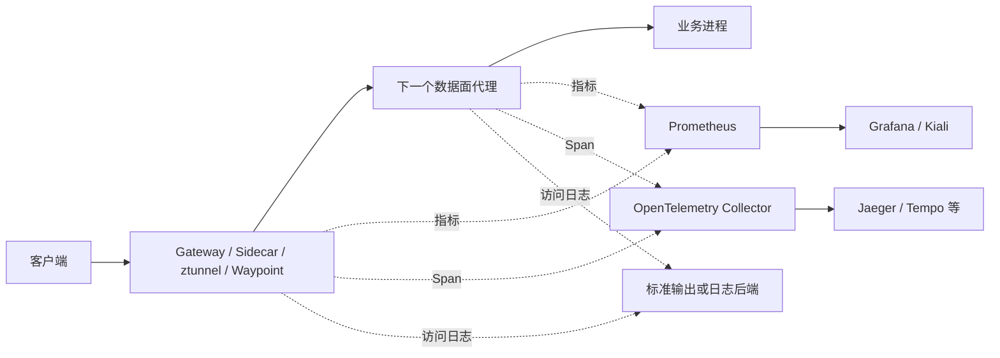
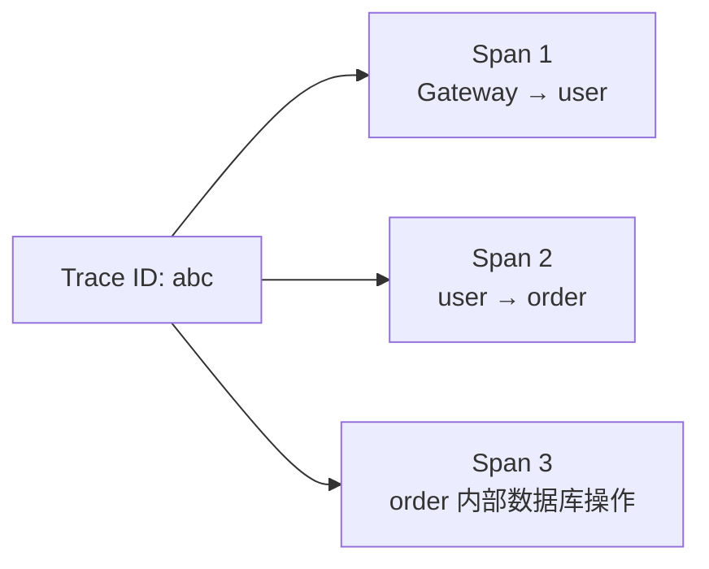
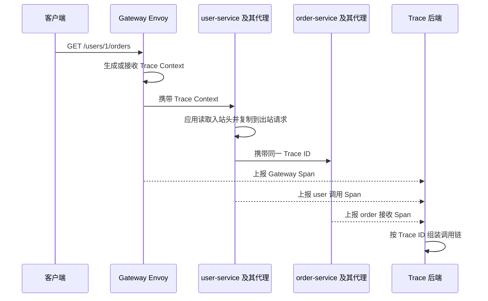
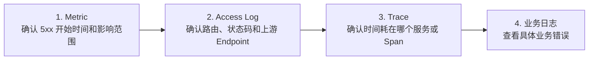

Istio 的可观测性并不是“安装一个监控界面”，而是让数据面代理在转发流量时产生统一的遥测数据，再由 Prometheus、OpenTelemetry Collector、Jaeger 等后端存储和展示。

```text
业务请求
  → Istio 数据面代理转发请求
  → 代理产生 Metric、Access Log、Trace Span
  → 可观测性后端采集、关联和展示
```

本文按照“先看整体，再分别理解三类数据，最后串联一次排障过程”的顺序介绍。

<!-- more -->

## 1. 三类可观测数据分别回答什么问题

| 数据 | 主要回答的问题 | 典型用途 |
| --- | --- | --- |
| Metric（指标） | 系统是否异常、异常范围有多大 | 告警、趋势、成功率、延迟和流量分析 |
| Access Log（访问日志） | 某一次请求经过代理时发生了什么 | 查看状态码、源和目标、路由结果、上游地址 |
| Trace（链路追踪） | 一次请求跨服务时，时间花在了哪里 | 还原调用链、定位慢服务和错误节点 |

三者不是互相替代的：指标适合发现问题，访问日志适合核对某次代理转发，链路追踪适合还原跨服务调用。

## 2. 遥测数据在哪里产生



Istio 的主要优势是代理可以统一生成网络遥测数据，业务不需要在每个接口中手工统计 HTTP 状态码和请求耗时。不过，代理只能看到经过自己的那一段流量：

1. Gateway Envoy 能观察网关入口和出口。
2. Sidecar Envoy 能观察所在 Pod 的入站和出站流量。
3. Ambient 的 ztunnel 主要观察四层连接、字节数和工作负载身份。
4. Waypoint 使用 Envoy 处理七层流量，可以观察 HTTP 方法、路径、状态码和路由结果。

因此，在 Ambient 模式中只有 ztunnel、没有 Waypoint 时，不能期待获得完整的 HTTP 七层指标和访问日志。

## 3. Metric：先用聚合数据发现问题

### 3.1 三个层次的指标

Istio 官方将指标分为三个层次：

1. **代理级指标**：Envoy 自身的连接数、监听器、集群、内存等运行状态。
2. **服务级指标**：请求量、成功率、延迟和传输字节数，例如 `istio_requests_total`。
3. **控制面指标**：Istiod 的配置分发、代理连接和证书等状态。

排查业务请求时通常先看服务级指标；排查代理或控制面健康状态时，再看代理级和控制面指标。

### 3.2 一条服务指标包含什么

以 HTTP 请求计数为例，指标不仅有一个数值，还带有用于聚合的标签：

```text
istio_requests_total{
  reporter="destination",
  source_workload="user-v1",
  destination_workload="order-v1",
  response_code="503"
} 12
```

这表达的是：从 `user-v1` 到 `order-v1` 的请求，在目标端代理看来出现了 12 次 `503`。

常用分析方式包括：

```promql
# order-service 每秒请求量
sum(rate(istio_requests_total{destination_service_name="order-service"}[5m]))

# order-service 的 5xx 比例
sum(rate(istio_requests_total{destination_service_name="order-service",response_code=~"5.."}[5m]))
/
sum(rate(istio_requests_total{destination_service_name="order-service"}[5m]))
```

标签越多，分析维度越丰富，但时序数量也越多。不要随意把用户 ID、订单 ID 等高基数字段添加为指标标签，它们更适合出现在日志或 Trace 中。

## 4. Access Log：查看代理如何处理一次请求

访问日志由代理针对请求或连接产生。它与业务日志的关注点不同：

```text
业务日志：创建订单失败，库存不足
访问日志：POST /orders，响应 409，上游 10.0.2.17:8080，耗时 18 ms
```

一条 Envoy 访问日志通常可以回答：

1. 请求从哪里来、要到哪里去。
2. 请求的方法、路径和协议是什么。
3. 代理返回了什么状态码以及响应标志。
4. 最终选择了哪个上游 Endpoint。
5. 请求耗时和收发字节数是多少。

可以通过 Telemetry API 为网格启用访问日志：

```yaml
apiVersion: telemetry.istio.io/v1
kind: Telemetry
metadata:
  name: mesh-default
  namespace: istio-system
spec:
  accessLogging:
    - providers:
        - name: envoy
```

放在根命名空间且没有选择器的 `Telemetry` 作用于整个网格；也可以在业务命名空间创建配置，或者使用 `selector`/`targetRefs` 缩小作用范围。

## 5. Trace：还原跨服务调用链

### 5.1 Trace 和 Span

假设一次请求经过：

```text
Ingress Gateway → user-service → order-service
```

一次完整调用是一个 Trace，每一段网络调用或应用内部操作是一个 Span：



每个 Span 有自己的 Span ID，并通过 Parent Span ID 形成父子关系。Trace ID 用来说明这些 Span 属于同一次端到端请求。

### 5.2 代理能自动生成 Span，但应用必须传播上下文

Istio 代理可以自动为经过它的请求生成 Span，但代理无法知道业务进程发出的下游请求是否仍属于原来的上游请求。应用必须把追踪上下文从入站请求复制到出站请求。

常见需要传播的请求头包括：

```text
x-request-id
traceparent
tracestate
b3
x-b3-traceid
x-b3-spanid
x-b3-sampled
```

实际传播哪一组取决于使用的追踪协议和后端。W3C Trace Context 使用 `traceparent`、`tracestate`；Zipkin 生态常使用 B3 头。

如果 `user-service` 没有传播这些请求头，两个代理仍可能分别生成 Span，但后端无法稳定地把 `Gateway → user` 和 `user → order` 拼成同一个 Trace。

### 5.3 一次 Trace 是怎样形成的



代理上报的是网络调用 Span。若要看到数据库查询、消息消费或业务方法内部耗时，仍需使用 OpenTelemetry SDK 等方式对业务代码进行埋点。

## 6. 如何配置链路追踪

链路追踪需要两层配置：

1. 在 Istio 安装配置中注册一个遥测后端 Provider。
2. 使用 `Telemetry` 资源选择 Provider 并设置采样率。

下面使用 OpenTelemetry Collector 举例。

### 6.1 注册 Provider

```yaml
meshConfig:
  extensionProviders:
    - name: otel-tracing
      opentelemetry:
        service: opentelemetry-collector.observability.svc.cluster.local
        port: 4317
```

`extensionProviders` 告诉 Istiod：名称为 `otel-tracing` 的 Provider 对应哪个服务。它只声明后端地址，不代表已对工作负载启用追踪。

### 6.2 启用 Provider 和设置采样率

```yaml
apiVersion: telemetry.istio.io/v1
kind: Telemetry
metadata:
  name: mesh-default
  namespace: istio-system
spec:
  tracing:
    - providers:
        - name: otel-tracing
      randomSamplingPercentage: 10
```

`randomSamplingPercentage: 10` 表示大约采样 10% 的请求。采样率越高，问题细节越完整，但上报、存储和查询成本也越高。

配置关系如下：

```text
Telemetry.spec.tracing.providers.name
    → MeshConfig.extensionProviders.name
    → OpenTelemetry Collector Service
    → Jaeger、Tempo 等存储与查询后端
```

## 7. Sidecar 与 Ambient 模式下的差异

| 模式 | 主要观测点 | 默认可见层次 |
| --- | --- | --- |
| Sidecar | 每个业务 Pod 内的 Envoy | 四层连接和 HTTP 七层请求 |
| Ambient，仅 ztunnel | 每个节点的 ztunnel | 以四层连接、身份和字节为主 |
| Ambient，经过 Waypoint | ztunnel + Waypoint Envoy | ztunnel 的四层信息和 Waypoint 的 HTTP 七层信息 |
| Ingress/Egress Gateway | Gateway Envoy | 网格入口或出口的七层请求 |

例如 `user-service` 在 Ambient 模式中需要按 HTTP 路径观察请求或执行七层策略，就必须让对应流量经过 Waypoint；ztunnel 本身不是 HTTP 七层代理。

## 8. 用三类数据完成一次排障

假设告警显示 `order-service` 错误率升高：



1. 用指标确认是所有调用方异常，还是只有 `user-service → order-service` 异常。
2. 用访问日志确认 Envoy 选择了哪个 `order-service` Endpoint，是否出现 `UH`、`UF` 等响应标志。
3. 用 Trace 查看延迟集中在 Gateway、user、order，还是应用内部数据库 Span。
4. 根据 Trace ID 或请求 ID 查询业务日志，得到具体错误原因。

## 9. 容易混淆的地方

1. **Istio 不等于可观测性存储后端**：Istio 负责产生和导出遥测数据，Prometheus、Jaeger、Tempo 等负责存储和查询。
2. **有代理不等于调用链一定完整**：代理能生成 Span，但应用仍要传播 Trace Context。
3. **Access Log 不等于业务日志**：它描述代理看到的网络请求，不知道库存不足等业务含义。
4. **Kiali 不直接替代 Prometheus 或 Trace 后端**：它主要读取这些后端的数据并展示服务拓扑。
5. **采样不是过滤日志**：采样决定哪些请求产生或上报 Trace，指标仍然是聚合统计。

## 10. 总结

Istio 可观测性的核心链路是：

```text
代理转发流量
  → Metric 发现问题
  → Access Log 核对代理行为
  → Trace 还原跨服务调用
  → 业务日志解释业务原因
```

理解时最重要的是区分“数据在哪里产生”和“数据在哪里存储”。Istio 的数据面负责观察流量并产生遥测数据，Telemetry API 负责声明生成和导出方式，外部后端负责保存、查询和展示。

## 11. 参考资料

1. [Istio 可观测性](https://istio.io/latest/zh/docs/concepts/observability/)
2. [分布式追踪概览](https://istio.io/latest/zh/docs/tasks/observability/distributed-tracing/overview/)
3. [Telemetry API](https://istio.io/latest/zh/docs/reference/config/telemetry/)
4. [Istio 标准指标](https://istio.io/latest/zh/docs/reference/config/metrics/)
