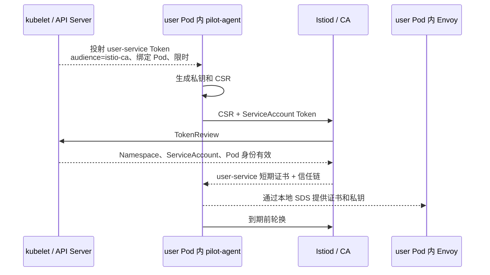
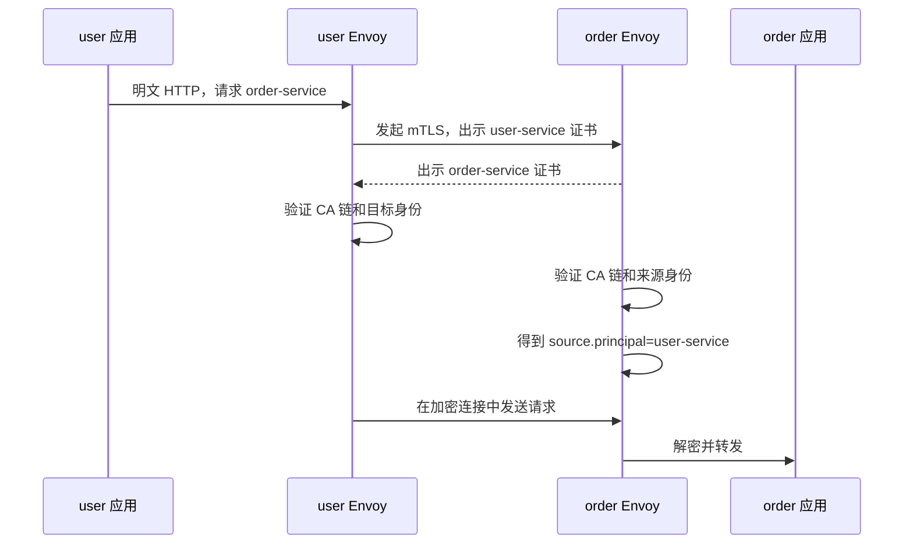
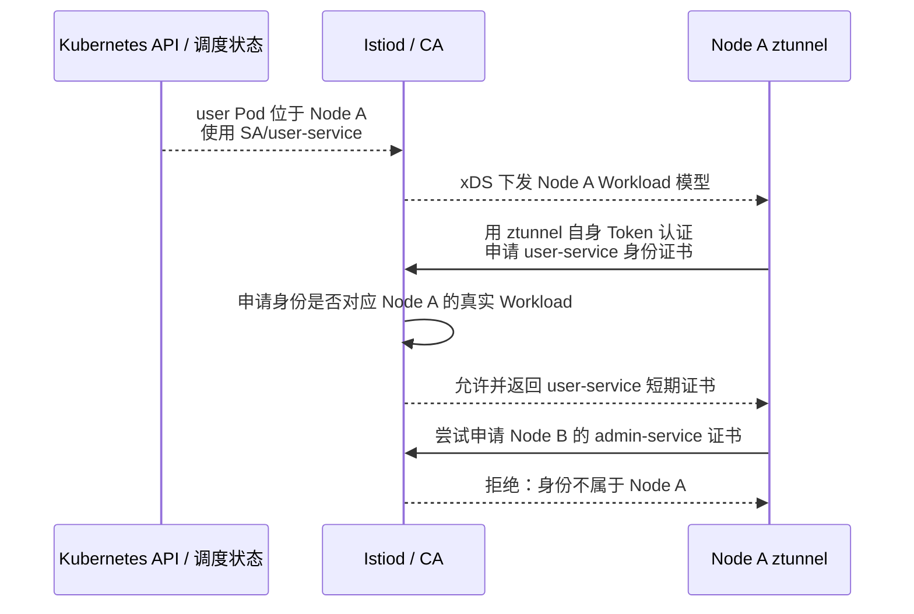
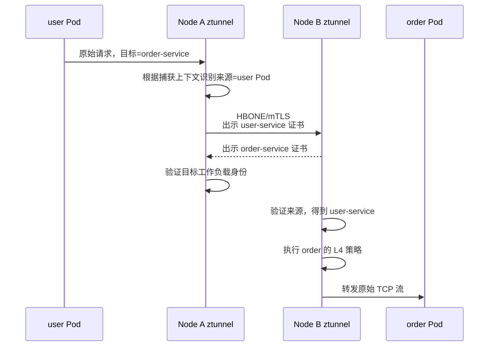
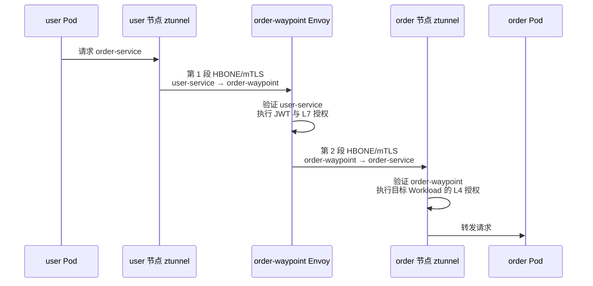

[上一篇](./015_istio_init.md)已经建立了 Istio 安全所依赖的公共基础：ServiceAccount、SPIFFE 身份、Istiod CA、投射 Token、xDS、SDS 和 HBONE。本文不再按资源清单展开，而是沿一条实际请求，分别追踪 Sidecar 与 Ambient 的认证和授权执行过程：

```text
user-service → order-service
```

阅读每条流程时始终回答四个问题：

```text
1. 谁持有私钥和工作负载证书？
2. 谁发起和终止 mTLS？
3. 谁验证最终用户 JWT？
4. 谁执行哪一层 AuthorizationPolicy？
```

<!-- more -->

## 1. 安全架构与使用场景

### 1.1 三层身份与策略

Istio 安全不是一个单独的开关，而是三层互相衔接的能力：

| 问题 | Istio 能力 | 得到的结果 |
| --- | --- | --- |
| 对端是哪个工作负载 | 工作负载证书、mTLS、`PeerAuthentication` | SPIFFE 工作负载身份 |
| HTTP 请求代表哪个登录用户 | JWT、`RequestAuthentication` | 最终用户身份和 claims |
| 已认证身份是否可以访问目标 | `AuthorizationPolicy` | ALLOW、DENY 或交给外部授权 |

这三层不能互相替代：

- mTLS 能加密连接并认证工作负载，但不表示该工作负载可以访问所有接口；
- JWT 能证明最终用户，但不能证明是哪一个服务把请求转发过来；
- `AuthorizationPolicy` 使用已经得到的身份和请求属性作出允许或拒绝决定，本身不签发身份。

### 1.2 Sidecar 与 Ambient 的安全组件

| 模式 | 证书持有者 | 工作负载 mTLS | L4 授权 | L7/JWT 授权 |
| --- | --- | --- | --- | --- |
| Sidecar | 每个业务 Pod 内的 pilot-agent/Envoy | 源、目标 Pod 内 Envoy | 目标 Envoy Sidecar | 目标 Envoy Sidecar |
| Ambient，无 Waypoint | 节点 ztunnel 代表本节点工作负载持有不同证书 | 源、目标 ztunnel | 目标 ztunnel | 不支持 |
| Ambient，有 Waypoint | ztunnel + Waypoint 各持有职责对应的证书 | 两段 HBONE/mTLS | 目标 ztunnel | 目标服务的 Waypoint Envoy |

因此不能笼统地说“user 代理验证 order 代理”。Sidecar 中代理属于 Pod；Ambient 中 ztunnel 属于 Node，Waypoint 属于目标 Service 的 L7 处理路径。

### 1.3 示例身份

两个工作负载分别使用独立 ServiceAccount：

```text
user Pod
└── spiffe://cluster.local/ns/default/sa/user-service

order Pod
└── spiffe://cluster.local/ns/default/sa/order-service
```

如果使用 Waypoint：

```text
order-waypoint
└── spiffe://cluster.local/ns/default/sa/order-waypoint
```

以下内容省略 URI 前缀时，会用 `user-service`、`order-service` 和 `order-waypoint` 指代这三个完整 SPIFFE 身份。

## 2. Sidecar 模式的认证执行过程

### 2.1 数据面拓扑

注入后的 Pod 大致是：

```text
Pod/user-v1
├── user 业务容器
└── istio-proxy
    └── pilot-agent + Envoy Sidecar

Pod/order-v1
├── order 业务容器
└── istio-proxy
    └── pilot-agent + Envoy Sidecar
```

`istio-agent` 不是额外的 Pod。通常是 `istio-proxy` 容器中的 `pilot-agent` 所承担的代理启动、xDS 引导和证书代理能力。

### 2.2 Sidecar 如何获得自己的证书

每个 Sidecar Pod 只能使用投射给该 Pod 的 ServiceAccount Token 为自己申请身份：



私钥在 Pod 内生成，不需要发给 Istiod。Istiod 返回的是由网格 CA 签名的工作负载证书。order Pod 独立执行同样流程，得到 `order-service` 证书。

### 2.3 Sidecar mTLS 如何验证双方



双方验证解决两个不同风险：

1. user Envoy 验证目标身份，避免把订单请求交给只持有“某张有效 Istio 证书”的错误工作负载；
2. order Envoy 验证来源身份，确保后续策略使用的 `source.principal` 来自证书，而不是 HTTP Header 中可伪造的字符串。

### 2.4 `PeerAuthentication` 与 `DestinationRule` 的方向

```text
PeerAuthentication
→ 约束目标工作负载的入站连接接受哪种认证模式

DestinationRule.trafficPolicy.tls
→ 约束调用方 Envoy 连接目标时使用哪种 TLS 模式
```

例如 order 只允许 Istio mTLS：

```yaml
apiVersion: security.istio.io/v1
kind: PeerAuthentication
metadata:
  name: order-strict
  namespace: default
spec:
  selector:
    matchLabels:
      app: order
  mtls:
    mode: STRICT
```

| 模式 | Sidecar 目标侧行为 |
| --- | --- |
| `STRICT` | 只接受 Istio mTLS |
| `PERMISSIVE` | 同时接受 Istio mTLS 和明文，适合迁移期 |
| `DISABLE` | 不要求 Istio mTLS |

启用 Auto mTLS 时，Istiod 知道目标 Endpoint 是否属于网格，调用方 Envoy 会自动为网格目标使用 mTLS。通常不需要为每个 Service 重复创建 `DestinationRule` 来“开启 mTLS”；错误地强制 `DISABLE` 或 `SIMPLE` 反而可能破坏自动协商。

### 2.5 Sidecar 如何验证 JWT

mTLS 得到的是 `user-service` 工作负载身份。如果请求还代表登录用户 Jason，需要在 order 目标上配置 JWT 验证：

```yaml
apiVersion: security.istio.io/v1
kind: RequestAuthentication
metadata:
  name: order-jwt
  namespace: default
spec:
  selector:
    matchLabels:
      app: order
  jwtRules:
    - issuer: "https://login.example.com"
      jwksUri: "https://login.example.com/.well-known/jwks.json"
      audiences:
        - order-api
```

Istiod 把规则转换成 Envoy 配置，由 order Pod 内的 Envoy 提取 Bearer Token、获取或缓存 JWKS，并验证签名、issuer、audience 和有效期。

`RequestAuthentication` 的语义是“如果请求带有匹配位置的 JWT，就验证它”。仅创建它不一定拒绝完全没有 JWT 的请求。强制登录需要再用 `AuthorizationPolicy` 要求 `requestPrincipals` 存在。

### 2.6 Sidecar 在哪里授权

order Envoy 同时拥有 L4 来源身份和 L7 HTTP/JWT 属性，因此一条策略可以同时判断两者：

```yaml
apiVersion: security.istio.io/v1
kind: AuthorizationPolicy
metadata:
  name: order-sidecar-policy
  namespace: default
spec:
  selector:
    matchLabels:
      app: order
  action: ALLOW
  rules:
    - from:
        - source:
            principals:
              - cluster.local/ns/default/sa/user-service
            requestPrincipals:
              - "*"
      to:
        - operation:
            methods: ["GET"]
            paths: ["/orders/*"]
```

完整执行链是：

```text
user 应用
→ user Envoy 用 user-service 证书发起 mTLS
→ order Envoy 验证 user-service
→ order Envoy 验证 JWT
→ order Envoy 检查来源、登录用户、方法和路径
→ order 应用
```

## 3. Ambient 模式的认证执行过程

### 3.1 数据面拓扑

Ambient Pod 中没有 Sidecar：

```text
Node A
├── user Pod
└── ztunnel A：代表 Node A 上的 Ambient Workload

Node B
├── order Pod
└── ztunnel B：代表 Node B 上的 Ambient Workload

可选：order-waypoint Deployment
└── Envoy：为绑定它的目标 Service 执行 L7 处理
```

应用连接原来的 Service VIP 或 Pod IP，CNI 设置的规则把流量透明送到 ztunnel。应用不需要知道 HBONE，也不会直接持有 Istio 工作负载证书。

### 3.2 ztunnel 从哪里知道“我可以代表谁”

Kubernetes API 中已经保存了：

```yaml
spec:
  nodeName: node-a
  serviceAccountName: user-service
status:
  podIP: 10.0.1.11
```

Istiod 还会读取 Namespace Ambient 标签、Service、EndpointSlice、Waypoint 绑定和安全策略，把它们计算成 ztunnel 的 Workload、Service 与 Authorization xDS 资源：

```text
Kubernetes API 保存事实
→ Istiod watch 并计算 Ambient 模型
→ ztunnel 通过 xDS 接收模型
→ ztunnel 比较 Workload.node 与自己的 NODE_NAME
→ 识别本节点工作负载及其 ServiceAccount 身份
```

ztunnel 不直接 list/watch Kubernetes API。它没有 ClusterRole，因此不能因为运行在 Node A 就读取整个集群的 Secret 或 Pod Token。

### 3.3 ztunnel 如何获得业务身份的证书

ztunnel 需要完成 Sidecar 不需要做的一件事：代表其他 Pod 管理证书。控制面把这个能力限制在本节点：



安装配置中的两处内容共同支持这个过程：

```text
istiod: CA_TRUSTED_NODE_ACCOUNTS=istio-system/ztunnel
ztunnel: NODE_NAME=spec.nodeName + 自身 audience=istio-ca Token
```

“受信任节点账号”不是全网格身份通配符。Istiod 仍结合 Pod 调度和 Workload 模型判断 ztunnel 可以申请的身份集合。不过节点或 ztunnel 被攻破时，本节点工作负载身份都可能受影响，所以 Node 是 Ambient 的重要信任边界。

### 3.4 不经过 Waypoint 的 HBONE/mTLS



虽然物理连接是 ztunnel A 到 ztunnel B，业务连接使用的逻辑身份仍然是：

```text
来源 = user-service
目标 = order-service
```

不是 `ServiceAccount/ztunnel`。ztunnel 自身身份用于连接控制面和取得节点代理资格；业务 HBONE 使用它代表的具体 Workload 身份。

ztunnel 只能根据来源 principal、Namespace、IP、目标端口等 L4 属性授权。它不解析 HTTP 方法、路径、Header 或 JWT。

### 3.5 经过 Waypoint 时为何有两段身份

当 `order-service` 绑定 `order-waypoint` 后，请求经过两段独立的 HBONE/mTLS：



两个执行点看到的来源不同：

| 执行点 | `source.principal` | 原因 |
| --- | --- | --- |
| `order-waypoint` | `user-service` | 第一段由源 ztunnel 代表 user 建立 |
| order 节点 ztunnel | `order-waypoint` | Waypoint 用自身身份建立第二段连接，不冒充原始 user |

这个身份变化是策略拆层的根本原因。

### 3.6 如何防止绕过 Waypoint

给 Service 添加 `istio.io/use-waypoint` 表达正常路由意图，但如果 Waypoint 是安全边界，还要让目标 ztunnel 只接受 Waypoint 身份：

```yaml
apiVersion: security.istio.io/v1
kind: AuthorizationPolicy
metadata:
  name: order-require-waypoint
  namespace: default
spec:
  selector:
    matchLabels:
      app: order
  action: ALLOW
  rules:
    - from:
        - source:
            principals:
              - cluster.local/ns/default/sa/order-waypoint
```

客户端直接连接 order Workload 时，最后一段来源是客户端自身，因此不能命中 ALLOW；正常经过 Waypoint 时，来源是 `order-waypoint`，可以通过。

需要注意：`selector` 选中 Pod/Workload，由 ztunnel 执行 L4 策略；它不是绑定 Service 的 L7 策略。

### 3.7 Ambient 中的 `PeerAuthentication`

目标 ztunnel 执行 `PeerAuthentication`：

```yaml
apiVersion: security.istio.io/v1
kind: PeerAuthentication
metadata:
  name: order-strict
  namespace: default
spec:
  selector:
    matchLabels:
      app: order
  mtls:
    mode: STRICT
```

Ambient 的含义是：

| 模式 | 目标 Workload 行为 |
| --- | --- |
| `STRICT` | 只接受已经通过 Istio HBONE/mTLS 的流量 |
| `PERMISSIVE` | 允许 HBONE/mTLS，也允许未通过安全覆盖层的流量，适合迁移或网格外来源 |
| `DISABLE` | Ambient 捕获路径本身不能据此关闭 HBONE mTLS，不应把它理解成 Sidecar 的明文出站配置 |

Ambient 的源 ztunnel根据目标能力自动使用 HBONE，不需要也不应该照搬“调用方 Sidecar 上的 `DestinationRule.trafficPolicy.tls`”来解释这条链路。

### 3.8 Ambient 中如何验证 JWT 和执行 L7 授权

ztunnel 没有 L7 能力，必须把认证策略附加到由 Waypoint 服务的目标 Service：

```yaml
apiVersion: security.istio.io/v1
kind: RequestAuthentication
metadata:
  name: order-jwt
  namespace: default
spec:
  targetRefs:
    - group: ""
      kind: Service
      name: order-service
  jwtRules:
    - issuer: "https://login.example.com"
      jwksUri: "https://login.example.com/.well-known/jwks.json"
      audiences:
        - order-api
```

同样，L7 授权使用 `targetRefs` 附加到 Service：

```yaml
apiVersion: security.istio.io/v1
kind: AuthorizationPolicy
metadata:
  name: order-l7
  namespace: default
spec:
  targetRefs:
    - group: ""
      kind: Service
      name: order-service
  action: ALLOW
  rules:
    - from:
        - source:
            principals:
              - cluster.local/ns/default/sa/user-service
            requestPrincipals:
              - "*"
      to:
        - operation:
            methods: ["GET"]
            paths: ["/orders/*"]
```

这条策略由 Waypoint 执行，所以它仍能看到第一段连接的原始 `user-service` 身份，以及原始 HTTP 请求和 JWT。它与上一节“只允许 Waypoint 进入 order Workload”的 L4 策略配合：

```text
Waypoint：user-service + JWT + GET /orders/*
→ 解决谁可以调用哪个 HTTP API

目标 ztunnel：只允许 order-waypoint
→ 解决所有请求都必须经过 L7 安全边界
```

## 4. 策略放在哪里：一张总表

| 需求 | Sidecar 模式 | Ambient 模式 |
| --- | --- | --- |
| 目标只接受 mTLS | `PeerAuthentication` selector → 目标 Envoy | `PeerAuthentication` selector → 目标 ztunnel |
| 按来源 ServiceAccount 授权 | `AuthorizationPolicy` selector → 目标 Envoy | L4：selector → 目标 ztunnel；L7/保留原始来源：targetRefs → Waypoint |
| 验证 JWT | `RequestAuthentication` selector → 目标 Envoy | `RequestAuthentication` targetRefs → 目标 Service 的 Waypoint |
| 按 HTTP 方法/路径授权 | selector → 目标 Envoy | targetRefs → 目标 Service 的 Waypoint |
| 防止绕过 Waypoint | 不适用 | selector → 目标 Workload，只允许 Waypoint principal |

选择策略挂载位置时不要先背 API 字段，应先问执行代理拥有什么上下文：

```text
ztunnel：L4 连接、来源/目标身份、地址、端口
Waypoint：原始来源身份 + HTTP + JWT
Sidecar：目标 Pod 入站处同时拥有 L4 和 L7 上下文
```

## 5. AuthorizationPolicy 的求值顺序

同一个执行点上，简化后的顺序是：

```text
CUSTOM → DENY → ALLOW → 默认结果
```

1. 匹配 `CUSTOM` 时，先交给外部授权服务；
2. 匹配任一 `DENY` 时拒绝；
3. 如果作用范围内存在 `ALLOW`，请求必须匹配至少一条 `ALLOW`；
4. 如果没有适用的 `ALLOW`，不会仅因为缺少 ALLOW 而默认拒绝；
5. `AUDIT` 只产生审计标记，本身不改变允许或拒绝结果。

Ambient 中 Waypoint 和目标 ztunnel 是两个执行点，各自独立求值。通过 Waypoint 的 ALLOW 不会跳过目标 ztunnel 的策略，目标 ztunnel 的 ALLOW 也不能替代 Waypoint 的 JWT/L7 判断。

## 6. 如何验证认证确实发生

### 6.1 Sidecar

先确认代理收到身份和安全策略，再观察请求：

```shell
istioctl proxy-status
istioctl proxy-config secret <order-pod> -n default
istioctl proxy-config listener <order-pod> -n default
```

证书检查应关注 URI SAN、Issuer 和有效期，而不是只看“存在一张证书”。策略验证应分别构造：合法 mTLS、明文、无 JWT、无效 JWT、有效 JWT 但无权限等请求。

### 6.2 Ambient

```shell
istioctl ztunnel-config workloads
istioctl ztunnel-config certificates <ztunnel-pod>.istio-system
kubectl logs -n istio-system <ztunnel-pod> | rg 'connection complete'
```

重点检查：

```text
protocol = HBONE
src.identity = spiffe://cluster.local/ns/default/sa/user-service
dst.identity = spiffe://cluster.local/ns/default/sa/order-service
connection_security_policy = mutual_tls
```

经过 Waypoint 时还要分别检查两段：Waypoint 日志应看到原始 `user-service`，目标 ztunnel 应看到 `order-waypoint`。如果两个观察点都期待看到 user，反而会误判正常的身份切换。

## 7. 常见误区

1. **ztunnel 共享不等于身份共享**：它为不同 ServiceAccount 管理不同证书。
2. **ztunnel 自身身份不等于业务身份**：自身 Token 用于控制面认证，业务 HBONE 使用具体 Workload 身份。
3. **Waypoint 不透明冒充来源**：第一段看到原始调用方，第二段使用 Waypoint 自己的身份。
4. **mTLS 不等于授权**：mTLS 只建立可信身份与加密连接。
5. **`RequestAuthentication` 不等于强制登录**：还需要要求 `requestPrincipals` 的授权规则。
6. **ztunnel 不能执行 HTTP/JWT 规则**：Ambient 的 L7 策略必须由 Waypoint 执行。
7. **ServiceAccount 不等于 Kubernetes Service**：前者是工作负载身份来源，后者是服务发现入口。
8. **配置存在不等于由预期代理执行**：应检查 selector/targetRefs、代理类型和实际 xDS 状态。

## 8. 总结

```text
Sidecar：
每个 Pod 的 pilot-agent 申请自身证书
→ 源、目标 Envoy 建立 mTLS
→ 目标 Envoy 验证工作负载、JWT 并执行 L4/L7 策略

Ambient，无 Waypoint：
ztunnel 为本节点 Workload 管理不同证书
→ 源、目标 ztunnel 建立代表具体 Workload 的 HBONE/mTLS
→ 目标 ztunnel 执行 L4 策略

Ambient，有 Waypoint：
源 ztunnel 用原始调用方身份连接 Waypoint
→ Waypoint 验证 JWT 和 L7 策略
→ Waypoint 用自身身份连接目标 ztunnel
→ 目标 ztunnel 执行 L4 策略并防止绕过
```

两种模式使用同一套 ServiceAccount、SPIFFE 和 Istiod CA 基础。真正变化的是证书由谁持有、mTLS 在哪里终止，以及 L4 与 L7 策略由哪个代理执行。

## 9. 参考资料

1. [Istio 安全概念](https://istio.io/latest/docs/concepts/security/)
2. [Istio Ambient 数据面与工作负载身份](https://istio.io/latest/docs/ambient/architecture/data-plane/)
3. [Istio Ambient 控制面](https://istio.io/latest/docs/ambient/architecture/control-plane/)
4. [Istio HBONE](https://istio.io/latest/docs/ambient/architecture/hbone/)
5. [验证 Ambient mTLS](https://istio.io/latest/docs/ambient/usage/verify-mtls-enabled/)
6. [使用 Waypoint](https://istio.io/latest/docs/ambient/usage/waypoint/)
7. [Istio 安全模型](https://istio.io/latest/docs/ops/deployment/security-model/)
8. [PeerAuthentication API](https://istio.io/latest/docs/reference/config/security/peer_authentication/)
9. [RequestAuthentication API](https://istio.io/latest/docs/reference/config/security/request_authentication/)
10. [AuthorizationPolicy API](https://istio.io/latest/docs/reference/config/security/authorization-policy/)
