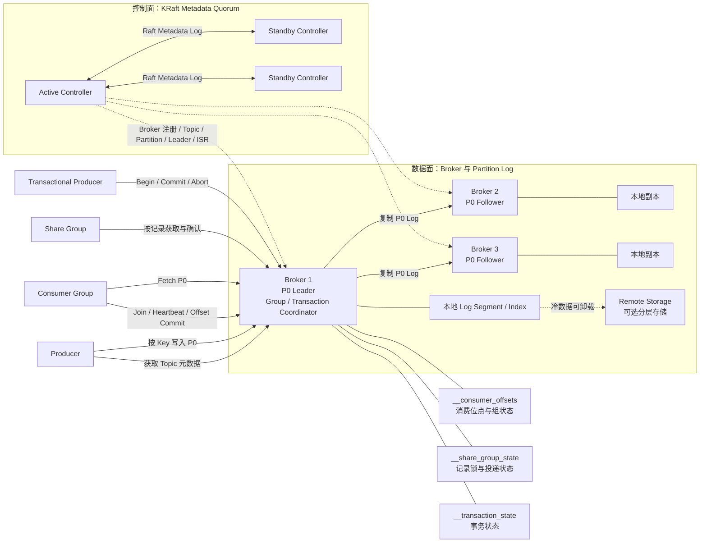

Kafka 的第一性原理不是“把消息交给某个消费者”，而是“把事件按顺序追加到可复制、可保留的分区日志中，让不同消费者记录自己的读取位置”。因此它天然适合事件流、CDC、日志聚合、流处理和历史回放。

<!-- more -->

## 1. Kafka 解决什么问题

假设订单服务不断产生订单事件：

```text
订单已创建 → 已支付 → 已发货 → 已签收 → 已退款
```

库存、风控、推荐、搜索和数据仓库都需要读取这些事件，但它们的处理速度、上线时间和回放需求不同。Kafka 把订单事件保存为一段有位置编号的历史，每个系统使用独立 Consumer Group 记录自己读到的位置：

```text
订单服务 → Kafka Topic
                ├─ 库存 Consumer Group
                ├─ 风控 Consumer Group
                ├─ 搜索 Consumer Group
                └─ 数据仓库 Consumer Group
```

一个系统消费完成，不会删除其他系统要读取的数据。新系统也可以从过去的位置开始读取。这是 Kafka 与传统任务队列最根本的区别。

Kafka 的核心价值包括：

- 用追加日志承受持续的大吞吐写入；
- 用 Partition 同时实现存储分片和消费并行；
- 用 Consumer Group 让一个系统的多个实例协作处理；
- 用独立消费位点让多个系统读取同一份历史；
- 用副本和 Leader 切换保护已提交事件；
- 用保留、压缩和分层存储管理长期历史。

## 2. 完整生产架构



图中先展示完整部署关系。下面以订单事件 **order-42 created** 为例，只说明一次生产和消费分别经过哪些组件。

### 生产消息的过程

1. Producer 从 Broker 获取 **orders** Topic 的 Partition 和 Leader 元数据。
2. Producer 根据 Key **order-42** 选择 Partition P0，并把消息发给 P0 Leader。
3. Leader 追加消息，ISR（同步副本集合）中的 Followers 拉取同一日志。
4. 满足 Producer 的 **acks** 和 Topic 的最小 ISR 条件后，Leader 返回成功。

Producer 收到 ACK，只表示 Kafka 已接管消息，不表示库存业务已经完成。

### 消费消息的过程

1. **inventory-group** 加入 Consumer Group，Group Coordinator 把 P0 分配给其中一个 Consumer。
2. Consumer 从自己的 Offset 开始向 P0 Leader Fetch，读取 order-42。
3. Consumer 完成库存事务。
4. Consumer 把下一次读取位置提交到 **__consumer_offsets**。

业务提交后、Offset 提交前故障会导致重复消费；详细的 ISR、HW 和故障边界在后文解释。

这张图包含四类不同状态：

1. **集群元数据**：Broker、Topic、Partition、副本分配、Leader 和 ISR，由 KRaft Controller Quorum 维护；
2. **消息数据**：每个 Partition 的追加日志，由 Partition Leader 和 Followers 保存；
3. **消费状态**：Consumer Group 的位点与成员关系，保存在内部 Topic；
4. **事务状态**：事务是否提交或中止，由 Transaction Coordinator 和内部 Topic 维护。

Kafka 4.x 的控制面只支持 KRaft。生产环境通常把 Controller 与 Broker 分开部署，三个 Controller 可容忍一个 Controller 故障。KRaft 的 Raft 共识保护元数据，业务消息仍由 Partition Leader + ISR 复制；两者不能混为一谈。

## 3. 核心抽象与它提供的语义

Kafka 的行为主要由“追加日志、分区、位点”三个抽象推导出来。

### 3.1 核心抽象

| 抽象 | 它代表什么 | 基于这个抽象提供的语义 | 它不负责什么 |
|---|---|---|---|
| Cluster | 一组共同提供 Kafka 服务的 Broker 和 Controller | 统一元数据、分区分布和客户端入口 | 单集群副本不等于跨地域灾备 |
| KRaft Controller Quorum | 保存集群元数据的 Raft 法定组 | 决定合法 Controller、Broker、Partition Leader 和任期 | 不直接保存业务消息 |
| Broker | 接收生产、消费和管理请求的服务节点 | 承载 Partition、副本和各类 Coordinator | 增加 Broker 不会自动迁移旧数据 |
| Topic | 一类事件的逻辑名称 | 让生产者与消费者围绕稳定业务主题解耦 | Topic 本身不是顺序和复制单位 |
| Record | Key、Value、Headers 和时间戳组成的一条记录 | Key 可参与分区，Headers 可携带追踪和版本信息 | Kafka 默认不理解 Value 的业务 Schema |
| Partition | Topic 的一段追加日志 | 分区内 Offset 有序，也是并行、存储和复制的基本单位 | 不提供跨分区全局顺序 |
| Offset | Record 在 Partition 中的位置 | Consumer 可以保存位置、恢复和回放 | Offset 不是业务消息 ID，也不代表业务成功 |
| Leader / Follower | 一个 Partition 的主副本和复制副本 | 所有写入先由 Leader 排序，Follower 复制同一历史 | 副本数不会提高单 Partition 写入并行度 |
| ISR | 当前有资格参与安全提交和选主的同步副本集合 | 限制可以确认和接管的数据范围 | ISR 是动态集合，不是固定多数派 Raft 组 |
| Producer | 选择 Topic、Partition 并批量发送 Record 的客户端 | Key 路由、批处理、压缩、重试和幂等生产 | Producer 成功不代表下游业务成功 |
| Consumer Group | 多个 Consumer 协作读取 Topic 的逻辑组 | 每个 Partition 同时归组内一个成员处理，组间相互独立 | 传统 Consumer Group 不提供逐条 Broker Ack |
| Group Coordinator | 管理组成员、分区分配和位点提交的 Broker 角色 | Consumer 故障后触发重新分配，保存恢复位置 | 不执行消费者的业务逻辑 |
| Share Group | 多个 Share Consumer 协作处理记录的组 | 记录级获取、确认、释放和投递次数，更接近任务队列 | 不以严格分区顺序处理为目标 |
| Transaction Coordinator | 管理 Kafka 事务状态的 Broker 角色 | 原子提交多个 Partition 的写入及消费位点 | 不自动覆盖任意外部数据库或 HTTP 调用 |
| Retention | 按时间或容量保留日志 | 消费后数据仍能回放 | 保留期之外的数据无法保证存在 |
| Log Compaction | 每个 Key 最终保留较新的值 | 可以从日志重建 Key 的最新状态 | 不是立即去重，也不保留每次历史变化 |

### 3.2 从抽象推导出的关键语义

#### 同一 Consumer Group 是竞争关系，不同 Group 是广播关系

同一 Consumer Group 中，一个 Partition 同一时刻只交给一个成员：

```text
Topic P0 ──> Group A / Consumer 1
Topic P1 ──> Group A / Consumer 2
```

这是组内的任务分摊。Consumer 数量超过 Partition 数量时，多出的 Consumer 没有分区可处理。

库存、风控和推荐都要读取同一事件时，应使用不同 Group：

```text
同一个 Topic
  ├─ Inventory Group
  ├─ Risk Group
  └─ Recommend Group
```

每个 Group 保存自己的 Offset。库存处理到哪里，不会影响风控和推荐。这就是 Kafka 的广播语义，它不是把消息复制到三条 Queue，而是让三组消费者独立读取同一日志。

#### Partition 同时决定顺序、并行度和扩展上限

Partition Leader 决定 Record 在日志中的先后，Offset 表示这个顺序。一个 Group 对单个 Partition 的最大读取并行度通常是一个 Consumer，因此 Partition 数量也是消费并行度的上限。

增加 Partition 可以扩展吞吐，却会改变 Key 的映射并放大文件、选主、迁移和恢复成本。Kafka 没有把“顺序”和“扩容”做成两个独立开关，它们都落在 Partition 这个抽象上。

#### Offset 是恢复点，不是业务完成证明

Consumer 提交 Offset，只表示“下次从哪里继续读”。如果业务数据库尚未更新就提交 Offset，崩溃后可能跳过消息；如果业务完成后还没提交，崩溃后会重复处理。

因此 Kafka 的传统消费语义通常是“至少一次 + 业务幂等”，而不是由 Offset 自动提供端到端精确一次。

#### 日志保留使消费与删除解耦

Consumer 提交 Offset 不会删除 Record。数据何时删除由 Topic 的 Retention 或 Compaction 决定，所以慢消费者、离线消费者和后来接入的新系统都可以读取仍在保留期内的数据。

这也是 Kafka 能回放历史的原因，同时意味着磁盘容量必须按保留期和总写入量规划。

#### 数据面和控制面有两套一致性

KRaft Quorum 决定 Topic、Partition 和 Leader 等元数据的唯一历史；Partition Leader + ISR 决定某个业务日志的唯一历史。Controller 多数派正常，不代表每个业务 Partition 都有足够 ISR；某个 Partition 可写，也不代表控制面可以继续完成选主和扩容。

## 4. Kafka 的典型业务场景

### 4.1 事件流

订单、支付、发货等已经发生的事实持续写入 Topic。多个系统按自己的速度读取，并保留各自的消费位置。重点是共享历史，而不是把一条任务交给某个 Worker 后立即删除。

### 4.2 CDC

CDC 工具读取数据库事务日志，把插入、更新和删除转换成 Kafka Record。例如订单表状态变化后，搜索、数据仓库和缓存更新程序分别消费。

Kafka 适合 CDC，是因为数据库变化是持续事件流，需要高吞吐、顺序、保留和多个下游独立读取。Kafka 只负责传递变化，业务字段语义和 Schema 演进仍由团队管理。

### 4.3 日志聚合

大量应用实例把访问日志、错误日志和审计日志写入 Kafka，下游搜索与分析系统批量读取。Kafka 用批处理和顺序磁盘写吸收突发流量，让应用不必等待日志索引平台。

### 4.4 流处理

Kafka Streams、Flink 等系统持续读取事件，计算最近五分钟错误率、实时销量或异常交易，再把结果写回 Kafka 或外部存储。Kafka 提供输入日志和输出日志，但具体计算由流处理程序完成。

### 4.5 历史回放

新系统上线、索引重建或消费程序修复后，可以把 Offset 移回过去重新处理。能回放多远取决于 Retention，而不是消费者是否曾经读过。

## 7. Consumer Group、Offset 与 Rebalance

### 7.1 消费位点的两个故障窗口

```text
先处理业务，后提交 Offset
```

Consumer 在业务成功后、提交 Offset 前崩溃，消息会再次消费。这不会丢业务，但会重复执行。

```text
先提交 Offset，后处理业务
```

Consumer 在提交后、业务完成前崩溃，新的 Consumer 从更后位置继续，业务效果可能永久丢失。

关键消费者通常选择第一种方式，并通过数据库唯一键、Inbox 或状态机实现幂等。

### 7.2 Rebalance 为什么会产生重复和停顿

Consumer 加入、退出或被判定失效时，Group Coordinator 要重新决定 Partition 归属，这就是 Rebalance。旧 Consumer 可能仍有在途任务，新 Consumer 已开始读取同一 Partition，因此必须在撤销分区时停止取新消息、处理或放弃在途任务并安全提交 Offset。

Kafka 4.x 提供新的 Consumer Rebalance Protocol，使用增量式分配减少全组停顿；但客户端需要选择新协议。协议优化能缩短协调时间，不能替应用解决未完成业务和 Offset 的原子性。

### 7.3 长耗时任务的边界

Consumer 必须持续 Poll 和心跳，证明自己仍然存活。若一条任务处理时间很长，Group 可能认为 Consumer 已失效并转移 Partition，造成重复处理。

解决方向是限制单次拉取量、把 Poll 与工作线程解耦并谨慎管理 Offset，或把长任务交给更适合逐条确认和锁续期的消费模型。Kafka 传统 Consumer Group 更自然地处理连续事件流，而不是数小时的单条任务。

## 8. Share Group：Kafka 的任务队列消费模型

Kafka 4.2 起 Share Groups 可用于生产。它不再把整个 Partition 长期独占地分给一个 Consumer，而是对 Record 建立有时限的获取状态，让多个 Share Consumer 协作处理同一 Partition 中的不同记录。

Share Consumer 可以对记录表达：

- **Accept**：处理成功；
- **Release**：本次未完成，允许重新投递；
- **Reject**：不可处理，不再按普通方式投递；
- **Renew**：任务仍在执行，延长持有时间。

它还可以记录投递次数，因此比传统 Consumer Group 更接近工作队列。

两种消费模型的选择：

| 模型 | 工作分配单位 | 状态 | 更适合 |
|---|---|---|---|
| Consumer Group | Partition | Group Offset | 有序事件流、批量连续处理、流计算 |
| Share Group | Record | 获取锁、记录级确认和投递次数 | 独立任务、更多 Worker 并发、失败重投 |

Share Group 提高任务并行度的同时，不以传统分区顺序为主要目标。需要严格按 Key 有序时，仍应优先使用 Consumer Group 和稳定分区策略。

## 9. 事务和 Exactly Once 的边界

Kafka 事务可以把多个 Partition 的写入作为一个原子结果提交或中止。流处理场景还可以把“读取输入、写出结果、提交输入 Offset”放进同一个 Kafka 事务：

```text
读取 input Topic
  → 计算
  → 写 output Topic
  → 提交 input Offset
以上在同一个 Kafka 事务中提交
```

下游使用 `read_committed` 时，只读取已经提交的事务记录。这可以实现 Kafka 到 Kafka 范围内的 Exactly Once 处理。

边界必须说清楚：

- 事务不自动包含 MySQL、Redis 或第三方 HTTP API；
- 发送短信、扣款等外部副作用仍可能重复；
- 数据库更新与发布 Kafka 事件通常需要 Transactional Outbox；
- 事务会增加协调、状态和延迟成本，不应为普通消息无条件开启。

“Kafka 支持 Exactly Once”必须附带作用域，否则容易形成错误架构承诺。

## 10. 顺序到底能保证到哪里

Kafka 保证单个 Partition 内的日志顺序。业务上的同一订单有序，需要同时满足：

1. 所有订单事件使用稳定的 `order_id` 作为 Key；
2. 相同 Key 始终映射到同一 Partition；
3. Producer 自身按正确顺序发送并启用幂等；
4. Consumer 不把同一 Partition 的任务无约束并发执行；
5. 重试时不让失败事件被后续事件随意越过。

增加 Partition 后，默认 Key 映射可能改变，新旧事件进入不同 Partition。严格顺序 Topic 应提前规划 Partition 数量，或使用能够保持映射稳定的业务路由方案。

全局顺序只能把 Topic 限制为单 Partition，但吞吐、消费并行和故障恢复都会受单 Leader 限制。多数业务真正需要的是单订单、账户或设备有序，而不是全局有序。

## 13. 失败重试和死信

传统 Consumer Group 没有任务队列式的逐条 `nack/requeue`。如果某条业务消息处理失败，常见做法是：

1. 暂停当前 Partition 并重试，保持顺序但阻塞后续消息；
2. 把失败消息写入延迟重试 Topic，主流程继续，代价是顺序改变；
3. 达到最大次数后写入 Dead Letter Topic，由人工或补偿程序处理。

Kafka 不会自动理解哪些异常可重试。应用必须保存原事件 ID、原 Topic/Partition/Offset、失败原因和重试次数，并防止重试 Topic 形成无限循环。

Share Group 提供记录级确认和投递次数，减少了构建任务重投状态的工作，但业务仍要定义退避、不可恢复错误和死信去向。

严格顺序与跳过毒消息仍然冲突：等待它恢复会阻塞相同 Partition，绕过它则放弃处理完成顺序。

## 14. 数据契约

Kafka Broker 把 Record Value 当成字节数组，不会自动判断字段是否兼容。长期保留和回放意味着旧消息可能被数月后的新代码读取，因此 Schema 治理比短生命周期队列更重要。

消息 Envelope 至少应包含：

- 事件类型和 Schema 版本；
- 稳定事件 ID；
- 业务 Key；
- 事件发生时间与生产时间；
- Producer 和 Trace ID；
- 数据格式。

Avro、Protobuf 或 JSON 只是编码方式。还需要 Schema Registry 或等价治理流程，规定字段新增、删除、重命名和类型变化的兼容规则。

无法反序列化的消息应进入隔离流程，而不是让 Consumer 持续崩溃和 Rebalance。事件应该表达业务事实，不应直接暴露生产者数据库内部表结构。

## 18. 选型结论

### 18.1 适合 Kafka

- 业务产生持续事件流，多个系统需要独立读取；
- 需要按时间保留，并在修复、新系统上线或重建索引时回放；
- 需要承载 CDC、日志聚合和流处理；
- 吞吐较大，可以按稳定业务 Key 分区；
- 积压可能持续较长时间，但能给出明确容量和保留期；
- 团队能管理 Partition、Consumer Group、Schema 和磁盘容量。

典型场景包括订单事件总线、数据库变更分发、埋点与日志管道、实时指标计算和数据平台入口。

### 18.2 需要谨慎

- 核心需求是复杂路由、每条消息独立 TTL 或大量临时 Queue；
- 单条任务执行数小时，需要频繁续期和逐条重投；
- 要求全局严格顺序，同时要求很高吞吐；
- 消息量很小，却不愿承担分区、磁盘和控制面的运维成本；
- 业务不能实现幂等，却要求跨数据库和外部 API 端到端绝不重复；
- 无法估算保留期、积压量和磁盘增长。

Kafka 4.2+ 的 Share Groups 已能覆盖更多工作队列场景，但复杂路由、临时资源和逐消息生命周期控制仍不是 Kafka 的核心抽象。

### 18.3 上线前必须回答

1. Topic 表示什么业务事实，Record 的 Key 是什么？
2. 顺序范围是单实体、单 Partition 还是全局？
3. 使用 Consumer Group 还是 Share Group，为什么？
4. 哪些消息不能丢，Producer 的成功边界是什么？
5. Consumer 在什么业务完成点提交 Offset 或确认记录，如何幂等？
6. Retention 多久，最大积压和副本后的总存储是多少？
7. 扩 Partition 后如何保持 Key 路由和顺序？
8. 失败消息是阻塞、进入重试 Topic，还是进入 Dead Letter Topic？
9. Schema 如何兼容，旧消息由新 Consumer 读取时怎么办？
10. 单 Broker、单可用区和地域故障分别允许多少 RPO/RTO？
11. 如何监控最老事件、Lag、ISR/ELR、HW、无 Leader Partition 和磁盘增长？
12. 扩容、迁盘、滚动升级和跨地域切换是否做过演练？

## 19. 参考资料

- [Apache Kafka 4.3 Documentation](https://kafka.apache.org/43/)
- [Kafka Design](https://kafka.apache.org/43/design/design/)
- [Kafka KRaft](https://kafka.apache.org/43/operations/kraft/)
- [Kafka APIs](https://kafka.apache.org/43/apis/)
- [Kafka Producer Configs](https://kafka.apache.org/43/configuration/producer-configs/)
- [Kafka Consumer and Share Consumer Configs](https://kafka.apache.org/43/configuration/consumer-configs/)
- [Kafka Topic Configs](https://kafka.apache.org/43/configuration/topic-configs/)
- [Kafka Eligible Leader Replicas](https://kafka.apache.org/43/operations/eligible-leader-replicas/)
- [KIP-101：Use Leader Epoch for Replica Log Truncation](https://cwiki.apache.org/confluence/pages/viewpage.action?pageId=177052956)
- [Kafka Consumer Rebalance Protocol](https://kafka.apache.org/43/operations/consumer-rebalance-protocol/)
- [Kafka Transaction Protocol](https://kafka.apache.org/43/operations/transaction-protocol/)
- [Kafka Tiered Storage](https://kafka.apache.org/43/operations/tiered-storage/)
- [Kafka Monitoring](https://kafka.apache.org/43/operations/monitoring/)
- [Kafka Security Overview](https://kafka.apache.org/43/security/security-overview/)
- [Kafka Basic Operations](https://kafka.apache.org/43/operations/basic-kafka-operations/)
- [Kafka Upgrade Guide](https://kafka.apache.org/43/getting-started/upgrade/)
