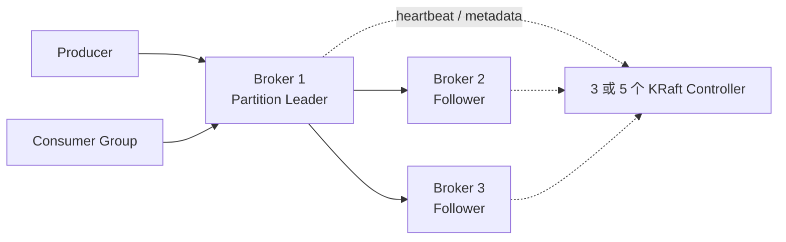

Kafka 的基本单位不是队列，而是分区日志。Topic 负责逻辑分类，Partition 同时承担并行度、顺序边界、存储分片和复制单元四个角色。

<!-- more -->

## 1. 生产架构



生产集群通常包含：

- 3 或 5 个 KRaft Controller，使用 Raft 保存集群元数据并选出 Active Controller；规模较大时与 Broker 分离部署；
- 多个 Broker，跨机架或可用区分布；
- 每个 Topic 多个 Partition，关键 Topic 常用复制因子 3；
- Producer 直接写 Partition Leader，Consumer Group 把分区分配给组内消费者。

Kafka 4.x 已经以 KRaft 作为控制面，不应再把 ZooKeeper 架构作为新集群基线。

## 2. 如何分区并保证顺序

Producer 决定消息进入哪个分区：显式指定分区、对 Key 做哈希，或在无 Key 时由默认分区器分配。若订单事件以 `order_id` 为 Key，同一订单通常进入同一分区。

Kafka 只保证单分区日志顺序，不保证跨分区全局顺序。要得到业务顺序，还必须满足：

1. 同一业务实体始终使用同一个稳定 Key；
2. Producer 对同一 Key 的发送顺序正确，并启用幂等 Producer；
3. 一个 Consumer Group 内，一个分区同一时刻只交给一个消费者；
4. 消费者不要把同一分区的消息无约束地并发处理；
5. 失败重试要么阻塞该 Key，要么使用序列号在业务层重排。

增加 Partition 数会改变 `hash(key) % partition_count` 的结果。扩分区之后，同一个 Key 的新消息可能进入新分区，因此严格顺序 Topic 不能随意扩分区。全局严格顺序只能使用一个 Partition，代价是吞吐和并行度受单 Leader 限制。

Consumer Rebalance 只会改变“谁消费分区”，不会改变分区内 Offset 顺序；但旧消费者未完成的任务和新消费者开始的任务可能重叠，所以应先停止拉取、完成或放弃在途任务，再提交 Offset。

## 3. 多副本如何保持一致

每个 Partition 有一个 Leader 和若干 Follower。Follower 按 Leader 日志顺序拉取数据；足够接近 Leader 的副本属于 ISR。

推荐的耐久性组合是：

```properties
replication.factor=3
min.insync.replicas=2
acks=all
enable.idempotence=true
unclean.leader.election.enable=false
```

`acks=all` 表示等待当前 ISR 满足提交条件，`min.insync.replicas=2` 防止只剩一个副本时仍确认写入。Leader 故障后，Controller 从 ISR 中选择新 Leader。默认禁止从落后副本进行 unclean election，可以用暂时不可用换取不丢失已提交记录。

Kafka 数据复制不是每个 Partition 一个多数派 Raft 组。数据面使用 Leader + 动态 ISR；KRaft 的 Raft 共识主要用于控制面元数据。两者不要混淆。

## 4. 故障修复与扩缩容

### 4.1 临界故障时间线

假设 Partition 有 A、B、C 三个副本，A 是 Leader，当前 ISR 为 `{A,B,C}`：

1. Producer 把消息 M 发给 A；A 追加本地 Log。
2. `acks=0` 时客户端根本不等待；`acks=1` 时 A 本地追加后即可响应。这两种配置都可能在 B、C 未复制 M 时向客户端表示发送完成。
3. `acks=all` 时，A 要等待当前 ISR 中所有副本确认 M；同时 ISR 数量必须不低于 `min.insync.replicas`。M 之后才对消费者可见并向 Producer 返回成功。
4. 如果 A 在第 1 步后、第 3 步前故障，Producer 收不到成功响应。Controller 从 ISR 的合格副本中选新 Leader；未成为已提交记录的 M 不应对消费者可见。
5. A 恢复后不能带着自己的孤立尾部继续当 Leader。它根据新 Leader 的 Epoch/Offset 截断冲突记录，再复制新 Leader 的日志，追上后才能重新加入 ISR。

客户端超时必须视为“结果未知”，因为也可能是 M 已提交、只是 ACK 在返回途中丢失。Producer 应重试；启用幂等 Producer 后，相同 Producer ID、Epoch 和 Sequence 的重试会在 Broker 端去重。跨重启或跨业务事务仍应使用业务消息 ID 和幂等消费者。

因此，Kafka 的生产建议不是笼统的“半同步”，而是明确配置：`acks=all + min.insync.replicas=2 + replication.factor=3 + unclean leader election=false`。这里 `min.insync.replicas=2` 是允许写入的最低门槛，不表示 ISR 有 3 个时只等 2 个；`acks=all` 会等待当时的全部 ISR。

### 4.2 Follower 短暂故障

Follower 恢复后读取 Leader 的日志，截断与 Leader 冲突的尾部并继续拉取；追到规定范围后重新加入 ISR。它未追上前不能成为干净 Leader。

### 4.3 Broker 永久损坏

在其他 Broker 上为受影响分区安排新副本。新副本先作为 Follower 复制完整日志，追上后进入 ISR，再移除旧副本。修复期间要监控 Under Replicated Partitions、ISR Shrink、磁盘和复制延迟。

### 4.4 扩容和迁盘

新增 Broker 不会自动获得已有数据。管理员需要执行 Partition Reassignment：

1. 生成并审查目标副本分布；
2. 添加目标 Follower 并复制数据；
3. 追上后加入 ISR；
4. 删除源副本；
5. 必要时执行 Preferred Leader Election；
6. 对迁移流量限速，避免挤占线上读写。

机架感知应保证同一 Partition 的副本跨故障域。Kafka 解决的是副本容错，不替代跨集群备份；机房级灾难通常使用 MirrorMaker 2、Cluster Linking 或其他复制方案，并单独定义 RPO/RTO。

## 5. 适用边界

Kafka 适合事件流、CDC、日志聚合、流处理和需要回放的业务事件。若需求核心是复杂 AMQP 路由、每条消息独立 TTL/优先级或大量短生命周期队列，RabbitMQ 往往更直接。

## 6. 参考资料

- [Kafka 4.2 Design：Replication](https://kafka.apache.org/42/design/design/#replication)
- [Kafka 4.2 Topic Configs：min.insync.replicas](https://kafka.apache.org/42/configuration/topic-configs/#min.insync.replicas)
- [Kafka 4.0 Protocol：Partitioning Strategies](https://kafka.apache.org/40/design/protocol/#protocol_partitioning)
- [Kafka Operations：Partition Reassignment](https://kafka.apache.org/40/operations/basic-kafka-operations/#basic_ops_cluster_expansion)
