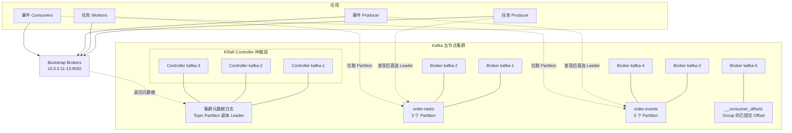
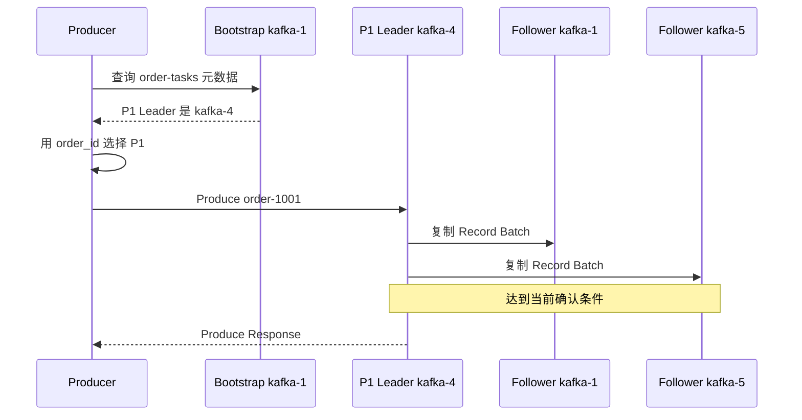
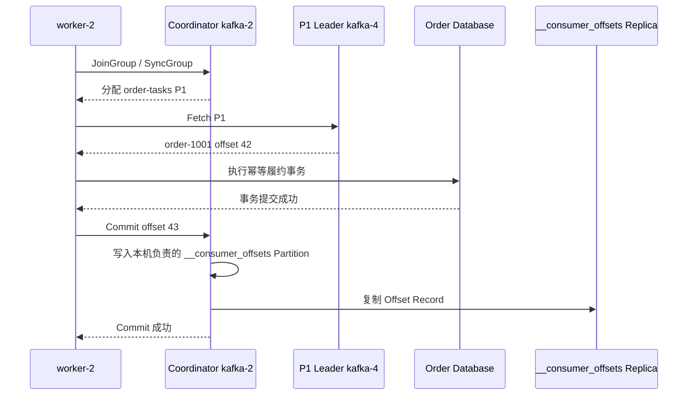

Kafka 的第一性原理是：把事件追加到可复制、可保留的分区日志，Consumer 保存自己的读取位置。消息不会因为某个 Consumer 读过就立即删除，因此多个业务可以独立消费，也可以从历史位置重新处理。

本文回答三个问题：
1. 五台服务器如何部署 Kafka；
2. Producer 和 Consumer 最终连接谁；
3. Topic、Partition、Consumer Group 和 Offset 在流程中分别解决什么问题。

ISR、HW、完整提交过程和 Leader 故障恢复放在[实现篇](003_kafka_implementation.md)。

<!-- more -->

## 1. 五节点生产部署

| 节点 | IP | 部署角色 |
|---|---|---|
| `kafka-1` | `10.0.0.11` | Broker 1 + KRaft Controller |
| `kafka-2` | `10.0.0.12` | Broker 2 + KRaft Controller |
| `kafka-3` | `10.0.0.13` | Broker 3 + KRaft Controller |
| `kafka-4` | `10.0.0.14` | Broker 4 |
| `kafka-5` | `10.0.0.15` | Broker 5 |

三个 Controller 组成 KRaft 仲裁组。这里把 Controller 与 Broker 合并部署以便用五台机器说明完整架构；规模更大或隔离要求更高时，可以使用独立 Controller 节点。

客户端配置多个 Bootstrap 地址：

```text
10.0.0.11:9092,10.0.0.12:9092,10.0.0.13:9092
```

Bootstrap Broker 只是发现入口。客户端获取元数据后直接连接目标 Partition Leader，不由 Bootstrap Broker 代理全部流量。

### 1.1 完整生产架构



- **Controller** 管理集群元数据、Partition Leader 和副本分配，不转发每条业务消息。
- **Broker** 保存 Partition 副本，并处理 Produce、Fetch、Group 和 Offset 请求。
- **客户端**先连接 Bootstrap Broker 做发现，之后按请求类型连接对应 Broker。

一个 Topic 可以有多个 Partition，每个 Partition 又可以有多个副本。五个 Broker 不表示每条消息固定写五份。

### 1.2 Kafka 保存的三类数据

- **集群元数据**
  - 解决的问题：有哪些 Broker、Topic 和 Partition，每个副本在哪，谁是 Leader。
  - 保存内容：Broker 注册、Topic 配置、Partition 副本分配、Leader 和 ACL 等。
  - 保存组件：KRaft Metadata Log，由 Controller 仲裁组管理。
  - 一致性机制：Controller 使用 Raft 管理唯一的已提交元数据历史。

- **业务消息日志**
  - 解决的问题：一个 Partition 中按什么顺序保存了哪些 Record。
  - 保存内容：Record Batch、Offset、时间戳和索引。
  - 保存组件：Partition Leader 和 Follower Broker 的本地日志。
  - 一致性机制：Leader/Follower 复制；ISR、`acks` 和 `min.insync.replicas` 共同约束确认。

- **消费组与进度**
  - 解决的问题：Group 中谁负责哪些 Partition，以及恢复时从哪里继续。
  - 保存内容：Group 成员与分配的运行状态、每个 `Group + Topic + Partition` 的已提交 Offset。
  - 保存组件：Group Coordinator 负责协调；已提交 Offset 保存在内部 Topic `__consumer_offsets`。
  - 一致性机制：`__consumer_offsets` 本身也是有副本的 Kafka Topic。

Connection、Fetch Session 和尚未提交的应用处理位置属于运行时数据，不写入 KRaft 元数据日志。

## 2. 示例一：订单履约任务

需求是订单创建后交给任意一个 Worker 履约，Worker 崩溃后其他 Worker 能继续处理。

```text
Topic:          order-tasks
Partitions:     3
Replication:    3
Consumer Group: fulfill-workers
Record Key:     order_id
```

本例假设：

| Partition | Leader | Followers |
|---|---|---|
| P0 | `kafka-2` | `kafka-3/4` |
| P1 | `kafka-4` | `kafka-1/5` |
| P2 | `kafka-5` | `kafka-2/3` |

### 2.1 初始化后各组件保存什么

Controller 元数据记录 Topic 配置、三个 Partition、副本分配和当前 Leader。各 Broker 创建自己负责的 Partition 日志。

此时还没有持久的 `fulfill-workers` 消费进度。Consumer 加入后，Coordinator 才建立 Group 运行状态；Consumer 提交 Offset 后，`__consumer_offsets` 才出现对应记录。

- Topic `order-tasks` 表示一类订单任务。
- Partition P1 是一条有序日志，也是生产、存储和消费并行度单位。
- Offset 42 表示 P1 中的位置，不是整个 Topic 的全局编号。

### 2.2 Producer 生产消息的完整过程

假设 Producer 首次连接 `kafka-1`，`order-1001` 被分到 P1，P1 Leader 是 `kafka-4`。



1. Producer 连接任一 Bootstrap Broker，获取 Topic、Partition 和 Leader 元数据。
2. 分区器根据 `order_id` 选择 P1。相同 Key 稳定进入同一 Partition，才能获得同一订单的日志顺序。
3. Producer 直接连接 `kafka-4`，把 Record Batch 交给 P1 Leader。
4. Leader 分配 Partition 内 Offset，Follower 拉取新日志。
5. 达到 `acks` 和 ISR 配置要求后，Leader 返回结果。

Producer 收到成功只表示 Kafka 按当前配置接管消息，不表示 Worker 已完成履约。超时表示结果未知，重试需要依赖幂等 Producer 和业务去重。

### 2.3 Consumer 有哪些状态

- **Group 身份**：`group.id=fulfill-workers`，表示三个 Worker 共同维护一份读取进度。
- **成员与分配**：Worker、成员 ID、订阅 Topic，以及 P0/P1/P2 当前分别归谁，由 Coordinator 管理。
- **当前处理位置**：Consumer 已拉取、正在处理到哪里，保存在客户端内存中。
- **已提交 Offset**：业务完成后持久保存的恢复位置，保存在 `__consumer_offsets`。

“已经拉取到 Offset 50”和“已经提交 Offset 50”不是一回事。前者可能只存在于 Worker 内存，后者才是重启后的恢复依据。

### 2.4 Consumer 消费消息的完整过程

```text
worker-1 → P0
worker-2 → P1
worker-3 → P2
Group Coordinator → kafka-2
P1 Leader → kafka-4
```



1. Worker 可连接任一 Broker 找到 `fulfill-workers` 的 Coordinator。
2. 三个 Worker 加入 Group，同一 Group 内一个 Partition 同时只分给一个成员。
3. `worker-2` 直接连接 P1 Leader `kafka-4`，从已提交位置 Fetch。
4. Kafka 返回 Offset 42，但不知道 Worker 的数据库事务是否成功。
5. Worker 完成幂等事务后提交 Offset 43，表示下次从 43 开始。
6. 若数据库已提交但 Offset 尚未提交时 Worker 崩溃，任务会被再次读取。

Kafka 按 Partition 分配工作，不是把每条消息独立派发给任意空闲 Worker。长任务、单条优先级、独立 TTL 和复杂重试需要额外设计。

## 3. 示例二：订单事件流

创建三分区 Topic `order-events`。Producer 以 `order_id` 为 Key，依次写入：

```text
OrderCreated → OrderPaid → OrderShipped
```

仓储、风控和分析使用不同 Group：

```text
warehouse → 一份独立进度
risk      → 一份独立进度
analytics → 一份独立进度
```

生产和消费连接路径与任务示例相同。区别在于三个 Group 都能读取完整事件，各自提交 Offset；某个 Group 的进度不会推进其他 Group，也不会删除消息。消息由 Topic 的保留时间、容量或压缩策略清理。

相同订单稳定进入同一 Partition 时，Kafka 保证这些 Record 在该 Partition 的追加顺序，不保证不同 Partition 的全局顺序。

常见场景：

- **CDC**：捕获数据库增删改并写成事件，供搜索、缓存或数仓同步。
- **日志聚合**：集中收集多台服务器日志，再交给检索、告警和离线分析。
- **流处理**：事件到达时持续计算，例如窗口成交额或异常支付检测。
- **回放**：从旧 Offset 重读历史，例如修复程序后重算报表或重建索引。

## 4. 从两个示例归纳语义边界

- Topic 是事件分类和治理边界，Partition 才是顺序、存储、副本和并行度单位。
- Record Key 用于选择 Partition；相同 Key 只有稳定进入同一 Partition才能讨论顺序。
- Consumer Group 表示一套独立进度：组内分摊 Partition，组间各读一份。
- Offset 是 Partition 内位置。提交 Offset 是保存恢复书签，不是物理删除消息。
- Producer 成功、Consumer 拉取、业务事务成功和 Offset 提交是四个不同时间点。
- Kafka 默认应按至少一次设计；Kafka 内部幂等和事务不能自动覆盖外部数据库或 HTTP 调用。

Kafka 适合事件流、CDC、日志聚合、流处理和需要回放的业务事件。若核心是复杂 AMQP 路由、单条消息 TTL/优先级或大量短生命周期 Queue，传统任务型消息队列通常更直接。

## 5. 客户端连接路径总结

```text
生产：
Producer → Bootstrap Broker 查询元数据
         → 目标 Partition Leader 写入

消费：
Consumer → Group Coordinator 加入和分配
         → Partition Leader 拉取数据
         → Coordinator 提交 Offset
```

Controller 不在每条消息的数据路径中，Bootstrap Broker 也不是固定代理。

## 6. 下一篇解决的实现问题

以下内容见[Kafka 实现篇](003_kafka_implementation.md)：

- Partition 日志和索引如何组织；
- Follower 如何推进 LEO，Leader 如何计算 HW；
- ISR、`acks` 和 `min.insync.replicas` 如何决定提交；
- Leader 切换时如何区分已提交与未提交消息；
- 旧 Leader 恢复后如何截断分叉日志。

## 7. 参考资料

- [Kafka Design](https://kafka.apache.org/documentation/#design)
- [Kafka Producer Configs](https://kafka.apache.org/documentation/#producerconfigs)
- [Kafka Consumer Configs](https://kafka.apache.org/documentation/#consumerconfigs)
- [Kafka KRaft](https://kafka.apache.org/documentation/#kraft)
