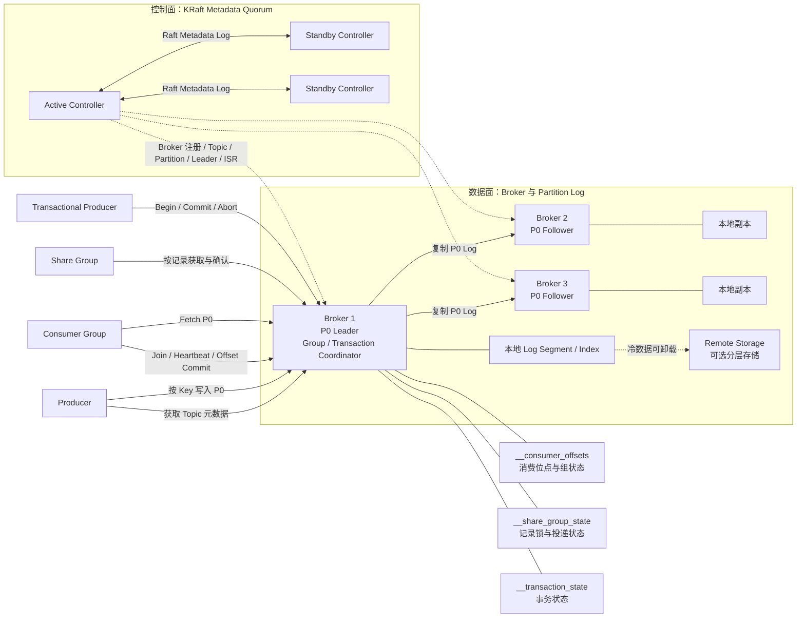
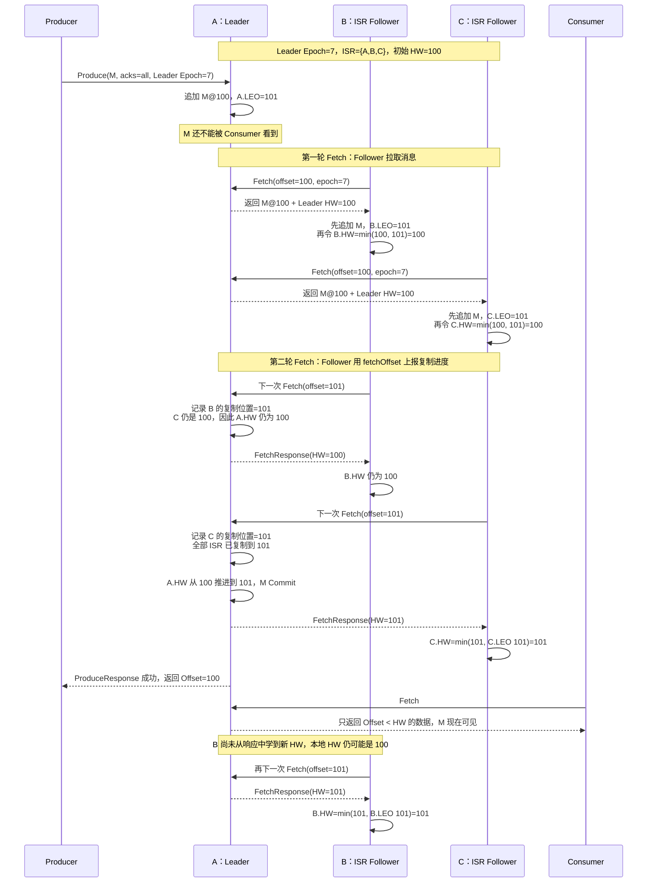
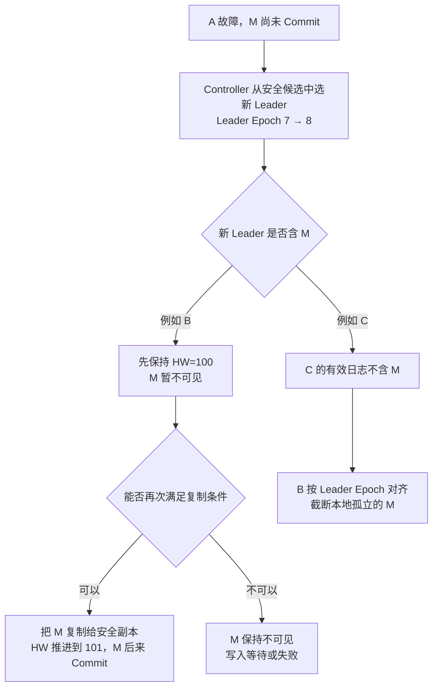

Kafka 的第一性原理不是“把消息交给某个消费者”，而是“把事件按顺序追加到可复制、可保留的分区日志中，让不同消费者记录自己的读取位置”。因此它天然适合事件流、CDC、日志聚合、流处理和历史回放。

<!-- more -->

## 1. Kafka 解决什么问题

假设订单服务不断产生订单事件：

```text
订单已创建 → 已支付 → 已发货 → 已签收 → 已退款
```

库存、风控、推荐、搜索和数据仓库都需要读取这些事件，但它们的处理速度、上线时间和回放需求不同。Kafka 把订单事件保存为一段有位置编号的历史，每个系统使用独立 Consumer Group 记录自己读到的位置：

```text
订单服务 → Kafka Topic
                ├─ 库存 Consumer Group
                ├─ 风控 Consumer Group
                ├─ 搜索 Consumer Group
                └─ 数据仓库 Consumer Group
```

一个系统消费完成，不会删除其他系统要读取的数据。新系统也可以从过去的位置开始读取。这是 Kafka 与传统任务队列最根本的区别。

Kafka 的核心价值包括：

- 用追加日志承受持续的大吞吐写入；
- 用 Partition 同时实现存储分片和消费并行；
- 用 Consumer Group 让一个系统的多个实例协作处理；
- 用独立消费位点让多个系统读取同一份历史；
- 用副本和 Leader 切换保护已提交事件；
- 用保留、压缩和分层存储管理长期历史。

## 2. 完整生产架构



这张图包含四类不同状态：

1. **集群元数据**：Broker、Topic、Partition、副本分配、Leader 和 ISR，由 KRaft Controller Quorum 维护；
2. **消息数据**：每个 Partition 的追加日志，由 Partition Leader 和 Followers 保存；
3. **消费状态**：Consumer Group 的位点与成员关系，保存在内部 Topic；
4. **事务状态**：事务是否提交或中止，由 Transaction Coordinator 和内部 Topic 维护。

Kafka 4.x 的控制面只支持 KRaft。生产环境通常把 Controller 与 Broker 分开部署，三个 Controller 可容忍一个 Controller 故障。KRaft 的 Raft 共识保护元数据，业务消息仍由 Partition Leader + ISR 复制；两者不能混为一谈。

## 3. 核心抽象与它提供的语义

Kafka 的行为主要由“追加日志、分区、位点”三个抽象推导出来。

### 3.1 核心抽象

| 抽象 | 它代表什么 | 基于这个抽象提供的语义 | 它不负责什么 |
|---|---|---|---|
| Cluster | 一组共同提供 Kafka 服务的 Broker 和 Controller | 统一元数据、分区分布和客户端入口 | 单集群副本不等于跨地域灾备 |
| KRaft Controller Quorum | 保存集群元数据的 Raft 法定组 | 决定合法 Controller、Broker、Partition Leader 和任期 | 不直接保存业务消息 |
| Broker | 接收生产、消费和管理请求的服务节点 | 承载 Partition、副本和各类 Coordinator | 增加 Broker 不会自动迁移旧数据 |
| Topic | 一类事件的逻辑名称 | 让生产者与消费者围绕稳定业务主题解耦 | Topic 本身不是顺序和复制单位 |
| Record | Key、Value、Headers 和时间戳组成的一条记录 | Key 可参与分区，Headers 可携带追踪和版本信息 | Kafka 默认不理解 Value 的业务 Schema |
| Partition | Topic 的一段追加日志 | 分区内 Offset 有序，也是并行、存储和复制的基本单位 | 不提供跨分区全局顺序 |
| Offset | Record 在 Partition 中的位置 | Consumer 可以保存位置、恢复和回放 | Offset 不是业务消息 ID，也不代表业务成功 |
| Leader / Follower | 一个 Partition 的主副本和复制副本 | 所有写入先由 Leader 排序，Follower 复制同一历史 | 副本数不会提高单 Partition 写入并行度 |
| ISR | 当前有资格参与安全提交和选主的同步副本集合 | 限制可以确认和接管的数据范围 | ISR 是动态集合，不是固定多数派 Raft 组 |
| Producer | 选择 Topic、Partition 并批量发送 Record 的客户端 | Key 路由、批处理、压缩、重试和幂等生产 | Producer 成功不代表下游业务成功 |
| Consumer Group | 多个 Consumer 协作读取 Topic 的逻辑组 | 每个 Partition 同时归组内一个成员处理，组间相互独立 | 传统 Consumer Group 不提供逐条 Broker Ack |
| Group Coordinator | 管理组成员、分区分配和位点提交的 Broker 角色 | Consumer 故障后触发重新分配，保存恢复位置 | 不执行消费者的业务逻辑 |
| Share Group | 多个 Share Consumer 协作处理记录的组 | 记录级获取、确认、释放和投递次数，更接近任务队列 | 不以严格分区顺序处理为目标 |
| Transaction Coordinator | 管理 Kafka 事务状态的 Broker 角色 | 原子提交多个 Partition 的写入及消费位点 | 不自动覆盖任意外部数据库或 HTTP 调用 |
| Retention | 按时间或容量保留日志 | 消费后数据仍能回放 | 保留期之外的数据无法保证存在 |
| Log Compaction | 每个 Key 最终保留较新的值 | 可以从日志重建 Key 的最新状态 | 不是立即去重，也不保留每次历史变化 |

### 3.2 从抽象推导出的关键语义

#### 同一 Consumer Group 是竞争关系，不同 Group 是广播关系

同一 Consumer Group 中，一个 Partition 同一时刻只交给一个成员：

```text
Topic P0 ──> Group A / Consumer 1
Topic P1 ──> Group A / Consumer 2
```

这是组内的任务分摊。Consumer 数量超过 Partition 数量时，多出的 Consumer 没有分区可处理。

库存、风控和推荐都要读取同一事件时，应使用不同 Group：

```text
同一个 Topic
  ├─ Inventory Group
  ├─ Risk Group
  └─ Recommend Group
```

每个 Group 保存自己的 Offset。库存处理到哪里，不会影响风控和推荐。这就是 Kafka 的广播语义，它不是把消息复制到三条 Queue，而是让三组消费者独立读取同一日志。

#### Partition 同时决定顺序、并行度和扩展上限

Partition Leader 决定 Record 在日志中的先后，Offset 表示这个顺序。一个 Group 对单个 Partition 的最大读取并行度通常是一个 Consumer，因此 Partition 数量也是消费并行度的上限。

增加 Partition 可以扩展吞吐，却会改变 Key 的映射并放大文件、选主、迁移和恢复成本。Kafka 没有把“顺序”和“扩容”做成两个独立开关，它们都落在 Partition 这个抽象上。

#### Offset 是恢复点，不是业务完成证明

Consumer 提交 Offset，只表示“下次从哪里继续读”。如果业务数据库尚未更新就提交 Offset，崩溃后可能跳过消息；如果业务完成后还没提交，崩溃后会重复处理。

因此 Kafka 的传统消费语义通常是“至少一次 + 业务幂等”，而不是由 Offset 自动提供端到端精确一次。

#### 日志保留使消费与删除解耦

Consumer 提交 Offset 不会删除 Record。数据何时删除由 Topic 的 Retention 或 Compaction 决定，所以慢消费者、离线消费者和后来接入的新系统都可以读取仍在保留期内的数据。

这也是 Kafka 能回放历史的原因，同时意味着磁盘容量必须按保留期和总写入量规划。

#### 数据面和控制面有两套一致性

KRaft Quorum 决定 Topic、Partition 和 Leader 等元数据的唯一历史；Partition Leader + ISR 决定某个业务日志的唯一历史。Controller 多数派正常，不代表每个业务 Partition 都有足够 ISR；某个 Partition 可写，也不代表控制面可以继续完成选主和扩容。

## 4. Kafka 的典型业务场景

### 4.1 事件流

订单、支付、发货等已经发生的事实持续写入 Topic。多个系统按自己的速度读取，并保留各自的消费位置。重点是共享历史，而不是把一条任务交给某个 Worker 后立即删除。

### 4.2 CDC

CDC 工具读取数据库事务日志，把插入、更新和删除转换成 Kafka Record。例如订单表状态变化后，搜索、数据仓库和缓存更新程序分别消费。

Kafka 适合 CDC，是因为数据库变化是持续事件流，需要高吞吐、顺序、保留和多个下游独立读取。Kafka 只负责传递变化，业务字段语义和 Schema 演进仍由团队管理。

### 4.3 日志聚合

大量应用实例把访问日志、错误日志和审计日志写入 Kafka，下游搜索与分析系统批量读取。Kafka 用批处理和顺序磁盘写吸收突发流量，让应用不必等待日志索引平台。

### 4.4 流处理

Kafka Streams、Flink 等系统持续读取事件，计算最近五分钟错误率、实时销量或异常交易，再把结果写回 Kafka 或外部存储。Kafka 提供输入日志和输出日志，但具体计算由流处理程序完成。

### 4.5 历史回放

新系统上线、索引重建或消费程序修复后，可以把 Offset 移回过去重新处理。能回放多远取决于 Retention，而不是消费者是否曾经读过。

## 5. 生产者如何确认消息成功

Producer 先选择 Partition，再由 Partition Leader 排序和追加消息。`acks` 定义 Producer 在什么时点把一次写入视为成功：

| 确认方式 | 成功边界 | 核心风险 |
|---|---|---|
| 不等待 | 消息发出后立即继续 | 网络或 Broker 故障时应用甚至不知道消息是否到达 |
| 只等 Leader | Leader 本地接受写入 | 副本尚未同步就切主时，已确认消息可能丢失 |
| 等同步副本 | 当前 ISR 完成确认且满足最低同步副本要求 | 延迟更高；同步副本不足时拒绝写入 |

关键业务通常采用复制因子 3、至少两个同步副本、等待全部当前 ISR，并禁止落后副本直接成为 Leader。这里表达的不是固定参数答案，而是一个原则：只有未来有资格接管的副本已经拥有消息，Leader 才能向客户端确认。

### 5.1 幂等 Producer 解决什么

消息已经提交但响应丢失时，Producer 只能重试。幂等 Producer 使用 Producer ID、Epoch 和序列号识别同一批次的重试，避免因为客户端重试在同一 Partition 写入两份。

它的边界是：

- 主要解决 Producer 到 Kafka 的重复写入；
- 不代表 Consumer 的业务副作用只执行一次；
- 业务跨进程重建、外部系统写入和超出去重作用域时，仍需要稳定事件 ID。

### 5.2 批处理、压缩和背压

Producer 会把同一 Partition 的 Record 合成 Batch，并可以压缩后发送。更大的 Batch 通常提高网络和磁盘效率，但需要等待更多消息，增加低流量下的延迟。

当 Broker 变慢时，Record 会积累在 Producer 内存缓冲区。应用必须限制等待时间和缓冲上限，不能在 Kafka 不可用时无限堆积内存。发送成功的定义还应受总投递超时约束，而不是无限重试。

## 6. 多副本一致性与临界故障

### 6.1 Partition 的唯一历史

每个 Partition 有一个 Leader 和若干 Followers。Leader 决定写入顺序，Follower 按这个顺序复制。理解切主必须先区分四个状态：

| 状态 | 含义 | 解决的问题 |
|---|---|---|
| LEO（Log End Offset） | 某个副本下一条消息将写入的位置 | 这个副本实际复制到了哪里 |
| HW（High Watermark） | 已提交区域的右边界；Offset 小于 HW 的 Record 才是已提交 | Consumer 最多可以安全看到哪里 |
| Leader Epoch | 该 Partition 每一任 Leader 的单调递增任期 | 隔离旧 Leader，并识别切主后的日志分叉 |
| ISR / ELR | Controller 记录的安全 Leader 候选集合 | 哪些副本有资格在故障后接管 |

例如消息 M 的 Offset 是 100：

```text
HW = 100：Offset 100 尚未 Commit
HW = 101：Offset 100 已经 Commit
```

Kafka 不会给每条消息写一个独立的 `committed=true` 标志。是否 Commit 由 HW 这条边界统一表达。

传统模型中，足够接近 Leader 的副本进入 ISR，并参与安全提交和后续选主。Kafka 4.x 还提供 Eligible Leader Replicas（ELR）：在严格 `min.insync.replicas` 规则下，Controller 可以记录部分已经离开 ISR、但仍被证明不会丢失已提交数据的安全候选。ELR 不是允许任意落后副本上位的 Unclean Election。

Kafka 数据复制不是“每个 Partition 一个 Raft 组”。ISR 可以随着副本延迟动态变化；最低同步副本数决定 ISR 缩小时还能不能继续确认写入。

KRaft Controller 保存 Leader、Leader Epoch、ISR/ELR 等元数据，但不保存业务 Record，也不替数据 Partition 计算 HW。业务消息仍由 Partition Leader 与 Followers 复制。

核心取舍是：

- 剩余副本不足时继续写，获得可用性，但增加已确认数据丢失风险；
- 剩余副本不足时停止写，保护已确认历史，但业务暂时不可用。

### 6.2 临界故障场景

假设 P0 有 A、B、C 三个副本：

```text
Leader = A
Leader Epoch = 7
ISR = {A, B, C}
min.insync.replicas = 2
Producer acks = all
写入前 HW = 100
```

Producer 要写入消息 M。M 被分配 Offset 100，写入完成后的 LEO 是 101。

#### 6.2.1 从接收到返回的完整过程



完整过程实际包含三种信息流：

1. **消息向 Follower 传播**：Follower 用 `Fetch(offset=100)` 拉到 M，追加后把自己的 LEO 推进到 101；
2. **复制进度向 Leader 传播**：Follower 下一次发送 `Fetch(offset=101)`，这个请求同时告诉 Leader：“我的日志已经写到 101”；
3. **提交边界向 Follower 传播**：Leader 汇总 ISR 的复制位置并把自己的 HW 推进到 101，再通过当前或后续 `FetchResponse(HW=101)` 把提交边界传回 Follower。

因此，每个副本上都有一个本地 HW，但职责不同：

| 位置 | HW 如何产生 | 作用 |
|---|---|---|
| Leader | 根据当前 ISR 中各副本已知的复制位置推进 | 权威的提交边界，决定何时响应 Producer、向 Consumer 暴露到哪里 |
| Follower | 从 Leader 的 FetchResponse 学到，并限制为不超过自己的 LEO | 保存对提交边界的本地认知，可能暂时落后于 Leader |

Follower 更新本地 HW 的原则可以简化为：

```text
Follower.HW = min(FetchResponse 中的 Leader.HW, Follower 自己的 LEO)
```

取 `min` 是因为 Follower 不能把尚未复制到本地的 Offset 标记为已提交。Follower 也不参与“投票计算 HW”；它只是上报自己的复制位置，并接受 Leader 算出的提交边界。

这里还有两个容易误解的地方。

第一，Follower 不是等待 Leader 主动推送再单独发送 ACK。Follower 主动发 Fetch 请求复制数据；它下一次请求携带的 Fetch Offset，告诉 Leader 自己已经复制到哪里。Leader 据此维护各副本 LEO，并计算 HW。

第二，`acks=all` 的 “all” 是当前全部 ISR，而不是 `min.insync.replicas` 个副本。上例 ISR 有三个成员，即使 `min.insync.replicas=2`，正常情况下也要 A、B、C 都拥有 M 才返回成功。`min.insync.replicas=2` 的作用是：ISR 若缩到一个成员，则拒绝这次 `acks=all` 写入。

从第一性原理看，M 的提交条件是：

```text
当前安全复制集合满足最小副本要求
                    ＋
M 已复制到当前全部 ISR
                    ↓
              HW 推进越过 M
                    ↓
       Producer 可以成功，Consumer 可以看到 M
```

事务消息还多一条可见性边界：`read_committed` Consumer 最多读取到 LSO（Last Stable Offset）。HW 表示复制已提交，LSO 还会挡住尚未结束的事务；这里讨论的 M 是非事务消息。

#### 6.2.2 Leader 切换时如何知道哪条消息已 Commit

答案不是“新 Leader 枚举每条消息的状态”，而是四步：

1. **Controller 选择安全候选**：优先从 ISR 中选择；启用 ELR 时，ISR 为空后还可以按 ELR 规则选择。Unclean Election 关闭时，不会随意选择普通落后副本；
2. **Controller 增加 Leader Epoch**：新 Leader 获得更高任期，旧 Leader 即使暂时存活，也会因 Epoch 过旧而被拒绝写入和复制；
3. **新 Leader 以本地 HW 限制可见性**：刚接管时，不会把 HW 之后的尾部立即暴露给 Consumer；
4. **副本按 Leader Epoch 对齐日志**：Followers 使用 `OffsetsForLeaderEpoch` 找到与新 Leader 的共同历史，截断真正分叉的尾部，再继续复制。新 Leader 收集当前安全副本的 Fetch 进度后，才继续推进 HW。

四个概念各负其责：

| 机制 | 它回答的问题 |
|---|---|
| ISR / ELR | 谁可以安全成为新 Leader |
| Leader Epoch | 哪一任 Leader 的日志历史有效，如何隔离旧主 |
| HW | 哪个 Offset 之前已提交并可见 |
| `acks` + `min.insync.replicas` | 什么时候可以向 Producer 返回成功 |

Follower 本地的 HW 可能暂时落后，因为 Leader 要在后续 FetchResponse 中把新 HW 传播给它。现代 Kafka 不会简单地让恢复副本“把 HW 之后全部删除”，而是用 Leader Epoch 判断真正的分叉点。这避免了一个已经复制并提交的 M，仅因新 Leader 尚未收到最新 HW 就被错误截断。

#### 6.2.3 M 尚未 Commit，A 就故障

假设此时状态是：

```text
              Log End     HW
A Leader       101        100    含 M
B Follower     101        100    含 M
C Follower     100        100    不含 M
```

M 位于 HW 之后，所以还没有对 Consumer 可见，Producer 也没有得到 `acks=all` 成功。A 故障后会出现两个安全分支：



这说明“未收到 ACK”不等于 M 一定被删除。如果含 M 的 B 成为新 Leader，M 可能稍后完成复制并提交；如果不含 M 的 C 成为新 Leader，B 上的 M 会作为分叉尾部被截断。

Producer 无法从超时判断走了哪条分支，只能重试。启用幂等 Producer 后，相同 Producer ID、Epoch 和序列号的重试可以避免在同一 Partition 形成重复 Record；业务跨进程恢复和 Consumer 副作用仍应使用事件 ID 幂等。

#### 6.2.4 M 已 Commit，但成功响应丢失

状态已经变成：

```text
              Log End     Leader 已知的 HW
A Leader       101        101
B Follower     101        100 或 101
C Follower     101        100 或 101
```

A 已确认 B、C 都复制了 M，并把自己的 HW 推进到 101，但 ProduceResponse 在网络中丢失。即使 B、C 本地记录的 HW 还停在 100，它们的日志都已经含有 M。

此时 A 故障：

1. 任一正常的 ISR 安全候选都包含 M；
2. 新 Leader 用新 Leader Epoch 接管，不会仅因本地 HW 传播稍慢就删除 M；
3. 它根据副本 Fetch 进度恢复并推进 HW，M 继续属于有效历史；
4. Producer 仍只看到超时，重试可能重复。

因此 Kafka 能保证的是：在 `acks=all`、满足 `min.insync.replicas`、使用安全 Leader Election，且仍有合格数据副本存活的条件下，已经成功确认的 Record 不会因一次正常 Leader 切换丢失。它不能让 Producer 在响应丢失时知道服务端结果，也不能替业务实现端到端恰好一次。

#### 6.2.5 Unclean Election 为什么会破坏结论

如果 ISR/ELR 都没有可用副本，却允许不安全选主，Controller 可能选择一个缺少最新已提交 Record 的落后副本。系统更快恢复可用，但 HW 可能回退，Consumer 曾经看到的数据也可能从新历史中消失。

所以生产可靠性结论必须同时写出：

- Producer 是否使用 `acks=all`；
- `min.insync.replicas` 是多少；
- 复制因子是多少；
- 是否启用 ELR，以及集群升级后的实际状态；
- 是否禁止 Unclean Leader Election；
- 副本是否跨独立故障域。

只说“Kafka 三副本”仍然无法回答一次成功写入究竟受到了什么保护。

### 6.3 故障范围决定保证范围

三个副本跨三个 Broker，可以容忍部分 Broker 故障；副本全部位于同一机架，则不能抵抗整个机架断电。应使用 Rack Awareness 将同一 Partition 副本分散到不同故障域。

单集群副本仍不能抵抗整个地域损坏。可靠性结论必须写明它针对的是进程、磁盘、节点、可用区还是地域故障。

## 7. Consumer Group、Offset 与 Rebalance

### 7.1 消费位点的两个故障窗口

```text
先处理业务，后提交 Offset
```

Consumer 在业务成功后、提交 Offset 前崩溃，消息会再次消费。这不会丢业务，但会重复执行。

```text
先提交 Offset，后处理业务
```

Consumer 在提交后、业务完成前崩溃，新的 Consumer 从更后位置继续，业务效果可能永久丢失。

关键消费者通常选择第一种方式，并通过数据库唯一键、Inbox 或状态机实现幂等。

### 7.2 Rebalance 为什么会产生重复和停顿

Consumer 加入、退出或被判定失效时，Group Coordinator 要重新决定 Partition 归属，这就是 Rebalance。旧 Consumer 可能仍有在途任务，新 Consumer 已开始读取同一 Partition，因此必须在撤销分区时停止取新消息、处理或放弃在途任务并安全提交 Offset。

Kafka 4.x 提供新的 Consumer Rebalance Protocol，使用增量式分配减少全组停顿；但客户端需要选择新协议。协议优化能缩短协调时间，不能替应用解决未完成业务和 Offset 的原子性。

### 7.3 长耗时任务的边界

Consumer 必须持续 Poll 和心跳，证明自己仍然存活。若一条任务处理时间很长，Group 可能认为 Consumer 已失效并转移 Partition，造成重复处理。

解决方向是限制单次拉取量、把 Poll 与工作线程解耦并谨慎管理 Offset，或把长任务交给更适合逐条确认和锁续期的消费模型。Kafka 传统 Consumer Group 更自然地处理连续事件流，而不是数小时的单条任务。

## 8. Share Group：Kafka 的任务队列消费模型

Kafka 4.2 起 Share Groups 可用于生产。它不再把整个 Partition 长期独占地分给一个 Consumer，而是对 Record 建立有时限的获取状态，让多个 Share Consumer 协作处理同一 Partition 中的不同记录。

Share Consumer 可以对记录表达：

- **Accept**：处理成功；
- **Release**：本次未完成，允许重新投递；
- **Reject**：不可处理，不再按普通方式投递；
- **Renew**：任务仍在执行，延长持有时间。

它还可以记录投递次数，因此比传统 Consumer Group 更接近工作队列。

两种消费模型的选择：

| 模型 | 工作分配单位 | 状态 | 更适合 |
|---|---|---|---|
| Consumer Group | Partition | Group Offset | 有序事件流、批量连续处理、流计算 |
| Share Group | Record | 获取锁、记录级确认和投递次数 | 独立任务、更多 Worker 并发、失败重投 |

Share Group 提高任务并行度的同时，不以传统分区顺序为主要目标。需要严格按 Key 有序时，仍应优先使用 Consumer Group 和稳定分区策略。

## 9. 事务和 Exactly Once 的边界

Kafka 事务可以把多个 Partition 的写入作为一个原子结果提交或中止。流处理场景还可以把“读取输入、写出结果、提交输入 Offset”放进同一个 Kafka 事务：

```text
读取 input Topic
  → 计算
  → 写 output Topic
  → 提交 input Offset
以上在同一个 Kafka 事务中提交
```

下游使用 `read_committed` 时，只读取已经提交的事务记录。这可以实现 Kafka 到 Kafka 范围内的 Exactly Once 处理。

边界必须说清楚：

- 事务不自动包含 MySQL、Redis 或第三方 HTTP API；
- 发送短信、扣款等外部副作用仍可能重复；
- 数据库更新与发布 Kafka 事件通常需要 Transactional Outbox；
- 事务会增加协调、状态和延迟成本，不应为普通消息无条件开启。

“Kafka 支持 Exactly Once”必须附带作用域，否则容易形成错误架构承诺。

## 10. 顺序到底能保证到哪里

Kafka 保证单个 Partition 内的日志顺序。业务上的同一订单有序，需要同时满足：

1. 所有订单事件使用稳定的 `order_id` 作为 Key；
2. 相同 Key 始终映射到同一 Partition；
3. Producer 自身按正确顺序发送并启用幂等；
4. Consumer 不把同一 Partition 的任务无约束并发执行；
5. 重试时不让失败事件被后续事件随意越过。

增加 Partition 后，默认 Key 映射可能改变，新旧事件进入不同 Partition。严格顺序 Topic 应提前规划 Partition 数量，或使用能够保持映射稳定的业务路由方案。

全局顺序只能把 Topic 限制为单 Partition，但吞吐、消费并行和故障恢复都会受单 Leader 限制。多数业务真正需要的是单订单、账户或设备有序，而不是全局有序。

## 11. 保留、回放、压缩和分层存储

### 11.1 Delete Retention

日志按时间或容量删除旧 Segment。消费速度不会决定数据是否删除：Consumer 如果落后超过保留期，其尚未读取的数据仍会被清理。

因此 Retention 实际上是一条业务 SLA：系统承诺消费者和故障恢复必须在这段时间内追上。

容量可粗略估算为：

```text
总存储 ≈ 每秒写入字节 × 保留秒数 × 副本数 × 安全余量
```

压缩率、Segment 清理延迟、索引和副本迁移还会增加实际空间。

### 11.2 Log Compaction

Compaction 按 Key 清理旧值，让日志最终保留每个 Key 较新的状态。例如 `customer_id=42` 多次更新地址，压缩后可以用较新的记录重建客户状态。

它不是立即执行的普通去重：

- 相同 Key 的旧记录可能暂时仍存在；
- Key 为空的消息无法按业务 Key 压缩；
- 删除通常通过墓碑记录表达；
- 它适合保存最新状态，不适合要求完整审计历史的 Topic。

### 11.3 Tiered Storage

分层存储把较旧的封闭 Segment 放到对象存储等远端介质，本地磁盘主要保留热数据。它可以降低长保留成本，但历史回放会受到远端存储延迟和实现能力限制。

Kafka 只定义分层存储接口和元数据机制，部署时还要选择并验证具体远端存储实现。当前能力对某些 Topic 策略也存在限制，不能把“支持分层存储”直接等同于低成本无限保留。

## 12. 积压、背压与容量

Kafka 擅长积压，是因为消息本来就在日志中，不需要为每个 Consumer 复制一份正文。但积压仍会消耗磁盘，并增加恢复读取、缓存污染和跨层存储访问。

### 12.1 Consumer Lag

Lag 是日志末尾与 Consumer Group 已提交 Offset 的差值，表示还有多少 Record 未被该 Group 确认推进。但只看条数不够：消息大小不同、处理耗时不同，同样的 Lag 可能对应完全不同的恢复时间。

更实用的指标是：

- 最老未处理事件的时间；
- Lag 增长速度；
- 当前消费速度与生产速度；
- 按当前净消化速度预计多久清空。

### 12.2 Partition 是容量单位

单 Partition 由一个 Leader 排序写入，热点 Key 仍可能打满单 Partition。Partition 太少限制吞吐，太多则增加文件、内存、选主、Rebalance、迁移和恢复成本。

新增 Broker 后，已有 Partition 不会自动均匀搬过去，需要执行 Reassignment。迁移同时消耗源磁盘读、目标磁盘写和网络带宽，必须限速并监控线上延迟。

副本用于容错，Partition 用于分片。把复制因子从 3 增加到 5 不会让单 Partition 写得更快，反而会增加复制成本。

### 12.3 Producer 和 Broker 的过载行为

Broker 变慢时，Producer 的本地缓冲会逐渐填满，最终阻塞或超时。Broker 还可以通过客户端配额限制生产和消费速率，避免单个租户占满网络或磁盘。

容量设计需要同时验证正常峰值、单 Broker 故障、一个可用区故障、消费者停止和副本重建期间的吞吐。只在全员健康时跑 Benchmark，不能证明生产容量安全。

## 13. 失败重试和死信

传统 Consumer Group 没有任务队列式的逐条 `nack/requeue`。如果某条业务消息处理失败，常见做法是：

1. 暂停当前 Partition 并重试，保持顺序但阻塞后续消息；
2. 把失败消息写入延迟重试 Topic，主流程继续，代价是顺序改变；
3. 达到最大次数后写入 Dead Letter Topic，由人工或补偿程序处理。

Kafka 不会自动理解哪些异常可重试。应用必须保存原事件 ID、原 Topic/Partition/Offset、失败原因和重试次数，并防止重试 Topic 形成无限循环。

Share Group 提供记录级确认和投递次数，减少了构建任务重投状态的工作，但业务仍要定义退避、不可恢复错误和死信去向。

严格顺序与跳过毒消息仍然冲突：等待它恢复会阻塞相同 Partition，绕过它则放弃处理完成顺序。

## 14. 数据契约

Kafka Broker 把 Record Value 当成字节数组，不会自动判断字段是否兼容。长期保留和回放意味着旧消息可能被数月后的新代码读取，因此 Schema 治理比短生命周期队列更重要。

消息 Envelope 至少应包含：

- 事件类型和 Schema 版本；
- 稳定事件 ID；
- 业务 Key；
- 事件发生时间与生产时间；
- Producer 和 Trace ID；
- 数据格式。

Avro、Protobuf 或 JSON 只是编码方式。还需要 Schema Registry 或等价治理流程，规定字段新增、删除、重命名和类型变化的兼容规则。

无法反序列化的消息应进入隔离流程，而不是让 Consumer 持续崩溃和 Rebalance。事件应该表达业务事实，不应直接暴露生产者数据库内部表结构。

## 15. 安全与多租户

Kafka 可以使用 TLS 加密，使用 SSL 或 SASL 认证，并用 ACL 控制 Topic、Group、Cluster 和 Transactional ID 等资源权限。

生产环境至少需要：

- 区分客户端、Broker 和 Controller 网络入口；
- 每个应用使用独立身份，按 Topic 和 Group 授予最小权限；
- 内外部流量都考虑加密与认证；
- 使用生产、消费和请求配额限制噪声租户；
- 保护 Controller 和内部 Topic，因为它们包含元数据、位点和事务状态；
- 审计 Topic 创建、权限和关键配置变更。

Kafka 的配额主要限制速率，不等于存储的物理隔离。高风险租户、数据主权不同或故障影响范围要求不同的业务，可能需要独立集群。

## 16. 运维、监控和升级

监控至少分成五层：

| 层次 | 关键指标或现象 | 回答的问题 |
|---|---|---|
| 业务 | 最老未处理事件、端到端延迟、处理成功率 | 业务是否按时完成 |
| Producer | 错误率、重试、超时、缓冲等待、Throttle | 消息是否稳定进入 Kafka |
| Consumer | Lag、消费速率、Rebalance、提交失败 | 下游是否跟得上 |
| Partition | 无 Leader、ISR 缩减、欠复制副本、Leader 分布 | 数据副本是否健康 |
| 节点与控制面 | 磁盘、网络、请求延迟、Controller Quorum Lag | 集群是否接近故障边界 |

只看 Broker 进程存活和集群总吞吐不够。ISR 缩减意味着系统正在失去故障余量；磁盘增长速度决定还能积压多久；频繁 Rebalance 会造成重复和延迟。

升级时要同时考虑 Broker 软件版本、KRaft/Metadata Feature Version 和客户端协议兼容。滚动升级不是“所有节点已换二进制”就结束，还要验证 ISR、Controller Quorum、Consumer Groups、事务和性能，再决定是否提升不可逆的特性版本。

扩容、迁盘和副本修复都与线上流量争用磁盘和网络，需要限速、分批并保留足够故障余量。

## 17. 跨地域灾备

Kafka 单集群通常部署在低延迟网络内，并让 Partition 副本跨机架或可用区。跨地域一般使用独立 Kafka 集群和异步镜像工具：

```text
地域 A Kafka ── 异步复制 ──> 地域 B Kafka
```

这不是一个跨地域同步提交的 Partition，因此需要明确：

- 复制延迟决定的 RPO；
- 客户端和 DNS 切换时间决定的 RTO；
- Topic 配置、ACL 和 Schema 是否一并同步；
- Consumer Group Offset 如何迁移；
- 切换后可能出现的重复和顺序变化；
- 原地域恢复后是回切还是继续以新地域为主。

异步复制通常优先保证可用性和延迟，无法承诺地域灾难时零数据损失。若业务要求跨地域零 RPO，就必须接受跨地域同步延迟，或重新设计业务写入与冲突模型。

## 18. 选型结论

### 18.1 适合 Kafka

- 业务产生持续事件流，多个系统需要独立读取；
- 需要按时间保留，并在修复、新系统上线或重建索引时回放；
- 需要承载 CDC、日志聚合和流处理；
- 吞吐较大，可以按稳定业务 Key 分区；
- 积压可能持续较长时间，但能给出明确容量和保留期；
- 团队能管理 Partition、Consumer Group、Schema 和磁盘容量。

典型场景包括订单事件总线、数据库变更分发、埋点与日志管道、实时指标计算和数据平台入口。

### 18.2 需要谨慎

- 核心需求是复杂路由、每条消息独立 TTL 或大量临时 Queue；
- 单条任务执行数小时，需要频繁续期和逐条重投；
- 要求全局严格顺序，同时要求很高吞吐；
- 消息量很小，却不愿承担分区、磁盘和控制面的运维成本；
- 业务不能实现幂等，却要求跨数据库和外部 API 端到端绝不重复；
- 无法估算保留期、积压量和磁盘增长。

Kafka 4.2+ 的 Share Groups 已能覆盖更多工作队列场景，但复杂路由、临时资源和逐消息生命周期控制仍不是 Kafka 的核心抽象。

### 18.3 上线前必须回答

1. Topic 表示什么业务事实，Record 的 Key 是什么？
2. 顺序范围是单实体、单 Partition 还是全局？
3. 使用 Consumer Group 还是 Share Group，为什么？
4. 哪些消息不能丢，Producer 的成功边界是什么？
5. Consumer 在什么业务完成点提交 Offset 或确认记录，如何幂等？
6. Retention 多久，最大积压和副本后的总存储是多少？
7. 扩 Partition 后如何保持 Key 路由和顺序？
8. 失败消息是阻塞、进入重试 Topic，还是进入 Dead Letter Topic？
9. Schema 如何兼容，旧消息由新 Consumer 读取时怎么办？
10. 单 Broker、单可用区和地域故障分别允许多少 RPO/RTO？
11. 如何监控最老事件、Lag、ISR/ELR、HW、无 Leader Partition 和磁盘增长？
12. 扩容、迁盘、滚动升级和跨地域切换是否做过演练？

## 19. 参考资料

- [Apache Kafka 4.3 Documentation](https://kafka.apache.org/43/)
- [Kafka Design](https://kafka.apache.org/43/design/design/)
- [Kafka KRaft](https://kafka.apache.org/43/operations/kraft/)
- [Kafka APIs](https://kafka.apache.org/43/apis/)
- [Kafka Producer Configs](https://kafka.apache.org/43/configuration/producer-configs/)
- [Kafka Consumer and Share Consumer Configs](https://kafka.apache.org/43/configuration/consumer-configs/)
- [Kafka Topic Configs](https://kafka.apache.org/43/configuration/topic-configs/)
- [Kafka Eligible Leader Replicas](https://kafka.apache.org/43/operations/eligible-leader-replicas/)
- [KIP-101：Use Leader Epoch for Replica Log Truncation](https://cwiki.apache.org/confluence/pages/viewpage.action?pageId=177052956)
- [Kafka Consumer Rebalance Protocol](https://kafka.apache.org/43/operations/consumer-rebalance-protocol/)
- [Kafka Transaction Protocol](https://kafka.apache.org/43/operations/transaction-protocol/)
- [Kafka Tiered Storage](https://kafka.apache.org/43/operations/tiered-storage/)
- [Kafka Monitoring](https://kafka.apache.org/43/operations/monitoring/)
- [Kafka Security Overview](https://kafka.apache.org/43/security/security-overview/)
- [Kafka Basic Operations](https://kafka.apache.org/43/operations/basic-kafka-operations/)
- [Kafka Upgrade Guide](https://kafka.apache.org/43/getting-started/upgrade/)
