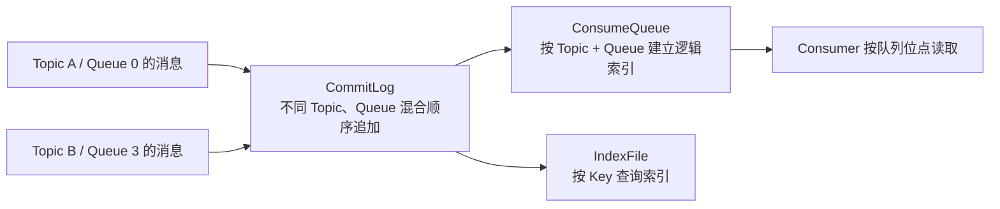
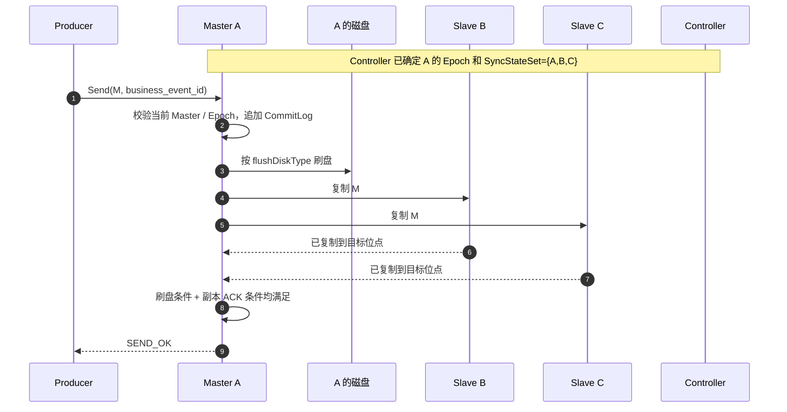
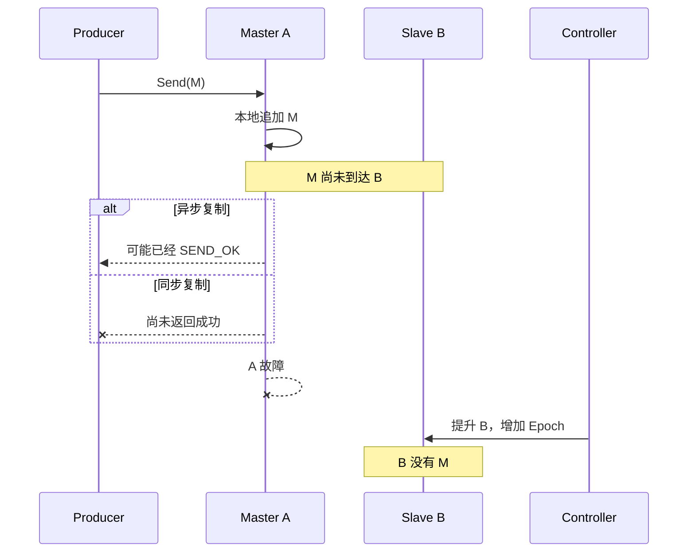
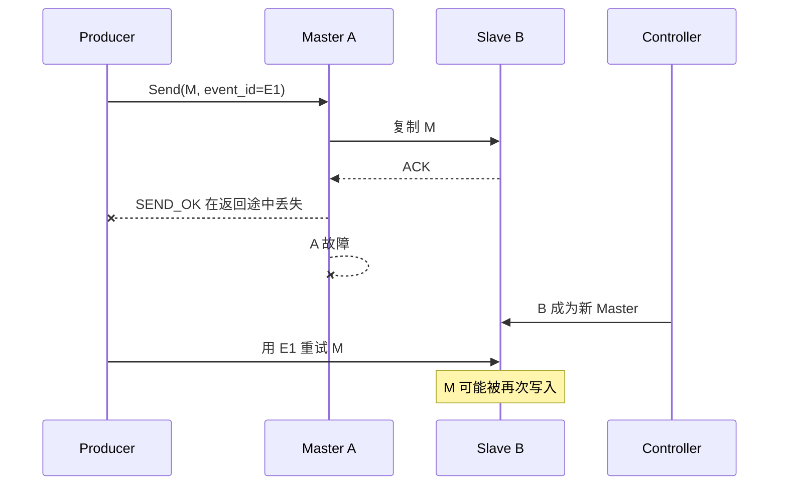
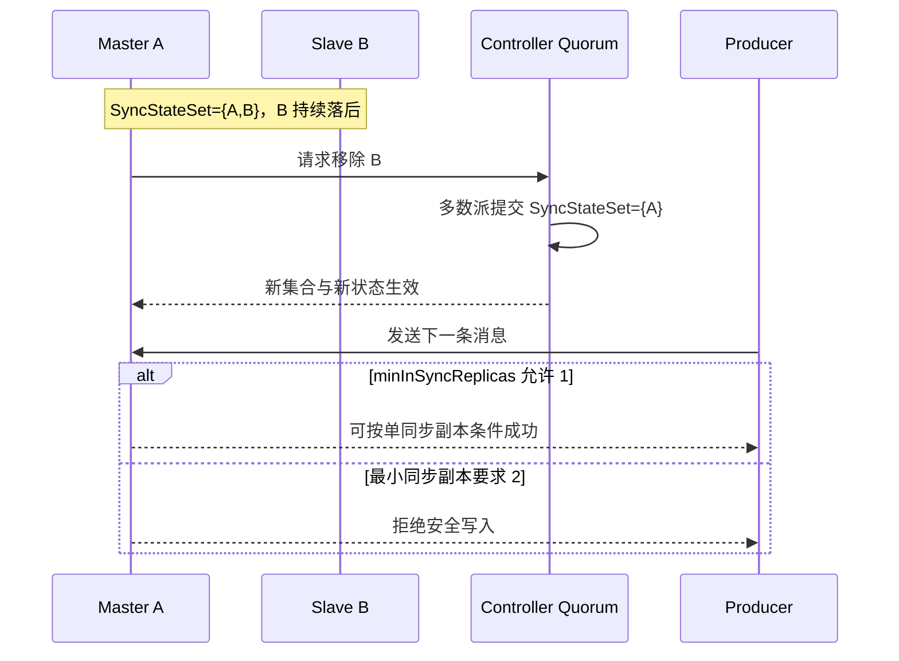

[第一篇](001_rocketmq.md)已经说明 Topic、MessageQueue、ConsumerGroup、NameServer、Controller 和 Broker 的连接路径。本文从 Broker B 收到 `order-1001` 的位置继续，沿 CommitLog、ConsumeQueue、刷盘、主从复制和消费位点解释提交与恢复。

<!-- more -->

## 1. 从 MessageQueue 到底层存储



- **CommitLog** 保存消息正文，顺序追加以提高写入效率；
- **ConsumeQueue** 保存某个 Topic/MessageQueue 到 CommitLog 的轻量索引；
- **IndexFile** 支持按消息 Key 查询，不能替代业务数据库索引。

消息是按本地文件和磁盘水位清理的。声明“保留七天”不代表磁盘压力下绝对可以读取七天；容量设计要同时考虑写入速率、消息大小、积压时间和安全余量。

大消息会同时放大网络、复制、刷盘、重试和积压成本。通常应把大对象放入对象存储，消息只携带地址、摘要和业务元数据。

## 2. Producer 何时可以认为消息成功

一次发送至少经过两条彼此独立的可靠性链：

1. **刷盘**：消息只到内存/页缓存，还是已经同步写入 Master 的持久介质；
2. **复制**：消息只在 Master，还是已到达足够多的 Slave。

这两个维度不能混为一谈：同步刷盘只保护 Master 本机，不能抵抗整台机器永久损坏；同步复制增加其他节点上的副本，但不天然表示每个 Slave 都完成了物理刷盘。

| 选择 | 返回成功的核心条件 | 主要风险 |
|---|---|---|
| 异步刷盘 + 异步复制 | Master 接受消息后即可较早返回 | 掉电和主机永久故障都可能丢已确认消息 |
| 同步刷盘 + 异步复制 | Master 本地持久化后返回 | Master 永久损坏且 Slave 未追上时仍可能丢失 |
| 异步刷盘 + 同步复制 | 消息到达规定数量同步副本后返回 | 多节点同时掉电仍有页缓存风险 |
| 同步刷盘 + 同步复制 | Master 持久化且规定数量副本收到后返回 | 延迟更高，副本不足时可能拒写 |

所以 `SEND_OK` 的准确含义只能是：**Broker 已满足当前配置定义的成功条件**，不能脱离配置解释成“所有副本都已落盘”。

## 3. 多副本如何保持一致

### 3.1 三种容易混淆的高可用模型

1. **传统 Master-Slave**：Master 写入 CommitLog，Slave 追随复制；同步或异步决定发送确认点，但固定角色本身不提供完整自动选主。
2. **Controller 自动切换**：仍使用 Broker 原生 CommitLog 主从复制；Controller 只通过共识确定合法 Master、任期和同步副本集合。
3. **DLedger CommitLog**：较早的另一种方案，用 Raft 替代原生 CommitLog 复制并选主；不要与 Controller 的“仅元数据 Raft”混成一种机制。

本文重点讨论 RocketMQ 5 的 Controller 模式。

### 3.2 Controller 到底保证了什么

Controller 通过 DLedger/Raft 维护：

- 当前哪个 Broker 是 Master；
- 当前 Master 的 Epoch（任期）；
- 哪些副本属于 SyncStateSet，可作为安全切换候选；
- SyncStateSet 的增减历史。

Epoch 用于隔离旧 Master。即使旧 Master 恢复并认为自己还能写，也不能绕过新任期继续形成另一条合法历史。

但是，Controller 的多数派只证明“选主元数据达成一致”，不证明某条业务消息已复制到多数 Broker。数据安全仍取决于 Broker 复制和发送确认配置。

### 3.3 SyncStateSet 和写入门槛

SyncStateSet 是当前被认为跟得上 Master 的副本集合。落后超过阈值的 Slave 会被移出，追平后才能重新加入。

关键配置表达的是一致性与可用性的取舍：

- `allAckInSyncStateSet=true`：消息到达当前 SyncStateSet 的所有成员后才返回成功；
- 否则由 `inSyncReplicas` 决定一次成功需要多少个同步副本确认；
- `minInSyncReplicas` 约束 SyncStateSet 至少保留多少成员才继续安全写入；
- `enableElectUncleanMaster=false`：不从 SyncStateSet 外选择落后副本，以避免让已确认历史倒退。

“所有同步副本”是一个动态集合，不等于最初部署的全部副本。如果 SyncStateSet 缩到 1 且最小门槛也允许 1，系统仍可能单副本返回成功。配置副本数、当前同步副本数和本次 ACK 数必须分别监控。

## 4. 一条消息从发送到返回的完整过程

假设 Broker A 是 Master，B、C 是 Slave，当前 `SyncStateSet={A,B,C}`，要求所有同步成员确认：



这条时间线给出最重要的判断：

- 消息仅被 A 接收，不等于成功；
- 消息追加到 A，也不等于已经具备故障切换安全性；
- 是否需要等 B、C，以及需要等几个，由复制配置决定；
- 是否需要等本地磁盘，由刷盘配置决定；
- Producer 收到成功，只证明这些配置条件在当时已经满足。

## 5. 临界故障场景

仍假设 A 是 Master，B 是 Slave，消息为 M。

### 5.1 M 尚未复制，A 就故障



- **异步复制**：A 可能已返回成功；如果 A 永久损坏，B 成为 Master 后没有 M，出现“已确认但丢失”。
- **同步复制**：A 不应在满足副本条件前返回普通成功。Producer 收到超时或失败，但无法仅凭超时判断 M 一定不存在。

Producer 对未知结果应使用同一个业务事件 ID 重试；Consumer 必须幂等。网络协议无法同时消除“响应可能丢失”和“绝不重复”。

### 5.2 B 已复制 M，但成功响应在路上丢失



此时服务端可能已经安全保存 M，但 Producer 只能看到超时。重试可能制造重复，因此：

- Producer 使用稳定业务事件 ID，而不是每次重试生成新 ID；
- Consumer 以事件 ID、订单号和状态迁移规则做幂等；
- `msgId` 用于追踪，不应被当成端到端业务幂等保证。

### 5.3 同步副本落后并被移出

Master 不能仅凭本地判断悄悄缩小同步集合。它应请求 Controller 更新 SyncStateSet，只有新集合经 Controller 多数派提交后，Master 才能按新集合判断后续写入。



这就是一致性与可用性的核心选择：副本不足时继续服务，会扩大数据丢失窗口；停止写入，则牺牲可用性来保护已承诺的可靠性。

### 5.4 旧 Master 恢复后，独有消息如何处理

假设 A 故障前有一段只存在于本机、没有进入新 Master 有效历史的尾部消息。A 恢复时不能把这些消息自行重新发布，否则客户端可能在新历史运行一段时间后突然看到旧消息“复活”。

正确原则是：

1. A 读取 Controller 的当前角色和 Epoch，以 Slave 身份加入；
2. 以当前 Master 的有效 CommitLog 为准定位共同点；
3. 截断冲突或无效尾部；
4. 从当前 Master 补齐缺失数据；
5. 达到同步标准后，才重新进入 SyncStateSet。

这不是在判断旧消息“业务上还有没有价值”，而是在维护单一合法历史。若需要挽救未确认消息，应走审计和业务补偿流程，不能让旧节点私自合并日志。

## 6. Consumer Offset、重试与恢复

第一篇的 `fulfill-workers` 对每条 MessageQueue 保存独立 Offset：

```text
fulfill-workers + OrderTask + BrokerB/Queue1 → offset 43
```

Broker 根据 ConsumeQueue 的逻辑 Offset 定位 CommitLog 中的消息。Consumer 拉到 Offset 42，不表示业务已经完成；只有消费成功并保存 43，接管者才会从下一条继续。

### 6.1 两个结果未知窗口

- **业务成功、Offset 尚未保存**：Rebalance 或 Consumer 故障后再次读取 42，产生重复；
- **先推进 Offset、业务随后失败**：接管者从 43 开始，业务可能被跳过。

因此任务消费应先完成幂等业务事务，再确认消费结果。ConsumerGroup 的 Offset 是恢复书签，不是业务数据库提交证明。

### 6.2 重试 Topic 与死信

消费失败后，RocketMQ 按 ConsumerGroup 管理重试。重试消息可能经过延迟再次投递；超过最大次数后进入死信队列。

重试改变的是投递时间和次数，不保证业务只执行一次。监控必须把正常积压、重试积压和死信分别观察，避免失败风暴反向压垮 Broker 与下游。

MessageQueue Rebalance 时，旧 Consumer 的在途任务与新 Consumer 的接管可能重叠。业务事件 ID、订单状态机和数据库唯一约束仍是最终幂等边界。

## 7. 事务消息的实现边界

事务消息解决 Producer 本地事务与消息最终可见性的协调：

```text
发送 Half Message
→ Broker 暂不向 Consumer 投递
→ Producer 执行本地事务
→ Commit 或 Rollback
→ 状态未知时 Broker 回查 Producer
```

它保证的是“本地事务结果决定消息是否最终可见”，不是把下游服务数据库加入同一个事务。需要明确：

- Producer 的事务检查服务必须能根据持久业务事实回答 Commit/Rollback；
- 回查可能重复，检查逻辑必须幂等；
- 消息 Commit 后，下游仍按至少一次消费；
- 长时间无法确定的事务消息需要告警和人工补偿。

## 8. 积压、扩容与热点

容量至少要按下面的关系估算：

```text
积压容量 ≈ 峰值写入字节/秒 × 最长不可消费时间 × 安全系数
恢复条件：恢复期消费速度 > 恢复期生产速度
```

扩容时增加 Broker Group 并让 Topic 使用更多 MessageQueue，但需要注意：

- 新 Broker 不会自动消除已有热点 Key；
- 增加队列后，客户端路由变化可能使业务 Key 漂移；
- 单个热点 MessageGroup 仍受单顺序通道处理能力限制；
- 缩容前要停止向目标队列写入，并处理剩余积压和消费进度；
- 扩容副本提高可用性，扩容分片提高吞吐，两者目标不同。

真正的限流位置也必须明确：Producer、Proxy、Broker 磁盘或 Consumer 任一环节过载，都可能表现成发送延迟。只看集群平均吞吐会掩盖单队列和单磁盘热点。

## 9. Schema、安全与多租户

RocketMQ 不会替业务自动解决消息契约演进。每条消息应有：

- 明确的事件名和版本；
- 稳定业务事件 ID；
- 发生时间和必要的因果版本；
- 向前、向后兼容规则；
- 无法反序列化时的隔离与补偿路径。

安全上至少要覆盖 TLS、身份认证、Topic/ConsumerGroup 授权、凭证轮换和审计。Dashboard、NameServer、Broker、Proxy 和 Controller 的管理端口不应直接暴露到公网。

共享集群还要限制单租户的 Topic 数、队列数、带宽、存储和重试流量。逻辑权限隔离不等于资源隔离，一个租户的热点和重试风暴仍可能影响其他租户。

## 10. 运维时真正要观察什么

仅观察进程存活和集群总 TPS 不够。至少需要监控：

- Producer 成功率、状态码、超时、重试和 P99 延迟；
- 每个 Topic/MessageQueue 的写入、读取、积压和最老消息年龄；
- ConsumerGroup 位点、处理耗时、重试和死信增长；
- Broker 磁盘水位、CommitLog 写入和刷盘延迟；
- Master-Slave 复制差距和 Slave 追赶时间；
- SyncStateSet 当前成员、实际 ACK 数和缩容事件；
- Controller 多数派、Master Epoch 和选主次数；
- NameServer 路由注册、Proxy 路由刷新和访问错误。

Controller 故障不一定立即中断已有 Master 的发送和消费，但会削弱故障后的自动选主能力。因此“当前业务还能发”不等于集群仍具备高可用。

升级和迁移前应验证 Broker 角色、CommitLog 对齐、Epoch 文件和 Controller 状态。旧主从模式迁移到 Controller 模式时，若日志未对齐或错误启动节点，可能触发截断并造成数据损失。

## 11. 跨地域容灾

把一个同步副本组直接跨远距离地域部署，会让每次同步发送承受跨地域网络延迟和抖动。更常见的方案是：

- 每个地域建立独立集群；
- 通过异步复制或业务桥接传递事件；
- 明确 RPO（最多允许丢多久的数据）和 RTO（多久恢复）；
- 设计消费位点迁移、重复范围和流量入口切换；
- 预先定义双边都曾写入时如何处理分叉历史。

跨地域异步复制不能承诺零 RPO；同步跨地域则会把远端可用性和网络延迟放进每次发送路径。这里没有免费的高可用。

## 12. 实现结论

- CommitLog 保存混合消息正文，ConsumeQueue 是 `Topic + MessageQueue` 到 CommitLog 的逻辑索引。
- 刷盘与副本复制是两条独立保证，`SEND_OK` 必须结合实际配置解释。
- Controller 用 DLedger/Raft 管理 Master、Epoch 和 SyncStateSet，但不替业务消息执行 Raft 提交。
- 当前 SyncStateSet 与最小同步副本门槛共同决定可靠性和可用性。
- 未确认消息可能保留也可能丢失；已保存但响应丢失会导致 Producer 重试和重复。
- 旧 Master 恢复后服从当前 Epoch 和有效 CommitLog，独有尾部不会自动复活。
- Consumer Offset、重试和事务消息都不能替代业务幂等。
- 增加副本提高容错，增加 MessageQueue/Broker 才扩展分片吞吐。

## 13. 参考资料

- [RocketMQ Domain Model](https://rocketmq.apache.org/docs/domainModel/01main/)
- [RocketMQ Topic](https://rocketmq.apache.org/docs/domainModel/02topic/)
- [RocketMQ MessageQueue](https://rocketmq.apache.org/docs/domainModel/04messagequeue/)
- [RocketMQ Message](https://rocketmq.apache.org/docs/domainModel/05message/)
- [RocketMQ ConsumerGroup](https://rocketmq.apache.org/docs/domainModel/08consumergroup/)
- [RocketMQ Master-Slave Automatic Failover](https://rocketmq.apache.org/docs/deploymentOperations/03autofailover/)
- [RocketMQ Controller Deployment and Design](https://github.com/apache/rocketmq/blob/develop/docs/en/controller/deploy.md)
- [RocketMQ FIFO Message](https://rocketmq.apache.org/docs/featureBehavior/03fifomessage/)
- [RocketMQ Transaction Message](https://rocketmq.apache.org/docs/featureBehavior/04transactionmessage/)
- [RocketMQ Consumer Type](https://rocketmq.apache.org/docs/featureBehavior/06consumertype/)
- [RocketMQ Consumer Load Balancing](https://rocketmq.apache.org/docs/featureBehavior/08consumerloadbalance/)
- [RocketMQ Consumer Progress](https://rocketmq.apache.org/docs/featureBehavior/09consumerprogress/)
- [RocketMQ Consumer Retry Policy](https://rocketmq.apache.org/docs/featureBehavior/10consumerretrypolicy/)
- [RocketMQ Message Storage and Cleanup](https://rocketmq.apache.org/docs/featureBehavior/11messagestorepolicy/)
- [RocketMQ Metrics](https://rocketmq.apache.org/docs/observability/01metrics/)
- [RocketMQ Security](https://rocketmq.apache.org/docs/security/01security/)
