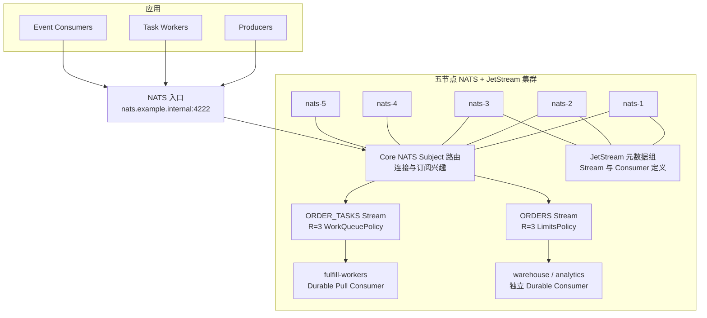
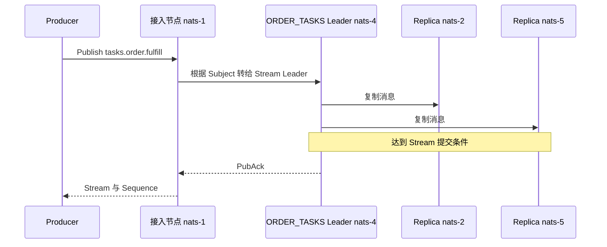
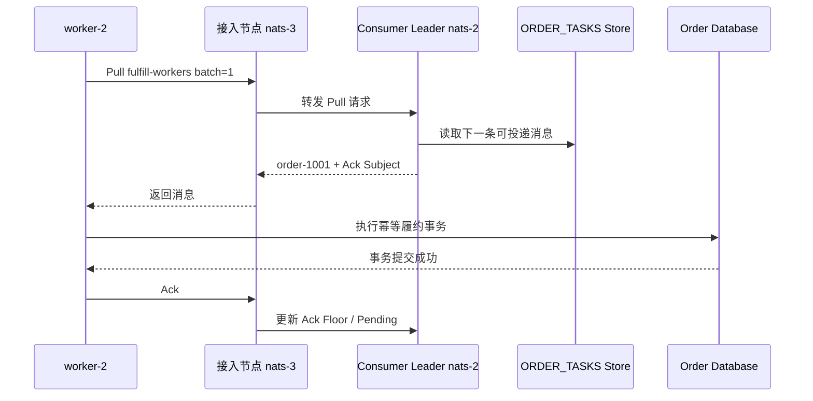

Core NATS 是在线消息总线；JetStream 在其上增加持久化、确认、重投和回放。选型前必须先回答：业务只需要把消息实时转给当前在线的订阅者，还是在无人消费时也必须保存消息？本文讨论后者。

本文通过五节点和两个订单示例说明 Subject、Stream、Consumer、Retention Policy 如何组合。Raft 日志、Leader 切换和临界故障窗口见[实现篇](004_nats_jetstream_implementation.md)。

<!-- more -->

## 1. 五节点生产部署

五台服务器都运行 `nats-server` 并启用 JetStream：

| 节点 | IP | 主要职责 |
|---|---|---|
| `nats-1` | `10.0.0.11` | NATS 路由、客户端接入、JetStream 资源成员 |
| `nats-2` | `10.0.0.12` | NATS 路由、客户端接入、JetStream 资源成员 |
| `nats-3` | `10.0.0.13` | NATS 路由、客户端接入、JetStream 资源成员 |
| `nats-4` | `10.0.0.14` | NATS 路由、客户端接入、JetStream 资源成员 |
| `nats-5` | `10.0.0.15` | NATS 路由、客户端接入、JetStream 资源成员 |

客户端配置多个地址或统一入口 `nats.example.internal:4222`。任一节点都能接受连接；接入节点通过 NATS 集群路由把请求送到负责目标 Stream/Consumer 的节点。

### 1.1 完整生产架构



这里没有单独的“NameServer”：

- NATS 节点通过 Cluster Route 交换 Subject 订阅兴趣并转发协议消息。
- JetStream 元数据组保存 Stream 与 Consumer 定义和资源布局。
- 每个复制 Stream 有自己的 Leader 和副本组；五节点不表示每条消息保存五份。
- Durable Consumer 是有状态服务端对象，不只是客户端进程名字。

### 1.2 JetStream 保存的四类数据

- **NATS 连接与 Subject 路由状态**
  - 解决的问题：当前有哪些连接和订阅，某个 Subject 的消息应该转发到哪里。
  - 保存组件：各 `nats-server` 的内存连接、订阅兴趣和 Cluster Route。
  - 生命周期：连接断开后失效，不是业务消息的持久历史。

- **JetStream 资源元数据**
  - 解决的问题：有哪些 Stream、Consumer，它们的配置和副本成员是什么。
  - 保存组件：JetStream 元数据 Raft Group。
  - 一致性机制：通过 Raft 复制资源定义和布局变化。

- **Stream 消息**
  - 解决的问题：哪些 Subject 消息需要保存、保留多久、复制几份。
  - 保存组件：目标 Stream 的 File/Memory Store 及其副本组。
  - 一致性机制：每个复制 Stream 使用独立 Raft Group，Leader 排序写入并复制到多数成员。

- **Consumer 投递状态**
  - 解决的问题：一套 Consumer 已投递到哪里、哪些消息尚未 Ack、何时重投。
  - 保存组件：JetStream Consumer 的服务端状态，包括 Deliver Sequence、Ack Floor、Pending 和 Redelivery。
  - 一致性机制：Durable Consumer 状态按其副本配置持久化和复制；客户端当前批次和业务事务仍只在应用侧。

## 2. 示例一：订单履约任务

定义：

```text
Subject:          tasks.order.fulfill
Stream:           ORDER_TASKS
Subjects:         tasks.order.>
Retention:        WorkQueuePolicy
Replicas:         3
Durable Consumer: fulfill-workers
Mode:             Pull
Ack Policy:       Explicit
```

三个 Worker 共同从同一个 Durable Pull Consumer 拉取任务。这里的任务竞争单位是 `fulfill-workers` Consumer，不是创建三个独立 Consumer。

本例假设 `ORDER_TASKS` Leader 在 `nats-4`，副本在 `nats-2/5`；Consumer Leader 在 `nats-2`。

### 2.1 初始化后各组件保存什么

- 元数据组保存 `ORDER_TASKS` 的 Subject 范围、WorkQueuePolicy、容量、存储类型和三副本成员。
- Stream 三个成员准备消息 Store；还没有订单消息时日志为空。
- 元数据组保存 `fulfill-workers` 的 Durable 名字、过滤 Subject、Pull 模式和 Ack 配置。
- Consumer 状态保存当前投递序号、Ack Floor、Pending 与重投次数。
- Core NATS 不会把 `tasks.order.fulfill` 当成持久 Topic；只有匹配到 `ORDER_TASKS` 后，JetStream 才负责保存。

Subject 是消息地址，Stream 是“捕获哪些 Subject 并持久化”的规则，Consumer 是 Stream 上的一份有状态读取视图。

### 2.2 Producer 生产消息的完整过程

假设 Producer 连接 `nats-1`：



1. Producer 只发布到 Subject `tasks.order.fulfill`，不直接选择 Stream 副本。
2. `nats-1` 根据 Subject 匹配发现 `ORDER_TASKS` 需要捕获这条消息。
3. 接入节点把 JetStream 发布请求路由到 `nats-4` 的 Stream Leader。
4. Leader 保存消息并复制给 Stream 副本。
5. 达到当前副本提交条件后返回 PubAck，包含 Stream 名和 Sequence。

普通 Core NATS Publish 没有同等的持久接管证明；需要可靠发布时，Producer 必须等待 JetStream PubAck。PubAck 仍不表示 Worker 已处理业务。

### 2.3 Consumer 有哪些状态

- **连接与 Pull 请求**：Worker 连到哪个 NATS 节点、请求多少条、请求超时多久，属于连接和客户端运行状态。
- **Durable Consumer 定义**：名字、Filter Subject、Ack Policy、Ack Wait、Max Deliver 等，保存在 JetStream 元数据中。
- **统一投递进度**：三个 Worker 共享 `fulfill-workers` 的 Deliver Sequence 和 Ack Floor。
- **Pending 状态**：哪些 Stream Sequence 已经投递但尚未 Ack，以及交付次数。
- **业务完成状态**：数据库事务是否提交只在 Worker 业务系统中，JetStream 不知道。

### 2.4 Consumer 消费消息的完整过程



1. Worker 2 可以连接任一 NATS 节点，本例为 `nats-3`，不必直连 Consumer Leader。
2. 三个 Worker 都向同一个 Durable Consumer 发 Pull，请求由集群路由到 Consumer Leader。
3. Consumer 从 `ORDER_TASKS` 选择下一条消息，只把这次投递交给一个 Worker，并记入 Pending。
4. Worker 完成业务后 Ack，Consumer 删除相应 Pending 并推进可推进的 Ack Floor。
5. Ack Wait 超时或 Worker 断开时，消息可以再次投递。
6. 数据库成功但 Ack 丢失仍会重复，业务必须幂等。

WorkQueuePolicy 表示被匹配 Consumer 成功处理的消息可以从 Stream 清除。它对 Consumer 的过滤范围有约束，不适合用多个重叠 Consumer 做事件广播。

## 3. 示例二：订单事件流

定义 `ORDERS` Stream 捕获 `orders.>`，使用 LimitsPolicy 和三副本。仓储、通知和分析分别建立 Durable Consumer：

```text
warehouse    → 独立进度与 Pending
notification → 独立进度与 Pending
analytics    → 独立进度与 Pending
```

Producer 发布一次 `orders.created`，Subject 路由让 `ORDERS` 保存一份消息。三个 Consumer 从同一 Stream 独立读取；仓储 Ack 不会替通知和分析 Ack。

LimitsPolicy 根据最大年龄、消息数或容量清理日志，而不是等所有 Consumer Ack。服务离线后能否回放，取决于消息是否仍在保留窗口内。

JetStream 没有 Kafka 式显式 Partition。需要横向分片时，通常按 Subject 划分多个 Stream，例如 `orders.0.>`、`orders.1.>`，并由应用稳定选择分片。

## 4. 从两个示例归纳语义边界

- Subject 是地址和路由标签，Stream 才是持久消息容器。
- 一个 Subject 可以被零个、一个或多个 Stream 捕获；没有 Stream 捕获时，Core NATS 不会自动保留历史。
- Consumer 是服务端有状态读取视图；多个 Worker 共享一个 Consumer 才形成任务竞争。
- WorkQueuePolicy 适合任务完成后清理；LimitsPolicy 加多个 Consumer 适合事件留存和独立读取。
- PubAck、Consumer 投递、业务事务和 Consumer Ack 是不同时间点。
- JetStream 的扩展单位是 Subject、Stream 和副本组，不是自动生成的 Partition。

JetStream 适合低延迟消息、任务分发、事件保留和边缘/多地域 NATS 拓扑。若需要成熟的显式分区生态和超大规模历史流处理，Kafka/Pulsar 更直接。

## 5. 客户端连接路径总结

```text
生产：
Producer → 任一 NATS 节点
         → Subject 匹配目标 Stream
         → Stream Leader

消费：
Worker → 任一 NATS 节点
       → Durable Consumer Leader
       → Stream Store
```

接入节点通过 NATS Route 转发请求，客户端不需要预先知道 Stream Leader。

## 6. 下一篇解决的实现问题

以下内容见[NATS JetStream 实现篇](004_nats_jetstream_implementation.md)：

- 元数据、Stream 和 Consumer 为什么是不同 Raft Group；
- PubAck 的多数派提交边界；
- Stream Leader 故障时未确认消息如何处理；
- 节点恢复和副本重新同步。

## 7. 参考资料

- [NATS：Streams](https://docs.nats.io/nats-concepts/jetstream/streams)
- [NATS：Consumers](https://docs.nats.io/nats-concepts/jetstream/consumers)
- [NATS：Retention Policies](https://docs.nats.io/using-nats/developer/develop_jetstream/model_deep_dive)
- [NATS：JetStream in a cluster](https://docs.nats.io/learn/topologies/jetstream-in-a-cluster)
