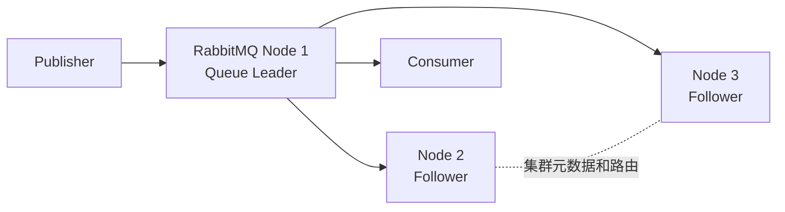

RabbitMQ 的核心抽象是 Exchange、Binding 和 Queue。普通队列不是 Kafka Partition；需要分区日志时，应使用 RabbitMQ Stream，并用 Super Stream 把一个逻辑流拆成多个分区流。

<!-- more -->

## 1. 生产架构

生产基线通常是跨故障域的 3 节点集群，客户端配置多个地址或经负载均衡连接。高价值持久消息使用 Quorum Queue；需要回放、高吞吐流式读取时使用 Stream/Super Stream。RabbitMQ 4.0 起经典镜像队列已经移除，不能再用旧的 HA Policy 作为新方案。

集群会复制 Exchange、Binding、用户等定义，但 Classic Queue 的消息不会因为加入集群而自动复制。队列是否高可用取决于队列类型。

## 2. 分区与顺序

### 2.1 Quorum Queue

一个 Quorum Queue 是一个独立 Raft 组，不做内部水平分区。要提高并行度，需要建立多条队列，并用一致的业务 Key 通过 Direct/Consistent Hash Exchange 路由。

RabbitMQ 一般按入队顺序投递，但下面情况会改变观察到的顺序：

- 多个竞争消费者并发处理；
- `prefetch > 1` 后客户端并行执行；
- 消费失败后 `nack/requeue`，消息重新入队；
- 消息优先级让高优先级消息越过普通消息。

若要求严格顺序，可使用 Single Active Consumer、单消费者、`prefetch=1`，并在成功处理后 Ack。代价是队列吞吐受单消费者限制。

### 2.2 Super Stream

Super Stream 是多个普通 Stream 组成的逻辑流。Publisher 用路由 Key 选择分区；单个分区内有序，不保证跨分区全局有序。Single Active Consumer 可保证每个分区只有一个活动消费者，并在故障时接管。

## 3. 多副本一致性

Quorum Queue 和 Stream 都有 Leader 与 Followers，使用 Raft 复制队列状态。Quorum Queue 的入队、投递和确认等状态变更先进入 Leader，再复制到多数成员。Publisher Confirm 只保护已经确认的消息；未确认的在途消息仍需客户端重试。

3 成员队列可容忍 1 个成员故障，5 成员可容忍 2 个。成员数应使用较小奇数，默认 3 通常足够。失去多数派后队列停止工作，避免两个网络分区同时接受写入。

Stream 的 Confirm 在数据复制到多数副本后返回，但官方说明其磁盘刷盘策略与 Quorum Queue 不同；要求更严格的关键任务队列应优先 Quorum Queue。

## 4. 故障修复与再平衡

### 4.1 临界故障时间线

以 3 成员 Quorum Queue 为例，A 是 Leader，B、C 是 Followers：

1. Publisher 把持久消息 M 发到 Exchange，M 被路由到该 Quorum Queue。
2. A 把入队操作写入自己的 Raft Log，并复制给 B、C。
3. 至少 A 与一个 Follower 将消息写盘并 `fsync`，形成多数派提交；RabbitMQ 才能对这条目标队列产生 Publisher Confirm。若一条消息路由到多条队列，要等所有目标队列接受后才整体 Confirm。
4. A 如果在多数派提交前故障，M 不会成为队列的已提交状态，Publisher 也收不到 Confirm。新 Leader 由多数派选举，未提交的旧 Leader 尾部被回滚。
5. A 恢复后发现新 Leader，从新 Leader 补齐或覆盖 Raft Log；它本地独有的 M 不会“复活”。

RabbitMQ 客户端不能把“TCP 写成功”当作消息成功，必须启用 Publisher Confirms。Confirm 超时同样是结果未知：M 可能未提交，也可能已经多数派落盘但 Confirm 丢在网络中。Publisher 应用相同业务 ID 重试，消费者按业务唯一键幂等。

这不是传统“主从半同步”，而是每个 Quorum Queue 独立执行多数派 Raft 提交。多数派不可用时停止接受安全写入，以一致性换可用性。

Leader 故障时，多数派一侧选出新 Leader，短暂暂停投递和写入。恢复的 Follower 从中断位置继续复制 Raft Log，自动追赶，不需要像旧经典镜像队列那样整体同步阻塞 Leader。

永久替换节点时采用 grow-then-shrink：

1. 加入新 RabbitMQ 节点；
2. `rabbitmq-queues grow` 或 `add_member` 给队列增加新成员；
3. 等待新成员追上并确认所有队列仍有多数派；
4. `rabbitmq-queues shrink` 或 `delete_member` 移除旧成员；
5. `rabbitmq-queues rebalance quorum` 均衡 Leader。

Leader Rebalance 只移动领导权，不改变成员落在哪些节点。Continuous Membership Reconciliation 可以把成员数补到目标值，但不能完全替代永久下线节点时的显式成员管理。

如果 3 个成员永久丢失 2 个而无法恢复，Quorum Queue 不能从剩余少数派安全继续，通常只能强制删除后从外部备份或上游重建。

## 5. 适用边界

RabbitMQ 适合工作队列、复杂路由、请求削峰、低延迟业务消息。需要海量历史回放时使用 Stream，或者评估 Kafka/Pulsar；不要让一条超大 Quorum Queue 承担无限积压。

## 6. 参考资料

- [RabbitMQ Quorum Queues](https://www.rabbitmq.com/docs/quorum-queues)
- [RabbitMQ Publisher Confirms](https://www.rabbitmq.com/docs/confirms)
- [RabbitMQ：How Are the Messages Stored?](https://www.rabbitmq.com/blog/2025/01/17/how-are-the-messages-stored)
- [RabbitMQ Streams and Super Streams](https://www.rabbitmq.com/docs/streams)
- [RabbitMQ Reliability Guide](https://www.rabbitmq.com/docs/reliability)
- [RabbitMQ Network Partitions](https://www.rabbitmq.com/docs/partitions)
