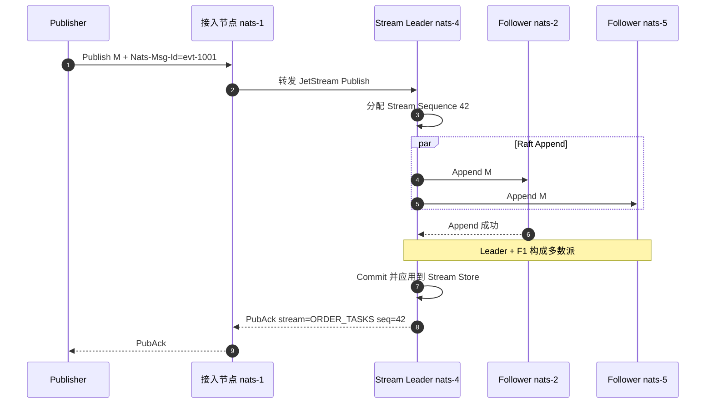
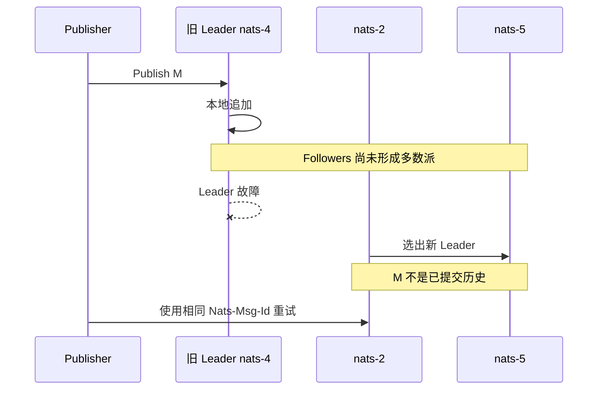

[第一篇](003_nats_jetstream.md)已经说明 Subject、Stream、Durable Consumer 和客户端连接路径。本文不再重复部署与抽象定义，而是继续追踪 `order-1001`：它在磁盘上变成什么、何时可以返回 PubAck、Leader 故障后为何可能存在或不存在，以及 `fulfill-workers` 如何恢复 Pending 状态。

<!-- more -->

## 1. 从 Subject 到底层存储

第一篇的发布路径是：

```text
tasks.order.fulfill
        → ORDER_TASKS Stream
        → Stream Leader
```

进入 Stream 后，消息获得单调递增的 Stream Sequence。File Storage 把消息写入 Stream 自己的数据目录，并使用消息块、索引和状态文件管理历史；删除和压缩会更新 Stream 状态，但 Subject 本身没有独立消息文件。

需要区分三个复制范围：

- **JetStream 元数据组**保存 Stream/Consumer 定义、Placement 和成员变化。
- **Stream Raft Group**保存 `ORDER_TASKS` 的消息与 Stream 状态。
- **Consumer Raft Group**保存 `fulfill-workers` 的投递进度、Ack Floor、Pending 和重投状态。

它们不是一个覆盖整个集群的巨大 Raft 日志。一个 Stream 故障或变慢，不应要求所有其他 Stream 共用同一个提交队列。

### 1.1 Stream Sequence 与 Consumer Sequence

假设 `order-1001` 是 `ORDER_TASKS` 的第 42 条消息：

```text
Stream Sequence = 42
Consumer Sequence = 17
```

Stream Sequence 表示消息在 Stream 历史中的位置；Consumer Sequence 表示它是这套 Consumer 的第几次投递。发生重投时，同一个 Stream Sequence 42 可以对应新的 Consumer Sequence。

Consumer 保存的核心不是一个简单 Offset，而是：

- Delivered：已经尝试投递到哪里；
- Ack Floor：此前连续确认到哪里；
- Pending：已投递但尚未确认的 Stream Sequence；
- Redelivery Count：每条 Pending 消息已经尝试多少次。

因此，Consumer Leader 切换后不仅要知道“下一条消息”，还要恢复哪些旧消息仍需重投。

## 2. 一条消息从写入到 PubAck

继续使用第一篇的三副本布局：

```text
ORDER_TASKS R=3
Leader:   nats-4
Follower: nats-2
Follower: nats-5
```



PubAck 的核心边界是：写入已经成为 Stream Raft Group 的已提交历史。它不是“接入节点收到消息”，也不要求三个成员全部响应。

### 2.1 Raft 提交与磁盘刷盘不是同一个问题

JetStream 的 R=3 主要解决单节点故障：只要包含最新提交记录的多数派存活，就能选出新 Leader。

File Storage 为性能不会把每条消息都当成一次独立的同步刷盘事务。因而要区分：

- **Raft 提交**：多数成员已经接受这条日志；
- **操作系统写缓存**：数据已交给内核，但可能尚未到稳定介质；
- **整组同时断电**：如果所有成员都丢失尚未落盘的缓存，R=3 不能创造不存在的持久副本。

所以不能把“多数副本 PubAck”宣传成“任意规模同时断电绝不丢”。单机故障、多节点故障和整组电源故障是不同故障模型。

## 3. 临界故障：消息到底存在还是不存在

### 3.1 尚未形成多数派，Leader 故障



Publisher 没收到 PubAck，只能把结果当作未知。新 Leader 不会承诺旧 Leader 的孤立未提交尾部；旧节点恢复后也必须截断冲突部分并追赶当前 Leader。

### 3.2 已提交，但 PubAck 在途中丢失

如果 Leader 和一个 Follower 已经提交 M，随后响应丢失：

- 新 Leader 会保留 M；
- Publisher 仍只看到超时；
- Publisher 重试可能产生重复发布。

使用稳定的 `Nats-Msg-Id` 可以在 Stream 的 Duplicate Window 内去重。窗口过期、消息 ID 改变或跨 Stream 重试时，仍需要 Consumer 业务幂等。

### 3.3 失去多数派

三成员 Stream 只剩一个成员时，它无法证明自己拥有最新历史，因此不能安全继续提交。正确行为是牺牲可用性，而不是让两个网络分区同时接受写入。

如果业务配置单副本 `R=1`，就不存在副本多数派保护；节点或磁盘损坏时只能依赖 Snapshot/Restore 和上游重放。

## 4. Consumer 状态如何提交和恢复

第一篇中三个 Worker 共享 `fulfill-workers`。假设 Stream Sequence 42 已交给 Worker 2：

```text
Delivered:  consumer-seq=17 / stream-seq=42
Pending:    42 → deadline, delivery-count=1
Ack Floor:  stream-seq=41
```

Consumer Leader 先持久记录投递/Pending 状态，再向 Worker 返回消息。Worker完成数据库事务后发送 Ack，Consumer 再提交状态变化并从 Pending 中移除 42。

### 4.1 Ack 响应丢失

可能出现：

1. Worker 的业务事务已经提交；
2. Worker 发出 Ack；
3. Consumer 已提交 Ack，但 Ack 响应丢失；
4. Worker 不知道 Ack 是否成功。

普通 Ack 下，客户端不能仅靠超时判断最终状态。`AckSync`/Double Ack 可以让客户端等待服务端确认收到 Ack，但响应链路仍需按结果未知设计，业务幂等不能删除。

### 4.2 Consumer Leader 故障

- 已提交的 Ack Floor 和 Pending 会由新 Consumer Leader 恢复；
- 只存在于旧 Leader 内存、尚未提交的投递可能再次出现；
- Worker 的当前数据库事务不会被 JetStream 恢复；
- WorkQueuePolicy 只有在匹配 Consumer 成功确认后才允许清理消息。

恢复语义仍是至少一次：Consumer 状态复制避免“完全忘记进度”，但不能把外部数据库和 JetStream Ack 合成一个原子事务。

### 4.3 Ordered Consumer 为什么不同

Ordered Consumer 主要用于无 Ack 的顺序读取和自动重建，不是持久任务处理状态。它发现序列缺口后重建 Consumer，但不提供 Durable Consumer 那套 Pending/Ack/Redelivery 语义，不适合作为 `fulfill-workers` 的可靠任务模型。

## 5. 副本修复与成员变更

Follower 恢复后有两种追赶方式：

- 日志缺口仍在保留范围内：从 Leader 复制缺失日志；
- 缺口过大：安装 Snapshot，再继续追赶后续日志。

成员变更应遵循：

```text
添加新 Peer
→ 等待 Snapshot/Log Catch-up
→ 验证成为 Current
→ 再移除旧 Peer
```

不要先删除旧成员再等待新成员复制，这会在维护过程中主动降低多数派余量。

提高 Replicas 只增加容错和写放大，不增加单 Stream 写吞吐。扩展写吞吐应按 Subject 拆分多个 Stream，并由应用定义稳定分片；扩展任务处理能力则增加共享 Durable Pull Consumer 的 Worker。

## 6. 保留、积压与容量

容量至少要同时估算：

```text
消息存储 ≈ 写入速率 × 平均消息大小 × 保留时间 × 副本数
Pending 风险 ≈ Worker 并发 × 单批大小 × Ack Wait 内重投次数
```

需要观察：

- Stream 消息数、字节数、最老消息时间和删除速率；
- Consumer Num Pending、Num Ack Pending、Num Redelivered；
- Raft Leader 分布、Replica Lag、Offline Peer；
- Store I/O、磁盘空间、内存和文件描述符；
- Publisher PubAck 延迟、超时、Duplicate 命中。

WorkQueuePolicy 的积压由未完成任务决定；LimitsPolicy 的历史由时间/容量决定。二者不能用同一套“消费完就应该清空”告警。

## 7. 备份与跨地域边界

JetStream 集群复制用于在线节点故障，不等于离线备份。Snapshot/Restore 应同时覆盖 Stream 数据、Stream 配置和 Consumer 状态，并实际验证最后 Stream Sequence 与 Ack Floor。

跨地域拉长 Raft RTT 会直接影响 PubAck。高延迟地域通常使用独立集群和 Mirror/Source 等异步复制能力，需要另行定义 RPO、切换方向、重复范围和回切策略，不能把它当作一个跨地域同步 Raft Group。

## 8. 实现结论

- JetStream 不是半同步主从；每个复制 Stream 使用多数派 Raft。
- PubAck 表示 Stream Raft 已提交，不表示 Consumer 完成，也不代表整组同时掉电绝对安全。
- Stream 和 Consumer 是不同状态机；消息历史与消费 Pending 可以独立恢复。
- R=3 能容忍一个成员故障，前提是故障域真正独立且剩余多数派拥有最新提交历史。
- 超时永远可能对应“未提交”或“已提交但响应丢失”，Publisher 重试和 Consumer 幂等缺一不可。
- 副本数解决容错，多个 Stream 才解决分片吞吐。

## 9. 参考资料

- [NATS JetStream Streams](https://docs.nats.io/nats-concepts/jetstream/streams)
- [NATS JetStream Consumers](https://docs.nats.io/nats-concepts/jetstream/consumers)
- [NATS Clustering and Replication](https://docs.nats.io/running-a-nats-service/configuration/clustering/jetstream_clustering)
- [NATS Exactly Once Semantics](https://docs.nats.io/using-nats/developer/develop_jetstream/model_deep_dive)
- [NATS Surviving Node Loss](https://docs.nats.io/learn/jetstream/surviving-node-loss)
- [NATS Stream Snapshot and Restore](https://docs.nats.io/using-nats/developer/develop_jetstream/streams)
