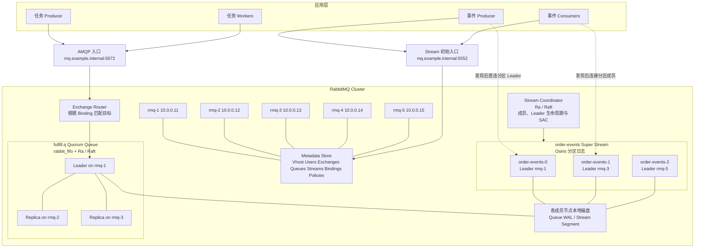
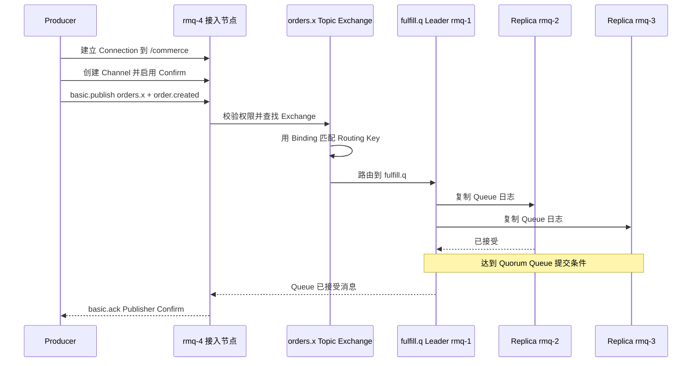
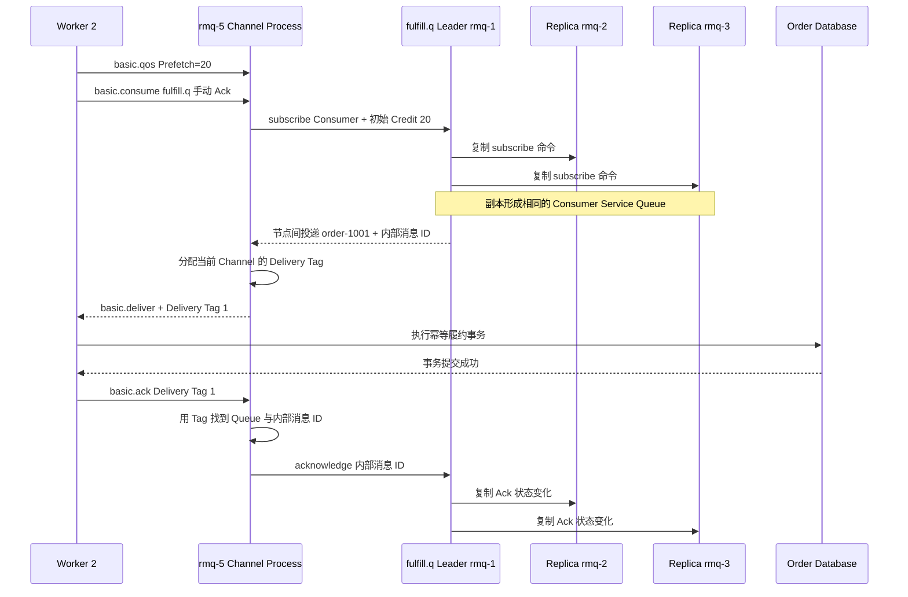
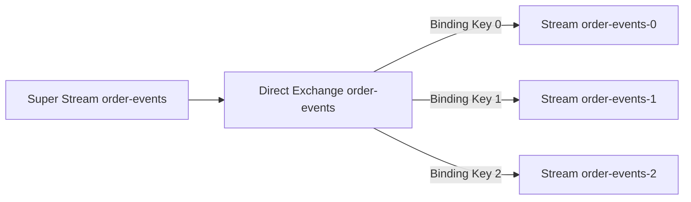
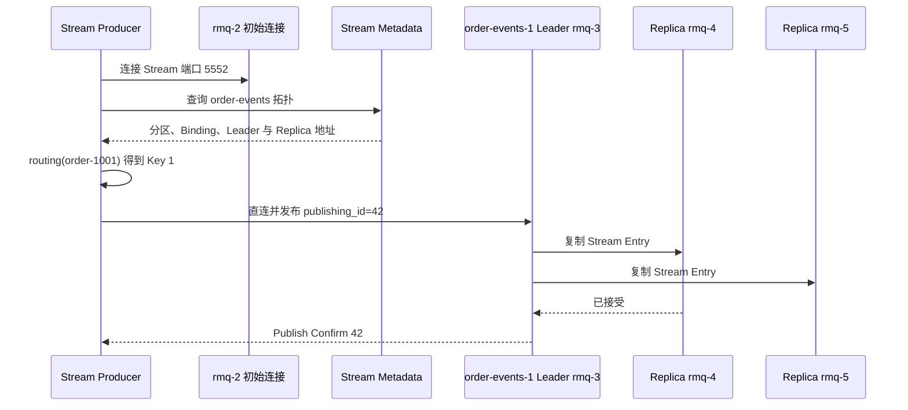
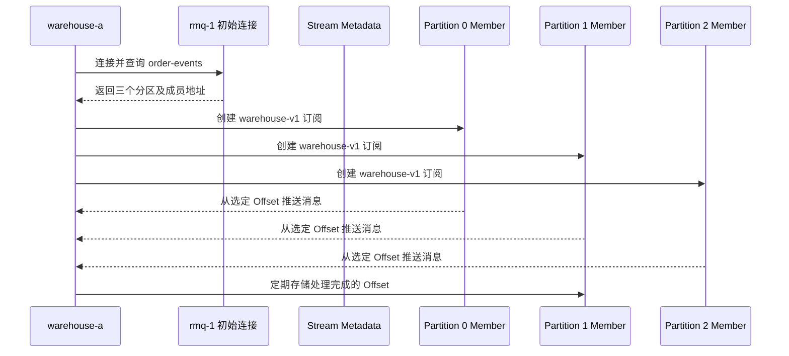
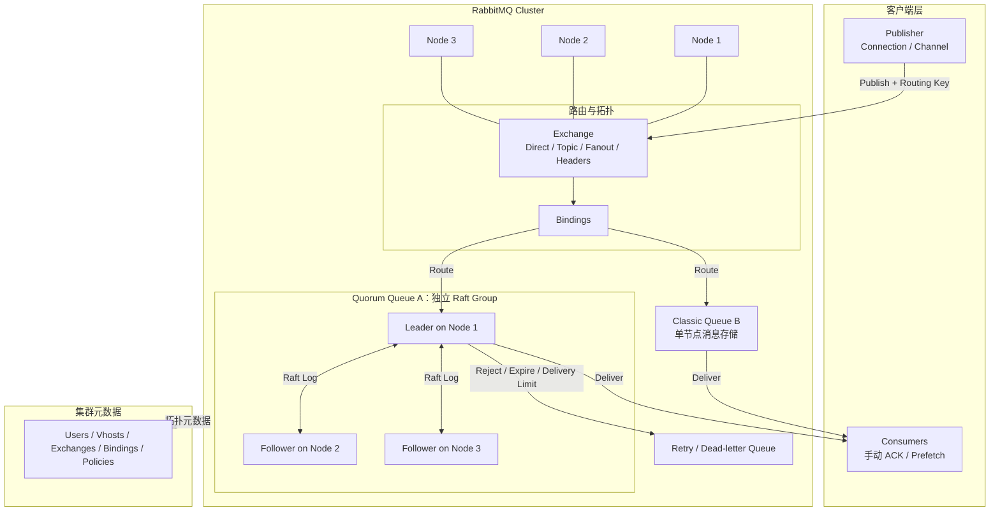

RabbitMQ 同时提供两类消息模型：

- **Queue**：一条消息最终交给一名 Consumer 完成，适合任务队列；
- **Stream**：消息按顺序追加并保留，多个消费者可以从各自位置反复读取，适合事件流。

二者共享 RabbitMQ 集群、用户、Virtual Host 和拓扑元数据，但生产、消费和存储语义并不相同。本文先用一套五节点环境和两个订单示例说明客户端到底连接谁、消息经过哪些组件，以及每个组件解决什么问题。复制提交和故障恢复分别放在 [Quorum Queue 实现篇](005_rabbitmq_queue_implementation.md) 与 [Stream 实现篇](006_rabbitmq_stream_implementation.md)。

<!-- more -->

## 1. 五节点生产部署

假设一个机房中有五台独立服务器：

| 节点 | 主机名 | IP | 主要职责 |
|---|---|---|---|
| Node 1 | `rmq-1` | `10.0.0.11` | RabbitMQ 节点；承载部分 Queue/Stream Leader 与副本 |
| Node 2 | `rmq-2` | `10.0.0.12` | RabbitMQ 节点；承载部分 Queue/Stream Leader 与副本 |
| Node 3 | `rmq-3` | `10.0.0.13` | RabbitMQ 节点；承载部分 Queue/Stream Leader 与副本 |
| Node 4 | `rmq-4` | `10.0.0.14` | RabbitMQ 节点；承载部分 Queue/Stream Leader 与副本 |
| Node 5 | `rmq-5` | `10.0.0.15` | RabbitMQ 节点；承载部分 Queue/Stream Leader 与副本 |

另有一个不计入 RabbitMQ 五节点的接入地址：

| 地址 | 用途 |
|---|---|
| `mq.example.internal:5672` | AMQP 0-9-1 入口，负载均衡到五个节点 |
| `mq.example.internal:5552` | Stream Protocol 的初始接入地址 |
| `rmq-1` 到 `rmq-5:5552` | Stream 客户端发现拓扑后访问具体 Leader/Replica |
| `10.0.0.11:15672` 等 | 管理 API/UI，仅开放给运维网络 |

生产者和消费者不应只配置一个 RabbitMQ 节点。AMQP 客户端至少配置多个地址或一个健康检查完善的负载均衡入口；Stream 客户端还必须能够解析并访问各节点对外公布的 `advertised_host` 和 `advertised_port`。

### 1.1 完整架构图



这张图要表达五件事：

1. **五个 RabbitMQ 节点组成一个集群**，任何节点都能接受客户端连接并查询拓扑；
2. **Metadata Store 保存定义，不保存消息正文**；RabbitMQ 4.x 可使用 Khepri，新旧升级集群也可能仍使用 Mnesia；
3. **Exchange 是路由器，不是消息仓库**；
4. **每条 Quorum Queue 和每个分区 Stream 都有自己的 Leader 与副本成员**，五节点不表示每条消息固定存五份；
5. **Stream 的每个分区拥有独立 Leader**，所以不同分区可以把负载摊到不同节点。

本例假设资源创建后形成以下数据副本布局：

| 数据对象 | Leader | Replica | Replica |
|---|---|---|---|
| `fulfill.q` | `rmq-1` | `rmq-2` | `rmq-3` |
| `order-events-0` | `rmq-1` | `rmq-2` | `rmq-3` |
| `order-events-1` | `rmq-3` | `rmq-4` | `rmq-5` |
| `order-events-2` | `rmq-5` | `rmq-1` | `rmq-2` |

它只是一个便于理解的布局。Leader 位置由 Leader Locator 和实际集群状态决定，副本成员也应通过管理 API/CLI 验证，不能仅凭“创建时连接了哪台节点”猜测。

### 1.2 Queue 与 Stream 分别使用什么组件复制

RabbitMQ 的 Quorum Queue 和 Stream 都依赖 Leader、Replica 和多数派，但不能因此认为它们使用完全相同的存储组件。

| 对象 | 负责业务状态的组件 | 负责复制或协调的组件 | 一致性协议 | 副本网络 |
|---|---|---|---|---|
| Quorum Queue | `rabbit_fifo` Queue 状态机 | `Ra` 库 | Raft | RabbitMQ 节点间 Erlang Distribution，通常为 `25672` |
| Stream 消息日志 | `Osiris` 追加日志 | Osiris Leader 与 Replica | Leader 驱动的多数派追加日志复制 | Stream Replication TCP，默认端口范围 `6000–6500` |
| Stream 控制状态 | Stream Coordinator | `Ra` 库 | Raft | RabbitMQ 节点间通信 |

客户端端口与副本协议也必须分开：

```text
AMQP 客户端      → 5672/5671 → RabbitMQ 接入节点
Stream 客户端    → 5552/5551 → RabbitMQ Stream Plugin
Queue Raft 副本  → 25672     → RabbitMQ 节点间 Erlang Distribution
Stream 数据副本  → 6000-6500 → Osiris Stream Replication
```

#### Quorum Queue：rabbit_fifo + Ra + Raft

`rabbit_fifo` 是 Queue 语义的状态机，理解“入队、Consumer 注册、分配消息、Ack、Reject、重新入队”等命令。`Ra` 是 RabbitMQ 团队实现的 Multi-Raft 库，负责 Leader 选举、日志复制、Commit Index、成员变更、Snapshot 和恢复。

以 `fulfill.q` 为例，它本身就是一个独立 Raft Group：

```text
fulfill.q 的 rabbit_fifo 命令
    enqueue order-1001
    subscribe worker-2 credit=20
    checkout order-1001 to worker-2
    acknowledge order-1001
              ↓
Ra Leader on rmq-1
              ↓ Raft 日志复制
Ra Followers on rmq-2 / rmq-3
```

多数派提交的不只有消息正文，还包括 Consumer、Credit、消息分配和 Ack 等 Queue 状态。这就是 Leader 切换后新 Leader 能判断哪些消息 Ready、哪些仍是 Unacked 的原因。

对三成员 Quorum Queue，一项状态变化需要得到多数成员认可才能成为已提交历史。Publisher Confirm 还要求消息在多数成员上写入并刷到磁盘。它不是“主节点先返回、Follower 后台慢慢追”的普通异步主从复制。

#### Stream：Osiris 数据日志 + Stream Coordinator

Stream 的消息数据面由 `Osiris` 实现。Osiris 面向不可变追加日志：一个 Stream 有一个 Writer Leader 和多个 Replica，Leader 负责追加，Replica 复制相同的日志 Chunk。消息复制到多数 Stream Replica 后，RabbitMQ 才向 Producer 发送 Publish Confirm。

```text
Producer
    ↓ Stream Protocol 5552
order-events-1 Osiris Leader on rmq-3
    ├── Stream Replication 6000-6500 → Replica on rmq-4
    └── Stream Replication 6000-6500 → Replica on rmq-5
                         ↓
                 多数派复制后 Confirm
```

Stream Coordinator 是控制面组件，负责创建/删除 Stream、成员布局、Leader 生命周期、Replica 操作以及 SAC 消费组协调。它自身建立在 `Ra` 上，使用 Raft 复制控制状态。

因此更准确的表达是：

- **Queue 数据和投递状态**由 `rabbit_fifo` 状态机通过 `Ra/Raft` 复制；
- **Stream 消息正文和 Offset Tracking Record**由 `Osiris` 日志复制；
- **Stream 成员与 SAC 协调状态**由 Stream Coordinator 通过 `Ra/Raft` 管理。

Stream 的确认强度还与 Quorum Queue 有一个重要区别：Stream 会先把数据写入磁盘文件，但默认依赖操作系统刷新 Page Cache，不为每次确认显式执行 `fsync`；Quorum Queue 的 Publisher Confirm 则以多数副本写入并刷盘为边界。二者都叫“多数派 Confirm”，不能推导出完全相同的断电持久性。

## 2. 集群启动后，各组件分别保存什么

在创建业务资源以前，五个节点已经组成 RabbitMQ Cluster。此时主要存在三类状态：

| 状态 | 例子 | 保存位置 | 是否包含消息正文 |
|---|---|---|---|
| 集群拓扑元数据 | 节点、Virtual Host、用户、权限、Policy | RabbitMQ Metadata Store，并在集群中复制 | 否 |
| 消息对象定义 | Exchange、Queue、Stream、Binding 及参数 | RabbitMQ Metadata Store | 否 |
| 消息与运行状态 | Queue 消息、投递状态、Stream Entry、Offset | 对应 Queue/Stream 的成员节点 | 是 |

连接和 Channel 则属于接入节点上的运行时状态。例如 Producer 的 TCP Connection 接到了 `rmq-4`，那么心跳、Channel、Publisher Confirm 序号首先由 `rmq-4` 上的连接进程维护。它不是一条需要复制到五个节点的持久业务资源。

## 3. 示例一：订单履约任务队列

需求如下：订单创建后交给任意一个履约 Worker 处理。Worker 成功处理后消息结束；Worker 崩溃时任务需要重新交给其他 Worker。

示例消息：

```json
{
  "event_id": "evt-20260907-0001",
  "event_type": "order.created",
  "order_id": "order-1001",
  "occurred_at": "2026-09-07T10:00:00+08:00"
}
```

### 3.1 初始化哪些资源

在 Virtual Host `/commerce` 中声明：

```yaml
vhost: /commerce

exchange:
  name: orders.x
  type: topic
  durable: true
  auto_delete: false

queue:
  name: fulfill.q
  durable: true
  exclusive: false
  auto_delete: false
  arguments:
    x-queue-type: quorum

binding:
  source: orders.x
  destination_type: queue
  destination: fulfill.q
  routing_key: order.created
  arguments: {}
```

这些声明可以由 IaC、Definitions Import、`rabbitmqadmin` 或应用启动代码完成。关键不是使用哪条命令，而是所有实例必须声明完全相同的属性；同名 Queue 已存在但类型或持久属性不同，RabbitMQ 会拒绝不等价声明，而不是偷偷修改它。

初始化顺序是：

1. 创建 `/commerce`，配置用户对该 Virtual Host 的 configure/write/read 权限；
2. 创建持久 Topic Exchange `orders.x`；
3. 创建持久 Quorum Queue `fulfill.q`；
4. 创建从 `orders.x` 到 `fulfill.q` 的 Binding；
5. Producer 打开 Publisher Confirm，Consumer 设置手动 Ack 与 Prefetch。

### 3.2 初始化后，元数据中有什么

Exchange、Binding、Queue 不保存相同的数据：

| 对象 | 保存的核心数据 | 它回答的问题 |
|---|---|---|
| Virtual Host | 名称 `/commerce`、权限与 Policy 作用域 | 这套资源属于哪个隔离命名空间 |
| Exchange | 名称 `orders.x`、类型 `topic`、durable、auto-delete、arguments | 使用哪种算法解释 Routing Key |
| Queue 定义 | 名称 `fulfill.q`、类型 `quorum`、durable、arguments | 目标是什么 Queue，采用什么 Queue 语义 |
| Queue 副本布局 | Leader `rmq-1`，成员 `rmq-1/2/3` | 真正由哪些节点保存和处理该 Queue |
| Binding | source、destination、destination type、binding key、arguments | 哪类消息应该进入哪个目标 |

本例 Binding 可以理解为一条路由表记录：

```yaml
vhost: /commerce
source_exchange: orders.x
destination_type: queue
destination: fulfill.q
binding_key: order.created
arguments: {}
```

Exchange 记录“我是一个 Topic 路由器”，Binding 记录“`order.created` 应进入 `fulfill.q`”。**Exchange 本身不会复制保存消息正文，Binding 也不会保存消费进度。**

### 3.3 Producer 生产消息的完整过程

假设负载均衡把 Producer 的连接分配到 `rmq-4`，但 `fulfill.q` Leader 位于 `rmq-1`。



逐步解释：

1. **连接接入节点**：Producer 连接 `mq.example.internal:5672`，负载均衡选中 `rmq-4`。握手时选择 `/commerce` 并完成认证；此时还没有发送业务消息。
2. **创建 Channel**：Producer 在 TCP Connection 内创建 Channel，并开启 Confirm。Channel 是轻量逻辑会话，不是消息存储节点。
3. **提交发布请求**：Producer 发送 Exchange=`orders.x`、Routing Key=`order.created`、消息属性和正文。持久任务还应设置持久消息属性。
4. **权限与 Exchange 查找**：`rmq-4` 检查 Producer 对 `orders.x` 的 write 权限，并从本地可见的集群元数据找到 Exchange 类型和 Binding。
5. **执行 Topic 匹配**：Topic Exchange 把 `order.created` 与 Binding Key 比较，得到目标集合 `{fulfill.q}`。
6. **转给 Queue Leader**：接入节点不是 Queue Leader，因此通过 RabbitMQ 节点间通信把入队操作交给 `rmq-1` 上的 Leader。
7. **Queue 接管消息**：Leader 追加 Queue 状态并复制给成员。达到 Quorum Queue 提交条件后，这条消息才算被该 Queue 接受。
8. **返回 Confirm**：Queue 的结果回到 `rmq-4`，再由原 Channel 向 Producer 返回 `basic.ack`。

如果一条消息匹配三条 Queue，接入节点会把消息分别交给三个目标。Publisher Confirm 要等所有匹配 Queue 接受；任何一条 Queue 的消费都不会推进另外两条 Queue。

如果没有 Binding 匹配：

- Exchange 不会把消息暂存在自身等待未来 Binding；
- 开启 `mandatory` 时，RabbitMQ 先向 Producer 返回不可路由消息，再发送 Confirm；
- 未开启 `mandatory` 或 Alternate Exchange 时，Producer 可能只看到发布已被 Exchange 处理，却没有业务 Queue 收到消息。

### 3.4 Consumer 消费消息的完整过程

假设三个 Worker 分别连接 `rmq-3`、`rmq-4`、`rmq-5`，都消费 `fulfill.q`，手动 Ack，Prefetch=20。

先回答最容易混淆的问题：**Worker 2 始终连接 `rmq-5`，不会在消费过程中改为直连 `rmq-1`。** `rmq-1` 是 Queue Leader，负责决定消息交给谁；`rmq-5` 持有 Worker 2 的 TCP Connection 和 Channel，负责把 AMQP Delivery 真正写给 Worker。

本例中 `fulfill.q` 的成员只有 `rmq-1/2/3`，`rmq-5` 不是副本。因此 `order-1001` 的实际路径是：

```text
fulfill.q Leader on rmq-1
        ↓ RabbitMQ 节点间通信
AMQP Channel process on rmq-5
        ↓ Worker 2 已建立的 TCP Connection
Worker 2
```

可以把 `rmq-5` 理解为这条消费连接的接入节点，但它不是另一个独立部署的 Proxy 服务，也不会把 `fulfill.q` 的消息复制一份到本地磁盘后再消费。



逐步解释：

1. **建立连接**：Worker 2 与 `rmq-5` 建立 TCP Connection，并在 Connection 中创建 AMQP Channel。后面的 `basic.consume`、Delivery 和 Ack 始终使用这个 Channel。
2. **设置 Prefetch**：Worker 在 Channel 上执行 `basic.qos(20)`。RabbitMQ 默认把这个值作为随后创建的每个 Consumer 的独立未确认消息上限。
3. **订阅 Queue**：Worker 发送 `basic.consume fulfill.q`。Consumer 订阅的是 Queue，不是 Exchange；Exchange 只参与生产消息的路由。
4. **复制 Consumer 注册**：`rmq-5` 的 Channel Process 把 Subscribe 命令交给 `fulfill.q` Leader。Quorum Queue 把 Consumer 信息作为运行时 Queue 状态写入 Raft 日志，使三个副本建立相同的 Consumer Service Queue。
5. **选择 Consumer**：副本按相同的 Queue 状态和 Consumer 顺序确定 `order-1001` 应由 Worker 2 处理，并把它从 Ready 变成已分配、等待确认的消息。
6. **跨节点投递**：由于 `rmq-5` 不是这条 Queue 的副本，Leader `rmq-1` 把消息经 RabbitMQ 节点间通信发给 `rmq-5` 的 Channel Process。
7. **生成 Delivery Tag**：Channel Process 为这次投递分配当前 Channel 内递增的 Delivery Tag，例如 `1`，记录 Tag 到 Queue 内部消息 ID 的映射，再通过已有 TCP Connection 发给 Worker。
8. **执行业务**：Worker 以 `event_id` 或 `order_id + 状态` 做幂等，并提交本地数据库事务。
9. **解析 Ack**：Worker 在同一 Channel 上发送 `basic.ack(1)`。`rmq-5` 的 Channel Process 用 Tag `1` 找到 `fulfill.q` 和内部消息 ID，再向 Quorum Queue 提交 Ack 命令。
10. **结束消息状态**：Ack 成为 Quorum Queue 已提交的状态变化后，消息不再属于 Unacked，Consumer Credit 得以恢复，Queue 可以继续投递。

### 3.4.1 Consumer 与 Prefetch 信息保存在哪里

它们不是只保存在一个组件中，而是被拆成“接入节点的协议状态”和“Quorum Queue 的复制状态”两部分：

| 位置 | 保存内容 | 是否持久拓扑元数据 | 节点故障后的作用 |
|---|---|---|---|
| `rmq-5` Connection Process | TCP Socket、认证用户、Virtual Host、心跳、打开的 Channel | 否 | `rmq-5` 故障后连接消失，客户端必须重连 |
| `rmq-5` Channel Process | Channel 编号、Consumer Tag 映射、Queue 名、Ack 模式、Prefetch/Limiter、下一个 Delivery Tag、待 Ack 映射 | 否 | Channel 关闭时这些协议状态消失 |
| `fulfill.q` Raft 状态机 | Consumer 标识、Channel Process 所在节点、Ack 模式、Credit/Prefetch、Consumer 参数和优先级，以及 Consumer 的消息分配状态 | 否，它是复制的 Queue 运行状态 | Leader 切换后，新 Leader 仍知道存活 Consumer 和消息分配情况 |
| RabbitMQ Metadata Store | `fulfill.q` 的名字、类型、参数、所在 Virtual Host 等资源定义 | 是 | 让所有节点仍能解析这条 Queue；不保存每次 Delivery Tag |

因此原文“把 Consumer、Channel 和 Prefetch 信息注册到 Queue”不够准确。更准确的说法是：

- 完整 Channel 状态留在 `rmq-5` 的 Channel Process；
- Quorum Queue 复制的是完成确定性投递所需的 Consumer 身份、位置、Ack/Credit 等状态；
- Metadata Store 只保存 Queue 定义，不保存这次临时订阅。

Quorum Queue 的 Service Queue 可以理解成一张复制的候选消费者表，例如：

| Consumer | Channel Process | 所在节点 | Ack 模式 | 可用 Credit |
|---|---|---|---|---:|
| `worker-1` | `ch-pid-A` | `rmq-3` | manual | 20 |
| `worker-2` | `ch-pid-B` | `rmq-5` | manual | 20 |
| `worker-3` | `ch-pid-C` | `rmq-4` | manual | 20 |

这里的 `ch-pid-B` 是 RabbitMQ 内部对 Channel Process 的标识，不是客户端可持久保存的业务 ID。Consumer 取消、Channel 关闭或节点故障时，对应 Consumer 会从 Queue 运行状态中移除，其尚未确认的消息重新变为可投递状态。

### 3.4.2 Unacked 与 Delivery Tag 分别保存在哪里

“Unacked”也不是一个单独文件或一张全局表，而是两个层次的状态：

```text
Quorum Queue 复制状态：
    内部消息 M1001 已分配给 consumer worker-2，尚未确认

rmq-5 Channel 本地状态：
    Delivery Tag 1 → {consumer worker-2, queue fulfill.q, msg_id M1001}
```

两部分各自解决不同问题：

| 状态 | 保存组件 | 保存的含义 | 是否复制 |
|---|---|---|---|
| Queue Unacked / Checked-out 状态 | `fulfill.q` 的 Raft 状态机 | 哪条内部消息交给了哪个 Consumer、是否已经 Ack、投递次数等 | 是，随 Queue 状态复制到成员 |
| Pending Ack 映射 | `rmq-5` 的 Channel Process | Delivery Tag、Consumer Tag、Queue 名、内部消息 ID、投递时间 | 否，只属于这个 Channel |
| `next_tag` | `rmq-5` 的 Channel Process | 下一次投递使用的 Channel 内递增序号 | 否 |

Delivery Tag **不是消息 ID**：

- 它从 Channel 的 `next_tag` 递增产生；
- 只在当前 Channel 内唯一；
- Consumer 必须在收到消息的同一 Channel 上 Ack；
- 换一个 Channel 后可以再次出现 Delivery Tag `1`；
- Queue 副本使用自己的内部消息标识维护消息状态，不依赖 Delivery Tag 作为全局 ID。

当 Worker 发送 `basic.ack(delivery_tag=1)` 时，Channel Process 先把协议层 Tag 翻译成 Queue 能理解的内部消息 ID，再把 Ack 交给 Queue。若 Worker 在另一个 Channel 上 Ack `1`，那个 Channel 没有对应 Pending Ack 记录，RabbitMQ 会报 `unknown delivery tag` 并关闭 Channel。

### 3.4.3 如果 Worker 连接的是副本节点

假设 Worker 2 改为连接 `rmq-2`，而 `rmq-2` 是 `fulfill.q` 的 Follower。Quorum Queue 可以进行本地投递：

1. Subscribe、Enqueue、Ack 等命令仍先经 Leader 排序并写入 Raft 日志；
2. 三个副本按相同顺序应用命令，因此都知道消息应该交给哪个 Consumer；
3. `rmq-2` 发现目标 Channel 就在本机，于是由本地副本把消息交给本地 Channel；
4. Worker 仍然只看到自己与 `rmq-2` 的那条 Connection。

这项优化避免消息必须从 Leader 再绕到 Consumer 的接入节点，但没有让 Follower 独立决定 Queue 顺序。若 Consumer 所在节点不是 Queue 成员，就回到本例的路径：由 Leader 把消息转给远端 Channel。

### 3.4.4 故障时这些状态如何配合

- **Worker 或 Channel 断开**：本地 Pending Ack 映射消失；Queue 收到 Consumer Down 后，把该 Consumer 持有的消息重新投递。
- **`rmq-5` 故障**：Worker 的 TCP Connection 和 Channel 一起消失，客户端需要重连；Queue 的复制状态仍在 `rmq-1/2/3`，未 Ack 消息不会被当成已完成。
- **Queue Leader `rmq-1` 故障**：投递短暂停顿。新 Leader 根据已复制的 Queue 状态继续；连接在其他健康节点上的 Consumer 可以由 RabbitMQ 重新注册到新 Leader。
- **业务成功但 Ack 丢失**：Queue 仍可能把消息重新投递，因此 Worker 的数据库操作必须幂等。

RabbitMQ Queue 没有 Kafka 式 Consumer Group 名字。同一 Queue 上的 Consumer 天然竞争；若库存和审计都必须各处理一次，应创建 `inventory.q` 与 `audit.q` 两条 Queue，并分别绑定到 Exchange。

## 4. 示例二：订单事件 Super Stream

需求如下：保存订单事件 7 天，仓储和分析都能独立读取；吞吐超过单个 Stream 后，按订单 ID 分到三个分区，同一订单保持分区内顺序。

### 4.1 初始化 Stream 服务和 Super Stream

五个节点都启用 Stream Plugin，并让业务网络可访问各节点的 Stream 端口：

```text
rmq-1.example.internal:5552 → 10.0.0.11
rmq-2.example.internal:5552 → 10.0.0.12
rmq-3.example.internal:5552 → 10.0.0.13
rmq-4.example.internal:5552 → 10.0.0.14
rmq-5.example.internal:5552 → 10.0.0.15
```

每个节点返回的 `advertised_host` 必须是客户端能够解析和连接的地址。Stream 客户端先通过一个初始地址接入，之后会根据 Metadata 查询结果连接具体节点。

等价的 Super Stream 创建命令为：

```bash
rabbitmq-streams add_super_stream order-events \
  --vhost /commerce \
  --partitions 3 \
  --binding-keys 0,1,2 \
  --initial-cluster-size 3 \
  --leader-locator balanced
```

还应为三个分区 Stream 配置保留策略，例如 `x-max-age=7D` 或容量上限。Super Stream 不是一个新的物理文件，它是以下 AMQP 拓扑的逻辑封装：



### 4.2 初始化后，各组件保存什么

| 对象 | 保存的核心数据 | 保存在哪里 |
|---|---|---|
| Super Stream 的 Exchange | 名称 `order-events`、类型 `direct`、durable | RabbitMQ Metadata Store |
| 三条 Binding | `0 → order-events-0`、`1 → order-events-1`、`2 → order-events-2` | RabbitMQ Metadata Store |
| 分区 Stream 定义 | 名称、`x-queue-type=stream`、保留参数 | RabbitMQ Metadata Store |
| 分区副本布局 | 每个分区的 Leader、Replica 节点和可访问地址 | Stream 拓扑/集群状态，可由客户端查询 |
| Stream 消息 | 顺序追加的消息、发布 ID 等 | 对应分区的 Leader 与副本磁盘 |
| Stored Offset | Consumer 主动存储的读取位置 | 作为非消息数据持久化在对应 Stream 中 |
| SAC 活动关系 | 某个 Consumer Name 在该分区上的活动实例 | 由 RabbitMQ 协调的运行状态 |

需要特别区分两种“元数据”：

- RabbitMQ Metadata Store 中的拓扑定义说明“有哪些 Exchange、Binding 和 Stream”；
- Stream Protocol 的 Metadata 查询结果说明“当前每个 Stream 的 Leader/Replica 在哪台节点、应该连接哪个地址”。

### 4.3 Producer 生产事件的完整过程

假设订单 `order-1001` 经稳定哈希得到分区路由键 `1`，因此目标是 `order-events-1`，其 Leader 位于 `rmq-3`。



逐步解释：

1. **初始接入**：Producer 用 `mq.example.internal:5552` 或地址列表建立 Stream 连接。这个节点只是发现入口，不一定承载目标分区。
2. **查询 Super Stream 拓扑**：客户端库查询 `order-events`，得到分区 Stream、Binding Key、各分区 Leader/Replica 的主机与端口。
3. **选择分区**：应用提供路由函数，从消息取出 `order_id`；客户端根据稳定哈希/路由策略得到 Binding Key `1`，映射到 `order-events-1`。
4. **连接 Leader**：客户端连接 `rmq-3.example.internal:5552`。若已经有到该节点的连接，可复用。
5. **追加消息**：Producer 带 Producer Name 和递增 Publishing ID 发布，分区 Leader 把消息追加到日志并复制。
6. **收到确认**：Leader 达到 Stream 的确认条件后返回 Publishing ID 42 的 Confirm。超时仍然表示结果未知，稳定 Producer Name 与 Publishing ID 可用于去重。

这里最容易误解的一点是：**使用原生 Stream 客户端发布 Super Stream 时，Exchange 与 Binding 用来描述分区拓扑，客户端据此选择分区；消息数据直接发往分区 Stream Leader，不先经过 Exchange 进程做一次服务器端转发。**

如果使用 AMQP 0-9-1 把普通 Stream 当 Queue 使用，则仍可以向 Exchange 发布，由 RabbitMQ 按 Binding 路由；但 Super Stream、SAC 和拓扑感知等完整能力应以原生 Stream 客户端为主。

### 4.4 Consumer 消费事件的完整过程

仓储服务部署两个实例 `warehouse-a`、`warehouse-b`，都使用 Consumer Name `warehouse-v1` 并启用 SAC；分析服务使用另一个名字 `analytics-v1`。两套名字代表两份独立处理进度。



逐步解释：

1. **查询分区**：Consumer 先连接任一 Stream 节点，查询 Super Stream 的三个分区及其 Leader/Replica。
2. **建立复合 Consumer**：客户端库在应用看来创建一个 Super Stream Consumer，内部实际为三个分区分别建立订阅连接；消费可以连接承载副本的节点分散读取压力。
3. **确定起点**：每个分区分别选择 `first`、`last`、绝对 Offset、时间戳或已存储 Offset。Super Stream 没有一个覆盖所有分区的全局 Offset。
4. **SAC 协调**：`warehouse-a` 与 `warehouse-b` 使用相同 Consumer Name。RabbitMQ 对每个分区只激活其中一个实例；三个分区可以分别分配给不同实例。
5. **投递与 Credit**：Stream 按 Credit 向活动 Consumer 推送消息，Credit 控制在途数量和背压。
6. **处理与存 Offset**：应用处理成功后定期存储各分区 Offset。Stored Offset 是恢复位置，不会删除消息。
7. **实例故障**：某个活动实例断开后，同名组中的另一个实例可以接手相应分区，从已保存位置继续，因此最后一次保存之后的消息可能再次处理。

分析服务 `analytics-v1` 使用另一 Consumer Name，会独立读取相同的三条分区日志。仓储保存 Offset 不会推进分析服务的位置；消息最终何时删除由 Stream 保留策略决定，而不是由某个 Consumer Ack 决定。

### 4.4.1 Stream Consumer 的状态保存在哪里

Stream Consumer 的“状态”不是一个值，而是三种生命周期完全不同的数据：

```text
当前连接怎么投递       → Stream Connection / Subscription 的内存状态
故障后从哪里继续       → Stream 中的 Stored Offset Tracking Record
SAC 哪个实例处于活动状态 → Stream Coordinator 的复制状态
```

| 状态类型 | 保存组件 | 具体保存内容 | 是否持久/复制 | 失效后的结果 |
|---|---|---|---|---|
| Connection | Consumer 所连接节点的 Stream Connection Process | TCP 连接、认证、Virtual Host、客户端属性 | 仅内存，不复制 | 节点或连接故障后客户端重连 |
| Subscription | 该连接上的 Stream Subscription | Subscription ID、目标 Stream、当前发送位置、Credit、过滤条件、Consumer Name 等 | 仅内存，不复制 | 重连后重新创建 Subscription |
| Consumer 当前处理位置 | 客户端进程 | 最后收到、正在处理、已经处理但尚未存储的 Offset | 通常仅在应用内存 | 崩溃后可能从旧 Stored Offset 重复处理 |
| Stored Offset | 目标 Stream 的 Osiris 日志 | `{consumer_name, stream, offset}` 对应的 Tracking Record | 作为非消息记录随 Stream 数据复制 | 重连后可以查询并从该位置继续 |
| SAC Group | Stream Coordinator | Stream、Consumer Name、成员 Subscription、活动/待命关系 | Coordinator 使用 Ra/Raft 复制协调状态 | 活动实例消失后选择待命实例 |

#### 临时 Subscription 状态

假设 `warehouse-a` 连接 `rmq-2` 上的 `order-events-0` Replica，建立 Subscription ID `3`：

```yaml
connection_node: rmq-2
subscription_id: 3
stream: order-events-0
consumer_name: warehouse-v1
next_delivery_offset: 8451
available_credit: 100
single_active_consumer: true
state: active
```

这份数据服务于当前网络投递，保存在 `rmq-2` 的 Stream Connection/Subscription 运行时进程中。Subscription ID 只需在当前 Connection 内区分订阅；连接断开后，它不会作为持久消费进度留下来。

#### Stored Offset

应用处理完 Offset `8450` 后，可以调用 Stream 客户端的 Offset Tracking API。Broker 把 Consumer Name 和 Offset 编码成 Tracking Record，追加到 `order-events-0` 本身：

```yaml
record_type: offset_tracking
consumer_name: warehouse-v1
stream: order-events-0
offset: 8450
```

它不是业务消息，但和 Stream 数据一起保存在 Osiris 日志并复制到 Stream Replica。Super Stream 有三个分区，所以会有三份独立位置：

```text
warehouse-v1 / order-events-0 → 8450
warehouse-v1 / order-events-1 → 9217
warehouse-v1 / order-events-2 → 8031
```

Stored Offset 只有在应用主动存储时才前进。应用可能每处理 100 条或每隔数秒存一次，所以“内存中已经处理到 8499，但持久位置仍是 8450”是正常情况。此时进程崩溃，接管者从 8450 附近恢复，后面的消息可能重复处理。

Stored Offset 也不会阻止 Retention 删除旧 Segment。如果 Consumer 停太久，已保存位置早于 Stream 当前最早 Offset，恢复时只能从仍然存在的最早数据开始。

#### SAC Group 状态

`warehouse-a` 与 `warehouse-b` 在同一分区上使用相同 Consumer Name `warehouse-v1`，Stream Coordinator 把它们视为同一个 SAC Group：

```yaml
group_key:
  vhost: /commerce
  stream: order-events-0
  consumer_name: warehouse-v1
members:
  - connection: warehouse-a@rmq-2
    subscription_id: 3
    state: active
  - connection: warehouse-b@rmq-3
    subscription_id: 1
    state: inactive
```

这份协调状态回答“现在由谁收消息”，Stored Offset 回答“下一个实例应该从哪里继续”。两者不能互相替代：

- 只有 SAC、没有 Stored Offset：能选出新活动实例，但恢复位置仍需应用指定；
- 只有 Stored Offset、没有 SAC：多个实例都可能从相同位置并行读取并重复处理；
- 二者都有：一个实例活动，故障后另一个实例从已保存位置接手，但最后一次存储后的消息仍可能重复。

#### Stream 没有 Queue 式 Unacked 集合

Queue 把消息从 Ready 变成 Unacked，Ack 后将其移除；Stream 不采用这种破坏性消费模型。Stream 中的消息始终按 Retention 保存，Credit 只是限制 Broker 当前可以推送多少数据，Stored Offset 只是恢复书签。

因此不要把 Stream 的三个值混为一谈：

```text
Credit         = 现在还能向这个 Subscription 推送多少
Delivery Offset = 当前投递的是日志中的哪一条
Stored Offset   = 故障恢复时可查询的持久书签
```

### 4.5 顺序保证到哪里

假设以下事件都以 `order-1001` 为路由键：

```text
OrderCreated → OrderPaid → OrderShipped
```

稳定路由会把它们写入同一分区，Stream 保留该分区中的追加顺序。SAC 又让同一 Consumer Name 对这个分区同一时刻只有一个活动消费者，因此可以维持分区内串行交付。

但它不保证：

- `order-1001` 与 `order-2002` 位于不同分区时的全局顺序；
- Consumer 使用线程池并发处理后的业务完成顺序；
- 失败重试与外部数据库提交天然精确一次。

## 5. 从示例反推核心抽象

示例帮助我们看清消息经过了谁，但选型最终依赖的是这些组件向应用暴露了什么抽象。RabbitMQ 的核心抽象可以分成四层：

```text
连接层：Connection → Channel
路由层：Virtual Host → Exchange → Binding
消息层：Queue / Stream / Super Stream
消费层：Consumer → Ack 或 Stored Offset → SAC
```

| 抽象 | 第一性原理 | 在示例中的作用 | 不保证什么 |
|---|---|---|---|
| Node | RabbitMQ 运行实例 | 接受连接、承载元数据和数据副本 | 连接到它不代表目标数据 Leader 就在本机 |
| Virtual Host | 资源与权限命名空间 | 隔离 `/commerce` 的 Exchange、Queue、Stream | 不是 CPU、磁盘的物理隔离 |
| Connection | 客户端到某节点的 TCP 长连接 | 承载认证、心跳与 Channel | TCP 写成功不等于消息提交 |
| Channel | Connection 内的逻辑会话 | 发布、Confirm、Consume、Ack | 不是跨数据库事务 |
| Exchange | 命名路由表 | 解释任务消息的 Routing Key | 不保存消息正文 |
| Binding | Source 到 Destination 的规则 | 把 `order.created` 路由到 `fulfill.q` | 不保存消费进度 |
| Queue | 一份待办集合 | 三个 Worker 竞争处理一条任务 | 多 Consumer 不代表广播 |
| Quorum Queue | 有复制能力的 Queue | 节点故障时保留任务队列 | 不会自动横向分区 |
| Stream | 可保留的追加日志 | 保存一个分区的订单历史 | 消费后不会自动删除 |
| Super Stream | 多个 Stream 的逻辑集合 | 三分区扩展事件吞吐 | 不提供跨分区全局顺序 |
| Consumer Name + SAC | Stream 的分区消费协调身份 | 同组每分区选一个活动实例 | 不让整个 Super Stream 只剩一个消费者 |
| Publisher Confirm | Broker 对发布结果的确认 | 告诉 Producer RabbitMQ 已按目标类型接管消息 | 不代表 Consumer 已完成业务 |
| Consumer Ack / Stored Offset | Queue 完成确认 / Stream 恢复位置 | 分别推进任务状态和读取位置 | 不自动与业务数据库形成原子事务 |

### 5.1 Connection：客户端连接的是节点，不是 Queue

Connection 是客户端与某个 RabbitMQ 节点之间的 TCP 长连接，主要承载：

- 用户认证与 Virtual Host 选择；
- 心跳和连接故障检测；
- 一个或多个 Channel；
- 客户端与接入节点之间的网络流量。

Producer 连接 `rmq-4`，不表示 `fulfill.q` 存在 `rmq-4`。`rmq-4` 可以根据集群拓扑把请求转给 `rmq-1` 上的 Queue Leader。Connection 断开也不表示持久 Queue 被删除；只有 Exclusive Queue 等资源会与连接生命周期绑定。

Connection 提供的是**到集群某个入口的会话**，不是“消息已经安全”的证明。

### 5.2 Channel：一条 TCP 连接内的逻辑会话

创建大量 TCP Connection 成本较高，所以 RabbitMQ 在 Connection 内复用多个 Channel。发布、消费、事务、Confirm 和 Delivery Tag 都通过 Channel 工作。

Channel 提供：

- 低成本的逻辑并发；
- Publisher Confirm 序号范围；
- Consumer Delivery Tag 和 Ack 范围；
- AMQP 操作的协议上下文。

它不是业务数据库的事务边界。即使 AMQP Channel 使用事务模式，也无法自动把 MySQL 更新和 RabbitMQ 发布合成一个原子事务。

### 5.3 Virtual Host：拓扑和权限的命名空间

Virtual Host 把 Exchange、Queue、Binding、用户权限和 Policy 放进一个逻辑命名空间。`/commerce/orders.x` 与另一个 Virtual Host 中的 `orders.x` 是两个不同资源。

Virtual Host 主要解决：

- 不同系统出现同名 Queue 时的名称隔离；
- configure、write、read 权限隔离；
- Policy 和 Operator Policy 的作用范围；
- 运维管理时的资源归属。

它不提供物理资源隔离。两个 Virtual Host 仍可能共享同一节点的 CPU、内存、磁盘和网络，因此强多租户还需要节点、集群或基础设施层面的隔离。

### 5.4 Exchange：一张有名字的路由表

Exchange 的价值是让 Producer 不必知道所有下游 Queue。Producer 只表达：

```text
把这条消息发布到 orders.x，分类是 order.created
```

Exchange 再根据自己的类型和 Binding 算出目标集合：

```text
orders.x + order.created → {fulfill.q, audit.q, metrics.q}
```

Exchange 提供的是**一次发布到零个、一个或多个目标的路由语义**。它不保存消息正文，不维护 Consumer，也不会保存未匹配消息等待将来出现 Binding。

四种基础 Exchange 的差别只是“如何解释路由条件”：

| Exchange 类型 | 匹配方式 | 示例 | 适用场景 |
|---|---|---|---|
| Direct | Binding Key 与 Routing Key 完全相等 | `order.created` | 精确任务分类 |
| Topic | 按 `.` 分段，支持 `*` 和 `#` | `order.*`、`order.#` | 领域事件分类 |
| Fanout | 忽略 Routing Key，匹配所有 Binding | 所有绑定 Queue 都收到 | 简单广播 |
| Headers | 按消息 Header 的键值组合匹配 | `region=cn`、`tier=vip` | 多字段组合路由 |

`*` 只匹配一个单词，`#` 匹配零到多个单词。例如 `order.*.cn` 能匹配 `order.created.cn`，但不能匹配 `order.created.vip.cn`。

### 5.5 Binding：Exchange 到目标的路由规则

Binding 不是一根网络连接，而是一条保存在 Metadata Store 中的拓扑记录。它至少描述：

```text
Source Exchange
    + Destination Name
    + Destination Type
    + Binding Key
    + Arguments
```

目标可以是 Queue、Stream，也可以是另一个 Exchange。一次发布匹配多条 Binding 时，消息进入多条目标 Queue；之后每条 Queue 独立保存、投递和确认。

Routing Key 与 Binding Key 的区别是：

| 名称 | 谁提供 | 生命周期 |
|---|---|---|
| Routing Key | Producer 每次发布时提供 | 属于本次发布请求 |
| Binding Key | 初始化拓扑时声明 | 作为 Binding 元数据长期存在 |

### 5.6 Queue：一份需要被完成的待办集合

Queue 保存消息以及消息当前处于 Ready 还是 Unacked 等投递状态。同一 Queue 上多个 Consumer 的语义是竞争：一条消息的一次投递只选择其中一个 Consumer。

Queue 抽象提供：

- 消息积压；
- 竞争消费；
- 手动 Ack、Nack 和重新入队；
- Prefetch 和消费者背压；
- TTL、死信、优先级等任务生命周期控制。

Queue 不提供广播。库存和审计都需要处理同一事件时，应创建两条 Queue 并分别 Binding，而不是把两个服务都连到一条 Queue。

### 5.7 Quorum Queue：复制实现与 Queue 语义的组合

Quorum Queue 对应用仍然表现为一条 Queue：Producer 不直接选择副本，Consumer 也不从每个副本各读一份。Leader 统一处理入队、投递和确认状态，Follower 用于复制和故障接管。

它增加的是**节点故障下的 Queue 可恢复性**，没有改变这些基本语义：

- 同一 Queue 仍是一个逻辑消息集合；
- 同一消息仍由一个竞争 Consumer 处理；
- 一条 Quorum Queue 不会自动拆成多个吞吐分区；
- 多数派不可用时，应停止承诺新的可靠写入。

Raft 日志、提交点和 Leader 故障场景属于实现层，放在 [Queue 实现篇](005_rabbitmq_queue_implementation.md)。

### 5.8 Consumer：Queue 上的任务处理者

Consumer 是 Channel 上的运行时订阅。它保存 Consumer Tag、订阅参数、Ack 模式和 Prefetch 等状态。它不是像 Kafka Consumer Group 那样的持久业务对象。

Consumer 从 Queue 收到消息，只说明 RabbitMQ 把处理机会暂时交给了它。只有业务操作完成并发送 Ack，责任才从 RabbitMQ 转移给 Consumer。

因此 Queue 消费的正确时间线通常是：

```text
Deliver → 执行业务事务 → 事务提交 → Ack
```

如果业务提交后、Ack 前进程崩溃，消息会重新投递，所以必须使用业务消息 ID、唯一键或状态机实现幂等。

### 5.9 Stream：可以反复读取的追加日志

Stream 与 Queue 都能作为 RabbitMQ 中被声明和绑定的对象，但它们的消息生命周期完全不同：

| 对比项 | Queue | Stream |
|---|---|---|
| 核心目标 | 尽快完成待办任务 | 保存一段可读取历史 |
| 消费后 | Ack 后消息通常离开 Queue | 消息仍保留到触发保留策略 |
| 消费状态 | Ready / Unacked / Ack | 每个消费者自己的 Offset |
| 多消费者 | 同一 Queue 上竞争 | 可以独立读取同一份日志 |
| 重读历史 | 不是主要模型 | 可以从 Offset 或时间位置重读 |

Stream 提供的是**非破坏性消费**：一个消费者读过消息，不会替另一个消费者推进位置，也不会直接删除消息。

### 5.10 Super Stream：由多个 Stream 组成的分区抽象

Super Stream 不是一种新的消息文件，而是以下三种已有抽象的组合：

```text
一个 Direct Exchange
    + 多个普通 Stream
    + Exchange 到各 Stream 的 Binding
```

客户端将业务 Key 稳定映射到其中一个分区 Stream，由此同时获得：

- 多分区并行生产和消费；
- 不同分区 Leader 分散到多个节点；
- 同一 Key 稳定进入同一分区时的分区内顺序。

代价是不存在跨分区全局顺序、全局 Offset 或跨分区原子提交。增加分区还可能改变 Key 映射，需要提前设计迁移策略。

### 5.11 Stored Offset：读取位置，不是删除确认

Stream Consumer 可以选择从开头、末尾、绝对 Offset、时间戳或已保存位置开始读取。Stored Offset 表达：

```text
Consumer warehouse-v1 已处理到 order-events-1 的位置 8450
```

它不表示位置 8450 之前的消息可以立即物理删除，也不替其他 Consumer 保存进度。每个 Super Stream 分区都有自己的 Offset，没有一个覆盖三个分区的全局位置。

### 5.12 SAC：消费活动实例的协调语义

SAC 是 Single Active Consumer。多个 Stream Consumer 使用相同名字并启用 SAC 时，RabbitMQ 对**每个 Stream 分区**只激活一个实例，其他实例待命。

它提供两个语义：

1. 同一分区同一时刻由一个实例接收消息，容易维持串行处理；
2. 活动实例故障后，同名的待命实例可以接管。

在三分区 Super Stream 中，SAC 不是让整个服务只剩一个活动进程。RabbitMQ 可以把三个分区分别交给不同实例，从而同时获得分区内串行和分区间并行。

### 5.13 两次确认：Publisher Confirm 与 Consumer Ack

这是 RabbitMQ 最重要的两个责任边界：

```text
Publisher ── Publisher Confirm ──> RabbitMQ 已接管发布责任
RabbitMQ  ── Consumer Ack      ──> Consumer 已完成处理责任
```

Publisher Confirm 回答“Broker 是否按目标 Queue/Stream 的规则接受了消息”，Consumer Ack 回答“Consumer 是否完成了这次 Queue 投递”。二者互不替代：

- Producer 收到 Confirm 时，Consumer 可能尚未收到消息；
- Consumer Ack 不会反馈给最初的 Producer；
- 两个确认都无法自动与应用数据库组成原子事务；
- Confirm 或 Ack 响应丢失时，客户端都可能遇到结果未知和重复处理。

因此端到端可靠性最终是：Publisher 重试与去重、Broker 的存储保证、Consumer 至少一次处理、业务幂等共同组成，而不是由某一个 Ack 单独提供。

## 6. 两个示例的连接路径对照

| 场景 | 第一次连接谁 | 内部查询或请求谁 | 最终生产写给谁 | 最终消费从谁读 |
|---|---|---|---|---|
| Quorum Queue | 任一 AMQP 节点或负载均衡 | 接入节点查询 Exchange、Binding、Queue Leader | `fulfill.q` Leader | Queue Leader 经接入节点投递 |
| Super Stream | 任一 Stream 节点或初始入口 | 客户端查询分区与 Leader/Replica Metadata | 目标分区 Stream Leader | 各分区 Leader/Replica |

最核心的区别是：

```text
Queue：Producer → 接入节点 → Exchange 路由 → Queue Leader
Stream：Producer → 初始节点查询拓扑 → 客户端选分区 → Partition Leader
```

## 7. 第一篇应该得到的选型结论

选择 RabbitMQ Queue，是选择“路由后的待办任务”：复杂路由、竞争消费、逐条 Ack、重投、TTL、优先级和死信是主要价值。

选择 RabbitMQ Stream，是选择“RabbitMQ 集群内的保留日志”：多个消费者独立读取、Offset、回放和大积压是主要价值；吞吐需要扩展时再使用 Super Stream 分区。

不要把两者混在一起：

- Queue Ack 后消息通常结束；Stream 保存 Offset 不会删除消息；
- Quorum Queue 不能自动变成多分区；Super Stream 天生由多个 Stream 组成；
- Queue Consumer 订阅 Queue；Stream Consumer 查询并订阅每个分区；
- Queue 路由由 Broker 上的 Exchange 执行；原生 Super Stream 的分区选择主要由客户端完成。

下一步实现问题包括：Quorum Queue 何时向 Producer Confirm、Leader 故障后未提交消息如何处理、Stream 如何形成多数派、分区 Leader 如何切换。这些分别见：

- [RabbitMQ（二）：Queue 存储、复制、提交与故障恢复](005_rabbitmq_queue_implementation.md)
- [RabbitMQ（三）：Stream 分区、复制、Offset 与故障恢复](006_rabbitmq_stream_implementation.md)

## 8. 参考资料

- [RabbitMQ Metadata Store](https://www.rabbitmq.com/docs/4.1/metadata-store)
- [RabbitMQ Exchanges and Bindings](https://www.rabbitmq.com/docs/exchanges)
- [RabbitMQ Reliability Guide](https://www.rabbitmq.com/docs/reliability)
- [Consumer Acknowledgements and Publisher Confirms](https://www.rabbitmq.com/docs/4.1/confirms)
- [RabbitMQ Quorum Queues](https://www.rabbitmq.com/docs/quorum-queues)
- [RabbitMQ：Quorum Queue Local Delivery](https://www.rabbitmq.com/blog/2020/06/23/quorum-queues-local-delivery)
- [RabbitMQ Ra：Multi-Raft 实现](https://github.com/rabbitmq/ra)
- [RabbitMQ Streams and Super Streams](https://www.rabbitmq.com/docs/4.1/streams)
- [RabbitMQ Stream Plugin](https://www.rabbitmq.com/docs/4.1/stream)
- [RabbitMQ Stream Client Connections](https://www.rabbitmq.com/docs/next/stream-connections)
- [RabbitMQ Networking and Ports](https://www.rabbitmq.com/docs/next/networking)
- [RabbitMQ Osiris：Stream 日志子系统](https://github.com/rabbitmq/osiris)
- [RabbitMQ：Stream Single Active Consumer](https://www.rabbitmq.com/blog/2022/07/05/rabbitmq-3-11-feature-preview-single-active-consumer-for-streams)
- [RabbitMQ Server：Channel Process 源码](https://github.com/rabbitmq/rabbitmq-server/blob/main/deps/rabbit/src/rabbit_channel.erl)

## 9. 架构全景图

下面保留修改前的架构图，作为 Queue 链路的全景总结。图中的 Node 1～3 表示 `fulfill.q` 所在的三成员副本组；在本文的五节点部署中，Node 4、Node 5 仍属于 RabbitMQ Cluster，可以接受客户端连接，并承载其他 Queue 或 Stream 的 Leader 与副本。


