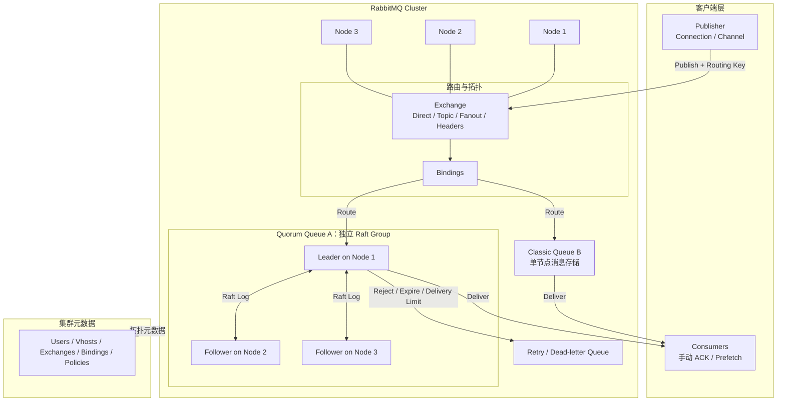
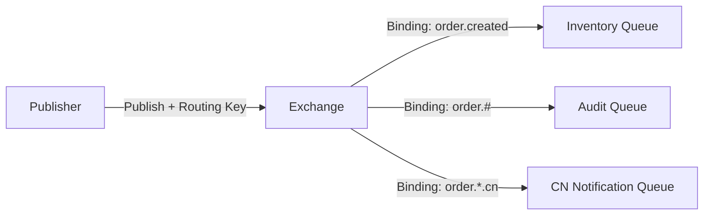
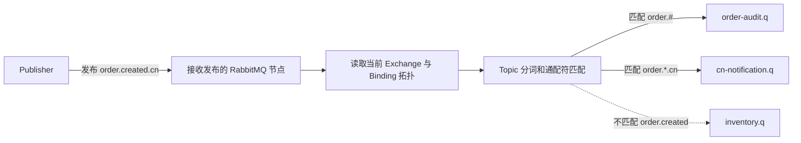
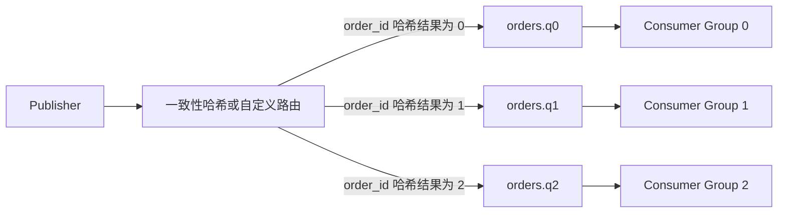

RabbitMQ Queue 的核心是：**先按照规则把消息路由到一条或多条 Queue，再把每条 Queue 中的任务可靠地交给某个 Consumer 完成**。它适合任务分发、复杂路由、逐条确认、重试、TTL 和优先级，不应直接套用事件日志的消费模型。

<!-- more -->

RabbitMQ Stream 是另一套追加日志抽象，相关实现参见 [RabbitMQ（三）：Stream 分区、复制、Offset 与故障恢复](006_rabbitmq_stream_implementation.md)。

## 1. Queue 解决什么问题

典型任务是：

- 一条订单事件同时交给库存、通知和审计；
- 多个 Worker 竞争处理图片、报表和邮件任务；
- 失败任务退避重试，超过上限进入死信队列；
- 验证码等过期任务不再执行；
- 紧急任务优先于普通任务。

Queue 更像一份“待办清单”：消息被某个 Consumer 成功处理并 ACK 后，它的生命周期基本结束。若核心需求是长期保存历史、按 Offset 回放和横向分区日志，应阅读 Stream 文章并与 Kafka、Pulsar 比较。

## 2. 完整生产架构



下面以订单事件 **order.created** 路由到 Quorum Queue **inventory.q** 为例。

### 生产消息的过程

1. Publisher 通过 Connection 中的 Channel，把消息、Exchange 和 Routing Key 发给任一 RabbitMQ 节点。
2. Exchange 根据 Binding 把 order.created 路由到 inventory.q。
3. inventory.q 的 Leader 把消息复制到 Raft Followers。
4. 达到 Quorum Queue 的提交条件后，RabbitMQ 向 Publisher 返回 Confirm。

Exchange 负责决定消息去哪，不保存消息；真正保存待处理消息的是目标 Queue。

### 消费消息的过程

1. RabbitMQ 按 Prefetch 把 inventory.q 中的消息投递给一个 Consumer，并把它标记为 Unacked。
2. Consumer 完成库存事务。
3. Consumer 发送手动 ACK，RabbitMQ 结束这条消息的待处理状态。
4. Consumer 断开或 NACK/Requeue 时，消息可以重新投递；拒绝、过期或超过限制时可以进入死信 Queue。

Publisher Confirm 和 Consumer ACK 是两个独立时间点，复制、重试和顺序边界在后文解释。

客户端可以连接任一 RabbitMQ 节点，但消息最终要到目标 Queue 所在节点或 Leader。集群有三个节点，不代表每条 Queue 都有三个消息副本：

- Classic Queue 的消息通常只在承载节点；
- Quorum Queue 才有多个 Raft 成员；
- 每条 Quorum Queue 都是独立复制组，成员和 Leader 可以不同。

## 3. 核心抽象与语义

| 抽象 | 保存什么 | 提供什么语义 | 不保证什么 |
|---|---|---|---|
| Connection | 客户端与节点的 TCP 长连接 | 认证、心跳和连接恢复 | 连接成功不代表发布成功 |
| Channel | Connection 内的逻辑会话 | 低成本并发、Confirm、Consumer | 不是线程安全的业务事务边界 |
| Exchange | 接收消息并执行路由 | 按类型和 Routing Key 匹配目标 | 不负责保存待消费任务 |
| Binding | 保存在集群元数据中的 Exchange 到 Queue/Exchange 的规则 | 声明消息进入哪些 Queue | 不保存消息，也不保存独立消费位点 |
| Queue | 待处理消息和投递状态 | 竞争消费、ACK、重投 | 多 Consumer 不是广播 |
| Consumer | Queue 的任务处理者 | Prefetch、ACK/NACK | 收到消息不代表业务完成 |
| Virtual Host | 一组逻辑资源和权限 | 命名、权限、策略隔离 | 不是物理资源隔离 |

### 3.1 Exchange 为什么存在

Publisher 通常只知道 Exchange 和 Routing Key，不直接决定所有下游 Queue：



一次发布可以进入多条 Queue。库存 Queue 成功消费不会推进审计 Queue；每条 Queue 都有独立消息副本、ACK 和失败状态。这就是 RabbitMQ 广播的本质，而不是让多个 Consumer 竞争同一 Queue。

### 3.2 四种 Exchange 的第一性原理

| 类型 | 路由依据 | 常见场景 |
|---|---|---|
| Direct | Routing Key 精确匹配 | 按任务类型、租户或区域分流 |
| Topic | 点分词模式匹配 | `order.created`、`order.*` 等事件分类 |
| Fanout | 忽略 Routing Key，投给所有绑定 Queue | 简单广播 |
| Headers | Header 条件匹配 | 多字段组合路由，但规则和成本更高 |

Exchange 路由成功只说明找到了目标 Queue。若没有任何匹配目标，是否返回 Publisher 取决于 mandatory/alternate exchange 等配置；Publisher 必须监控不可路由消息。

### 3.3 Topic Exchange 如何保存并执行路由

Topic Exchange 解决的是：**Publisher 只给消息一个分类地址，RabbitMQ 根据预先声明的规则决定消息进入哪些 Queue。**

这里有两类容易混淆的数据：

| 数据 | 由谁提供 | 保存在哪里 | 作用 |
|---|---|---|---|
| Routing Key | Publisher 在每次发布时提供 | 随本次发布请求进入 RabbitMQ | 描述这条消息的分类，例如 `order.created.cn` |
| Binding Pattern | 应用部署或初始化时声明 | RabbitMQ 集群元数据存储 | 描述 Queue 订阅什么，例如 `order.*.cn` |

Binding 是 Virtual Host 内的拓扑元数据。一条 Binding 在概念上保存：

```yaml
vhost: /commerce
source_exchange: domain.events
destination_type: queue
destination: cn-notification.q
binding_pattern: order.*.cn
arguments: {}
```

RabbitMQ 的元数据存储保存 Virtual Host、Exchange、Queue 和 Binding 等拓扑，并把这些定义复制到集群节点；它不保存 Queue 中的消息。RabbitMQ 4.2 起，新部署默认使用 Khepri 作为元数据存储；从旧版本升级的集群可能仍使用 Mnesia。因此准确说法是“Binding 保存在 RabbitMQ 元数据存储”，不能一概说它一定保存在 Khepri 中。

假设 `/commerce` 中声明一个 Topic Exchange `domain.events`，再建立三条 Binding：

| 目标 Queue | Binding Pattern | 含义 |
|---|---|---|
| `inventory.q` | `order.created` | 只接收完全相同的分类 |
| `order-audit.q` | `order.#` | 接收 `order` 开头、后面零个或多个词的分类 |
| `cn-notification.q` | `order.*.cn` | 接收 `order` 开头、中间恰好一个词、以 `cn` 结尾的分类 |

Topic 匹配先用 `.` 把 Routing Key 分词：`*` 匹配恰好一个词，`#` 匹配零个或多个词。因此：

| Publisher 发布的 Routing Key | 匹配结果 |
|---|---|
| `order.created` | `inventory.q`、`order-audit.q` |
| `order.created.cn` | `order-audit.q`、`cn-notification.q` |
| `order.cancelled.cn` | `order-audit.q`、`cn-notification.q` |
| `payment.created.cn` | 没有匹配的 Queue |

一次发布的完整路由过程是：



RabbitMQ 把消息交给每个匹配的目标 Queue，之后每条 Queue 独立保存、投递和确认。Exchange 本身不积压消息；没有 Binding 匹配时，消息也不会自动留在 Exchange 中等待未来新增规则。

## 4. 两次责任转移

RabbitMQ 的可靠链路有两个完全独立的确认：

```text
Publisher ── Publisher Confirm ──> RabbitMQ 接管发布责任
RabbitMQ ── Consumer Ack      ──> Consumer 完成业务责任
```

### 4.1 Publisher Confirm

Publisher 把字节写入 TCP 连接，只能说明数据进入网络栈。启用 Confirm 后，RabbitMQ 按目标 Queue 的存储语义接管消息，才向 Publisher 返回 ACK。

如果一条消息路由到多条 Queue，Confirm 必须考虑所有目标。某条目标 Queue 不可用时，不能用另一条健康 Queue 的成功代替它。

Confirm 超时表示结果未知：消息可能没有提交，也可能已经提交但响应丢失。Publisher 应以相同业务事件 ID 重试，并准备接受重复。

### 4.2 Consumer Ack

推荐时间线是：

```text
Deliver → 执行业务事务 → 事务提交 →手动 ACK
```

如果业务成功后、ACK 前 Consumer 崩溃，消息会重投，业务可能执行两次；如果先 ACK 后处理，进程崩溃可能永久丢失处理机会。因此可靠消费通常是“至少一次 + 业务幂等”。

### 4.3 端到端原子性的缺口

Publisher Confirm 不能把业务数据库和 RabbitMQ 变成一个事务：

```text
订单数据库提交成功
       ↓
应用在发布消息前崩溃
       ↓
订单存在，但下游永远收不到事件
```

常见解决方案是 Transactional Outbox：业务数据和待发布事件写入同一本地数据库事务，再由后台任务可靠发布。Consumer 侧则用 Inbox、唯一键或状态机实现幂等。

## 6. Queue 顺序能保证到哪里

RabbitMQ 可以维持一条 Queue 的入队和基本投递顺序，但业务完成顺序还会被以下因素改变：

- 多个 Consumer 并行处理；
- Prefetch 多条后在应用线程池中并发执行；
- 消息失败、NACK、重新入队和 Consumer 故障；
- 优先级消息越过普通消息；
- 多个 Publisher 并发到达顺序不同；
- 一条消息进入多条 Queue 后，各 Queue 处理速度不同。

如果要求同一订单严格有序，可以：

1. 按 `order_id` 将同一订单稳定路由到同一 Queue；
2. 使用 Single Active Consumer；
3. 使用较小 Prefetch，并对同一 Key 串行处理；
4. 业务成功后再 ACK；
5. 事件携带业务版本，拒绝非法倒序状态迁移。

Single Active Consumer 只能保证同一时刻一个活动 Consumer，不会自动为多条 Queue 建立全局顺序。失败消息若必须先完成，会阻塞后续；若进入死信后继续，则放弃严格顺序。

## 7. Quorum Queue 如何分区

Quorum Queue 本身不能像 Kafka Partition 或 Super Stream 那样自动拆成多个分片。单条 Queue 的关键状态都经过一个 Leader，因此热点 Queue 受单 Leader 路径限制。

横向扩展需要应用层建立多条 Queue：



这属于业务路由，不是 Quorum Queue 自动分区：

- 应用必须知道或统一管理 Queue 集合；
- 增减 Queue 或改变 Hash 会使 Key 漂移；
- 同一 Key 新旧消息可能落入不同 Queue，破坏顺序；
- 每条 Queue 都是独立 Raft 组，需要独立观察多数派和积压；
- 不存在跨 Queue 原子提交和全局 Offset。

如果核心需求就是可回放的分区日志，应评估 RabbitMQ Super Stream，而不是在 Quorum Queue 上重造日志模型。

## 8. TTL、优先级和短生命周期 Queue

RabbitMQ Queue 模型对任务生命周期提供较强控制：

- **Message TTL**：任务等待过久后过期；
- **Queue TTL / Auto-delete / Exclusive**：临时会话结束后删除 Queue；
- **Priority Queue**：紧急任务优先处理；
- **Length Limit**：限制消息数或字节数；
- **Dead-letter Exchange**：过期、拒绝或超过限制的消息重新路由。

TTL 不是精确定时器。消息何时被扫描、移除或死信还受 Queue 类型、消息位置和运行状态影响。优先级也明确放弃严格 FIFO；高优先级持续涌入时，普通任务可能饥饿。

Quorum Queue 与 Classic Queue 支持的参数和行为不完全相同，必须按实际 Queue 类型验证，不能看到“RabbitMQ 支持 TTL/优先级”就推断所有组合都相同。

## 10. 重试、毒消息与死信

处理失败有三个基本选择：

1. 立即重新入队：只适合极短暂错误，容易形成热循环；
2. 经重试 Queue 延迟后返回主 Queue：适合可恢复下游故障；
3. 超过上限进入死信：停止自动消耗资源，等待补偿。

Quorum Queue 可以记录投递失败次数并设置 delivery limit，减少毒消息无限循环。但业务仍需定义：可重试异常、退避、最大次数、死信负责人和重新驱动流程。

不要对所有异常直接 `nack(requeue=true)`。数据库整体不可用时，大量 Consumer 立即重试只会制造 CPU、网络和磁盘风暴。

## 14. 适用边界

适合：

- 按规则把一条消息投到一个或多个任务 Queue；
- 多个 Worker 竞争处理任务；
- 逐条 ACK、失败重试、死信、TTL、优先级和临时 Queue；
- 积压有限，主要目标是尽快完成工作；
- 关键任务愿意使用 Quorum Queue，并接受多数派不足时暂停。

需要谨慎：

- 需要保存数月完整历史并让大量消费者任意回放；
- 一条逻辑流需要极高吞吐，但不愿做应用层分片；
- 要求全局顺序或跨 Queue 原子提交；
- 无法实现业务幂等，却要求端到端绝不重复；
- 把 Queue 当成无限容量数据库。

## 15. 最小选型检查表

1. 为什么需要 Queue，而不是 Stream？
2. 使用 Classic 还是 Quorum Queue？哪些消息不能丢？
3. 消息可能路由到哪些 Queue，不可路由如何发现？
4. Publisher 在什么提交点获得 Confirm？超时如何重试？
5. Consumer 在什么业务完成点 ACK，如何幂等？
6. 顺序范围是一条 Queue 还是业务 Key？
7. 热点 Queue 是否需要应用层分片，扩分片如何避免 Key 漂移？
8. 最大积压、消息大小、Prefetch 和清空时间是多少？
9. 重试、delivery limit、死信和人工补偿由谁负责？
10. 三成员 Queue 失去两个节点时，是暂停还是接受数据风险？
11. 如何监控不可路由、Confirm 延迟、最老消息和多数派？
12. 跨地域的 RPO、RTO、重复和回切方案是什么？

## 16. 参考资料

- [RabbitMQ Documentation](https://www.rabbitmq.com/docs)
- [RabbitMQ Exchanges](https://www.rabbitmq.com/docs/exchanges)
- [RabbitMQ Metadata Store](https://www.rabbitmq.com/docs/metadata-store)
- [RabbitMQ Queues](https://www.rabbitmq.com/docs/queues)
- [RabbitMQ Quorum Queues](https://www.rabbitmq.com/docs/quorum-queues)
- [RabbitMQ Raft](https://www.rabbitmq.com/docs/raft)
- [Consumer Acknowledgements and Publisher Confirms](https://www.rabbitmq.com/docs/confirms)
- [RabbitMQ Reliability Guide](https://www.rabbitmq.com/docs/reliability)
- [RabbitMQ Single Active Consumer](https://www.rabbitmq.com/docs/consumers#single-active-consumer)
- [RabbitMQ TTL](https://www.rabbitmq.com/docs/ttl)
- [RabbitMQ Priority Queues](https://www.rabbitmq.com/docs/priority)
- [RabbitMQ Dead Letter Exchanges](https://www.rabbitmq.com/docs/dlx)
- [RabbitMQ Flow Control](https://www.rabbitmq.com/docs/flow-control)
- [RabbitMQ Monitoring](https://www.rabbitmq.com/docs/monitoring)
- [RabbitMQ Federation](https://www.rabbitmq.com/docs/federation)
- [RabbitMQ Shovel](https://www.rabbitmq.com/docs/shovel)
- [RabbitMQ Upgrade Guide](https://www.rabbitmq.com/docs/upgrade)
