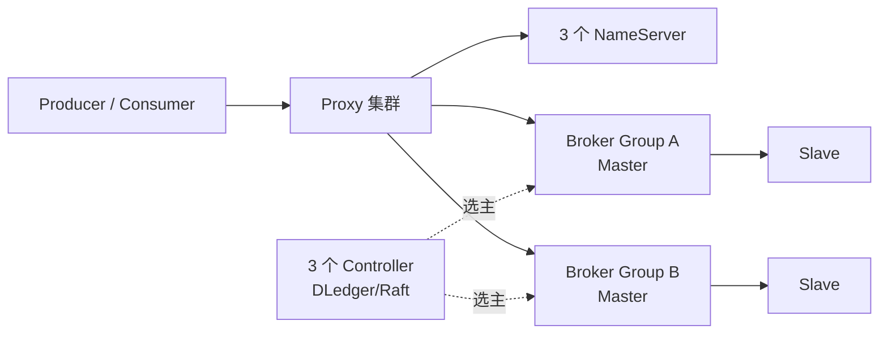

RocketMQ 的 Topic 由多个 MessageQueue 组成。MessageQueue 是存储、负载均衡和顺序的基本单元；RocketMQ 5 的生产高可用架构还要关注 Controller，而不只是 NameServer 和 Broker 主从。

<!-- more -->

## 1. 生产架构

建议基线：

- 3 个 NameServer，节点彼此不复制状态；Broker 把完整路由分别注册到每个 NameServer；
- 3 个 Controller，独立部署或嵌入部分 NameServer，以 Raft 保存选主元数据；
- 多个 Broker 副本组，每组一个 Master 和一个或多个 Slave，跨故障域部署；
- RocketMQ 5 客户端通过 Proxy 访问，Proxy 可与 Broker 同进程或独立扩容。

NameServer 的无状态多节点解决路由发现可用性，Controller 解决 Broker 自动选主，两者职责不同。

## 2. 如何分区并保证顺序

Topic 包含多个 MessageQueue。Producer 可轮询队列，也可根据业务 Key 选择固定队列。RocketMQ 5 的 FIFO Topic 使用 MessageGroup：同一 MessageGroup 的消息进入同一队列并按组内顺序存储和投递。

完整顺序依赖以下条件：

1. 同一实体使用稳定的 MessageGroup，例如 `order_id`；
2. 对同一组使用单 Producer 或串行发送，否则 Broker 无法推断并发调用的先后；
3. 消费端采用顺序消费，遵循 receive-process-ack，不异步并行处理同一组；
4. 失败消息完成重试后再推进后续消息；
5. 控制单组大小，避免热点组拖慢整个队列。

顺序范围是 MessageGroup，不是整个 Topic。全局顺序需要把所有消息放进一个组/队列，会牺牲横向扩展能力。队列数量和路由集合变化时也要防止同一 Key 漂移；严格顺序模式会优先保持路由稳定，必要时牺牲故障期间的可用性。

## 3. 多副本一致性

每个 Broker 副本组的 Master 接收写入，Slave 复制 CommitLog。Controller 维护可选主的 SyncStateSet；Slave 落后超过阈值会被移出，避免过旧副本成为新 Master。

关键配置表达的是一致性与可用性的取舍：

- `allAckInSyncStateSet=true`：写入复制到 SyncStateSet 的所有成员后才成功；
- 或配置 `inSyncReplicas`、`minInSyncReplicas`，要求足够多同步副本；
- `enableElectUncleanMaster=false`：不从 SyncStateSet 外选落后副本，避免消息丢失；
- 同步刷盘降低掉电丢失窗口，但增加延迟。

Controller 自身使用 Raft 多数派保护选主状态；消息数据复制仍发生在 Broker 副本组内。不能因为部署了 3 个 Controller 就认为每条消息已经形成 3 副本共识。

## 4. 故障修复与扩缩容

### 4.1 临界故障时间线

RocketMQ 必须先看部署模式，不能只说“主从复制”：

- `ASYNC_MASTER`：Master 本地存储后可以返回成功，再异步复制给 Slave；
- `SYNC_MASTER`：发送成功还要等待 Slave 同步，超时会返回 `FLUSH_SLAVE_TIMEOUT`，Slave 不可用会返回 `SLAVE_NOT_AVAILABLE`；
- RocketMQ 5 Controller 模式：由 SyncStateSet 约束可选主副本，并通过 `allAckInSyncStateSet` 或 `inSyncReplicas/minInSyncReplicas` 定义写成功所需确认数。

假设消息 M 已进入 Master A，但尚未到 Slave B：

1. 异步模式可能已经对 Producer 返回 `SEND_OK`。此时 A 永久故障、B 被提升后，M 会丢失——这是“已响应但丢消息”的明确窗口。
2. 同步模式不会返回普通成功，而是等待 B；若等待超时，Producer 得到超时状态。M 可能已在 A，甚至 B 稍后也可能收到，所以结果仍然未知。
3. Controller 模式开启 `allAckInSyncStateSet=true` 时，只有 M 到达 SyncStateSet 所有成员才成功；若同步成员不足 `minInSyncReplicas`，拒绝安全写入。
4. A 恢复后根据 Controller 分配的角色和 Epoch 作为副本加入，以当前 Master B 的有效 CommitLog 为准。A 独有、未进入新主有效日志的尾消息不能自行重新发布，否则会破坏已经形成的新历史。

Producer 对非 `SEND_OK` 状态或网络超时可以重试，但要使用稳定的业务 Key。因为 ACK 也可能只是在返回途中丢失，重试可能制造重复；RocketMQ 的 `msgId` 不是端到端幂等保证，消费者仍要按订单号/事件 ID 去重。

对关键消息，建议明确选择 Controller 自动切换、禁止 unclean master、同步刷盘以及足够的同步副本；不要使用默认异步复制却宣称“多副本不丢消息”。

Master 故障时，Controller 在 SyncStateSet 中选新 Master，更新 Epoch 并通知 Broker；客户端从 NameServer/Proxy 刷新路由后继续发送和消费。禁止 unclean election 时，如果没有合格副本，副本组保持不可写而不是冒险丢数据。

旧节点恢复后，根据当前 Master 的 CommitLog 补齐数据，达到同步条件后重新进入 SyncStateSet。空盘 Slave 可执行全量复制；上线前必须保留和核对 Epoch 文件，避免旧 Master 复活造成双主。

扩容时新增 Broker Group，并把 Topic 的 MessageQueue 扩展到新组。与 Kafka 类似，增加队列可能改变业务 Key 的映射；严格顺序 Topic 应预留队列数，或使用显式、稳定的路由策略。缩容前停止向目标 Broker 写入，等待积压消费完成或迁移业务流量，再移除路由和副本。

从旧主从模式升级到 Controller 模式前，应确认主从 CommitLog 对齐。官方明确提示：若未对齐且错误地先启动 Slave，可能因为日志截断而丢消息。

## 5. 适用边界

RocketMQ 适合订单、交易、事务消息、延时/定时消息和按业务 Key 顺序处理。团队需要熟悉 Controller、Broker 副本组和客户端重试语义，不能只会部署 NameServer + 单 Master。

## 6. 参考资料

- [RocketMQ 5 Master-Slave Automatic Failover](https://rocketmq.apache.org/docs/deploymentOperations/03autofailover/)
- [RocketMQ Basic Best Practices：Send Status](https://rocketmq.apache.org/docs/4.x/bestPractice/01bestpractice/)
- [RocketMQ Ordered Message](https://rocketmq.apache.org/docs/featureBehavior/03fifomessage/)
- [RocketMQ Message Queue](https://rocketmq.apache.org/docs/domainModel/04messagequeue/)
- [RocketMQ Consumer Load Balancing](https://rocketmq.apache.org/docs/featureBehavior/08consumerloadbalance/)
