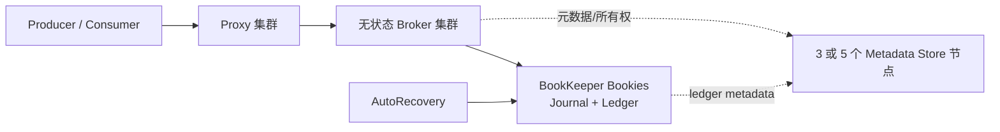

Pulsar 把服务层和存储层分开：Broker 负责连接、协议和 Topic 所有权，BookKeeper 负责持久化。Broker 扩容时不搬历史消息，这是它与 Kafka 最显著的架构差异之一。

<!-- more -->

## 1. 生产架构

生产集群至少包括多个 Proxy/Broker、3 或 5 个元数据服务节点、3 个以上 Bookie，以及 AutoRecovery。Bookie 的 Journal 与 Ledger Storage 最好使用独立磁盘，并跨机架部署。Broker 不保存消息本体，Topic Bundle 在 Broker 间迁移时只转移所有权和连接。

## 2. 如何分区并保证顺序

Partitioned Topic 由多个内部 Topic 分区组成。Producer 可轮询，也可对 Message Key 做哈希，使相同 Key 进入同一分区。

Pulsar 的顺序保证需要同时考虑分区和订阅类型：

- Exclusive：一个订阅只有一个消费者，保持分区内顺序；
- Failover：一个活动消费者、其他待命，故障后接管；
- Shared：消息分发给多个消费者，不保证顺序；
- Key_Shared：相同 Key 交给同一消费者，可保持单 Key 顺序并并行处理不同 Key。

严格的 Key_Shared 顺序要求 Producer 禁用会打散批次的默认批处理，或使用 key-based batching。失败重投和消费者内部并发仍可能改变业务完成顺序，因此消费者应按 Key 串行并实现幂等。

Pulsar 只保证单分区顺序。全局顺序需要非分区 Topic 或单分区，吞吐受单 Topic Owner Broker 限制。

## 3. 多副本一致性

Pulsar 的 Managed Ledger 由一系列 BookKeeper Ledger 组成。每个 Ledger 配置三个参数：

- Ensemble `E`：参与该 Ledger 的 Bookie 数；
- Write Quorum `Qw`：每条 Entry 写入多少个 Bookie；
- Ack Quorum `Qa`：收到多少个持久化确认后，写入才成功。

约束为 `E >= Qw >= Qa`。常见关键数据配置是 `E=3, Qw=3, Qa=2` 或更严格的 `3/3/3`。Bookie 在返回确认前把 Entry 同步到 Journal；Broker 只有收到 `Qa` 个确认才向 Producer 确认。

这不是“整个 Topic 固定复制在三台机器上”。Ledger 分段后可以选择新的 Ensemble，因此数据段会均匀分布在 Bookie 集群中。元数据服务保存 Ledger、Bundle 和所有权等元数据，自身也需要多数派高可用。

## 4. 故障修复与负载迁移

### 4.1 临界故障时间线

Pulsar 不是 Broker 主从复制。Broker 是 Topic 的单写者，消息 M 被直接写入 BookKeeper。以 `E=3, Qw=3, Qa=2` 为例：

1. Broker 把 M 作为 Ledger Entry 发给 3 个 Bookie。
2. Bookie 只有把 Entry 持久化到 Journal 后才返回确认。
3. Broker 收到任意 2 个 Bookie 的确认，并且更小 Entry ID 都已确认后，才把 M 确认为成功；这个位置推进 LastAddConfirmed。
4. 若 Broker 在只写入 1 个 Bookie 后故障，Producer 没有收到 ACK。新 Broker 先 Fence 旧 Ledger，阻止旧写者继续写，再执行 Ledger Recovery。
5. Recovery 从各 Bookie 找到最高 LastAddConfirmed，并向后逐条探测。某条尾 Entry 即使当时未达到 Qa，只要还能被读到，就可能被复制到完整 Write Quorum 后纳入最终 Ledger；无法读出的尾部则被舍弃。最后通过 CAS 把 Ledger 标为 CLOSED，所有读者看到相同结尾。

因此 Producer 超时后的结果仍然未知：M 可能被 Recovery 保留下来，也可能被丢弃。客户端应使用相同消息业务 ID 重试，并启用 Pulsar Producer Deduplication 或在消费端做幂等；不能根据“没有收到 ACK”推断 M 一定不存在。

这里的 `Qa=2` 类似“等待两个持久副本”，但比“半同步主从”更准确的描述是 BookKeeper Ack Quorum。Broker 故障不触发消息副本选主，而是触发 Topic 所有权转移和 Ledger Fence/Recovery。

### 4.2 Broker 故障

其他 Broker 接管 Topic Bundle，客户端重新 lookup 并连接。因为数据仍在 BookKeeper，不需要复制历史消息。短暂中断主要来自所有权转移和客户端重连。

### 4.3 Bookie 故障

正在写入的 Ledger 在无法满足 Quorum 时会封闭，并在健康 Bookie 上创建新 Ledger 继续写入。AutoRecovery 由 Auditor 找出欠复制 Ledger，Replication Worker 从可用副本读取 Entry，并复制到新 Bookie，最后更新 Ensemble 元数据。

修复安全性取决于仍有足够副本可读取。官方规则指出，要安全容忍 Bookie 故障，`Qa` 至少为 2；同时容量规划必须保证故障后仍有足够 Bookie 满足 E/Qw/Qa。

### 4.4 扩缩容

新增 Broker 后，负载均衡器迁移 Bundle 所有权，不搬数据。新增 Bookie 主要承接新 Ledger；若要主动均衡旧数据或下线 Bookie，应执行 Bookie Decommission/Re-replication，确认所有 Ledger Fragment 已复制后再停机。

跨集群 Geo-replication 是异步复制，解决地域容灾而不是单集群 BookKeeper 副本修复；需要明确复制积压和 RPO。

## 5. 适用边界

Pulsar 适合多租户、海量 Topic、长积压、跨地域和希望独立扩缩 Broker/存储的场景。代价是组件多，必须同时理解 Broker、Metadata Store、BookKeeper 与 AutoRecovery。

## 6. 参考资料

- [Pulsar Architecture Overview](https://pulsar.apache.org/docs/4.1.x/concepts-architecture-overview/)
- [Pulsar Broker Load Balancing](https://pulsar.apache.org/docs/4.1.x/concepts-broker-load-balancing-overview/)
- [Pulsar ZooKeeper and BookKeeper Administration](https://pulsar.apache.org/docs/4.0.x/administration-zk-bk/)
- [Apache BookKeeper Protocol：Writing and Ledger Recovery](https://bookkeeper.apache.org/docs/development/protocol/)
- [Pulsar Production Helm Deployment](https://pulsar.apache.org/docs/4.1.x/helm-deploy/)
