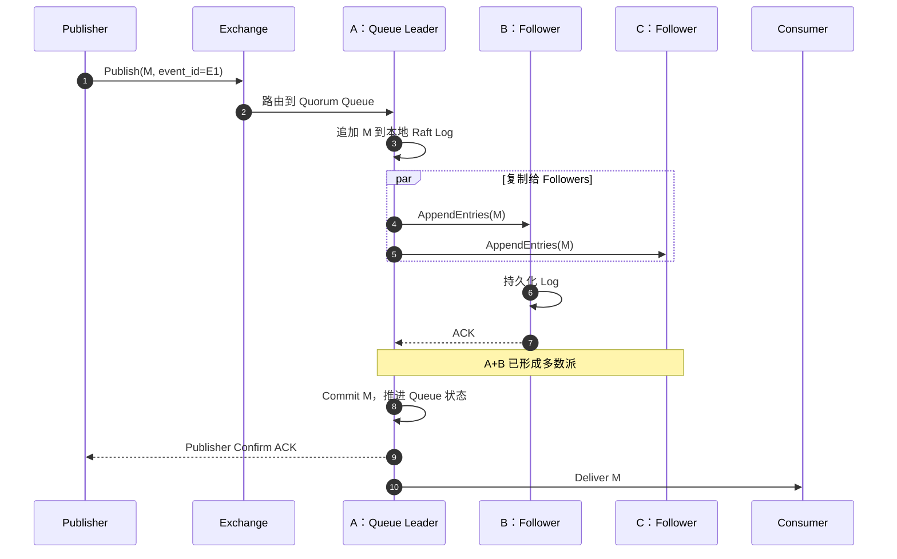
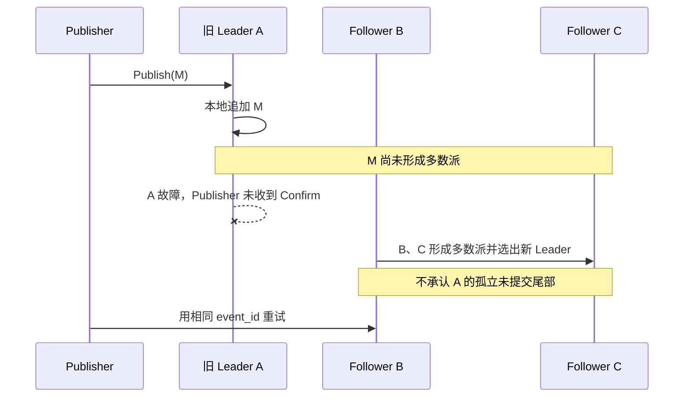

## 5. Quorum Queue 如何保持多副本一致

### 5.1 不是传统主从半同步

每条 Quorum Queue 是一个独立 Raft 组：一个 Leader 接收状态变化，Followers 复制 Raft Log。入队、投递、ACK 和成员变化都属于这条 Queue 的状态。

三成员 Queue 需要至少两个成员形成多数派：

- 多数成员在线时可以选主和提交；
- 只剩一个成员时，无法证明自己拥有最新历史，因此停止服务；
- 多数派已提交的共同前缀是唯一有效历史；
- 恢复的旧 Leader 必须服从新 Leader，截断冲突尾部并追赶。

这不是“主节点通知一个从节点就返回”的半同步复制。多数派决定提交的代价是副本网络和磁盘延迟进入发布路径，多数派丢失时宁可暂停，也不允许两个网络分区同时写。

### 5.2 从消息接收到 Confirm 的完整过程

假设 A、B、C 是三成员 Quorum Queue，A 是 Leader：



这里的提交点是“多数成员持久化并由 Leader 认定 Commit”，不是 Leader 刚收到消息，也不是等全部三个成员。C 可以稍后追上，但若集群策略或目标路由还有其他约束，Confirm 仍要满足相应条件。

### 5.3 临界故障：未提交时 Leader 故障



Publisher 没收到 Confirm，无法判断消息最终是否存在，只能按未知结果处理。A 恢复后不能把本地孤立的 M 重新“复活”，而要按当前 Raft 历史截断或追赶。

### 5.4 临界故障：已提交但 Confirm 丢失

如果 A、B 已持久化并 Commit M，而 Confirm 在返回途中丢失：

- 新 Leader 仍会保留 M；
- Publisher 只看到超时，会重试；
- RabbitMQ 可能接收两份内容相同的消息；
- Consumer 必须用业务事件 ID 幂等。

Raft 解决的是 Broker 内部唯一已提交历史，不解决网络响应丢失造成的端到端重复。

### 5.5 Classic Queue 的边界

Classic Queue 不使用 Quorum Queue 的 Raft 多副本语义。承载节点永久损坏时，消息可能丢失。RabbitMQ 4.x 已移除旧式 Classic Mirrored Queue，新系统不应把旧镜像队列策略当作高可用方案。

是否“部署三节点”没有可靠性结论，必须说明目标 Queue 的具体类型和成员数。

## 9. 积压、Prefetch 与背压

容量规划至少需要：

```text
最大积压 ≈ 峰值生产速率 × 最长不可消费时间
恢复期消费能力必须持续高于恢复期生产速率
```

Queue 指标需要区分：

- **Ready**：还没有投递给 Consumer；
- **Unacked**：已经投递，但 Consumer 尚未确认；
- **Redelivered**：发生过重新投递。

Ready 增长通常表示消费总能力不足；Unacked 过高通常表示处理慢、阻塞或 Prefetch 过大。Prefetch 太小会增加往返并降低吞吐，太大会让单 Consumer 占住大量任务，并扩大故障重投范围。

RabbitMQ 会把内存、磁盘和复制压力通过流控传回 Publisher。客户端必须设置超时、有界重试和有界本地缓冲，不能在 Broker 变慢时把积压无上限转移到应用内存。

大消息会同时放大内存、磁盘、复制和重投成本。通常把大对象放入对象存储，Queue 中只传引用和校验信息。

## 11. 数据契约、协议和安全

RabbitMQ 可承载 AMQP 0-9-1、AMQP 1.0、MQTT、STOMP 等协议，但协议接入成功不代表 Confirm、事务、路由和重投语义完全相同，应按实际客户端验证。

RabbitMQ 不提供完整通用的 Schema Registry。消息 Envelope 至少包含：

- 事件类型与版本；
- 稳定业务事件 ID；
- 发生时间、Producer 和 Trace ID；
- Routing Key / 业务 Key；
- 数据格式和兼容规则。

安全方面需要 TLS、应用独立身份、Virtual Host 与资源级最小权限、管理接口隔离，以及连接、Channel、Queue 数量和发布速率限制。Virtual Host 只是逻辑隔离，高风险租户仍可能需要独立集群。

## 12. 运维与升级

| 层次 | 重点指标 |
|---|---|
| Publisher | Publish 失败、不可路由、Confirm 延迟、超时和重试 |
| Queue | Ready、Unacked、最老消息年龄、Redelivery、死信 |
| Quorum | Leader 分布、在线成员、是否有多数派、Raft 日志和副本同步 |
| Consumer | 实例数、处理延迟、ACK/NACK、Prefetch 和失败率 |
| Node | 内存、磁盘、文件句柄、连接、流控和网络分区 |

新增 RabbitMQ 节点不会自动让已有 Quorum Queue 在新节点产生副本。扩容后要调整成员和 Leader 分布；副本增加的是容错，不是单 Queue 的分片吞吐。

升级前要确认 RabbitMQ/Erlang 兼容、Feature Flags 和滚动升级路径，并保证关键 Quorum Queue 始终保有多数派。

## 13. 跨地域灾备

RabbitMQ Cluster 和 Quorum Queue Raft 组更适合低延迟局域网。跨高延迟广域网部署会让每次多数派提交承担地域 RTT，并扩大网络分区影响。

跨地域通常使用独立集群加 Federation 或 Shovel 异步传递：

```text
Region A RabbitMQ ── Federation / Shovel ──> Region B RabbitMQ
```

异步链路必须单独定义 RPO、RTO、切换入口、重复范围、消费状态和回切冲突。导出 Exchange/Queue/Binding 定义只能恢复拓扑，不能恢复尚未消费的消息数据。

## 16. 参考资料

- [RabbitMQ Documentation](https://www.rabbitmq.com/docs)
- [RabbitMQ Exchanges](https://www.rabbitmq.com/docs/exchanges)
- [RabbitMQ Metadata Store](https://www.rabbitmq.com/docs/metadata-store)
- [RabbitMQ Queues](https://www.rabbitmq.com/docs/queues)
- [RabbitMQ Quorum Queues](https://www.rabbitmq.com/docs/quorum-queues)
- [RabbitMQ Raft](https://www.rabbitmq.com/docs/raft)
- [Consumer Acknowledgements and Publisher Confirms](https://www.rabbitmq.com/docs/confirms)
- [RabbitMQ Reliability Guide](https://www.rabbitmq.com/docs/reliability)
- [RabbitMQ Single Active Consumer](https://www.rabbitmq.com/docs/consumers#single-active-consumer)
- [RabbitMQ TTL](https://www.rabbitmq.com/docs/ttl)
- [RabbitMQ Priority Queues](https://www.rabbitmq.com/docs/priority)
- [RabbitMQ Dead Letter Exchanges](https://www.rabbitmq.com/docs/dlx)
- [RabbitMQ Flow Control](https://www.rabbitmq.com/docs/flow-control)
- [RabbitMQ Monitoring](https://www.rabbitmq.com/docs/monitoring)
- [RabbitMQ Federation](https://www.rabbitmq.com/docs/federation)
- [RabbitMQ Shovel](https://www.rabbitmq.com/docs/shovel)
- [RabbitMQ Upgrade Guide](https://www.rabbitmq.com/docs/upgrade)
