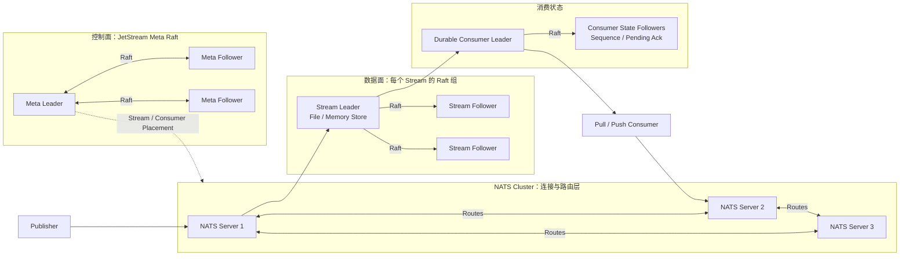

Core NATS 是在线、至多一次的消息总线；JetStream 在它之上增加 Stream、Consumer、持久化、确认和重放。需要可靠消息时讨论的应是 JetStream，而不是只开启 Core NATS 集群。

<!-- more -->

## 1. 完整架构



JetStream 不是“整个集群一个 Raft 组”。集群元数据、每个 Stream 和持久 Consumer 分别维护状态；客户端连接到任一 NATS Server，消息最终路由到对应 Stream Leader。增加副本提高容错，但不会提高单个 Stream 的写吞吐。

## 2. 如何“分区”并保证顺序

JetStream Stream 是匹配一个或多个 Subject 的追加日志，自身没有 Kafka 式 Partition 数。要横向扩展单 Stream Leader 的写入瓶颈，需要把 Subject 空间拆给多个 Stream，例如：

```text
orders.0.> -> ORDERS_0
orders.1.> -> ORDERS_1
orders.2.> -> ORDERS_2
```

Publisher 根据 `hash(order_id) % N` 选择 Subject。顺序保证存在于单 Stream 的 Sequence 中；拆成多个 Stream 后不再有全局顺序。

Ordered Consumer 是无状态、自动重建的单线程读取视图，适合分析和一次性顺序扫描；它不使用 Ack，也不适合作为可扩展的关键任务工作队列。持久 Consumer 要保证处理顺序，应限制在途消息数为 1，串行 Ack，并避免多个客户端并行共享同一 Consumer。

至少一次投递会重发超时未 Ack 的消息，因此应用仍需使用业务 ID 幂等。若多个 Publisher 并发发送，同一 Subject 的“业务先后”也必须由上游序列号定义。

## 3. 多副本一致性

Stream 有一个 Leader 和若干 Followers。写入由 Leader 分配 Sequence，并在多数副本保存后返回 PubAck。`R=3` 可容忍一个节点故障，`R=5` 可容忍两个，官方将 R=3 视为生产基线。

Leader 故障后，多数派选出新 Leader；没有多数派时停止写入。Consumer 的游标和 Pending Ack 状态也可复制，默认持久 Consumer 继承 Stream 的副本数。

要注意 File Storage 的边界：官方文档指出 PubAck 代表 Raft 多数副本已收到写入，但文件数据不一定每条都立即 fsync。R=3 能显著降低单机崩溃风险，却不等于三块磁盘都已同步落盘。极端的整组同时掉电仍要靠备份和恢复演练。

## 4. 故障修复与扩缩容

### 4.1 临界故障时间线

以 R=3 Stream 为例，A 是 Stream Leader：

1. Publisher 把消息 M 发给 A，A 分配 Stream Sequence 并追加本地状态。
2. A 通过 Raft 把 M 复制到 Followers；多数派拥有该写入后才返回 PubAck。
3. 如果 A 在形成多数派前故障，M 没有提交，Publisher 收不到 PubAck；新 Leader 不会把这条孤立写入作为有效 Stream 消息。
4. A 恢复后作为 Follower 按新 Leader 的已提交 Log 追赶，未提交尾部被丢弃。
5. 如果 M 已形成多数派，但 A 在 PubAck 返回途中故障，Publisher 仍会超时，但 M 实际存在。重试时应携带相同 `Nats-Msg-Id`，利用 Stream 的 Duplicate Window 去重；窗口外仍靠消费者幂等。

JetStream 属于多数派 Raft，不是半同步主从。还要注意“多数副本收到”不等于“每块磁盘都对该消息执行了 fsync”：官方明确说明 File Storage 不会逐条同步刷盘。因此 R=3 主要保护单节点故障，不能把它等同于整组同时掉电时绝不丢失。

单个 Follower 恢复后从 Leader 追赶缺失的 Raft Log；Leader 故障则自动选主，客户端对未收到 PubAck 的发布进行重试。超过多数派的节点丢失时，不能靠剩余少数副本自动继续。

新增 Peer 时先把节点加入 NATS Cluster，再调整 Stream Placement/Replicas。新 Peer 完成 Snapshot 或 Log Catch-up 后成为正式成员。移除旧 Peer 时先添加新副本并等待追平，再删除旧 Peer，始终保持多数派。

副本数不是分片数：提高 R 只增加耐久性和复制开销，不增加写吞吐。扩吞吐应拆 Stream，扩消费应为 Durable Pull Consumer 增加 Worker，并接受并发处理不保证完成顺序的事实。

备份至少包含 Stream 数据和元数据；恢复前应停止冲突写入，使用官方 Snapshot/Restore 工具，并验证 Consumer 状态和最后 Sequence。

## 5. 适用边界

JetStream 适合云原生服务通信、控制面事件、低延迟任务和中等规模可回放消息。需要成熟分区生态、超长保留和大规模流处理时，Kafka/Pulsar 通常更合适。

## 6. 参考资料

- [NATS JetStream](https://docs.nats.io/concepts/jetstream)
- [NATS Surviving Node Loss](https://docs.nats.io/learn/jetstream/surviving-node-loss)
- [NATS Clustering and Replication](https://docs.nats.io/learn/clustering/)
- [NATS Ordered Consumers](https://docs.nats.io/learn/jetstream/ordered-consumer)
