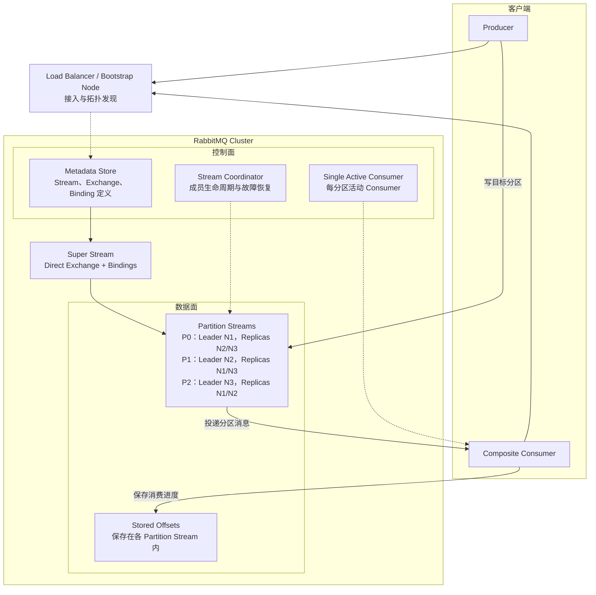
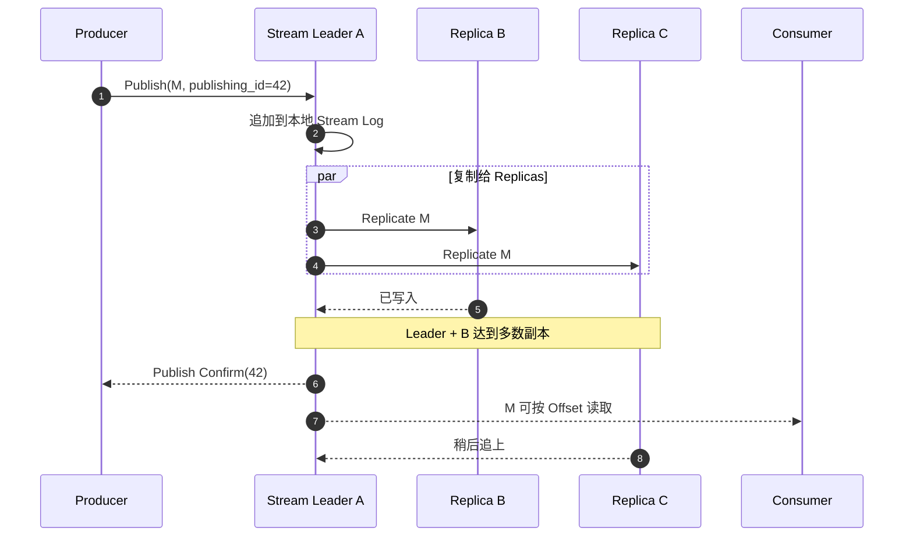
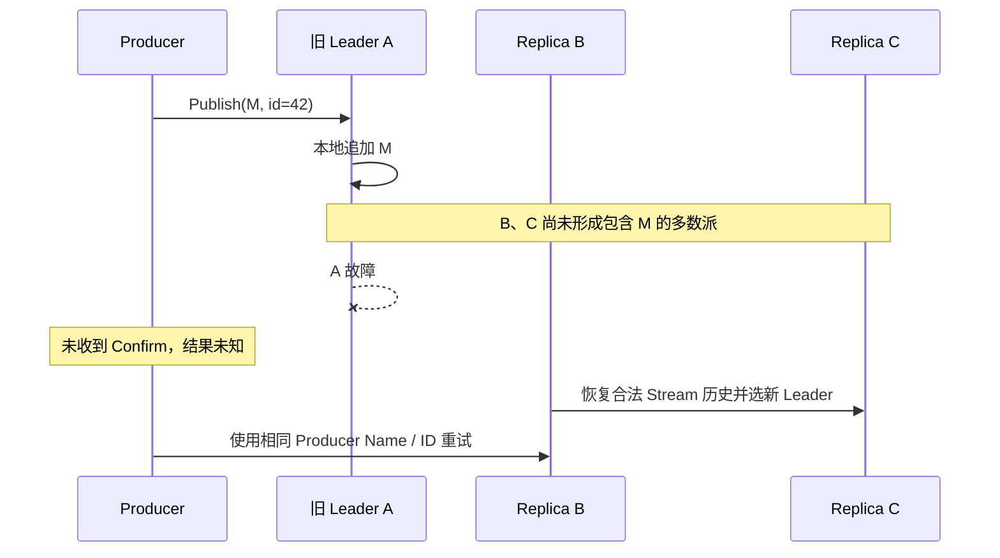
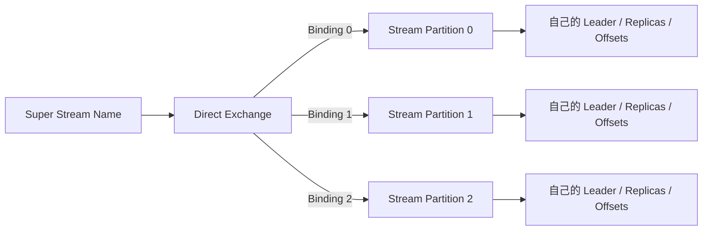
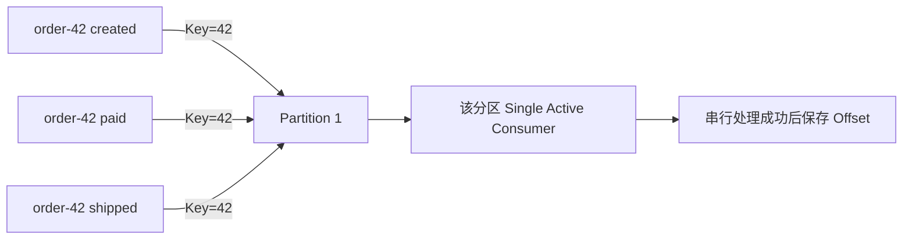

RabbitMQ Stream 不是“可以保存更多消息的 Queue”，而是一套 **不可变追加日志**：Consumer 读取不会删除消息，每个 Consumer 用 Offset 表示读到哪里，历史按时间或容量保留。Super Stream 再把多条普通 Stream 组合成一条可分区扩展的逻辑流。

<!-- more -->

任务路由、逐条 ACK、TTL、优先级和 Quorum Queue 请参见 [RabbitMQ（二）：Queue 存储、多副本一致性与故障恢复](005_rabbitmq_queue_implementation.md)。本文只讨论 Stream 模型，避免把两种确认和消费语义混在一起。

## 1. Stream 解决什么问题

Stream 更适合：

- 多个消费组独立读取同一份业务事件；
- Consumer 修复后从过去 Offset 重放；
- 保留较大但有明确上限的历史或积压；
- 单条 Queue 已成为吞吐瓶颈，需要 Super Stream 分区；
- 需要较高吞吐的日志、事件分发和流式处理入口。

它与 Queue 的根本区别是：Queue 关心“任务是否完成”，Stream 关心“历史记录在哪里、读者读到哪里”。

## 2. 完整生产架构



图中实线表示正常的消息生产、投递和进度保存，虚线表示拓扑发现或协调关系。下面只用一条订单消息说明两条主流程。

### 2.1 生产消息的过程

假设 Producer 把订单事件 **order-42 created** 发布到三分区 Super Stream **orders**：

1. **发现拓扑**：Producer 先通过 Load Balancer 连接任一 Bootstrap Node，得到 orders 有哪些 Partition，以及各自的 Leader 地址。
2. **选择分区**：Stream 客户端根据 Partition Key **order-42** 选择 **orders-1**。Super Stream 的 Exchange 和 Bindings 在这里描述分区关系。
3. **写入消息**：Producer 随后连接 orders-1 的 Leader。Leader 为消息确定位置，并复制到该分区的 Replicas。
4. **返回成功**：达到 Stream 的复制条件后，Leader 向 Producer 返回 Publish Confirm。

```text
Producer
  -> Bootstrap Node 发现拓扑
  -> order-42 路由到 orders-1
  -> orders-1 Leader
  -> Replicas
  -> Publish Confirm
```

Publish Confirm 只表示 RabbitMQ 已接管消息，不表示下游库存业务已经完成。具体复制和 Confirm 条件在后文说明。

### 2.2 消费消息的过程

假设库存服务使用 Consumer Name **inventory-service** 消费 orders：

1. **建立订阅**：Composite Consumer 发现 orders 的三个 Partition，并在内部为每个 Partition 创建一个 Consumer。
2. **选择活动实例**：多个库存服务实例开启 Single Active Consumer（SAC）后，RabbitMQ 为每个 Partition 只激活一个同名 Consumer。假设当前实例负责 orders-1。
3. **继续读取**：该 Consumer 从 orders-1 最近保存的 Stored Offset 之后继续读取，收到 order-42。
4. **完成业务**：Consumer 提交库存事务，然后保存 orders-1 的新 Offset。

```text
Composite Consumer
  -> orders-1 的活动 Consumer
  -> 从 Stored Offset 后读取 order-42
  -> 库存事务提交
  -> 保存 orders-1 的新 Offset
```

Stored Offset 记录的是这个 Consumer 在这个 Partition 上的进度。业务已经提交但 Offset 尚未保存时发生故障，消息可能被再次处理，因此应用仍需幂等。

Stream Coordinator 主要在创建 Stream、成员变化和故障恢复时参与协调，不经过每一条消息。后续章节再分别展开 Stream、复制、SAC、Offset 和故障恢复。

## 3. 核心抽象与语义

| 抽象 | 保存什么 | 提供什么语义 | 不保证什么 |
|---|---|---|---|
| Stream | 不可变追加日志 | 单 Stream Offset、保留和重放 | 不提供跨 Stream 全局顺序 |
| Chunk / Segment | 一批连续消息和磁盘段 | 顺序磁盘读写与批量复制 | 不等于业务事务批次 |
| Offset | Stream 中的读取位置 | 从开头、末尾、时间或指定位置读取 | 保存 Offset 不等于业务幂等 |
| Producer Name + Publishing ID | Producer 的发布序列 | Broker 端去重重复发布 | 不能去重不同 Producer 的同一业务事件 |
| Consumer Name | Consumer 身份 | 与 Stored Offset、SAC 等协作 | 名称本身不保证只执行一次 |
| Super Stream | 多条 Stream 的逻辑组合 | 分区写入和组合消费 | 没有全局 Offset、全局提交或全局顺序 |
| Composite Consumer | 客户端为每个分区创建的内部 Consumer 集合 | 用一个应用回调消费整个 Super Stream | 不自动提供跨实例互斥或全局顺序 |
| Stream Coordinator | Stream 成员生命周期和恢复的内部协调状态机 | 创建、启停、成员变更与恢复协调 | 不承载消息数据流，不是 Stream Leader |
| Single Active Consumer | 同名 Consumer 的服务端单活协调 | 单 Stream 单活投递与故障接管 | 不保证 exactly-once 或跨分区顺序 |

### 3.1 Stream 的消息为什么不会因消费而删除

Consumer 读取消息后，Stream 仍按保留策略保存日志。每个 Consumer 可以保存自己的 Offset，其他 Consumer 不受影响：

```text
Stream:  100 ─ 101 ─ 102 ─ 103 ─ 104
Group A:                   ↑ Offset 104
Group B:       ↑ Offset 101
Replay:   ↑ 可从 100 重新读取
```

消息最终按时间或容量保留上限清理，而不是等待所有消费者逐条 ACK 后才删除。这使回放自然，但也要求容量上限和慢消费者策略明确。

### 3.2 Stored Offset 的边界

Stream Consumer 可以把 Offset 存到 RabbitMQ，也可以由应用存到外部系统。可靠处理通常是：

```text
读取消息 → 执行业务 → 业务提交 → 保存下一个 Offset
```

如果业务提交后、Offset 保存前崩溃，恢复后会重复处理；如果先保存 Offset，业务失败后会跳过消息。因此仍然是“至少一次 + 业务幂等”，不是保存 Offset 就获得 exactly-once。

## 4. 普通 Stream 如何保持多副本一致

每个普通 Stream 是独立复制单元：一个 Leader 负责追加，多个 Replicas 保存日志副本。Producer 即使先连接其他节点，最终也要把写入发送或转发到该 Stream 的 Leader。

三副本 Stream 的正常写入逻辑是：



共同原则是：

- 多数副本可用时才能安全继续写；
- Leader 故障后从仍有有效多数派的一侧恢复服务；
- 失去多数派时该 Stream 停止，而不是让两个网络分区各自追加；
- Super Stream 的每个分区分别执行这套复制流程。

### 4.1 Confirm 的持久化强度

Stream Confirm 与 Quorum Queue Confirm 不能等价解释：

| 类型 | 返回 Confirm 的核心条件 | 主要目标 |
|---|---|---|
| Quorum Queue | 多数 Raft 成员持久化提交，并以 `fsync` 强化确认 | 关键任务状态安全 |
| Stream | 多数 Stream 副本写入，但不为每条 Confirm 显式等待 `fsync` | 高吞吐追加日志 |

因此 Stream 多数派确认主要保护节点故障和单副本丢失；多个副本同时遭遇非正常断电时，理论安全边界弱于逐条等待多数 `fsync` 的 Quorum Queue。不能把“多数副本已写入”表述成“所有副本都永久落盘”。

## 5. 临界故障场景

### 5.1 尚未复制到多数副本，Leader 故障



新 Leader 不保证包含 M。旧 A 恢复后必须与当前有效历史对齐，不能把孤立尾部直接重新发布。

### 5.2 多数副本已接受，但 Confirm 丢失

若多数副本已接受 M，Confirm 却在返回途中丢失，M 很可能属于新 Leader 的有效历史，但 Producer 只能看到超时。重试可能产生重复。

Stream 协议支持稳定 Producer Name 和递增 Publishing ID，Broker 可以识别同一发布序列的重复。这个机制减少存储重复，但业务 Consumer 仍需基于 `event_id` 幂等，因为消费处理和 Offset 保存之间也存在故障窗口。

### 5.3 某个分区失去多数派

Super Stream 没有覆盖全部分区的全局复制组：

```text
Partition 0：多数派健康，可写
Partition 1：失去多数派，不可写
Partition 2：多数派健康，可写
```

所以“RabbitMQ 集群还活着”或“Super Stream 大部分可用”不能代表业务 Key 所在分区可用。Producer、Consumer 和监控必须暴露分区级失败，不能把部分成功汇总成整体成功。

## 6. Super Stream 如何分区

Super Stream 不是新的物理存储引擎，而是一组普通 Stream 加路由拓扑：



官方 Stream 客户端发现拓扑后，建立组合 Producer 或 Consumer。常见路由方式：

- **Hash 路由**：对 `order_id`、`customer_id` 等业务 Key 取 Hash，再选分区；
- **Binding Key 路由**：将 `amer`、`emea`、`apac` 等明确业务值绑定到特定分区。

随机或 Round-robin 适合无需同 Key 顺序的均匀分布，不适合订单状态事件。Message ID 每条都不同，也不能作为分组 Key。

### 6.1 分区带来的能力与代价

- 不同分区 Leader 可分散在不同节点，提高总吞吐；
- 单分区仍只有一个写 Leader；
- 热点 Key 会形成热点分区；
- 每个分区有独立 Offset、复制状态和积压；
- 不存在跨分区原子提交与全局顺序；
- 增减分区或改变 Hash 可能让同一 Key 漂移。

分区数和路由算法应作为长期数据契约。先验证单 Stream 确实成为瓶颈，再引入 Super Stream，避免为不需要的并行度承担顺序和运维复杂度。

## 7. 如何保证分区消费顺序

同一业务 Key 有序需要同时满足三层条件：

1. **路由稳定**：同一 Key 始终进入同一分区；
2. **分区单活**：同一 Consumer Group 对每个分区同一时刻只有一个活动 Consumer；
3. **应用串行完成**：收到顺序、业务完成顺序和保存 Offset 顺序一致。



Single Active Consumer 解决“每个分区由谁读”：多个应用实例可订阅全部分区，但 Broker 只激活每个分区上的一个 Consumer，故障后由待命 Consumer 接管。它不会把多个分区合并成一条有序流。

| 范围 | 是否有序 | 条件 |
|---|---|---|
| 单 Stream 日志追加 | 有序 | Leader 分配递增 Offset |
| 同 Key 且稳定路由 | 可以有序 | 始终进入同一分区 |
| 单分区业务完成 | 有条件 | 单活、串行处理、成功后存 Offset |
| 不同分区 | 无全局顺序 | 各自写入和推进 Offset |
| 多 Producer 同时写同 Key | 无法仅靠 Broker定义因果顺序 | 需要业务版本或单写入源 |

接管时通常从最近 Stored Offset 继续，因此可能重复，不代表乱序。若某条事件失败又必须严格有序，应暂停该 Key/分区；跳过后继续则是在业务层放弃严格顺序。

## 8. Consumer Group、负载均衡与 Offset

Composite Consumer 会为 Super Stream 的各普通分区建立内部 Consumer。若启动多个实例但不开启 SAC，每个实例都会读取所有分区；只有多个实例使用相同 Consumer Name 并开启 SAC 后，Broker 才会让每个分区同一时刻只有一个活动 Consumer，并在实例故障时接管。此时有效消费并行度受分区数限制，实例数超过分区数后不会继续线性提高吞吐。

Offset 保存频率是性能与重复范围的取舍：

- 每条消息保存：恢复重复少，但写 Offset 开销高；
- 每批保存：吞吐更高，但故障后会重复一批；
- 先保存后处理：可能跳过未完成业务，不适合关键事件。

Broker 端 Stored Offset 便于接管，业务数据库中的 Offset 则可以与业务状态放进同一事务。选择哪一种取决于是否需要把“业务生效”和“读取位置推进”形成原子关系。

## 9. 保留、回放和积压

Stream 按时间或容量保留数据。Consumer 读取不会改变物理保留，因此需要分别监控：

- 每个分区当前写入位置；
- 各 Consumer 的 Stored Offset；
- Consumer Lag 和最老未处理事件；
- Stream 磁盘占用与保留上限；
- 历史被清理后 Consumer 的起始行为。

回放只是把读取 Offset 移回过去，前提是数据仍在保留窗口内。RabbitMQ Stream 不是无限存储；容量上限命中时旧 Segment 会清理，慢 Consumer 可能失去历史。

与 Queue 不同，Stream 不支持把“每条消息单独 TTL/优先级/死信”作为核心模型。若业务核心是任务过期、优先调度和逐条失败路由，Queue 更直接。

## 10. 积压、背压和容量

至少按字节建模：

```text
保留容量 ≈ 峰值写入字节/秒 × 保留时间 × 副本数 × 安全系数
恢复要求：Consumer 恢复速度 > 同期写入速度
```

还要考虑索引、Segment、页缓存、复制和多 Consumer 重放的 I/O。大量历史回放会与实时写入和在线消费争用磁盘与网络，应限速或隔离时间窗口。

Producer 必须处理 Confirm 延迟和流控，使用有界在途消息和有界本地缓存。无限异步发送会把 Broker 背压转成 Producer OOM。

大消息会放大复制、缓存、回放和网络成本，通常应放对象存储，Stream 中保存引用、摘要和业务元数据。

## 11. Schema、协议和安全

Stream 是字节日志，不理解业务 Schema。消息至少应包含：

- 事件类型和版本；
- 稳定 `event_id`；
- 业务分区 Key；
- 发生时间、Producer 和 Trace ID；
- 兼容规则与无法解析时的隔离方式。

RabbitMQ Stream 有专用 Stream Protocol 和客户端；也可通过 RabbitMQ 的其他协议与 Stream 类型资源交互，但吞吐、确认、Offset 和消费能力必须按实际协议验证，不能假设所有协议暴露完全相同语义。

生产环境需要 TLS、独立应用身份、Virtual Host 与资源级权限、连接和发布限制，以及管理/监控端口隔离。Virtual Host 是逻辑隔离，多个租户仍共享磁盘、网络和 Stream Coordinator。

## 12. 运维与扩缩容

监控必须到每个普通 Stream 分区：

| 层次 | 关键指标 |
|---|---|
| Producer | Publish、Confirm、超时、重试、去重和在途消息 |
| Partition | Leader、Replicas、多数派、写入速率和磁盘占用 |
| Consumer | Offset、Lag、最老事件、SAC 活动实例和接管次数 |
| Node | Stream Leader 分布、磁盘、页缓存、网络和文件句柄 |
| Super Stream | 分区间流量倾斜、部分失败和路由 Key 分布 |

新增节点增加可放置的 Leaders、Replicas 和总资源，不会自动拆分热点 Key。扩副本提高容错但增加网络和存储成本；扩分区提高并行度但改变顺序与路由边界。

升级时要验证 RabbitMQ、Erlang 和 Stream 客户端兼容，确保分区始终保有多数派，并逐分区观察副本追赶。只看节点存活不足以发现某一个业务分区停止。

## 13. 跨地域边界

同一 Stream 复制组更适合低延迟局域网。把多数派跨高延迟 WAN 会让每条 Confirm 承受跨地域延迟，并在地域网络分区时影响可写性。

独立 RabbitMQ 集群间通常通过 Federation、Shovel 或业务复制链路异步传递。异步复制需要定义 RPO、RTO、重复、Offset 衔接和回切冲突，不能把它理解成一个跨地域全局 Stream。

## 14. 适用边界

适合：

- 多个消费者独立读取并保存自己的位置；
- 在明确保留窗口内回放事件；
- 单 Stream 或 Super Stream 的高吞吐追加日志；
- 按业务 Key 保证单分区顺序；
- 已使用 RabbitMQ，希望同时支持任务 Queue 和部分事件流。

需要谨慎：

- 要求每条消息独立 TTL、优先级和死信路由；
- 需要复杂 AMQP 路由和大量短生命周期 Queue；
- 需要无限历史或成熟的大规模流处理生态；
- 需要跨分区全局顺序或原子提交；
- 不能接受 Confirm/Offset 故障窗口产生重复。

## 15. 最小选型检查表

1. 为什么选择 Stream，而不是 Quorum Queue？
2. 单 Stream 是否足够，为什么需要 Super Stream？
3. 什么业务 Key 决定分区，路由算法是否长期稳定？
4. 每个分区几个副本，Confirm 到底承诺到哪一步？
5. Leader 在多数写入前后故障，Producer 如何处理未知结果？
6. 是否使用稳定 Producer Name 和 Publishing ID 去重？
7. 使用哪种 Consumer 组合，是否开启 Single Active Consumer？
8. 业务成功与 Offset 保存的先后和原子性如何处理？
9. 分区数变化时如何避免同 Key 新旧消息并行？
10. 每个分区保留、容量、Lag 和最老消息上限是多少？
11. 如何发现某一个分区失去多数派或出现热点？
12. 长历史和复杂流处理需求是否已与 Kafka/Pulsar 比较？

## 16. 参考资料

- [RabbitMQ Streams](https://www.rabbitmq.com/docs/streams)
- [RabbitMQ Metadata Store](https://www.rabbitmq.com/docs/metadata-store)
- [RabbitMQ Stream Protocol](https://www.rabbitmq.com/docs/stream)
- [RabbitMQ Stream Client Connections and Topology Discovery](https://www.rabbitmq.com/docs/stream-connections)
- [RabbitMQ Stream Filtering](https://www.rabbitmq.com/docs/stream-filtering)
- [RabbitMQ Stream Java Client](https://rabbitmq.github.io/rabbitmq-stream-java-client/stable/htmlsingle/)
- [RabbitMQ Stream Java Client：Super Streams](https://rabbitmq.github.io/rabbitmq-stream-java-client/stable/htmlsingle/#super-streams)
- [RabbitMQ Single Active Consumer](https://www.rabbitmq.com/docs/consumers#single-active-consumer)
- [RabbitMQ Monitoring](https://www.rabbitmq.com/docs/monitoring)
- [RabbitMQ Reliability Guide](https://www.rabbitmq.com/docs/reliability)
- [RabbitMQ Federation](https://www.rabbitmq.com/docs/federation)
- [RabbitMQ Shovel](https://www.rabbitmq.com/docs/shovel)
