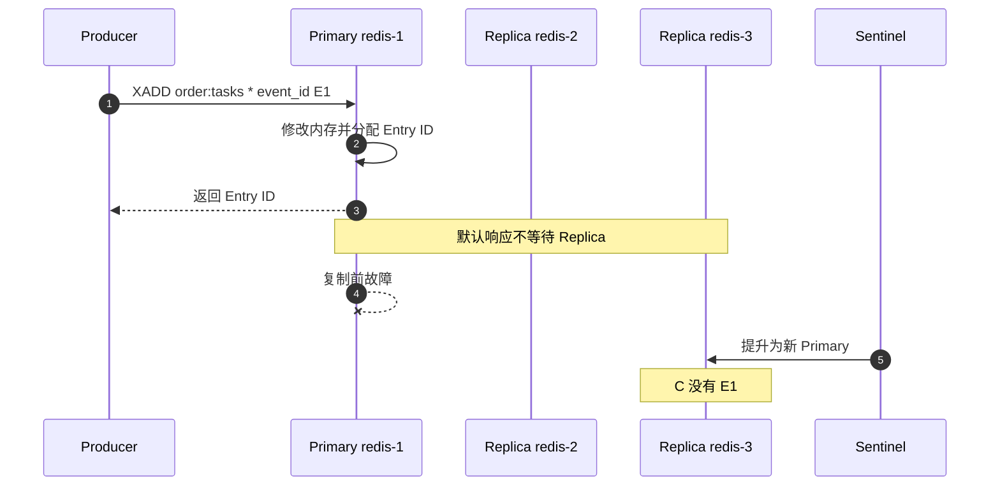

[第一篇](005_redis_streams.md)已经说明 Stream Key、Consumer Group、PEL 和 Sentinel 的职责。本文继续追踪 `order-1001`：XADD 修改了哪些数据，Primary 什么时候响应，WAIT/WAITAOF 增加了什么保证，以及切换后旧 Primary 的独有 Entry 为什么不会自动合并回来。

<!-- more -->

## 1. 一个 Stream Key 在 Redis 中保存什么

`order:tasks` 不是独立日志服务，而是 Redis Dataset 中的一个 Key。这个 Key 内部包含两部分状态：

- **Stream Entry 序列**：Entry ID、字段值以及用于范围查询的索引结构；
- **Consumer Group 状态**：`last-delivered-id`、Consumer、Group PEL、Consumer PEL、投递时间和次数。

XADD、XREADGROUP、XACK、XAUTOCLAIM 和 XTRIM 都是修改这一个 Key 的 Redis 命令。主从复制和 RDB/AOF 处理的是命令造成的数据集变化，不会为消息正文与 PEL 建立两套独立一致性协议。

### 1.1 Entry ID 不是业务幂等键

自动 ID 形如：

```text
1694066400000-0
```

它在当前 Stream Key 内单调递增，适合定位和范围读取。但 Producer 超时后再次使用 `*` 执行 XADD 会得到新 ID，Redis 会把它视为另一条 Entry。

所以消息中还应携带稳定的 `event_id`。若需要生产端原子去重，可使用额外去重 Key、Lua/Function 或显式 ID，但必须设计去重记录的生命周期和并发规则。

## 2. 持久化与复制是两条链路

Primary 执行 XADD 后，数据首先进入内存 Dataset。之后可能沿两条链路传播：

```text
本地持久化：
内存修改 → AOF 缓冲/文件 → fsync
         → 或等待下一次 RDB Snapshot

副本复制：
内存修改 → Replication Stream
         → Replica 接收并执行
         → Replica 自己按配置持久化
```

二者解决不同问题：

- AOF/RDB 决定当前节点进程重启后能恢复到哪里；
- Replica 决定当前 Primary 丢失后是否有其他节点可以接管；
- Sentinel 决定发生故障时提升哪个 Replica；
- 只有把写入、持久化、复制和选主放在一起，才能讨论“成功响应后是否会丢”。

### 2.1 AOF 与 RDB 的边界

- RDB 是某个时间点的快照，快照间的新写入可能尚未包含。
- AOF 记录数据变更，`appendfsync always`、`everysec`、`no` 对延迟和断电窗口有不同取舍。
- AOF 每秒刷盘不是“每条 XADD 返回前刷盘”。
- RDB/AOF 是节点本地恢复机制，不会阻止 Sentinel 选择一个缺少最新写入的 Replica。

## 3. 默认 XADD 为什么可能在切换后丢失

第一篇中 `redis-1` 是 Primary，`redis-2/3/4/5` 是 Replica。



Redis Open Source 复制默认异步。Primary 返回 Entry ID 时，客户端通常只能确认该 Primary 已执行命令，不能确认：

- 任意 Replica 已经收到；
- Primary 或 Replica 已 fsync；
- 未来被 Sentinel 选中的 Replica 一定包含该写入。

因此 Redis 正是“旧主已返回，但新主没有消息”的典型系统。

## 4. WAIT 与 WAITAOF 增加了什么

### 4.1 WAIT：等待副本收到复制流

Producer 必须在执行 XADD 的同一连接上调用：

```text
XADD order:tasks * event_id E1 order_id 1001
WAIT 1 1000
```

WAIT 表示等待指定数量 Replica 确认处理了该连接此前的写命令。客户端必须检查返回数量；超时返回 0 不会回滚已经执行的 XADD。

WAIT 能显著缩小“Primary 响应后尚无副本”的窗口，但不构成强一致共识：

- 确认写入的 Replica 可能在故障时不可用；
- Sentinel 的选主不是针对每一条写入执行多数派 Commit；
- WAIT 证明 Replica 收到，不等于其稳定介质已刷盘；
- 网络分区中仍可能出现旧 Primary 接受写入、最终被新历史覆盖。

### 4.2 WAITAOF：把 AOF 持久化加入等待条件

Redis 7.2+ 的 WAITAOF 可以等待当前连接此前写入在本地和指定数量 Replica 上达到 AOF 持久化条件。它比 WAIT 更接近“副本持久化确认”，但仍不改变 Sentinel/Cluster 的选主模型，也不会自动回滚超时命令。

因此应该把返回结果解释为：

```text
WAIT/WAITAOF 达标
= 当前这次调用观察到足够接收或持久化确认

不等于
= 已形成任何未来选主都必须保留的共识提交点
```

### 4.3 min-replicas-to-write 不是逐条 WAIT

`min-replicas-to-write` 与 `min-replicas-max-lag` 只检查最近是否有足够 Replica 保持在允许延迟内。它能在复制链路明显异常时拒绝写入，但不会等待每一条 XADD 到达指定 Replica。

它是可用性闸门，不是每条消息的同步提交协议。

## 5. 三个临界故障场景

### 5.1 Primary 已返回，消息尚未复制

结果在第 3 节已经明确：新 Primary 可能没有消息，客户端却已经看到成功。这是 Redis 异步复制允许的 RPO 窗口。

如果业务不能接受，需要在以下方案中做明确选择：

- 使用 WAIT/WAITAOF 缩小风险，并接受它仍非共识提交；
- 使用 Outbox/数据库事实作为可重放源；
- 改用能对每条写入提供多数派提交的消息系统。

### 5.2 消息已存在，但响应丢失

`XADD *` 已执行，Entry ID 响应在网络中丢失。Producer 重试会创建第二条 Entry：

```text
第一次：1694066400000-0 event_id=E1
重试：  1694066400123-0 event_id=E1
```

Redis Streams 不会根据业务字段自动去重。Consumer 必须按 `event_id=E1` 幂等；若 Producer 使用显式 Stream ID，还必须保证 ID 严格大于当前顶部 ID并处理并发冲突。

### 5.3 旧 Primary 恢复

假设旧 Primary A 独有 E1，而新 Primary C 已接受 E2、E3。A 恢复后不能把 E1 与 C 的历史自动合并：

1. Sentinel 把 A 配置为 C 的 Replica；
2. A 使用当前 Replication ID 与 Offset 尝试 PSYNC；
3. 能部分同步时追赶 C 的复制流，不能时执行全量同步；
4. A 的独有数据被当前 Primary 历史覆盖；
5. E1 不会自动重新 XADD 到新 Primary。

这不是 Bug，而是 Redis/Sentinel 的最终收敛规则：当前 Primary 的历史获胜。若 E1 必须找回，只能从业务 Outbox、审计日志或人工恢复副本中重放。

## 6. PEL 与消费状态在切换中如何恢复

XREADGROUP 和 XACK 也是写命令，Group 的 `last-delivered-id` 与 PEL 通过同一复制链路传播。

### 6.1 投递已返回，但 PEL 尚未复制

可能发生：

1. Primary 把 Entry 42 交给 Worker 2；
2. Primary 更新 PEL 并返回消息；
3. PEL 变化尚未复制时 Primary 故障；
4. 新 Primary 可能不知道这次投递。

Worker 仍可能完成业务，但新 Primary 会按照自己拥有的 Group 状态重新分发。结果是重复处理，而不是精确一次。

### 6.2 XACK 已返回，但新 Primary 没有 Ack

XACK 从旧 Primary 的 PEL 删除 Entry，但该状态未复制就发生切换，新 Primary 仍可能保留 Pending 状态。XAUTOCLAIM 或人工恢复会让消息再次处理。

所以即使 XADD 使用 WAIT，也不能推导出 XREADGROUP 与 XACK 自动拥有同样的复制等待；每个关键状态变化都要单独定义保证。

### 6.3 Worker 故障后的接管

正常情况下：

- XPENDING 用来观察 Pending Consumer、空闲时间和投递次数；
- XAUTOCLAIM 把空闲过久的 Entry 转给健康 Worker；
- Worker 处理成功后 XACK；
- 应用使用事件 ID 或业务唯一键保证重投安全。

如果 Stream Entry 已被 XTRIM/XDEL 删除，PEL 可能仍出现缺少正文的引用。保留策略必须覆盖最大处理与故障恢复时间，而不是只根据平均消费速度设置 MAXLEN。

## 7. 扩容、分片与热点

Redis Cluster 的分片单位是 Key，不是 Stream 内部 Entry。一个巨大的 `orders:events` 迁移时要整体迁移到新 Slot Owner，不会自动切成多个 Partition。

扩展吞吐需要应用预先设计多个 Key：

```text
orders:events:{0}
orders:events:{1}
orders:events:{2}
```

代价包括：

- 没有跨 Key 全局顺序；
- 每个 Key 都要创建 Group；
- Consumer 要同时轮询或阻塞读取多个 Key；
- Resharding 期间客户端必须处理 MOVED/ASK；
- 热 Key 仍可能让一个 Primary 成为瓶颈。

副本增加的是读扩展和故障接管候选，不提高 Stream Key 的写吞吐。

## 8. 运维与容量

需要同时观察：

- Primary 的复制 Offset、Replica Lag 和断链时间；
- Sentinel 当前 Master、Quorum、Failover Epoch 与 Tilt；
- AOF Rewrite、fsync 延迟、RDB Fork 和磁盘空间；
- Stream Length、最老 Entry、每个 Group Lag；
- PEL 数量、最老 Pending 空闲时间、Delivery Count；
- XADD/XREADGROUP/XACK 延迟与 WAIT 达标率。

容量不能只计算 Entry 正文，还要包括 Group、Consumer、PEL、AOF Rewrite 临时空间和主从全量同步成本。大 Stream Key 也会放大备份、迁移和故障恢复时间。

## 9. 实现结论

- Redis Streams 的消息、Group 和 PEL 都属于 Redis Dataset，使用相同的持久化与异步复制链路。
- 默认 XADD 成功不是副本提交点，切换后允许丢失已确认写入。
- WAIT/WAITAOF 可以提高安全性，但不把 Sentinel/Cluster 变成强一致共识系统。
- 旧 Primary 恢复后服从当前 Primary，独有 Entry 不会自动合并。
- PEL 提供任务接管，不提供外部业务精确一次。
- 单个 Stream Key 是顺序与吞吐边界；横向扩展必须由应用拆 Key。

## 10. 参考资料

- [Redis Streams](https://redis.io/docs/latest/develop/data-types/streams/)
- [Redis Replication](https://redis.io/docs/latest/operate/oss_and_stack/management/replication/)
- [Redis WAIT](https://redis.io/docs/latest/commands/wait/)
- [Redis WAITAOF](https://redis.io/docs/latest/commands/waitaof/)
- [Redis Sentinel](https://redis.io/docs/latest/operate/oss_and_stack/management/sentinel/)
- [Redis Persistence](https://redis.io/docs/latest/operate/oss_and_stack/management/persistence/)
- [Redis Cluster Specification](https://redis.io/docs/latest/operate/oss_and_stack/reference/cluster-spec/)
