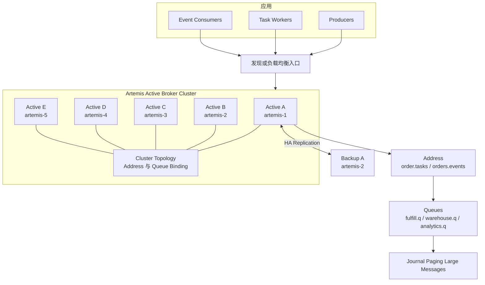
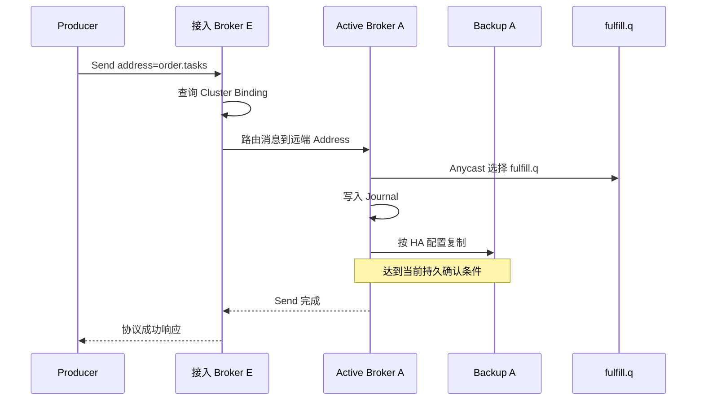
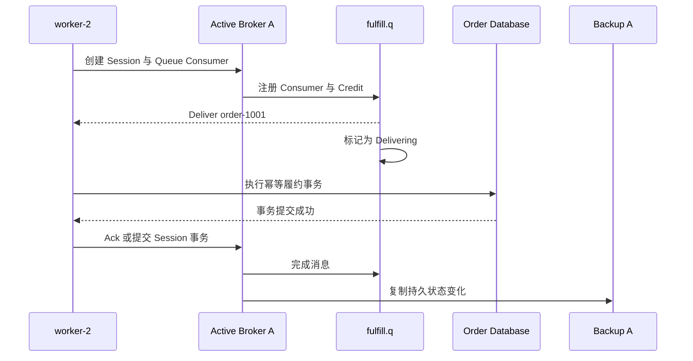
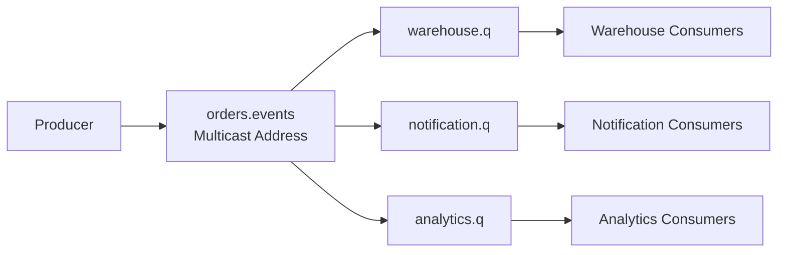

Artemis 的核心不是先选择“Topic 或 Queue”，而是 Producer 把消息发送到 Address，再由 Routing Type 把消息放进一个或多个绑定 Queue。真正保存积压、分配 Consumer 和处理 Ack 的实体是 Queue。

本文用五节点部署和两个订单示例说明 Address、Queue、Anycast、Multicast、Broker Cluster 与 HA Pair 的关系。Journal、Paging、复制确认和故障恢复见[实现篇](008_activemq_artemis_implementation.md)。

<!-- more -->

## 1. 五节点生产部署

Artemis 的 Cluster 与 HA 是两个概念：

- Cluster 让多个 Active Broker 交换拓扑和路由消息；
- HA Pair 让一个 Backup 接管某个 Active Broker 的本地 Queue 与 Journal。

本例在五台物理服务器上运行五个 Active Broker，并为每个 Active 在另一台机器部署 Backup 实例。为了突出订单示例，只展开 Broker A 的 HA Pair：

| 节点 | IP | 示例角色 |
|---|---|---|
| `artemis-1` | `10.0.0.11` | Active Broker A |
| `artemis-2` | `10.0.0.12` | Active Broker B + Broker A 的 Backup |
| `artemis-3` | `10.0.0.13` | Active Broker C |
| `artemis-4` | `10.0.0.14` | Active Broker D |
| `artemis-5` | `10.0.0.15` | Active Broker E |

其他 Active 的 Backup 可以按相同方式交叉放置。一个物理节点运行多个 Broker 实例时必须隔离端口、数据目录和资源；高负载生产环境也可以使用独立 Backup 主机。

### 1.1 完整生产架构



这张图表达四个边界：

- Broker Cluster 不是一条五副本共识日志，每条 Queue 属于具体 Active Broker。
- Backup A 只备份 Active A 的数据，不替其他四个 Active 保存一份完整消息。
- Producer 发送到 Address，Consumer 连接并消费 Queue。
- Cluster Connection 可以把消息转给远端 Queue；最终存储和投递仍由 Queue 所在 Active Broker负责。

### 1.2 Artemis 保存的四类数据

- **Broker 与路由拓扑**
  - 解决的问题：集群有哪些 Broker、远端有哪些 Address/Queue Binding，消息应该路由到哪里。
  - 保存组件：Broker 配置、服务端发现和 Cluster Connection 运行状态。
  - 一致性特点：Artemis Cluster 交换拓扑和 Binding 信息，但不是一个覆盖所有 Broker 配置的全局 Raft Metadata Store。

- **Address 与 Queue 定义**
  - 解决的问题：Producer 的目标是什么，使用 Anycast 还是 Multicast，最终绑定哪些 Queue。
  - 保存组件：承载资源的 Broker 配置和持久化 Binding 数据；HA Backup 接收对应 Active 的状态。
  - 语义特点：Address 负责路由，Queue 负责保存消息。

- **消息与投递状态**
  - 解决的问题：Queue 中有哪些 Ready、Delivering、Scheduled、Paged 消息，以及哪些已经 Ack。
  - 保存组件：Active Broker 的 Journal、Paging Store 和内存 Queue 状态；大消息还使用 Large Message 文件。
  - HA 机制：Replication 模式把 Active 的持久状态复制给配对 Backup；Shared Store 模式则让两者访问同一共享存储。

- **客户端会话状态**
  - 解决的问题：Connection、Session、Consumer、Credit 和事务当前是什么状态。
  - 保存组件：当前 Active Broker 的运行时对象；持久 Queue 和已提交消息不随客户端断开消失。
  - 故障含义：连接故障后客户端重连或 Failover，尚未完成的投递可能重新出现。

## 2. 示例一：订单履约任务

创建：

```text
Address:      order.tasks
Routing Type: Anycast
Queue:        fulfill.q
Active Broker: A / artemis-1
Backup Broker: A-backup / artemis-2
Consumers:    worker-1 / worker-2 / worker-3
```

Anycast 表示一条发送只选择一个匹配 Queue。本例只有 `fulfill.q`，因此所有任务都进入它；三个 Worker 在 Queue 内竞争消息。

### 2.1 初始化后各组件保存什么

- Active A 保存 `order.tasks` Address 定义、Anycast Routing Type 和 `fulfill.q` Queue Binding。
- Cluster Topology 让其他 Active 知道 Broker A 上存在可达的 `fulfill.q` Binding。
- Backup A 接收 Active A 的持久配置和 Journal 状态，但正常情况下不对业务客户端提供该 Queue。
- Queue 初始没有消息，也没有 Delivering 状态。
- Worker 建立连接前不存在 Consumer 运行状态。

Address 是 Producer 使用的逻辑目标；Queue 才是实际积压和消费实体；Anycast 决定一条消息只进入一个匹配 Queue。

### 2.2 Producer 生产消息的完整过程

假设 Producer 连接 Active E，但 Queue 位于 Active A：



1. Producer 通过 AMQP、Core、JMS 或其他协议连接一个可达 Active Broker。
2. 接入 Broker 根据 Address 和集群 Binding 发现目标 Queue 位于 Active A。
3. 消息经 Cluster Connection 路由到 Active A。
4. Active A 对 `order.tasks` 执行 Anycast，选择 `fulfill.q`。
5. Queue 接管消息，Active A 按持久化和 HA 配置写 Journal、复制给 Backup。
6. 达到当前协议与持久配置的成功条件后，结果返回 Producer。

Producer 成功只表示 Broker 已接管消息，不表示 Worker 已完成业务。不同客户端协议对同步发送、事务和确认的 API 表达不同，但服务端最终仍落到 Address → Queue。

### 2.3 Consumer 有哪些状态

- **Connection 与 Session**：Worker 连接哪个 Active、使用什么协议、事务和确认模式。
- **Consumer 定义**：目标 Queue、Selector、Priority、是否 Browse 和可用 Credit。
- **Queue 投递状态**：哪些消息 Ready，哪些正在交给哪个 Consumer，是否 Redelivered。
- **协议 Delivery 标识**：AMQP Delivery Tag、Core/JMS Ack 上下文，只在当前会话范围有效。
- **持久完成状态**：Ack 或事务提交后，Queue 才能持久推进消息状态。

这里没有 Kafka 式 Consumer Group Offset。同一 Queue 上的 Consumer 天然竞争；需要多个业务各处理一次时必须建立多条 Queue。

### 2.4 Consumer 消费消息的完整过程

三个 Worker 使用 Broker A 的 HA 连接地址，当前建立到 Active A：



1. Consumer 最终必须在能够服务 `fulfill.q` 的 Active A 上创建 Queue Consumer；它不会从 NameServer 式组件读取消息。
2. Queue 按 Consumer Credit 和调度策略选择 Worker 2，把消息从 Ready 变成 Delivering。
3. Worker 完成业务事务后 Ack，或在事务 Session 中提交。
4. Broker 完成 Queue 状态，并按 HA 配置同步必要状态。
5. Worker 或连接在 Ack 前故障时，消息可以重新投递。
6. 业务成功但 Ack/Commit 丢失仍可能重复，因此必须幂等。

## 3. 示例二：订单事件广播

创建：

```text
Address:      orders.events
Routing Type: Multicast
Queues:
  warehouse.q
  notification.q
  analytics.q
```

Producer 只向 `orders.events` 发送一次。Multicast 为每个匹配 Queue 各路由一份消息；三条 Queue 分别保存积压、Consumer 和 Ack 状态。



仓储 Ack 只完成 `warehouse.q` 中的副本，不影响另外两条 Queue。所谓发布订阅最终仍落在多条 Queue 上；如果三个服务连接同一 Queue，它们会竞争而不是各收一份。

JMS Topic、AMQP Address 和 Core Address 是不同 API/协议视角。分析服务端行为时，应回到 Address、Routing Type 和 Queue 三个对象。

## 4. 从两个示例归纳语义边界

- Address 是 Producer 的发送目标，Queue 是消息存储与 Consumer 分配实体。
- Anycast 把一次发送交给一个匹配 Queue，适合任务；Multicast 复制路由到每个匹配 Queue，适合广播。
- 同一 Queue 上多个 Consumer 竞争；多个业务各需要一份时应建立多条 Queue。
- Broker Cluster 解决多 Active 的拓扑和消息路由，HA Pair 解决一个 Active 的数据接管，二者不能混为一谈。
- Producer 成功、Consumer 收到、业务事务成功和 Ack/Session Commit 是不同时间点。
- Artemis 可以提供事务和多协议语义，但不会自动把远端数据库事务纳入 Broker 原子提交。

Artemis 适合 AMQP/JMS、多协议、丰富路由、事务和传统企业消息场景。它的扩展单位接近 Broker、Address 和 Queue，不应按 Kafka 分区日志理解。

## 5. 客户端连接路径总结

```text
生产：
Producer → 任一可达 Active Broker
         → Address 与 Cluster Binding 路由
         → 目标 Queue 所在 Active Broker
         → 配对 Backup

消费：
Consumer → 目标 Queue 所在 Active Broker
         → Queue Deliver
         → Ack / Session Commit
```

Backup 不参与正常消费。Active 故障后，客户端 Failover 到接管该数据的 Backup。

## 6. 下一篇解决的实现问题

以下内容见[Artemis 实现篇](008_activemq_artemis_implementation.md)：

- Journal、Paging 和 Large Message 如何保存数据；
- Shared Store 与 Replication HA 的差异；
- Active 何时可以向 Producer 确认；
- Active 故障后 Backup 如何接管；
- 旧 Active 恢复和 Split Brain 如何处理。

## 7. 参考资料

- [Artemis Address Model](https://activemq.apache.org/components/artemis/documentation/latest/address-model.html)
- [Artemis Core Architecture](https://activemq.apache.org/components/artemis/documentation/latest/architecture.html)
- [Artemis Clusters](https://activemq.apache.org/components/artemis/documentation/latest/clusters.html)
- [Artemis High Availability](https://activemq.apache.org/components/artemis/documentation/latest/ha.html)
