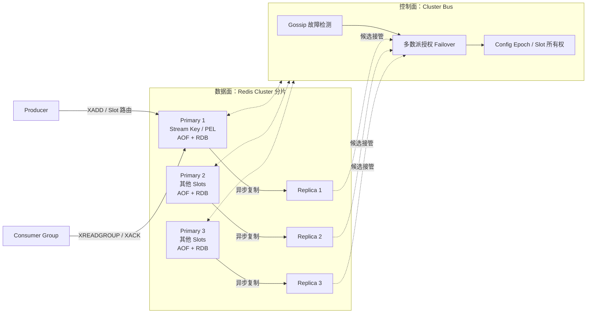

Redis Stream 是 Redis Key 对应的追加日志，不是独立的分布式消息集群。它复用 Redis 的持久化、复制、Sentinel 和 Cluster，因此队列可靠性完全受 Redis 高可用语义约束。

<!-- more -->

## 1. 完整架构

有两种常见形态：

- 不分片：一个 Master、至少一个 Replica、3 个 Sentinel；适合容量和吞吐能由单主承担的场景；
- 分片：Redis Cluster 至少 3 个 Master，每主至少一个 Replica，形成常见的 6 节点基线。



AOF/RDB 决定本机重启后还剩什么，Replica 决定主节点故障后由谁接管，Cluster Bus 决定谁有权接管。三者职责不同，而且都不会把异步复制变成每条写入的多数派共识。

## 2. 如何分区并保证顺序

Redis Cluster 把 Key 映射到 16384 个 Hash Slot，但一个 Stream Key 整体只位于一个 Master，不会在内部切成多个 Partition。要并行分片，应用必须创建多个 Stream Key：

```text
orders:{0}
orders:{1}
orders:{2}
```

Producer 用业务 Key 计算目标 Stream。每个 Stream 的 Entry ID 单调递增，`XRANGE/XREAD` 按 ID 顺序读取，但多个 Stream 之间没有全局顺序。

Consumer Group 用一个 `last-delivered-id` 分发新消息，并为每个消费者维护 PEL。多个 Consumer 会并发处理不同 Entry，因此只能保证分发位置推进，不能保证业务完成顺序。严格顺序需要单 Consumer 串行处理和 Ack；故障后用 `XAUTOCLAIM` 接管未确认消息，并接受至少一次带来的重复。

不要用 Hash Tag 把所有 Stream 都固定到同一 Slot，否则虽然方便多 Key 原子操作，却失去了分片能力。

## 3. 多副本一致性

Redis Open Source 主从复制默认异步：Master 执行写入并响应客户端，同时把命令流发送给 Replica。Replica 可能落后，故障切换时最近的已确认写入仍可能丢失。

`WAIT` 可以等待指定数量 Replica 确认接收，显著降低丢失概率，但官方明确说明它不会把 Redis 变成强一致 CP 系统。`WAITAOF` 还能等待本地/副本 AOF 刷盘，但可用性、延迟和客户端超时需要单独设计。

Redis Cluster 使用 Gossip、故障投票和 Config Epoch 决定 Slot 所属 Master；它不对每条 Stream Entry 执行多数派共识。若业务要求“已确认消息在任意单节点故障后绝不丢”，应慎重选择 Redis Streams。

## 4. 故障修复与 Resharding

### 4.1 临界故障时间线

Redis 正是问题中“主节点已响应，但消息尚未同步到从节点”的典型案例：

1. Client 对 Master A 执行 `XADD`。
2. A 在内存中修改 Stream，并立即返回 Entry ID；默认不会等待 Replica B。
3. A 还没把该命令传播给 B 就故障；Sentinel/Cluster 把 B 提升为新 Master。
4. Client 已经收到成功，但 B 没有这条 Entry，因此消息永久丢失。
5. A 恢复后不能把自己的 Entry 合并进 B。它会被配置为 B 的 Replica，通过 PSYNC 或全量同步接受 B 的历史；A 独有的消息被覆盖，不会自动“补回”新 Master。

`min-replicas-to-write` 只检查最近有多少 Replica 的延迟没有超过阈值，不会等待每一次 `XADD` 到达 Replica，因此仍有丢失窗口。客户端可在同一连接上执行 `XADD` 后调用 `WAIT 1 timeout`，等待一个 Replica 确认收到此前写入；Redis 7.2+ 的 `WAITAOF` 还可等待 AOF 持久化。它们显著降低风险，但官方明确说明 Redis 仍不是强一致 CP 系统，复杂 Failover 中已确认写入仍可能丢失。

另一个窗口是 `XADD` 已复制但响应丢失：Client 不知道消息是否存在。自动生成的 Stream ID 使盲目重试容易产生第二条 Entry；关键消息应携带业务事件 ID，并由消费者用唯一键幂等。若必须从生产端去重，可使用固定、单调 Stream ID 或额外去重键/Lua，但要处理 ID 约束、原子性和过期策略。

复制链路短暂中断后优先执行 PSYNC：Replica 根据 Replication ID 和 Offset 请求缺失命令。若 Backlog 已覆盖不到缺口，则执行全量同步：Master 生成 RDB、传给 Replica，再发送期间积累的命令。

Master 故障时，Sentinel 或 Cluster 选一个 Replica 提升为新 Master，其他 Replica 改为跟随它，客户端刷新拓扑。旧 Master 恢复后作为 Replica 全量或部分同步，不能直接恢复为 Master 接受旧数据上的写入。

Cluster 扩缩容是迁移 Hash Slot 中的 Key。迁移一个 Stream Key 时整个 Key 迁走，不会把其内部 Entry 拆开。在线 Resharding 期间客户端必须正确处理 `MOVED/ASK`，并避免把高流量大 Stream 当成容易迁移的小 Key。

Cluster 的 Replica Migration 可把富余 Replica 自动迁给没有副本的 Master，提高后续故障容忍度，但它不复制新的数据分片，也不代替备份。

## 5. 适用边界

Redis Streams 适合已有 Redis、消息量中小、保留期短、允许少量数据风险并能实现幂等的系统。关键事件总线、长积压或需要独立扩展分区时，专用消息队列通常更稳妥。

## 6. 参考资料

- [Redis Streams](https://redis.io/docs/latest/develop/data-types/streams/)
- [Redis Replication](https://redis.io/docs/latest/operate/oss_and_stack/management/replication/)
- [Redis WAIT](https://redis.io/docs/latest/commands/wait/)
- [Redis WAITAOF](https://redis.io/docs/latest/commands/waitaof/)
- [Scale with Redis Cluster](https://redis.io/docs/latest/operate/oss_and_stack/management/scaling/)
- [Redis Cluster Specification](https://redis.io/docs/latest/operate/oss_and_stack/reference/cluster-spec/)
- [Redis Sentinel](https://redis.io/docs/latest/operate/oss_and_stack/management/sentinel/)
